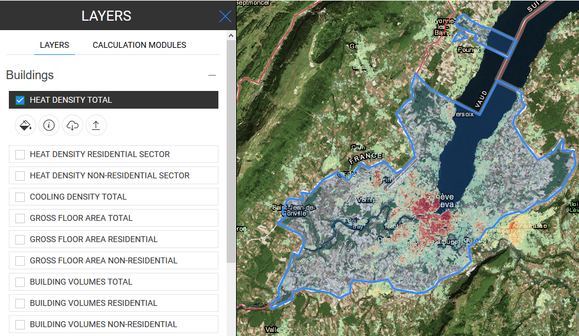
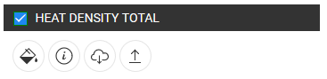

<h2> Tartalomjegyzék </h2><ul><li> <a href="#Introduction">Bevezetés</a> </li><li> <a href="#How-to-export-a-dataset">Hogyan exportálhatunk egy adatkészletet?</a> </li><li> <a href="#References">Irodalom</a> </li><li> <a href="#How-to-cite">Hogyan lehet idézni</a> </li><li> <a href="#Authors-and-reviewers">Szerzők és áttekintők</a> </li><li> <a href="#Acknowledgement">Elismerés</a> </li></ul><h2> Bevezetés </h2>
 A Hotmaps eszközkészlet lehetővé teszi, hogy bárki exportálhasson egy réteg / adatkészlet egy részét. 

 Ez a szolgáltatás alapvető ismereteket igényel a kiválasztás és a rétegek vonatkozásában. 

 Ha bármilyen nehézsége van, kérjük, olvassa el a következő útmutatásokat: 
<ul><li> <a href="hu-How-to-select-a-region-in-the-Hotmaps-toolbox">Hogyan válasszunk ki egy régiót a Hotmaps eszközkészletben</a> </li><li> <a href="hu-Layer-section">Rétegválasztás</a> </li></ul>
<ins> <code><strong><a href="#table-of-contents">To Top</a></strong></code> </ins> 
<h2> Hogyan exportálhatunk egy adatkészletet? </h2><ol><li>
 Válassza ki az exportálni kívánt réteget a rétegek listájában (bal oldali panel) 
</li><li>
 Válassza ki a választási skálát a térkép jobb oldalán (NUTS / LAU / hektár) 
</li><li>
 Válassza ki a kívánt régiót a kiválasztó eszközökkel 
</li><li>
 Ha a kiválasztás rendben van, kattintson a gombra  gombot a réteg neve alatt a bal oldali panelen a letöltési folyamat elindításához. 

</li><li>
 Ha kész, akkor .tif fájlt fog kapni a számítógépére 
</li></ol>
 A fenti lépések elvégzése után az egyik réteg exportálásra kerül. 

 Akkor, akkor használd a saját eszközök, és még szerkeszteni, hogy importálja vissza a platform (lásd <a href="Data_upload">adatokat feltölteni</a> az utalások, hogyan kell csinálni). 

<ins> <code><strong><a href="#table-of-contents">To Top</a></strong></code> </ins> 
<h2> Irodalom </h2>
<ins> <code><strong><a href="#table-of-contents">To Top</a></strong></code> </ins> 
<h2> Hogyan lehet idézni </h2>
<ins> <code><strong><a href="#table-of-contents">To Top</a></strong></code> </ins> 
<h2> Szerzők és áttekintők </h2>
 Szerzői: 
<ul><li> Daniel Hunacek </li><li> Lucien Zuber </li></ul>
 bírálók: 

<ins> <code><strong><a href="#table-of-contents">To Top</a></strong></code> </ins> 
<h2> Elismerés </h2>
 Szeretnénk <a href="https://www.hotmaps-project.eu">kifejezni</a> legmélyebb elismerésünket a Horizont 2020 <a href="https://www.hotmaps-project.eu">Hotmaps projekthez</a> (támogatási megállapodás száma 723677), amely finanszírozást nyújtott a jelen vizsgálat elvégzéséhez 

<ins> <code><strong><a href="#table-of-contents">To Top</a></strong></code> </ins> 

This page was automatically translated. View in another language:

[English](en-Data-export-functionalities) (original) [Bulgarian](bg-Data-export-functionalities)\* [Croatian](hr-Data-export-functionalities)\* [Czech](cs-Data-export-functionalities)\* [Danish](da-Data-export-functionalities)\* [Dutch](nl-Data-export-functionalities)\* [Estonian](et-Data-export-functionalities)\* [Finnish](fi-Data-export-functionalities)\* [French](fr-Data-export-functionalities)\* [German](de-Data-export-functionalities)\* [Greek](el-Data-export-functionalities)\*  [Irish](ga-Data-export-functionalities)\* [Italian](it-Data-export-functionalities)\* [Latvian](lv-Data-export-functionalities)\* [Lithuanian](lt-Data-export-functionalities)\* [Maltese](mt-Data-export-functionalities)\* [Polish](pl-Data-export-functionalities)\* [Portuguese (Portugal, Brazil)](pt-Data-export-functionalities)\* [Romanian](ro-Data-export-functionalities)\* [Slovak](sk-Data-export-functionalities)\* [Slovenian](sl-Data-export-functionalities)\* [Spanish](es-Data-export-functionalities)\* [Swedish](sv-Data-export-functionalities)\*
\*: machine translated
