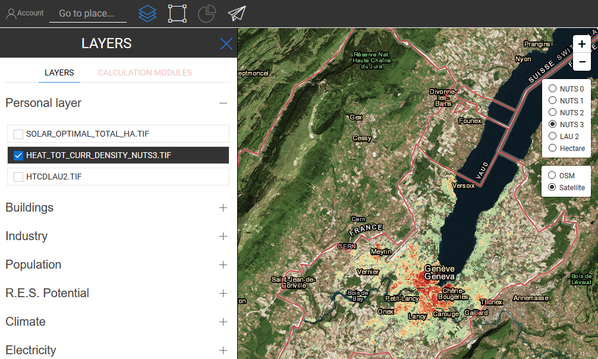

<h1><a class="anchor" id="data-upload-functionalities" href="#data-upload-functionalities"><i class="fa fa-link"></i></a>Adatfeltöltési funkciók</h1><h2><a class="anchor" id="table-of-contents" href="#table-of-contents"><i class="fa fa-link"></i></a> Tartalomjegyzék</h2><ul><li> <a href="#introduction">Bevezetés</a></li><li> <a href="#how-to-upload-a-layer-with-custom-data">Egy réteg feltöltése egyéni adatokkal</a></li><li> <a href="#how-to-display-an-uploaded-layer">A feltöltött réteg megjelenítése</a></li><li> <a href="#offline-mode">Offline mód</a></li><li> <a href="#data-security-and-privacy">Adatvédelem és adatvédelem</a></li><li> <a href="#how-to-cite">Hogyan lehet idézni</a></li><li> <a href="#authors-and-reviewers">Szerzők és lektorok</a></li><li> <a href="#license">Engedély</a></li><li> <a href="#acknowledgement">Elismerés</a></li></ul><h2><a class="anchor" id="introduction" href="#introduction"><i class="fa fa-link"></i></a> Bevezetés</h2>
 A platform lehetővé teszi egyedi adatok feltöltését a számítógépről a Hotmaps felhasználói fiókba. Ez a rész szorosan kapcsolódik az <a href="Data-export-functionalities">exportáláshoz,</a> mivel e két funkció végső célja az adatok exportálása, szerkesztése és későbbi megjelenítése az eszköztárban az adatok visszahozatalával. Felhívjuk figyelmét, hogy a feltöltött adatok vizualizálhatók, és bizonyos számuk felhasználható a számítási modulokban.

 Ehhez a művelethez <strong>felhasználói fiók szükséges</strong> . A regisztráció és a bejelentkezés folyamata a következő oldalon található: <a href="Introduction-to-user-interface#Connect">Felhasználói fiók</a> .

 A feltöltött adatoknak tiszteletben kell tartaniuk az eszköztár által meghatározott adatformátumokat és vetületeket. Annak biztosítása érdekében, hogy megfelelő adatsort töltsön fel, bármikor letölthet egy minta adatot az eszköztárból egy kis területre, majd később frissítheti és kitöltheti saját adataival. CSV-fájlok esetén győződjön meg arról, hogy az összes oszlopot, oszlopelválasztót és adattípust megőrzi a letöltött mintától. ** Javasoljuk, hogy a CSV fájlokat az MS Excel helyett szövegszerkesztőben nyissa meg, hogy az összes karakter látható legyen benne. &quot;A raszteres fájlok feltöltését illetően a következő szempontokat kell figyelembe venni:
<ol><li> A raszternek rendelkeznie kell az <strong>ETRS89-Extended / LAEA Europe</strong> koordinátarendszerrel <strong>- EPSG: 3035</strong> ;</li><li> A raszter eredetének (a raszter bal felső sarkában) koordinátájának 100 szorzónak kell lennie, pl. (4334900, 3019700);</li><li> A raszteres térkép felbontásának 100x100m-nek kell lennie;</li><li> A raszternek egy európai helyszínre kell utalnia.</li><li> figyeljen az eredeti adatkészlet eszköztáron látható egységeire. Például a hősűrűség-térkép <em>MWh / ha</em> mértékegységgel rendelkezik, és ha a feltöltött rétegnek van másik egysége, akkor nehézségekbe ütközhet az adatok megjelenítése. Továbbá nem kap helyes választ a számítási modulokból.</li></ol>
 <a href="#table-of-contents"><strong><code>To Top</code></strong></a>
<h2><a class="anchor" id="how-to-upload-a-layer-with-custom-data" href="#how-to-upload-a-layer-with-custom-data"><i class="fa fa-link"></i></a> Egy réteg feltöltése egyéni adatokkal</h2>
 A gomb megnyomásával gombra az oldal bal felső sarkában. Ezzel a profiloldal kerül az elejére.

 A profil oldalon:
<ol><li> az adatsor típusának kiválasztása,</li><li> a feltöltendő fájl kiválasztása (.tif vagy .csv),</li><li> feltöltéshez kattintson a &quot;+&quot; ikonra</li></ol>
 Az adatkészlet típusának kiválasztása a helyes szimbólum megszerzése érdekében történik. Ha az adatkészlet nem felel meg a rétegszimbólumnak, akkor nem jelenik meg megfelelően.

 Ha ez megtörtént, megjelenik egy sikerüzenet, és a réteg megjelenik a profiloldal fólialistájában.

 Minden felhasználónak korlátozott a lemezterülete, ha a felhasználónak nincs elegendő szabad helye, nem fog tudni további fájlokat hozzáadni. A felhasználói fiókjában fennmaradó hely a kördiagramon látható.

 Mielőtt megjelenítheti a réteget a térképen, a szervernek a sikerüzenet után egy kis időre (a fájl méretétől függően akár több percre) is szüksége lesz az adatkészlet helyes importálásához. Az adatkészlet akkor jeleníthető meg, ha méretét frissíti a felhasználói fiókban.

 A réteg most megjeleníthető a térképen, aktiválva azt a rétegek panelen.

 <a href="#table-of-contents"><strong><code>To Top</code></strong></a>
<h2><a class="anchor" id="how-to-display-an-uploaded-layer" href="#how-to-display-an-uploaded-layer"><i class="fa fa-link"></i></a> A feltöltött réteg megjelenítése</h2>
 A rétegre kattintva megjeleníthet egy olyan réteget, amelyet korábban a rétegek panelről töltöttek fel gomb.

 A feltöltött rétegek listája a bal panel tetején található &quot;Személyes rétegek&quot; részben jelenik meg.

 Egy réteg megjeleníthető a bal oldali panelen történő aktiválásával.

 <a href="#table-of-contents"><strong><code>To Top</code></strong></a>
<h2><a class="anchor" id="offline-mode" href="#offline-mode"><i class="fa fa-link"></i></a> Offline mód</h2>
 Ha ki van jelentkezve, akkor nem férhet hozzá egyetlen személyes rétegéhez sem, de a bejelentkezés után továbbra is elérhetők.

 <a href="#table-of-contents"><strong><code>To Top</code></strong></a>
<h2><a class="anchor" id="data-security-and-privacy" href="#data-security-and-privacy"><i class="fa fa-link"></i></a> Adatvédelem és adatvédelem</h2>
 A Hotmaps eszköztár biztonságot nyújt azoknak a felhasználóknak, akik fiókot hoznak létre a platformon. Szokásos biztonsági intézkedéseket hajtottak végre: HTTPS protokoll, jelszó-hash / sózás és így tovább. Felhívjuk azonban a figyelmet, hogy a feltöltött adatkészleteket egyelőre nem titkosítják a szerveren. Ezért kérjük, kerülje az érzékeny adatok feltöltését.

 <a href="#table-of-contents"><strong><code>To Top</code></strong></a>
<h2><a class="anchor" id="how-to-cite" href="#how-to-cite"><i class="fa fa-link"></i></a> Hogyan lehet idézni</h2>
 Daniel Hunacek és Lucien Zuber, a Hotmaps Wikiben, Adatfeltöltési funkciók (2020. szeptember)

 <a href="#table-of-contents"><strong><code>To Top</code></strong></a>
<h2><a class="anchor" id="authors-and-reviewers" href="#authors-and-reviewers"><i class="fa fa-link"></i></a> Szerzők és lektorok</h2>
 Ezt az oldalt Daniel Hunacek és Lucien Zuber ( <strong><a href="https://www.hevs.ch">HES-SO</a></strong> ) írták.

 ☑ Ezt az oldalt Mostafa Fallahnejad ( <strong><a href="https://eeg.tuwien.ac.at/">EEG - TU Wien</a></strong> ) vizsgálta felül.

 <a href="#table-of-contents"><strong><code>To Top</code></strong></a>
<h2><a class="anchor" id="license" href="#license"><i class="fa fa-link"></i></a> Engedély</h2>
 Copyright © 2016-2020: Daniel Hunacek és Lucien Zuber

 Creative Commons Attribution 4.0 nemzetközi licenc

 Ez a munka a Creative Commons CC BY 4.0 nemzetközi licenc alatt van licencelve.

 SPDX-licenc-azonosító: CC-BY-4.0

 Licenc-szöveg: https://spdx.org/licenses/CC-BY-4.0.html

 <a href="#table-of-contents"><strong><code>To Top</code></strong></a>
<h2><a class="anchor" id="acknowledgement" href="#acknowledgement"><i class="fa fa-link"></i></a> Elismerés</h2>
 Szeretnénk a legnagyobb elismerésünket <a href="https://www.hotmaps-project.eu">kifejezni</a> a Horizon 2020 <a href="https://www.hotmaps-project.eu">Hotmaps projektnek</a> (támogatási szerződés száma 723677), amely finanszírozást nyújtott a jelen vizsgálat elvégzéséhez

 <a href="#table-of-contents"><strong><code>To Top</code></strong></a>

<!--- THIS IS A SUPER UNIQUE IDENTIFIER -->

This page was automatically translated. View in another language:

[English](../en/Data-upload-functionalities) (original) [Bulgarian](../bg/Data-upload-functionalities)\* [Czech](../cs/Data-upload-functionalities)\* [Danish](../da/Data-upload-functionalities)\* [German](../de/Data-upload-functionalities)\* [Greek](../el/Data-upload-functionalities)\* [Spanish](../es/Data-upload-functionalities)\* [Estonian](../et/Data-upload-functionalities)\* [Finnish](../fi/Data-upload-functionalities)\* [French](../fr/Data-upload-functionalities)\* [Irish](../ga/Data-upload-functionalities)\* [Croatian](../hr/Data-upload-functionalities)\*  [Italian](../it/Data-upload-functionalities)\* [Lithuanian](../lt/Data-upload-functionalities)\* [Latvian](../lv/Data-upload-functionalities)\* [Maltese](../mt/Data-upload-functionalities)\* [Dutch](../nl/Data-upload-functionalities)\* [Polish](../pl/Data-upload-functionalities)\* [Portuguese (Portugal, Brazil)](../pt/Data-upload-functionalities)\* [Romanian](../ro/Data-upload-functionalities)\* [Slovak](../sk/Data-upload-functionalities)\* [Slovenian](../sl/Data-upload-functionalities)\* [Swedish](../sv/Data-upload-functionalities)\* 

\* machine translated
