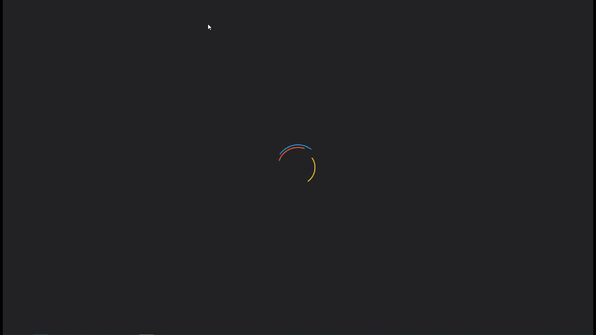
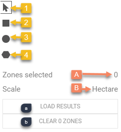

<h1><a class="anchor" id="introduction-to-user-interface" href="#introduction-to-user-interface"><i class="fa fa-link"></i></a>Bevezetés a felhasználói felületbe</h1><h2><a class="anchor" id="table-of-contents" href="#table-of-contents"><i class="fa fa-link"></i></a> Tartalomjegyzék</h2><ul><li>
 <a href="#introduction-page">Bevezetõ oldal</a>
</li><li>
 <a href="#upper-toolbar">Felső eszköztár</a>
<ul><li> <a href="#upper-toolbar_connect">Csatlakozás</a><ul><li> <a href="#upper-toolbar_connect_login">Belépés</a></li><li> <a href="#upper-toolbar_connect_register">Regisztráció</a></li><li> <a href="#upper-toolbar_connect_recover">Visszaszerez</a></li></ul></li><li> <a href="#upper-toolbar_go-to-place">Menj a Helyre</a></li><li> <a href="#upper-toolbar_layers">Rétegek</a></li><li> <a href="#upper-toolbar_selection-tools">Kiválasztó eszközök</a></li><li> <a href="#upper-toolbar_show-result">Eredmény megjelenítése</a></li><li> <a href="#upper-toolbar_feedback">Visszacsatolás</a></li><li> <a href="#upper-toolbar_save-session">Munkamenet mentése</a></li><li> <a href="#upper-toolbar_save-session-folder">Munkamenet mappa mentése</a></li></ul></li><li>
 <a href="#tiles">Csempék</a>
</li><li>
 <a href="#how-to-cite">Hogyan lehet idézni</a>
</li><li>
 <a href="#authors-and-reviewers">Szerzők és lektorok</a>
</li><li>
 <a href="#license">Engedély</a>
</li><li>
 <a href="#acknowledgement">Elismerés</a>
</li></ul><h2><a class="anchor" id="introduction-page" href="#introduction-page"><i class="fa fa-link"></i></a> Bevezetõ oldal</h2>
 Az eszköztár megnyitása után megjelenik a felelősséget kizáró oldal. A felelősség kizárásáról szóló üzenet mellett további információkat nyújt a támogatott böngészőkről, a Hotmaps projekt célkitűzéseiről, a Hotmaps projekt webhelyére mutató linkről és az adattárakról.

 <em>1. ábra A Hotmaps eszköztár rövid bemutatása</em>

 A Hotmaps GUI egy GIS-alapú felület. A kizáró oldal bezárásával a felhasználó meglátja Európa térképét. Alapértelmezés szerint az EU-28 országok hőigényének sűrűségi térképét és a NUTS 2 határokat ábrázolják. Ezen a két térképen kívül néhány eszköz és gomb látható a GUI-ban. Ezeket az eszközöket a következő ábra szemlélteti.

 <em>2. ábra Kezdő oldal</em>

 Itt láthatja első pillantásra a felhasználói felület 3 részét:
<ol><li> <a href="#upper-toolbar">egy eszköztár a bal felső sarokban</a> ,</li><li> maga a térkép,</li><li> <a href="#tiles">néhány eszköz a térkép stílusának megváltoztatásához</a> .</li><li> két link a jobb felső sarokban: erre a <a href="https://wiki.hotmaps.eu/">Hotmaps Wikire</a> és a <a href="https://www.hotmaps-project.eu/">Hotmaps Project webhelyre</a> .</li></ol>
 A következő fejezetekben az első 3 pont részletesen ismertetésre kerül.

 <a href="#table-of-contents"><strong><code>To Top</code></strong></a>
<h2><a class="anchor" id="upper-toolbar" href="#upper-toolbar"><i class="fa fa-link"></i></a> Felső eszköztár</h2>

 Ezen az eszköztáron:
<ol><li> <a href="#upper-toolbar_connect"><em>Csatlakozás:</em></a> regisztráljon és jelentkezzen be a webalkalmazásba a munkája mentése érdekében,</li><li> <a href="#upper-toolbar_go-to-place"><em>Helyre ugrás:</em></a> nagyítson egy adott régióba a név beírásával,</li><li> <a href="#upper-toolbar_layers"><em>Rétegek:</em></a> a réteg oldalsávjának megjelenítése,</li><li> <a href="#upper-toolbar_selection-tools"><em>Selection Tools</em> :</a> engedélyezi vagy letiltja a kijelölési eszközöket,</li><li> <a href="#upper-toolbar_show-result"><em>Eredmény</em></a> megjelenítése <a href="#upper-toolbar_show-result"><em>:</em></a> a kiválasztott régiók eredménysávjának megjelenítése,</li><li> <a href="#upper-toolbar_feedback"><em>Visszajelzés:</em></a> adjon visszajelzést az eszközről,</li><li> <a href="#upper-toolbar_save-session"><em>Munkamenet mentése:</em></a> elmentheti a kijelölt rétegeket és a nagyítási szintet, majd később meghívhatja őket,</li><li> <a href="#upper-toolbar_save-session-folder"><em>Munkamenet mappa mentése:</em></a> ahol megtekintheti az összes mentett munkamenet listáját.</li></ol>
 <a href="#table-of-contents"><strong><code>To Top</code></strong></a>
<h3><a class="anchor" id="connect" href="#connect"><i class="fa fa-link"></i></a> Csatlakozás</h3>
 Itt a következőket teheti:
<ul><li> Hozzon létre egy fiókot</li><li> Jelentkezzen be fiókjába a haladás mentéséhez</li><li> Vagy állítsa vissza a jelszavát, ha elfelejtette</li></ul>
 <a href="#table-of-contents"><strong><code>To Top</code></strong></a>
<h4><a class="anchor" id="login" href="#login"><i class="fa fa-link"></i></a> Belépés</h4>
 A <a href="#register">regisztráció</a> és a fiók aktiválása után képesnek kell lennie az e-mail <a href="#fig4">címével</a> és a jelszavával bejelentkezni (lásd az alábbi <a href="#fig4">4.</a> ábrát).

 <em>4. ábra: Bejelentkezés űrlap</em>

 <a href="#table-of-contents"><strong><code>To Top</code></strong></a>
<h4><a class="anchor" id="register" href="#register"><i class="fa fa-link"></i></a> Regisztráció</h4>
 Itt létrehozhat egy fiókot a <em>hotmaps</em> webhelyhez. Miután feladta a <a href="#fig5">formában</a> kapni fog egy e-mailt a fiók aktiválása. Fiókjával menteni tudja az előrehaladást.

 <em>5. ábra: Regisztrációs űrlap</em>

 <a href="#table-of-contents"><strong><code>To Top</code></strong></a>
<h4><a class="anchor" id="recover" href="#recover"><i class="fa fa-link"></i></a> Visszaszerez</h4>
 Ha valaha elfelejtette jelszavát, akkor ebben a menüben helyreállíthatja (lásd az alábbi <a href="#fig6">6.</a> ábrát). Ne feledje, hogy utána állítson be új jelszót.

 <em>6. ábra: Visszaállítási forma</em>

 <a href="#table-of-contents"><strong><code>To Top</code></strong></a>
<h3><a class="anchor" id="go-to-place" href="#go-to-place"><i class="fa fa-link"></i></a> Menj a Helyre</h3>
 Nagyíthat egy megadott régióra a nevének beírásával (lásd az alábbi animációt)

 <a href="#table-of-contents"><strong><code>To Top</code></strong></a>
<h3><a class="anchor" id="layers" href="#layers"><i class="fa fa-link"></i></a> Rétegek</h3>
 Ennek a gombnak a megnyomásával a bal oldalon egy különféle rétegű oldalsáv jelenik meg.

 A következő rétegek megtalálhatók és vizualizálhatók:

 <a href="#table-of-contents"><strong><code>To Top</code></strong></a>
<h3><a class="anchor" id="selection-tools" href="#selection-tools"><i class="fa fa-link"></i></a> Kiválasztó eszközök</h3>
 A gomb megnyomásával a kiválasztó eszközök megjelennek a képernyő bal oldalán

 Az alábbi ábra az eszközök megjelenését mutatja:

<ol><li> Eszköz a régiók kiválasztásához</li><li> Hozzon létre egy egyedi négyzet alakú régiót</li><li> Hozzon létre egy egyéni körzetet</li><li> Hozzon létre egy egyedi sokszög régiót</li><li> Töltsön fel egy GeoJSON objektumot egy egyedi terület kiválasztásához</li></ol><ol type="A"><li> megmutatja, hogy hány régiót választott ki</li><li> mutatja a legkisebb téglalap teljes felületét, amely be tudja fedni a kiválasztott területet</li><li> a jobb oldali eszköztárból kiválasztott méretarányt mutatja</li></ol><ol type="a"><li> gomb a kiválasztott régió és kiválasztott rétegek eredményeinek betöltéséhez</li><li> gomb a kiválasztott régió törléséhez</li></ol>
 <a href="#table-of-contents"><strong><code>To Top</code></strong></a>
<h3><a class="anchor" id="show-result" href="#show-result"><i class="fa fa-link"></i></a> Eredmény megjelenítése</h3>
 A kiválasztott rétegektől és régiótól függően a konfiguráció eredményei a képernyő jobb oldalán található oldalsávon jelennek meg

 <a href="#table-of-contents"><strong><code>To Top</code></strong></a>
<h3><a class="anchor" id="feedback" href="#feedback"><i class="fa fa-link"></i></a> Visszacsatolás</h3>
 Van javaslata az eszköz továbbfejlesztésére? Észrevett valamilyen hibát? Kérjük add tudtunkra! Visszajelzés megadásával segíthet javítani az eszköztárat!

 Kérjük, töltse ki az alábbi <a href="#Fig7">űrlapot</a> :

 <a href="#table-of-contents"><strong><code>To Top</code></strong></a>

 a következő típusok közül választhat:

 és állítson prioritást:

 <a href="#table-of-contents"><strong><code>To Top</code></strong></a>
<h3><a class="anchor" id="save-session" href="#save-session"><i class="fa fa-link"></i></a> Munkamenet mentése</h3>
 ennek a gombnak a megnyomásával pillanatfelvételt készíthet munkájáról (kiválasztott területek és rétegek, nagyítási szintek stb.). Megadhatja a pillanatkép nevét és leírását is.
<h3><a class="anchor" id="save-session-folder" href="#save-session-folder"><i class="fa fa-link"></i></a> Munkamenet mappa mentése</h3>
 Itt láthatja az összes pillanatképét a nevükkel és a leírásukkal együtt. Ha kiválaszt egyet, a kiválasztott rétegek, területek, a nagyítási szint és más konfigurációk betöltődnek.
<h2><a class="anchor" id="tiles" href="#tiles"><i class="fa fa-link"></i></a> Csempék</h2>
 Kiválaszthatja az elemezni kívánt területi méretarányt (NUTS régiók vagy hektárszint), és beállíthatja a térkép csempéjét

 A következő konfigurációk lehetségesek

<ol><li> Nagyítás és kicsinyítés a térképen</li><li> Mutassa meg a NUTS-határokat az adott NUTS-régiók kiválasztásához, vagy használja a hektárt a <a href="#upper-toolbar_selection-tools">választás</a> testreszabásához</li><li> Használjon OpenStreetMap vagy Satellite csempét</li></ol>
 <a href="#table-of-contents"><strong><code>To Top</code></strong></a>
<h2><a class="anchor" id="how-to-cite" href="#how-to-cite"><i class="fa fa-link"></i></a> Hogyan lehet idézni</h2>
 Jeton Hasani, a Hotmaps-Wiki alkalmazásban, Bevezetés a felhasználói felülethez (2019. április)

 <a href="#table-of-contents"><strong><code>To Top</code></strong></a>
<h2><a class="anchor" id="authors-and-reviewers" href="#authors-and-reviewers"><i class="fa fa-link"></i></a> Szerzők és lektorok</h2>
 Ezt az oldalt Jeton Hasani <strong><a href="https://eeg.tuwien.ac.at/">EEG - TU Wien</a></strong> írta.

 ☑ Ezt az oldalt a Mostafa Fallahnejad <strong><a href="https://eeg.tuwien.ac.at/">EEG - TU Wien ellenőrizte</a></strong> .

 <a href="#table-of-contents"><strong><code>To Top</code></strong></a>
<h2><a class="anchor" id="license" href="#license"><i class="fa fa-link"></i></a> Engedély</h2>
 Copyright © 2016-2020: Jeton Hasani

 Creative Commons Attribution 4.0 nemzetközi licenc

 Ez a munka a Creative Commons CC BY 4.0 nemzetközi licenc alatt van licencelve.

 SPDX-licenc-azonosító: CC-BY-4.0

 Licenc-szöveg: https://spdx.org/licenses/CC-BY-4.0.html

 <a href="#table-of-contents"><strong><code>To Top</code></strong></a>
<h2><a class="anchor" id="acknowledgement" href="#acknowledgement"><i class="fa fa-link"></i></a> Elismerés</h2>
 Szeretnénk a legnagyobb elismerésünket <a href="https://www.hotmaps-project.eu">kifejezni</a> a Horizon 2020 <a href="https://www.hotmaps-project.eu">Hotmaps projektnek</a> (támogatási szerződés száma 723677), amely finanszírozást nyújtott a jelen vizsgálat elvégzéséhez.

 <a href="#table-of-contents"><strong><code>To Top</code></strong></a>

<!--- THIS IS A SUPER UNIQUE IDENTIFIER -->

This page was automatically translated. View in another language:

[English](../en/Introduction-to-user-interface) (original) [Bulgarian](../bg/Introduction-to-user-interface)\* [Czech](../cs/Introduction-to-user-interface)\* [Danish](../da/Introduction-to-user-interface)\* [German](../de/Introduction-to-user-interface)\* [Greek](../el/Introduction-to-user-interface)\* [Spanish](../es/Introduction-to-user-interface)\* [Estonian](../et/Introduction-to-user-interface)\* [Finnish](../fi/Introduction-to-user-interface)\* [French](../fr/Introduction-to-user-interface)\* [Irish](../ga/Introduction-to-user-interface)\* [Croatian](../hr/Introduction-to-user-interface)\*  [Italian](../it/Introduction-to-user-interface)\* [Lithuanian](../lt/Introduction-to-user-interface)\* [Latvian](../lv/Introduction-to-user-interface)\* [Maltese](../mt/Introduction-to-user-interface)\* [Dutch](../nl/Introduction-to-user-interface)\* [Polish](../pl/Introduction-to-user-interface)\* [Portuguese (Portugal, Brazil)](../pt/Introduction-to-user-interface)\* [Romanian](../ro/Introduction-to-user-interface)\* [Slovak](../sk/Introduction-to-user-interface)\* [Slovenian](../sl/Introduction-to-user-interface)\* [Swedish](../sv/Introduction-to-user-interface)\* 

\* machine translated
