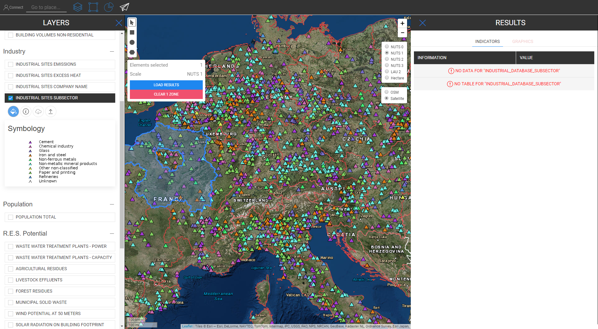

<h1><a class="anchor" id="retrieve-indicators-of-a-selected-area" href="#retrieve-indicators-of-a-selected-area"><i class="fa fa-link"></i></a>A kijelölt terület mutatóinak lekérése</h1><h2><a class="anchor" id="table-of-contents" href="#table-of-contents"><i class="fa fa-link"></i></a> Tartalomjegyzék</h2><ul><li> <a href="#introduction">Bevezetés</a></li><li> <a href="#indicators-for-raster-layers">A raszter rétegek mutatói</a><ul><li> <a href="#indicators-for-raster-layers_buildings">Épületek</a></li><li> <a href="#indicators-for-raster-layers_population">Népesség</a></li><li> <a href="#indicators-for-raster-layers_renewable-energy-source-potentials">Megújuló energiaforrások lehetőségei</a></li></ul></li><li> <a href="#indicators-for-vector-layers">A vektorrétegek mutatói</a><ul><li> <a href="#indicators-for-vector-layers_industry">Ipar</a></li><li> <a href="#indicators-for-vector-layers_renewable-energy-source-potentials">Megújuló energiaforrások lehetőségei</a></li><li> <a href="#indicators-for-vector-layers_electricity">Elektromosság</a></li></ul></li><li> <a href="#example">Példa</a></li><li> <a href="#how-to-cite">Hogyan lehet idézni</a></li><li> <a href="#authors-and-reviewers">Szerzők és lektorok</a></li><li> <a href="#license">Engedély</a></li><li> <a href="#acknowledgement">Elismerés</a></li></ul><h2><a class="anchor" id="introduction" href="#introduction"><i class="fa fa-link"></i></a> Bevezetés</h2>
 A kiválasztott rétegektől és régiótól függően a konfigurációhoz tartozó indikátorok a képernyő jobb oldalán található oldalsávon jelennek meg

 <a href="#table-of-contents"><strong><code>To Top</code></strong></a>

 A következőkben megnézzük azokat a mutatókat, amelyek a raszter- és a vektorrétegekhez jelennek meg.
<h2><a class="anchor" id="indicators-for-raster-layers" href="#indicators-for-raster-layers"><i class="fa fa-link"></i></a> A raszter rétegek mutatói</h2>
 A raszter rétegek mutatói eltérnek a vektor rétegektől. A másikkal az összesítést és a bontást értjük. Ez az eltérő viselkedés a területi határozatokból fakad.

 A raszter rétegek felbontása általában sokkal nagyobb, míg a vektorrétegeknek csak pontokban vagy sokszögekben vannak attribútumai.

 Ez egyrészt azt jelenti, hogy például ha egy NUTS3 sokszög által definiált vektorréteget választunk, és például egy LAU régiót akarunk kiválasztani, akkor a NUTS3 értéket nem bontjuk LAU szintre, hanem a NUTS3 indikátort, ahol ez A LAU régiója megjelenik az eredmények oldalsávján.

 Másrészt a raszterrétegeket &quot;önkényesen&quot; összesítik és bontják *

 * a kiválasztott régióban lévő cellákkal (természetesen a raszter felbontás határán belül)

 <a href="#table-of-contents"><strong><code>To Top</code></strong></a>
<h3><a class="anchor" id="buildings" href="#buildings"><i class="fa fa-link"></i></a> Épületek</h3>
 <strong>Hő sűrűség térkép</strong>

 <strong>Extra funkció</strong>

 Ha egyszerre választja ki a hősűrűségi réteget és a népességréteget, akkor egy extra mutató jelenik meg (lásd az alábbi képet)

 <a href="#table-of-contents"><strong><code>To Top</code></strong></a>
<h3><a class="anchor" id="in-general-" href="#in-general-"><i class="fa fa-link"></i></a> Általánosságban:</h3>
 Ha az egyik épületréteget és a népességréteget egyszerre választja ki, akkor egy extra mutató jelenik meg a fent leírtak szerint

<ins> <code><strong><a href="#indicators-for-raster-layers">To Chapter</a></strong></code></ins>

 <strong>Hűtési sűrűség térkép</strong>

<ins> <code><strong><a href="#indicators-for-raster-layers">To Chapter</a></strong></code></ins>

 <strong>Építési kötetek</strong>

<ins> <code><strong><a href="#indicators-for-raster-layers">To Chapter</a></strong></code></ins>

 <strong>Bruttó alapterület</strong>

<ins> <code><strong><a href="#indicators-for-raster-layers">To Chapter</a></strong></code></ins> <a href="#table-of-contents"><strong><code>To Top</code></strong></a>
<h3><a class="anchor" id="population" href="#population"><i class="fa fa-link"></i></a> Népesség</h3>

<ins> <code><strong><a href="#indicators-for-raster-layers">To Chapter</a></strong></code></ins> <a href="#table-of-contents"><strong><code>To Top</code></strong></a>
<h3><a class="anchor" id="climate" href="#climate"><i class="fa fa-link"></i></a> Éghajlat</h3>
 <strong>Hőfok</strong>

<ins> <code><strong><a href="#indicators-for-raster-layers">To Chapter</a></strong></code></ins>

 <strong>Hűtési fok napok</strong>

<ins> <code><strong><a href="#indicators-for-raster-layers">To Chapter</a></strong></code></ins>

 <strong>Fűtési fok napok</strong>

<ins> <code><strong><a href="#indicators-for-raster-layers">To Chapter</a></strong></code></ins>

 <strong>Napsugárzás</strong>

<ins> <code><strong><a href="#indicators-for-raster-layers">To Chapter</a></strong></code></ins>

 <strong>Szélsebesség</strong>

<ins> <code><strong><a href="#indicators-for-raster-layers">To Chapter</a></strong></code></ins> <a href="#table-of-contents"><strong><code>To Top</code></strong></a>
<h3><a class="anchor" id="renewable-energy-source-potentials" href="#renewable-energy-source-potentials"><i class="fa fa-link"></i></a> Megújuló energiaforrások lehetőségei</h3>
 <strong>Napsugárzás az épület lábnyomán</strong>

<ins> <code><strong><a href="#indicators-for-raster-layers">To Chapter</a></strong></code></ins>

 <strong>Szélpotenciál 50m-nél</strong>

<ins> <code><strong><a href="#indicators-for-raster-layers">To Chapter</a></strong></code></ins>

 <strong>Erdei maradványok</strong>

<ins> <code><strong><a href="#indicators-for-raster-layers">To Chapter</a></strong></code></ins> <a href="#table-of-contents"><strong><code>To Top</code></strong></a>
<h2><a class="anchor" id="indicators-for-vector-layers" href="#indicators-for-vector-layers"><i class="fa fa-link"></i></a> A vektorrétegek mutatói</h2><h3><a class="anchor" id="industry" href="#industry"><i class="fa fa-link"></i></a> Ipar</h3>
 <strong>Ipari telephelyek kibocsátása</strong>

<ins> <code><strong><a href="#indicators-for-vector-layers">To Chapter</a></strong></code></ins>

 <strong>Ipari telephelyen túlzott hő</strong>

<ins> <code><strong><a href="#indicators-for-vector-layers">To Chapter</a></strong></code></ins>

 <strong>Ipari telephely vállalati neve</strong>

<ins> <code><strong><a href="#indicators-for-vector-layers">To Chapter</a></strong></code></ins>

 <strong>Ipari telephely alszektor</strong>

<ins> <code><strong><a href="#indicators-for-vector-layers">To Chapter</a></strong></code></ins> <a href="#table-of-contents"><strong><code>To Top</code></strong></a>
<h3><a class="anchor" id="renewable-energy-source-potentials" href="#renewable-energy-source-potentials"><i class="fa fa-link"></i></a> Megújuló energiaforrások lehetőségei</h3>
 <strong>Szennyvíztisztító telepek teljesítménye</strong>

<ins> <code><strong><a href="#indicators-for-vector-layers">To Chapter</a></strong></code></ins>

 <strong>Szennyvíztisztító telepek kapacitása</strong>

<ins> <code><strong><a href="#indicators-for-vector-layers">To Chapter</a></strong></code></ins>

 <strong>Mezőgazdasági maradványok</strong>

<ins> <code><strong><a href="#indicators-for-vector-layers">To Chapter</a></strong></code></ins>

 <strong>Állattenyésztési szennyvizek</strong>

<ins> <code><strong><a href="#indicators-for-vector-layers">To Chapter</a></strong></code></ins>

 <strong>Települési szilárd hulladék</strong>

<ins> <code><strong><a href="#indicators-for-vector-layers">To Chapter</a></strong></code></ins>

 <strong>Geotermikus potenciális hővezető képesség</strong>

<ins> <code><strong><a href="#indicators-for-vector-layers">To Chapter</a></strong></code></ins> <a href="#table-of-contents"><strong><code>To Top</code></strong></a>
<h3><a class="anchor" id="electricity" href="#electricity"><i class="fa fa-link"></i></a> Elektromosság</h3>
 <strong>Villamos energia C02 kibocsátás</strong>

<ins> <code><strong><a href="#indicators-for-vector-layers">To Chapter</a></strong></code></ins> <a href="#table-of-contents"><strong><code>To Top</code></strong></a>
<h2><a class="anchor" id="example" href="#example"><i class="fa fa-link"></i></a> Példa</h2>
 Az alábbi képen láthatja, hogyan néz ki, amikor minden réteget megjelenít (itt van Ausztria, a NUTS0 kiválasztva)

 Bár ez a térkép első látásra kissé zavarónak tűnhet, mutatóit egyenesen szemléltetik. Ha az összes réteget kiválasztja Ausztriához (NUTS0), tekintse meg az eredményjelző sávban leírt összes mutatót

 <a href="#table-of-contents"><strong><code>To Top</code></strong></a>
<h2><a class="anchor" id="how-to-cite" href="#how-to-cite"><i class="fa fa-link"></i></a> Hogyan lehet idézni</h2>
 Jeton Hasani, a Hotmaps-Wiki webhelyen, A kiválasztott terület mutatóinak letöltése (2019. április)

 <a href="#table-of-contents"><strong><code>To Top</code></strong></a>
<h2><a class="anchor" id="authors-and-reviewers" href="#authors-and-reviewers"><i class="fa fa-link"></i></a> Szerzők és lektorok</h2>
 Ezt az oldalt Jeton Hasani <strong><a href="https://eeg.tuwien.ac.at/">EEG - TU Wien</a></strong> írta.

 ☑ Ezt az oldalt a Mostafa Fallahnejad <strong><a href="https://eeg.tuwien.ac.at/">EEG - TU Wien ellenőrizte</a></strong> .

 <a href="#table-of-contents"><strong><code>To Top</code></strong></a>
<h2><a class="anchor" id="license" href="#license"><i class="fa fa-link"></i></a> Engedély</h2>
 Copyright © 2016-2020: Jeton Hasani

 Creative Commons Attribution 4.0 nemzetközi licenc

 Ez a munka a Creative Commons CC BY 4.0 nemzetközi licenc alatt van licencelve.

 SPDX-licenc-azonosító: CC-BY-4.0

 Licenc-szöveg: https://spdx.org/licenses/CC-BY-4.0.html

 <a href="#table-of-contents"><strong><code>To Top</code></strong></a>
<h2><a class="anchor" id="acknowledgement" href="#acknowledgement"><i class="fa fa-link"></i></a> Elismerés</h2>
 Szeretnénk a legnagyobb elismerésünket <a href="https://www.hotmaps-project.eu">kifejezni</a> a Horizon 2020 <a href="https://www.hotmaps-project.eu">Hotmaps projektnek</a> (támogatási szerződés száma 723677), amely finanszírozást nyújtott a jelen vizsgálat elvégzéséhez.

 <a href="#table-of-contents"><strong><code>To Top</code></strong></a> <code><a href="Indicator-Section/_edit">Review this page</a></code>

<!--- THIS IS A SUPER UNIQUE IDENTIFIER -->

This page was automatically translated. View in another language:

[English](../en/Retrieve-indicators-of-a-selected-area) (original) [Bulgarian](../bg/Retrieve-indicators-of-a-selected-area)\* [Czech](../cs/Retrieve-indicators-of-a-selected-area)\* [Danish](../da/Retrieve-indicators-of-a-selected-area)\* [German](../de/Retrieve-indicators-of-a-selected-area)\* [Greek](../el/Retrieve-indicators-of-a-selected-area)\* [Spanish](../es/Retrieve-indicators-of-a-selected-area)\* [Estonian](../et/Retrieve-indicators-of-a-selected-area)\* [Finnish](../fi/Retrieve-indicators-of-a-selected-area)\* [French](../fr/Retrieve-indicators-of-a-selected-area)\* [Irish](../ga/Retrieve-indicators-of-a-selected-area)\* [Croatian](../hr/Retrieve-indicators-of-a-selected-area)\*  [Italian](../it/Retrieve-indicators-of-a-selected-area)\* [Lithuanian](../lt/Retrieve-indicators-of-a-selected-area)\* [Latvian](../lv/Retrieve-indicators-of-a-selected-area)\* [Maltese](../mt/Retrieve-indicators-of-a-selected-area)\* [Dutch](../nl/Retrieve-indicators-of-a-selected-area)\* [Polish](../pl/Retrieve-indicators-of-a-selected-area)\* [Portuguese (Portugal, Brazil)](../pt/Retrieve-indicators-of-a-selected-area)\* [Romanian](../ro/Retrieve-indicators-of-a-selected-area)\* [Slovak](../sk/Retrieve-indicators-of-a-selected-area)\* [Slovenian](../sl/Retrieve-indicators-of-a-selected-area)\* [Swedish](../sv/Retrieve-indicators-of-a-selected-area)\* 

\* machine translated
