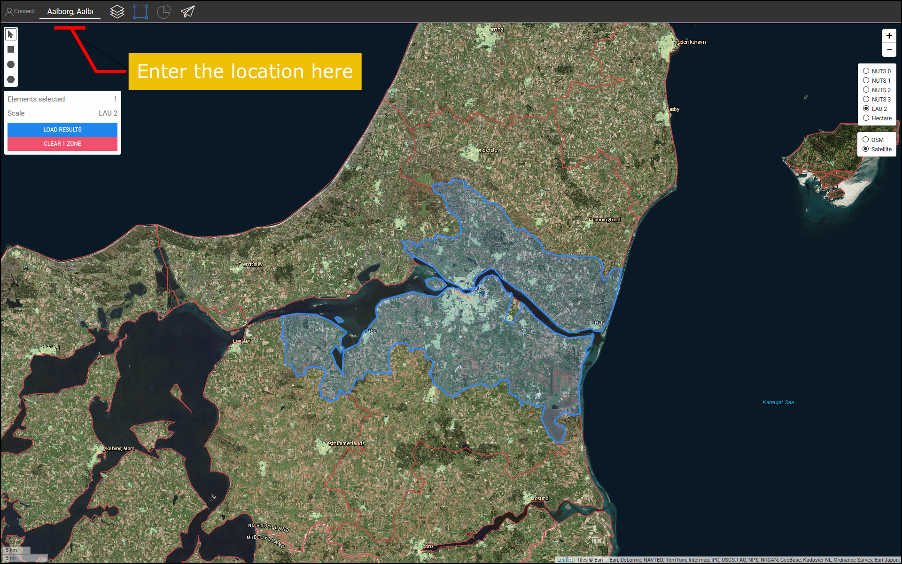

<h1> <a class="anchor" id="cm-district-heating-potential-areas-user-defined-thresholds" href="#cm-district-heating-potential-areas-user-defined-thresholds"><i class="fa fa-link"></i></a> CM Zone di potenziale teleriscaldamento soglie definite dall&#39;utente </h1><h2> <a class="anchor" id="table-of-contents" href="#table-of-contents"><i class="fa fa-link"></i></a> Sommario </h2><ul><li> <a href="#in-a-glance">In uno sguardo</a> </li><li> <a href="#introduction">introduzione</a> </li><li> <a href="#inputs-and-outputs">Ingressi e uscite</a> </li><li> <a href="#method">Metodo</a> </li><li> <a href="#github-repository-of-this-calculation-module">Repository GitHub di questo modulo di calcolo</a> </li><li> <a href="#sample-run">Esempio di corsa</a> <ul><li> <a href="#sample-run_test-run-1-default-input-values">Test Run 1: valori di input predefiniti</a> </li><li> <a href="#sample-run_test-run-2-modified-input-values">Test Run 2: valori di input modificati</a> </li></ul></li><li> <a href="#how-to-cite">Come citare</a> </li><li> <a href="#authors-and-reviewers">Autori e revisori</a> </li><li> <a href="#license">Licenza</a> </li><li> <a href="#acknowledgement">Riconoscimento</a> </li></ul><h2> <a class="anchor" id="in-a-glance" href="#in-a-glance"><i class="fa fa-link"></i></a> In uno sguardo </h2>
 Questo modulo di calcolo calcola il potenziale di teleriscaldamento all&#39;interno della regione selezionata utilizzando 2 valori di soglia: 1) Richiesta di calore minima in ogni ettaro, 2) Richiesta di calore minima in un&#39;area DH. Le aree all&#39;interno della regione selezionata che soddisfano queste condizioni vengono restituite come aree DH. Inoltre, la domanda di calore in queste regioni viene restituita sotto forma di indicatori come potenziale DH. 

 <a href="#table-of-contents"><strong><code>To Top</code></strong></a> 
 <h2> <a class="anchor" id="introduction" href="#introduction"><i class="fa fa-link"></i></a> introduzione </h2>
 La richiesta di calore gioca un ruolo importante nella determinazione delle potenziali aree di teleriscaldamento (DH). Ad esempio, l&#39;implementazione del teleriscaldamento in aree con bassa domanda di calore non è economicamente sostenibile. D&#39;altra parte, anche definire un&#39;area con un&#39;elevata densità di richiesta di calore come potenziale area DH può essere imprecisa. Un&#39;elevata densità di richiesta di calore in un&#39;area potrebbe essere dovuta alla presenza di pochi consumatori con una richiesta di calore molto elevata all&#39;interno di quella zona. Al contrario, una bassa densità di richiesta di calore media potrebbe essere un segno di zone con una richiesta di calore molto bassa all&#39;interno dell&#39;area selezionata. Lo scopo del modulo di calcolo &quot;CM - AREA POTENZIALE DI RISCALDAMENTO DISTRETTUALE: SOGLIA DEFINITA DALL&#39;UTENTE&quot; è quello di fornire un ragionevole equilibrio tra la densità della domanda di calore in un&#39;area e le zone che lo costituiscono. 

 La &quot;CM - AREA POTENZIALE DI RISCALDAMENTO DISTRETTUALE: SOGLIA DEFINITA DALL&#39;UTENTE&quot; determina le aree DH e il loro potenziale DH corrispondente in base alle densità di richiesta di calore. Le densità della richiesta di calore sono ottenute da uno strato GIS di input. La casella degli strumenti e il database Hotmaps forniscono una <strong><a href="https://gitlab.com/hotmaps/heat/heat_tot_curr_density">mappa della densità di calore predefinita</a></strong> che può essere utilizzata in questo modulo di calcolo. La mappa della densità del calore Hotmaps è in formato raster e ha una risoluzione di un ettaro e il sistema di riferimento delle coordinate (CRS) di &quot; <em><em>ETRS89 / LAEA Europe - EPSG 3035</em></em> &quot;. Le celle nella mappa mostrano le densità di calore in <em><strong>MWh / ha</strong></em> . Oltre a questa mappa predefinita, anche le mappe generate dall&#39;utente possono essere caricate nella casella degli strumenti e utilizzate in questo CM. 

 Come output, vengono presentati un livello GIS, tre indicatori e due diagrammi. Questi output sono spiegati in dettaglio nella sezione <a href="#sample-run">Sample Run</a> . Il livello di output mostra le potenziali aree DH. Cliccando su ciascuna area della mappa, si apre una finestra e viene mostrato il potenziale DH corrispondente a quell&#39;area. All&#39;interno delle finestre INDICATORI / GRAFICA nella sezione RISULTATI del toolbox, sono illustrati i relativi indicatori e grafici relativi al potenziale DH all&#39;interno della zona selezionata e ai potenziali nelle sottozone. 

 <a href="#table-of-contents"><strong><code>To Top</code></strong></a> 
 <h2> <a class="anchor" id="inputs-and-outputs" href="#inputs-and-outputs"><i class="fa fa-link"></i></a> Ingressi e uscite </h2>
 I parametri e i livelli di input, nonché i parametri e i livelli di output, sono i seguenti. 

 <strong>I livelli di input e i parametri sono:</strong> 
<ul><li> Richiesta termica minima in ogni ettaro [ <em><strong>MWh / ha</strong></em> ]: un valore compreso tra <em><em>0</em></em> e <em><em>1000</em></em> </li><li> Richiesta di calore minima in una zona DH [ <em><strong>GWh / anno</strong></em> ]: un valore compreso tra <em><em>0</em></em> e <em><em>500</em></em> </li><li> Mappa della densità di calore: una mappa predefinita è fornita nella casella degli strumenti; le proprie mappe caricate possono essere utilizzate anche nel CM <ul><li> in formato raster (* .tif) </li><li> con risoluzione di 1 ettaro </li><li> densità della domanda in <em><strong>MWh / ha</strong></em> </li></ul></li></ul>
 <strong>I livelli e i parametri di output sono:</strong> 
<ul><li> Aree DH nei formati raster e shapefile </li><li> Potenziale DH in ciascuna area DH [ <em><strong>GWh / anno</strong></em> ] (fare clic sulla mappa) </li><li> Richiesta di calore totale in GWh all&#39;interno della zona selezionata </li><li> Potenziale totale di teleriscaldamento in GWh all&#39;interno della zona selezionata </li><li> Quota potenziale di teleriscaldamento dalla domanda totale nella zona selezionata </li></ul>
 <a href="#table-of-contents"><strong><code>To Top</code></strong></a> 
 <h2> <a class="anchor" id="method" href="#method"><i class="fa fa-link"></i></a> Metodo </h2>
 Il potenziale di DH in una regione specifica può essere definito dalla domanda complessiva di calore e dalla sua allocazione spaziale. Nella casella degli strumenti Hotmaps, la richiesta di calore è rappresentata sotto forma di una mappa raster. Per definire correttamente le potenziali aree DH, sia la richiesta di calore in ogni cella che in un&#39;area dovrebbe raggiungere un certo livello. Come punto di partenza, la casella degli strumenti Hotmaps suggerisce i valori predefiniti per questi due parametri. Tuttavia, a seconda della distribuzione della richiesta di calore e anche delle condizioni locali, l&#39;utente Hotmaps può modificare questi valori. 

 La determinazione delle aree DH avviene in due fasi: 

 Nella prima fase vengono filtrate tutte le celle con richiesta di calore inferiore al parametro di ingresso &quot;Richiesta di calore minima in ettaro&quot;. Eliminando queste celle dalla mappa, otteniamo gruppi di celle attaccate l&#39;una all&#39;altra. Ciascun insieme di queste celle attaccate costituisce piccole zone che qui vengono chiamate &quot;aree coerenti&quot;. Nella seconda fase, viene calcolata la richiesta di calore totale in ciascuna area coerente. Per ogni area coerente, se la richiesta di calore totale è superiore al parametro di input &quot;Richiesta di calore minima in un&#39;area DH&quot;, viene considerata come un&#39;area DH potenziale. 

 Infine, per le aree DH, il potenziale viene calcolato e presentato sotto forma di uno strato GIS, che può essere visualizzato nella casella degli strumenti. 

 <a href="#table-of-contents"><strong><code>To Top</code></strong></a> 
 <h2> <a class="anchor" id="github-repository-of-this-calculation-module" href="#github-repository-of-this-calculation-module"><i class="fa fa-link"></i></a> Repository GitHub di questo modulo di calcolo </h2>
 <a href="https://github.com/HotMaps/dh_potential/tree/develop">Qui</a> ottieni lo sviluppo all&#39;avanguardia per questo modulo di calcolo. 

 <a href="#table-of-contents"><strong><code>To Top</code></strong></a> 
 <h2> <a class="anchor" id="sample-run" href="#sample-run"><i class="fa fa-link"></i></a> Esempio di corsa </h2>
 Qui, il modulo di calcolo viene eseguito per il caso studio di Aalborg in Danimarca. 
<ul><li> Per prima cosa, usa la barra &quot;Vai a luogo&quot; per navigare verso Aalborg e seleziona la città. </li></ul><ul><li>
 Seguire i passaggi come mostrato nella figura seguente: 
<ul><li> Fare clic sul pulsante &quot;Livelli&quot; per aprire la finestra &quot;Livelli&quot;: </li><li> Fare clic sulla scheda &quot;MODULI DI CALCOLO&quot;. </li><li> Fare clic sul pulsante &quot;AREE POTENZIALI DI RISCALDAMENTO DISTRETTUALE CM: SOGLIE DEFINITE DALL&#39;UTENTE&quot;. </li></ul></li><li>
 A questo punto, il modulo di calcolo &quot;AREE POTENZIALI DI RISCALDAMENTO COMUNALE: SOGLIE DEFINITE DALL&#39;UTENTE&quot; si apre ed è pronto per essere eseguito. 
</li></ul>
 <a href="#table-of-contents"><strong><code>To Top</code></strong></a> 
 <h3> <a class="anchor" id="test-run-1--default-input-values" href="#test-run-1--default-input-values"><i class="fa fa-link"></i></a> Test Run 1: valori di input predefiniti </h3>
 I valori di input predefiniti mostrano le condizioni generali in base alle quali un&#39;area può essere considerata come una potenziale area DH. Questi valori devono essere considerati solo come punto di partenza. Potrebbe essere necessario impostare valori al di sotto o al di sopra dei valori predefiniti nella casella degli strumenti, tenendo conto delle condizioni locali aggiuntive. Pertanto, l&#39;utente dovrebbe adattare questi valori per trovare la migliore combinazione di soglie per il proprio caso di studio. 

 Per eseguire il modulo di calcolo, segui i passaggi successivi: 
<ul><li> Assegnare un nome alla sessione di esecuzione (opzionale - qui, abbiamo scelto &quot;Test Run 1&quot;) e impostare i parametri di input (qui sono stati utilizzati i valori predefiniti). </li></ul><ul><li> Premere il pulsante &quot;RUN CM&quot; in basso a sinistra. </li><li> Attendi il termine del processo. </li></ul>
 <strong><code>Note: If you wish to change your input parameters, you can press &quot;STOP CM&quot;, modify your input parameters and re-run the CM</code></strong> 
 <ul><li> Come output, gli indicatori e i diagrammi sono mostrati nella sezione &quot;RISULTATI&quot; sul lato destro della casella degli strumenti. Gli indicatori mostrano: <ul><li> la richiesta di calore totale in <em><em>GWh</em></em> all&#39;interno della zona selezionata, </li><li> potenziale DH totale in <em><em>GWh</em></em> all&#39;interno della zona selezionata, </li><li> la quota del potenziale DH dalla domanda totale, che si ottiene dividendo il potenziale DH per la domanda totale di calore nella regione. </li></ul></li></ul>
 Inoltre, vengono generati anche due diagrammi. Il primo mostra il potenziale DH in ciascuna area DH. Anche le etichette corrispondenti si trovano sulla mappa. Il secondo diagramma illustra il potenziale DH totale rispetto alla richiesta di calore totale nell&#39;area selezionata. 
<ul><li> Inoltre viene aggiunto un nuovo livello alla tela che mostra le aree DH. Questo livello viene aggiunto all&#39;elenco dei livelli nella categoria &quot;Modulo di calcolo&quot; nella parte inferiore della sezione dei livelli. Il nome della sessione di esecuzione distingue gli output di questa esecuzione da altri. </li></ul>
 Seguendo questi passaggi avrai un&#39;idea dei valori di input e delle potenziali aree DH. 

 <a href="#table-of-contents"><strong><code>To Top</code></strong></a> 
 <h3> <a class="anchor" id="test-run-2--modified-input-values" href="#test-run-2--modified-input-values"><i class="fa fa-link"></i></a> Test Run 2: valori di input modificati </h3>
 A seconda della tua esperienza e conoscenza locale, puoi aumentare o diminuire i valori di input per ottenere risultati migliori. Nel caso di Aalborg, ad esempio, potresti sapere che la richiesta di calore nelle aree urbane esterne è relativamente vicina alla parte centrale della città e il sistema DH è fattibile anche in quelle aree. Pertanto, si può decidere di ridurre la richiesta minima di calore nelle celle che fanno parte di un&#39;area DH; tuttavia, per garantire una richiesta di calore sufficiente, è possibile aumentare la richiesta di calore minima in un&#39;area DH. Qui si rieseguono i moduli di calcolo con i nuovi parametri di input. 
<ul><li> Assegnare un nome alla sessione di esecuzione (opzionale - qui abbiamo scelto &quot;Test Run 2&quot;) e impostare i parametri di input ( <em><em>250 MWh / ha</em></em> per la richiesta minima di calore in ettaro e <em><em>35 GWh / anno</em></em> per la richiesta minima nell&#39;area DH) . </li></ul><ul><li> Premere il pulsante &quot;RUN CM&quot; in basso a sinistra. </li><li> Attendi il termine del processo. </li><li> Come output, gli indicatori e i diagrammi sono mostrati nella sezione &quot;RISULTATI&quot; sul lato destro della casella degli strumenti. Gli indicatori mostrano: <ul><li> la richiesta di calore totale in <em><em>GWh</em></em> all&#39;interno della zona selezionata, </li><li> potenziale DH totale in <em><em>GWh</em></em> all&#39;interno della zona selezionata, </li><li> la quota del potenziale DH dalla domanda totale, che si ottiene dividendo il potenziale DH per la domanda totale di calore nella regione. </li></ul></li></ul>
 Inoltre, vengono generati anche due diagrammi. Il primo mostra il potenziale DH in ciascuna area DH. Anche le etichette corrispondenti si trovano sulla mappa. Il secondo diagramma illustra il potenziale DH totale rispetto alla richiesta di calore totale nell&#39;area selezionata. 
<ul><li> Inoltre viene aggiunto un nuovo livello alla tela che mostra le aree DH. Questo livello viene aggiunto all&#39;elenco dei livelli nella categoria &quot;Modulo di calcolo&quot;. Il nome della sessione di esecuzione distingue gli output di questa esecuzione da altri. </li></ul>
 <a href="#table-of-contents"><strong><code>To Top</code></strong></a> 
 <h2> <a class="anchor" id="how-to-cite" href="#how-to-cite"><i class="fa fa-link"></i></a> Come citare </h2>
 Mostafa Fallahnejad, in Hotmaps-Wiki, CM-Teleriscaldamento-potenziali-aree: soglie-definite dall&#39;utente (aprile 2019) 

 <a href="#table-of-contents"><strong><code>To Top</code></strong></a> 
 <h2> <a class="anchor" id="authors-and-reviewers" href="#authors-and-reviewers"><i class="fa fa-link"></i></a> Autori e revisori </h2>
 Questa pagina è stata scritta da Mostafa Fallahnejad ( <strong><a href="https://eeg.tuwien.ac.at/">EEG - TU Wien</a></strong> ). 

 ☑ Questa pagina è stata recensita da Marcul Hummel ( <strong><a href="https://e-think.ac.at">e-think</a></strong> ). 

 <a href="#table-of-contents"><strong><code>To Top</code></strong></a> 
 <h2> <a class="anchor" id="license" href="#license"><i class="fa fa-link"></i></a> Licenza </h2>
 Copyright © 2016-2020: Mostafa Fallahnejad 

 Licenza internazionale Creative Commons Attribution 4.0 

 Questo lavoro è concesso in licenza con una licenza internazionale Creative Commons CC BY 4.0. 

 Identificatore licenza SPDX: CC-BY-4.0 

 Testo della licenza: https://spdx.org/licenses/CC-BY-4.0.html 

 <a href="#table-of-contents"><strong><code>To Top</code></strong></a> 
 <h2> <a class="anchor" id="acknowledgement" href="#acknowledgement"><i class="fa fa-link"></i></a> Riconoscimento </h2>
 Vorremmo esprimere il nostro più profondo apprezzamento al <a href="https://www.hotmaps-project.eu">progetto Hotmaps di</a> Orizzonte 2020 (contratto di sovvenzione numero 723677), che ha fornito i finanziamenti per svolgere la presente indagine. 

 <a href="#table-of-contents"><strong><code>To Top</code></strong></a> 
 

<!--- THIS IS A SUPER UNIQUE IDENTIFIER -->

This page was automatically translated. View in another language:

[English](../en/CM-District-heating-potential-areas-user-defined-thresholds) (original) [German](../de/CM-District-heating-potential-areas-user-defined-thresholds)\*  

\* machine translated
