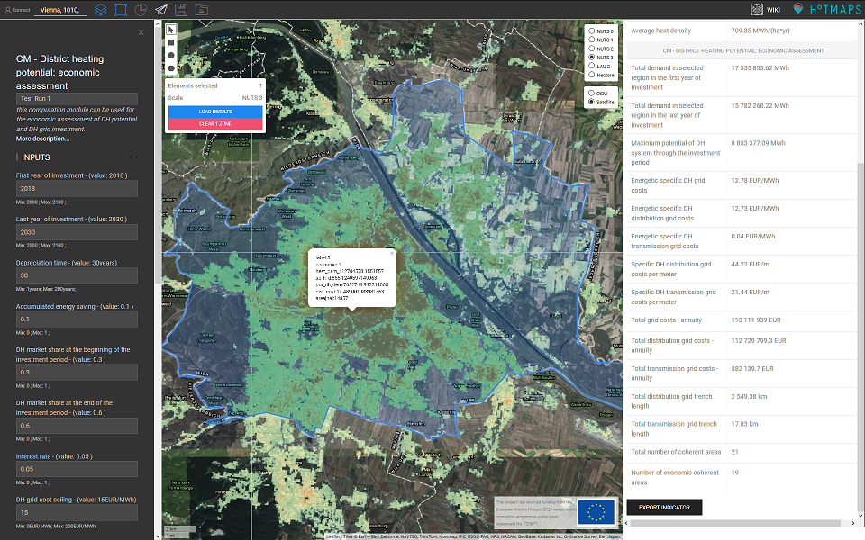

<h1> <a class="anchor" id="cm-district-heating-potential-economic-assessment" href="#cm-district-heating-potential-economic-assessment"><i class="fa fa-link"></i></a> CM Valutazione economica potenziale teleriscaldamento </h1><h2> <a class="anchor" id="table-of-contents" href="#table-of-contents"><i class="fa fa-link"></i></a> Sommario </h2><ul><li> <a href="#in-a-glance">In uno sguardo</a> </li><li> <a href="#introduction">introduzione</a> </li><li> <a href="#inputs-and-outputs">Ingressi e uscite</a> </li><li> <a href="#method">Metodo</a> <ul><li> <a href="#method_solver-options">Opzioni del risolutore</a> </li></ul></li><li> <a href="#github-repository-of-this-calculation-module">Repository GitHub di questo modulo di calcolo</a> </li><li> <a href="#sample-run">Esempio di corsa</a> <ul><li> <a href="#sample-run_test-run-default-input-values-for-the-case-study-of-vienna">Test Run: valori di input di default per il case study di Vienna</a> </li></ul></li><li> <a href="#references">Riferimenti</a> </li><li> <a href="#how-to-cite">Come citare</a> </li><li> <a href="#authors-and-reviewers">Autori e revisori</a> </li><li> <a href="#license">Licenza</a> </li><li> <a href="#acknowledgement">Riconoscimento</a> </li></ul><h2> <a class="anchor" id="in-a-glance" href="#in-a-glance"><i class="fa fa-link"></i></a> In uno sguardo </h2>
 Con questo modulo di calcolo è possibile determinare le potenziali aree di teleriscaldamento sulla base di una valutazione semplificata dei costi di distribuzione e trasmissione del calore. Gli input del modulo sono la domanda di calore e le mappe della densità della superficie lorda del pavimento, i costi di espansione della rete, lo sviluppo della domanda di calore e delle tariffe di connessione, il tempo di ammortamento, il tasso di interesse e una soglia per i costi di distribuzione del calore accettati. Inoltre, calcola i costi delle linee di trasmissione tra le aree di teleriscaldamento individuate. 

 <a href="#table-of-contents"><strong><code>To Top</code></strong></a> 
 <h2> <a class="anchor" id="introduction" href="#introduction"><i class="fa fa-link"></i></a> introduzione </h2>
 Questo modulo di calcolo utilizza una mappa della densità del calore (HDM) e una mappa della densità della superficie lorda del pavimento per proporre un metodo basato su GIS per determinare le potenziali aree DH con particolare attenzione ai costi della rete di teleriscaldamento (DH). Nella casella degli strumenti, l&#39;utente ha la possibilità di utilizzare il set di dati predefinito fornito dalla casella degli strumenti, vale a dire <a href="https://gitlab.com/hotmaps/heat/heat_tot_curr_density">la mappa della densità della domanda di calore</a> e la <a href="https://gitlab.com/hotmaps/gfa_tot_curr_density">mappa della densità della superficie lorda</a> , oppure utilizzare i propri layer degli stessi tipi che vengono caricati nell&#39;account personale Hotmaps. Le aree DH vengono determinate eseguendo analisi di sensibilità sull&#39;HDM tenendo conto del limite superiore predefinito dei costi di distribuzione medi. L&#39;approccio consente inoltre la stima della lunghezza e del diametro delle linee di trasmissione e dei relativi costi. I risultati sono strati GIS che illustrano aree economicamente valide per la costruzione di DH, nonché le linee di trasmissione a costo minimo che collegano queste regioni tra loro. Il modulo di calcolo può essere utilizzato per studiare l&#39;impatto di parametri come il tetto dei costi di rete e la quota di mercato sul potenziale e sull&#39;espansione e l&#39;estensione dei sistemi DH. 

 <a href="#table-of-contents"><strong><code>To Top</code></strong></a> 
 <h2> <a class="anchor" id="inputs-and-outputs" href="#inputs-and-outputs"><i class="fa fa-link"></i></a> Ingressi e uscite </h2>
 I livelli e i parametri di input, nonché i parametri e i livelli di output per il CM sono i seguenti. 

 <strong>I livelli di input e i parametri sono:</strong> 
<ul><li> Parametri: <ul><li> Primo anno di investimento </li><li> Ultimo anno di investimento: determina in quanti anni è necessario raggiungere la quota di mercato DH target. </li><li> Tempo di ammortamento in <em><strong>anni</strong></em> : un tempo di ammortamento maggiore riduce il costo complessivo poiché il sistema durerà più a lungo e servirà di più </li><li> Risparmio energetico accumulato: il rapporto atteso di energia risparmiata <strong>nell&#39;ultimo anno di investimento</strong> dovuto, ad esempio, all&#39;adeguamento degli edifici rispetto alla domanda di calore nel <strong>primo anno dell&#39;investimento</strong> . maggiori risparmi energetici accumulati, significano minori densità di richiesta di calore e probabilmente questo porterà a maggiori costi specifici della rete di distribuzione. </li><li> Quota di mercato DH all&#39;inizio del periodo di investimento: mostra lo stato corrente nell&#39;area selezionata. </li><li> Quota di mercato DH alla fine del periodo di investimento: la quota di mercato target che si desidera raggiungere. </li><li> Tasso d&#39;interesse </li><li> Costo massimo della rete DH in <em><strong>EUR / MWh</strong></em> : nelle potenziali aree DH, il costo della rete di distribuzione non può superare questo limite di costo della rete di distribuzione definito. </li><li> Costo di costruzione <strong>costante</strong> in <em><strong>EUR / m 2</strong></em> nonché <strong>coefficiente del</strong> costo di costruzione in <em><strong>EUR / m 2</strong></em> </li><li> Ore di pieno carico: viene utilizzato per calcolare il carico di punta, importante per la dimensione dei tubi. Qui, questo viene utilizzato esclusivamente per la rete di trasporto. </li><li> MIPGap: un&#39;opzione del solutore di ottimizzazione, con la quale puoi determinare quanto dovrebbe essere accurata la tua risposta. Si noti che spazi vuoti più piccoli portano a una maggiore precisione al costo di un maggiore tempo di CPU. </li></ul></li><li> Strati: <ul><li> Mappa della densità di calore e mappa della densità della superficie lorda: le mappe predefinite sono fornite nella casella degli strumenti; le proprie mappe caricate possono essere utilizzate anche nel CM <ul><li> in formato raster (* .tif) </li><li> con risoluzione di 1 ettaro </li><li> densità della domanda in <em><strong>MWh / ha</strong></em> e densità della superficie lorda in <em><strong>m 2 / ha</strong></em> </li></ul></li></ul></li></ul>
 <strong>I livelli e i parametri di output sono:</strong> 
<ul><li> Parametri: <ul><li> Domanda totale nella regione selezionata nel primo anno di investimento in <em><strong>MWh</strong></em> </li><li> Domanda totale nella regione selezionata nell&#39;ultimo anno di investimenti in <em><strong>MWh</strong></em> </li><li> Potenziale massimo del sistema DH durante il periodo di investimento in <em><strong>MWh</strong></em> </li><li> Costi energetici specifici della rete DH in <em><strong>EUR / MWh</strong></em> </li><li> Costi energetici specifici della rete di distribuzione DH in <em><strong>EUR / MWh</strong></em> </li><li> Costi energetici specifici della rete di trasmissione DH in <em><strong>EUR / MWh</strong></em> </li><li> Costi specifici della rete di distribuzione DH per metro in <em><strong>EUR / m</strong></em> </li><li> Costi specifici della rete di trasmissione DH per metro in <em><strong>EUR / m</strong></em> </li><li> Costi totali della rete - rendita in <em><strong>EUR / anno</strong></em> </li><li> Costi totali della rete di distribuzione - rendita in <em><strong>EUR / anno</strong></em> </li><li> Costi totali della rete di trasmissione - rendita in <em><strong>EUR / anno</strong></em> </li><li> Lunghezza totale della trincea della rete di distribuzione in <em><strong>km</strong></em> </li><li> Lunghezza totale della trincea della rete di trasmissione in <em><strong>km</strong></em> </li><li> Numero totale di aree coerenti </li><li> Numero di aree economiche coerenti </li></ul></li><li> Strati: <ul><li> Densità della domanda di calore nell&#39;ultimo anno del periodo di investimento (considerando il risparmio energetico) in formato raster </li><li> Aree DH (sia economiche che non economiche) in formato shapefile </li><li> Linee di trasmissione e loro capacità in formato shapefile </li></ul></li></ul>
 <a href="#table-of-contents"><strong><code>To Top</code></strong></a> 
 <h2> <a class="anchor" id="method" href="#method"><i class="fa fa-link"></i></a> Metodo </h2>
 Qui viene fornita una breve spiegazione della metodologia. Per una spiegazione più completa della metodologia e delle formulazioni, fare riferimento al <a href="https://www.sciencedirect.com/science/article/pii/S1876610218304740">documento ad</a> accesso aperto pubblicato su questo modulo di calcolo [ <a href="#references">1</a> ]. 

 Lo scopo del modulo di calcolo è trovare regioni in cui è possibile costruire sistemi DH senza superare un tetto di costo specifico medio definito dall&#39;utente in <em><em>EUR / MWh</em></em> . Questo viene fatto in base ai seguenti presupposti: 
<ul><li> L&#39;area economica DH con la più alta richiesta di calore è considerata come l&#39;unica fonte di calore disponibile. Produce il calore per sé e per tutte le altre aree economiche coerenti. </li><li> tra due aree DH, il calore può fluire in una direzione, </li><li> la domanda annuale di DH è considerata costante dopo l&#39;ultimo anno del periodo di investimento </li><li> le quote di mercato definite e il relativo risparmio energetico sono gli stessi in tutte le celle dell&#39;area analizzata. </li><li> Il modello crea un solo sistema DH connesso. Non è possibile avere due o più reti indipendenti. </li><li> Il parametro di input &quot;tetto del costo della rete&quot; viene moltiplicato per ~ 95% per ottenere il tetto del costo della rete di distribuzione. Questo valore viene utilizzato per la determinazione delle potenziali aree DH. </li></ul>
 La determinazione delle aree DH economiche avviene in tre fasi. Per maggiori dettagli fare riferimento alle esecuzioni di prova fornite. 

 <strong>FASE 1: Calcolo dei costi della rete di distribuzione in base alla domanda di calore e al rapporto grafico utilizzando le mappe di densità di calore e di superficie lorda selezionate</strong> 

 <strong>FASE 2: Determinazione delle potenziali aree DH</strong> 

 <strong>FASE 3: Determinazione delle aree DH economiche e delle capacità e della configurazione della linea di trasmissione necessarie per collegare queste aree tra loro.</strong> 
<h3> <a class="anchor" id="solver-options" href="#solver-options"><i class="fa fa-link"></i></a> Opzioni del risolutore </h3>
 Questo modulo di calcolo utilizza un risolutore Gurobi per risolvere il problema di ottimizzazione. Al fine di garantire una funzionalità stabile del modulo di calcolo, abbiamo introdotto diverse opzioni per risolvere il problema di ottimizzazione. Queste opzioni sono le seguenti: 
<ul><li> Il divario tra il limite dell&#39;obiettivo inferiore e superiore è impostato a 0,01 (MIPGap = 1e-2). <ul><li> Un divario più piccolo fornisce solitamente una risposta più accurata. Tuttavia, questo può essere molto costoso dal punto di vista del tempo di CPU. </li></ul></li><li> La differenza relativa tra il valore dell&#39;obiettivo primario e quello doppio è stata impostata su 0,0001 (BarConvTol = 1e-4). </li><li> Lo stato attivo del risolutore è impostato su 1 per trovare le soluzioni possibili. Qui, l&#39;attenzione non è né l&#39;ottimalità né il vincolo dell&#39;obiettivo (MIPFocus = 1). </li><li> Abbiamo limitato la quantità di RAM utilizzata a 500 MB per non entrare in situazioni critiche in caso di esecuzioni contemporanee da parte di utenti diversi (NodefileStart = 0.5). </li></ul>
 <a href="#table-of-contents"><strong><code>To Top</code></strong></a> 
 <h2> <a class="anchor" id="github-repository-of-this-calculation-module" href="#github-repository-of-this-calculation-module"><i class="fa fa-link"></i></a> Repository GitHub di questo modulo di calcolo </h2>
 <a href="https://github.com/HotMaps/dh_economic_assessment/tree/develop">Qui</a> ottieni lo sviluppo all&#39;avanguardia per questo modulo di calcolo. 

 <a href="#table-of-contents"><strong><code>To Top</code></strong></a> 
 <h2> <a class="anchor" id="sample-run" href="#sample-run"><i class="fa fa-link"></i></a> Esempio di corsa </h2>
 Qui, il modulo di calcolo viene eseguito per il caso di studio di Vienna, Austria. Per prima cosa, usa la barra &quot;Vai a luogo&quot; per navigare verso Vienna e selezionare la città. Fare clic sul pulsante &quot;STRATI&quot; per aprire la barra &quot;STRATI&quot; e quindi fare clic sulla scheda &quot;MODULO DI CALCOLO&quot;. Nella lista dei moduli di calcolo selezionare &quot;CM - POTENZIALE RISCALDAMENTO DISTRETTUALE: VALUTAZIONE ECONOMICA&quot;. 
<h3> <a class="anchor" id="test-run--default-input-values-for-the-case-study-of-vienna" href="#test-run--default-input-values-for-the-case-study-of-vienna"><i class="fa fa-link"></i></a> Test Run: valori di input di default per il case study di Vienna </h3>
 I valori predefiniti forniti nella casella degli strumenti sono fondamentalmente adatti a Vienna, ovvero potrebbe non essere adatto ad altre regioni e dovrebbero essere adattati a seconda del caso di studio. Il calcolo viene effettuato per il periodo dal 2018 al 2030 (il 2018 è l&#39;anno 0 e il 2030 è l&#39;anno 12 e il periodo di investimento sarà di 12 anni). L&#39;indice di risparmio energetico accumulato atteso mostra la riduzione della domanda di calore rispetto all&#39;inizio del periodo di investimento (anno 2018). La quota di mercato DH si riferisce alla quota di mercato all&#39;interno delle aree DH. Il suo valore all&#39;inizio del periodo di investimento (anno 2018) mostra la quota di mercato effettiva (solitamente nota). La quota di mercato prevista alla fine del periodo di investimento è ciò che ti aspetti di raggiungere. Questo valore deriva da mappe stradali, scenari, politiche, ecc. Per il caso di default, consideriamo il tasso di interesse del 5%. Il tetto di costo della rete DH viene moltiplicato per ~ 95% per ottenere un tetto di costo per la rete di distribuzione. Usando questo valore, si ottengono le potenziali aree DH. All&#39;interno delle aree potenziali, il costo medio della rete di distribuzione non può superare il tetto del costo della rete di distribuzione. Il valore delle ore a pieno carico viene utilizzato per stimare il carico di punta e trovare una dimensione adeguata per la rete di trasmissione. 

 La costante del costo di costruzione e il coefficiente del costo di costruzione provengono dal riferimento [ <a href="#references">2, 3</a> ]. Le regioni ottenute sono molto sensibili a questi valori. Pertanto, come commento generale, suggeriamo di calcolare prima con questi valori e solo se ritieni che questi valori portino a una sovrastima o sottostima dei tuoi risultati, quindi modificali. 

 Per impostazione predefinita, per il calcolo vengono utilizzate la mappa della densità di calore e la mappa della densità dell&#39;area lorda del pavimento fornite dalla casella degli strumenti. È possibile utilizzare i propri layer caricati per eseguire il calcolo. In questa esecuzione di esempio utilizziamo i livelli predefiniti. 

 Ora, premere il pulsante &quot;RUN CM&quot; e attendere che il calcolo sia terminato. 

 <strong>NOTA IMPORTANTE</strong> : si prega di notare che questo modulo di calcolo potrebbe richiedere diversi minuti per trovare la soluzione finale. Se il calcolo richiede molto tempo (più di 10 minuti), selezionare una regione più piccola per il calcolo. Inoltre, l&#39;utilizzo di valori arbitrari può comportare tempi di calcolo lunghi. Pertanto, assicurati che i valori forniti siano adatti alla regione selezionata. 

 La figura seguente mostra i risultati ottenuti per i parametri di input forniti a Vienna. Gli indicatori più importanti sono mostrati nella finestra RISULTATI. Inoltre, puoi ottenere alcuni indicatori premendo su ogni singola area potenziale sulla mappa. 

 I layer di output verranno visualizzati nella barra LAYERS nella sezione Modulo di calcolo. 

 <a href="#table-of-contents"><strong><code>To Top</code></strong></a> 
 <h2> <a class="anchor" id="references" href="#references"><i class="fa fa-link"></i></a> Riferimenti </h2>
 [1] Fallahnejad M., Hartner M., Kranzl L., Fritz S. Impatto dei costi di investimento di distribuzione e trasmissione dei sistemi di teleriscaldamento sul potenziale di teleriscaldamento. Energy Procedia 2018; 149: 141–50. doi: 10.1016 / j.egypro.2018.08.178. 

 [2] Persson U., Werner S. Distribuzione del calore e futura competitività del teleriscaldamento. Appl Energy 2011; 88: 568-76. https://doi.org/10.1016/j.apenergy.2010.09.020. 

 [3] Persson U, Wiechers E, Möller B, Werner S. Heat Roadmap Europe: Heat distribution cost. Energia 2019; 176: 604-22. https://doi.org/10.1016/j.energy.2019.03.189. 

 <a href="#table-of-contents"><strong><code>To Top</code></strong></a> 
 <h2> <a class="anchor" id="how-to-cite" href="#how-to-cite"><i class="fa fa-link"></i></a> Come citare </h2>
 Mostafa Fallahnejad, in Hotmaps-Wiki, CM-Teleriscaldamento-potenziale-economico-valutazione (settembre 2020) 

 <a href="#table-of-contents"><strong><code>To Top</code></strong></a> 
 <h2> <a class="anchor" id="authors-and-reviewers" href="#authors-and-reviewers"><i class="fa fa-link"></i></a> Autori e revisori </h2>
 Questa pagina è stata scritta da Mostafa Fallahnejad ( <strong><a href="https://eeg.tuwien.ac.at/">EEG - TU Wien</a></strong> ). 

 ☑ Questa pagina è stata recensita da Marcul Hummel ( <strong><a href="https://e-think.ac.at">e-think</a></strong> ). 

 <a href="#table-of-contents"><strong><code>To Top</code></strong></a> 
 <h2> <a class="anchor" id="license" href="#license"><i class="fa fa-link"></i></a> Licenza </h2>
 Copyright © 2016-2020: Mostafa Fallahnejad 

 Licenza internazionale Creative Commons Attribution 4.0 

 Questo lavoro è concesso in licenza con una licenza internazionale Creative Commons CC BY 4.0. 

 Identificatore licenza SPDX: CC-BY-4.0 

 Testo della licenza: https://spdx.org/licenses/CC-BY-4.0.html 

 <a href="#table-of-contents"><strong><code>To Top</code></strong></a> 
 <h2> <a class="anchor" id="acknowledgement" href="#acknowledgement"><i class="fa fa-link"></i></a> Riconoscimento </h2>
 Vorremmo esprimere il nostro più profondo apprezzamento al <a href="https://www.hotmaps-project.eu">progetto Hotmaps di</a> Orizzonte 2020 (contratto di sovvenzione numero 723677), che ha fornito i finanziamenti per svolgere la presente indagine. 

 <a href="#table-of-contents"><strong><code>To Top</code></strong></a> 
 

<!--- THIS IS A SUPER UNIQUE IDENTIFIER -->

This page was automatically translated. View in another language:

[English](../en/CM-District-heating-potential-economic-assessment) (original) [German](../de/CM-District-heating-potential-economic-assessment)\*  

\* machine translated
