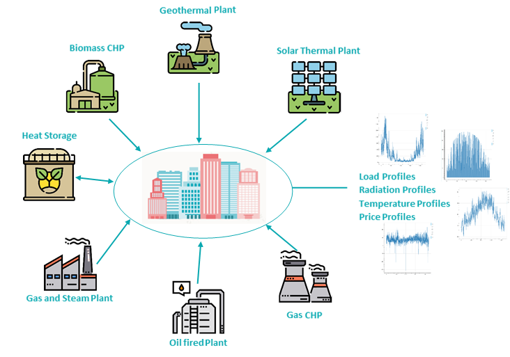
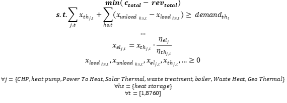
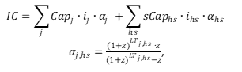
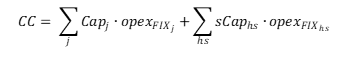
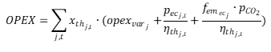
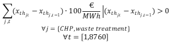
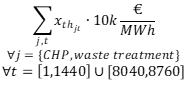
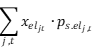
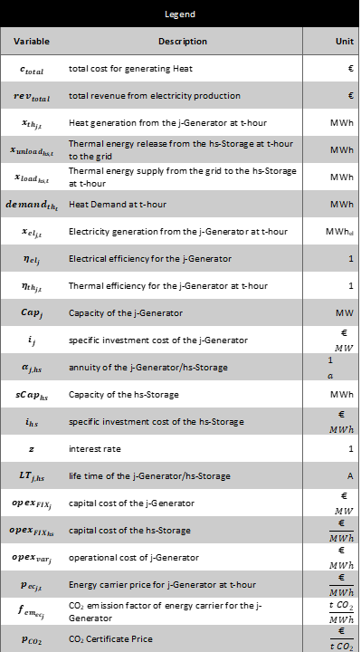

<h1> <a class="anchor" id="cm-district-heating-supply-dispatch" href="#cm-district-heating-supply-dispatch"><i class="fa fa-link"></i></a> Invio fornitura teleriscaldamento CM </h1><h2> <a class="anchor" id="table-of-contents" href="#table-of-contents"><i class="fa fa-link"></i></a> Sommario </h2><ul><li> <a href="#in-a-glance">In uno sguardo</a> </li><li> <a href="#introduction">introduzione</a> </li><li> <a href="#inputs-and-outputs">Ingressi e uscite</a> </li><li> <a href="#method">Metodo</a> </li><li> <a href="#github-repository-of-this-calculation-module">Repository GitHub di questo modulo di calcolo</a> </li><li> <a href="#sample-run">Esempio di corsa</a> </li><li> <a href="#how-to-cite">Come citare</a> </li><li> <a href="#authors-and-reviewers">Autori e revisori</a> </li><li> <a href="#license">Licenza</a> </li><li> <a href="#acknowledgement">Riconoscimento</a> </li></ul><h2> <a class="anchor" id="in-a-glance" href="#in-a-glance"><i class="fa fa-link"></i></a> In uno sguardo </h2>
 Questo modulo può essere eseguito in due modalità: 1) invio, 2) investimento. Nella modalità di invio, calcola il funzionamento minimo di un portafoglio di tecnologie di fornitura di calore in un sistema di teleriscaldamento definito per ogni ora dell&#39;anno. Gli input al modulo sono profili orari per la domanda di calore nella rete, per la fornitura potenziale di calore da diverse fonti e per i prezzi dei vettori energetici. Inoltre, sono richiesti parametri di costo ed efficienza per ciascuna tecnologia. Il modulo fornisce i costi della fornitura di calore, la quota di vettori energetici utilizzati e le emissioni di CO2 implicite. Nella modalità di investimento, il modulo ottimizza le capacità delle tecnologie di fornitura di calore installate per coprire la domanda di calore. 

 <a href="#table-of-contents"><strong><code>To Top</code></strong></a> 
 <h2> <a class="anchor" id="introduction" href="#introduction"><i class="fa fa-link"></i></a> introduzione </h2>
 Questo modulo può essere eseguito in due modalità: 1) invio, 2) investimento. Nella modalità di invio, calcola il funzionamento minimo di un portafoglio di tecnologie di fornitura di calore in un sistema di teleriscaldamento definito per ogni ora dell&#39;anno. Gli input al modulo sono profili orari per la domanda di calore nella rete, per la fornitura potenziale di calore da diverse fonti e per i prezzi dei vettori energetici. Inoltre, sono richiesti parametri di costo ed efficienza per ciascuna tecnologia. Il modulo fornisce i costi della fornitura di calore, la quota di vettori energetici utilizzati e le emissioni di CO2 implicite. Nella modalità di investimento, il modulo ottimizza le capacità delle tecnologie di fornitura di calore installate per coprire la domanda di calore. 

 Il modulo di distribuzione della fornitura di teleriscaldamento è un modello di spedizione che cerca di trovare una soluzione ottimale in termini di costi per coprire la domanda di calore in ogni ora dell&#39;anno. 

 Il metodo qui descritto è da intendersi come un primo concetto e può discostarsi dall&#39;attuale implementazione (la complessità del modello, gli input e gli output, ecc. Devono essere visti da questo punto di vista). Questa pagina wiki, spiega la versione del modulo di calcolo integrato nella casella degli strumenti. Una <strong>versione stand-alone</strong> del modulo di calcolo è molto più completa e può essere scaricata da <strong><a href="https://github.com/tuw-eeg/hotmapsDispatch">QUI</a></strong> . Questa versione richiede tuttavia una conoscenza di base della programmazione Python. La <strong>documentazione</strong> della versione stand-alone può essere trovata <strong><a href="https://hotmapsdispatch.readthedocs.io/en/latest/">QUI</a></strong> . 

 <a href="#table-of-contents"><strong><code>To Top</code></strong></a> 
 <h2> <a class="anchor" id="inputs-and-outputs" href="#inputs-and-outputs"><i class="fa fa-link"></i></a> Ingressi e uscite </h2><h3> <a class="anchor" id="main-inputs" href="#main-inputs"><i class="fa fa-link"></i></a> Ingressi principali </h3>
 Il modulo richiede una lunga serie di parametri di input. I principali parametri di input sono tuttavia: 
<ol><li> Richiesta di calore della rete (regione selezionata) </li><li> Capacità installate di generatori di calore / accumulo </li><li> Parametri tecnici (en-efficienze) e finanziari (opex, capex, durata) dei generatori / accumuli di calore </li><li> Profili (serie storiche del fabbisogno termico, radiazione solare, temperatura, prezzi elettricità, ecc.) </li></ol><h3> <a class="anchor" id="main-outputs" href="#main-outputs"><i class="fa fa-link"></i></a> Principali uscite </h3>
 I principali indicatori di output del modulo di calcolo sono: 
<ul><li> Costi di generazione di calore </li><li> Investimento, funzionamento e costi del carburante </li><li> Miscela di generazione di calore per generatore di calore </li><li> Emissioni di CO2 </li><li> Ore a pieno carico, </li></ul>
 <strong>NOTA IMPORTANTE</strong> In Hotmaps le emissioni di biomassa non sono assunte a zero perché Hotmaps è uno strumento finalizzato a supportare la transizione energetica in corso. Considerare la biomassa come una fonte di energia a emissioni zero implica che la combustione della biomassa riduce le emissioni totali attuali rispetto alla combustione di combustibili fossili, il che non è vero. Lo stoccaggio dell&#39;anidride carbonica negli alberi avviene nell&#39;arco di decenni, mentre il suo rilascio nell&#39;atmosfera avviene tutto in una volta. Pertanto, il bilancio netto del carbonio della biomassa è zero nel lungo periodo, ma non nel breve periodo e le misure di mitigazione del cambiamento climatico devono portare risultati nella riduzione delle emissioni di carbonio nel breve periodo. 

 <a href="#table-of-contents"><strong><code>To Top</code></strong></a> 
 <h2> <a class="anchor" id="method" href="#method"><i class="fa fa-link"></i></a> Metodo </h2>
 Il modulo è implementato come programma lineare e può essere utilizzato da un lato come puro modello di spedizione e dall&#39;altro per la pianificazione degli investimenti per coprire un profilo di carico. La funzione obiettivo cerca di trovare il minimo della differenza tra i costi di fornitura del calore e gli introiti dalla produzione di energia elettrica. 
<h3> <a class="anchor" id="equation-fragments-of-the-linear-program-" href="#equation-fragments-of-the-linear-program-"><i class="fa fa-link"></i></a> Frammenti di equazioni del programma lineare: </h3>

<h4> <a class="anchor" id="the-total-costs-<code>ctotal<-sub><-code>-yield-from-the-sum-of-" href="#the-total-costs-<code>ctotal<-sub><-code>-yield-from-the-sum-of-"><i class="fa fa-link"></i></a> I costi totali <code>c total</code> rendimento <code>c total</code> dalla somma di: </h4><h5> <a class="anchor" id="investment-costs-<code>ic<-code>-installed-capacities-multiplied-by-the-annuities-of-the-specific-investment-costs" href="#investment-costs-<code>ic<-code>-installed-capacities-multiplied-by-the-annuities-of-the-specific-investment-costs"><i class="fa fa-link"></i></a> costi di investimento <code>IC</code> (capacità installate moltiplicate per le rendite dei costi di investimento specifici) </h5>

<h5> <a class="anchor" id="captial-costs-<code>cc<-code>--" href="#captial-costs-<code>cc<-code>--"><i class="fa fa-link"></i></a> costi captial <code>CC</code> : </h5>

<h5> <a class="anchor" id="the-variable-costs-<code>opex<-code>--" href="#the-variable-costs-<code>opex<-code>--"><i class="fa fa-link"></i></a> i costi variabili <code>OPEX</code> : </h5>

<h5> <a class="anchor" id="ramp-costs-of-chp-and-waste-incineration-plants-rough-estimation--" href="#ramp-costs-of-chp-and-waste-incineration-plants-rough-estimation--"><i class="fa fa-link"></i></a> costi di rampa di CHP e impianti di incenerimento dei rifiuti (stima approssimativa): </h5>

<h5> <a class="anchor" id="assumed-costs-for-the-peak-electrical-load-in-the-winter-time-rough-estimation-" href="#assumed-costs-for-the-peak-electrical-load-in-the-winter-time-rough-estimation-"><i class="fa fa-link"></i></a> costi ipotizzati per il carico elettrico di picco nel periodo invernale (stima approssimativa): </h5>

<h4> <a class="anchor" id="the-total-revenues-<code>revtotal<-sub><-code>-yield-from--" href="#the-total-revenues-<code>revtotal<-sub><-code>-yield-from--"><i class="fa fa-link"></i></a> I ricavi <code>rev total</code> rendimento <code>rev total</code> da: </h4><h5> <a class="anchor" id="the-sale-of-electricity-for-example-from-chp-plants-and-waste-incineration-plants.-" href="#the-sale-of-electricity-for-example-from-chp-plants-and-waste-incineration-plants.-"><i class="fa fa-link"></i></a> la vendita di energia elettrica (ad esempio da impianti di cogenerazione e impianti di incenerimento dei rifiuti): </h5>

 <a href="#table-of-contents"><strong><code>To Top</code></strong></a> 
 <h4> <a class="anchor" id="legend" href="#legend"><i class="fa fa-link"></i></a> Leggenda </h4>

 <a href="#table-of-contents"><strong><code>To Top</code></strong></a> 
 <h2> <a class="anchor" id="github-repository-of-this-calculation-module" href="#github-repository-of-this-calculation-module"><i class="fa fa-link"></i></a> Repository GitHub di questo modulo di calcolo </h2>
 <a href="https://github.com/HotMaps/dispatch_module/tree/develop">Qui</a> ottieni lo sviluppo all&#39;avanguardia per questo modulo di calcolo. 

 <a href="#table-of-contents"><strong><code>To Top</code></strong></a> 
 <h2> <a class="anchor" id="sample-run" href="#sample-run"><i class="fa fa-link"></i></a> Esempio di corsa </h2>
 Dopo aver selezionato una regione e aver apportato modifiche ai parametri predefiniti, il modello verrà eseguito in modalità investimento. Ciò significa che le capacità installate sono anche ottimizzate per la copertura ottimale dei costi della domanda di calore. 

 Di seguito puoi vedere tutti i parametri di input che possono essere modificati 

 [[/en/CM-District-heating-supply-dispatch/inpt.png]] 
<h4> <a class="anchor" id="output-indicators" href="#output-indicators"><i class="fa fa-link"></i></a> Indicatori di output </h4>
 [[/en/CM-District-heating-supply-dispatch/indicators.png]] 
<h4> <a class="anchor" id="output-charts" href="#output-charts"><i class="fa fa-link"></i></a> Grafici di output </h4>
 [[/en/CM-District-heating-supply-dispatch/charts.png]] 

 <a href="#table-of-contents"><strong><code>To Top</code></strong></a> 
 <h2> <a class="anchor" id="how-to-cite" href="#how-to-cite"><i class="fa fa-link"></i></a> Come citare </h2>
 Jeton Hasani, in Hotmaps Wiki, Dispaccio di fornitura di teleriscaldamento CM (settembre 2020) 

 <a href="#table-of-contents"><strong><code>To Top</code></strong></a> 
 <h2> <a class="anchor" id="authors-and-reviewers" href="#authors-and-reviewers"><i class="fa fa-link"></i></a> Autori e revisori </h2>
 Questa pagina è stata scritta da Jeton Hasani ( <strong><a href="https://eeg.tuwien.ac.at/">EEG - TU Wien</a></strong> ). 

 ☑ Questa pagina è stata recensita da Mostafa Fallahnejad ( <strong><a href="https://eeg.tuwien.ac.at/">EEG - TU Wien</a></strong> ). 

 <a href="#table-of-contents"><strong><code>To Top</code></strong></a> 
 <h2> <a class="anchor" id="license" href="#license"><i class="fa fa-link"></i></a> Licenza </h2>
 Copyright © 2016-2020: Jeton Hasani 

 Licenza internazionale Creative Commons Attribution 4.0 

 Questo lavoro è concesso in licenza con una licenza internazionale Creative Commons CC BY 4.0. 

 Identificatore licenza SPDX: CC-BY-4.0 

 Testo della licenza: https://spdx.org/licenses/CC-BY-4.0.html 

 <a href="#table-of-contents"><strong><code>To Top</code></strong></a> 
 <h2> <a class="anchor" id="acknowledgement" href="#acknowledgement"><i class="fa fa-link"></i></a> Riconoscimento </h2>
 Vorremmo esprimere il nostro più profondo apprezzamento al <a href="https://www.hotmaps-project.eu">progetto Hotmaps di</a> Orizzonte 2020 (contratto di sovvenzione numero 723677), che ha fornito i finanziamenti per svolgere la presente indagine. 

 <a href="#table-of-contents"><strong><code>To Top</code></strong></a> 
 
<!--- THIS IS A SUPER UNIQUE IDENTIFIER -->

This page was automatically translated. View in another language:

[English](../en/CM-District-heating-supply-dispatch) (original) [German](../de/CM-District-heating-supply-dispatch)\*  

\* machine translated
