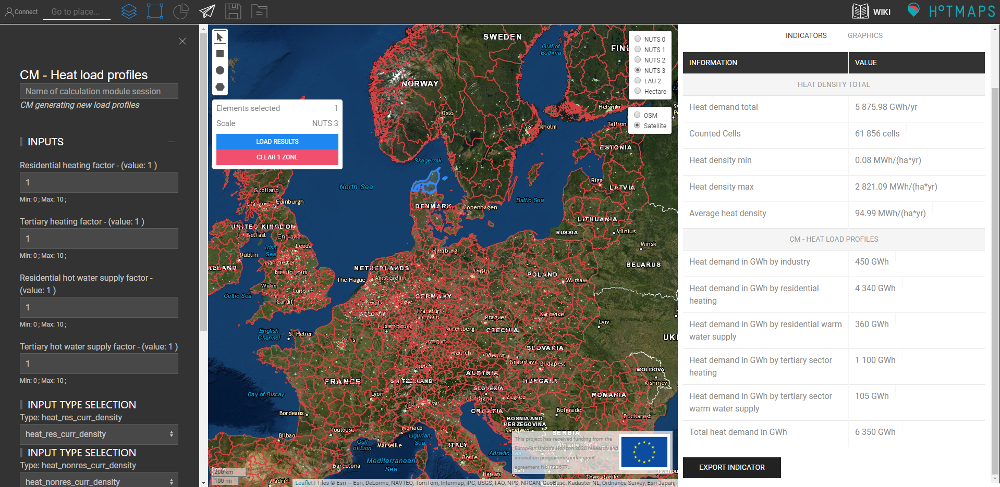
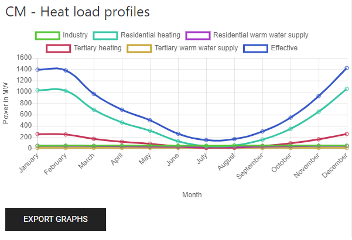

<h1> <a class="anchor" id="cm-heat-load-profiles" href="#cm-heat-load-profiles"><i class="fa fa-link"></i></a> CM Profili di carico termico </h1><h2> <a class="anchor" id="table-of-contents" href="#table-of-contents"><i class="fa fa-link"></i></a> Sommario </h2><ul><li> <a href="#in-a-glance">In uno sguardo</a> </li><li> <a href="#introduction">introduzione</a> </li><li> <a href="#inputs-and-outputs">Ingressi e uscite</a> <ul><li> <a href="#inputs-and-outputs_input-layers-and-parameters">Livelli di input e parametri</a> </li><li> <a href="#inputs-and-outputs_output">Produzione</a> </li></ul></li><li> <a href="#method">Metodo</a> <ul><li> <a href="#method_overview">Panoramica</a> </li><li> <a href="#method_details">Dettagli</a> </li><li> <a href="#method_implementation">Implementazione</a> </li></ul></li><li> <a href="#github-repository-of-this-calculation-module">Repository GitHub di questo modulo di calcolo</a> </li><li> <a href="#sample-run">Esempio di corsa</a> </li><li> <a href="#how-to-cite">Come citare</a> </li><li> <a href="#authors-and-reviewers">Autori e revisori</a> </li><li> <a href="#license">Licenza</a> </li><li> <a href="#acknowledgement">Riconoscimento</a> </li></ul><h2> <a class="anchor" id="in-a-glance" href="#in-a-glance"><i class="fa fa-link"></i></a> In uno sguardo </h2>
 Questo modulo genera profili di carico della domanda di riscaldamento degli ambienti e produzione di acqua calda per una regione selezionata. Utilizza i profili di carico predefiniti per il settore residenziale e terziario a livello NUTS2 e lo adatta a una determinata domanda in quei settori e fornisce i profili di carico separati per il riscaldamento degli ambienti e la produzione di acqua calda. 

 <a href="#table-of-contents"><strong><code>To Top</code></strong></a> 
 <h2> <a class="anchor" id="introduction" href="#introduction"><i class="fa fa-link"></i></a> introduzione </h2>
 Hotmaps fornisce profili di carico termico generici e specifici per anno a livello NUTS2. L&#39;utente potrebbe voler adattare i profili predefiniti in base alle informazioni di cui dispone. Questo modulo di calcolo dà la possibilità di scalare verso l&#39;alto o verso il basso diversi elementi costitutivi dei profili e ottenere un nuovo profilo. 

 <a href="#table-of-contents"><strong><code>To Top</code></strong></a> 
 <h2> <a class="anchor" id="inputs-and-outputs" href="#inputs-and-outputs"><i class="fa fa-link"></i></a> Ingressi e uscite </h2><h3> <a class="anchor" id="input-layers-and-parameters" href="#input-layers-and-parameters"><i class="fa fa-link"></i></a> Livelli di input e parametri </h3>
 Diversi livelli e profili vengono utilizzati dal set di dati predefinito delle Hotmap: 
<ul><li> Settore residenziale densità di calore </li><li> Settore non residenziale densità di calore </li><li> Superficie lorda residenziale </li><li> Superficie lorda non residenziale </li><li> Database industriale </li><li> Profili di carico per l&#39;industria </li><li> Profili di carico per riscaldamento residenziale </li><li> Profili di carico per riscaldamento terziario </li><li> Profili di carico per acqua calda sanitaria residenziale </li><li> Profili di carico per acqua calda sanitaria terziaria </li></ul><h3> <a class="anchor" id="user-inputs" href="#user-inputs"><i class="fa fa-link"></i></a> Input dell&#39;utente </h3>
 L&#39;utente deve fornire i seguenti parametri: 
<ul><li> <strong>Fattore di riscaldamento residenziale</strong> : la richiesta di riscaldamento residenziale viene moltiplicata per questo fattore. </li><li> <strong>Fattore di riscaldamento terziario</strong> : la richiesta di riscaldamento terziario viene moltiplicata per questo fattore. </li><li> <strong>Fattore di fornitura di acqua calda residenziale</strong> : la domanda di acqua calda residenziale viene moltiplicata per questo fattore. </li><li> <strong>Fattore di fornitura di acqua calda terziaria</strong> : la domanda di acqua calda terziaria viene moltiplicata per questo fattore. </li></ul>
 <a href="#table-of-contents"><strong><code>To Top</code></strong></a> 
 <h3> <a class="anchor" id="output" href="#output"><i class="fa fa-link"></i></a> Produzione </h3><h4> <a class="anchor" id="indicators" href="#indicators"><i class="fa fa-link"></i></a> Indicatori </h4><ul><li> <strong>Domanda di calore per settore</strong> : domanda annuale di calore per industria nell&#39;area selezionata. </li><li> <strong>Richiesta di calore per riscaldamento residenziale</strong> : calore annuale richiesto per il riscaldamento residenziale nell&#39;area selezionata. </li><li> <strong>Richiesta di calore dalla fornitura di acqua calda residenziale</strong> : calore annuale richiesto per la fornitura di acqua calda residenziale nell&#39;area selezionata. </li><li> <strong>Richiesta di calore dal riscaldamento del settore terziario</strong> : calore annuo richiesto per il riscaldamento del settore terziario nell&#39;area selezionata. </li><li> <strong>Domanda di calore da parte della fornitura di acqua calda del settore terziario</strong> : calore annuale richiesto per la fornitura di acqua calda del settore terziario nell&#39;area selezionata. </li><li> <strong>Fabbisogno di</strong> prevalenza totale: calore totale annuo richiesto nell&#39;area selezionata. </li></ul><h4> <a class="anchor" id="graphics" href="#graphics"><i class="fa fa-link"></i></a> Grafica </h4><ul><li> <strong>Profili della domanda di calore</strong> : un grafico che mostra gli indicatori sopra elencati nel corso dell&#39;anno. </li></ul>
 L&#39;asse x rappresenta l&#39;ora e l&#39;asse y mostra la potenza in MW. Può essere utile nascondere alcuni settori per vederne meglio gli altri. Questo può essere fatto facendo doppio clic sulla legenda. 

 <a href="#table-of-contents"><strong><code>To Top</code></strong></a> 
 <h2> <a class="anchor" id="method" href="#method"><i class="fa fa-link"></i></a> Metodo </h2><h3> <a class="anchor" id="overview" href="#overview"><i class="fa fa-link"></i></a> Panoramica </h3>
 I profili di carico corrispondenti vengono assegnati a siti industriali, edifici residenziali e terziari nella selezione dell&#39;utente. 

 <a href="#table-of-contents"><strong><code>To Top</code></strong></a> 
 <h3> <a class="anchor" id="details" href="#details"><i class="fa fa-link"></i></a> Dettagli </h3><h4> <a class="anchor" id="residential-warm-water-supply" href="#residential-warm-water-supply"><i class="fa fa-link"></i></a> Fornitura di acqua calda residenziale </h4>
 Sulla base della superficie lorda degli edifici residenziali e del loro ID NUTS 0, l&#39;energia utilizzata per l&#39;approvvigionamento di acqua calda viene calcolata con il seguente elenco. Utilizzando l&#39;ID NUTS 2 dell&#39;area selezionata, viene assegnato un profilo di carico. La fornitura di acqua calda residenziale viene moltiplicata per il fattore di fornitura di acqua calda residenziale nel caso in cui l&#39;utente desideri regolare il valore. 

 <em>Energia specifica per area per l&#39;approvvigionamento di acqua calda negli edifici residenziali in diversi paesi</em> 

 | Nuts0 ID | Fornitura di acqua calda in kWh / m² / a | | ------------- |: -------------: | | AT | 21.67 | | BE | 31.95 | | BG | 12.93 | | HR | 21.38 | | CY | 8.80 | | CZ | 22.83 | | DK | 9.64 | | EE | 14.35 | | FI | 10.15 | | FR | 9.66 | | DE | 8.27 | | EL | 12.51 | | HU | 13.66 | | IE | 15.91 | | IT | 14.01 | | LV | 15.71 | | LT | 13.36 | | LU | 8.29 | | MT | 10.99 | | NL | 8.91 | | PL | 10.00 | | PT | 9.48 | | RO | 11.48 | | SK | 21.51 | | SI | 21.74 | | ES | 23.34 | | SE | 13.54 | | Regno Unito | 49.03 | 
<h4> <a class="anchor" id="residential-heating" href="#residential-heating"><i class="fa fa-link"></i></a> Riscaldamento residenziale </h4>
 Viene utilizzata la densità della domanda di calore per il settore residenziale. Poiché questo set di dati contiene già l&#39;energia utilizzata per l&#39;acqua calda, la precedente energia calcolata per l&#39;acqua calda viene sottratta da essa. In base all&#39;ID NUTS 2, viene assegnato un profilo di riscaldamento residenziale per ogni riquadro della densità di calore nella selezione dell&#39;utente. Il riscaldamento residenziale viene moltiplicato per il fattore di riscaldamento residenziale nel caso in cui l&#39;utente desideri regolare il valore. 
<h4> <a class="anchor" id="tertiary-warm-water-supply" href="#tertiary-warm-water-supply"><i class="fa fa-link"></i></a> Fornitura terziaria di acqua calda </h4>
 Simile alla fornitura di acqua calda residenziale, l&#39;energia necessaria viene calcolata con una tabella. Con l&#39;ID NUTS 2 di un&#39;area specifica, viene assegnato un profilo di carico. La fornitura di acqua calda terziaria viene moltiplicata per il fattore di fornitura di acqua calda terziaria nel caso in cui l&#39;utente desideri regolare il valore. 

 <em>Energia specifica per area per l&#39;approvvigionamento di acqua calda negli edifici terziari in diversi paesi</em> 

 | Nuts0 ID | Fornitura di acqua calda in kWh / m² / a | | ------------- |: -------------: | | AT | 6.57 | | BE | 13.88 | | BG | 15.88 | | HR | 9.42 | | CY | 6.26 | | CZ | 9.18 | | DK | 8.03 | | EE | 14.13 | | FI | 10.52 | | FR | 9.57 | | DE | 3.05 | | EL | 6.99 | | HU | 9.51 | | IE | 10.87 | | IT | 5.62 | | LV | 7.16 | | LT | 10.46 | | LU | 7.20 | | MT | 10.45 | | NL | 6.89 | | PL | 9.55 | | PT | 21.47 | | RO | 13.85 | | SK | 8.49 | | SI | 27.73 | | ES | 12.44 | | SE | 19.62 | | Regno Unito | 13.45 | 
<h4> <a class="anchor" id="tertiary-heating" href="#tertiary-heating"><i class="fa fa-link"></i></a> Riscaldamento terziario </h4>
 Il riscaldamento terziario è calcolato in modo simile al riscaldamento residenziale. Il riscaldamento terziario viene moltiplicato per il fattore di riscaldamento terziario nel caso in cui l&#39;utente desideri regolare il valore. 
<h4> <a class="anchor" id="industrial-heat-demand" href="#industrial-heat-demand"><i class="fa fa-link"></i></a> Domanda di calore industriale </h4>
 La domanda di calore da parte dell&#39;industria viene ricercata nel database industriale e in base all&#39;ID NUTS 0 e al sottosettore viene assegnato un profilo di carico. 
<h4> <a class="anchor" id="summation" href="#summation"><i class="fa fa-link"></i></a> Somma </h4>
 I cinque profili risultanti vengono aggregati in modo assoluto per ottenere il profilo finale. 

 <a href="#table-of-contents"><strong><code>To Top</code></strong></a> 
 <h3> <a class="anchor" id="implementation" href="#implementation"><i class="fa fa-link"></i></a> Implementazione </h3><h4> <a class="anchor" id="load-profiles" href="#load-profiles"><i class="fa fa-link"></i></a> Profili di carico </h4>
 I profili di carico citati sono costituiti da 8760 punti che rappresentano il carico per ogni ora dei 365 giorni. Ulteriori informazioni sui <strong><a href="https://gitlab.com/hotmaps/load_profile">profili di carico sono disponibili qui.</a></strong> Tutti i profili di carico sono normalizzati in modo che l&#39;integrale sia uguale a 1. 
<h4> <a class="anchor" id="industrial-sites" href="#industrial-sites"><i class="fa fa-link"></i></a> Siti industriali </h4>
 Le fonti di calore sono prese dal <strong><a href="https://gitlab.com/hotmaps/industrial_sites/industrial_sites_Industrial_Database">database industriale.</a></strong> Sulla base del loro eccesso di calore, NUTS 0 ID e settore industriale viene creato un profilo di carico che copre ogni ora dell&#39;anno per ogni sito. 
<h4> <a class="anchor" id="heat-densities" href="#heat-densities"><i class="fa fa-link"></i></a> Densità di calore </h4>
 La densità della domanda di calore dei settori residenziale e non residenziale sono file raster che possono essere trovati <strong><a href="https://gitlab.com/hotmaps/heat">qui.</a></strong> 
<h4> <a class="anchor" id="gross-floor-areas" href="#gross-floor-areas"><i class="fa fa-link"></i></a> Superfici lorde </h4>
 La superficie lorda residenziale e la superficie lorda non residenziale sono file raster che possono essere trovati <strong><a href="https://gitlab.com/hotmaps/gfa_res_curr_density">qui</a></strong> e <strong><a href="https://gitlab.com/hotmaps/gfa_nonres_curr_density">qui.</a></strong> 

 <a href="#table-of-contents"><strong><code>To Top</code></strong></a> 
 <h2> <a class="anchor" id="github-repository-of-this-calculation-module" href="#github-repository-of-this-calculation-module"><i class="fa fa-link"></i></a> Repository GitHub di questo modulo di calcolo </h2>
 <a href="https://github.com/HotMaps/load_profile_cm">Qui</a> ottieni lo sviluppo all&#39;avanguardia per questo modulo di calcolo. 

 <a href="#table-of-contents"><strong><code>To Top</code></strong></a> 
 <h2> <a class="anchor" id="sample-run" href="#sample-run"><i class="fa fa-link"></i></a> Esempio di corsa </h2>
 Esempio di esecuzione in DK05. 
<figure><figcaption><i></i></figcaption></figure>
 Esempio di esecuzione in DK05. Viene considerata solo l&#39;area blu selezionata. 
<figure><figcaption><i></i></figcaption></figure>
 Grafico che mostra la domanda di calore dei diversi settori nel corso dell&#39;anno. 

 I dati di questo grafico possono essere esportati premendo il pulsante &quot;ESPORTA GRAFICI&quot;. 

 <a href="#table-of-contents"><strong><code>To Top</code></strong></a> 
 <h2> <a class="anchor" id="how-to-cite" href="#how-to-cite"><i class="fa fa-link"></i></a> Come citare </h2>
 Ali Aydemir e David Schilling, in Hotmaps Wiki, profili di carico termico CM (settembre 2020) 

 <a href="#table-of-contents"><strong><code>To Top</code></strong></a> 
 <h2> <a class="anchor" id="authors-and-reviewers" href="#authors-and-reviewers"><i class="fa fa-link"></i></a> Autori e revisori </h2>
 Questa pagina è stata scritta da Ali Aydemir e David Schilling ( <strong><a href="https://isi.fraunhofer.de/">Fraunhofer ISI</a></strong> ). 

 ☑ Questa pagina è stata recensita da Tobias Fleiter ( <strong><a href="https://isi.fraunhofer.de/">Fraunhofer ISI</a></strong> ). 

 <a href="#table-of-contents"><strong><code>To Top</code></strong></a> 
 <h2> <a class="anchor" id="license" href="#license"><i class="fa fa-link"></i></a> Licenza </h2>
 Copyright © 2016-2020: Ali Aydemir e David Schilling 

 Licenza internazionale Creative Commons Attribution 4.0 

 Questo lavoro è concesso in licenza con una licenza internazionale Creative Commons CC BY 4.0. 

 Identificatore licenza SPDX: CC-BY-4.0 

 Testo della licenza: https://spdx.org/licenses/CC-BY-4.0.html 

 <a href="#table-of-contents"><strong><code>To Top</code></strong></a> 
 <h2> <a class="anchor" id="acknowledgement" href="#acknowledgement"><i class="fa fa-link"></i></a> Riconoscimento </h2>
 Vorremmo esprimere il nostro più profondo apprezzamento al <a href="https://www.hotmaps-project.eu">progetto Hotmaps di</a> Orizzonte 2020 (contratto di sovvenzione numero 723677), che ha fornito i finanziamenti per svolgere la presente indagine. 

 <a href="#table-of-contents"><strong><code>To Top</code></strong></a> 
 

<!--- THIS IS A SUPER UNIQUE IDENTIFIER -->

This page was automatically translated. View in another language:

[English](../en/CM-Heat-load-profiles) (original) [German](../de/CM-Heat-load-profiles)\*  

\* machine translated
