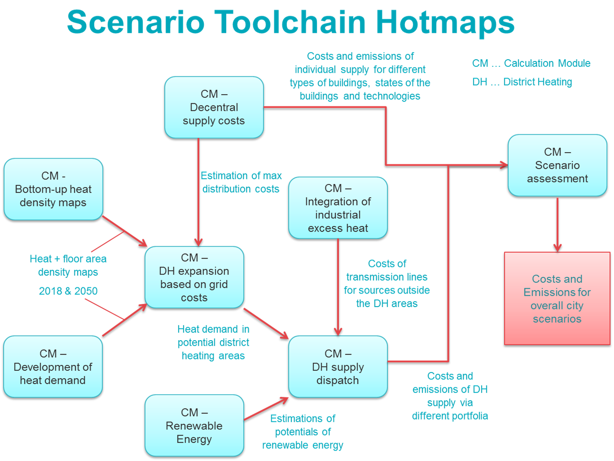

<h1> <a class="anchor" id="welcome!" href="#welcome!"><i class="fa fa-link"></i></a> Benvenuto! </h1><h2> <a class="anchor" id="hotmaps-toolbox" href="#hotmaps-toolbox"><i class="fa fa-link"></i></a> Casella degli strumenti Hotmaps </h2>
 Il riscaldamento e il raffreddamento nei settori residenziale e industriale rappresentano la metà del consumo energetico dell&#39;UE. Più dell&#39;80% del riscaldamento e del raffreddamento è ancora generato da combustibili fossili [ <a href="#references">1</a> ]. Nel frattempo, anche le perdite di calore sono notevolmente elevate. Questo settore deve essere trasformato! 

 Hotmaps offre un software online open source che supporta i processi di pianificazione del settore energetico a livello locale e nazionale in modo trasparente. È un sito Web che consente di fornire in 5 minuti una prima stima della domanda di riscaldamento e raffreddamento in qualsiasi regione europea, nonché del potenziale locale di energia rinnovabile per soddisfare questa domanda. Successivamente, utilizzando dati più dettagliati e applicando moduli di calcolo Hotmaps, è possibile elaborare strategie di riscaldamento e raffreddamento molto più complete. Grazie a questo software, sarai in grado di prendere decisioni pratiche nella tua area di interesse (paese, paese, città, regione, ecc.). L&#39;applicabilità di Hotmaps è stata dimostrata e dimostrata in sette aree pilota. 

 Il toolbox Hotmaps è stato sviluppato da importanti istituti di ricerca in tutta Europa insieme alle amministrazioni cittadine. Vai sul sito web cliccando <a href="https://www.hotmaps.eu/map">QUI</a> e scopri il futuro energetico climaticamente neutro della tua città. 
<h2> <a class="anchor" id="hotmaps-wiki" href="#hotmaps-wiki"><i class="fa fa-link"></i></a> Wiki di Hotmaps </h2>
 Il Wiki di Hotmaps ospita la documentazione, la guida e il manuale del toolbox Hotmaps. Consiste delle seguenti parti principali: 
<ol><li> <strong>Set di dati,</strong> </li><li> <strong>Funzionalità generali del toolbox,</strong> </li><li> <strong>Moduli di calcolo,</strong> </li><li> <strong>Come applicare la casella degli strumenti Hotmaps?</strong> </li><li> <strong>Sviluppatori</strong> . </li></ol>
 Queste sezioni sono accessibili in tutte le pagine Wiki nella barra laterale. 

 La sezione <strong>Set di dati</strong> fornisce informazioni sui repository di set di dati Hotmaps e sulle metodologie per raccogliere questi set di dati. 

 La sezione <strong>Funzionalità e struttura generali dello strumento</strong> guida l&#39;utente attraverso l&#39;interfaccia della casella degli strumenti. La sezione copre tutti gli aspetti generali della casella degli strumenti, che sono correlati all&#39;esperienza dell&#39;utente, ad esempio la navigazione attraverso diverse parti della casella degli strumenti, la selezione dei livelli, il recupero degli indicatori, il caricamento dei dati e le funzionalità di esportazione, ecc. 

 La sezione <strong>Moduli di calcolo</strong> fornisce una spiegazione approfondita dei concetti e delle metodologie alla base dei moduli di calcolo. Oltre alla spiegazione della metodologia, gli esempi forniti e le esecuzioni di test per ciascun modulo di calcolo aiutano l&#39;utente ad ottenere una comprensione dei parametri di input e dei risultati di output. Alcuni moduli di calcolo sono integrati nella casella degli strumenti, mentre altri sono autonomi. 

 La sezione &quot; <strong>Come applicare la casella degli strumenti Hotmaps?</strong> &quot; È una delle sezioni più importanti di questo wiki. Aiuta gli utenti di Hotmaps a eseguire la pianificazione del riscaldamento e del raffreddamento con il toolbox Hotmaps e include linee guida sull&#39;uso di Hotmaps a livello locale e nazionale, nonché materiali di formazione. Questa sezione illustra come utilizzare diversi moduli di calcolo per analizzare diversi aspetti del sistema di riscaldamento e raffreddamento e diverse domande di ricerca. Inoltre, mostra come i moduli di calcolo possano essere utilizzati anche come una catena di strumenti per derivare scenari di riscaldamento e raffrescamento di determinate aree. Questa toolchain è rappresentata schematicamente di seguito: 

 Per ulteriori supporti sulla pianificazione del riscaldamento e del raffreddamento, fare riferimento ai manuali Hotmaps e alla pagina Materiale di formazione: 
<ul><li> <a href="https://www.hotmaps-project.eu/wp-content/uploads/2019/04/Summary-Hotmaps-Handbook.pdf">Riepilogo dei manuali Hotmaps per la pianificazione strategica del riscaldamento</a> </li><li> <a href="https://vbn.aau.dk/da/publications/definition-amp-experiences-of-strategic-heat-planning">Manuale 1 - Definizione ed esperienze di pianificazione strategica del calore</a> </li><li> <a href="https://vbn.aau.dk/da/publications/guidance-for-the-comprehensive-assessment-of-efficient-heating-an">Manuale 2 - Guida per una valutazione completa di riscaldamento e raffreddamento efficienti</a> </li><li> <a href="https://vbn.aau.dk/da/publications/appendix-report-to-the-hotmaps-handbook-for-strategic-heat-planni">Rapporto in appendice al Manuale per la pianificazione strategica del riscaldamento: descrizioni dei casi</a> </li><li> <a href="https://wiki.hotmaps.hevs.ch/Training-Material">Materiale di formazione</a> </li></ul>
 La sezione <strong>Sviluppatori</strong> contiene tutte le informazioni necessarie agli sviluppatori per contribuire alla casella degli strumenti Hotmaps o per capire come funziona. Spiega l&#39;infrastruttura IT del toolbox Hotmaps, l&#39;integrazione dei set di dati, il contributo allo sviluppo del modulo di calcolo, ecc. 

 <strong>Il Wiki di Hotmaps è un documento vivente</strong> , cioè cresce con la crescita del toolbox di Hotmaps. Gli sviluppatori di Hotmaps continuano ad aggiornare le pagine Wiki di Hotmaps con l&#39;introduzione di nuovi aggiornamenti, miglioramenti, funzionalità e moduli di calcolo. Si prega di utilizzare queste <a href="Guidelines-for-writing-a-Hotmaps-Wiki-page">linee guida per scrivere una pagina Wiki Hotmaps</a> . 

 Ci auguriamo che ti piaccia esplorare la cassetta degli attrezzi e che sia utile per la tua pianificazione di riscaldamento e raffreddamento! 

 <strong>BUON DIVERTIMENTO AD ESPLORARE LA CASELLA DEGLI STRUMENTI DI HOTMAPS!</strong> 
<h2> <a class="anchor" id="references" href="#references"><i class="fa fa-link"></i></a> Riferimenti </h2>
 [1] Progetto UE H2020: mappatura e analisi della distribuzione attuale e futura (2020-2030) di combustibili per riscaldamento / raffreddamento (fossili / rinnovabili). Rapporto WP1. 2016, accessibile tramite https://ec.europa.eu/energy/sites/ener/files/documents/Report%20WP1.pdf 

<ins> <code><strong><a href="#hotmaps-toolbox">To Top</a></strong></code> </ins> 
<h2> <a class="anchor" id="how-to-cite" href="#how-to-cite"><i class="fa fa-link"></i></a> Come citare </h2>
 Il team di Hotmaps, in Hotmaps-Wiki, pagina di benvenuto (settembre 2020) 

<ins> <code><strong><a href="#hotmaps-toolbox">To Top</a></strong></code> </ins> 
<h2> <a class="anchor" id="authors-and-reviewers" href="#authors-and-reviewers"><i class="fa fa-link"></i></a> Autori e revisori </h2>
 Questa pagina è stata scritta dal team Hotmaps e precisamente da: 

 <strong><a href="https://eeg.tuwien.ac.at/">EEG - TU Vienna</a></strong> : Lukas Kranzl, Mostafa Fallahnejad, Jeton Hasani 

 <strong><a href="https://www.crem.ch/">CREM</a></strong> : Thierry Bernhard, Lesly Houndole, Albain Dufils 

 <strong><a href="https://e-think.ac.at">e-think</a></strong> : Marcus Hummel, Andreas Müller, Giulia Conforto, David Schmidinger 

 <strong><a href="http://www.eurac.edu">EURAC</a></strong> : Pietro Zambelli, Giulia Garegnani, Simon Pezzutto 

 <strong><a href="https://isi.fraunhofer.de/">Fraunhofer ISI</a></strong> : Ali Aydemir, David Schilling, Lisa Neusel, Tobias Fleiter 

 <strong><a href="https://www.hevs.ch">HES-SO</a></strong> : Daniel Hunacek, Lucien Zuber, Matthieu Dayer 

 <strong><a href="https://planenergi.dk/">Planenergie</a></strong> : Anders M. Odgaard 

 ☑ Questa pagina è stata recensita da Giulia Conforto. 

 <a href="#table-of-contents"><strong><code>To Top</code></strong></a> 
 <h2> <a class="anchor" id="license" href="#license"><i class="fa fa-link"></i></a> Licenza </h2>
 Copyright © 2016-2020: Lukas Kranzl, Mostafa Fallahnejad, Jeton Hasani, Thierry Bernhard, Lesly Houndole e Albain Dufils, Marcus Hummel, Giulia Conforto, David Schmidinger, Pietro Zambelli, Giulia Garegnani, Ali Aydemir, David Schilling, Lisa Neusel, Tobias Fleiter , Daniel Hunacek, Lucien Zuber, Matthieu Dayer. 

 Licenza internazionale Creative Commons Attribution 4.0 

 Questo lavoro è concesso in licenza con una licenza internazionale Creative Commons CC BY 4.0. 

 Identificatore licenza SPDX: CC-BY-4.0 

 Testo della licenza: https://spdx.org/licenses/CC-BY-4.0.html 

<ins> <code><strong><a href="#hotmaps-toolbox">To Top</a></strong></code> </ins> 
<h2> <a class="anchor" id="acknowledgement" href="#acknowledgement"><i class="fa fa-link"></i></a> Riconoscimento </h2>
 Vorremmo esprimere il nostro più profondo apprezzamento al <a href="https://www.hotmaps-project.eu">progetto Hotmaps di</a> Orizzonte 2020 (contratto di sovvenzione numero 723677), che ha fornito i finanziamenti per svolgere la presente indagine. 

<ins> <code><strong><a href="#hotmaps-toolbox">To Top</a></strong></code> </ins> 

<!--- THIS IS A SUPER UNIQUE IDENTIFIER -->

This page was automatically translated. View in another language:

[English](../en/Home) (original) [Bulgarian](../bg/Home)\* [Czech](../cs/Home)\* [Danish](../da/Home)\* [German](../de/Home)\* [Greek](../el/Home)\* [Spanish](../es/Home)\* [Estonian](../et/Home)\* [Finnish](../fi/Home)\* [French](../fr/Home)\* [Irish](../ga/Home)\* [Croatian](../hr/Home)\* [Hungarian](../hu/Home)\*  [Lithuanian](../lt/Home)\* [Latvian](../lv/Home)\* [Maltese](../mt/Home)\* [Dutch](../nl/Home)\* [Polish](../pl/Home)\* [Portuguese (Portugal, Brazil)](../pt/Home)\* [Romanian](../ro/Home)\* [Slovak](../sk/Home)\* [Slovenian](../sl/Home)\* [Swedish](../sv/Home)\* 

\* machine translated
