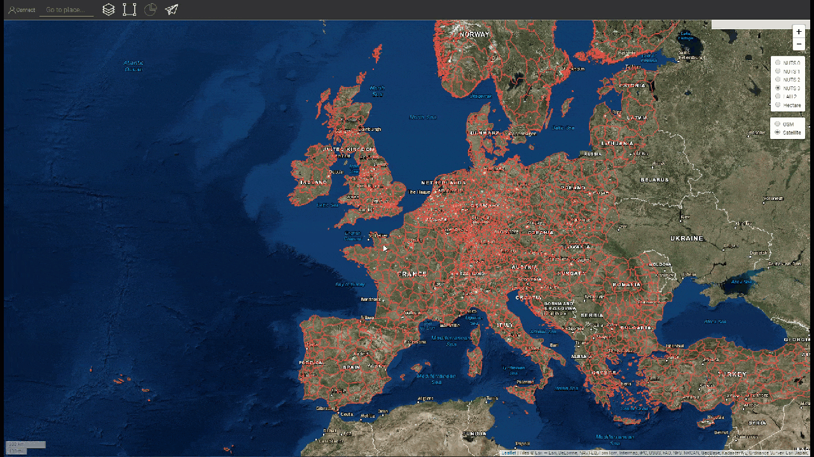
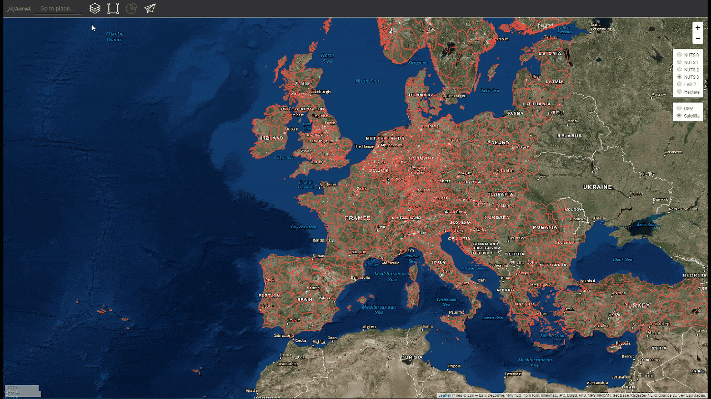

<h1><a class="anchor" id="introduction-to-user-interface" href="#introduction-to-user-interface"><i class="fa fa-link"></i></a>Introduzione all&#39;interfaccia utente</h1><h2><a class="anchor" id="table-of-contents" href="#table-of-contents"><i class="fa fa-link"></i></a> Sommario</h2><ul><li>
 <a href="#introduction-page">Pagina introduttiva</a>
</li><li>
 <a href="#upper-toolbar">Barra degli strumenti superiore</a>
<ul><li> <a href="#upper-toolbar_connect">Collegare</a><ul><li> <a href="#upper-toolbar_connect_login">Accesso</a></li><li> <a href="#upper-toolbar_connect_register">Registrati</a></li><li> <a href="#upper-toolbar_connect_recover">Recuperare</a></li></ul></li><li> <a href="#upper-toolbar_go-to-place">Vai a posto</a></li><li> <a href="#upper-toolbar_layers">Strati</a></li><li> <a href="#upper-toolbar_selection-tools">Strumenti di selezione</a></li><li> <a href="#upper-toolbar_show-result">Mostra risultato</a></li><li> <a href="#upper-toolbar_feedback">Risposta</a></li><li> <a href="#upper-toolbar_save-session">Salva sessione</a></li><li> <a href="#upper-toolbar_save-session-folder">Salva cartella sessione</a></li></ul></li><li>
 <a href="#tiles">Piastrelle</a>
</li><li>
 <a href="#how-to-cite">Come citare</a>
</li><li>
 <a href="#authors-and-reviewers">Autori e revisori</a>
</li><li>
 <a href="#license">Licenza</a>
</li><li>
 <a href="#acknowledgement">Riconoscimento</a>
</li></ul><h2><a class="anchor" id="introduction-page" href="#introduction-page"><i class="fa fa-link"></i></a> Pagina introduttiva</h2>
 Una volta aperta la casella degli strumenti, viene visualizzata la pagina di esclusione di responsabilità. Oltre al messaggio di esclusione di responsabilità, vengono fornite ulteriori informazioni sui browser supportati, gli obiettivi del progetto Hotmaps, il collegamento al sito Web del progetto Hotmaps e ai repository di dati.

 <em>Fig. 1 Breve introduzione alla casella degli strumenti Hotmaps</em>

 La GUI di Hotmaps è un&#39;interfaccia basata su GIS. Chiudendo la pagina di esclusione, l&#39;utente vede la mappa dell&#39;Europa. Per impostazione predefinita, sono rappresentate la mappa della densità della domanda di calore dei paesi dell&#39;UE-28 e i confini NUTS 2. Oltre a queste due mappe, nella GUI è possibile visualizzare alcuni strumenti e pulsanti. Questi strumenti sono illustrati nella figura seguente.

 <em>Fig.2 Pagina iniziale</em>

 Qui puoi individuare a prima vista 3 parti dell&#39;interfaccia utente:
<ol><li> <a href="#upper-toolbar">una barra degli strumenti in alto a sinistra</a> ,</li><li> la mappa stessa,</li><li> <a href="#tiles">alcuni strumenti per cambiare lo stile della mappa</a> .</li><li> due link in alto a destra: a questo <a href="https://wiki.hotmaps.eu/">Wiki di Hotmaps</a> e al <a href="https://www.hotmaps-project.eu/">sito web del progetto Hotmaps</a> .</li></ol>
 Nei capitoli seguenti vengono spiegati in dettaglio i primi 3 punti.

 <a href="#table-of-contents"><strong><code>To Top</code></strong></a>
<h2><a class="anchor" id="upper-toolbar" href="#upper-toolbar"><i class="fa fa-link"></i></a> Barra degli strumenti superiore</h2>

 Con questa barra degli strumenti puoi:
<ol><li> <a href="#upper-toolbar_connect"><em>Connetti:</em></a> registrati e accedi all&#39;applicazione web per salvare il tuo lavoro,</li><li> <a href="#upper-toolbar_go-to-place"><em>Vai a luogo:</em></a> ingrandisci una regione specifica digitando il nome,</li><li> <a href="#upper-toolbar_layers"><em>Livelli:</em></a> mostra la barra laterale dei livelli,</li><li> <a href="#upper-toolbar_selection-tools"><em>Strumenti di selezione</em> :</a> abilita o disabilita gli strumenti di selezione,</li><li> <a href="#upper-toolbar_show-result"><em>Mostra risultato:</em></a> mostra la barra laterale dei risultati delle regioni selezionate,</li><li> <a href="#upper-toolbar_feedback"><em>Feedback:</em></a> forniscici un feedback sullo strumento,</li><li> <a href="#upper-toolbar_save-session"><em>Salva sessione:</em></a> puoi salvare i livelli selezionati e il livello di zoom e richiamarli in un secondo momento,</li><li> <a href="#upper-toolbar_save-session-folder"><em>Save Session Folder:</em></a> dove puoi vedere l&#39;elenco di tutte le sessioni salvate.</li></ol>
 <a href="#table-of-contents"><strong><code>To Top</code></strong></a>
<h3><a class="anchor" id="connect" href="#connect"><i class="fa fa-link"></i></a> Collegare</h3>
 Qui si può:
<ul><li> Crea un account</li><li> Accedi al tuo account per salvare i tuoi progressi</li><li> Oppure reimposta la password se la dimentichi</li></ul>
 <a href="#table-of-contents"><strong><code>To Top</code></strong></a>
<h4><a class="anchor" id="login" href="#login"><i class="fa fa-link"></i></a> Accesso</h4>
 Dopo la <a href="#register">registrazione</a> e l&#39;attivazione del tuo account dovresti essere in grado di accedere con la tua email e password (vedi <a href="#fig4">Fig.4</a> sotto).

 <em>Fig.4 .: Modulo di accesso</em>

 <a href="#table-of-contents"><strong><code>To Top</code></strong></a>
<h4><a class="anchor" id="register" href="#register"><i class="fa fa-link"></i></a> Registrati</h4>
 Qui puoi creare un account per il sito web <em>hotmaps</em> . Dopo aver inviato il <a href="#fig5">modulo</a> riceverai un&#39;e-mail per l&#39;attivazione del tuo account. Con il tuo account potrai salvare i tuoi progressi.

 <em>Fig.5 .: Modulo di registrazione</em>

 <a href="#table-of-contents"><strong><code>To Top</code></strong></a>
<h4><a class="anchor" id="recover" href="#recover"><i class="fa fa-link"></i></a> Recuperare</h4>
 Se dimentichi la password, puoi recuperarla in questo menu (vedi <a href="#fig6">Fig.6.</a> Sotto). Si prega di essere consapevoli di impostare una nuova password in seguito.

 <em>Fig.6 .: Recupera modulo</em>

 <a href="#table-of-contents"><strong><code>To Top</code></strong></a>
<h3><a class="anchor" id="go-to-place" href="#go-to-place"><i class="fa fa-link"></i></a> Vai a posto</h3>
 È possibile eseguire lo zoom su una regione specifica digitandone il nome (vedere l&#39;animazione di seguito)

 <a href="#table-of-contents"><strong><code>To Top</code></strong></a>
<h3><a class="anchor" id="layers" href="#layers"><i class="fa fa-link"></i></a> Strati</h3>
 Premendo questo pulsante viene mostrata a sinistra una barra laterale con diversi tipi di livelli.

 È possibile trovare e visualizzare i seguenti livelli:

 <a href="#table-of-contents"><strong><code>To Top</code></strong></a>
<h3><a class="anchor" id="selection-tools" href="#selection-tools"><i class="fa fa-link"></i></a> Strumenti di selezione</h3>
 Premendo questo pulsante appariranno gli strumenti di selezione sulla sinistra dello schermo

 La figura seguente mostra l&#39;aspetto degli strumenti:

<ol><li> Strumento per la selezione delle regioni</li><li> Crea una regione quadrata personalizzata</li><li> Crea una regione della cerchia personalizzata</li><li> Crea una regione poligonale personalizzata</li><li> Carica un oggetto GeoJSON per utilizzare una selezione dell&#39;area personalizzata</li></ol><ol type="A"><li> mostra quante regioni hai selezionato</li><li> mostra la superficie complessiva del rettangolo più piccolo che può coprire l&#39;area selezionata</li><li> mostra la scala selezionata dalla barra degli strumenti a destra</li></ol><ol type="a"><li> pulsante per caricare i risultati della regione selezionata e dei livelli selezionati</li><li> pulsante per eliminare una regione selezionata</li></ol>
 <a href="#table-of-contents"><strong><code>To Top</code></strong></a>
<h3><a class="anchor" id="show-result" href="#show-result"><i class="fa fa-link"></i></a> Mostra risultato</h3>
 A seconda dei livelli e della regione selezionati, i risultati per la configurazione vengono visualizzati in una barra laterale a destra dello schermo

 <a href="#table-of-contents"><strong><code>To Top</code></strong></a>
<h3><a class="anchor" id="feedback" href="#feedback"><i class="fa fa-link"></i></a> Risposta</h3>
 Hai suggerimenti su come migliorare lo strumento? Hai notato errori? Fatecelo sapere! Dandoci un feedback puoi aiutarci a migliorare la cassetta degli attrezzi!

 Si prega di compilare il <a href="#Fig7">modulo</a> sottostante:

 <a href="#table-of-contents"><strong><code>To Top</code></strong></a>

 puoi scegliere tra le seguenti tipologie:

 e impostare una priorità:

 <a href="#table-of-contents"><strong><code>To Top</code></strong></a>
<h3><a class="anchor" id="save-session" href="#save-session"><i class="fa fa-link"></i></a> Salva sessione</h3>
 puoi fare un&#39;istantanea del tuo lavoro (aree e livelli selezionati, livelli di zoom, ecc.) premendo questo pulsante. È inoltre possibile definire un nome e una descrizione dell&#39;istantanea.
<h3><a class="anchor" id="save-session-folder" href="#save-session-folder"><i class="fa fa-link"></i></a> Salva cartella sessione</h3>
 Qui puoi vedere tutte le tue istantanee con i loro nomi e la descrizione. Quando si seleziona uno dei layer selezionati, vengono caricate le aree, il livello di zoom e altre configurazioni.
<h2><a class="anchor" id="tiles" href="#tiles"><i class="fa fa-link"></i></a> Piastrelle</h2>
 È possibile scegliere la scala territoriale che si desidera analizzare (regioni NUTS o livello di ettaro) e impostare il riquadro della mappa

 Sono possibili le seguenti configurazioni

<ol><li> Ingrandisci e rimpicciolisci la mappa</li><li> Mostrare i confini NUTS per selezionare regioni NUTS specifiche o utilizzare gli ettari per personalizzare la <a href="#upper-toolbar_selection-tools">selezione</a></li><li> Usa il riquadro OpenStreetMap o il riquadro Satellite</li></ol>
 <a href="#table-of-contents"><strong><code>To Top</code></strong></a>
<h2><a class="anchor" id="how-to-cite" href="#how-to-cite"><i class="fa fa-link"></i></a> Come citare</h2>
 Jeton Hasani, in Hotmaps-Wiki, Introduzione all&#39;interfaccia utente (aprile 2019)

 <a href="#table-of-contents"><strong><code>To Top</code></strong></a>
<h2><a class="anchor" id="authors-and-reviewers" href="#authors-and-reviewers"><i class="fa fa-link"></i></a> Autori e revisori</h2>
 Questa pagina è stata scritta da Jeton Hasani <strong><a href="https://eeg.tuwien.ac.at/">EEG - TU Wien</a></strong> .

 ☑ Questa pagina è stata recensita da Mostafa Fallahnejad <strong><a href="https://eeg.tuwien.ac.at/">EEG - TU Wien</a></strong> .

 <a href="#table-of-contents"><strong><code>To Top</code></strong></a>
<h2><a class="anchor" id="license" href="#license"><i class="fa fa-link"></i></a> Licenza</h2>
 Copyright © 2016-2020: Jeton Hasani

 Licenza internazionale Creative Commons Attribution 4.0

 Questo lavoro è concesso in licenza con una licenza internazionale Creative Commons CC BY 4.0.

 Identificatore licenza SPDX: CC-BY-4.0

 Testo della licenza: https://spdx.org/licenses/CC-BY-4.0.html

 <a href="#table-of-contents"><strong><code>To Top</code></strong></a>
<h2><a class="anchor" id="acknowledgement" href="#acknowledgement"><i class="fa fa-link"></i></a> Riconoscimento</h2>
 Vorremmo esprimere il nostro più profondo apprezzamento al <a href="https://www.hotmaps-project.eu">progetto Hotmaps di</a> Orizzonte 2020 (contratto di sovvenzione numero 723677), che ha fornito i finanziamenti per svolgere la presente indagine.

 <a href="#table-of-contents"><strong><code>To Top</code></strong></a>

<!--- THIS IS A SUPER UNIQUE IDENTIFIER -->

This page was automatically translated. View in another language:

[English](../en/Introduction-to-user-interface) (original) [German](../de/Introduction-to-user-interface)\*  

\* machine translated
