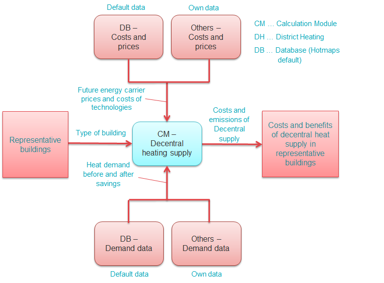

<h1><a class="anchor" id="national-level---step-3--calculation-of-decentral-heat-supply" href="#national-level---step-3--calculation-of-decentral-heat-supply"><i class="fa fa-link"></i></a>Livello nazionale - Fase 3: calcolo della fornitura di calore decentralizzata</h1>
 <a href="guide-national-level-comprehensive-assessment-eed#part-iii-analysis-of-the-economic-potential-for-efficiency-in-heating-and-cooling_different-steps"><strong><code>Scenario Toolchain Steps</code></strong></a> <a href="Step-2-Costs-and-potentials-for-district-heating-in-representative-regions-or-cities"><strong><code>Previous step</code></strong></a> <a href="guide-national-level-comprehensive-assessment-eed#part-iii-analysis-of-the-economic-potential-for-efficiency-in-heating-and-cooling_different-steps"><strong><code>Scenario Toolchain Steps</code></strong></a> <a href="Step-4-Comparison-of-results-for-different-scenarios"><strong><code>Next step</code></strong></a>
<h2><a class="anchor" id="table-of-contents" href="#table-of-contents"><i class="fa fa-link"></i></a> Sommario</h2><ul><li> <a href="#introduction">introduzione</a></li><li> <a href="#calculation-of-decentral-heat-supply">Calcolo della fornitura di calore decentralizzata</a></li><li> <a href="#how-to-cite">Come citare</a></li><li> <a href="#authors-and-reviewers">Autori e revisori</a></li><li> <a href="#license">Licenza</a></li><li> <a href="#acknowledgement">Riconoscimento</a></li></ul><h2><a class="anchor" id="introduction" href="#introduction"><i class="fa fa-link"></i></a> introduzione</h2>
 Questa è la seconda fase dell&#39;analisi a livello nazionale.

<ins> <code><strong><a href="#table-of-contents">To Top</a></strong></code></ins>
<h2><a class="anchor" id="calculation-of-decentral-heat-supply" href="#calculation-of-decentral-heat-supply"><i class="fa fa-link"></i></a> Calcolo della fornitura di calore decentralizzata</h2>
 Nella terza fase vengono calcolati i costi e le emissioni della fornitura di calore tramite tecnologie decentralizzate. Questo calcolo deve essere eseguito per diversi edifici rappresentativi nel paese / regione di interesse. Mentre per il teleriscaldamento sono state sviluppate città / aree rappresentative nella fase 1 dell&#39;approccio, i dati degli edifici tipici in ciascuno Stato membro dell&#39;UE possono essere trovati nel database predefinito Hotmaps. Inoltre, per molti paesi dell&#39;UE, nelle statistiche e nella letteratura è possibile trovare tipologie di edifici dettagliate (archetipi di edifici) con dati sulla domanda di calore prima e dopo la ristrutturazione.

 Il CM - Rifornimento di riscaldamento decentralizzato può essere utilizzato per calcolare i costi e le emissioni della fornitura di calore tramite diverse tecnologie decentralizzate. Il modulo utilizza i dati sulla domanda di calore, nonché i dati sui costi delle tecnologie e sui prezzi per i vettori energetici per calcolare i costi livellati della fornitura di calore [EUR / MWh] per le diverse tecnologie nei diversi edifici tipici e stati di ristrutturazione. La figura seguente mostra graficamente questa procedura e mostra le varie fonti di dati che alimentano la rete di riscaldamento CM - Decentral.

 <em>Figura: Calcolo della fornitura di calore decentralizzata (Fase 3)</em>

 I calcoli possono essere utilizzati per identificare i costi e i vantaggi di varie tecnologie di fornitura in diversi edifici rappresentativi e la loro sensibilità a parametri di influenza importanti come il vettore energetico e i prezzi della CO2 o il tasso di interesse e il tempo di ammortamento.

 I risultati di questa fase sono i costi della fornitura di calore tramite tecnologie decentralizzate [EUR / MWh] in ciascuno degli edifici rappresentativi e le relative emissioni di CO2 [kt / anno]. Questi risultati verranno quindi utilizzati nel confronto degli scenari complessivi nella fase 4.

<ins> <code><strong><a href="#table-of-contents">To Top</a></strong></code></ins>
<h2><a class="anchor" id="how-to-cite" href="#how-to-cite"><i class="fa fa-link"></i></a> Come citare</h2>
 Marcus Hummel, Giulia Conforto, in Hotmaps-Wiki, Linee guida per l&#39;utilizzo del toolbox Hotmaps per analisi a livello nazionale (agosto 2020)

<ins> <code><strong><a href="#table-of-contents">To Top</a></strong></code></ins>
<h2><a class="anchor" id="authors-and-reviewers" href="#authors-and-reviewers"><i class="fa fa-link"></i></a> Autori e revisori</h2>
 Questa pagina è stata scritta da Marcus Hummel e Giulia Conforto ( <strong><a href="https://e-think.ac.at">e-think</a></strong> ).

 ☑ Questa pagina è stata recensita da Mostafa Fallahnejad ( <strong><a href="https://eeg.tuwien.ac.at/">EEG - TU Wien</a></strong> ).

 <a href="#table-of-contents"><strong><code>To Top</code></strong></a>
<h2><a class="anchor" id="license" href="#license"><i class="fa fa-link"></i></a> Licenza</h2>
 Copyright © 2016-2020: Marcus Hummel, Giulia Conforto

 Licenza internazionale Creative Commons Attribution 4.0

 Questo lavoro è concesso in licenza con una licenza internazionale Creative Commons CC BY 4.0.

 Identificatore licenza SPDX: CC-BY-4.0

 Testo della licenza: https://spdx.org/licenses/CC-BY-4.0.html

<ins> <code><strong><a href="#table-of-contents">To Top</a></strong></code></ins>
<h2><a class="anchor" id="acknowledgement" href="#acknowledgement"><i class="fa fa-link"></i></a> Riconoscimento</h2>
 Vorremmo esprimere il nostro più profondo apprezzamento al <a href="https://www.hotmaps-project.eu">progetto Hotmaps di</a> Orizzonte 2020 (contratto di sovvenzione numero 723677), che ha fornito i finanziamenti per svolgere la presente indagine.

<ins> <code><strong><a href="#table-of-contents">To Top</a></strong></code></ins>

<!--- THIS IS A SUPER UNIQUE IDENTIFIER -->

This page was automatically translated. View in another language:

[English](../en/Step-3-Calculation-of-decentral-heat-supply) (original) [German](../de/Step-3-Calculation-of-decentral-heat-supply)\*  

\* machine translated
