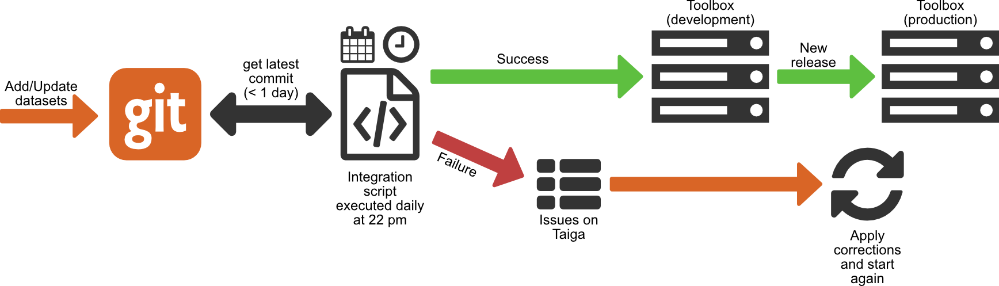

<h2> Turinys </h2><ul><li> <a href="#Introduction">Įvadas</a> </li><li> <a href="#Dataset-integration">Duomenų rinkinio integracija</a> </li><li> <a href="#add-your-datasets-on-gitlab">Pridėkite savo duomenų rinkinius „GitLab“</a> </li><li> <a href="#List-of-main-repositories">Pagrindinių saugyklų sąrašas</a> </li><li> <a href="#How-to-contribute-code">Kaip prisidėti kodą</a> </li><li> <a href="#Description-of-IT-infrastructure">IT infrastruktūros aprašymas</a> <ul><li> <a href="#Run-with-Docker">Bėk su „Docker“</a> </li><li> <a href="#Server-infrastructure">Serverio infrastruktūra</a> <ul><li> <a href="#Infrastructure">Infrastruktūra</a> </li><li> <a href="#Performance">Spektaklis</a> </li></ul></li></ul></li><li> <a href="#How-to-define-indicators">Kaip apibrėžti rodiklius</a> </li><li> <a href="#References">Nuorodos</a> </li><li> <a href="#How-to-cite">Kaip cituoti</a> </li><li> <a href="#Authors-and-reviewers">Autoriai ir recenzentai</a> </li><li> <a href="#Acknowledgement">Pripažinimas</a> </li></ul><h2> Įvadas </h2>
 Šiame puslapyje yra visos informacijos, reikalingos kūrėjams, norintiems prisidėti prie „Hotmaps“ platformos ar suprasti, kaip ji veikia. 

<ins> <code><strong><a href="#table-of-contents">To Top</a></strong></code> </ins> 
<h2> Duomenų rinkinio integracija </h2>
 Naujų viešųjų duomenų rinkinių integracija vykdoma taip: 
<ol><li> duomenų rinkiniai turi būti perkelti į „git“ saugyklą ( <a href="#Add-your-datasets-on-GitLab">pridėkite savo duomenų rinkinius „GitLab“</a> ) </li><li> kiekvieną vakarą scenarijus integruoja naujus / atnaujintus duomenų rinkinius į DEV platformą </li><li> Jei viskas pavyko gerai, duomenų rinkinį dabar galima rasti DEV platformoje, o kūrėjai gali jį integruoti į savo kodą </li><li> Kai kodavimas bus baigtas, naujos funkcijos pridedamos prie gamybos platformos per naują išleidimą </li></ol>

 Jei duomenų rinkinys nepavyksta integracijos metu, problema sukuriama „Taiga“ (projekto valdymo platforma). Problema rodo iškeltą klaidą, todėl kūrėjas turėtų ją ištaisyti ir dar kartą perduoti savo kūrinį „Git“, kad scenarijus galėtų bandyti dar kartą jį integruoti kitą vakarą. 

 Integravimo scenarijaus šaltinio kodą galite rasti šioje nuorodoje: <a href="https://github.com/HotMaps/CI_DatasetIntegration">Duomenų integracija</a> 

<ins> <code><strong><a href="#table-of-contents">To Top</a></strong></code> </ins> 
<h2> Pridėkite savo duomenų rinkinius „GitLab“ </h2>
 Norėdami įtraukti duomenų rinkinius į viešųjų duomenų rinkinių sąrašą, juos reikia perkelti į naują „Git“ saugyklą „GitLab“. Čia yra „GitLab“ organizacija, kur reikia perkelti duomenų rinkinius: <a href="https://gitlab.com/hotmaps">„GitLab“ duomenų rinkiniai</a> . 

 Kartą per dieną saugyklos yra tikrinamos, ar nėra naujų įsipareigojimų, ir, jei taip, yra integruotos. Integravimo procesas patikrina, ar duomenys atitinka specifikaciją, ar ne. 

 Čia yra specifikacija: „ <a href="uploads/Hotmaps_Data-upload-on-Gitlab_2017-12-04_V4.pdf">Hotmaps_Data-upload-on-Gitlab_2017-12-04_V4.pdf“</a> 

<ins> <code><strong><a href="#table-of-contents">To Top</a></strong></code> </ins> 
<h2> Pagrindinių saugyklų sąrašas </h2>
 Programos kodas yra „GitHub“ <a href="https://github.com/HotMaps">organizacijoje „Hotmaps“</a> . Ši organizacija turi keletą saugyklų 
<ul><li> <a href="https://github.com/HotMaps/Hotmaps-toolbox-service">„Hotmaps-toolbox-client“</a> yra mūsų programos <a href="https://github.com/HotMaps/Hotmaps-toolbox-service">priekinė dalis</a> . Tai kampinis projektas („JavaScript“) </li><li> <a href="https://github.com/HotMaps/Hotmaps-toolbox-service">„Hotmaps-toolbox-service“</a> yra mūsų programos API. Jis pagrįstas kolba (Python) </li><li> <a href="https://github.com/HotMaps/hotmaps_wiki">„Hotmaps-wiki“</a> yra Wiki, kurį šiuo metu skaitote </li><li> <a href="https://github.com/HotMaps/base_calculation_module">bazinis skaičiavimo modulis</a> yra pagrindinis šablonas, kurį galite naudoti kurdami savo „Hotmaps“ skaičiavimo modulius </li><li> skaičiavimo modulių sąrašas </li></ul>
<ins> <code><strong><a href="#table-of-contents">To Top</a></strong></code> </ins> 
<h2> Kaip prisidėti kodą </h2>
 Jei norite pridėti šiek tiek kodo prie „Hotmaps“, turite dvi galimybes: jei norite tiesiogiai atnaujinti sąsają ar užpakalinę programą, turite modifikuoti įrankių dėžutės klientą ar paslaugų saugyklą. Jei norite pridėti savo skaičiavimo modulį, galite sukurti savo saugyklą atlikdami <a href="https://github.com/HotMaps/base_calculation_module">bazės_skaičiavimo_modulio saugyklos skaitymą</a> 

 Jei norite atlikti darbą „Git“ saugykloje, nedirbkite tiesiogiai su pagrindine šaka. Sukurkite naują filialą iš kūrimo filialo, atlikite savo darbą šioje šakoje ir išbandę savo funkciją, galite sujungti savo darbą su plėtojimo šaka, kaip parodyta toliau pateiktoje diagramoje. 

 Jei norite ką nors nukreipti į kai kurias „Hotmaps“ saugyklas, turite būti „Hotmaps“ komandos nariu, jei dar nesate, vis tiek galite atlikti mūsų įrankio šakę ir sukurti savo įrankį. 

 Daugiau informacijos apie tai, kaip dirbti, galite rasti šiuose dokumentuose: 
<ul><li> <a href="uploads/Hotmaps_python_best_practices_tutorial_2017-08-07_v01.pdf">„Hotmaps_python_best_practices_tutorial_2017-08-07_v01.pdf“</a> </li><li> <a href="uploads/Hotmaps_Testing_in_python_tutorial_pytest_2017-08-07_v01.pdf">„Hotmaps_Testing_in_python_tutorial_pytest_2017-08-07_v01.pdf“</a> </li><li> <a href="uploads/GitFlow_Guidelines_CREM_2017-02-01.pdf">„GitFlow_Guidelines_CREM_2017-02-01.pdf“</a> </li></ul>
<ins> <code><strong><a href="#table-of-contents">To Top</a></strong></code> </ins> 
<h2> IT infrastruktūros aprašymas </h2>

 Visos paslaugos ir komponentai naudojami per jų „Docker“ konteinerį. Visi šie konteineriai yra apibrėžti viename doko sudarytojo faile. Aukščiau pateiktas vaizdas parodo „Hotmaps“ IT architektūrą. 

 Kai kurios organizacijos partnerės palaikė ryšį tik su 80 uostu. Siekiant išvengti problemų, atsirandančių dėl šio apribojimo, buvo sukurtas atvirkštinis tarpinis serveris. Šis atvirkštinis tarpinis serveris siūlo vieną įėjimo tašką ir tada kliento atsiųstą užklausą paskirsto atitinkamai tarnybai. Atvirkštinį tarpinį serverį sudaro trys komponentai: 
<ol><li> Reverse proxy serveris: jis tarnauja kaip unikalus įėjimo taškas ir paskirsto užklausas į reikiamas paslaugas. </li><li> Tarpinis serveris (proxy-gen): tai paslauga, kuri automatiškai nusako visas atvirkštinio tarpinio serverio paslaugas. Taigi nebūtina rankiniu būdu pridėti naujos paslaugos į tarpinio serverio konfigūraciją </li><li> lets-encrypt: tai paslauga, leidžianti naudoti SSL protokolą. Tai būtina norint suaktyvinti https protokolą. SSL sertifikatai pasirašomi šioje tarnyboje sukonfigūruotu el. Pašto adresu. </li></ol>
 Egzistuoja trys tinklai: 
<ul><li> hotmaps_nginx leidžia atvirkštiniam tarpiniam serveriui susisiekti su api, frontend ir geoserveriu. Tai daugiausia leidžia paskirstyti užklausą teisingai tarnybai iš trijų. </li><li> hotmaps_backend leidžia susisiekti tarp visų užpakalinės programos komponentų: api, frontend, geoserver ir PostgreSQL duomenų bazės. </li><li> hotmaps_cm-net leidžia susisiekti tarp kiekvieno skaičiavimo modulio ir api. </li></ul>
 Kiekvienas skaičiavimo modulis turi savo „Docker“ konteinerį. 
<h3> Bėk su „Docker“ </h3>
 „Hotmaps“ konteineriams valdyti naudoja „ <a href="https://www.docker.com/">Docker“</a> programinę įrangą ir „ <a href="https://docs.docker.com/compose/">Docker-Compose“</a> įrankį. „Docker-compose.yml“ faile yra visa „Docker“ architektūros konfigūracija (konteinerių, tinklų, nuorodų konfigūracija ...). Tai leidžia konteinerius paleisti viena paprasta komanda: 
<pre> <code class="language-shell">docker-compose up</code> </pre>
 <em>„Docker“ komponavimo tinklalapyje „Docker“ yra daugiau: „ <a href="https://docs.docker.com/compose/reference/">Sukurkite komandinės eilutės nuorodą“</a> ir „ <a href="https://docs.docker.com/compose/compose-file/">Sukurti failo nuoroda“</a> .</em> 

 Yra tik vienas konteineris, paleidžiamas atskirai nuo kitų: tai yra duomenų bazė, nes jis visą laiką turi veikti. Štai kodėl jo nėra doko sudarytojo konfigūracijos faile. 
<h3> Serverio infrastruktūra </h3><h4> Infrastruktūra </h4>
 Šiuo metu serveris yra įsikūręs HES-SO, Šveicarijoje. Galimos 2 mašinos: vieną kūrimui (tobulinimui ir testavimui), kitą - gamybai (tikrasis įrankių rinkinys, kurį galima rasti tinklalapyje <a href="https://www.hotmaps.eu">www.hotmaps.eu</a> ). 

 Abi mašinos turi tą pačią specifikaciją: 
<ul><li> Centrinis procesorius: „Intel Xeon E5-2680“ v4 (8) @ 2,4 GHz) </li><li> RAM: 16 GB </li><li> HDD: 500 GB </li><li> OS: Ubutnu 16.04 LTS </li></ul><h4> Spektaklis </h4>
 Mes dažnai vykdome našumo testus kūrimo serveryje, norėdami garantuoti tam tikrą kiekį tuo pačiu metu dirbančių vartotojų. 

 Kaip pavyzdys pateikiami pirmojo beta versijos, palyginti su būsimais, bandymo rezultatai. Naujojoje versijoje yra keletas patobulinimų. 

 <em>Šis pavyzdys rodo lygiagrečių vartotojų efektyvumo testus, naudojant tą pačią funkciją: „hektaro pasirinkimo trukmės kreivė“. Paryškinta linija rodo ribą, nuo kurios serveris gali kelti klaidas. Hektarų pasirinkimas yra geras pavyzdys, nes jis rodo užklausas, kurioms reikia daugiausiai išteklių.</em> 

 <strong>Beta versija, 2019 m. Kovo mėn</strong> 

 | Imituotų vartotojų Nb | Vidutinis laikas | Mediana | Maksimalus laikas | Min. Laikas | Klaidų procentas | | --------------------- | ------------ | ------ | -------- | -------- | -------------------- | | 1 | 2936 | 2936 | 2936 | 2936 | 0 | | 20 | 9329 | 9503 | 11778 | 6901 | 0 | | 50 | 22922 | 22713 | 33401 | 8661 | 0 | | <strong>100</strong> | 33302 | 32875 | 58257 | 4929 | <strong>16</strong> | | 200 | na | na | na | na | na | | 300 | na | na | na | na | na | 

 <strong>Būsimas DEV leidimas (2019 m. Kovo mėn.)</strong> 

 | Imituotų vartotojų Nb | Vidutinis laikas | Mediana | Maksimalus laikas | Min. Laikas | Klaidų procentas | | --------------------- | ------------ | ------ | -------- | -------- | -------------------- | | 1 | 1802 | 1802 | 1802 | 1802 | 0 | | 20 | 5289 | 2677 | 6873 | 2149 | 0 | | 50 | 10775 | 11274 | 17081 | 2577 | 0 | | 100 | 19807 | 20280 | 35142 | 3156 | 0 | | 200 | 37302 | 37575 | 69930 | 3381 | 0 | | <strong>300</strong> | 49091 | 57536 | 83578 | 2447 | <strong>26</strong> | 

<ins> <code><strong><a href="#table-of-contents">To Top</a></strong></code> </ins> 
<h2> Kaip apibrėžti rodiklius </h2>
 <a href="indicator_readme">Indikatoriaus apibrėžimas</a> 

<ins> <code><strong><a href="#table-of-contents">To Top</a></strong></code> </ins> 
<h2> Nuorodos </h2>
<ins> <code><strong><a href="#table-of-contents">To Top</a></strong></code> </ins> 
<h2> Kaip cituoti </h2>
<ins> <code><strong><a href="#table-of-contents">To Top</a></strong></code> </ins> 
<h2> Autoriai ir recenzentai </h2>
 Autoriai: 
<ul><li> Danielius Hunacekas </li><li> Lucienas Zuberis </li><li> Matthieu Dayeris </li></ul>
 Recenzentai: 

<ins> <code><strong><a href="#table-of-contents">To Top</a></strong></code> </ins> 
<h2> Pripažinimas </h2>
 Mes norime pareikšti savo nuoširdžią padėką „Horizon 2020“ <a href="https://www.hotmaps-project.eu">karštųjų žemėlapių projektui</a> (dotacijos sutarties numeris 723677), kuris skyrė lėšų šiam tyrimui atlikti. 

<ins> <code><strong><a href="#table-of-contents">To Top</a></strong></code> </ins> 
<h2></h2>

This page was automatically translated. View in another language:

[English](en-Developers) (original) [Bulgarian](bg-Developers)\* [Croatian](hr-Developers)\* [Czech](cs-Developers)\* [Danish](da-Developers)\* [Dutch](nl-Developers)\* [Estonian](et-Developers)\* [Finnish](fi-Developers)\* [French](fr-Developers)\* [German](de-Developers)\* [Greek](el-Developers)\* [Hungarian](hu-Developers)\* [Irish](ga-Developers)\* [Italian](it-Developers)\* [Latvian](lv-Developers)\*  [Maltese](mt-Developers)\* [Polish](pl-Developers)\* [Portuguese (Portugal, Brazil)](pt-Developers)\* [Romanian](ro-Developers)\* [Slovak](sk-Developers)\* [Slovenian](sl-Developers)\* [Spanish](es-Developers)\* [Swedish](sv-Developers)\*
\*: machine translated
