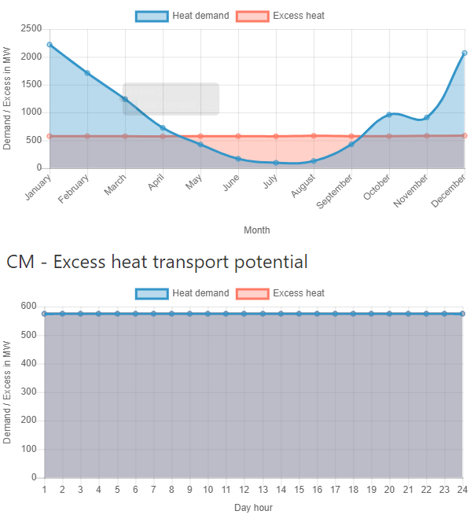

<h1><a class="anchor" id="cm-excess-heat-transport-potential" href="#cm-excess-heat-transport-potential"><i class="fa fa-link"></i></a>CM Perteklinis šilumos perdavimo potencialas</h1><h2><a class="anchor" id="table-of-contents" href="#table-of-contents"><i class="fa fa-link"></i></a> Turinys</h2><ul><li> <a href="#in-a-glance">Žvilgsniu</a></li><li> <a href="#introduction">Įvadas</a></li><li> <a href="#inputs-and-outputs">Įėjimai ir išėjimai</a><ul><li> <a href="#inputs-and-outputs_input-layers-and-parameters">Įvesties sluoksniai ir parametrai</a></li><li> <a href="#inputs-and-outputs_output">Rezultatas</a></li></ul></li><li> <a href="#method">Metodas</a><ul><li> <a href="#method_overview">Apžvalga</a></li><li> <a href="#method_details">Išsami informacija</a></li><li> <a href="#method_implementation">Įgyvendinimas</a></li></ul></li><li> <a href="#github-repository-of-this-calculation-module">Šio skaičiavimo modulio „GitHub“ saugykla</a></li><li> <a href="#quick-start">Greita pradžia</a></li><li> <a href="#troubleshooting">Problemų sprendimas</a></li><li> <a href="#sample-run">Pavyzdinis bėgimas</a></li><li> <a href="#how-to-cite">Kaip cituoti</a></li><li> <a href="#authors-and-reviewers">Autoriai ir recenzentai</a></li><li> <a href="#license">Licencija</a></li><li> <a href="#acknowledgement">Pripažinimas</a></li></ul><h2><a class="anchor" id="in-a-glance" href="#in-a-glance"><i class="fa fa-link"></i></a> Žvilgsniu</h2>
 Šis modulis apskaičiuoja šilumos perdavimo iš potencialių šilumos šaltinių, esančių už potencialių centralizuoto šilumos tiekimo zonų, srautus ir sąnaudas į centralizuoto šilumos tiekimo zonas. Įvestys yra šilumos pertekliaus valandos apkrovos profiliai ir centralizuoto šilumos poreikis, perteklinio šilumos šaltinio vieta ir potenciali centralizuoto šildymo sistema, investicijos į šilumokaičius ir perdavimo linijas bei atstumo ir perdavimo sąnaudų ribinės vertės.

 <a href="#table-of-contents"><strong><code>To Top</code></strong></a>
<h2><a class="anchor" id="introduction" href="#introduction"><i class="fa fa-link"></i></a> Įvadas</h2>
 Skaičiavimo modulis „Perteklinis šilumos perdavimo potencialas“ padės vartotojui nustatyti šilumos pertekliaus integravimo galimybes centralizuoto šilumos tiekimo tinkluose. Potencialai pagrįsti <a href="https://wiki.hotmaps.hevs.ch/en/CM-District-heating-potential-areas-user-defined-thresholds">CM - centralizuoto šilumos tiekimo potencialu</a> . Šis CM nustato teritorijas, kuriose yra palankios sąlygos centralizuoto šilumos tiekimo tinklams, ir parodo, kiek šilumos šiuose rajonuose gali būti padengta pertekline pramonine šiluma. Tačiau tai nereiškia, kad šiame regione jau yra centralizuoto šilumos tiekimo tinklas.

 Šie duomenys ir metodai yra sujungti su ankstesne užduotimi.

 Duomenys:
<ul><li>
 Šildymo reikalavimai netoliese esančioms vietovėms, kuriose yra palankios sąlygos centralizuoto šilumos tiekimo tinklams, kurie yra tirpinami kas valandą (iš <a href="https://wiki.hotmaps.hevs.ch/en/CM-District-heating-potential-areas-user-defined-thresholds">CM -</a> centralizuoto šilumos tiekimo <a href="https://wiki.hotmaps.hevs.ch/en/CM-District-heating-potential-areas-user-defined-thresholds">potencialo</a> ).
</li><li>
 Duomenys apie perteklinius pramonės įmonių šilumos kiekius rajone, kurie taip pat sprendžiami kas valandą (iš duomenų rinkinio pramonės duomenų bazės).
</li><li>
 Prielaidos apie šilumokaičių, siurblių ir vamzdynų sąnaudas bei šilumos nuostolius centralizuoto šilumos tiekimo vamzdynuose.
</li></ul>
 Metodas (supaprastintas):
<ul><li> Vamzdynų projektavimas remiantis sukurta euristika, atspindinčia projekto, kaip tinklo srauto, problemą.</li></ul>
 Metodo tikslas yra parodyti kuo didesnį perteklinį šilumos srautą su ne per daug ir todėl per ilgais vamzdynais galimiems centralizuoto šilumos tiekimo vartotojams, generuojant maksimalaus srauto tinklus. Tačiau galutiniame tinkle nėra atsižvelgiama į ypač neefektyvias transporto linijas (su mažais šilumos srautais ir dėl to didelėmis specifinėmis šilumos perdavimo sąnaudomis). Atskirų transporto linijų ekonominio efektyvumo ribą gali nurodyti vartotojas (plg. Perdavimo linijos slenkstį).

 Pagrindinis požiūrio pagrindas yra toks: jei yra tik keli šilumos pertekliaus šaltiniai, visada būtų galima atsižvelgti į vieną dujotiekį kiekvienam šaltiniui transportuojant šilumą į netoliese esančią teritoriją, kurioje yra palankios sąlygos centralizuotam šildymui. Tačiau jei yra keli pertekliniai šilumos šaltiniai, kurie turi tekėti į tą pačią teritoriją, būtų prasminga surinkti šilumą ir ją gabenti į teritoriją didesniu bendruoju dujotiekiu. Taikant vieną vamzdį vienam šaltiniui, paprastai pervertinamos dujotiekio pastangos.

 Siekiant neutralizuoti tai, kas išdėstyta pirmiau, dujotiekio planavimo problema buvo priartinta, prisiimant tinklo srauto problemą. Problemai išspręsti naudojamas euristinis metodas, pagal kurį šilumos perteklių galima sujungti ir perduoti galimiems vartotojams. Konkretus metodinis sprendimo dizainas, artėjant minimaliam tarpatramio medžiui, aprašytas atitinkamoje metodinėje dalyje. Dujotiekio projektas, nustatytas ankstesniame kontekste, nėra detalusis planas ar realus maršruto nurodymas, jis naudojamas tik apytikslėms šilumos pertekliaus paskirstymo artimiausiose teritorijose, kuriose yra palankios sąlygos centralizuoto šilumos tiekimo tinklams, paskirstymo sąnaudoms suderinti (žr. <a href="https://wiki.hotmaps.hevs.ch/en/CM-District-heating-potential-areas-user-defined-thresholds">CM - centralizuoto šildymo potencialas</a> , raktinių žodžių nuoseklios sritys). Taigi ši apytikslė išlaidų sąmata reiškia visą tinklą.

 Rezultatai pirmiausia turėtų būti aiškinami taip: jei užregistruoti pertekliniai šilumos kiekiai turėtų būti gabenami kartu į nurodytas netoliese esančias sritis, tada šilumos paskirstymo išlaidos gali būti tokios dydžio, kaip nurodyta įrankyje (plg. šilumos tiekimo). Paprastai viso tinklo vertės taip pat yra geras atskirų vamzdynų pradžios rodiklis. Rezultatų tikslas yra pateikti projekto rengėjui ar planuotojui galimų platinimo išlaidų dydį.

 <a href="#table-of-contents"><strong><code>To Top</code></strong></a>
<h2><a class="anchor" id="inputs-and-outputs" href="#inputs-and-outputs"><i class="fa fa-link"></i></a> Įėjimai ir išėjimai</h2><h3><a class="anchor" id="input-layers-and-parameters" href="#input-layers-and-parameters"><i class="fa fa-link"></i></a> Įvesties sluoksniai ir parametrai</h3><h4><a class="anchor" id="provided-by-toolbox" href="#provided-by-toolbox"><i class="fa fa-link"></i></a> Pateikė „Toolbox“</h4><ul><li>
 Centrinio šildymo zonos (kol kas tiesiogiai teikia centralizuoto šilumos tiekimo potencialo CM)
</li><li>
 Pramonės duomenų bazė (pagal numatytuosius nustatymus teikia įrankių rinkinys)
</li><li>
 Apkrovos profiliai pramonei
</li><li>
 Gyvenamųjų namų šildymo ir karšto vandens apkrovos profiliai
</li></ul><h4><a class="anchor" id="provided-by-the-user" href="#provided-by-the-user"><i class="fa fa-link"></i></a> Pateikė vartotojas</h4><ul><li>
 Min. šilumos poreikis vienam hektarui

 Žr. <a href="https://wiki.hotmaps.hevs.ch/en/CM-District-heating-potential-areas-user-defined-thresholds">CM - centralizuoto šildymo potencialas</a> .
</li><li>
 Min. šilumos poreikis CŠ srityje

 Žr. <a href="https://wiki.hotmaps.hevs.ch/en/CM-District-heating-potential-areas-user-defined-thresholds">CM - centralizuoto šildymo potencialas</a> .
</li><li>
 Įrangos tarnavimo laikas metais

 Išlygintos šilumos sąnaudos yra susijusios su šiuo laikotarpiu.
</li><li>
 Diskonto norma procentais

 Palūkanų norma už kreditą, reikalingą tinklui sukurti.
</li><li>
 Sąnaudų faktorius

 Veiksnys, leidžiantis pritaikyti tinklo sąnaudas, jei numatytosios vertės tiksliai neatitinka sąnaudų. Tinklui reikalingos investicijos padauginamos iš šio koeficiento. Numatytąsias išlaidas galite rasti skyriuje <a href="en-CM-Excess-heat-transport-potential#computation-of-costs">Sąnaudų apskaičiavimas</a> .
</li><li>
 Veiklos išlaidos,%

 Tinklo eksploatavimo išlaidos per metus. Procentais tinklui reikalingų investicijų.
</li><li>
 Ribinė perdavimo linijų vertė ct / kWh

 Didžiausia išlyginta kiekvienos perdavimo linijos šilumos kaina. Šis parametras gali būti naudojamas kontroliuoti išlygintą viso tinklo šilumos kainą. Mažesnė vertė yra lygi mažesnėms išlygintoms šilumos sąnaudoms, tačiau taip pat sumažėja sunaudota šiluma ir atvirkščiai.
</li></ul><h4><a class="anchor" id="performance-parameters" href="#performance-parameters"><i class="fa fa-link"></i></a> Našumo parametrai</h4><ul><li>
 Laiko skiriamoji geba

 Nustato intervalą tarp tinklo srauto skaičiavimo per visus metus. Gali būti viena iš šių reikšmių: (valanda, diena, savaitė, mėnuo, metai)
</li></ul>
 <a href="#table-of-contents"><strong><code>To Top</code></strong></a>
<h3><a class="anchor" id="output" href="#output"><i class="fa fa-link"></i></a> Rezultatas</h3><h4><a class="anchor" id="layers" href="#layers"><i class="fa fa-link"></i></a> Sluoksniai</h4><ul><li>
 Perdavimo linijos

 Formos failas, kuriame pateikiamos siūlomos perdavimo linijos, nurodant jų temperatūrą, metinį šilumos srautą ir kainą. Išsamią informaciją galite rasti čia.
</li></ul><h4><a class="anchor" id="indicators" href="#indicators"><i class="fa fa-link"></i></a> Rodikliai</h4><ul><li>
 Bendras šilumos perteklius pasirinktoje srityje GWh

 Bendras pramonės gamyklų turimas šilumos perteklius pasirinktoje vietovėje ir artumas.
</li><li>
 Šilumos perteklius, sujungtas GWh

 Bendras prie tinklo prijungtų pramonės įrenginių šilumos perteklius.
</li><li>
 Šilumos perteklius, naudojamas GWh

 Faktinis šilumos perteklius, naudojamas CŠT.
</li><li>
 Tinklui reikalingos investicijos eurais

 Tinklui sukurti reikalingos investicijos.
</li><li>
 Metinės tinklo išlaidos eurais per metus

 Išlaidos, kurias sukelia tinklo renta ir eksploatavimo išlaidos per metus.
</li><li>
 Išlygintos šilumos tiekimo sąnaudos ct / kWh

 išlyginta viso tinklo šilumos kaina.
</li></ul><h4><a class="anchor" id="graphics" href="#graphics"><i class="fa fa-link"></i></a> Grafika</h4><ul><li>
 CŠ potencialas ir šilumos perteklius

 Grafika, rodanti šilumos potencialą, bendrą šilumos perteklių, prijungtą šilumos perteklių ir panaudotą šilumos perteklių. Išsamią informaciją galite rasti <a href="en-CM-Excess-heat-transport-potential#dh-potential-and-excess-heat">čia</a> .
</li><li>
 Perteklinė sunaudota šiluma ir reikalingos investicijos

 Grafikas, rodantis per metus tiekiamą šilumos perteklių, reikalingą tinklui reikalingoms investicijoms. Išsamią informaciją galite rasti <a href="en-CM-Excess-heat-transport-potential#excess-heat-used-and-investment-necessary">čia</a> .
</li><li>
 Apkrovos kreivės

 Grafika, rodanti mėnesio šilumos poreikį ir perteklių. Išsamią informaciją galite rasti <a href="en-CM-Excess-heat-transport-potential#load-curves">čia</a> .
</li><li>
 Apkrovos kreivės

 Grafika, rodanti vidutinį dienos šilumos poreikį ir perteklių. Išsamią informaciją galite rasti <a href="en-CM-Excess-heat-transport-potential#load-curves">čia</a> .
</li></ul><h4><a class="anchor" id="examples-of-layer" href="#examples-of-layer"><i class="fa fa-link"></i></a> Sluoksnio pavyzdžiai</h4><h5><a class="anchor" id="transmission-lines" href="#transmission-lines"><i class="fa fa-link"></i></a> Perdavimo linijos</h5><figcaption> <i> Įrankių dėžutėje rodomo perdavimo linijos pavyzdys</i></figcaption>
 Spustelėjus perdavimo liniją, atsiras papildoma informacija.
<h4><a class="anchor" id="examples-of-graphics" href="#examples-of-graphics"><i class="fa fa-link"></i></a> Grafikos pavyzdžiai</h4><h5><a class="anchor" id="dh-potential-and-excess-heat" href="#dh-potential-and-excess-heat"><i class="fa fa-link"></i></a> CŠ potencialas ir šilumos perteklius</h5>
 <em>Ši grafika palygina šilumos potencialą, bendrą šilumos perteklių, prijungtą šilumos perteklių ir panaudotą šilumos perteklių.</em>

 Daugiau informacijos apie metinį šilumos poreikį ir šilumos potencialą rasite <a href="CM-District-heating-potential-areas-user-defined-thresholds">čia</a> . Šilumos perteklius sujungia šilumos perteklių ir sunaudotą šilumos perteklių yra tokie patys kaip jų vienodai įvardyti rodikliai, esantys skyriuje <a href="en-CM-Excess-heat-transport-potential#inputs-and-outputs_input-layers-and-parameters">Įvestis ir Išvestis</a> .
<h5><a class="anchor" id="load-curves" href="#load-curves"><i class="fa fa-link"></i></a> Apkrovos kreivės</h5><figure><figcaption><i> </i>
 <i>Ši grafika parodo bendrą srautą tinklu per metus. Apatinė grafika rodo vidutinę dieną.</i>
</figcaption></figure>
 X ašis rodo laiką ir y ašies galią. Mėlynos kreivės nurodo šilumos poreikį CŠ zonose, o raudonos - turimą šilumos perteklių. Abiejų kreivių sankirta nurodo faktinį bendrą šilumos srautą. Viršutinis grafikas parodo srautą per metus, o apatinis - vidutinės dienos srautą. Atminkite, kad <a href="en-CM-Excess-heat-transport-potential#performance-parameters">laiko skiriamoji geba</a> turi būti nustatyta bent į „mėnuo“ viršutiniam ir „valanda“, kad apatinė grafika būtų reprezentatyvi.

 <a href="#table-of-contents"><strong><code>To Top</code></strong></a>
<h2><a class="anchor" id="method" href="#method"><i class="fa fa-link"></i></a> Metodas</h2><h3><a class="anchor" id="overview" href="#overview"><i class="fa fa-link"></i></a> Apžvalga</h3>
 Pagrindinis šilumos pertekliaus modulio elementas yra naudojamas šaltinio ir kriauklės modelis. Jis kuria minimalaus ilgio perdavimo tinklą ir apskaičiuoja srautą kiekvienai metų valandai, remdamasis gyvenamųjų namų šildymo apkrovos profiliais su NUTS 2 skiriamąja geba ir pramonės apkrovos profiliais su NUTS 0 skiriamąja geba. Remiantis vidutiniais didžiausiais srautais per metus, gali būti apskaičiuotos kiekvienos perdavimo linijos ir šilumokaičio sąnaudos šaltinio ir kriauklės pusėje.

 <a href="#table-of-contents"><strong><code>To Top</code></strong></a>
<h3><a class="anchor" id="details" href="#details"><i class="fa fa-link"></i></a> Išsami informacija</h3><h4><a class="anchor" id="modeling-of-sources" href="#modeling-of-sources"><i class="fa fa-link"></i></a> Šaltinių modeliavimas</h4>
 Remiantis „NUTS 0 ID“ ir pramonės sektoriumi, kiekvienam šaltiniui priskiriamas visus metus trunkantis valandos nustatomas apkrovos profilis.
<h4><a class="anchor" id="modeling-of-sinks" href="#modeling-of-sinks"><i class="fa fa-link"></i></a> Kriauklių modeliavimas</h4>
 Remiantis centralizuoto šilumos tiekimo potencialo skaičiavimo moduliu, vienodose vietose kuriami įėjimo taškai. Priklausomai nuo įėjimo taškų NUTS 2 ID, priskiriamas apkrovos profilis.
<h4><a class="anchor" id="fixed-radius-search" href="#fixed-radius-search"><i class="fa fa-link"></i></a> Fiksuoto spindulio paieška</h4>
 Iš anksto nustatytu spinduliu tikrinama, kurie šaltiniai yra vienas kito diapazone, kurie kriauklės yra vienas kito diapazone ir kokie kriauklės yra šaltinių diapazone. Tai gali būti pavaizduota grafiku su šaltiniais ir kriauklėmis, formuojančiomis viršūnes ir diapazone esančias viršūnes, sujungtas kraštu.
<h4><a class="anchor" id="reduction-to-minimum-length-network" href="#reduction-to-minimum-length-network"><i class="fa fa-link"></i></a> Sumažinimas iki minimalaus ilgio tinklo</h4>
 Apskaičiuojamas mažiausias tarpatramio medis su kraštų atstumu kaip svoris. Dėl to grafikas išlaiko savo ryšį, tuo pačiu turėdamas mažiausią bendrą kraštų ilgį. Atkreipkite dėmesį, kad nuoseklių sričių įėjimo taškai yra nemokamai prijungti viduje, nes jie sudaro savo paskirstymo tinklą.
<h4><a class="anchor" id="flow-computation" href="#flow-computation"><i class="fa fa-link"></i></a> Srauto skaičiavimas</h4>
 Didžiausias srautas iš šaltinių į kriaukles apskaičiuojamas kiekvienai metų valandai.
<h4><a class="anchor" id="cost-determination" href="#cost-determination"><i class="fa fa-link"></i></a> Sąnaudų nustatymas</h4>
 Didžiausias metų srautas, apskaičiuotas vidutiniškai per 3 valandas, nustato reikiamą perdavimo linijų ir šilumokaičių pajėgumą. Perdavimo linijų sąnaudos priklauso nuo ilgio ir galingumo, o šilumokaičių sąnaudoms įtakos turi tik galingumas. Šaltinio pusėje daroma prielaida, kad oro – skysčio šilumokaitis su integruotu perdavimo linijos siurbliu, o kriauklės pusėje - skysčio – skysčio šilumokaitis.
<h4><a class="anchor" id="variation-of-network" href="#variation-of-network"><i class="fa fa-link"></i></a> Tinklo variacija</h4>
 Kadangi kiekvienos perdavimo linijos sąnaudos ir srautas yra žinomi, linijas, kurių sąnaudų ir srauto santykis yra didžiausias, galima pašalinti ir srautą perskaičiuoti, kol bus pasiekta norima kaina vienam srautui.

 <a href="#table-of-contents"><strong><code>To Top</code></strong></a>
<h3><a class="anchor" id="implementation" href="#implementation"><i class="fa fa-link"></i></a> Įgyvendinimas</h3><h4><a class="anchor" id="fixed-radius-search" href="#fixed-radius-search"><i class="fa fa-link"></i></a> Fiksuoto spindulio paieška</h4>
 Apskaičiuojant atstumą tarp dviejų taškų, naudojamas mažas loksodromo ilgio kampinis aproksimavimas. Nors taip pat tiksliai įgyvendinamas ortodromo atstumas, padidėjęs tikslumas neturi jokios realios naudos, nes maži atstumai dažniausiai yra mažesni nei 20 km, ir tikrojo perdavimo linijos ilgio neapibrėžtumas dėl daugelio veiksnių, tokių kaip topologija. Jei du taškai yra spindulio diapazone, jis saugomas gretimybių sąraše. Tokių gretimybių sąrašų kūrimas atliekamas tarp šaltinių ir šaltinių, kriauklių ir kriauklių bei šaltinių ir kriauklių. Atskyrimo priežastis yra lankstumas pridėti tam tikrus temperatūros reikalavimus šaltiniams ar kriauklėms.
<figure><figcaption> <i> Fiksuoto spindulio paieškos pavyzdys. Raudonos viršūnės reiškia šaltinius, o mėlynos - nuskęsta. Skaičiai rodo atstumą tarp taškų. Piešimas nėra mastelis.</i></figcaption></figure><h4><a class="anchor" id="networkgraph-class" href="#networkgraph-class"><i class="fa fa-link"></i></a> „NetworkGraph“ klasė</h4>
 Remiantis igraph biblioteka, yra įdiegta NetworkGraph klasė su visomis funkcijomis, reikalingomis skaičiavimo moduliui. Nors „igraph“ nėra pakankamai dokumentais pagrįstas, jis siūlo daug geresnį našumą nei gryni „python“ moduliai, pvz., „NetworkX“, ir platesnė platformos palaikymas už „Linux“, skirtingai nei grafiko įrankis. „NetworkGraph“ klasėje paviršiuje aprašomas tik vienas tinklas, tačiau joje yra 3 skirtingi grafikai. Pirma, grafikas, apibūdinantis tinklą, kurį apibrėžia trys gretimybių sąrašai. Antra, korespondencijos grafikas, jungiantis viduje tos pačios nuoseklios srities kriaukles, tęsiasi maksimalaus srauto grafike, naudojamu maksimaliam srauto skaičiavimui.
<h5><a class="anchor" id="graph" href="#graph"><i class="fa fa-link"></i></a> Grafikas</h5>
 Jame yra tikrieji šaltiniai ir grimzlės kaip viršūnės.
<figure><figcaption> <i> Grafiko pavyzdys. Raudonos viršūnės reiškia šaltinius, o mėlynos - nuskęsta.</i></figcaption></figure><h5><a class="anchor" id="correspondence-graph" href="#correspondence-graph"><i class="fa fa-link"></i></a> Susirašinėjimo grafikas</h5>
 Kiekvienai kriauklei reikalingas korespondencijos ID, kuris parodo, ar jis yra vidiškai sujungtas jau esančio tinklo, kaip nuosekliose srityse. Kriauklės su tuo pačiu korespondencijos ID yra sujungtos su nauja viršūne, kurios kraštai neturi nulinio svorio. Tai yra labai svarbu apskaičiuojant minimalų tarpatramį medį ir priežastį, kodėl jam naudojamas korespondencijos grafikas. Ši funkcija taip pat įdiegta šaltiniams, tačiau nenaudojama.
<figure><figcaption><i> </i>
 <i>Korespondencijos grafiko pavyzdys. Raudonos viršūnės reiškia šaltinius, o mėlynos - nuskęsta. Trys kriauklės, esančios dešinėje, yra sujungtos dar viena didesne viršūne</i>
</figcaption></figure><h5><a class="anchor" id="maximum-flow-graph" href="#maximum-flow-graph"><i class="fa fa-link"></i></a> Didžiausias srauto grafikas</h5>
 Kadangi igraph nepalaiko kelių šaltinių ir grimzta savo maksimalaus srauto funkcijoje, reikalingas pagalbinis grafikas. Tai pristato begalinį šaltinį ir kriauklės viršūnę. Kiekvienas tikras šaltinis yra sujungtas su begaliniu šaltiniu, o kiekvienas tikras kriauklė krašteliu sujungtas su begaline kriaukle. Atkreipkite dėmesį, kad jei kriauklė yra prijungta prie korespondencijos viršūnės, ši viršūnė bus sujungta, o ne pati kriauklė.
<figure><figcaption><i> </i>
 <i>Maksimalaus srauto grafiko pavyzdys.</i>
</figcaption></figure><h5><a class="anchor" id="minimum-spanning-tree-computation" href="#minimum-spanning-tree-computation"><i class="fa fa-link"></i></a> Minimalus skaičiuojamasis medžių skaičiavimas</h5>
 Remiantis korespondencijos grafiku, apskaičiuojamas minimalus apimantis medis. Briaunos, jungiančios koherentines kriaukles, visada turi svorį 0, todėl jos visada išliks minimalaus tarpatramio medžio dalimi.
<figure><figcaption><i> </i>
 <i>Atitikties grafiko su kiekvieno krašto svoriu ir jo mažiausiu besidriekiančiu medžiu pavyzdys.</i>
</figcaption></figure><h5><a class="anchor" id="maximum-flow-computation" href="#maximum-flow-computation"><i class="fa fa-link"></i></a> Maksimalus srauto apskaičiavimas</h5>
 Srautas per kraštus, jungiančius tikrus šaltinius arba kriaukles su atitinkamai begaliniu šaltiniu ar kriaukle, yra apribotas pagal tikrąjį kiekvieno šaltinio ar kriauklės pajėgumą. Dėl skaitinių priežasčių pajėgumai normalizuojami taip, kad didžiausias pajėgumas būtų 1. Srautas per kraštų pogrupį, pateiktą korespondencijos grafike, yra ribojamas iki 1000, kuris visais intensyviais ir tikslais turėtų pasiūlyti neribotą srautą. Tada apskaičiuojamas didžiausias srautas iš begalinio šaltinio į begalinę kriauklę ir srautas keičiamas iki pradinio dydžio. Kadangi koherentinės kriauklės nėra tiesiogiai sujungtos su begaline kriauklės viršūne, bet su korespondencijos viršūne, srautas per ją apsiriboja visų koherentinių kriauklių suma.
<figure><figcaption><i> </i>
 <i>Maksimalaus srauto grafiko ir kiekvieno šaltinio bei kriauklės talpos pavyzdys. Dešiniajame grafike parodytas didžiausias leistinas srautas per kiekvieną kraštą po normalizavimo. Atkreipkite dėmesį, kad didžiausias leidžiamas srautas per kraštus su begalybės simboliu įgyvendinant iš tikrųjų yra ribojamas iki 1000.</i>
</figcaption></figure>
 Įgyvendinant igraph maksimalaus srauto funkciją naudojamas „Push-relabel“ algoritmas. Šio tipo algoritmai nėra jautrūs kainai ir ne visada gali rasti trumpiausią srauto nukreipimo būdą. „Igraph“ nėra ekonomiškai jautraus algoritmo, o veikimas greičiausiai bus mažas, kad būtų galima išspręsti valandinį srautą ištisus metus. Tačiau dėl to, kad iš anksto sumažintas iki minimumo apimantis medis, atvejai, kai pasirenkamas ne idealus sprendimas, yra labai riboti ir mažai tikėtini. „Push-relabel“ algoritmas taip pat turi tendenciją nukreipti srautą per mažiausiai kraštų. Atrodo, kad „igraph“ įgyvendinimas yra determinantinis srauto paskirstymo tvarka, jei grafikai yra bent jau automorfizmai, o tai yra svarbu apskaičiuojant srautą pagal valandą, nes bet koks dirbtinai įvestas srauto svyravimas tarp kraštų yra nepageidaujamas.
<figure><figcaption> <i> Srautas apskaičiuojamas pagal maksimalaus srauto algoritmą ir perskaičiuojant iki pradinio dydžio.</i></figcaption></figure><h4><a class="anchor" id="heat-sources" href="#heat-sources"><i class="fa fa-link"></i></a> Šilumos šaltiniai</h4>
 Šilumos šaltiniai paimti iš <strong><a href="https://gitlab.com/hotmaps/industrial_sites/industrial_sites_Industrial_Database">pramonės duomenų bazės.</a></strong> Atsižvelgiant į jų perteklinę šilumą, „Nuts0 ID“ ir pramonės sektorių, kiekvienai svetainei sukuriamas apkrovos profilis, apimantis kiekvieną metų valandą. Numatomas svetainių pridėjimas.
<h4><a class="anchor" id="heat-sinks" href="#heat-sinks"><i class="fa fa-link"></i></a> Radiatoriai</h4>
 Radiatoriai grindžiami nuosekliomis vietovėmis, kurių šilumos poreikis yra žinomas. Nuoseklios sritys sudaro tinklelio kaukę, ant kurios vienodo atstumo taškai yra kaip įėjimo taškai. Priklausomai nuo pasirinkto NUTS 2 ID, kriauklėms priskiriamas gyvenamojo namo šildymo profilis. Numatytas įprastas įėjimo taškų ir kriauklių pridėjimas.
<figure><figcaption> <i> Suderintos srities ir jos sukurtų įėjimo taškų pavyzdys.</i></figcaption></figure><h4><a class="anchor" id="load-profiles" href="#load-profiles"><i class="fa fa-link"></i></a> Apkrovos profiliai</h4>
 Minėti apkrovos profiliai susideda iš 8760 taškų, kurie nurodo apkrovą kiekvienai 365 dienų valandai. Daugiau informacijos apie <strong><a href="https://gitlab.com/hotmaps/load_profile">apkrovos profilius rasite čia.</a></strong>
<h4><a class="anchor" id="computation-of-costs" href="#computation-of-costs"><i class="fa fa-link"></i></a> Išlaidų apskaičiavimas</h4>
 Kadangi centralizuoto šildymo sistemos turi didelę šiluminę galią, srauto maksimumas nereiškia, kad perdavimo linijos turi tą trumpą šilumos srautą tiekti akimirksniu. Todėl reikalingus perdavimo linijų ir šilumokaičių pajėgumus lemia vidutinė maksimali apkrova. Konkrečiai, skaičiaus konvoliucijos funkcija naudojama srautui per paskutines tris valandas vidutiniškai konvoliuoti naudojant pastovią funkciją. Atsižvelgiant į šią vertę, parenkama perdavimo linija iš šios lentelės.

 <em>Konkrečios naudojamų perdavimo linijų išlaidos</em>

 | Galia MW | Išlaidos EUR / m | Temperatūra ° C | | ------------- |: -------------: | -----: | | 0,2 | 195 | &lt;150 | | 0,3 | 206 | &lt;150 | | 0,6 | 220 | &lt;150 | | 1.2 | 240 | &lt;150 | | 1.9 | 261 | &lt;150 | | 3.6 | 288 | &lt;150 | | 6.1 | 323 | &lt;150 | | 9,8 | 357 | &lt;150 | | 20 | 426 | &lt;150 | | 45 | 564 | &lt;150 | | 75 | 701 | &lt;150 | | 125 | 839 | &lt;150 | | 190 | 976 | &lt;150 | | &gt; 190 | 976 | &lt;150 |

 Apskaičiuojamos šilumokaičio sąnaudos šaltinio pusėje, kuri laikoma oru skysčiui

 C HS šaltinis (en-P) = P smailė * 15 000 € / MW.

 Skysčio ir skysčio šilumokaičio kriauklės pusėje išlaidos nustatomos pagal

 C HSink (en-P) = P smailė * 265 000 € / MW, jei P smailė &lt;1MW arba

 C HSink (en-P) = P smailė * dar 100 000 EUR / MW.
<h4><a class="anchor" id="removal-of-transmission-lines" href="#removal-of-transmission-lines"><i class="fa fa-link"></i></a> Perdavimo linijų pašalinimas</h4>
 Naudojant perdavimo linijų sąnaudų ir srauto slenkstį, jas galima pašalinti, jei jos viršijamos, siekiant pagerinti srauto ir sąnaudų santykį. Pašalinus kraštus, srautas turi būti perskaičiuotas, nes srauto tęstinumas grafike nebeužtikrinamas. Dabar kainų ir srauto santykis gali padidėti ir kitose briaunose, todėl šis procesas kartojamas tol, kol visų srautų suma nebesikeis.
<h4><a class="anchor" id="description-of-the-complete-routine" href="#description-of-the-complete-routine"><i class="fa fa-link"></i></a> Visos rutinos aprašymas</h4>
 Pirma, šilumos šaltiniai ir kriauklės yra apkraunami jų apkrovos profiliais. Tada atliekama fiksuoto spindulio paieška ir inicializuojamas tinklas. Vėliau tinklas sumažinamas iki minimalaus aprėpiančio medžio ir apskaičiuojamas didžiausias srautas kiekvienai metų valandai. Pagal srautą apskaičiuojamos kiekvieno šilumokaičio, siurblio ir perdavimo linijos sąnaudos. Jei yra nustatytas ribinis sąnaudų ir srauto santykis, atliekama perdavimo linijos pašalinimo procedūra. Galų gale grąžinamos visos tinklo išlaidos ir bendras srautas bei tinklo išdėstymas.

 <a href="#table-of-contents"><strong><code>To Top</code></strong></a>
<h2><a class="anchor" id="github-repository-of-this-calculation-module" href="#github-repository-of-this-calculation-module"><i class="fa fa-link"></i></a> Šio skaičiavimo modulio „GitHub“ saugykla</h2>
 <a href="https://github.com/HotMaps/excess_heat_cm/tree/develop">Čia</a> gausite šio skaičiavimo modulio pažangiausią vystymąsi.

 <a href="#table-of-contents"><strong><code>To Top</code></strong></a>
<h2><a class="anchor" id="quick-start" href="#quick-start"><i class="fa fa-link"></i></a> Greita pradžia</h2>
 Šis CM - Perteklinės šilumos perdavimo potencialas yra skirtas padėti vartotojui nustatyti šilumos pertekliaus integravimo galimybes centralizuoto šilumos tiekimo tinkluose. Nors, norint neapriboti vartotojo, suteikiama daugybė analizės funkcijų, reikia aiškiai pabrėžti, kad tai nėra detalus techninis planavimas. Potencialai pagrįsti <a href="https://wiki.hotmaps.hevs.ch/en/CM-District-heating-potential-areas-user-defined-thresholds">CM - centralizuoto šilumos tiekimo potencialu</a> . Šis CM nustato vietoves, kuriose yra palankios sąlygos centralizuoto šilumos tiekimo tinklams. Taigi tai parodo, kiek šilumos gali padengti pramoninis šilumos perteklius šiose vietovėse. Tačiau tai nereiškia, kad šiame regione jau yra centralizuoto šilumos tiekimo tinklas. Todėl praktikams pritaikytas įrankio naudojimas gali atrodyti taip:
<ul><li>
 Jei reikia, pridėkite savo duomenis apie šilumos perteklių, teikiančią regiono įmonėms <a href="https://wiki.hotmaps.hevs.ch/en/CM-Add-industry-plant">papildomą pramonės gamyklą</a> CM.
</li><li>
 Įjunkite parinktį „Pramonės objektų perteklinė šiluma“
</li><li>
 Vykdykite CM - PERTEKLIŲ ŠILUMOS TRANSPORTO POTENCIALĄ.
</li><li>
 Vertė
</li></ul><figure><figcaption> <i>Ši grafika palygina šilumos potencialą, bendrą šilumos perteklių, prijungtą šilumos perteklių ir panaudotą šilumos perteklių.</i></figcaption></figure>
 Ši grafika parodo, kiek šilumos gali padengti perteklinė šiluma tiriamoje teritorijoje.
<ul><li> Vertė</li></ul><figure><figcaption> <i>Rodikliai Būtinos investicijos, metinės išlaidos ir išlygintos šilumos sąnaudos</i></figcaption></figure>
 Šioje grafikoje parodytos specifinės šilumos gamybos išlaidos visame tinkle. Pastaba: rodomos išlaidos buvo įvertintos taikant supaprastintą metodą. Šios išlaidos netaikomos atskiriems vamzdynams. Tačiau pateiktos išlaidos gali būti naudojamos kaip supaprastinta pradinė prielaida, nes transporto sąnaudos integruojant šilumos perteklių į galbūt netoliese esantį centralizuoto šilumos tiekimo tinklą.

 Iš to, kas išdėstyta pirmiau, galima naudoti šią darbo hierarchiją:
<ol><li>
 Patikrinkite, ar aptariamame regione yra ar yra planuojamas centralizuoto šilumos tiekimo tinklas.
</li><li>
 Rodomuose vamzdžiuose yra srautų. Čia galite pamatyti, kiek šilumos pertekliaus perduodama iš atitinkamų šaltinių. Dabar buvo galima susisiekti su nukentėjusiomis bendrovėmis. Tikriausiai pirmiausia įmonės, turinčios didelius kiekius.
</li></ol><figure><figcaption> <i>Perdavimo linija ir jos srautas</i></figcaption></figure><ol start="3"><li> Jei centralizuoto šilumos tiekimo tinklo operatorius ir šilumos pertekliaus gamintojas norėtų bendradarbiauti, būtų galima užsakyti išsamesnes galimybių studijas. Geriausiu atveju rodomi duomenys padės inicijuoti realius projektus.</li></ol>
 <a href="#table-of-contents"><strong><code>To Top</code></strong></a>
<h2><a class="anchor" id="troubleshooting" href="#troubleshooting"><i class="fa fa-link"></i></a> Problemų sprendimas</h2><h3><a class="anchor" id="cm-does-not-finish" href="#cm-does-not-finish"><i class="fa fa-link"></i></a> CM nebaigia</h3><ul><li> Sumažinkite erdvinę skiriamąją gebą</li><li> Sumažinkite laiko skiriamąją gebą</li><li> Pasirinkite mažesnį plotą</li><li> Pakartokite vėliau</li></ul><h3><a class="anchor" id="cm-crashes-without-a-message" href="#cm-crashes-without-a-message"><i class="fa fa-link"></i></a> CM užstringa be žinutės</h3><ul><li> Pakartokite vėliau</li><li> Susisiekite su CM kūrėju</li></ul><h3><a class="anchor" id="error--"no-dh-area-in-selection."" href="#error--"no-dh-area-in-selection.""><i class="fa fa-link"></i></a> Klaida: „Pasirenkama ne DH sritis“.</h3>
 Patikrinkite <a href="https://wiki.hotmaps.hevs.ch/en/CM-District-heating-potential-areas-user-defined-thresholds">CŠT potencialą CM,</a> kad pritaikytumėte įvestis taip, kad būtų sukurta DH sritis.
<h3><a class="anchor" id="error--"no-industrial-sites-in-the-selected-area."" href="#error--"no-industrial-sites-in-the-selected-area.""><i class="fa fa-link"></i></a> Klaida: „Pasirinktoje vietovėje nėra pramonės objektų“</h3>
 Vartotojo pasirinkime patikrinkite sluoksnį „pramoninės svetainės“.
<h3><a class="anchor" id="error--"no-entry-points-in-selected-area."" href="#error--"no-entry-points-in-selected-area.""><i class="fa fa-link"></i></a> Klaida: &quot;Pasirinktoje srityje nėra įėjimo taškų&quot;.</h3>
 Patikrinkite <a href="#troubleshooting_warning-no-industry-profiles-available-for">įspėjimą</a> .
<h3><a class="anchor" id="error--"no-industrial-sites-in-range."" href="#error--"no-industrial-sites-in-range.""><i class="fa fa-link"></i></a> Klaida: &quot;Nėra pramonės vietų.&quot;</h3>
 Pasirinkite didesnę sritį, kurioje rasite bent vieną pramonės vietą, remdamiesi numatytuoju pramonės duomenų rinkiniu, esančiu „Hotmaps“ įrankių rinkinyje.
<h3><a class="anchor" id="error--"no-excess-heat-used."" href="#error--"no-excess-heat-used.""><i class="fa fa-link"></i></a> Klaida: &quot;Nenaudojama perteklinė šiluma&quot;.</h3>
 Padidinkite <a href="#inputs-and-outputs_input-layers-and-parameters_provided-by-the-user">perdavimo linijos slenkstį</a>
<h3><a class="anchor" id="warning--"no-industry-profiles-available-for-..."" href="#warning--"no-industry-profiles-available-for-...""><i class="fa fa-link"></i></a> Įspėjimas: „Nėra pramonės profilių, skirtų ...</h3>
 Patikrinkite įkeltų pramoninių svetainių šalį ir subsektorių.
<h3><a class="anchor" id="warning--"no-residential-heating-profile-available-for-..."" href="#warning--"no-residential-heating-profile-available-for-...""><i class="fa fa-link"></i></a> Įspėjimas: „Nėra gyvenamojo namo šildymo profilio ...“</h3>
 CM neturi prieigos prie gyvenamųjų namų šildymo profilio duomenų, kurie turi būti vykdomi šioje srityje.

 <a href="#table-of-contents"><strong><code>To Top</code></strong></a>
<h2><a class="anchor" id="sample-run" href="#sample-run"><i class="fa fa-link"></i></a> Pavyzdinis bėgimas</h2>
 Pavyzdinis paleidimas naudojant PL22 su numatytaisiais parametrais. Sluoksnių skirtuke rekomenduojama įjungti perteklines šilumos vietas.
<figure><figcaption> <i>Mėginys paleisti PL22. Rausvos zonos atspindi centralizuotą šildymą. Oranžinė apgaubia šilumos šaltinį, o oranžinė linija - tinklo perdavimo linijas.</i></figcaption></figure><figure><figcaption> <i> Ši grafika parodo bendrą srautą tinklu per metus. Apatinė grafika rodo vidutinę dieną. Kadangi numatytoji laiko skiriamoji geba yra „savaitė“, šiuo atveju ji yra pastovi.</i></figcaption></figure>
 <a href="#table-of-contents"><strong><code>To Top</code></strong></a>
<h2><a class="anchor" id="how-to-cite" href="#how-to-cite"><i class="fa fa-link"></i></a> Kaip cituoti</h2>
 Ali Aydemir ir Davidas Schillingas, „Hotmaps Wiki“, CM Perteklinis šilumos perdavimo potencialas (2020 m. Rugsėjis)

 <a href="#table-of-contents"><strong><code>To Top</code></strong></a>
<h2><a class="anchor" id="authors-and-reviewers" href="#authors-and-reviewers"><i class="fa fa-link"></i></a> Autoriai ir recenzentai</h2>
 Šį puslapį parašė Ali Aydemir ir Davidas Schillingas („ <strong><a href="https://isi.fraunhofer.de/">Fraunhofer ISI“</a></strong> ).

 ☑ Šį puslapį peržiūrėjo Tobiasas Fleiteris („ <strong><a href="https://isi.fraunhofer.de/">Fraunhofer ISI“</a></strong> ).

 <a href="#table-of-contents"><strong><code>To Top</code></strong></a>
<h2><a class="anchor" id="license" href="#license"><i class="fa fa-link"></i></a> Licencija</h2>
 Autorių teisės © 2016-2020: Ali Aydemir ir Davidas Schillingas

 „Creative Commons Attribution 4.0“ tarptautinė licencija

 Šis darbas licencijuotas pagal „Creative Commons CC BY 4.0“ tarptautinę licenciją.

 SPDX licencijos identifikatorius: CC-BY-4.0

 Licencijos tekstas: https://spdx.org/licenses/CC-BY-4.0.html

 <a href="#table-of-contents"><strong><code>To Top</code></strong></a>
<h2><a class="anchor" id="acknowledgement" href="#acknowledgement"><i class="fa fa-link"></i></a> Pripažinimas</h2>
 Norėtume nuoširdžiai vertinti „Horizon 2020“ „ <a href="https://www.hotmaps-project.eu">Hotmaps“ projektą</a> (dotacijos sutarties numeris 723677), kuris skyrė finansavimą šiam tyrimui atlikti.

 <a href="#table-of-contents"><strong><code>To Top</code></strong></a>

<!--- THIS IS A SUPER UNIQUE IDENTIFIER -->

This page was automatically translated. View in another language:

[English](../en/CM-Excess-heat-transport-potential) (original) [Bulgarian](../bg/CM-Excess-heat-transport-potential)\* [Czech](../cs/CM-Excess-heat-transport-potential)\* [Danish](../da/CM-Excess-heat-transport-potential)\* [German](../de/CM-Excess-heat-transport-potential)\* [Greek](../el/CM-Excess-heat-transport-potential)\* [Spanish](../es/CM-Excess-heat-transport-potential)\* [Estonian](../et/CM-Excess-heat-transport-potential)\* [Finnish](../fi/CM-Excess-heat-transport-potential)\* [French](../fr/CM-Excess-heat-transport-potential)\* [Irish](../ga/CM-Excess-heat-transport-potential)\* [Croatian](../hr/CM-Excess-heat-transport-potential)\* [Hungarian](../hu/CM-Excess-heat-transport-potential)\* [Italian](../it/CM-Excess-heat-transport-potential)\*  [Latvian](../lv/CM-Excess-heat-transport-potential)\* [Maltese](../mt/CM-Excess-heat-transport-potential)\* [Dutch](../nl/CM-Excess-heat-transport-potential)\* [Polish](../pl/CM-Excess-heat-transport-potential)\* [Portuguese (Portugal, Brazil)](../pt/CM-Excess-heat-transport-potential)\* [Romanian](../ro/CM-Excess-heat-transport-potential)\* [Slovak](../sk/CM-Excess-heat-transport-potential)\* [Slovenian](../sl/CM-Excess-heat-transport-potential)\* [Swedish](../sv/CM-Excess-heat-transport-potential)\* 

\* machine translated
