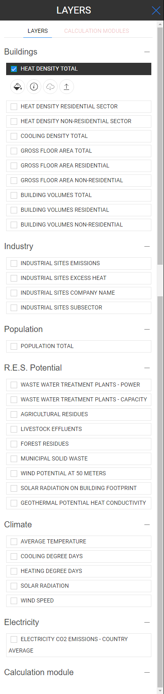
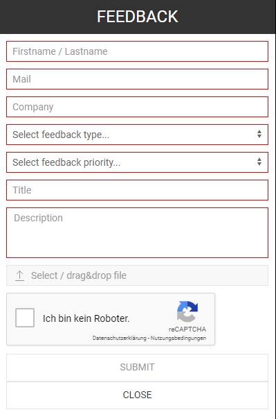

<h1><a class="anchor" id="introduction-to-user-interface" href="#introduction-to-user-interface"><i class="fa fa-link"></i></a>Įvadas į vartotojo sąsają</h1><h2><a class="anchor" id="table-of-contents" href="#table-of-contents"><i class="fa fa-link"></i></a> Turinys</h2><ul><li>
 <a href="#introduction-page">Įvadas</a>
</li><li>
 <a href="#upper-toolbar">Viršutinė įrankių juosta</a>
<ul><li> <a href="#upper-toolbar_connect">Prisijungti</a><ul><li> <a href="#upper-toolbar_connect_login">Prisijungti</a></li><li> <a href="#upper-toolbar_connect_register">Registruotis</a></li><li> <a href="#upper-toolbar_connect_recover">Atsigauti</a></li></ul></li><li> <a href="#upper-toolbar_go-to-place">Eiti į vietą</a></li><li> <a href="#upper-toolbar_layers">Sluoksniai</a></li><li> <a href="#upper-toolbar_selection-tools">Pasirinkimo įrankiai</a></li><li> <a href="#upper-toolbar_show-result">Rodyti rezultatą</a></li><li> <a href="#upper-toolbar_feedback">Atsiliepimas</a></li><li> <a href="#upper-toolbar_save-session">Išsaugoti sesiją</a></li><li> <a href="#upper-toolbar_save-session-folder">Išsaugoti sesijos aplanką</a></li></ul></li><li>
 <a href="#tiles">Plytelės</a>
</li><li>
 <a href="#how-to-cite">Kaip cituoti</a>
</li><li>
 <a href="#authors-and-reviewers">Autoriai ir recenzentai</a>
</li><li>
 <a href="#license">Licencija</a>
</li><li>
 <a href="#acknowledgement">Pripažinimas</a>
</li></ul><h2><a class="anchor" id="introduction-page" href="#introduction-page"><i class="fa fa-link"></i></a> Įvadas</h2>
 Atidarius įrankių dėžę, bus rodomas atsisakymo puslapis. Be atsakomybės atsisakymo pranešimo pateikiama papildoma informacija apie palaikomas naršykles, „Hotmaps“ projekto tikslus, nuoroda į „Hotmaps“ projekto svetainę ir duomenų saugyklas.

 <em>1 pav. Trumpas „Hotmaps“ įrankių rinkinio įvadas</em>

 „Hotmaps“ GUI yra GIS sąsaja. Uždaręs atsisakymo puslapį, vartotojas mato Europos žemėlapį. Pagal numatytuosius nustatymus pavaizduotas ES-28 šalių šilumos poreikio tankio žemėlapis ir NUTS 2 ribos. Be šių dviejų žemėlapių, GUI galima pamatyti keletą įrankių ir mygtukų. Šie įrankiai pavaizduoti kitame paveiksle.

 <em>2 pav. Pradinis puslapis</em>

 Iš pirmo žvilgsnio galite pastebėti 3 vartotojo sąsajos dalis:
<ol><li> <a href="#upper-toolbar">įrankių juosta viršuje kairėje</a> ,</li><li> pats žemėlapis,</li><li> <a href="#tiles">kai kurie žemėlapio stiliaus keitimo įrankiai</a> .</li><li> dvi nuorodos viršuje dešinėje: į šį „ <a href="https://wiki.hotmaps.eu/">Hotmaps Wiki“</a> ir „ <a href="https://www.hotmaps-project.eu/">Hotmaps Project“ tinklalapį</a> .</li></ol>
 Kituose skyriuose pirmieji 3 punktai yra išsamiai paaiškinti.

 <a href="#table-of-contents"><strong><code>To Top</code></strong></a>
<h2><a class="anchor" id="upper-toolbar" href="#upper-toolbar"><i class="fa fa-link"></i></a> Viršutinė įrankių juosta</h2>

 Naudodami šią įrankių juostą galite:
<ol><li> <a href="#upper-toolbar_connect"><em>Prisijungimas:</em></a> prisiregistruokite ir prisijunkite prie interneto programos, kad išsaugotumėte savo darbą,</li><li> <a href="#upper-toolbar_go-to-place"><em>Eiti į vietą:</em></a> priartinkite konkretų regioną įvesdami pavadinimą,</li><li> <a href="#upper-toolbar_layers"><em>Sluoksniai:</em></a> rodyti sluoksnio šoninę juostą,</li><li> <a href="#upper-toolbar_selection-tools"><em>Pasirinkimo įrankiai</em> :</a> įjungti arba išjungti pasirinkimo įrankius,</li><li> <a href="#upper-toolbar_show-result"><em>Rodyti rezultatą:</em></a> rodyti pasirinktų regionų rezultatų šoninę juostą,</li><li> <a href="#upper-toolbar_feedback"><em>Atsiliepimai:</em></a> pateikite atsiliepimų apie įrankį,</li><li> <a href="#upper-toolbar_save-session"><em>Išsaugoti seansą:</em></a> galite išsaugoti pasirinktus sluoksnius ir priartinimo lygį ir vėliau juos atšaukti,</li><li> <a href="#upper-toolbar_save-session-folder"><em>Išsaugoti seansų aplanką:</em></a> kur galite pamatyti visų išsaugotų seansų sąrašą.</li></ol>
 <a href="#table-of-contents"><strong><code>To Top</code></strong></a>
<h3><a class="anchor" id="connect" href="#connect"><i class="fa fa-link"></i></a> Prisijungti</h3>
 Čia galite:
<ul><li> Sukurti paskyrą</li><li> Prisijunkite prie savo paskyros, kad išsaugotumėte pažangą</li><li> Arba iš naujo nustatykite slaptažodį, jei jį pamiršote</li></ul>
 <a href="#table-of-contents"><strong><code>To Top</code></strong></a>
<h4><a class="anchor" id="login" href="#login"><i class="fa fa-link"></i></a> Prisijungti</h4>
 <a href="#register">Užregistravę</a> ir suaktyvinę savo sąskaitą, turėtumėte galėti prisijungti naudodami savo el. Pašto adresą ir slaptažodį (žr. 4 <a href="#fig4">pav.</a> ).

 <em>4 pav .: Prisijungimo forma</em>

 <a href="#table-of-contents"><strong><code>To Top</code></strong></a>
<h4><a class="anchor" id="register" href="#register"><i class="fa fa-link"></i></a> Registruotis</h4>
 Čia galite sukurti „ <em>hotmaps“</em> svetainės paskyrą. Pateikę <a href="#fig5">formą</a> gausite el. Laišką apie paskyros aktyvavimą. Su savo sąskaita galėsite išsaugoti savo pažangą.

 <em>5 pav .: Registracijos forma</em>

 <a href="#table-of-contents"><strong><code>To Top</code></strong></a>
<h4><a class="anchor" id="recover" href="#recover"><i class="fa fa-link"></i></a> Atsigauti</h4>
 Jei kada pamiršote slaptažodį, galite jį atkurti šiame meniu (žr. <a href="#fig6">6 pav.</a> Žemiau). Nepamirškite paskui nustatyti naujo slaptažodžio.

 <em>6 pav .: Atkurti formą</em>

 <a href="#table-of-contents"><strong><code>To Top</code></strong></a>
<h3><a class="anchor" id="go-to-place" href="#go-to-place"><i class="fa fa-link"></i></a> Eiti į vietą</h3>
 Galite padidinti mastelį iki nurodyto regiono, įvesdami jo pavadinimą (žr. Animaciją žemiau)

 <a href="#table-of-contents"><strong><code>To Top</code></strong></a>
<h3><a class="anchor" id="layers" href="#layers"><i class="fa fa-link"></i></a> Sluoksniai</h3>
 Paspaudus šį mygtuką kairėje rodoma šoninė juosta su skirtingais sluoksniais.

 Galite rasti ir vizualizuoti šiuos sluoksnius:

 <a href="#table-of-contents"><strong><code>To Top</code></strong></a>
<h3><a class="anchor" id="selection-tools" href="#selection-tools"><i class="fa fa-link"></i></a> Pasirinkimo įrankiai</h3>
 Paspaudus šį mygtuką, ekrano kairėje bus rodomi pasirinkimo įrankiai

 Žemiau pateiktame paveikslėlyje parodyta įrankių išvaizda:

<ol><li> Regionų pasirinkimo įrankis</li><li> Sukurkite pasirinktinį kvadratinį regioną</li><li> Sukurkite pasirinktinį apskritimo regioną</li><li> Sukurkite pasirinktinį daugiakampio sritį</li><li> Įkelkite „GeoJSON“ objektą, kad galėtumėte naudoti pasirinktinį srities pasirinkimą</li></ol><ol type="A"><li> parodo, kiek regionų pasirinkote</li><li> rodo mažiausio stačiakampio, galinčio padengti pasirinktą plotą, bendrą paviršių</li><li> rodo mastelį, kurį pasirinkote dešinėje įrankių juostoje</li></ol><ol type="a"><li> mygtukas jūsų pasirinkto regiono ir pasirinktų sluoksnių rezultatų įkėlimui</li><li> mygtukas pasirinktam regionui ištrinti</li></ol>
 <a href="#table-of-contents"><strong><code>To Top</code></strong></a>
<h3><a class="anchor" id="show-result" href="#show-result"><i class="fa fa-link"></i></a> Rodyti rezultatą</h3>
 Priklausomai nuo pasirinktų sluoksnių ir regiono, jūsų konfigūracijos rezultatai rodomi šoninėje juostoje ekrano dešinėje

 <a href="#table-of-contents"><strong><code>To Top</code></strong></a>
<h3><a class="anchor" id="feedback" href="#feedback"><i class="fa fa-link"></i></a> Atsiliepimas</h3>
 Ar turite pasiūlymų, kaip patobulinti įrankį? Ar pastebėjote klaidų? Prašau Pranešk mums! Pateikdami mums atsiliepimus, galite padėti tobulinti įrankių rinkinį!

 Užpildykite žemiau esančią <a href="#Fig7">formą</a> :

 <a href="#table-of-contents"><strong><code>To Top</code></strong></a>

 galite rinktis iš šių tipų:

 ir nustatykite prioritetą:

 <a href="#table-of-contents"><strong><code>To Top</code></strong></a>
<h3><a class="anchor" id="save-session" href="#save-session"><i class="fa fa-link"></i></a> Išsaugoti sesiją</h3>
 paspausdami šį mygtuką galite padaryti savo darbo momentinę nuotrauką (pasirinktas sritis ir sluoksnius, mastelio keitimo lygius ir kt.). Taip pat galite apibrėžti momentinės nuotraukos pavadinimą ir aprašą.
<h3><a class="anchor" id="save-session-folder" href="#save-session-folder"><i class="fa fa-link"></i></a> Išsaugoti sesijos aplanką</h3>
 Čia matote visas savo nuotraukas su jų pavadinimais ir aprašymu. Kai pasirenkate vieną, įkeliami pasirinkti sluoksniai, sritys, mastelio lygis ir kita konfigūracija.
<h2><a class="anchor" id="tiles" href="#tiles"><i class="fa fa-link"></i></a> Plytelės</h2>
 Galite pasirinkti teritorinę skalę, kurią norite analizuoti (NUTS regionai arba hektaro lygis), ir nustatyti žemėlapio išklotinę

 Galimos šios konfigūracijos

<ol><li> Padidinkite ir priartinkite žemėlapį</li><li> Rodyti NUTS ribas pasirinkti konkrečius NUTS regionus arba naudoti ha pritaikyti savo <a href="#upper-toolbar_selection-tools">pasirinkimą</a></li><li> Naudokite plyteles „OpenStreetMap“ arba „Satelite“</li></ol>
 <a href="#table-of-contents"><strong><code>To Top</code></strong></a>
<h2><a class="anchor" id="how-to-cite" href="#how-to-cite"><i class="fa fa-link"></i></a> Kaip cituoti</h2>
 Jetonas Hasani, „Hotmaps-Wiki“, įvadas į vartotojo sąsają (2019 m. Balandžio mėn.)

 <a href="#table-of-contents"><strong><code>To Top</code></strong></a>
<h2><a class="anchor" id="authors-and-reviewers" href="#authors-and-reviewers"><i class="fa fa-link"></i></a> Autoriai ir recenzentai</h2>
 Šį puslapį parašė Jeton Hasani <strong><a href="https://eeg.tuwien.ac.at/">EEG - TU Wien</a></strong> .

 ☑ Šį puslapį peržiūrėjo Mostafa Fallahnejad <strong><a href="https://eeg.tuwien.ac.at/">EEG - TU Wien</a></strong> .

 <a href="#table-of-contents"><strong><code>To Top</code></strong></a>
<h2><a class="anchor" id="license" href="#license"><i class="fa fa-link"></i></a> Licencija</h2>
 Autorių teisės © 2016-2020: Jetonas Hasani

 „Creative Commons Attribution 4.0“ tarptautinė licencija

 Šis darbas licencijuotas pagal „Creative Commons CC BY 4.0“ tarptautinę licenciją.

 SPDX licencijos identifikatorius: CC-BY-4.0

 Licencijos tekstas: https://spdx.org/licenses/CC-BY-4.0.html

 <a href="#table-of-contents"><strong><code>To Top</code></strong></a>
<h2><a class="anchor" id="acknowledgement" href="#acknowledgement"><i class="fa fa-link"></i></a> Pripažinimas</h2>
 Norėtume nuoširdžiai vertinti „Horizon 2020“ „ <a href="https://www.hotmaps-project.eu">Hotmaps“ projektą</a> (dotacijos sutarties numeris 723677), kuris skyrė finansavimą šiam tyrimui atlikti.

 <a href="#table-of-contents"><strong><code>To Top</code></strong></a>

<!--- THIS IS A SUPER UNIQUE IDENTIFIER -->

This page was automatically translated. View in another language:

[English](../en/Introduction-to-user-interface) (original) [Bulgarian](../bg/Introduction-to-user-interface)\* [Czech](../cs/Introduction-to-user-interface)\* [Danish](../da/Introduction-to-user-interface)\* [German](../de/Introduction-to-user-interface)\* [Greek](../el/Introduction-to-user-interface)\* [Spanish](../es/Introduction-to-user-interface)\* [Estonian](../et/Introduction-to-user-interface)\* [Finnish](../fi/Introduction-to-user-interface)\* [French](../fr/Introduction-to-user-interface)\* [Irish](../ga/Introduction-to-user-interface)\* [Croatian](../hr/Introduction-to-user-interface)\* [Hungarian](../hu/Introduction-to-user-interface)\* [Italian](../it/Introduction-to-user-interface)\*  [Latvian](../lv/Introduction-to-user-interface)\* [Maltese](../mt/Introduction-to-user-interface)\* [Dutch](../nl/Introduction-to-user-interface)\* [Polish](../pl/Introduction-to-user-interface)\* [Portuguese (Portugal, Brazil)](../pt/Introduction-to-user-interface)\* [Romanian](../ro/Introduction-to-user-interface)\* [Slovak](../sk/Introduction-to-user-interface)\* [Slovenian](../sl/Introduction-to-user-interface)\* [Swedish](../sv/Introduction-to-user-interface)\* 

\* machine translated
