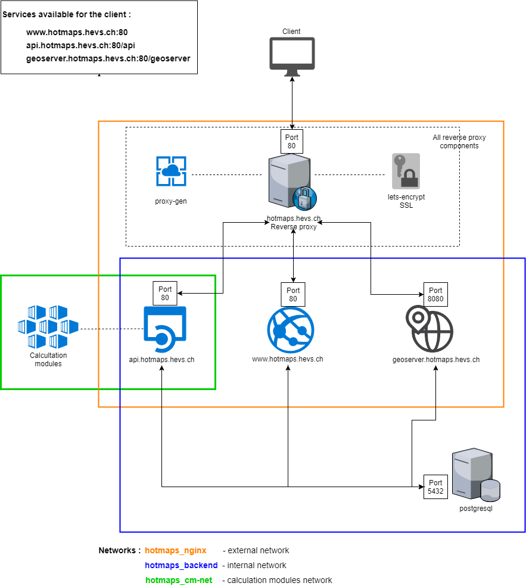

<h2> Satura rādītājs </h2><ul><li> <a href="#Introduction">Ievads</a> </li><li> <a href="#Dataset-integration">Datu kopas integrācija</a> </li><li> <a href="#add-your-datasets-on-gitlab">Pievienojiet savas datu kopas vietnē GitLab</a> </li><li> <a href="#List-of-main-repositories">Galveno krātuvju saraksts</a> </li><li> <a href="#How-to-contribute-code">Kā ievadīt kodu</a> </li><li> <a href="#Description-of-IT-infrastructure">IT infrastruktūras apraksts</a> <ul><li> <a href="#Run-with-Docker">Skrien ar Docker</a> </li><li> <a href="#Server-infrastructure">Serveru infrastruktūra</a> <ul><li> <a href="#Infrastructure">Infrastruktūra</a> </li><li> <a href="#Performance">Performance</a> </li></ul></li></ul></li><li> <a href="#How-to-define-indicators">Kā definēt rādītājus</a> </li><li> <a href="#References">Atsauces</a> </li><li> <a href="#How-to-cite">Kā citēt</a> </li><li> <a href="#Authors-and-reviewers">Autori un recenzenti</a> </li><li> <a href="#Acknowledgement">Apstiprinājums</a> </li></ul><h2> Ievads </h2>
 Šajā lapā ir visa informācija, kas izstrādātājiem nepieciešama, lai sniegtu ieguldījumu Hotmaps platformā vai lai saprastu, kā tā darbojas. 

<ins> <code><strong><a href="#table-of-contents">To Top</a></strong></code> </ins> 
<h2> Datu kopas integrācija </h2>
 Jaunu publisko datu kopu integrācija tiek veikta šādi: 
<ol><li> datu <a href="#Add-your-datasets-on-GitLab">kopas jāpārvieto</a> uz GIT krātuvi ( <a href="#Add-your-datasets-on-GitLab">pievienojiet savas datu kopas vietnē GitLab</a> ) </li><li> Katru vakaru skripts integrē jaunās / atjauninātās datu kopas DEV platformā </li><li> ja viss darbojās labi, datu kopa tagad ir pieejama DEV platformā, un izstrādātāji to var integrēt savā kodā </li><li> Kad kodēšana ir pabeigta, jaunās funkcijas ražošanas platformai tiek pievienotas, izmantojot jaunu izlaidumu </li></ol>

 Ja datu kopa neizdodas integrācijas laikā, problēma tiek izveidota Taiga (projekta vadības platforma). Problēma parāda radušos kļūdu, un izstrādātājam tas jālabo un vēlreiz jāpiesaka Git, lai skripts varētu mēģināt to atkal integrēt nākamajā vakarā. 

 Integrācijas skripta avota kods ir pieejams šajā saitē: <a href="https://github.com/HotMaps/CI_DatasetIntegration">Datu integrācija</a> 

<ins> <code><strong><a href="#table-of-contents">To Top</a></strong></code> </ins> 
<h2> Pievienojiet savas datu kopas vietnē GitLab </h2>
 Lai publisko datu kopu sarakstam pievienotu datu kopas, tās jāpārvieto uz jaunu Git krātuvi GitLab. Šeit ir GitLab organizācija, kurā jāievieto datu kopas: <a href="https://gitlab.com/hotmaps">datu kopas vietnē GitLab</a> . 

 Reizi dienā krātuvēs tiek pārbaudītas jaunas saistības un, ja jā, tās tiek integrētas. Integrācijas procesā tiek pārbaudīts, vai dati atbilst specifikācijai. 

 Šeit ir specifikācija: <a href="uploads/Hotmaps_Data-upload-on-Gitlab_2017-12-04_V4.pdf">Hotmaps_Data-upload-on-Gitlab_2017-12-04_V4.pdf</a> 

<ins> <code><strong><a href="#table-of-contents">To Top</a></strong></code> </ins> 
<h2> Galveno krātuvju saraksts </h2>
 Lietojumprogrammas kods atrodas vietnē GitHub <a href="https://github.com/HotMaps">Hotmaps organizācijā</a> . Šai organizācijai pieder vairākas krātuves 
<ul><li> <a href="https://github.com/HotMaps/Hotmaps-toolbox-service">Hotmaps-toolbox-client</a> satur mūsu lietojumprogrammas priekšpusi. Tas ir leņķiskais projekts (JavaScript) </li><li> <a href="https://github.com/HotMaps/Hotmaps-toolbox-service">Pakalpojums Hotmaps-toolbox-service</a> satur mūsu lietojumprogrammas API. Tā pamatā ir kolba (Python) </li><li> <a href="https://github.com/HotMaps/hotmaps_wiki">Hotmaps-wiki</a> ir Wiki, kuru jūs šobrīd lasāt </li><li> <a href="https://github.com/HotMaps/base_calculation_module">bāzes aprēķins-modulis</a> ir pamata veidne, kuru varat izmantot, lai izveidotu savus karsto karšu aprēķināšanas moduļus </li><li> aprēķinu moduļu saraksts </li></ul>
<ins> <code><strong><a href="#table-of-contents">To Top</a></strong></code> </ins> 
<h2> Kā ievadīt kodu </h2>
 Ja vēlaties pievienot kādu karti Hotmaps, jums ir divas iespējas: ja vēlaties tieši atjaunināt interfeisu vai aizmugures sistēmu, jums jāmaina rīklodziņa klients vai pakalpojumu krātuve. Ja vēlaties pievienot savu aprēķināšanas moduli, varat izveidot savu repozitoriju, sekojot <a href="https://github.com/HotMaps/base_calculation_module">repozitorija base_calculation_module readme</a> 

 Ja vēlaties veikt kādu darbu ar Git krātuvi, lūdzu, nestrādājiet tieši ar galveno filiāli. Izveidojiet jaunu filiāli no izstrādāšanas nozares, veiciet darbu ar šo filiāli, un, kad šī funkcija ir pārbaudīta, varat apvienot savu darbu ar izstrādāšanas filiāli, kā parādīts nākamajā diagrammā. 

 Lai kaut ko iesūtītu kādā Hotmaps repozitorijā, jums jābūt Hotmaps komandas loceklim, ja neesat jūs, joprojām varat izpildīt mūsu rīka dakšiņu, lai izstrādātu savu rīku. 

 Plašāku informāciju par darbu varat atrast šajos dokumentos: 
<ul><li> <a href="uploads/Hotmaps_python_best_practices_tutorial_2017-08-07_v01.pdf">Hotmaps_python_best_practices_tutorial_2017-08-07_v01.pdf</a> </li><li> <a href="uploads/Hotmaps_Testing_in_python_tutorial_pytest_2017-08-07_v01.pdf">Hotmaps_Testing_in_python_tutorial_pytest_2017-08-07_v01.pdf</a> </li><li> <a href="uploads/GitFlow_Guidelines_CREM_2017-02-01.pdf">GitFlow_Guidelines_CREM_2017-02-01.pdf</a> </li></ul>
<ins> <code><strong><a href="#table-of-contents">To Top</a></strong></code> </ins> 
<h2> IT infrastruktūras apraksts </h2>

 Visi pakalpojumi un komponenti tiek izmantoti, izmantojot savu Docker konteineru. Visi šie konteineri ir definēti vienā dokētāja sastādīšanas failā. Augšējais attēls attēlo Hotmaps IT arhitektūru. 

 Dažas partnerorganizācijas sazinājās tikai ar ostu 80. Lai izvairītos no šī ierobežojuma radītajām problēmām, tika izveidots apgrieztais starpniekserveris. Šis reversais starpniekserveris piedāvā vienu piekļuves punktu un pēc tam klienta nosūtīto pieprasījumu izplata attiecīgajam pakalpojumam. Reverso starpniekserveri veido trīs komponenti: 
<ol><li> Reversais starpniekserveris: tas kalpo kā unikāls sākuma punkts un izplata pieprasījumus pareizajiem pakalpojumiem. </li><li> Starpniekserveris: tas ir pakalpojums, kas automātiski kartē visus apgrieztā starpniekservera pakalpojumus. Tādējādi starpniekservera konfigurācijai nav nepieciešams manuāli pievienot jaunu pakalpojumu </li><li> lets-encrypt: tas ir pakalpojums, kas ļauj izmantot SSL protokolu. Tas ir nepieciešams, lai aktivizētu https protokolu. SSL sertifikātus paraksta ar e-pasta adresi, kas konfigurēta šajā pakalpojumā. </li></ol>
 Pastāv trīs tīkli: 
<ul><li> hotmaps_nginx ļauj reversajam starpniekserverim sazināties ar api, frontend un geoserver. Tas galvenokārt ļauj izplatīt pieprasījumu pareizajam pakalpojumam starp trim. </li><li> hotmaps_backend ļauj sazināties starp visiem aizmugures programmas komponentiem: api, frontend, geoserver un PostgreSQL datu bāzi. </li><li> hotmaps_cm-net ļauj veikt sakarus starp katru aprēķina moduli un api. </li></ul>
 Katram aprēķināšanas modulim ir savs Docker konteiners. 
<h3> Skrien ar Docker </h3>
 Hotmaps izmanto <a href="https://www.docker.com/">dokers</a> programmatūru un <a href="https://docs.docker.com/compose/">dokers-Rakstīt</a> instruments, lai pārvaldītu konteineriem. Docker-compose.yml fails satur visu Docker arhitektūras konfigurāciju (konteineru, tīklu, saišu konfigurācija ...). Tas ļauj konteinerus palaist ar vienu vienkāršu komandu: 
<pre> <code class="language-shell">docker-compose up</code> </pre>
 <em>Docker <a href="https://docs.docker.com/compose/compose-file/">tīmekļa</a> vietnē ir vairāk par dokotāju-rakstīšanu: <a href="https://docs.docker.com/compose/reference/">komandrindas atsauces</a> <a href="https://docs.docker.com/compose/compose-file/">sastādīšana</a> un <a href="https://docs.docker.com/compose/reference/">atsauces</a> <a href="https://docs.docker.com/compose/compose-file/">sastādīšana failā</a> .</em> 

 Ir tikai viens konteiners, kas tiek darbināts atsevišķi no citiem: tā ir datu bāze, jo tam visu laiku jādarbojas. Tāpēc tas nav dokstacijas sastādīšanas konfigurācijas failā. 
<h3> Serveru infrastruktūra </h3><h4> Infrastruktūra </h4>
 Pagaidām serveris tiek mitināts HES-SO Šveicē. Pieejamas 2 mašīnas: viena izstrādei (izstrādei un testēšanai) un otra ražošanai (faktiskais instrumentu komplekts, pieejams vietnē <a href="https://www.hotmaps.eu">www.hotmaps.eu</a> ). 

 Abām mašīnām ir tāda pati specifikācija: 
<ul><li> Centrālais procesors: Intel Xeon E5-2680 v4 (8) @ 2,4 GHz) </li><li> Operatīvā atmiņa: 16 GB </li><li> HDD: 500 GB </li><li> OS: Ubutnu 16.04 LTS </li></ul><h4> Performance </h4>
 Mēs bieži veicam veiktspējas testus izstrādes serverī, lai garantētu noteiktu vienlaicīgu lietotāju daudzumu. 

 Kā piemērs zemāk ir sniegti pirmās beta izdošanas rezultāti salīdzinājumā ar nākamajiem izlaišanas testiem. Jaunajā laidienā ir iekļauti daži veiktspējas uzlabojumi. 

 <em>Šis piemērs parāda vienlaicīgu lietotāju veiktspējas testus, kuri izmanto to pašu funkciju: "hektāra izvēles ilguma līkne". Treknrakstā parādīta robeža, kurā serveris sāk radīt kļūdas. Hektāru izvēle ir labs piemērs, jo tajā parādīti jautājumi, kuriem nepieciešams visvairāk resursu.</em> 

 <strong>Beta izlaišana 2019. gada martā</strong> 

 | Simulēto lietotāju Nb | Vidējais laiks | Mediāna | Maksimālais laiks | Min laiks | Kļūdu procents | | --------------------- | ------------ | ------ | -------- | -------- | -------------------- | | 1 | 2936 | 2936 | 2936 | 2936 | 0 | | 20 | 9329 | 9503 | 11778 | 6901 | 0 | | 50 | 22922 | 22713 | 33401 | 8661 | 0 | | <strong>100</strong> | 33302 | 32875 | 58257 | 4929 | <strong>16</strong> | | 200 | na | na | na | na | na | | 300 | na | na | na | na | na | 

 <strong>Nākotnes izlaišana DEV (2019. gada marts)</strong> 

 | Simulēto lietotāju Nb | Vidējais laiks | Mediāna | Maksimālais laiks | Min laiks | Kļūdu procents | | --------------------- | ------------ | ------ | -------- | -------- | -------------------- | | 1 | 1802 | 1802 | 1802 | 1802 | 0 | | 20 | 5289 | 2677 | 6873 | 2149. gads | 0 | | 50 | 10775 | 11274 | 17081 | 2577 | 0 | | 100 | 19807. gads | 20280 | 35142 | 3156 | 0 | | 200 | 37302 | 37575 | 69930 | 3381 | 0 | | <strong>300</strong> | 49091 | 57536 | 83578 | 2447 | <strong>26</strong> | 

<ins> <code><strong><a href="#table-of-contents">To Top</a></strong></code> </ins> 
<h2> Kā definēt rādītājus </h2>
 <a href="indicator_readme">Indikators Definiton</a> 

<ins> <code><strong><a href="#table-of-contents">To Top</a></strong></code> </ins> 
<h2> Atsauces </h2>
<ins> <code><strong><a href="#table-of-contents">To Top</a></strong></code> </ins> 
<h2> Kā citēt </h2>
<ins> <code><strong><a href="#table-of-contents">To Top</a></strong></code> </ins> 
<h2> Autori un recenzenti </h2>
 Autori: 
<ul><li> Daniels Hunačeks </li><li> Lūcijs Zubers </li><li> Matthieu Dayer </li></ul>
 Recenzenti: 

<ins> <code><strong><a href="#table-of-contents">To Top</a></strong></code> </ins> 
<h2> Apstiprinājums </h2>
 Mēs vēlamies izteikt visdziļāko atzinību Horizon 2020 <a href="https://www.hotmaps-project.eu">karsto karšu projektam</a> (dotācijas līguma numurs 723677), kurš sniedza finansējumu šīs izmeklēšanas veikšanai 

<ins> <code><strong><a href="#table-of-contents">To Top</a></strong></code> </ins> 
<h2></h2>

This page was automatically translated. View in another language:

[English](en-Developers) (original) [Bulgarian](bg-Developers)\* [Croatian](hr-Developers)\* [Czech](cs-Developers)\* [Danish](da-Developers)\* [Dutch](nl-Developers)\* [Estonian](et-Developers)\* [Finnish](fi-Developers)\* [French](fr-Developers)\* [German](de-Developers)\* [Greek](el-Developers)\* [Hungarian](hu-Developers)\* [Irish](ga-Developers)\* [Italian](it-Developers)\*  [Lithuanian](lt-Developers)\* [Maltese](mt-Developers)\* [Polish](pl-Developers)\* [Portuguese (Portugal, Brazil)](pt-Developers)\* [Romanian](ro-Developers)\* [Slovak](sk-Developers)\* [Slovenian](sl-Developers)\* [Spanish](es-Developers)\* [Swedish](sv-Developers)\*
\*: machine translated
