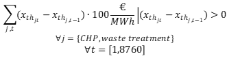
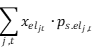

<h1><a class="anchor" id="cm-district-heating-supply-dispatch" href="#cm-district-heating-supply-dispatch"><i class="fa fa-link"></i></a>CM Centralizētās siltumapgādes piegāde</h1><h2><a class="anchor" id="table-of-contents" href="#table-of-contents"><i class="fa fa-link"></i></a> Satura rādītājs</h2><ul><li> <a href="#in-a-glance">Vienā acu uzmetienā</a></li><li> <a href="#introduction">Ievads</a></li><li> <a href="#inputs-and-outputs">Ieejas un izejas</a></li><li> <a href="#method">Metode</a></li><li> <a href="#github-repository-of-this-calculation-module">Šī aprēķina moduļa GitHub krātuve</a></li><li> <a href="#sample-run">Izlases skrējiens</a></li><li> <a href="#how-to-cite">Kā citēt</a></li><li> <a href="#authors-and-reviewers">Autori un recenzenti</a></li><li> <a href="#license">Licence</a></li><li> <a href="#acknowledgement">Pateicība</a></li></ul><h2><a class="anchor" id="in-a-glance" href="#in-a-glance"><i class="fa fa-link"></i></a> Vienā acu uzmetienā</h2>
 Šo moduli var darbināt divos režīmos: 1) nosūtīšana, 2) ieguldīšana. Dispečēšanas režīmā tā aprēķina siltumapgādes tehnoloģiju portfeļa darbību ar minimālām izmaksām noteiktā centralizētās siltumapgādes sistēmā par katru stundu gadā. Moduļa ievads ir stundas profils siltuma pieprasījumam tīklā, potenciālajai siltuma padevei no dažādiem avotiem un enerģijas nesēju cenām. Turklāt katrai tehnoloģijai ir nepieciešami izmaksu un efektivitātes parametri. Modulis dod siltumapgādes izmaksas, izmantoto enerģijas nesēju daļu un paredzamās CO2 emisijas. Investēšanas režīmā modulis optimizē uzstādīto siltumapgādes tehnoloģiju jaudu, lai segtu siltuma pieprasījumu.

 <a href="#table-of-contents"><strong><code>To Top</code></strong></a>
<h2><a class="anchor" id="introduction" href="#introduction"><i class="fa fa-link"></i></a> Ievads</h2>
 Šo moduli var darbināt divos režīmos: 1) nosūtīšana, 2) ieguldīšana. Dispečēšanas režīmā tā aprēķina siltumapgādes tehnoloģiju portfeļa darbību ar minimālām izmaksām noteiktā centralizētās siltumapgādes sistēmā par katru stundu gadā. Moduļa ievads ir stundas profils siltuma pieprasījumam tīklā, potenciālajai siltuma padevei no dažādiem avotiem un enerģijas nesēju cenām. Turklāt katrai tehnoloģijai ir nepieciešami izmaksu un efektivitātes parametri. Modulis dod siltumapgādes izmaksas, izmantoto enerģijas nesēju daļu un paredzamās CO2 emisijas. Investēšanas režīmā modulis optimizē uzstādīto siltumapgādes tehnoloģiju jaudu, lai segtu siltuma pieprasījumu.

 Centralizētās siltumapgādes padeves modulis ir dispečera modelis, kas cenšas atrast optimālu izmaksu risinājumu siltuma pieprasījuma segšanai katrā gada stundā.

 Šeit aprakstītā metode ir jāsaprot kā pirmā koncepcija, un tā var novirzīties no faktiskās ieviešanas (no šī viedokļa ir jāskatās modeļa sarežģītība, ieguldījumi un izejas utt.). Šajā wiki lapā ir izskaidrota aprēķinu moduļa versija, kas ir integrēta rīkjoslā. Atsevišķa aprēķina moduļa <strong>versija</strong> ir daudz visaptveroša, un to var lejupielādēt no <strong><a href="https://github.com/tuw-eeg/hotmapsDispatch">ŠEIT</a></strong> . Šī versija tomēr prasa pamatzināšanas par pitona programmēšanu. No stand-alone versija <strong>dokumentāciju</strong> var atrast <strong><a href="https://hotmapsdispatch.readthedocs.io/en/latest/">ŠEIT</a></strong> .

 <a href="#table-of-contents"><strong><code>To Top</code></strong></a>
<h2><a class="anchor" id="inputs-and-outputs" href="#inputs-and-outputs"><i class="fa fa-link"></i></a> Ieejas un izejas</h2><h3><a class="anchor" id="main-inputs" href="#main-inputs"><i class="fa fa-link"></i></a> Galvenās izejvielas</h3>
 Modulim nepieciešams ilgs ievades parametru klāsts. Galvenie ievades parametri tomēr ir:
<ol><li> Tīkla siltuma pieprasījums (izvēlētais reģions)</li><li> Siltuma ģeneratoru / krātuves uzstādītās jaudas</li><li> Siltuma ģeneratoru / krātuvju tehniskie (energoefektivitātes) un finanšu parametri (opex, capex, kalpošanas laiks)</li><li> Profili (siltuma pieprasījuma laika rindas, saules starojums, temperatūra, elektrības cenas utt.)</li></ol><h3><a class="anchor" id="main-outputs" href="#main-outputs"><i class="fa fa-link"></i></a> Galvenie rezultāti</h3>
 Aprēķina moduļa galvenie izlaides rādītāji ir:
<ul><li> Siltuma ražošanas izmaksas</li><li> Investīciju, ekspluatācijas un degvielas izmaksas</li><li> Siltuma ģenerēšanas maisījums katram siltuma ģeneratoram</li><li> CO2 emisija</li><li> Pilnas slodzes stundas,</li></ul>
 <strong>SVARĪGA PIEZĪME</strong> Hotmaps biomasas emisijas netiek uzskatītas par nullejām, jo Hotmaps ir rīks, kura mērķis ir atbalstīt notiekošo enerģijas pāreju. Uzskatot biomasu par oglekļa neitrālu enerģijas avotu, tas nozīmē, ka biomasas sadedzināšana samazina pašreizējās kopējās emisijas, salīdzinot ar fosilo degvielu, kas nav taisnība. Oglekļa dioksīda uzkrāšanās kokos notiek gadu desmitiem ilgi, savukārt tā izdalīšanās atmosfērā notiek vienlaikus. Tāpēc ilgtermiņā biomasas neto oglekļa bilance ir nulle, taču īstermiņā tā nav, un klimata pārmaiņu mazināšanas pasākumiem īsā laikā jāsniedz rezultāti oglekļa emisiju samazināšanā.

 <a href="#table-of-contents"><strong><code>To Top</code></strong></a>
<h2><a class="anchor" id="method" href="#method"><i class="fa fa-link"></i></a> Metode</h2>
 Modulis tiek realizēts kā lineāra programma, un to, no vienas puses, var izmantot kā tīru nosūtīšanas modeli, un, no otras puses, ieguldījumu plānošanai, lai segtu slodzes profilu. Mērķa funkcija mēģina atrast minimālo starpību no siltuma nodrošināšanas izmaksām un ienākumiem no elektroenerģijas ražošanas.
<h3><a class="anchor" id="equation-fragments-of-the-linear-program-" href="#equation-fragments-of-the-linear-program-"><i class="fa fa-link"></i></a> Lineārās programmas vienādojumu fragmenti:</h3>

<h4> <a class="anchor" id="the-total-costs-<code>ctotal<-sub><-code>-yield-from-the-sum-of-" href="#the-total-costs-<code>ctotal<-sub><-code>-yield-from-the-sum-of-"><i class="fa fa-link"></i></a> Kopējās izmaksas <code>c total</code> raža, summējot:</h4><h5> <a class="anchor" id="investment-costs-<code>ic<-code>-installed-capacities-multiplied-by-the-annuities-of-the-specific-investment-costs" href="#investment-costs-<code>ic<-code>-installed-capacities-multiplied-by-the-annuities-of-the-specific-investment-costs"><i class="fa fa-link"></i></a> ieguldījumu izmaksas <code>IC</code> (uzstādītās jaudas, kas reizinātas ar īpašo ieguldījumu izmaksu rentēm)</h5>

<h5> <a class="anchor" id="captial-costs-<code>cc<-code>--" href="#captial-costs-<code>cc<-code>--"><i class="fa fa-link"></i></a> saistītās izmaksas <code>CC</code> :</h5>

<h5> <a class="anchor" id="the-variable-costs-<code>opex<-code>--" href="#the-variable-costs-<code>opex<-code>--"><i class="fa fa-link"></i></a> mainīgās izmaksas <code>OPEX</code> :</h5>

<h5><a class="anchor" id="ramp-costs-of-chp-and-waste-incineration-plants-rough-estimation--" href="#ramp-costs-of-chp-and-waste-incineration-plants-rough-estimation--"><i class="fa fa-link"></i></a> koģenerācijas staciju un atkritumu sadedzināšanas iekārtu perona izmaksas (aptuvens novērtējums):</h5>

<h5><a class="anchor" id="assumed-costs-for-the-peak-electrical-load-in-the-winter-time-rough-estimation-" href="#assumed-costs-for-the-peak-electrical-load-in-the-winter-time-rough-estimation-"><i class="fa fa-link"></i></a> pieļautās izmaksas par maksimālo elektrisko slodzi ziemas laikā (aptuvens novērtējums):</h5>

<h4> <a class="anchor" id="the-total-revenues-<code>revtotal<-sub><-code>-yield-from--" href="#the-total-revenues-<code>revtotal<-sub><-code>-yield-from--"><i class="fa fa-link"></i></a> Kopējie ieņēmumi salīdzina <code>rev total</code> ražu no ::</h4><h5><a class="anchor" id="the-sale-of-electricity-for-example-from-chp-plants-and-waste-incineration-plants.-" href="#the-sale-of-electricity-for-example-from-chp-plants-and-waste-incineration-plants.-"><i class="fa fa-link"></i></a> elektroenerģijas pārdošana (piemēram, no koģenerācijas stacijām un atkritumu sadedzināšanas iekārtām) .:</h5>

 <a href="#table-of-contents"><strong><code>To Top</code></strong></a>
<h4><a class="anchor" id="legend" href="#legend"><i class="fa fa-link"></i></a> Leģenda</h4>

 <a href="#table-of-contents"><strong><code>To Top</code></strong></a>
<h2><a class="anchor" id="github-repository-of-this-calculation-module" href="#github-repository-of-this-calculation-module"><i class="fa fa-link"></i></a> Šī aprēķina moduļa GitHub krātuve</h2>
 <a href="https://github.com/HotMaps/dispatch_module/tree/develop">Šeit</a> jūs iegūstat šī aprēķina moduļa pilnīgu attīstību.

 <a href="#table-of-contents"><strong><code>To Top</code></strong></a>
<h2><a class="anchor" id="sample-run" href="#sample-run"><i class="fa fa-link"></i></a> Izlases skrējiens</h2>
 Pēc reģiona atlasīšanas un noklusējuma parametru nemainīšanas modelis darbosies investīciju režīmā. Tas nozīmē, ka uzstādītās jaudas tiek optimizētas arī siltuma pieprasījuma optimālai izmaksu segšanai.

 Zemāk jūs varat redzēt visus ievades parametrus, kurus var mainīt
<h4><a class="anchor" id="output-indicators" href="#output-indicators"><i class="fa fa-link"></i></a> Rezultāta rādītāji</h4><h4><a class="anchor" id="output-charts" href="#output-charts"><i class="fa fa-link"></i></a> Rezultātu diagrammas</h4>
 <a href="#table-of-contents"><strong><code>To Top</code></strong></a>
<h2><a class="anchor" id="how-to-cite" href="#how-to-cite"><i class="fa fa-link"></i></a> Kā citēt</h2>
 Džetons Hasani, Hotmaps Wiki, CM Centrālās siltumapgādes sūtījums (2020. gada septembris)

 <a href="#table-of-contents"><strong><code>To Top</code></strong></a>
<h2><a class="anchor" id="authors-and-reviewers" href="#authors-and-reviewers"><i class="fa fa-link"></i></a> Autori un recenzenti</h2>
 Šo lapu ir sarakstījis Džetons Hasani ( <strong><a href="https://eeg.tuwien.ac.at/">EEG - TU Wien</a></strong> ).

 ☑ Šo lapu pārskatīja Mostafa Fallahnejad ( <strong><a href="https://eeg.tuwien.ac.at/">EEG - TU Wien</a></strong> ).

 <a href="#table-of-contents"><strong><code>To Top</code></strong></a>
<h2><a class="anchor" id="license" href="#license"><i class="fa fa-link"></i></a> Licence</h2>
 Autortiesības © 2016-2020: Džetons Hasani

 Creative Commons Attribution 4.0 starptautiskā licence

 Šis darbs ir licencēts saskaņā ar Creative Commons CC BY 4.0 starptautisko licenci.

 SPDX-licences identifikators: CC-BY-4.0

 Licences teksts: https://spdx.org/licenses/CC-BY-4.0.html

 <a href="#table-of-contents"><strong><code>To Top</code></strong></a>
<h2><a class="anchor" id="acknowledgement" href="#acknowledgement"><i class="fa fa-link"></i></a> Pateicība</h2>
 Mēs vēlamies paust visdziļāko pateicību projektam Horizon 2020 <a href="https://www.hotmaps-project.eu">Hotmaps</a> (grantu līguma numurs 723677), kas nodrošināja finansējumu šīs izmeklēšanas veikšanai.

 <a href="#table-of-contents"><strong><code>To Top</code></strong></a>

<!--- THIS IS A SUPER UNIQUE IDENTIFIER -->

This page was automatically translated. View in another language:

[English](../en/CM-District-heating-supply-dispatch) (original) [Bulgarian](../bg/CM-District-heating-supply-dispatch)\* [Czech](../cs/CM-District-heating-supply-dispatch)\* [Danish](../da/CM-District-heating-supply-dispatch)\* [German](../de/CM-District-heating-supply-dispatch)\* [Greek](../el/CM-District-heating-supply-dispatch)\* [Spanish](../es/CM-District-heating-supply-dispatch)\* [Estonian](../et/CM-District-heating-supply-dispatch)\* [Finnish](../fi/CM-District-heating-supply-dispatch)\* [French](../fr/CM-District-heating-supply-dispatch)\* [Irish](../ga/CM-District-heating-supply-dispatch)\* [Croatian](../hr/CM-District-heating-supply-dispatch)\* [Hungarian](../hu/CM-District-heating-supply-dispatch)\* [Italian](../it/CM-District-heating-supply-dispatch)\* [Lithuanian](../lt/CM-District-heating-supply-dispatch)\*  [Maltese](../mt/CM-District-heating-supply-dispatch)\* [Dutch](../nl/CM-District-heating-supply-dispatch)\* [Polish](../pl/CM-District-heating-supply-dispatch)\* [Portuguese (Portugal, Brazil)](../pt/CM-District-heating-supply-dispatch)\* [Romanian](../ro/CM-District-heating-supply-dispatch)\* [Slovak](../sk/CM-District-heating-supply-dispatch)\* [Slovenian](../sl/CM-District-heating-supply-dispatch)\* [Swedish](../sv/CM-District-heating-supply-dispatch)\* 

\* machine translated
