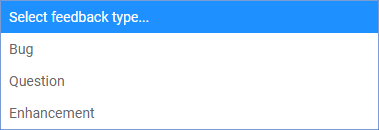

<h1><a class="anchor" id="introduction-to-user-interface" href="#introduction-to-user-interface"><i class="fa fa-link"></i></a>Ievads lietotāja saskarnē</h1><h2><a class="anchor" id="table-of-contents" href="#table-of-contents"><i class="fa fa-link"></i></a> Satura rādītājs</h2><ul><li>
 <a href="#introduction-page">Ievads</a>
</li><li>
 <a href="#upper-toolbar">Augšējā rīkjosla</a>
<ul><li> <a href="#upper-toolbar_connect">Izveidojiet savienojumu</a><ul><li> <a href="#upper-toolbar_connect_login">Pieslēgties</a></li><li> <a href="#upper-toolbar_connect_register">Reģistrēties</a></li><li> <a href="#upper-toolbar_connect_recover">Atgūt</a></li></ul></li><li> <a href="#upper-toolbar_go-to-place">Iet uz vietu</a></li><li> <a href="#upper-toolbar_layers">Slāņi</a></li><li> <a href="#upper-toolbar_selection-tools">Atlases rīki</a></li><li> <a href="#upper-toolbar_show-result">Rādīt rezultātu</a></li><li> <a href="#upper-toolbar_feedback">Atsauksmes</a></li><li> <a href="#upper-toolbar_save-session">Saglabāt sesiju</a></li><li> <a href="#upper-toolbar_save-session-folder">Saglabāt sesijas mapi</a></li></ul></li><li>
 <a href="#tiles">Flīzes</a>
</li><li>
 <a href="#how-to-cite">Kā citēt</a>
</li><li>
 <a href="#authors-and-reviewers">Autori un recenzenti</a>
</li><li>
 <a href="#license">Licence</a>
</li><li>
 <a href="#acknowledgement">Pateicība</a>
</li></ul><h2><a class="anchor" id="introduction-page" href="#introduction-page"><i class="fa fa-link"></i></a> Ievads</h2>
 Kad rīku kopa ir atvērta, tiek parādīta atrunas lapa. Papildus atrunas paziņojumam tiek sniegta papildu informācija par atbalstītajām pārlūkprogrammām, projekta Hotmaps mērķiem, saiti uz projekta Hotmaps vietni un datu krātuvēm.

 <em>1. attēls Īss ievads Hotmaps rīkjoslā</em>

 Hotmaps GUI ir uz ĢIS balstīta saskarne. Aizverot atteikšanās lapu, lietotājs redz Eiropas karti. Pēc noklusējuma tiek attēlota ES-28 valstu siltuma pieprasījuma blīvuma karte un NUTS 2 robežas. Papildus šīm divām kartēm GUI var redzēt dažus rīkus un pogas. Šie rīki ir parādīti nākamajā attēlā.

 <em>2. attēls. Sākotnējā lapa</em>

 Šeit no pirmā acu uzmetiena varat pamanīt 3 lietotāja saskarnes daļas:
<ol><li> <a href="#upper-toolbar">rīkjosla augšējā kreisajā stūrī</a> ,</li><li> pati karte,</li><li> <a href="#tiles">daži rīki kartes stila maiņai</a> .</li><li> divas saites augšējā labajā stūrī: uz šo <a href="https://wiki.hotmaps.eu/">Hotmaps Wiki</a> un uz <a href="https://www.hotmaps-project.eu/">Hotmaps Project vietni</a> .</li></ol>
 Turpmākajās nodaļās pirmie 3 punkti ir sīki izskaidroti.

 <a href="#table-of-contents"><strong><code>To Top</code></strong></a>
<h2><a class="anchor" id="upper-toolbar" href="#upper-toolbar"><i class="fa fa-link"></i></a> Augšējā rīkjosla</h2>

 Izmantojot šo rīkjoslu, varat:
<ol><li> <a href="#upper-toolbar_connect"><em>Savienojums:</em></a> reģistrējieties un piesakieties tīmekļa lietojumprogrammā, lai saglabātu savu darbu,</li><li> <a href="#upper-toolbar_go-to-place"><em>Iet uz vietu:</em></a> tuviniet konkrētu reģionu, ierakstot nosaukumu,</li><li> <a href="#upper-toolbar_layers"><em>Slāņi:</em></a> parāda slāņa sānjoslu,</li><li> <a href="#upper-toolbar_selection-tools"><em>Atlases rīki</em> :</a> iespējojiet vai atspējojiet atlases rīkus,</li><li> <a href="#upper-toolbar_show-result"><em>Rādīt rezultātu:</em></a> rādīt izvēlēto reģionu rezultātu sānjoslu,</li><li> <a href="#upper-toolbar_feedback"><em>Atsauksmes:</em></a> sniedziet mums atsauksmes par rīku,</li><li> <a href="#upper-toolbar_save-session"><em>Saglabāt sesiju:</em></a> varat saglabāt atlasītos slāņus un tālummaiņas līmeni un tos vēlāk atsaukt,</li><li> <a href="#upper-toolbar_save-session-folder"><em>Saglabāt sesijas mapi:</em></a> kur varat redzēt visu saglabāto sesiju sarakstu.</li></ol>
 <a href="#table-of-contents"><strong><code>To Top</code></strong></a>
<h3><a class="anchor" id="connect" href="#connect"><i class="fa fa-link"></i></a> Izveidojiet savienojumu</h3>
 Šeit jūs varat:
<ul><li> Izveidot kontu</li><li> Piesakieties savā kontā, lai saglabātu progresu</li><li> Vai arī atiestatiet paroli, ja to aizmirstat</li></ul>
 <a href="#table-of-contents"><strong><code>To Top</code></strong></a>
<h4><a class="anchor" id="login" href="#login"><i class="fa fa-link"></i></a> Pieslēgties</h4>
 Pēc <a href="#register">reģistrēšanās</a> un aktivizējot savu kontu, jums vajadzētu būt iespējai pieteikties ar savu e-pastu un paroli (skat <a href="#fig4">4.att</a> zemāk).

 <em>4. attēls. Pieteikšanās forma</em>

 <a href="#table-of-contents"><strong><code>To Top</code></strong></a>
<h4><a class="anchor" id="register" href="#register"><i class="fa fa-link"></i></a> Reģistrēties</h4>
 Šeit jūs varat izveidot kontu <em>hotmaps</em> vietnei. Pēc <a href="#fig5">veidlapas</a> iesniegšanas jūs saņemsit e-pastu par konta aktivizēšanu. Izmantojot savu kontu, varēsiet saglabāt progresu.

 <em>5. attēls. Reģistrācijas veidlapa</em>

 <a href="#table-of-contents"><strong><code>To Top</code></strong></a>
<h4><a class="anchor" id="recover" href="#recover"><i class="fa fa-link"></i></a> Atgūt</h4>
 Ja kādreiz esat aizmirsis paroli, varat to atjaunot šajā izvēlnē (skat. <a href="#fig6">6. att.</a> Zemāk). Lūdzu, ņemiet vērā, ka pēc tam iestatiet jaunu paroli.

 <em>6. attēls. Atkopšanas forma</em>

 <a href="#table-of-contents"><strong><code>To Top</code></strong></a>
<h3><a class="anchor" id="go-to-place" href="#go-to-place"><i class="fa fa-link"></i></a> Iet uz vietu</h3>
 Varat tuvināt noteiktu reģionu, ierakstot tā nosaukumu (skat. Animāciju zemāk)

 <a href="#table-of-contents"><strong><code>To Top</code></strong></a>
<h3><a class="anchor" id="layers" href="#layers"><i class="fa fa-link"></i></a> Slāņi</h3>
 Nospiežot šo pogu, kreisajā pusē tiek parādīta sānjosla ar dažāda veida slāņiem.

 Var atrast un vizualizēt šādus slāņus:

 <a href="#table-of-contents"><strong><code>To Top</code></strong></a>
<h3><a class="anchor" id="selection-tools" href="#selection-tools"><i class="fa fa-link"></i></a> Atlases rīki</h3>
 Nospiežot šo pogu, atlases rīki parādīsies ekrāna kreisajā pusē

 Zemāk redzamais attēls parāda rīku izskatu:

<ol><li> Reģionu atlases rīks</li><li> Izveidojiet pielāgotu kvadrātveida reģionu</li><li> Izveidojiet pielāgotu loku reģionu</li><li> Izveidojiet pielāgotu daudzstūra reģionu</li><li> Augšupielādējiet GeoJSON objektu, lai izmantotu pielāgotu apgabalu izvēli</li></ol><ol type="A"><li> parāda, cik daudz reģionu esat atlasījis</li><li> parāda mazākā taisnstūra virsmu, kas var aptvert izvēlēto laukumu</li><li> parāda mērogu, kuru izvēlējāties labajā rīkjoslā</li></ol><ol type="a"><li> poga, lai ielādētu atlasītā reģiona un atlasīto slāņu rezultātus</li><li> poga izvēlētā reģiona dzēšanai</li></ol>
 <a href="#table-of-contents"><strong><code>To Top</code></strong></a>
<h3><a class="anchor" id="show-result" href="#show-result"><i class="fa fa-link"></i></a> Rādīt rezultātu</h3>
 Atkarībā no atlasītajiem slāņiem un reģiona rezultāti konfigurācijai tiek parādīti sānjoslā ekrāna labajā pusē

 <a href="#table-of-contents"><strong><code>To Top</code></strong></a>
<h3><a class="anchor" id="feedback" href="#feedback"><i class="fa fa-link"></i></a> Atsauksmes</h3>
 Vai jums ir kādi ieteikumi, kā uzlabot rīku? Vai esat pamanījuši kļūdas? Lūdzu, informējiet mūs! Sniedzot mums atsauksmes, jūs varat mums palīdzēt uzlabot rīkjoslu!

 Lūdzu, aizpildiet zemāk esošo <a href="#Fig7">veidlapu</a> :

 <a href="#table-of-contents"><strong><code>To Top</code></strong></a>

 jūs varat izvēlēties kādu no šiem veidiem:

 un iestatiet prioritāti:

 <a href="#table-of-contents"><strong><code>To Top</code></strong></a>
<h3><a class="anchor" id="save-session" href="#save-session"><i class="fa fa-link"></i></a> Saglabāt sesiju</h3>
 nospiežot šo pogu, varat izveidot momentuzņēmumu par savu darbu (izvēlētie apgabali un slāņi, tālummaiņas līmeņi utt.) Varat arī definēt momentuzņēmuma nosaukumu un aprakstu.
<h3><a class="anchor" id="save-session-folder" href="#save-session-folder"><i class="fa fa-link"></i></a> Saglabāt sesijas mapi</h3>
 Šeit jūs redzat visus savus momentuzņēmumus ar to nosaukumiem un aprakstu. Atlasot vienu, tiek ielādēti atlasītie slāņi, apgabali, tālummaiņas līmenis un cita konfigurācija.
<h2><a class="anchor" id="tiles" href="#tiles"><i class="fa fa-link"></i></a> Flīzes</h2>
 Jūs varat izvēlēties analizējamo teritoriālo mērogu (NUTS reģioni vai hektāra līmenis) un iestatīt kartes elementu

 Ir iespējamas šādas konfigurācijas

<ol><li> Tuviniet un tāliniet karti</li><li> Parādiet NUTS robežas, lai atlasītu konkrētus NUTS reģionus, vai izmantojiet hektāru, lai pielāgotu savu <a href="#upper-toolbar_selection-tools">izvēli</a></li><li> Izmantojiet flīzes OpenStreetMap vai Satelite</li></ol>
 <a href="#table-of-contents"><strong><code>To Top</code></strong></a>
<h2><a class="anchor" id="how-to-cite" href="#how-to-cite"><i class="fa fa-link"></i></a> Kā citēt</h2>
 Džetons Hasani, vietnē Hotmaps-Wiki, ievads lietotāja saskarnei (2019. gada aprīlis)

 <a href="#table-of-contents"><strong><code>To Top</code></strong></a>
<h2><a class="anchor" id="authors-and-reviewers" href="#authors-and-reviewers"><i class="fa fa-link"></i></a> Autori un recenzenti</h2>
 Šo lapu ir uzrakstījis Jeton Hasani <strong><a href="https://eeg.tuwien.ac.at/">EEG - TU Wien</a></strong> .

 ☑ Šo lapu pārskatīja Mostafa Fallahnejad <strong><a href="https://eeg.tuwien.ac.at/">EEG - TU Wien</a></strong> .

 <a href="#table-of-contents"><strong><code>To Top</code></strong></a>
<h2><a class="anchor" id="license" href="#license"><i class="fa fa-link"></i></a> Licence</h2>
 Autortiesības © 2016-2020: Džetons Hasani

 Creative Commons Attribution 4.0 starptautiskā licence

 Šis darbs ir licencēts saskaņā ar Creative Commons CC BY 4.0 starptautisko licenci.

 SPDX-licences identifikators: CC-BY-4.0

 Licences teksts: https://spdx.org/licenses/CC-BY-4.0.html

 <a href="#table-of-contents"><strong><code>To Top</code></strong></a>
<h2><a class="anchor" id="acknowledgement" href="#acknowledgement"><i class="fa fa-link"></i></a> Pateicība</h2>
 Mēs vēlamies paust visdziļāko pateicību projektam Horizon 2020 <a href="https://www.hotmaps-project.eu">Hotmaps</a> (grantu līguma numurs 723677), kas nodrošināja finansējumu šīs izmeklēšanas veikšanai.

 <a href="#table-of-contents"><strong><code>To Top</code></strong></a>

<!--- THIS IS A SUPER UNIQUE IDENTIFIER -->

This page was automatically translated. View in another language:

[English](../en/Introduction-to-user-interface) (original) [Bulgarian](../bg/Introduction-to-user-interface)\* [Czech](../cs/Introduction-to-user-interface)\* [Danish](../da/Introduction-to-user-interface)\* [German](../de/Introduction-to-user-interface)\* [Greek](../el/Introduction-to-user-interface)\* [Spanish](../es/Introduction-to-user-interface)\* [Estonian](../et/Introduction-to-user-interface)\* [Finnish](../fi/Introduction-to-user-interface)\* [French](../fr/Introduction-to-user-interface)\* [Irish](../ga/Introduction-to-user-interface)\* [Croatian](../hr/Introduction-to-user-interface)\* [Hungarian](../hu/Introduction-to-user-interface)\* [Italian](../it/Introduction-to-user-interface)\* [Lithuanian](../lt/Introduction-to-user-interface)\*  [Maltese](../mt/Introduction-to-user-interface)\* [Dutch](../nl/Introduction-to-user-interface)\* [Polish](../pl/Introduction-to-user-interface)\* [Portuguese (Portugal, Brazil)](../pt/Introduction-to-user-interface)\* [Romanian](../ro/Introduction-to-user-interface)\* [Slovak](../sk/Introduction-to-user-interface)\* [Slovenian](../sl/Introduction-to-user-interface)\* [Swedish](../sv/Introduction-to-user-interface)\* 

\* machine translated
