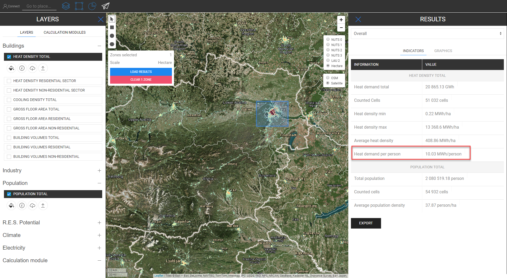
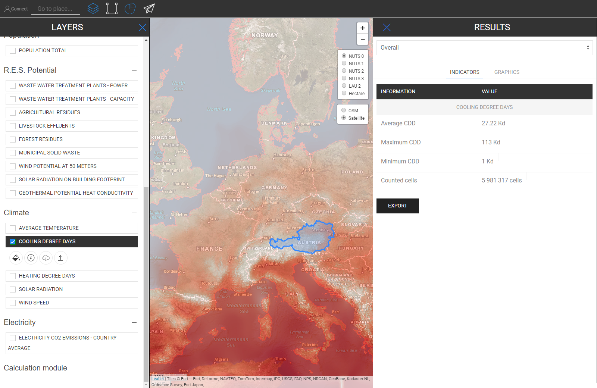

<h1><a class="anchor" id="retrieve-indicators-of-a-selected-area" href="#retrieve-indicators-of-a-selected-area"><i class="fa fa-link"></i></a>Iegūt izvēlētā apgabala indikatorus</h1><h2><a class="anchor" id="table-of-contents" href="#table-of-contents"><i class="fa fa-link"></i></a> Satura rādītājs</h2><ul><li> <a href="#introduction">Ievads</a></li><li> <a href="#indicators-for-raster-layers">Rastra slāņu indikatori</a><ul><li> <a href="#indicators-for-raster-layers_buildings">Ēkas</a></li><li> <a href="#indicators-for-raster-layers_population">Populācija</a></li><li> <a href="#indicators-for-raster-layers_renewable-energy-source-potentials">Atjaunojamo enerģijas avotu potenciāls</a></li></ul></li><li> <a href="#indicators-for-vector-layers">Indikatori vektoru slāņiem</a><ul><li> <a href="#indicators-for-vector-layers_industry">Rūpniecība</a></li><li> <a href="#indicators-for-vector-layers_renewable-energy-source-potentials">Atjaunojamo enerģijas avotu potenciāls</a></li><li> <a href="#indicators-for-vector-layers_electricity">Elektrība</a></li></ul></li><li> <a href="#example">Piemērs</a></li><li> <a href="#how-to-cite">Kā citēt</a></li><li> <a href="#authors-and-reviewers">Autori un recenzenti</a></li><li> <a href="#license">Licence</a></li><li> <a href="#acknowledgement">Pateicība</a></li></ul><h2><a class="anchor" id="introduction" href="#introduction"><i class="fa fa-link"></i></a> Ievads</h2>
 Atkarībā no atlasītajiem slāņiem un reģiona konfigurācijas indikatori tiek parādīti sānjoslā ekrāna labajā pusē

 <a href="#table-of-contents"><strong><code>To Top</code></strong></a>

 Turpmāk mēs aplūkojam rādītājus, kas tiek parādīti rastra un vektora slāņiem.
<h2><a class="anchor" id="indicators-for-raster-layers" href="#indicators-for-raster-layers"><i class="fa fa-link"></i></a> Rastra slāņu indikatori</h2>
 Rastra slāņu indikatori atšķiras no vektoru slāņiem. Ar atšķirīgu mēs domājam apkopošanas un sadalīšanas ziņā. Šī atšķirīgā rīcība izriet no teritoriālajām rezolūcijām.

 Rastra slāņiem parasti ir daudz augstāka izšķirtspēja, turpretim vektoru slāņiem atribūti ir tikai punktos vai daudzstūros.

 Tas nozīmē, piemēram, no vienas puses, piemēram, ja izvēlaties vektoru slāni, kuru nosaka NUTS3 daudzstūri, un vēlaties, piemēram, izvēlēties LAU reģionu, NUTS3 vērtība netiks sadalīta LAU līmenī, tā vietā NUTS3 indikators, kur tas LAU reģions atrodas tiks parādīts rezultātu sānjoslā.

 No otras puses, rastra slāņi tiek apkopoti un sadalīti &quot;patvaļīgi&quot; *

 * ar šūnām jūsu izvēlētajā reģionā (dabiski pašas rastra izšķirtspējas robežās)

 <a href="#table-of-contents"><strong><code>To Top</code></strong></a>
<h3><a class="anchor" id="buildings" href="#buildings"><i class="fa fa-link"></i></a> Ēkas</h3>
 <strong>Siltuma blīvuma karte</strong>

 <strong>Papildfunkcija</strong>

 Kad vienlaikus izvēlaties siltuma blīvuma slāni un iedzīvotāju slāni, tiek parādīts papildu indikators (skatiet attēlu zemāk)

 <a href="#table-of-contents"><strong><code>To Top</code></strong></a>
<h3><a class="anchor" id="in-general-" href="#in-general-"><i class="fa fa-link"></i></a> Vispār:</h3>
 Kad vienlaikus tiek izvēlēts viens no ēkas slāņiem un apdzīvotības slānis, tiks parādīts papildu indikators, kā aprakstīts iepriekš

<ins> <code><strong><a href="#indicators-for-raster-layers">To Chapter</a></strong></code></ins>

 <strong>Dzesēšanas blīvuma karte</strong>

<ins> <code><strong><a href="#indicators-for-raster-layers">To Chapter</a></strong></code></ins>

 <strong>Celtniecības apjomi</strong>

<ins> <code><strong><a href="#indicators-for-raster-layers">To Chapter</a></strong></code></ins>

 <strong>Bruto grīdas platība</strong>

<ins> <code><strong><a href="#indicators-for-raster-layers">To Chapter</a></strong></code></ins> <a href="#table-of-contents"><strong><code>To Top</code></strong></a>
<h3><a class="anchor" id="population" href="#population"><i class="fa fa-link"></i></a> Populācija</h3>

<ins> <code><strong><a href="#indicators-for-raster-layers">To Chapter</a></strong></code></ins> <a href="#table-of-contents"><strong><code>To Top</code></strong></a>
<h3><a class="anchor" id="climate" href="#climate"><i class="fa fa-link"></i></a> Klimats</h3>
 <strong>Temperatūra</strong>

<ins> <code><strong><a href="#indicators-for-raster-layers">To Chapter</a></strong></code></ins>

 <strong>Dzesēšanas grādu dienas</strong>

<ins> <code><strong><a href="#indicators-for-raster-layers">To Chapter</a></strong></code></ins>

 <strong>Apkures grādu dienas</strong>

<ins> <code><strong><a href="#indicators-for-raster-layers">To Chapter</a></strong></code></ins>

 <strong>Saules radiācija</strong>

<ins> <code><strong><a href="#indicators-for-raster-layers">To Chapter</a></strong></code></ins>

 <strong>Vēja ātrums</strong>

<ins> <code><strong><a href="#indicators-for-raster-layers">To Chapter</a></strong></code></ins> <a href="#table-of-contents"><strong><code>To Top</code></strong></a>
<h3><a class="anchor" id="renewable-energy-source-potentials" href="#renewable-energy-source-potentials"><i class="fa fa-link"></i></a> Atjaunojamo enerģijas avotu potenciāls</h3>
 <strong>Saules starojums uz ēkas pēdas</strong>

<ins> <code><strong><a href="#indicators-for-raster-layers">To Chapter</a></strong></code></ins>

 <strong>Vēja potenciāls 50m</strong>

<ins> <code><strong><a href="#indicators-for-raster-layers">To Chapter</a></strong></code></ins>

 <strong>Meža atliekas</strong>

<ins> <code><strong><a href="#indicators-for-raster-layers">To Chapter</a></strong></code></ins> <a href="#table-of-contents"><strong><code>To Top</code></strong></a>
<h2><a class="anchor" id="indicators-for-vector-layers" href="#indicators-for-vector-layers"><i class="fa fa-link"></i></a> Indikatori vektoru slāņiem</h2><h3><a class="anchor" id="industry" href="#industry"><i class="fa fa-link"></i></a> Rūpniecība</h3>
 <strong>Rūpniecības objektu emisijas</strong>

<ins> <code><strong><a href="#indicators-for-vector-layers">To Chapter</a></strong></code></ins>

 <strong>Rūpniecības vietas siltuma pārpalikums</strong>

<ins> <code><strong><a href="#indicators-for-vector-layers">To Chapter</a></strong></code></ins>

 <strong>Rūpniecības uzņēmuma uzņēmuma nosaukums</strong>

<ins> <code><strong><a href="#indicators-for-vector-layers">To Chapter</a></strong></code></ins>

 <strong>Rūpniecības objektu apakšsektors</strong>

<ins> <code><strong><a href="#indicators-for-vector-layers">To Chapter</a></strong></code></ins> <a href="#table-of-contents"><strong><code>To Top</code></strong></a>
<h3><a class="anchor" id="renewable-energy-source-potentials" href="#renewable-energy-source-potentials"><i class="fa fa-link"></i></a> Atjaunojamo enerģijas avotu potenciāls</h3>
 <strong>Notekūdeņu attīrīšanas iekārtu jauda</strong>

<ins> <code><strong><a href="#indicators-for-vector-layers">To Chapter</a></strong></code></ins>

 <strong>Notekūdeņu attīrīšanas iekārtu jauda</strong>

<ins> <code><strong><a href="#indicators-for-vector-layers">To Chapter</a></strong></code></ins>

 <strong>Lauksaimniecības atliekas</strong>

<ins> <code><strong><a href="#indicators-for-vector-layers">To Chapter</a></strong></code></ins>

 <strong>Lopkopības notekūdeņi</strong>

<ins> <code><strong><a href="#indicators-for-vector-layers">To Chapter</a></strong></code></ins>

 <strong>Pilsētas cietie atkritumi</strong>

<ins> <code><strong><a href="#indicators-for-vector-layers">To Chapter</a></strong></code></ins>

 <strong>Ģeotermālā potenciāla siltuma vadītspēja</strong>

<ins> <code><strong><a href="#indicators-for-vector-layers">To Chapter</a></strong></code></ins> <a href="#table-of-contents"><strong><code>To Top</code></strong></a>
<h3><a class="anchor" id="electricity" href="#electricity"><i class="fa fa-link"></i></a> Elektrība</h3>
 <strong>Elektroenerģijas C02 emisijas</strong>

<ins> <code><strong><a href="#indicators-for-vector-layers">To Chapter</a></strong></code></ins> <a href="#table-of-contents"><strong><code>To Top</code></strong></a>
<h2><a class="anchor" id="example" href="#example"><i class="fa fa-link"></i></a> Piemērs</h2>
 Zemāk redzamajā attēlā jūs varat redzēt, kā tas izskatās, kad visi slāņi tiek vizualizēti (šeit Austrija ir atlasīta kā NUTS0)

 Lai gan šī karte no pirmā acu uzmetiena var izskatīties mazliet mulsinoša, tās rādītāji ir skaidri ilustrēti. Atlasiet visus rādītājus, kas aprakstīti rezultātu sānjoslā, atlasot visus Austrijas slāņus (NUTS0)

 <a href="#table-of-contents"><strong><code>To Top</code></strong></a>
<h2><a class="anchor" id="how-to-cite" href="#how-to-cite"><i class="fa fa-link"></i></a> Kā citēt</h2>
 Džetons Hasani, vietnē Hotmaps-Wiki, Iegūt izvēlētā apgabala rādītājus (2019. gada aprīlis)

 <a href="#table-of-contents"><strong><code>To Top</code></strong></a>
<h2><a class="anchor" id="authors-and-reviewers" href="#authors-and-reviewers"><i class="fa fa-link"></i></a> Autori un recenzenti</h2>
 Šo lapu ir uzrakstījis Jeton Hasani <strong><a href="https://eeg.tuwien.ac.at/">EEG - TU Wien</a></strong> .

 ☑ Šo lapu pārskatīja Mostafa Fallahnejad <strong><a href="https://eeg.tuwien.ac.at/">EEG - TU Wien</a></strong> .

 <a href="#table-of-contents"><strong><code>To Top</code></strong></a>
<h2><a class="anchor" id="license" href="#license"><i class="fa fa-link"></i></a> Licence</h2>
 Autortiesības © 2016-2020: Džetons Hasani

 Creative Commons Attribution 4.0 starptautiskā licence

 Šis darbs ir licencēts saskaņā ar Creative Commons CC BY 4.0 starptautisko licenci.

 SPDX-licences identifikators: CC-BY-4.0

 Licences teksts: https://spdx.org/licenses/CC-BY-4.0.html

 <a href="#table-of-contents"><strong><code>To Top</code></strong></a>
<h2><a class="anchor" id="acknowledgement" href="#acknowledgement"><i class="fa fa-link"></i></a> Pateicība</h2>
 Mēs vēlamies paust visdziļāko pateicību projektam Horizon 2020 <a href="https://www.hotmaps-project.eu">Hotmaps</a> (grantu līguma numurs 723677), kas nodrošināja finansējumu šīs izmeklēšanas veikšanai.

 <a href="#table-of-contents"><strong><code>To Top</code></strong></a> <code><a href="Indicator-Section/_edit">Review this page</a></code>

<!--- THIS IS A SUPER UNIQUE IDENTIFIER -->

This page was automatically translated. View in another language:

[English](../en/Retrieve-indicators-of-a-selected-area) (original) [Bulgarian](../bg/Retrieve-indicators-of-a-selected-area)\* [Czech](../cs/Retrieve-indicators-of-a-selected-area)\* [Danish](../da/Retrieve-indicators-of-a-selected-area)\* [German](../de/Retrieve-indicators-of-a-selected-area)\* [Greek](../el/Retrieve-indicators-of-a-selected-area)\* [Spanish](../es/Retrieve-indicators-of-a-selected-area)\* [Estonian](../et/Retrieve-indicators-of-a-selected-area)\* [Finnish](../fi/Retrieve-indicators-of-a-selected-area)\* [French](../fr/Retrieve-indicators-of-a-selected-area)\* [Irish](../ga/Retrieve-indicators-of-a-selected-area)\* [Croatian](../hr/Retrieve-indicators-of-a-selected-area)\* [Hungarian](../hu/Retrieve-indicators-of-a-selected-area)\* [Italian](../it/Retrieve-indicators-of-a-selected-area)\* [Lithuanian](../lt/Retrieve-indicators-of-a-selected-area)\*  [Maltese](../mt/Retrieve-indicators-of-a-selected-area)\* [Dutch](../nl/Retrieve-indicators-of-a-selected-area)\* [Polish](../pl/Retrieve-indicators-of-a-selected-area)\* [Portuguese (Portugal, Brazil)](../pt/Retrieve-indicators-of-a-selected-area)\* [Romanian](../ro/Retrieve-indicators-of-a-selected-area)\* [Slovak](../sk/Retrieve-indicators-of-a-selected-area)\* [Slovenian](../sl/Retrieve-indicators-of-a-selected-area)\* [Swedish](../sv/Retrieve-indicators-of-a-selected-area)\* 

\* machine translated
