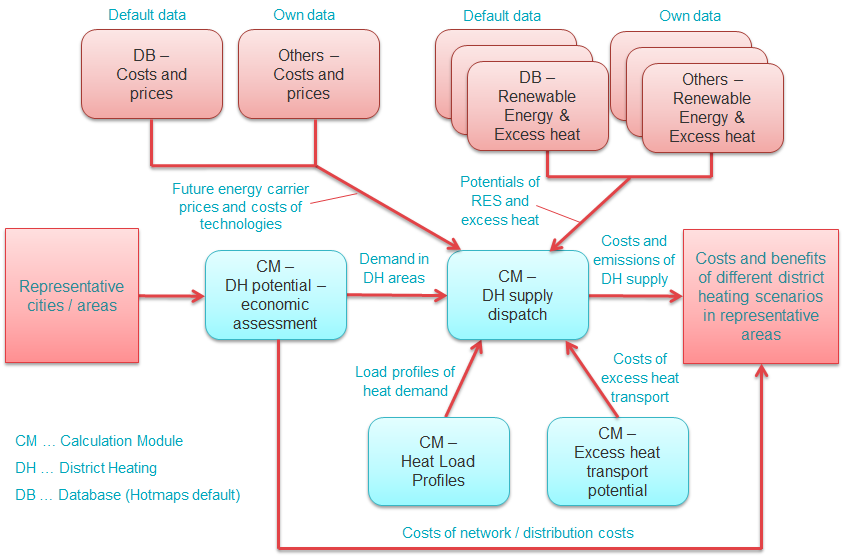

<h1><a class="anchor" id="national-level---step-2--costs-and-potentials-for-district-heating-in-representative-regions-or-cities" href="#national-level---step-2--costs-and-potentials-for-district-heating-in-representative-regions-or-cities"><i class="fa fa-link"></i></a>Valsts līmenis - 2. solis: Centralizētās siltumapgādes izmaksas un iespējas reprezentatīvajos reģionos vai pilsētās</h1>
 <a href="guide-national-level-comprehensive-assessment-eed#part-iii-analysis-of-the-economic-potential-for-efficiency-in-heating-and-cooling_different-steps"><strong><code>Scenario Toolchain Steps</code></strong></a> <a href="step-1-identification-of-different-representative-cases-for-district-heating"><strong><code>Previous step</code></strong></a> <a href="Step-3-Calculation-of-decentral-heat-supply"><strong><code>Next step</code></strong></a> 
<h2><a class="anchor" id="table-of-contents" href="#table-of-contents"><i class="fa fa-link"></i></a> Satura rādītājs</h2><ul><li> <a href="#introduction">Ievads</a></li><li> <a href="#costs-and-potentials-for-district-heating-in-representative-regions-or-cities">Centralizētās siltumapgādes izmaksas un iespējas reprezentatīvajos reģionos vai pilsētās</a><ul><li> <a href="#costs-and-potentials-for-district-heating-in-representative-regions-or-cities_economic-assessment-of-the-potential-for-district-heating">Centralizētās siltumapgādes potenciāla ekonomiskais novērtējums</a></li><li> <a href="#costs-and-potentials-for-district-heating-in-representative-regions-or-cities_estimation-of-costs-for-the-transport-of-excess-heat-to-district-heating-areas">Izmaksu aprēķins par liekā siltuma transportēšanu uz rajoniem</a></li><li> <a href="#costs-and-potentials-for-district-heating-in-representative-regions-or-cities_development-of-future-heat-load-profiles">Nākotnes siltuma slodzes profilu izstrāde</a></li><li> <a href="#costs-and-potentials-for-district-heating-in-representative-regions-or-cities_calculation-of-costs-and-emissions-of-heat-supply-in-district-heating">Centralizētās siltumapgādes siltumapgādes izmaksu un emisiju aprēķins</a></li></ul></li><li> <a href="#how-to-cite">Kā citēt</a></li><li> <a href="#authors-and-reviewers">Autori un recenzenti</a></li><li> <a href="#license">Licence</a></li><li> <a href="#acknowledgement">Pateicība</a></li></ul><h2><a class="anchor" id="introduction" href="#introduction"><i class="fa fa-link"></i></a> Ievads</h2>
 Šis ir analīzes otrais posms valsts līmenī.

<ins> <code><strong><a href="#table-of-contents">To Top</a></strong></code></ins>
<h2><a class="anchor" id="costs-and-potentials-for-district-heating-in-representative-regions-or-cities" href="#costs-and-potentials-for-district-heating-in-representative-regions-or-cities"><i class="fa fa-link"></i></a> Centralizētās siltumapgādes izmaksas un iespējas reprezentatīvajos reģionos vai pilsētās</h2>
 Noteiktajām reprezentatīvajām pilsētām / rajoniem var veikt siltumapgādes ar centralizēto siltumapgādi izmaksu un potenciāla analīzi. Šīm analīzēm Hotmaps nodrošina dažādus noklusējuma datu slāņus Hotmaps datu bāzē, kā arī dažādus aprēķinu moduļus (CM). Arī savus datus var augšupielādēt un izmantot. Šīs analīzes var sastāvēt no šādām darbībām:
<ul><li> Novērtējiet centralizētās siltumapgādes tīklu ekonomisko potenciālu</li><li> Aprēķiniet izmaksas par liekā siltuma transportēšanu uz centralizētās siltumapgādes rajoniem</li><li> Izstrādāt nākotnes siltuma slodzes profilus</li><li> Aprēķiniet siltumapgādes izmaksas un emisijas centralizētajā siltumapgādē</li></ul>
 Šajā attēlā grafiski parādīta šī procedūra un parādīti dažādi izmantojamie datu avoti un aprēķinu moduļi.
 * Attēls: Centralizētās siltumapgādes izmaksu un potenciāla analīze reprezentatīvajās pilsētās / reģionos (2. solis) *
 Turpmākajās apakšnodaļās šīs procedūras dažādās darbības ir aprakstītas sīkāk.

<ins> <code><strong><a href="#table-of-contents">To Top</a></strong></code></ins>
<h3><a class="anchor" id="economic-assessment-of-the-potential-for-district-heating" href="#economic-assessment-of-the-potential-for-district-heating"><i class="fa fa-link"></i></a> Centralizētās siltumapgādes potenciāla ekonomiskais novērtējums</h3>
 Reprezentatīvajām pilsētām / rajoniem var veikt centralizētās siltumapgādes ekonomisko novērtējumu, lai iegūtu detalizētāku ieskatu par centralizētās siltumapgādes izmaksām un ekonomiskajām iespējām, kā arī par siltumenerģijas daudzumu, ko potenciāli piegādā centralizētā siltumapgāde rajonos. Šim nolūkam var izmantot CM - Centralizētās siltumapgādes potenciāls: ekonomisko novērtējumu. Šis modulis ģenerē potenciālo centralizētās siltumapgādes teritoriju karti, pamatojoties uz siltuma sadales izmaksu novērtējumu. Centralizētās siltumapgādes iespējamības analīzi analizētajās teritorijās var novērtēt šādi:
<ul><li> Pielāgojiet tīkla izbūves izmaksas atbilstoši pieredzei jūsu reģionā / interesējošajā valstī</li><li> Aprēķiniet vidējās siltuma sadales izmaksas un centralizētās siltumapgādes prasības dažādiem ieejas parametriem</li><li> Mainiet, piemēram, šādus svarīgus ietekmējošos faktorus:<ul><li> Siltuma ietaupījums analīzes periodā</li><li> Centralizētās siltumapgādes tirgus daļas</li><li> Pieļaujamo siltuma sadales izmaksu slieksnis</li><li> Tīkla izbūves izmaksas</li><li> Nolietojuma laiks un procentu likme</li></ul></li></ul>
 Scenārijus var izmantot, lai analizētu dažādu faktoru ietekmi uz siltuma sadales izmaksām centralizētās siltumapgādes sistēmās dažādās reprezentatīvajās pilsētās / apgabalos. Dažādiem nolietojuma laika un procentu likmes iestatījumiem tālākai analīzei jāizvēlas viens centralizētās siltumapgādes paplašināšanas scenārijs katrai reprezentatīvai pilsētai / rajonam.

 Šī posma rezultāti ir siltumenerģijas pieprasījums pēc centralizētās siltumapgādes [GWh / gadā] un siltuma sadales izmaksas [EUR / MWh] katrā reprezentatīvajā pilsētā / apgabalā. Šie rezultāti tiks izmantoti kopējā scenārija salīdzinājumā 4. solī.

<ins> <code><strong><a href="#table-of-contents">To Top</a></strong></code></ins>
<h3><a class="anchor" id="estimation-of-costs-for-the-transport-of-excess-heat-to-district-heating-areas" href="#estimation-of-costs-for-the-transport-of-excess-heat-to-district-heating-areas"><i class="fa fa-link"></i></a> Izmaksu aprēķins par liekā siltuma transportēšanu uz rajoniem</h3>
 Lai novērtētu siltuma pārpalikuma transportēšanas izmaksas no iespējamiem avotiem ārpus centralizētās siltumapgādes rajoniem uz potenciālajiem centralizētās siltumapgādes rajoniem, var izmantot CM - siltuma transporta potenciāla pārpalikumu. Modulis nodrošina izlīdzinātas siltumenerģijas pārpalikuma izmaksas, kas tiek transportētas uz centralizēto siltumtīklu [EUR / MWh]. To var tālāk izmantot nākamajā siltumapgādes izmaksu aprēķināšanas posmā centralizētajā siltumapgādē.

<ins> <code><strong><a href="#table-of-contents">To Top</a></strong></code></ins>
<h3><a class="anchor" id="development-of-future-heat-load-profiles" href="#development-of-future-heat-load-profiles"><i class="fa fa-link"></i></a> Nākotnes siltuma slodzes profilu izstrāde</h3>
 Ēku renovācija samazina enerģijas pieprasījumu pēc telpu apsildes. Tas ietekmē arī siltumenerģijas pieprasījuma slodzes profilus centralizētās siltumapgādes sistēmās: maksimālās prasības ziemā samazinās un pilnas slodzes stundas palielinās, pateicoties lielākam karstā ūdens ražošanas īpatsvaram kopējā siltuma pieprasījumā. Izmantojot CM - siltuma slodzes profilus, nākotnes siltuma slodzes profilus var izstrādāt atbilstoši dažādiem siltuma taupīšanas līmeņiem. To var izdarīt, pamatojoties uz ielādes profiliem, kas nodrošināti Hotmaps datu bāzē (noklusējuma profili visiem NUTS2 reģioniem Eiropā), vai uz jūsu pašu profiliem, kas augšupielādēti rīkjoslā. Iegūtie slodzes profili tiek izmantoti nākamajā posmā, aprēķinot siltumapgādes izmaksas un emisijas centralizētajā siltumapgādē ar nosūtīšanas moduli.

<ins> <code><strong><a href="#table-of-contents">To Top</a></strong></code></ins>
<h3><a class="anchor" id="calculation-of-costs-and-emissions-of-heat-supply-in-district-heating" href="#calculation-of-costs-and-emissions-of-heat-supply-in-district-heating"><i class="fa fa-link"></i></a> Centralizētās siltumapgādes siltumapgādes izmaksu un emisiju aprēķins</h3>
 Centralizētās siltumapgādes sistēmas siltumapgādes izmaksas un emisijas ir atkarīgas no dažādu uzstādīto piegādes jaudu mijiedarbības. Tādējādi interesē jaudas un to darbības laika ziņā visizdevīgākā kombinācija. Lai analizētu tā dēvēto dažādu piegādes tehnoloģiju kombināciju stundas nosūtīšanu un ietekmi uz siltumapgādes kopējām izmaksām un emisijām centralizētajā siltumapgādē, var izmantot CM - Centralizētās siltumapgādes piegādi. Izmantojot moduli, var aprēķināt vairākus scenārijus ar šādām ievades datu kombinācijām, lai iegūtu izmaksas un ieguvumus:
<ul><li> Dažādu tehnoloģiju kombinācijas piegādes portfeļos:<ul><li> Rūpniecības pārmērīgais siltums (ar vai bez siltumsūkņa)</li><li> Atkritumu sadedzināšana</li><li> Augstas efektivitātes koģenerācija</li><li> Saules siltuma</li><li> Ģeotermālā</li><li> Biomasa</li><li> Siltumsūkņi ar dažādiem siltuma avotiem, piemēram,<ul><li> notekūdeņu attīrīšanas iekārtas</li><li> upes ūdens</li><li> pārmērīgs siltums no datu centriem</li></ul></li></ul></li><li> Cenu scenāriji:<ul><li> dažādu enerģijas nesēju cenām</li><li> par CO2 emisiju cenām</li></ul></li></ul>
 Aprēķinus var izmantot, lai identificētu izdevīgus piegādes portfeļus dažādās reprezentatīvās pilsētās / apgabalos un to jutīgumu pret svarīgiem ietekmējošiem parametriem, piemēram, enerģijas nesēju un CO2 cenām vai procentu likmi un nolietojuma laiku.

 Šī posma rezultāti ir centralizētās siltumapgādes sistēmas siltumapgādes izmaksas [EUR / MWh] katrā reprezentatīvajā pilsētā / apgabalā un ar to saistītās CO2 emisijas [kt / gadā]. Šie rezultāti tiks izmantoti kopējā scenārija salīdzinājumā 4. solī.

<ins> <code><strong><a href="#table-of-contents">To Top</a></strong></code></ins>
<h2><a class="anchor" id="how-to-cite" href="#how-to-cite"><i class="fa fa-link"></i></a> Kā citēt</h2>
 Marcus Hummel, Giulia Conforto, Hotmaps-Wiki, Vadlīnijas Hotmaps rīkkopa izmantošanai analīzēm valsts līmenī (2020. gada augusts)

<ins> <code><strong><a href="#table-of-contents">To Top</a></strong></code></ins>
<h2><a class="anchor" id="authors-and-reviewers" href="#authors-and-reviewers"><i class="fa fa-link"></i></a> Autori un recenzenti</h2>
 Šo lapu rakstīja Markuss Hammels un Džūlija Konforto ( <strong><a href="https://e-think.ac.at">e-think</a></strong> ).

 ☑ Šo lapu pārskatīja Mostafa Fallahnejad ( <strong><a href="https://eeg.tuwien.ac.at/">EEG - TU Wien</a></strong> ).

 <a href="#table-of-contents"><strong><code>To Top</code></strong></a>
<h2><a class="anchor" id="license" href="#license"><i class="fa fa-link"></i></a> Licence</h2>
 Autortiesības © 2016-2020: Markuss Hammels, Džūlija Konforto

 Creative Commons Attribution 4.0 starptautiskā licence

 Šis darbs ir licencēts saskaņā ar Creative Commons CC BY 4.0 starptautisko licenci.

 SPDX-licences identifikators: CC-BY-4.0

 Licences teksts: https://spdx.org/licenses/CC-BY-4.0.html

<ins> <code><strong><a href="#table-of-contents">To Top</a></strong></code></ins>
<h2><a class="anchor" id="acknowledgement" href="#acknowledgement"><i class="fa fa-link"></i></a> Pateicība</h2>
 Mēs vēlamies paust visdziļāko pateicību projektam Horizon 2020 <a href="https://www.hotmaps-project.eu">Hotmaps</a> (grantu līguma numurs 723677), kas nodrošināja finansējumu šīs izmeklēšanas veikšanai.

<ins> <code><strong><a href="#table-of-contents">To Top</a></strong></code></ins>

<!--- THIS IS A SUPER UNIQUE IDENTIFIER -->

This page was automatically translated. View in another language:

[English](../en/Step-2-Costs-and-potentials-for-district-heating-in-representative-regions-or-cities) (original) [Bulgarian](../bg/Step-2-Costs-and-potentials-for-district-heating-in-representative-regions-or-cities)\* [Czech](../cs/Step-2-Costs-and-potentials-for-district-heating-in-representative-regions-or-cities)\* [Danish](../da/Step-2-Costs-and-potentials-for-district-heating-in-representative-regions-or-cities)\* [German](../de/Step-2-Costs-and-potentials-for-district-heating-in-representative-regions-or-cities)\* [Greek](../el/Step-2-Costs-and-potentials-for-district-heating-in-representative-regions-or-cities)\* [Spanish](../es/Step-2-Costs-and-potentials-for-district-heating-in-representative-regions-or-cities)\* [Estonian](../et/Step-2-Costs-and-potentials-for-district-heating-in-representative-regions-or-cities)\* [Finnish](../fi/Step-2-Costs-and-potentials-for-district-heating-in-representative-regions-or-cities)\* [French](../fr/Step-2-Costs-and-potentials-for-district-heating-in-representative-regions-or-cities)\* [Irish](../ga/Step-2-Costs-and-potentials-for-district-heating-in-representative-regions-or-cities)\* [Croatian](../hr/Step-2-Costs-and-potentials-for-district-heating-in-representative-regions-or-cities)\* [Hungarian](../hu/Step-2-Costs-and-potentials-for-district-heating-in-representative-regions-or-cities)\* [Italian](../it/Step-2-Costs-and-potentials-for-district-heating-in-representative-regions-or-cities)\* [Lithuanian](../lt/Step-2-Costs-and-potentials-for-district-heating-in-representative-regions-or-cities)\*  [Maltese](../mt/Step-2-Costs-and-potentials-for-district-heating-in-representative-regions-or-cities)\* [Dutch](../nl/Step-2-Costs-and-potentials-for-district-heating-in-representative-regions-or-cities)\* [Polish](../pl/Step-2-Costs-and-potentials-for-district-heating-in-representative-regions-or-cities)\* [Portuguese (Portugal, Brazil)](../pt/Step-2-Costs-and-potentials-for-district-heating-in-representative-regions-or-cities)\* [Romanian](../ro/Step-2-Costs-and-potentials-for-district-heating-in-representative-regions-or-cities)\* [Slovak](../sk/Step-2-Costs-and-potentials-for-district-heating-in-representative-regions-or-cities)\* [Slovenian](../sl/Step-2-Costs-and-potentials-for-district-heating-in-representative-regions-or-cities)\* [Swedish](../sv/Step-2-Costs-and-potentials-for-district-heating-in-representative-regions-or-cities)\* 

\* machine translated
