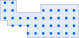

<h1><a class="anchor" id="cm-excess-heat-transport-potential" href="#cm-excess-heat-transport-potential"><i class="fa fa-link"></i></a>CM Potenzjal żejjed għat-trasport tas-sħana</h1><h2><a class="anchor" id="table-of-contents" href="#table-of-contents"><i class="fa fa-link"></i></a> Werrej</h2><ul><li> <a href="#in-a-glance">F&#39;daqqa t&#39;għajn</a></li><li> <a href="#introduction">Introduzzjoni</a></li><li> <a href="#inputs-and-outputs">Inputs u outputs</a><ul><li> <a href="#inputs-and-outputs_input-layers-and-parameters">Saffi u parametri tal-input</a></li><li> <a href="#inputs-and-outputs_output">Output</a></li></ul></li><li> <a href="#method">Metodu</a><ul><li> <a href="#method_overview">Ħarsa ġenerali</a></li><li> <a href="#method_details">Dettalji</a></li><li> <a href="#method_implementation">Implimentazzjoni</a></li></ul></li><li> <a href="#github-repository-of-this-calculation-module">Repożitorju GitHub ta &#39;dan il-modulu ta&#39; kalkolu</a></li><li> <a href="#quick-start">Bidu malajr</a></li><li> <a href="#troubleshooting">Issolvi l-problemi</a></li><li> <a href="#sample-run">Ġirja tal-kampjun</a></li><li> <a href="#how-to-cite">Kif tikkwota</a></li><li> <a href="#authors-and-reviewers">Awturi u reviżuri</a></li><li> <a href="#license">Liċenzja</a></li><li> <a href="#acknowledgement">Rikonoxximent</a></li></ul><h2><a class="anchor" id="in-a-glance" href="#in-a-glance"><i class="fa fa-link"></i></a> F&#39;daqqa t&#39;għajn</h2>
 Dan il-modulu jikkalkula l-fluss u l-ispejjeż tat-trasmissjoni tas-sħana minn sorsi potenzjali ta &#39;sħana żejda li jinsabu barra minn żoni potenzjali ta&#39; tisħin distrettwali għaż-żona ta &#39;tisħin distrettwali. L-inputs huma profili ta ’tagħbija fis-siegħa tal-fluss żejjed tas-sħana u d-domanda għat-tisħin distrettwali, il-post tas-sors żejjed tas-sħana u s-sistema potenzjali tat-tisħin distrettwali, spejjeż ta’ investiment fi skambjaturi tas-sħana u linji ta ’trasmissjoni u valuri limitu għal spejjeż ta’ distanza u trasmissjoni.

 <a href="#table-of-contents"><strong><code>To Top</code></strong></a>
<h2><a class="anchor" id="introduction" href="#introduction"><i class="fa fa-link"></i></a> Introduzzjoni</h2>
 Il-Modulu tal-Kalkolu &quot;Il-potenzjal tat-Trasport tas-Sħana Eċċessiv&quot; se jgħin lill-utent biex jidentifika l-potenzjal ta &#39;integrazzjoni għal sħana żejda fin-netwerks tat-tisħin distrettwali. Il-potenzjali huma bbażati fuq il- <a href="https://wiki.hotmaps.hevs.ch/en/CM-District-heating-potential-areas-user-defined-thresholds">Potenzjal ta &#39;Tisħin Distrettwali CM</a> . Dan is-CM jidentifika żoni b&#39;kundizzjonijiet favorevoli għan-netwerks tat-tisħin distrettwali u juri kemm sħana tista &#39;tkun koperta minn sħana żejda industrijali f&#39;dawn iż-żoni. Madankollu, dan ma jfissirx li netwerk ta &#39;tisħin distrettwali diġà jeżisti f&#39;dan ir-reġjun.

 Id-dejta u l-metodi li ġejjin huma kkombinati għall-kompitu preċedenti.

 Dejta:
<ul><li>
 Rekwiżiti ta &#39;tisħin għal żoni fil-qrib b&#39;kundizzjonijiet favorevoli għal netwerks ta&#39; tisħin distrettwali, li jinħallu kull siegħa (mill- <a href="https://wiki.hotmaps.hevs.ch/en/CM-District-heating-potential-areas-user-defined-thresholds">CM - Potenzjal ta &#39;Tisħin Distrettwali</a> ).
</li><li>
 Dejta dwar kwantitajiet ta &#39;sħana żejda ta&#39; kumpaniji industrijali fiż-żona, li wkoll jiġu riżolti kull siegħa (mid-dejtabejż ta &#39;sett ta&#39; dejta industrijali).
</li><li>
 Suppożizzjonijiet dwar l-ispejjeż ta &#39;skambjaturi tas-sħana, pompi u pipelines kif ukoll telf ta&#39; sħana għal pipelines tat-tisħin distrettwali.
</li></ul>
 Metodu (simplifikat):
<ul><li> Id-disinn tal-pipeline fuq il-bażi ta &#39;euristika żviluppata, li tirrappreżenta l-problema tad-disinn bħala problema tal-fluss tan-netwerk.</li></ul>
 L-għan tal-metodu huwa li jirrappreżenta l-akbar fluss ta ’sħana żejda possibbli b’pipelines mhux wisq u b’hekk twal wisq għall-utenti possibbli tat-tisħin distrettwali billi jiġġeneraw netwerks bi flussi massimi. Madankollu, linji ta &#39;trasport partikolarment ineffiċjenti (bi flussi ta&#39; sħana baxxi u għalhekk spejjeż għoljin ta &#39;trasport ta&#39; sħana speċifiċi) mhumiex ikkunsidrati fin-netwerk finali. Il-limitu għall-effiċjenza ekonomika tal-linji tat-trasport individwali jista &#39;jiġi speċifikat mill-utent (cf. Limitu tal-linja tat-trasmissjoni).

 L-isfond bażiku tal-approċċ huwa kif ġej: jekk hemm biss ftit sorsi ta &#39;sħana żejda, pipeline wieħed għal kull sors jista&#39; dejjem jiġi kkunsidrat għat-trasport tas-sħana f&#39;żona fil-qrib b&#39;kundizzjonijiet favorevoli għat-tisħin distrettwali. Madankollu, jekk hemm bosta sorsi ta &#39;sħana żejda li għandhom jiċċirkolaw fl-istess żona, jagħmel sens li tiġbor is-sħana u ttrasportah lejn iż-żona f&#39;pipeline komuni akbar. L-approċċ b&#39;pajp wieħed għal kull sors għandu t-tendenza li jivvaluta iżżejjed l-isforz għall-pajpijiet.

 Biex tikkumbatti dan ta &#39;hawn fuq, il-problema tal-ippjanar tal-pipeline ġiet approssimata billi tassumi problema ta&#39; fluss tan-netwerk. Metodu ewuristiku jintuża biex tissolva l-problema, li fiha s-sħana żejda tista &#39;tinġabar u tiġi ttrasportata lill-utenti possibbli. Id-disinn metodiku konkret tas-soluzzjoni bl-avviċinament tas-siġra tal-firxa minima huwa deskritt fil-parti metodika korrispondenti. Id-disinn tal-pipeline determinat fil-kuntest preċedenti, għalhekk, ma jirrappreżentax ippjanar dettaljat jew gwida tar-rotta reali, iżda jintuża biss għall-approssimazzjoni tal-ispejjeż għad-distribuzzjoni tal-kwantitajiet ta ’sħana żejda fiż-żoni fil-qrib b’kundizzjonijiet favorevoli għan-netwerks tat-tisħin distrettwali. (ara <a href="https://wiki.hotmaps.hevs.ch/en/CM-District-heating-potential-areas-user-defined-thresholds">CM - Potenzjal ta &#39;Tisħin Distrettwali</a> , oqsma koerenti ta&#39; kliem ewlieni). Din l-approssimazzjoni tal-ispejjeż għalhekk tirreferi għan-netwerk kollu.

 Ir-riżultati għandhom imbagħad l-ewwel jiġu interpretati kif ġej: jekk il-kwantitajiet ta ’sħana żejda rreġistrati kellhom jiġu ttrasportati flimkien lejn iż-żoni fil-viċin indikati, allura l-ispejjeż għad-distribuzzjoni tas-sħana jistgħu jkunu fl-ordni tal-kobor kif indikat mill-għodda (ara. tal-provvista tas-sħana). Bħala regola, il-valuri għan-netwerk kollu huma wkoll indikatur tajjeb tal-bidu għal pipelines individwali. L-iskop tar-riżultati huwa, għalhekk, li jipprovdi lil żviluppatur jew pjanifikatur ta &#39;proġett b&#39;ordni ta&#39; kobor għal spejjeż ta &#39;distribuzzjoni possibbli.

 <a href="#table-of-contents"><strong><code>To Top</code></strong></a>
<h2><a class="anchor" id="inputs-and-outputs" href="#inputs-and-outputs"><i class="fa fa-link"></i></a> Inputs u outputs</h2><h3><a class="anchor" id="input-layers-and-parameters" href="#input-layers-and-parameters"><i class="fa fa-link"></i></a> Saffi u parametri tal-input</h3><h4><a class="anchor" id="provided-by-toolbox" href="#provided-by-toolbox"><i class="fa fa-link"></i></a> Ipprovdut minn Toolbox</h4><ul><li>
 Żoni ta &#39;tisħin distrettwali (għalissa pprovduti direttament mill-CM potenzjali ta&#39; tisħin distrettwali)
</li><li>
 Bażi tad-dejta industrijali (awtomatikament ipprovduta mill-kaxxa tal-għodda)
</li><li>
 Profili tat-tagħbija għall-industrija
</li><li>
 Profili tat-tagħbija għal tisħin residenzjali u ilma sħun domestiku
</li></ul><h4><a class="anchor" id="provided-by-the-user" href="#provided-by-the-user"><i class="fa fa-link"></i></a> Ipprovdut mill-utent</h4><ul><li>
 Min. domanda tas-sħana għal kull ettaru

 Ara <a href="https://wiki.hotmaps.hevs.ch/en/CM-District-heating-potential-areas-user-defined-thresholds">CM - Potenzjal ta &#39;Tisħin Distrettwali</a> .
</li><li>
 Min. domanda tas-sħana f&#39;żona DH

 Ara <a href="https://wiki.hotmaps.hevs.ch/en/CM-District-heating-potential-areas-user-defined-thresholds">CM - Potenzjal ta &#39;Tisħin Distrettwali</a> .
</li><li>
 Ħajja tat-tagħmir fi snin

 L-ispejjeż livellati tas-sħana huma b&#39;referenza għal dan il-perjodu ta &#39;żmien.
</li><li>
 Rata ta &#39;skont f&#39;%

 Rata ta &#39;interess għall-kreditu meħtieġa biex tinbena n-netwerk.
</li><li>
 Fattur tal-ispiża

 Fattur biex tadatta l-ispejjeż tan-netwerk f&#39;każ li l-valuri awtomatiċi ma jirrappreżentawx b&#39;mod preċiż l-ispejjeż. L-investimenti meħtieġa għan-netwerk huma mmultiplikati b&#39;dan il-fattur. L-ispejjeż awtomatiċi jistgħu jinstabu fit-taqsima <a href="en-CM-Excess-heat-transport-potential#computation-of-costs">Komputazzjoni tal-ispejjeż</a> .
</li><li>
 Spejjeż operattivi f &#39;%

 Spejjeż operattivi tan-netwerk kull sena. Fil-mija tal-investimenti meħtieġa għan-netwerk.
</li><li>
 Valur tal-limitu għal-linji ta &#39;trasmissjoni f&#39;ċt / kWh

 L-ispiża massima livellizzata tas-sħana ta &#39;kull linja ta&#39; trasmissjoni individwali. Dan il-parametru jista &#39;jintuża biex jikkontrolla l-ispiża livellizzata tas-sħana għan-netwerk kollu. Valur aktar baxx huwa daqs spejjeż ta &#39;sħana livellati aktar baxxi iżda wkoll tnaqqis ta&#39; sħana żejda użata u viċi versa.
</li></ul><h4><a class="anchor" id="performance-parameters" href="#performance-parameters"><i class="fa fa-link"></i></a> Parametri tal-Prestazzjoni</h4><ul><li>
 Riżoluzzjoni tal-ħin

 Issettja l-intervall bejn il-kalkoli tal-fluss tan-netwerk matul is-sena kollha. Jista &#39;jkun wieħed minn dawn il-valuri: (siegħa, jum, ġimgħa, xahar, sena)
</li></ul>
 <a href="#table-of-contents"><strong><code>To Top</code></strong></a>
<h3><a class="anchor" id="output" href="#output"><i class="fa fa-link"></i></a> Output</h3><h4><a class="anchor" id="layers" href="#layers"><i class="fa fa-link"></i></a> Saffi</h4><ul><li>
 Linji ta &#39;trasmissjoni

 Forma li turi l-linji ta &#39;trasmissjoni ssuġġeriti bit-temperatura, il-fluss annwali tas-sħana u l-ispiża tagħhom. Id-dettalji jistgħu jinstabu hawn.
</li></ul><h4><a class="anchor" id="indicators" href="#indicators"><i class="fa fa-link"></i></a> Indikaturi</h4><ul><li>
 Sħana żejda totali fiż-żona magħżula f&#39;GWh

 Sħana żejda totali disponibbli ta &#39;impjanti industrijali f&#39;żona magħżula u viċinanza.
</li><li>
 Sħana żejda konnessa f&#39;GWh

 Sħana żejda totali disponibbli ta &#39;impjanti industrijali konnessi ma&#39; netwerk.
</li><li>
 Sħana żejda użata f&#39;GWh

 Sħana żejda attwali użata għad-DH.
</li><li>
 Investimenti meħtieġa għan-netwerk f &#39;€

 Investiment meħtieġ biex tinbena n-netwerk.
</li><li>
 Spejjeż annwali tan-netwerk f &#39;€ / sena

 Spejjeż ikkawżati mill-annwalità u l-ispejjeż operattivi tan-netwerk kull sena.
</li><li>
 Spejjeż livellati tal-provvista tas-sħana f&#39;ċt / kWh

 l-ispiża livellizzata tas-sħana tan-netwerk komplet.
</li></ul><h4><a class="anchor" id="graphics" href="#graphics"><i class="fa fa-link"></i></a> Grafika</h4><ul><li>
 Potenzjal DH u sħana żejda

 Grafika li turi l-potenzjal tad-DH, sħana żejda totali, sħana żejda konnessa u sħana żejda użata. Id-dettalji jistgħu jinstabu <a href="en-CM-Excess-heat-transport-potential#dh-potential-and-excess-heat">hawn</a> .
</li><li>
 Sħana żejda użata u investiment meħtieġ

 Grafika li turi sħana żejda kkunsinnata kull sena lill-investiment meħtieġ għan-netwerk. Id-dettalji jistgħu jinstabu <a href="en-CM-Excess-heat-transport-potential#excess-heat-used-and-investment-necessary">hawn</a> .
</li><li>
 Kurvi tat-tagħbija

 Grafika li turi d-domanda tas-sħana u l-eċċess ta &#39;kull xahar. Id-dettalji jistgħu jinstabu <a href="en-CM-Excess-heat-transport-potential#load-curves">hawn</a> .
</li><li>
 Kurvi tat-tagħbija

 Grafika li turi d-domanda medja u l-eċċess tas-sħana kuljum. Id-dettalji jistgħu jinstabu <a href="en-CM-Excess-heat-transport-potential#load-curves">hawn</a> .
</li></ul><h4><a class="anchor" id="examples-of-layer" href="#examples-of-layer"><i class="fa fa-link"></i></a> Eżempji ta &#39;Saff</h4><h5><a class="anchor" id="transmission-lines" href="#transmission-lines"><i class="fa fa-link"></i></a> Linji ta &#39;trasmissjoni</h5><figcaption> <i> Eżempju ta &#39;linja ta&#39; trasmissjoni murija fil-kaxxa tal-għodda</i></figcaption>
 Billi tikklikkja fuq il-linja tat-trażmissjoni titfaċċa informazzjoni addizzjonali.
<h4><a class="anchor" id="examples-of-graphics" href="#examples-of-graphics"><i class="fa fa-link"></i></a> Eżempji ta &#39;Grafika</h4><h5><a class="anchor" id="dh-potential-and-excess-heat" href="#dh-potential-and-excess-heat"><i class="fa fa-link"></i></a> Potenzjal DH u sħana żejda</h5>
 <em>Din il-grafika tqabbel il-potenzjal tad-DH, sħana żejda totali, sħana żejda konnessa u sħana żejda użata.</em>

 Aktar informazzjoni dwar id-domanda annwali għas-sħana u l-potenzjal tad-DH tista &#39;tinstab <a href="CM-District-heating-potential-areas-user-defined-thresholds">hawnhekk</a> . Is-sħana żejda mqabbda mas-sħana żejda u s-sħana żejda użata huma l-istess bħall-indikaturi bl-istess isem tagħhom, fit-taqsima <a href="en-CM-Excess-heat-transport-potential#inputs-and-outputs_input-layers-and-parameters">Input u Output</a> .
<h5><a class="anchor" id="load-curves" href="#load-curves"><i class="fa fa-link"></i></a> Kurvi tat-tagħbija</h5><figure><figcaption><i> </i>
 <i>Din il-grafika turi l-fluss totali permezz tan-netwerk matul is-sena. Il-grafika t&#39;isfel tirrappreżenta l-ġurnata medja.</i>
</figcaption></figure>
 L-assi-x jirrappreżenta l-ħin u l-qawwa ta &#39;l-assi-y. Il-kurvi blu jirrappreżentaw id-domanda tas-sħana taż-żoni DH u l-aħmar is-sħana żejda disponibbli. L-intersezzjoni taż-żewġ kurvi tirrappreżenta l-fluss totali attwali tas-sħana. Il-grafika ta &#39;fuq turi l-fluss matul is-sena u l-parti t&#39;isfel il-fluss tal-ġurnata medja. Innota li <a href="en-CM-Excess-heat-transport-potential#performance-parameters">r-riżoluzzjoni tal-ħin</a> teħtieġ li tiġi ssettjata mill-inqas għal &quot;xahar&quot; għall-parti ta &#39;fuq u &quot;siegħa&quot; għall-grafika t&#39;isfel biex tkun rappreżentattiva.

 <a href="#table-of-contents"><strong><code>To Top</code></strong></a>
<h2><a class="anchor" id="method" href="#method"><i class="fa fa-link"></i></a> Metodu</h2><h3><a class="anchor" id="overview" href="#overview"><i class="fa fa-link"></i></a> Ħarsa ġenerali</h3>
 L-element ewlieni tal-modulu tas-sħana żejda huwa l-mudell tas-sors tas-sink użat. Huwa jibni netwerk ta &#39;trasmissjoni ta&#39; tul minimu u jikkalkula l-fluss għal kull siegħa tas-sena bbażat fuq profili ta &#39;tagħbija ta&#39; tisħin residenzjali b&#39;riżoluzzjoni NUTS 2 u profili ta &#39;tagħbija ta&#39; l-industrija b&#39;riżoluzzjoni NUTS 0. Abbażi tal-ogħla flussi medji matul is-sena jistgħu jiġu kkalkulati l-ispejjeż għal kull linja ta &#39;trasmissjoni u skambjatur tas-sħana fuq in-naħa tas-sors u tas-sink.

 <a href="#table-of-contents"><strong><code>To Top</code></strong></a>
<h3><a class="anchor" id="details" href="#details"><i class="fa fa-link"></i></a> Dettalji</h3><h4><a class="anchor" id="modeling-of-sources" href="#modeling-of-sources"><i class="fa fa-link"></i></a> Mudellar ta &#39;sorsi</h4>
 Ibbażat fuq l-ID NUTS 0 u s-settur industrijali profil ta &#39;tagħbija solvuta kull siegħa kull sena huwa assenjat lil kull sors.
<h4><a class="anchor" id="modeling-of-sinks" href="#modeling-of-sinks"><i class="fa fa-link"></i></a> Mudellar ta &#39;bjar</h4>
 Ibbażat fuq il-modulu tal-kalkolu tal-potenzjal tat-tisħin distrettwali jinħolqu b&#39;mod ekwu distanzi ta &#39;punti fl-oqsma koerenti. Skond l-ID NUTS 2 tal-punti tad-dħul huwa assenjat profil tat-tagħbija.
<h4><a class="anchor" id="fixed-radius-search" href="#fixed-radius-search"><i class="fa fa-link"></i></a> Tiftix tar-raġġ fiss</h4>
 F&#39;raġġ issettjat minn qabel, jiġi ċċekkjat liema sorsi huma fil-firxa ta &#39;xulxin, liema bjar huma fil-firxa ta&#39; xulxin u liema bjar huma fil-firxa għal sorsi. Dan jista &#39;jkun rappreżentat minn graff b&#39;sorsi u bjar li jiffurmaw il-vertiċi u l-vertiċi fil-medda jkunu konnessi minn tarf.
<h4><a class="anchor" id="reduction-to-minimum-length-network" href="#reduction-to-minimum-length-network"><i class="fa fa-link"></i></a> Tnaqqis għan-netwerk tat-tul minimu</h4>
 Siġra minima mifruxa hija kkalkulata bid-distanza tat-truf bħala piżijiet. Dan jirriżulta fi graff li żżomm il-konnettività tagħha waqt li jkollha tul totali minimu ta &#39;truf. Innota li l-punti tad-dħul ta &#39;żoni koerenti huma konnessi internament b&#39;xejn peress li jiffurmaw in-netwerk ta&#39; distribuzzjoni tagħhom stess.
<h4><a class="anchor" id="flow-computation" href="#flow-computation"><i class="fa fa-link"></i></a> Komputazzjoni tal-fluss</h4>
 Il-fluss massimu mis-sorsi għall-bjar huwa kkalkulat għal kull siegħa tas-sena.
<h4><a class="anchor" id="cost-determination" href="#cost-determination"><i class="fa fa-link"></i></a> Determinazzjoni tal-ispejjeż</h4>
 Il-medja tal-fluss tas-sena fuq medda ta &#39;3 sigħat tiddetermina l-kapaċità meħtieġa għal-linji ta&#39; trasmissjoni u l-iskambjaturi tas-sħana. L-ispejjeż tal-linji ta &#39;trasmissjoni jiddependu fuq it-tul u l-kapaċità, filwaqt li l-ispejjeż ta&#39; l-iskambjaturi tas-sħana huma influwenzati biss mill-kapaċità. Fuq in-naħa tas-sors, skambjatur tas-sħana arja għal likwidu b&#39;pompa integrata għal-linja ta &#39;trasmissjoni u fuq in-naħa tas-sink jassumi skambjatur tas-sħana likwidu għal likwidu.
<h4><a class="anchor" id="variation-of-network" href="#variation-of-network"><i class="fa fa-link"></i></a> Varjazzjoni tan-netwerk</h4>
 Peress li l-ispiża u l-fluss ta &#39;kull linja ta&#39; trasmissjoni huma magħrufa l-linji bl-ogħla proporzjon ta &#39;spiża għal fluss jistgħu jitneħħew u l-fluss jiġi kkalkulat mill-ġdid sakemm tinkiseb l-ispiża mixtieqa għal kull fluss.

 <a href="#table-of-contents"><strong><code>To Top</code></strong></a>
<h3><a class="anchor" id="implementation" href="#implementation"><i class="fa fa-link"></i></a> Implimentazzjoni</h3><h4><a class="anchor" id="fixed-radius-search" href="#fixed-radius-search"><i class="fa fa-link"></i></a> Tiftix tar-raġġ fiss</h4>
 Għall-kalkolu tad-distanza bejn żewġ punti, tintuża approssimazzjoni ta &#39;angolu żgħir tat-tul tal-loxodrome. Filwaqt li hemm ukoll implimentazzjoni preċiża tad-distanza tal-ortodrom il-preċiżjoni miżjuda m&#39;għandha l-ebda benefiċċju reali minħabba d-distanzi żgħar l-aktar baxxi minn 20km u l-inċertezza tat-tul tal-linja ta &#39;trasmissjoni reali minħabba ħafna fatturi bħat-topoloġija. Jekk żewġ punti huma fil-medda tar-raġġ huwa maħżun f&#39;lista ta &#39;ħdejn xulxin. Il-ħolqien ta &#39;dawn il-listi ta&#39; viċinanza jsir bejn sorsi u sorsi, bjar u bjar, u sorsi u bjar. Ir-raġuni għas-separazzjoni tinsab fil-flessibilità biex jiżdiedu ċerti ħtiġiet ta &#39;temperatura għal sorsi jew bjar.
<figure><figcaption> <i> Eżempju ta &#39;tfittxija b&#39;raġġ fiss. Il-vertiċi ħomor jirrappreżentaw sorsi u dawk blu jegħrqu. In-numri jirrappreżentaw id-distanza bejn il-punti. It-tpinġija mhix skala.</i></figcaption></figure><h4><a class="anchor" id="networkgraph-class" href="#networkgraph-class"><i class="fa fa-link"></i></a> Klassi NetworkGraph</h4>
 Ibbażat fuq il-librerija igraph tiġi implimentata klassi NetworkGraph bil-funzjonalità kollha meħtieġa għall-modulu tal-kalkolu. Filwaqt li l-igraph huwa dokumentat ħażin joffri prestazzjoni ferm aħjar minn moduli ta &#39;python puri bħal NetworkX u appoġġ ta&#39; pjattaforma usa &#39;lil hinn mill-Linux, b&#39;differenza mill-graff-tool. Il-klassi NetworkGraph tiddeskrivi netwerk wieħed biss fuq il-wiċċ iżda fiha 3 graffs differenti. L-ewwelnett, il-graff li jiddeskrivi n-netwerk kif inhu definit mit-tliet listi ta &#39;viċinanza. It-tieni, il-graff tal-korrispondenza li jgħaqqad internament il-bjar tal-istess żona koerenti u l-aħħar il-graff tal-fluss massimu użat għall-komputazzjoni tal-fluss massimu.
<h5><a class="anchor" id="graph" href="#graph"><i class="fa fa-link"></i></a> Grafika</h5>
 Fih biss is-sorsi u l-bjar veri bħala vertiċi.
<figure><figcaption> <i> Eżempju ta &#39;graff. Il-vertiċi ħomor jirrappreżentaw sorsi u dawk blu jegħrqu.</i></figcaption></figure><h5><a class="anchor" id="correspondence-graph" href="#correspondence-graph"><i class="fa fa-link"></i></a> Graff ta &#39;korrispondenza</h5>
 Kull sink jeħtieġ id korrispondenza, li jindika jekk hux internament imqabbad minn netwerk diġà eżistenti bħal f&#39;żoni koerenti. Sinkijiet bl-istess korrispondenza id huma konnessi ma &#39;vertiċi ġdid bi truf b&#39;piż żero. Dan huwa kruċjali għall-komputazzjoni ta &#39;siġra minima mifruxa u r-raġuni għaliex tintuża l-grafika tal-korrispondenza għaliha. Din il-karatteristika hija implimentata wkoll għal sorsi iżda mhux użata.
<figure><figcaption><i> </i>
 <i>Eżempju ta &#39;graff ta&#39; korrispondenza. Il-vertiċi ħomor jirrappreżentaw sorsi u dawk blu jegħrqu. It-tliet bjar fuq il-lemin huma koerenti konnessi b&#39;vertex ikbar addizzjonali</i>
</figcaption></figure><h5><a class="anchor" id="maximum-flow-graph" href="#maximum-flow-graph"><i class="fa fa-link"></i></a> Grafika tal-fluss massimu</h5>
 Peress li l-igraph ma jappoġġjax sorsi multipli u jinżel fil-funzjoni tal-fluss massimu tiegħu hija meħtieġa grafika awżiljarja. Jintroduċi sors infinit u vertiċi tas-sink. Kull sors reali huwa konness mas-sors infinit u kull sink reali huwa konness mas-sink infinit minn tarf. Innota li jekk sink huwa mqabbad ma &#39;vertiċi ta&#39; korrispondenza dan il-vertiċi jkun imqabbad aktar milli s-sink innifsu.
<figure><figcaption><i> </i>
 <i>Eżempju ta &#39;graff tal-fluss massimu.</i>
</figcaption></figure><h5><a class="anchor" id="minimum-spanning-tree-computation" href="#minimum-spanning-tree-computation"><i class="fa fa-link"></i></a> Kalkulazzjoni minima tas-siġra</h5>
 Ibbażat fuq il-grafika tal-korrispondenza hija kkalkulata s-siġra minima li tifrex. It-truf li jgħaqqdu l-bjar koerenti dejjem għandhom il-piż 0 u għalhekk jibqgħu dejjem parti mis-siġra minima mifruxa.
<figure><figcaption><i> </i>
 <i>Eżempju ta &#39;grafika ta&#39; korrispondenza bil-piżijiet ta &#39;kull tarf u s-siġra minima tagħha.</i>
</figcaption></figure><h5><a class="anchor" id="maximum-flow-computation" href="#maximum-flow-computation"><i class="fa fa-link"></i></a> Kalkolu tal-fluss massimu</h5>
 Il-fluss mit-truf li jgħaqqdu s-sorsi reali jew il-bjar mas-sors infinit jew is-sink rispettivament huwa limitat għall-kapaċità reali ta &#39;kull sors jew sink. Għal raġunijiet numeriċi l-kapaċitajiet huma normalizzati sabiex l-akbar kapaċità tkun 1. Il-fluss mis-sottogrupp tat-trufijiet li jinsabu fil-graff tal-korrispondenza huwa limitat għal 1000 li għandu, għall-għanijiet u l-intensi kollha joffri fluss mhux ristrett. Imbagħad il-fluss massimu mis-sors infinit għas-sink infinit jiġi kkalkulat u l-fluss jerġa &#39;jiġi skalat għad-daqs oriġinali tiegħu. Peress li l-bjar koerenti mhumiex konnessi direttament mal-vertiċi tas-sink infinit iżda mill-vertiċi tal-korrispondenza, il-fluss minn ġo fih huwa limitat għas-somma tal-bjar koerenti kollha.
<figure><figcaption><i> </i>
 <i>Eżempju ta &#39;graff tal-fluss massimu u l-kapaċitajiet ta&#39; kull sors u sink. Il-graff tal-lemin turi l-fluss massimu permess minn kull tarf wara n-normalizzazzjoni. Innota li l-fluss massimu permess mit-truf b&#39;simbolu ta &#39;infinità huwa attwalment limitat għal 1000 fl-implimentazzjoni.</i>
</figcaption></figure>
 L-implimentazzjoni tal-funzjoni tal-fluss massimu igraph tuża l-algoritmu Push-relabel. Dan it-tip ta &#39;algoritmu mhuwiex sensittiv għall-ispejjeż u jista&#39; jkun li mhux dejjem isib l-iqsar mod ta &#39;kif tidderiġi l-fluss. Algoritmu sensittiv għall-ispejjeż mhuwiex disponibbli fl-igraph u l-prestazzjoni x&#39;aktarx tkun baxxa biex tkun tista &#39;ssolvi fluss ibbażat kull siegħa matul is-sena. Iżda minħabba t-tnaqqis minn qabel għal siġra minima mifruxa l-każijiet li fihom tintgħażel soluzzjoni mhux ideali huma limitati ħafna u improbabbli. L-algoritmu Push-relabel għandu wkoll it-tendenza li jduru l-fluss mill-inqas ammont ta &#39;truf. L-implimentazzjoni tal-igraph tidher li hija deterministika fl-ordni tal-allokazzjoni tal-fluss jekk il-graffs huma tal-inqas awtomorfiżmi, li huwa importanti għall-kalkolu tal-fluss ibbażat kull siegħa peress li kwalunkwe oxxillazzjoni tal-fluss introdotta artifiċjalment bejn it-truf mhix mixtieqa.
<figure><figcaption> <i> Fluss ikkalkulat mill-algoritmu tal-fluss massimu u l-iskala mill-ġdid għad-daqs oriġinali.</i></figcaption></figure><h4><a class="anchor" id="heat-sources" href="#heat-sources"><i class="fa fa-link"></i></a> Sorsi tas-sħana</h4>
 Is-sorsi tas-sħana jittieħdu mid- <strong><a href="https://gitlab.com/hotmaps/industrial_sites/industrial_sites_Industrial_Database">database industrijali.</a></strong> Ibbażat fuq is-sħana żejda tagħhom, Nuts0 ID u s-settur industrijali jinħoloq profil ta &#39;tagħbija li jkopri kull siegħa tas-sena għal kull sit. Iż-żieda ta &#39;siti skont l-ordni hija ppjanata.
<h4><a class="anchor" id="heat-sinks" href="#heat-sinks"><i class="fa fa-link"></i></a> Sinkijiet tas-sħana</h4>
 Is-sinkijiet tas-sħana huma bbażati fuq żoni koerenti b&#39;domanda magħrufa tas-sħana. Iż-żoni koerenti jiffurmaw maskra għal gradilja li fuqha jitqiegħdu punti ekwidistanti bħala punti ta &#39;dħul. Skond l-ID NUTS 2 magħżul, profil ta &#39;tisħin residenzjali huwa assenjat lill-bjar. Iż-żieda tad-dwana ta &#39;punti ta&#39; dħul u bjar hija ppjanata.
<figure><figcaption> <i> Eżempju ta &#39;żona koerenti u l-punti ta&#39; dħul iġġenerati tagħha.</i></figcaption></figure><h4><a class="anchor" id="load-profiles" href="#load-profiles"><i class="fa fa-link"></i></a> Profili tat-tagħbija</h4>
 Il-profili tat-tagħbija msemmija jikkonsistu f&#39;8760 punt li jirrappreżentaw it-tagħbija għal kull siegħa tal-365 jum. Aktar informazzjoni dwar il <strong><a href="https://gitlab.com/hotmaps/load_profile">-profili tat</a></strong> - <strong><a href="https://gitlab.com/hotmaps/load_profile">tagħbija tista &#39;tinstab hawn.</a></strong>
<h4><a class="anchor" id="computation-of-costs" href="#computation-of-costs"><i class="fa fa-link"></i></a> Komputazzjoni ta &#39;l - ispejjeż</h4>
 Peress li s-sistemi tat-tisħin distrettwali għandhom kapaċità ta &#39;sħana kbira quċċata fil-fluss ma tfissirx li l-linji ta&#39; trasmissjoni għandhom bżonn iwasslu dak il-punt qasir ta &#39;sħana istantanjament. Għalhekk, il-kapaċitajiet meħtieġa tal-linji tat-trasmissjoni u l-iskambjaturi tas-sħana huma determinati mill-ogħla tagħbija medja. Speċifikament, il-funzjoni ta &#39;konvoluzzjoni numpy tintuża biex tkejjel il-fluss matul l-aħħar tliet sigħat billi tikkonvolvi b&#39;funzjoni kostanti. Skond dan il-valur tintgħażel linja ta &#39;trasmissjoni mit-tabella li ġejja.

 <em>Spejjeż speċifiċi tal - linji ta &#39;trasmissjoni użati</em>

 | Qawwa f&#39;MW | Spejjeż f &#39;€ / m | Temperatura f &#39;° C | | ------------- |: -------------: | -----: | | 0.2 | 195 | &lt;150 | | 0.3 | 206 | &lt;150 | | 0.6 | 220 | &lt;150 | | 1.2 | 240 | &lt;150 | | 1.9 | 261 | &lt;150 | | 3.6 | 288 | &lt;150 | | 6.1 | 323 | &lt;150 | | 9.8 | 357 | &lt;150 | | 20 | 426 | &lt;150 | | 45 | 564 | &lt;150 | | 75 | 701 | &lt;150 | | 125 | 839 | &lt;150 | | 190 | 976 | &lt;150 | | &gt; 190 | 976 | &lt;150 |

 L-ispejjeż ta &#39;l-iskambjatur tas-sħana fuq in-naħa tas-sors li huwa preżunt bħala arja għal likwidu huwa kkalkulat bi

 C Sors (en-P) = P peak * 15,000 € / MW.

 L-ispejjeż tal-iskambjatur tas-sħana likwidu għal likwidu fuq in-naħa tas-sink huwa ddeterminat bi

 C HSink (en-P) = P peak * 265,000 € / MW jekk P peak &lt;1MW jew

 C HSink (en-P) = P peak * 100,000 € / MW inkella.
<h4><a class="anchor" id="removal-of-transmission-lines" href="#removal-of-transmission-lines"><i class="fa fa-link"></i></a> Tneħħija ta &#39;linji ta&#39; trasmissjoni</h4>
 Bil-limitu tal-ispiża għall-fluss għal-linji ta &#39;trasmissjoni, jistgħu jitneħħew jekk jinqabżu biex itejbu l-proporzjon tal-fluss mal-ispiża. Wara t-tneħħija tat-truf, il-fluss irid jiġi kkalkulat mill-ġdid billi l-kontinwità tal-fluss fil-graff m&#39;għadhiex garantita. Il-proporzjon tal-ispiża għall-fluss jista &#39;jiżdied ukoll għal truf oħra issa, għalhekk dan il-proċess huwa ripetut sakemm is-somma tal-flussi kollha ma tinbidilx aktar.
<h4><a class="anchor" id="description-of-the-complete-routine" href="#description-of-the-complete-routine"><i class="fa fa-link"></i></a> Deskrizzjoni tar-rutina sħiħa</h4>
 L-ewwel, is-sorsi tas-sħana u l-bjar jitgħabbew bil-profili tat-tagħbija tagħhom. Imbagħad issir it-tfittxija b&#39;raġġ fiss, u n-Netwerk inizjalizzat. Wara, in-Netwerk jitnaqqas għas-siġra minima tiegħu u l-fluss massimu jiġi kkalkulat għal kull siegħa tas-sena. Ibbażat fuq il-fluss huma kkalkulati l-ispejjeż għal kull skambjatur tas-sħana, pompa, u linja ta &#39;trasmissjoni. Jekk jiġi definit proporzjon tal-limitu tal-ispiża għall-fluss, tiġi eżegwita l-proċedura tat-tneħħija tal-linja tat-trażmissjoni. Fl-aħħar, l-ispiża totali u l-fluss totali tan-netwerk u t-tqassim tan-netwerk jiġu rritornati.

 <a href="#table-of-contents"><strong><code>To Top</code></strong></a>
<h2><a class="anchor" id="github-repository-of-this-calculation-module" href="#github-repository-of-this-calculation-module"><i class="fa fa-link"></i></a> Repożitorju GitHub ta &#39;dan il-modulu ta&#39; kalkolu</h2>
 <a href="https://github.com/HotMaps/excess_heat_cm/tree/develop">Hawnhekk</a> ikollok l-iżvilupp tal-fsada għal dan il-modulu ta &#39;kalkolu.

 <a href="#table-of-contents"><strong><code>To Top</code></strong></a>
<h2><a class="anchor" id="quick-start" href="#quick-start"><i class="fa fa-link"></i></a> Bidu malajr</h2>
 Il-POTENZJAL TA &#39;TRASPORT TA&#39; SĦANA EĊĊESSIV CM preżenti huwa maħsub biex jgħin lill-utent jidentifika l-potenzjal ta &#39;integrazzjoni għal sħana żejda fin-netwerks ta&#39; tisħin distrettwali. Għalkemm bosta funzjonijiet ta &#39;analiżi jingħataw sabiex ma jirrestrinġux l-utent, għandu jiġi rrilevat b&#39;mod espliċitu li dan mhux ippjanar tekniku dettaljat. Il-potenzjali huma bbażati fuq il- <a href="https://wiki.hotmaps.hevs.ch/en/CM-District-heating-potential-areas-user-defined-thresholds">Potenzjal ta &#39;Tisħin Distrettwali CM</a> . Dan is-CM jidentifika żoni b&#39;kundizzjonijiet favorevoli għan-netwerks tat-tisħin distrettwali. Għalhekk turi kemm sħana tista &#39;tkun koperta minn sħana żejda industrijali f&#39;dawn iż-żoni. Madankollu, dan ma jfissirx li netwerk ta &#39;tisħin distrettwali diġà jeżisti f&#39;dan ir-reġjun. Użu orjentat lejn l-applikazzjoni tal-għodda għall-prattikanti jista &#39;, għalhekk, jidher kif ġej:
<ul><li>
 Jekk meħtieġ, żid id-dejta tiegħek dwar il-kumpaniji li jipprovdu s-sħana żejda fir-reġjun bl- <a href="https://wiki.hotmaps.hevs.ch/en/CM-Add-industry-plant">impjant tal-industrija add</a> CM.
</li><li>
 Ixgħel is- &quot;Siti industrijali ta &#39;sħana żejda&quot;
</li><li>
 Eżegwixxi CM - POTENZJAL TA &#39;TRASPORT TAS-SĦANA EĊĊESSIV.
</li><li>
 Il-Valur
</li></ul><figure><figcaption> <i>Din il-grafika tqabbel il-potenzjal tad-DH, sħana żejda totali, sħana żejda konnessa u sħana żejda użata.</i></figcaption></figure>
 Din il-grafika turi kemm sħana tista &#39;tkun koperta minn sħana żejda fiż-żona investigata.
<ul><li> Valur</li></ul><figure><figcaption> <i>Indikaturi Investimenti meħtieġa, Spejjeż annwali u spejjeż livellati tas-sħana</i></figcaption></figure>
 Din il-grafika turi l-ispejjeż speċifiċi tal-produzzjoni tas-sħana għan-netwerk kollu. Nota: l-ispejjeż murija ġew stmati bl-użu ta &#39;approċċ simplifikat. Dawn l-ispejjeż ma japplikawx għal pipelines individwali. Madankollu, l-ispejjeż murija jistgħu jintużaw bħala suppożizzjoni tal-bidu simplifikata bħala spejjeż tat-trasport għall-integrazzjoni ta &#39;sħana żejda f&#39;netwerk ta&#39; tisħin distrettwali possibilment fil-viċinanza.

 Minn dak li ntqal hawn fuq, tista &#39;tintuża l-ġerarkija tax-xogħol li ġejja:
<ol><li>
 Iċċekkja jekk jeżistix jew hux ippjanat netwerk ta &#39;tisħin distrettwali fir-reġjun li qed jiġi kkunsidrat.
</li><li>
 Il-pajpijiet murija fihom flussi. Hemm tista &#39;tara kemm is-sħana żejda tiġi ttrasportata mis-sorsi rispettivi. Il-kumpaniji milquta issa jistgħu jiġu kkuntattjati. Probabbilment l-ewwel il-kumpaniji bi kwantitajiet għoljin.
</li></ol><figure><figcaption> <i>Linja ta &#39;trasmissjoni u l-fluss tagħha</i></figcaption></figure><ol start="3"><li> Jekk l-operatur tan-netwerk tat-tisħin distrettwali u l-produttur tas-sħana żejda huma interessati li jikkoperaw, jistgħu jiġu kkummissjonati studji ta &#39;fattibilità aktar dettaljati. Fl-aħjar każ, id-dejta murija tgħin biex tibda proġetti reali.</li></ol>
 <a href="#table-of-contents"><strong><code>To Top</code></strong></a>
<h2><a class="anchor" id="troubleshooting" href="#troubleshooting"><i class="fa fa-link"></i></a> Issolvi l-problemi</h2><h3><a class="anchor" id="cm-does-not-finish" href="#cm-does-not-finish"><i class="fa fa-link"></i></a> CM ma jispiċċax</h3><ul><li> Naqqas ir-riżoluzzjoni spazjali</li><li> Naqqas ir-riżoluzzjoni tal-ħin</li><li> Agħżel żona iżgħar</li><li> Erġa &#39;għamel aktar tard</li></ul><h3><a class="anchor" id="cm-crashes-without-a-message" href="#cm-crashes-without-a-message"><i class="fa fa-link"></i></a> CM jiġġarraf mingħajr messaġġ</h3><ul><li> Erġa &#39;għamel aktar tard</li><li> Ikkuntattja lill-iżviluppatur tas-CM</li></ul><h3><a class="anchor" id="error--"no-dh-area-in-selection."" href="#error--"no-dh-area-in-selection.""><i class="fa fa-link"></i></a> Żball: &quot;L-ebda żona DH fl-għażla.&quot;</h3>
 Iċċekkja <a href="https://wiki.hotmaps.hevs.ch/en/CM-District-heating-potential-areas-user-defined-thresholds">DH Potential CM</a> biex tadatta l-inputs sabiex tinħoloq żona DH.
<h3><a class="anchor" id="error--"no-industrial-sites-in-the-selected-area."" href="#error--"no-industrial-sites-in-the-selected-area.""><i class="fa fa-link"></i></a> Żball: &quot;L-ebda siti industrijali fiż-żona magħżula.&quot;</h3>
 Iċċekkja s-saff &quot;siti industrijali&quot; fl-għażla tal-utent.
<h3><a class="anchor" id="error--"no-entry-points-in-selected-area."" href="#error--"no-entry-points-in-selected-area.""><i class="fa fa-link"></i></a> Żball: &quot;L-ebda punt ta &#39;dħul fiż-żona magħżula.&quot;</h3>
 Iċċekkja t- <a href="#troubleshooting_warning-no-industry-profiles-available-for">twissija</a> .
<h3><a class="anchor" id="error--"no-industrial-sites-in-range."" href="#error--"no-industrial-sites-in-range.""><i class="fa fa-link"></i></a> Żball: &quot;L-ebda siti industrijali fil-firxa.&quot;</h3>
 Agħżel żona akbar, li fiha ssib mill-inqas sit industrijali wieħed ibbażat fuq is-sett ta &#39;dejta industrijali default disponibbli fil-kaxxa tal-għodda Hotmaps.
<h3><a class="anchor" id="error--"no-excess-heat-used."" href="#error--"no-excess-heat-used.""><i class="fa fa-link"></i></a> Żball: &quot;L-ebda sħana żejda użata.&quot;</h3>
 Żid il <a href="#inputs-and-outputs_input-layers-and-parameters_provided-by-the-user">-limitu tal-linja tat-trasmissjoni</a>
<h3><a class="anchor" id="warning--"no-industry-profiles-available-for-..."" href="#warning--"no-industry-profiles-available-for-...""><i class="fa fa-link"></i></a> Twissija: &quot;L-ebda profili tal-industrija mhumiex disponibbli għal ...&quot;</h3>
 Iċċekkja l-pajjiż u s-subsettur tas-siti industrijali mtella &#39;.
<h3><a class="anchor" id="warning--"no-residential-heating-profile-available-for-..."" href="#warning--"no-residential-heating-profile-available-for-...""><i class="fa fa-link"></i></a> Twissija: &quot;L-ebda profil ta &#39;tisħin residenzjali disponibbli għal ...&quot;</h3>
 CM m&#39;għandux aċċess għad-dejta tal-profil tat-tisħin residenzjali li għandha tiġi eżegwita f&#39;din iż-żona.

 <a href="#table-of-contents"><strong><code>To Top</code></strong></a>
<h2><a class="anchor" id="sample-run" href="#sample-run"><i class="fa fa-link"></i></a> Ġirja tal-kampjun</h2>
 Ġirja tal-kampjun fi PL22 b&#39;parametri default. Huwa rrakkomandat li tixgħel siti ta &#39;sħana żejda fit-tab tas-saffi.
<figure><figcaption> <i>Kampjun imexxi fi PL22. Iż-żoni roża jirrappreżentaw it-tisħin distrettwali. L-oranġjo jdawwar is-sors tas-sħana u l-linji oranġjo l-linji ta &#39;trasmissjoni tan-netwerk.</i></figcaption></figure><figure><figcaption> <i> Din il-grafika turi l-fluss totali permezz tan-netwerk matul is-sena. Il-grafika t&#39;isfel tirrappreżenta l-ġurnata medja. Peress li r-riżoluzzjoni tal-ħin default hija ssettjata għal &quot;ġimgħa&quot; hija kostanti f&#39;dan il-każ.</i></figcaption></figure>
 <a href="#table-of-contents"><strong><code>To Top</code></strong></a>
<h2><a class="anchor" id="how-to-cite" href="#how-to-cite"><i class="fa fa-link"></i></a> Kif tikkwota</h2>
 Ali Aydemir u David Schilling, fil-Hotmaps Wiki, CM Potenzjal żejjed għat-trasport tas-sħana (Settembru 2020)

 <a href="#table-of-contents"><strong><code>To Top</code></strong></a>
<h2><a class="anchor" id="authors-and-reviewers" href="#authors-and-reviewers"><i class="fa fa-link"></i></a> Awturi u reviżuri</h2>
 Din il-paġna ġiet miktuba minn Ali Aydemir u David Schilling ( <strong><a href="https://isi.fraunhofer.de/">Fraunhofer ISI</a></strong> ).

 ☑ Din il-paġna ġiet riveduta minn Tobias Fleiter ( <strong><a href="https://isi.fraunhofer.de/">Fraunhofer ISI</a></strong> ).

 <a href="#table-of-contents"><strong><code>To Top</code></strong></a>
<h2><a class="anchor" id="license" href="#license"><i class="fa fa-link"></i></a> Liċenzja</h2>
 Copyright © 2016-2020: Ali Aydemir u David Schilling

 Liċenzja Internazzjonali Creative Commons Attribution 4.0

 Dan ix-xogħol huwa liċenzjat taħt Liċenzja Internazzjonali Creative Commons CC BY 4.0.

 Identifikatur tal-Liċenzja SPDX: CC-BY-4.0

 Test tal-Liċenzja: https://spdx.org/licenses/CC-BY-4.0.html

 <a href="#table-of-contents"><strong><code>To Top</code></strong></a>
<h2><a class="anchor" id="acknowledgement" href="#acknowledgement"><i class="fa fa-link"></i></a> Rikonoxximent</h2>
 Nixtiequ nwasslu l-apprezzament profond tagħna għall- <a href="https://www.hotmaps-project.eu">Proġett Hotmaps ta &#39;</a> Orizzont 2020 (Grant Agreement numru 723677), li pprovda l-finanzjament biex titwettaq l-investigazzjoni preżenti.

 <a href="#table-of-contents"><strong><code>To Top</code></strong></a>

<!--- THIS IS A SUPER UNIQUE IDENTIFIER -->

This page was automatically translated. View in another language:

[English](../en/CM-Excess-heat-transport-potential) (original) [Bulgarian](../bg/CM-Excess-heat-transport-potential)\* [Czech](../cs/CM-Excess-heat-transport-potential)\* [Danish](../da/CM-Excess-heat-transport-potential)\* [German](../de/CM-Excess-heat-transport-potential)\* [Greek](../el/CM-Excess-heat-transport-potential)\* [Spanish](../es/CM-Excess-heat-transport-potential)\* [Estonian](../et/CM-Excess-heat-transport-potential)\* [Finnish](../fi/CM-Excess-heat-transport-potential)\* [French](../fr/CM-Excess-heat-transport-potential)\* [Irish](../ga/CM-Excess-heat-transport-potential)\* [Croatian](../hr/CM-Excess-heat-transport-potential)\* [Hungarian](../hu/CM-Excess-heat-transport-potential)\* [Italian](../it/CM-Excess-heat-transport-potential)\* [Lithuanian](../lt/CM-Excess-heat-transport-potential)\* [Latvian](../lv/CM-Excess-heat-transport-potential)\*  [Dutch](../nl/CM-Excess-heat-transport-potential)\* [Polish](../pl/CM-Excess-heat-transport-potential)\* [Portuguese (Portugal, Brazil)](../pt/CM-Excess-heat-transport-potential)\* [Romanian](../ro/CM-Excess-heat-transport-potential)\* [Slovak](../sk/CM-Excess-heat-transport-potential)\* [Slovenian](../sl/CM-Excess-heat-transport-potential)\* [Swedish](../sv/CM-Excess-heat-transport-potential)\* 

\* machine translated
