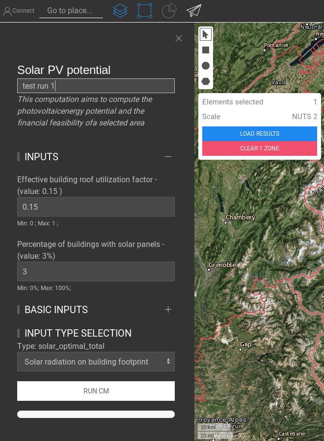
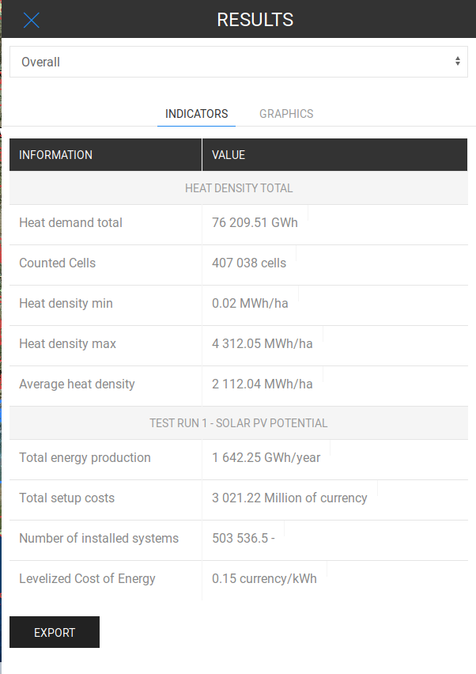

<h1><a class="anchor" id="cm-solar-thermal-and-pv-potential" href="#cm-solar-thermal-and-pv-potential"><i class="fa fa-link"></i></a>CM Solari termali u PV potenzjali</h1><h2><a class="anchor" id="table-of-contents" href="#table-of-contents"><i class="fa fa-link"></i></a> Werrej</h2><ul><li> <a href="#in-a-glance">F’daqqa t’għajn</a></li><li> <a href="#introduction">Introduzzjoni</a></li><li> <a href="#inputs-and-outputs">Inputs u outputs</a></li><li> <a href="#method">Metodu</a><ul><li> <a href="#method_example">Eżempju</a></li></ul></li><li> <a href="#github-repository-of-this-calculation-module">Repożitorju GitHub ta &#39;dan il-modulu ta&#39; kalkolu</a></li><li> <a href="#sample-run">Ġirja tal-kampjun</a><ul><li> <a href="#sample-run_test-run-1-default-input-values">Test Test 1: valuri ta &#39;input default</a></li><li> <a href="#sample-run_test-run-2-modified-input-values">Test Test 2: valuri tad-dħul modifikati</a></li></ul></li><li> <a href="#how-to-cite">Kif tikkwota</a></li><li> <a href="#authors-and-reviewers">Awturi u reviżuri</a></li><li> <a href="#license">Liċenzja</a></li><li> <a href="#acknowledgement">Rikonoxximent</a></li></ul><h2><a class="anchor" id="in-a-glance" href="#in-a-glance"><i class="fa fa-link"></i></a> F’daqqa t’għajn</h2>
 Dan il-modulu jikkalkula l-potenzjal tal-provvista tal-enerġija u l-ispejjeż relatati għal sistemi solari termali solari u PV installati fuq il-bjut f&#39;żona definita. L-inputs għall-modulu huma fajls raster tal-impronta tal-bini u l-irradjazzjoni solari, l-ispejjeż u l-effiċjenza tas-sistemi solari termali u PV ta &#39;referenza u l-frazzjonijiet taż-żona tal-bjut li tista&#39; tintuża fejn huma installati sistemi solari termali u PV.

 <a href="#table-of-contents"><strong><code>To Top</code></strong></a>
<h2><a class="anchor" id="introduction" href="#introduction"><i class="fa fa-link"></i></a> Introduzzjoni</h2>
 Il-modulu tal-kalkolu għandu l-għan li jikkalkula l-potenzjal solari termali u tal-enerġija fotovoltajka u l-fattibilità finanzjarja ta ’żona magħżula billi jikkunsidra:
<ul><li> l-installazzjoni ta ’sistemi solari termali / PV ġodda fuq perċentwal taż-żoni disponibbli (iż-żona predefinita hija l-marka tal-bini),</li><li> tivvaluta l-fattibilità finanzjarja ta &#39;impjanti ġodda.</li></ul>
 <a href="#table-of-contents"><strong><code>To Top</code></strong></a>
<h2><a class="anchor" id="inputs-and-outputs" href="#inputs-and-outputs"><i class="fa fa-link"></i></a> Inputs u outputs</h2>
 Il-parametri u s-saffi tal-input, kif ukoll is-saffi u l-parametri tal-output, huma kif ġej.

 <strong>Is-saffi u l-parametri tal-input huma:</strong>
<ul><li> fajl raster:<ul><li> irradjazzjoni solari medja annwali [kWh / m 2 ],</li><li> maż-żona disponibbli għall-isfruttament tal-enerġija solari. Ir-raster default juża l-fajl raster tal-footprint tal-bini [m 2 ],</li></ul></li><li> perċentwali taż-żona disponibbli li tista &#39;tkun koperta b&#39;pannelli solari [%],</li><li> parametri tal-pjanti ta &#39;referenza:<ul><li> l-ogħla qawwa medja installata għal kull impjant [kW_p],</li><li> effiċjenza tas-sistema, valur bejn 0 u 1 [-],</li><li> ir-radjazzjoni solari fil-Kundizzjoni tat-Test Standard hija ugwali għal 1 kW / m 2 ,</li><li> effiċjenza tal-modulu f&#39;Kundizzjonijiet Standard tat-Test [kW m 2 ].</li></ul></li></ul>
 <strong>Is-saffi u l-parametri tal-ħruġ huma:</strong>
<ul><li> Spiża totali biex tkopri ż-żona magħżula b&#39;pannelli PV [munita]</li><li> Produzzjoni annwali totali tal-enerġija [MWh / sena]</li><li> Spiża livellizzata tal-enerġija [€ / kWh]</li><li> Fajl raster bl-iktar żoni adattati għall-produzzjoni tal-enerġija PV</li></ul>
 <a href="#table-of-contents"><strong><code>To Top</code></strong></a>
<h2><a class="anchor" id="method" href="#method"><i class="fa fa-link"></i></a> Metodu</h2>
 Tibda miż-żona disponibbli u t-tip ta &#39;teknoloġija PV il-modulu jikkalkula l-produzzjoni ta&#39; enerġija PV taħt is-suppożizzjonijiet li ġejjin:
<ul><li> L-aħjar inklinazzjoni tas-sistema PV;</li><li> Erja tal-moduli PV ugwali għall-persentaġġ tal-marka tal-bini magħżula mill-utent;</li><li> Teknoloġija magħżula unika għas-sistemi PV installati kollha;</li><li> Effiċjenza tas-sistema awtomatika daqs 0.75.</li></ul>
 Dawn is-suppożizzjonijiet saru sabiex tiġi kkunsidrata fażi ta &#39;ppjanar għal reġjun u mhux id-disinn ta&#39; sistema PV speċifika.

 Il-produzzjoni ta &#39;enerġija annwali hija derivata billi titqies id-distribuzzjoni spazjali tar-radjazzjoni solari ta&#39; kull sena fuq il-marka tal-bini. Il-produzzjoni tal-enerġija PV hija kkalkulata għal impjant rappreżentattiv wieħed. L-iktar qawwa installata l-iktar rappreżentattiva għal sistema PV hija input tal-modulu. Konsegwentement, il-wiċċ kopert minn pjanta waħda u n-numru totali ta &#39;pjanti huma kkalkulati.

 Fl-aħħarnett, l-iktar żona xierqa hija kkalkulata billi jiġu kkunsidrati s-soqfa bi produzzjoni ta &#39;enerġija ogħla. Il-produzzjoni tal-enerġija ta &#39;kull pixel tikkunsidra li tkopri biss frazzjoni tas-soqfa ugwali għal f_roof. L-integrali tal-produzzjoni tal-enerġija taż-żona l-iktar adattata hija ugwali għall-produzzjoni totali tal-enerġija taż-żona magħżula.

 <a href="#table-of-contents"><strong><code>To Top</code></strong></a>
<h3><a class="anchor" id="example" href="#example"><i class="fa fa-link"></i></a> Eżempju</h3>
 Biex nagħtu eżempju prattiku, il-loġika / metodoloġija CM hija applikata għal qasam predefinit. B’default, iż-żona ta ’input li qed nużaw hija l-impronta tal-bini. Mela pereżempju, il-belt ta &#39;Bolzano (l-Italja), billi parti kbira mill-belt hija ċ-ċentru storiku (fejn mhux possibbli li jiġu installati pannelli solari) nistgħu nistmaw li saqaf wieħed biss kull 5 jista&#39; jintuża biex jiġbor l-enerġija solari (~ 20%). Minflok, jekk tipprovdi żona li hija disponibbli biex timplimenta xi kamp solari allura tista &#39;tissettja 100% taż-żona tista&#39; tintuża għas-sistema solari.

 Liema żona mill-20% tas-soqfa f&#39;Bolzano tista &#39;tkun koperta minn pannelli PV? Għatti s-saqaf kollu mhux realistiku, billi parti mis-saqaf m&#39;għandhiex orjentazzjoni xierqa. Peress li l-bini ġeneralment għandu 4 naħat, nistgħu nimmaġinaw li madwar 25% tas-saqaf għandhom orjentazzjoni tajba (għallinqas f’Bolzano, fejn ħafna mis-soqfa mhumiex wieqfa u għandhom 2 jew 4 inklinazzjonijiet tas-soqfa). Madankollu, għandna effetti ta &#39;dell mis-siġar tal-madwar, bini, muntanji, eċċ, u ġeneralment, qed inħallu ftit spazju viċin il-fruntiera tas-soqfa allura ejja nimmaġinaw li 50% tas-saqaf orjentat tajjeb jista&#39; jintuża minn PV (25 % * 50% = 12.5%), il-valur awtomatiku huwa kemmxejn aktar ottimist (15%).

 Fil-każ ta &#39;kamp solari ġeneralment, il-korda PV tokkupa madwar 40-50% taż-żona biex tevita l-effett ta&#39; dell bejn kordi PV.

 <a href="#table-of-contents"><strong><code>To Top</code></strong></a>
<h4><a class="anchor" id="example-with-a-pv-system-on-a-building-footprint" href="#example-with-a-pv-system-on-a-building-footprint"><i class="fa fa-link"></i></a> Eżempju b&#39;sistema PV fuq marka tal-bini</h4>
 Għall-fini ta &#39;eżempju, qed nispjegaw il-metodoloġija għal pixel wieħed (erja ta&#39; ettaru). Is-CM japplika l-istess loġika għal kull pixel fiż-żona magħżula mill-utent. Is-saff default (il-marka tal-bini) għandu dimensjoni ta &#39;pixel ta&#39; 100x100m, għalhekk għandna wiċċ disponibbli ta &#39;10000 m². Għal dan l-eżempju immaġina li 3000 m² biss ta &#39;soqfa huma disponibbli fil-pixel, il-parti l-oħra nieqsa tal-wiċċ hija wiċċ iddedikat għal rotot, żoni ħodor, xmara, eċċ. Il-loġika implimentata mis-CM hija:
<ul><li> applika l-ewwel persentaġġ biex tikseb biss is-soqfa li nista &#39;nospita s-sistema: <code>available_surface = 3000 [m²] * 20% = 600 [m²]</code></li><li> Il-wiċċ li jista &#39;jkun verament kopert minn sistemi PV huwa stmat li huwa 12.5%, għalhekk: <code>available_pv_surface = 600 [m²] * 12.5% = 75 [m²]</code></li><li> Imbagħad nużaw l-informazzjoni tal-effiċjenza PV (awtomatikament 0.15) biex nikkalkulaw il-wiċċ meħtieġ li jkollok impjant PV wieħed (awtomatikament ta &#39;3 kWp) <code>single_pv_surface = 3 [kWp] / 0.15 = 20 [m²]</code></li><li> allura nikkalkulaw in-numru ta &#39;sistemi PV li jistgħu jiġu installati fil-pixel li huma: <code>n_pv_plants = 75 [m²] // 20 [m²] = 3</code> u għalhekk ikollna 3 impjanti ta&#39; 3 KWp installati fuq il-pixel ta &#39;100 b&#39;100 m (allura 9 kWp), u allura aħna nimmultiplikaw dan il-valur bl-enerġija prodotta b&#39;1 kWp u mmultiplikaw bl-effiċjenza tas-sistemi PV (inverter u trasmissjoni, awtomatikament: 0.85) biex niksbu l-enerġija totali prodotta mill-pixel: <code>pv_energy = solar_radiation [kWh/kWp/year] * 9 [kWp] * 0.85</code></li></ul>
 <a href="#table-of-contents"><strong><code>To Top</code></strong></a>
<h4><a class="anchor" id="example-with-a-solar-pv-field" href="#example-with-a-solar-pv-field"><i class="fa fa-link"></i></a> Eżempju b&#39;qasam solari PV</h4>
 Issa għandna pixel ta &#39;100x100m li huwa disponibbli għal sistema ta&#39; kamp PV:
<ul><li> kif intqal qabel l-ewwel persentaġġ huwa 100% billi ż-żona kollha tista &#39;tospita s-sistema PV: <code>available_surface = (100 x 100) [m²] * 100% = 10000 [m²]</code></li><li> Il-wiċċ li jista &#39;jkun kopert minn sistemi PV huwa: <code>available_pv_surface = 10000 m² * 50% = 5000 m²</code></li><li> Imbagħad nużaw l-informazzjoni tal-effiċjenza PV (awtomatikament 0.15) biex nikkalkulaw il-wiċċ meħtieġ li jkollok impjant PV wieħed (awtomatikament ta &#39;3 kWp) <code>single_pv_surface = 3 [kWp] / 0.15 = 20 [m²]</code></li><li> allura nikkalkulaw in-numru ta &#39;sistemi li jistgħu jiġu installati fil-pixel li huma: <code>n_pv_plants = 5000 // 20 = 250</code> u għalhekk ikollna 250 impjant ta&#39; 3 KWp installati fuq il-pixel ta &#39;100 b&#39;100 m (allura 750 kWp), u allura aħna nimmultiplikaw dan il-valur bl-enerġija fis-siegħa prodotta b&#39;1 kWp u mmultiplikaw bl-effiċjenza tas-sistemi PV (inverter u trasmissjoni, awtomatikament: 0.85) biex niksbu l-enerġija totali prodotta mill-pixel: <code>pv_energy = solar_radiation [kWh/kWp/year] * 750 kWp * 0.85</code></li></ul>
 <a href="#table-of-contents"><strong><code>To Top</code></strong></a>
<h4><a class="anchor" id="example-with-a-pv-&amp;-st-system-on-a-building-footprint" href="#example-with-a-pv-&amp;-st-system-on-a-building-footprint"><i class="fa fa-link"></i></a> Eżempju b&#39;sistema PV &amp; ST fuq marka tal-bini</h4>
 Il-wiċċ tal-bini li jista &#39;jintuża, huwa riżorsa limitata. Għalhekk mhux possibbli li tuża l-istess wiċċ biex tiġbor l-enerġija solari b&#39;sistema PV u fl-istess ħin, tuża sistema Solari Termali. Mela niftakru fl-eżempju ta &#39;qabel, aħna diġà għandna 75 m² ta&#39; wiċċ iddedikat għall-PV, aħna kkalkulajna li s-saqaf orjentat tajjeb jammonta għal 25% tal-wiċċ totali u għalhekk, għad għandna 75 [m²] oħra disponibbli. Nistgħu nużaw biss frazzjoni, ejja ngħidu li 7.5%. Dan ifisser li jekk qabel ma nikkunsidraw 25% tas-saqaf b&#39;espożizzjoni tajba allura qed nikkunsidraw it-12.5% huwa ddedikat għall-PV u 7.5 huwa ddedikat għall-ST, u għalhekk, qed nużaw 20% tal-25%.

 Allura biex tagħti eżempju prattiku:
<ul><li> applika l-ewwel persentaġġ biex tikseb biss is-soqfa li nista &#39;nospita s-sistema: <code>available_surface = 3000 [m²] * 20% = 600 [m²]</code></li><li> Il-wiċċ li jista &#39;jkun verament kopert minn sistemi ST huwa: 600 m² * 7.5% = 67.5 m² <code>available_st_surface = 600 [m²] * 7.5% = 45 [m²]</code> innota li <code>75 + 45 = 120 [m²]</code> li huwa iżgħar minn wiċċ stmat li jista &#39;jkollu espożizzjoni tajba (wiċċ_disponibbli <code>available_surface * 25% = 150 [m²]</code> ).</li><li> Imbagħad nużaw l-informazzjoni tal-wiċċ ST meħtieġa minn sistema ST (awtomatikament 5 m²) biex nikkalkulaw in-numru ta &#39;pjanti ST: <code>n_st_plants = 45 [m²] // 5 [m²] = 9</code></li><li> allura nikkalkulaw il-wiċċ installat tal-pjanti ST: st_surface = 9 * 5 m² = 45 [m²] `</li><li> u issa qed napplikaw ir-radjazzjoni solari globali (kWh / m²) mill-wiċċ kopert bl-effiċjenza tal-pannelli ST (awtomatikament 0.85): <code>solar_radiation [kWh/m²] * 45 [m²] * 0.85</code></li></ul>
 <a href="#table-of-contents"><strong><code>To Top</code></strong></a>
<h2><a class="anchor" id="github-repository-of-this-calculation-module" href="#github-repository-of-this-calculation-module"><i class="fa fa-link"></i></a> Repożitorju GitHub ta &#39;dan il-modulu ta&#39; kalkolu</h2>
 <a href="https://github.com/HotMaps/solar_potential/tree/develop">Hawnhekk</a> ikollok l-iżvilupp tal-fsada għal dan il-modulu ta &#39;kalkolu.

 <a href="#table-of-contents"><strong><code>To Top</code></strong></a>
<h2><a class="anchor" id="test-run-1" href="#test-run-1"><i class="fa fa-link"></i></a> Test Run 1</h2>
 Hawnhekk, il-modulu tal-kalkolu jitħaddem għar-reġjun tal-Lombardija fl-Italja (NUTS2).
<ul><li> L-ewwel, agħżel Nuts2 u ż-żona magħżula.</li></ul> Fig. 1: Agħżel reġjun<ul><li>
 Segwi l-passi kif muri fil-figura hawn taħt:
<ul><li> Ikklikkja fuq il-buttuna &quot;Saffi&quot; biex tiftaħ it-tieqa &quot;Saffi&quot;:</li><li> Ikklikkja fuq it-tab &quot;MODULU TAL-KALKOLU&quot;.</li><li> Ikklikkja fuq il-buttuna &quot;SOLAR PV POTENZJALI&quot;.</li></ul></li><li>
 Issa, il- &quot;Solar PV Potential&quot; jiftaħ u huwa lest biex jaħdem.
</li></ul>
 <a href="#table-of-contents"><strong><code>To Top</code></strong></a>
<h2><a class="anchor" id="sample-run" href="#sample-run"><i class="fa fa-link"></i></a> Kampjun Run</h2><h3><a class="anchor" id="test-run-1--default-input-values" href="#test-run-1--default-input-values"><i class="fa fa-link"></i></a> Test Test 1: valuri ta &#39;input default</h3>
 Il-valuri awtomatiċi tad-dħul jikkunsidraw il-possibbiltà li jiġu installati pannelli PV immuntati fuq is-saqaf fuq il-bini. Dawn il-valuri jirreferu għal impjant ta &#39;3 kWp. Jista &#39;jkun li jkollok bżonn tissettja valuri&#39; l isfel jew &#39;il fuq minn valuri awtomatiċi meta wieħed iqis kunsiderazzjonijiet u spejjeż lokali addizzjonali. Għalhekk, l-utent għandu jtejjeb dawn il-valuri biex isib l-aħjar kombinazzjoni ta &#39;limiti għall-istudju tal-każ tiegħu / tagħha.

 Biex tmexxi l-modulu tal-kalkolu, segwi l-passi li jmiss:
<ul><li> Assenja isem lis-sessjoni tal-ġirja (mhux obbligatorja - hawnhekk, għażilna &quot;Ġirja tat-Test 1&quot;) u ssettja l-parametri tal-input (hawn, intużaw il-valuri awtomatiċi).</li></ul><ul><li> Stenna sakemm jintemm il-proċess.</li><li> Bħala output, indikaturi u dijagrammi huma murija fit-tieqa &quot;RIŻULTATI&quot;. L-indikaturi juru:<ul><li> Produzzjoni totali tal-enerġija,</li><li> Spejjeż totali ta &#39;setup,</li><li> Numru ta &#39;sistemi installati,</li><li> Spiża tal-Enerġija Livellata.</li></ul></li></ul><ul><li> Ukoll saff ġdid huwa miżjud mal-kanvas li juri l-bini b&#39;potenzjal ta &#39;enerġija ogħla. Dan is-saff huwa miżjud mal-lista ta &#39;saffi taħt il-kategorija &quot;Modulu ta&#39; Kalkolu&quot;. L-isem tas-sessjoni tal-ġirja jiddistingwi l-outputs ta &#39;din il-ġirja minn oħrajn. Jekk għażilt is-saffi awtomatiċi u tagħżel TEST RUN 1 tista &#39;tara l-iktar żoni adattati għall-installazzjonijiet ta&#39; impjanti PV.</li></ul>
 <a href="#table-of-contents"><strong><code>To Top</code></strong></a>
<h3><a class="anchor" id="test-run-2--modified-input-values" href="#test-run-2--modified-input-values"><i class="fa fa-link"></i></a> Test Test 2: valuri tad-dħul modifikati</h3>
 Skont l-esperjenza u l-għarfien lokali tiegħek, tista &#39;żżid jew tnaqqas il-valuri tal-input biex tikseb riżultati aħjar. Tista &#39;tiddeċiedi li żżid il-wiċċ tal-bini adattat għall-impjanti PV.
<ul><li>
 Assenja isem lis-sessjoni tal-ġirja (mhux obbligatorja - hawnhekk, għażilna &quot;Ġirja tat-Test 2&quot;) u ssettja l-parametri tal-input Perċentwal ta &#39;bini b&#39;pannelli solari ugwali għal 50. Dan ifisser li qed inkopru 50% tas-soqfa tal-bini disponibbli. Innota li peress li kull pixel jista &#39;jirrappreżenta aktar minn bini wieħed u aħna mhux qed ngħattu s-saqaf kollu b&#39;pannelli PV, l-utent jista&#39; jiffissa wkoll il-fattur ta &#39;użu effettiv tas-saqaf tal-bini. Il-valur awtomatiku huwa ssettjat għal 0.15. Dan ifisser li 15% biss tal-wiċċ tas-saqaf f&#39;pixel huwa kopert minn pannelli PV.
</li><li>
 Stenna sakemm jintemm il-proċess.
</li><li>
 Bħala output, indikaturi u dijagrammi huma murija fit-tieqa &quot;RIŻULTATI&quot;. L-indikaturi juru:
<ul><li> Produzzjoni totali tal-enerġija,</li><li> Spejjeż totali ta &#39;setup,</li><li> Numru ta &#39;sistemi installati,</li><li> Spiża tal-Enerġija Livellata.</li></ul></li></ul>
 <a href="#table-of-contents"><strong><code>To Top</code></strong></a>
<h2><a class="anchor" id="how-to-cite" href="#how-to-cite"><i class="fa fa-link"></i></a> Kif tikkwota</h2>
 Giulia Garegnani, f&#39;Hotmaps-Wiki, CM-Solar-PV-potential (April 2019)

 <a href="#table-of-contents"><strong><code>To Top</code></strong></a>
<h2><a class="anchor" id="authors-and-reviewers" href="#authors-and-reviewers"><i class="fa fa-link"></i></a> Awturi u reviżuri</h2>
 Din il-paġna ġiet miktuba minn Giulia Garegnani ( <strong><a href="http://www.eurac.edu">EURAC</a></strong> ).

 ☑ Din il-paġna ġiet riveduta minn Mostafa Fallahnejad ( <strong><a href="https://eeg.tuwien.ac.at/">EEG - TU Wien</a></strong> ).

 <a href="#table-of-contents"><strong><code>To Top</code></strong></a>
<h2><a class="anchor" id="license" href="#license"><i class="fa fa-link"></i></a> Liċenzja</h2>
 Copyright © 2016-2020: Giulia Garegnani

 Liċenzja Internazzjonali Creative Commons Attribution 4.0

 Dan ix-xogħol huwa liċenzjat taħt Liċenzja Internazzjonali Creative Commons CC BY 4.0.

 Identifikatur tal-Liċenzja SPDX: CC-BY-4.0

 Test tal-Liċenzja: https://spdx.org/licenses/CC-BY-4.0.html

 <a href="#table-of-contents"><strong><code>To Top</code></strong></a>
<h2><a class="anchor" id="acknowledgement" href="#acknowledgement"><i class="fa fa-link"></i></a> Rikonoxximent</h2>
 Nixtiequ nwasslu l-apprezzament profond tagħna għall- <a href="https://www.hotmaps-project.eu">Proġett Hotmaps ta &#39;</a> Orizzont 2020 (Grant Agreement numru 723677), li pprovda l-finanzjament biex titwettaq l-investigazzjoni preżenti.

 <a href="#table-of-contents"><strong><code>To Top</code></strong></a>

<!--- THIS IS A SUPER UNIQUE IDENTIFIER -->

This page was automatically translated. View in another language:

[English](../en/CM-Solar-thermal-and-PV-potential) (original) [Bulgarian](../bg/CM-Solar-thermal-and-PV-potential)\* [Czech](../cs/CM-Solar-thermal-and-PV-potential)\* [Danish](../da/CM-Solar-thermal-and-PV-potential)\* [German](../de/CM-Solar-thermal-and-PV-potential)\* [Greek](../el/CM-Solar-thermal-and-PV-potential)\* [Spanish](../es/CM-Solar-thermal-and-PV-potential)\* [Estonian](../et/CM-Solar-thermal-and-PV-potential)\* [Finnish](../fi/CM-Solar-thermal-and-PV-potential)\* [French](../fr/CM-Solar-thermal-and-PV-potential)\* [Irish](../ga/CM-Solar-thermal-and-PV-potential)\* [Croatian](../hr/CM-Solar-thermal-and-PV-potential)\* [Hungarian](../hu/CM-Solar-thermal-and-PV-potential)\* [Italian](../it/CM-Solar-thermal-and-PV-potential)\* [Lithuanian](../lt/CM-Solar-thermal-and-PV-potential)\* [Latvian](../lv/CM-Solar-thermal-and-PV-potential)\*  [Dutch](../nl/CM-Solar-thermal-and-PV-potential)\* [Polish](../pl/CM-Solar-thermal-and-PV-potential)\* [Portuguese (Portugal, Brazil)](../pt/CM-Solar-thermal-and-PV-potential)\* [Romanian](../ro/CM-Solar-thermal-and-PV-potential)\* [Slovak](../sk/CM-Solar-thermal-and-PV-potential)\* [Slovenian](../sl/CM-Solar-thermal-and-PV-potential)\* [Swedish](../sv/CM-Solar-thermal-and-PV-potential)\* 

\* machine translated
