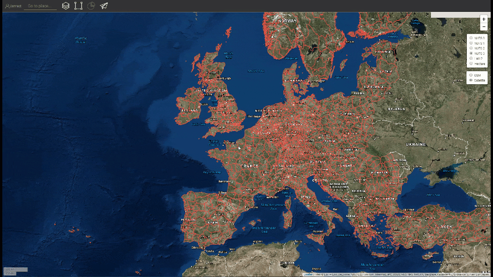
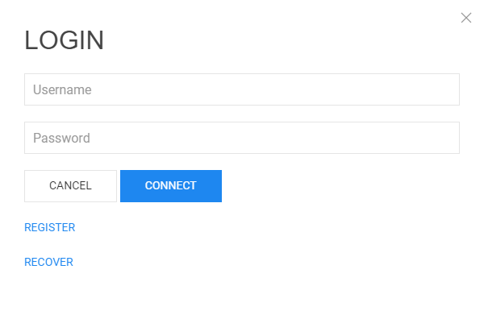

<h1><a class="anchor" id="introduction-to-user-interface" href="#introduction-to-user-interface"><i class="fa fa-link"></i></a>Introduzzjoni għall-user interface</h1><h2><a class="anchor" id="table-of-contents" href="#table-of-contents"><i class="fa fa-link"></i></a> Werrej</h2><ul><li>
 <a href="#introduction-page">Paġna ta &#39;Introduzzjoni</a>
</li><li>
 <a href="#upper-toolbar">Toolbar ta &#39;Fuq</a>
<ul><li> <a href="#upper-toolbar_connect">Qabbad</a><ul><li> <a href="#upper-toolbar_connect_login">Idħol</a></li><li> <a href="#upper-toolbar_connect_register">Irreġistra</a></li><li> <a href="#upper-toolbar_connect_recover">Irkupra</a></li></ul></li><li> <a href="#upper-toolbar_go-to-place">Mur fil-Post</a></li><li> <a href="#upper-toolbar_layers">Saffi</a></li><li> <a href="#upper-toolbar_selection-tools">Għodda ta &#39;Għażla</a></li><li> <a href="#upper-toolbar_show-result">Uri Riżultat</a></li><li> <a href="#upper-toolbar_feedback">Feedback</a></li><li> <a href="#upper-toolbar_save-session">Issejvja Sessjoni</a></li><li> <a href="#upper-toolbar_save-session-folder">Save Session Folder</a></li></ul></li><li>
 <a href="#tiles">Madum</a>
</li><li>
 <a href="#how-to-cite">Kif tikkwota</a>
</li><li>
 <a href="#authors-and-reviewers">Awturi u reviżuri</a>
</li><li>
 <a href="#license">Liċenzja</a>
</li><li>
 <a href="#acknowledgement">Rikonoxximent</a>
</li></ul><h2><a class="anchor" id="introduction-page" href="#introduction-page"><i class="fa fa-link"></i></a> Paġna ta &#39;Introduzzjoni</h2>
 Ladarba tinfetaħ il-kaxxa tal-għodda, tintwera l-paġna ta ’ċaħda. Minbarra l-messaġġ ta &#39;ċaħda ta&#39; responsabbiltà, hija pprovduta informazzjoni addizzjonali rigward browsers appoġġati, l-għanijiet tal-proġett Hotmaps, il-link għall-websajt tal-proġett Hotmaps u r-repożitorji tad-dejta.

 <em>Fig. 1 Introduzzjoni qasira għall-kaxxa tal-għodda Hotmaps</em>

 Il-Hotmaps GUI hija interface ibbażata fuq il-GIS. Meta jagħlaq il-paġna ta &#39;ċaħda, l-utent jara l-mappa ta&#39; l-Ewropa. B’default, il-mappa tad-densità tad-domanda għas-sħana tal-pajjiżi tal-UE-28 u l-konfini NUTS 2 huma murija. Minbarra dawn iż-żewġ mapep, xi għodda u buttuni jistgħu jidhru fil-GUI. Dawn l-għodda huma murija fil-figura li ġejja.

 <em>Fig. 2 Paġna Inizjali</em>

 Hawnhekk tista &#39;tara mill-ewwel daqqa t&#39;għajn 3 partijiet tal-user interface:
<ol><li> <a href="#upper-toolbar">toolbar fin-naħa ta &#39;fuq tax-xellug</a> ,</li><li> il-mappa nnifisha,</li><li> <a href="#tiles">xi għodda biex tbiddel l-istil tal-mappa</a> .</li><li> żewġ links fuq in-naħa ta ’fuq tal-lemin: għal din il- <a href="https://wiki.hotmaps.eu/">Hotmaps Wiki</a> u għall- <a href="https://www.hotmaps-project.eu/">websajt tal-Proġett Hotmaps</a> .</li></ol>
 Fil-kapitoli li ġejjin, l-ewwel 3 punti huma spjegati fid-dettall.

 <a href="#table-of-contents"><strong><code>To Top</code></strong></a>
<h2><a class="anchor" id="upper-toolbar" href="#upper-toolbar"><i class="fa fa-link"></i></a> Toolbar ta &#39;Fuq</h2>

 B&#39;din il-toolbar tista &#39;:
<ol><li> <a href="#upper-toolbar_connect"><em>Qabbad:</em></a> irreġistra u tidħol fl-applikazzjoni tal-web sabiex issalva x-xogħol tiegħek,</li><li> <a href="#upper-toolbar_go-to-place"><em>Mur fil-Post:</em></a> żomm lejn reġjun speċifiku billi tittajpja l-isem,</li><li> <a href="#upper-toolbar_layers"><em>Saffi:</em></a> uri l-istrixxa tal-ġenb tas-saff,</li><li> <a href="#upper-toolbar_selection-tools"><em>Għodda tal-Għażla</em> :</a> attivat jew itfi l-għodod tal-għażla,</li><li> <a href="#upper-toolbar_show-result"><em>Uri Riżultat:</em></a> uri r-riżultat tal-ġenb tar-reġjuni magħżula tiegħek,</li><li> <a href="#upper-toolbar_feedback"><em>Feedback:</em></a> agħtina feedback rigward l-għodda,</li><li> <a href="#upper-toolbar_save-session"><em>Issejvja Sessjoni:</em></a> tista &#39;tiffranka saffi magħżula u livell ta&#39; zoom u tfakkarhom aktar tard,</li><li> <a href="#upper-toolbar_save-session-folder"><em>Save Session Folder:</em></a> fejn tista &#39;tara l-lista tas-sessjonijiet kollha salvati.</li></ol>
 <a href="#table-of-contents"><strong><code>To Top</code></strong></a>
<h3><a class="anchor" id="connect" href="#connect"><i class="fa fa-link"></i></a> Qabbad</h3>
 Hawnhekk tista &#39;:
<ul><li> Oħloq kont</li><li> Idħol fil-kont tiegħek biex tiffranka l-progress tiegħek</li><li> Jew irrisettja l-password tiegħek jekk tinsaha</li></ul>
 <a href="#table-of-contents"><strong><code>To Top</code></strong></a>
<h4><a class="anchor" id="login" href="#login"><i class="fa fa-link"></i></a> Idħol</h4>
 Wara li <a href="#register">tirreġistra</a> u tattiva l-kont tiegħek għandek tkun tista &#39;tidħol bl-email u l-password tiegħek (ara <a href="#fig4">Fig.4</a> hawn taħt).

 <em>Fig.4 .: Formola ta &#39;Login</em>

 <a href="#table-of-contents"><strong><code>To Top</code></strong></a>
<h4><a class="anchor" id="register" href="#register"><i class="fa fa-link"></i></a> Irreġistra</h4>
 Hawnhekk tista &#39;toħloq kont għall-websajt tal- <em>hotmaps</em> . Wara li tissottometti l- <a href="#fig5">formola</a> tirċievi email biex tattiva l-kont tiegħek. Bil-kont tiegħek, tkun tista &#39;tiffranka l-progress tiegħek.

 <em>Fig.5 .: Formola ta &#39;Reġistrazzjoni</em>

 <a href="#table-of-contents"><strong><code>To Top</code></strong></a>
<h4><a class="anchor" id="recover" href="#recover"><i class="fa fa-link"></i></a> Irkupra</h4>
 Jekk qatt tinsa l-password tiegħek tista &#39;tirkupraha taħt dan il-menu (ara <a href="#fig6">Fig. 6</a> hawn taħt). Jekk jogħġbok kun af li tissettja password ġdida wara.

 <em>Fig.6 .: Irkupra l-Formola</em>

 <a href="#table-of-contents"><strong><code>To Top</code></strong></a>
<h3><a class="anchor" id="go-to-place" href="#go-to-place"><i class="fa fa-link"></i></a> Mur fil-Post</h3>
 Tista &#39;tagħmel zoom għal reġjun speċifikat billi tittajpja ismu (ara l-animazzjoni hawn taħt)

 <a href="#table-of-contents"><strong><code>To Top</code></strong></a>
<h3><a class="anchor" id="layers" href="#layers"><i class="fa fa-link"></i></a> Saffi</h3>
 Billi tagħfas din il-Buttuna tidher sidebar b&#39;tip differenti ta &#39;saffi fuq ix-xellug.

 Is-saffi li ġejjin jistgħu jinstabu u jidhru:

 <a href="#table-of-contents"><strong><code>To Top</code></strong></a>
<h3><a class="anchor" id="selection-tools" href="#selection-tools"><i class="fa fa-link"></i></a> Għodda ta &#39;Għażla</h3>
 Billi Tagħfas din il-Buttuna l-għodod tal-għażla jidhru fuq ix-xellug tal-iskrin tiegħek

 Il-figura hawn taħt turi d-dehra tal-għodda:

<ol><li> Għodda għall-għażla tar-reġjuni</li><li> Oħloq reġjun kwadru apposta</li><li> Oħloq reġjun taċ-ċirku tad-dwana</li><li> Oħloq reġjun tal-poligonu apposta</li><li> Tella &#39;oġġett GeoJSON biex tuża għażla ta&#39; żona apposta</li></ol><ol type="A"><li> juri kemm reġjuni għażilt</li><li> juri l-wiċċ ġenerali tal-iżgħar rettangolu li jista &#39;jkopri ż-żona magħżula</li><li> turi l-iskala li għażilt mill-toolbar tal-lemin</li></ol><ol type="a"><li> buttuna għat-tagħbija tar-riżultati tar-reġjun magħżul tiegħek u s-saffi magħżula</li><li> buttuna biex tħassar reġjun magħżul</li></ol>
 <a href="#table-of-contents"><strong><code>To Top</code></strong></a>
<h3><a class="anchor" id="show-result" href="#show-result"><i class="fa fa-link"></i></a> Uri Riżultat</h3>
 Jiddependi fuq is-saffi u r-reġjun li għażilt ir-riżultati għall-konfigurazzjoni tiegħek huma murija fil-ġenb fuq il-lemin tal-iskrin tiegħek

 <a href="#table-of-contents"><strong><code>To Top</code></strong></a>
<h3><a class="anchor" id="feedback" href="#feedback"><i class="fa fa-link"></i></a> Feedback</h3>
 Għandek xi suġġerimenti dwar kif tista &#39;ttejjeb l-għodda? Innutajt xi żbalji? Jekk jogħġbok għarrafna! Billi tagħtina feedback tista &#39;tgħinna ntejbu l-kaxxa tal-għodda!

 Jekk jogħġbok imla l- <a href="#Fig7">formola</a> hawn taħt:

 <a href="#table-of-contents"><strong><code>To Top</code></strong></a>

 tista &#39;tagħżel minn dawn it-tipi:

 u stabbilixxa prijorità:

 <a href="#table-of-contents"><strong><code>To Top</code></strong></a>
<h3><a class="anchor" id="save-session" href="#save-session"><i class="fa fa-link"></i></a> Issejvja Sessjoni</h3>
 tista &#39;tagħmel stampa ta&#39; xogħolek (żoni u saffi magħżula, livelli ta &#39;zoom, eċċ) billi timbotta din il-buttuna. Tista &#39;wkoll tiddefinixxi isem u deskrizzjoni tar-ritratt.
<h3><a class="anchor" id="save-session-folder" href="#save-session-folder"><i class="fa fa-link"></i></a> Save Session Folder</h3>
 Hawnhekk tara l-istampi kollha tiegħek bl-ismijiet u d-deskrizzjoni tagħhom. Meta tagħżel wieħed is-saffi, l-erjas, il-livell taż-żum u konfigurazzjoni oħra magħżula jitgħabbew.
<h2><a class="anchor" id="tiles" href="#tiles"><i class="fa fa-link"></i></a> Madum</h2>
 Tista &#39;tagħżel l-iskala territorjali li trid tanalizza (reġjuni NUTS jew livell ta&#39; ettaru) u tissettja l-maduma tal-mappa

 Hemm konfigurazzjonijiet li ġejjin possibbli

<ol><li> Żomm u iċċekken il-mappa</li><li> Uri l-konfini NUTS biex tagħżel reġjuni speċifiċi NUTS jew uża ettaru biex tippersonalizza l- <a href="#upper-toolbar_selection-tools">għażla</a> tiegħek</li><li> Uża maduma OpenStreetMap jew maduma Satelite</li></ol>
 <a href="#table-of-contents"><strong><code>To Top</code></strong></a>
<h2><a class="anchor" id="how-to-cite" href="#how-to-cite"><i class="fa fa-link"></i></a> Kif tikkwota</h2>
 Jeton Hasani, f&#39;Hotmaps-Wiki, Introduzzjoni għall-user-interface (April 2019)

 <a href="#table-of-contents"><strong><code>To Top</code></strong></a>
<h2><a class="anchor" id="authors-and-reviewers" href="#authors-and-reviewers"><i class="fa fa-link"></i></a> Awturi u reviżuri</h2>
 Din il-paġna ġiet miktuba minn Jeton Hasani <strong><a href="https://eeg.tuwien.ac.at/">EEG - TU Wien</a></strong> .

 ☑ Din il-paġna ġiet riveduta minn Mostafa Fallahnejad <strong><a href="https://eeg.tuwien.ac.at/">EEG - TU Wien</a></strong> .

 <a href="#table-of-contents"><strong><code>To Top</code></strong></a>
<h2><a class="anchor" id="license" href="#license"><i class="fa fa-link"></i></a> Liċenzja</h2>
 Copyright © 2016-2020: Jeton Hasani

 Liċenzja Internazzjonali Creative Commons Attribution 4.0

 Dan ix-xogħol huwa liċenzjat taħt Liċenzja Internazzjonali Creative Commons CC BY 4.0.

 Identifikatur tal-Liċenzja SPDX: CC-BY-4.0

 Test tal-Liċenzja: https://spdx.org/licenses/CC-BY-4.0.html

 <a href="#table-of-contents"><strong><code>To Top</code></strong></a>
<h2><a class="anchor" id="acknowledgement" href="#acknowledgement"><i class="fa fa-link"></i></a> Rikonoxximent</h2>
 Nixtiequ nwasslu l-apprezzament profond tagħna għall- <a href="https://www.hotmaps-project.eu">Proġett Hotmaps ta &#39;</a> Orizzont 2020 (Grant Agreement numru 723677), li pprovda l-finanzjament biex titwettaq l-investigazzjoni preżenti.

 <a href="#table-of-contents"><strong><code>To Top</code></strong></a>

<!--- THIS IS A SUPER UNIQUE IDENTIFIER -->

This page was automatically translated. View in another language:

[English](../en/Introduction-to-user-interface) (original) [Bulgarian](../bg/Introduction-to-user-interface)\* [Czech](../cs/Introduction-to-user-interface)\* [Danish](../da/Introduction-to-user-interface)\* [German](../de/Introduction-to-user-interface)\* [Greek](../el/Introduction-to-user-interface)\* [Spanish](../es/Introduction-to-user-interface)\* [Estonian](../et/Introduction-to-user-interface)\* [Finnish](../fi/Introduction-to-user-interface)\* [French](../fr/Introduction-to-user-interface)\* [Irish](../ga/Introduction-to-user-interface)\* [Croatian](../hr/Introduction-to-user-interface)\* [Hungarian](../hu/Introduction-to-user-interface)\* [Italian](../it/Introduction-to-user-interface)\* [Lithuanian](../lt/Introduction-to-user-interface)\* [Latvian](../lv/Introduction-to-user-interface)\*  [Dutch](../nl/Introduction-to-user-interface)\* [Polish](../pl/Introduction-to-user-interface)\* [Portuguese (Portugal, Brazil)](../pt/Introduction-to-user-interface)\* [Romanian](../ro/Introduction-to-user-interface)\* [Slovak](../sk/Introduction-to-user-interface)\* [Slovenian](../sl/Introduction-to-user-interface)\* [Swedish](../sv/Introduction-to-user-interface)\* 

\* machine translated
