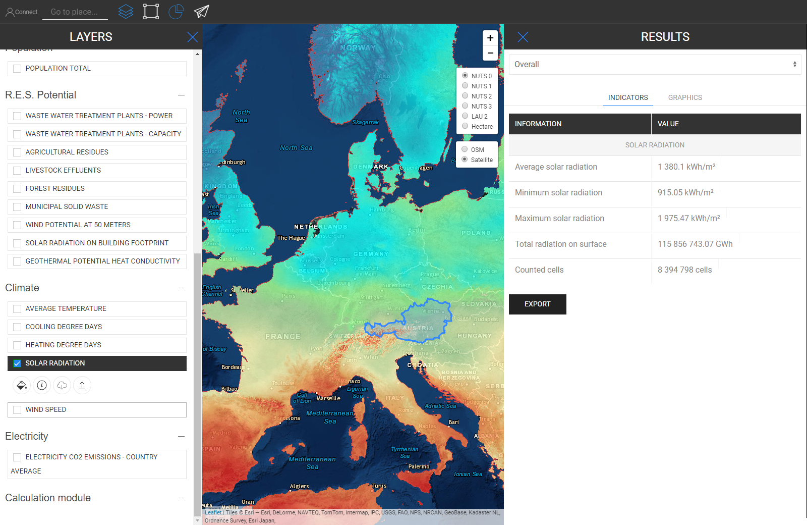

<h1><a class="anchor" id="retrieve-indicators-of-a-selected-area" href="#retrieve-indicators-of-a-selected-area"><i class="fa fa-link"></i></a>Irkupra indikaturi ta &#39;żona magħżula</h1><h2><a class="anchor" id="table-of-contents" href="#table-of-contents"><i class="fa fa-link"></i></a> Werrej</h2><ul><li> <a href="#introduction">Introduzzjoni</a></li><li> <a href="#indicators-for-raster-layers">Indikaturi għal saffi raster</a><ul><li> <a href="#indicators-for-raster-layers_buildings">Bini</a></li><li> <a href="#indicators-for-raster-layers_population">Popolazzjoni</a></li><li> <a href="#indicators-for-raster-layers_renewable-energy-source-potentials">Potenzjal ta &#39;Sors ta&#39; Enerġija Rinnovabbli</a></li></ul></li><li> <a href="#indicators-for-vector-layers">Indikaturi għal saffi vettorjali</a><ul><li> <a href="#indicators-for-vector-layers_industry">Industrija</a></li><li> <a href="#indicators-for-vector-layers_renewable-energy-source-potentials">Potenzjal ta &#39;Sors ta&#39; Enerġija Rinnovabbli</a></li><li> <a href="#indicators-for-vector-layers_electricity">Elettriku</a></li></ul></li><li> <a href="#example">Eżempju</a></li><li> <a href="#how-to-cite">Kif tikkwota</a></li><li> <a href="#authors-and-reviewers">Awturi u reviżuri</a></li><li> <a href="#license">Liċenzja</a></li><li> <a href="#acknowledgement">Rikonoxximent</a></li></ul><h2><a class="anchor" id="introduction" href="#introduction"><i class="fa fa-link"></i></a> Introduzzjoni</h2>
 Jiddependi fuq is-saffi u r-reġjun li għażilt indikaturi għall-konfigurazzjoni tiegħek huma murija fil-ġenb fuq il-lemin tal-iskrin tiegħek

 <a href="#table-of-contents"><strong><code>To Top</code></strong></a>

 Fis-segwenti, inħarsu lejn l-indikaturi li huma murija għal saffi raster u vettorjali.
<h2><a class="anchor" id="indicators-for-raster-layers" href="#indicators-for-raster-layers"><i class="fa fa-link"></i></a> Indikaturi għal saffi raster</h2>
 L-indikaturi fuq saffi raster huma differenti minn saffi vettorjali. B’differenti, aħna nfissru f’termini ta ’aggregazzjoni u diżaggregazzjoni. Din l-imġieba differenti ġejja minn riżoluzzjonijiet territorjali.

 Is-Saffi tar-Raster ġeneralment għandhom riżoluzzjoni ħafna ogħla filwaqt li s-saffi tal-vetturi għandhom biss attributi f&#39;punti jew poligoni.

 Dan ifisser minn naħa waħda pereżempju li jekk tagħżel saff ta &#39;vettur li huwa definit mill-poligoni NUTS3 u trid pereżempju tagħżel reġjun LAU allura l-valur NUTS3 ma jiġix diżaggregat għal-livell LAU, minflok, l-indikatur NUTS3 fejn dan Ir-reġjun LAU jinsab se jintwera fil-ġenb tar-riżultati.

 Min-naħa l-oħra, saffi raster huma aggregati u diżaggregati &quot;arbitrarjament&quot; *

 * miċ-ċelloli li fihom ir-reġjun li għażilt (naturalment fil-limitu tar-riżoluzzjoni raster innifisha)

 <a href="#table-of-contents"><strong><code>To Top</code></strong></a>
<h3><a class="anchor" id="buildings" href="#buildings"><i class="fa fa-link"></i></a> Bini</h3>
 <strong>Mappa tad-Densità tas-Sħana</strong>

 <strong>Karatteristika Extra</strong>

 Meta tagħżel is-saff tad-densità tas-sħana u s-Saff tal-Popolazzjoni fl-istess ħin jintwera indikatur żejjed (ara stampa hawn taħt)

 <a href="#table-of-contents"><strong><code>To Top</code></strong></a>
<h3><a class="anchor" id="in-general-" href="#in-general-"><i class="fa fa-link"></i></a> Ġeneralment:</h3>
 Meta wieħed mis-saffi tal-bini u s-saff tal-popolazzjoni jintgħażel fl-istess ħin, indikatur żejjed jintwera kif deskritt qabel

<ins> <code><strong><a href="#indicators-for-raster-layers">To Chapter</a></strong></code></ins>

 <strong>Mappa tad-Densità tat-Tkessiħ</strong>

<ins> <code><strong><a href="#indicators-for-raster-layers">To Chapter</a></strong></code></ins>

 <strong>Volumi tal-Bini</strong>

<ins> <code><strong><a href="#indicators-for-raster-layers">To Chapter</a></strong></code></ins>

 <strong>Erja tal-art grossa</strong>

<ins> <code><strong><a href="#indicators-for-raster-layers">To Chapter</a></strong></code></ins> <a href="#table-of-contents"><strong><code>To Top</code></strong></a>
<h3><a class="anchor" id="population" href="#population"><i class="fa fa-link"></i></a> Popolazzjoni</h3>

<ins> <code><strong><a href="#indicators-for-raster-layers">To Chapter</a></strong></code></ins> <a href="#table-of-contents"><strong><code>To Top</code></strong></a>
<h3><a class="anchor" id="climate" href="#climate"><i class="fa fa-link"></i></a> Klima</h3>
 <strong>Temperatura</strong>

<ins> <code><strong><a href="#indicators-for-raster-layers">To Chapter</a></strong></code></ins>

 <strong>Jiem ta &#39;Grad ta&#39; Tkessiħ</strong>

<ins> <code><strong><a href="#indicators-for-raster-layers">To Chapter</a></strong></code></ins>

 <strong>Jiem ta &#39;Grad ta&#39; Tisħin</strong>

<ins> <code><strong><a href="#indicators-for-raster-layers">To Chapter</a></strong></code></ins>

 <strong>Radjazzjoni Solari</strong>

<ins> <code><strong><a href="#indicators-for-raster-layers">To Chapter</a></strong></code></ins>

 <strong>Veloċità tar-Riħ</strong>

<ins> <code><strong><a href="#indicators-for-raster-layers">To Chapter</a></strong></code></ins> <a href="#table-of-contents"><strong><code>To Top</code></strong></a>
<h3><a class="anchor" id="renewable-energy-source-potentials" href="#renewable-energy-source-potentials"><i class="fa fa-link"></i></a> Potenzjal ta &#39;Sors ta&#39; Enerġija Rinnovabbli</h3>
 <strong>Ir-Radjazzjoni Solari Fuq il-Footprint tal-Bini</strong>

<ins> <code><strong><a href="#indicators-for-raster-layers">To Chapter</a></strong></code></ins>

 <strong>Potenzjal tar-Riħ f&#39;50m</strong>

<ins> <code><strong><a href="#indicators-for-raster-layers">To Chapter</a></strong></code></ins>

 <strong>Residwi tal-Foresti</strong>

<ins> <code><strong><a href="#indicators-for-raster-layers">To Chapter</a></strong></code></ins> <a href="#table-of-contents"><strong><code>To Top</code></strong></a>
<h2><a class="anchor" id="indicators-for-vector-layers" href="#indicators-for-vector-layers"><i class="fa fa-link"></i></a> Indikaturi għal saffi vettorjali</h2><h3><a class="anchor" id="industry" href="#industry"><i class="fa fa-link"></i></a> Industrija</h3>
 <strong>Emissjonijiet ta &#39;Sit Industrijali</strong>

<ins> <code><strong><a href="#indicators-for-vector-layers">To Chapter</a></strong></code></ins>

 <strong>Sħana Eċċessiva tas-Sit Industrijali</strong>

<ins> <code><strong><a href="#indicators-for-vector-layers">To Chapter</a></strong></code></ins>

 <strong>Isem tal-Kumpanija tas-Sit Industrijali</strong>

<ins> <code><strong><a href="#indicators-for-vector-layers">To Chapter</a></strong></code></ins>

 <strong>Subsettur tas-Sit Industrijali</strong>

<ins> <code><strong><a href="#indicators-for-vector-layers">To Chapter</a></strong></code></ins> <a href="#table-of-contents"><strong><code>To Top</code></strong></a>
<h3><a class="anchor" id="renewable-energy-source-potentials" href="#renewable-energy-source-potentials"><i class="fa fa-link"></i></a> Potenzjal ta &#39;Sors ta&#39; Enerġija Rinnovabbli</h3>
 <strong>Enerġija tal-Impjanti tat-Trattament tal-Ilma Mormi</strong>

<ins> <code><strong><a href="#indicators-for-vector-layers">To Chapter</a></strong></code></ins>

 <strong>Kapaċità tal-Impjanti tat-Trattament tal-Ilma Mormi</strong>

<ins> <code><strong><a href="#indicators-for-vector-layers">To Chapter</a></strong></code></ins>

 <strong>Residwi Agrikoli</strong>

<ins> <code><strong><a href="#indicators-for-vector-layers">To Chapter</a></strong></code></ins>

 <strong>Effluwenti tal-Bhejjem</strong>

<ins> <code><strong><a href="#indicators-for-vector-layers">To Chapter</a></strong></code></ins>

 <strong>Skart Solidu Muniċipali</strong>

<ins> <code><strong><a href="#indicators-for-vector-layers">To Chapter</a></strong></code></ins>

 <strong>Konduttività Potenzjali tas-Sħana Ġeotermali</strong>

<ins> <code><strong><a href="#indicators-for-vector-layers">To Chapter</a></strong></code></ins> <a href="#table-of-contents"><strong><code>To Top</code></strong></a>
<h3><a class="anchor" id="electricity" href="#electricity"><i class="fa fa-link"></i></a> Elettriku</h3>
 <strong>Emissjonijiet tal-Elettriku C02</strong>

<ins> <code><strong><a href="#indicators-for-vector-layers">To Chapter</a></strong></code></ins> <a href="#table-of-contents"><strong><code>To Top</code></strong></a>
<h2><a class="anchor" id="example" href="#example"><i class="fa fa-link"></i></a> Eżempju</h2>
 Fl-istampa t&#39;hawn taħt tista &#39;tara kif tidher meta jiġu viżwalizzati s-saffi kollha (hawnhekk hija l-Awstrija bħala NUTS0 magħżula)

 Għalkemm din il-mappa tista &#39;tidher daqsxejn konfuża mal-ewwel daqqa t&#39;għajn, l-indikaturi tagħha huma murija&#39; l quddiem. Ara hawn taħt l-indikaturi kollha li huma deskritti fir-riżultat tal-ġenb meta tagħżel is-saffi kollha għall-Awstrija (NUTS0)

 <a href="#table-of-contents"><strong><code>To Top</code></strong></a>
<h2><a class="anchor" id="how-to-cite" href="#how-to-cite"><i class="fa fa-link"></i></a> Kif tikkwota</h2>
 Jeton Hasani, fil-Hotmaps-Wiki, Irkupra indikaturi-ta &#39;żona magħżula (April 2019)

 <a href="#table-of-contents"><strong><code>To Top</code></strong></a>
<h2><a class="anchor" id="authors-and-reviewers" href="#authors-and-reviewers"><i class="fa fa-link"></i></a> Awturi u reviżuri</h2>
 Din il-paġna ġiet miktuba minn Jeton Hasani <strong><a href="https://eeg.tuwien.ac.at/">EEG - TU Wien</a></strong> .

 ☑ Din il-paġna ġiet riveduta minn Mostafa Fallahnejad <strong><a href="https://eeg.tuwien.ac.at/">EEG - TU Wien</a></strong> .

 <a href="#table-of-contents"><strong><code>To Top</code></strong></a>
<h2><a class="anchor" id="license" href="#license"><i class="fa fa-link"></i></a> Liċenzja</h2>
 Copyright © 2016-2020: Jeton Hasani

 Liċenzja Internazzjonali Creative Commons Attribution 4.0

 Dan ix-xogħol huwa liċenzjat taħt Liċenzja Internazzjonali Creative Commons CC BY 4.0.

 Identifikatur tal-Liċenzja SPDX: CC-BY-4.0

 Test tal-Liċenzja: https://spdx.org/licenses/CC-BY-4.0.html

 <a href="#table-of-contents"><strong><code>To Top</code></strong></a>
<h2><a class="anchor" id="acknowledgement" href="#acknowledgement"><i class="fa fa-link"></i></a> Rikonoxximent</h2>
 Nixtiequ nwasslu l-apprezzament profond tagħna għall- <a href="https://www.hotmaps-project.eu">Proġett Hotmaps ta &#39;</a> Orizzont 2020 (Grant Agreement numru 723677), li pprovda l-finanzjament biex titwettaq l-investigazzjoni preżenti.

 <a href="#table-of-contents"><strong><code>To Top</code></strong></a> <code><a href="Indicator-Section/_edit">Review this page</a></code>

<!--- THIS IS A SUPER UNIQUE IDENTIFIER -->

This page was automatically translated. View in another language:

[English](../en/Retrieve-indicators-of-a-selected-area) (original) [Bulgarian](../bg/Retrieve-indicators-of-a-selected-area)\* [Czech](../cs/Retrieve-indicators-of-a-selected-area)\* [Danish](../da/Retrieve-indicators-of-a-selected-area)\* [German](../de/Retrieve-indicators-of-a-selected-area)\* [Greek](../el/Retrieve-indicators-of-a-selected-area)\* [Spanish](../es/Retrieve-indicators-of-a-selected-area)\* [Estonian](../et/Retrieve-indicators-of-a-selected-area)\* [Finnish](../fi/Retrieve-indicators-of-a-selected-area)\* [French](../fr/Retrieve-indicators-of-a-selected-area)\* [Irish](../ga/Retrieve-indicators-of-a-selected-area)\* [Croatian](../hr/Retrieve-indicators-of-a-selected-area)\* [Hungarian](../hu/Retrieve-indicators-of-a-selected-area)\* [Italian](../it/Retrieve-indicators-of-a-selected-area)\* [Lithuanian](../lt/Retrieve-indicators-of-a-selected-area)\* [Latvian](../lv/Retrieve-indicators-of-a-selected-area)\*  [Dutch](../nl/Retrieve-indicators-of-a-selected-area)\* [Polish](../pl/Retrieve-indicators-of-a-selected-area)\* [Portuguese (Portugal, Brazil)](../pt/Retrieve-indicators-of-a-selected-area)\* [Romanian](../ro/Retrieve-indicators-of-a-selected-area)\* [Slovak](../sk/Retrieve-indicators-of-a-selected-area)\* [Slovenian](../sl/Retrieve-indicators-of-a-selected-area)\* [Swedish](../sv/Retrieve-indicators-of-a-selected-area)\* 

\* machine translated
