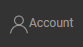

<h2> Inhoudsopgave </h2><ul><li> <a href="#Introduction">Invoering</a> </li><li> <a href="#How-to-upload-a-layer-with-custom-data">Een laag met aangepaste gegevens uploaden</a> </li><li> <a href="#How-to-display-an-uploaded-layer">Een geüploade laag weergeven</a> </li><li> <a href="#Offline-mode">Offline modus</a> </li><li> <a href="#Data-security-and-privacy">Gegevensbeveiliging en privacy</a> </li><li> <a href="#References">Referenties</a> </li><li> <a href="#How-to-cite">Hoe te citeren</a> </li><li> <a href="#Authors-and-reviewers">Auteurs en recensenten</a> </li><li> <a href="#Acknowledgement">Erkenning</a> </li></ul><h2> Invoering </h2>
 Met het platform kunt u enkele aangepaste gegevens van uw computer uploaden naar Hotmaps. Dit deel is nauw verbonden met de <a href="Data-export-functionalities">exportfunctie</a> , aangezien het uiteindelijke doel van die twee functies is om wat gegevens te exporteren, er iets aan te bewerken en het later in de toolbox te visualiseren door die gegevens terug te importeren. Houd er rekening mee dat uw geüploade gegevens alleen kunnen worden gevisualiseerd, er kunnen momenteel geen rekenmodules op worden uitgevoerd. 

 Voor deze bewerking <strong>is een gebruikersaccount vereist</strong> . De registratie- en inlogprocedures worden op de volgende pagina uitgelegd: <a href="Introduction-to-user-interface#Connect">Gebruikersaccount</a> . 

 Om een dataset probleemloos te uploaden. Gebruik eerst de <a href="Data-export-functionalities">exportfunctie</a> voor het gebied dat u wilt importeren (zie <a href="Data-export-functionalities">de</a> pagina <a href="Data-export-functionalities">Gegevensexport</a> ). 

<ins> <code><strong><a href="#table-of-contents">To Top</a></strong></code> </ins> 
<h2> Een laag met aangepaste gegevens uploaden </h2>
 Door op te drukken  knop in de linkerbovenhoek van de pagina. Dit zal de profielpagina naar voren brengen. 

 Op de profielpagina: 
<ol><li> selectie van het type gegevensset </li><li> selectie van te uploaden bestand (.tif of .csv) </li><li> upload door op het pictogram &quot;+&quot; te klikken </li></ol>

 De selectie van het type gegevensset wordt gebruikt om de juiste symbologie te krijgen. Als uw gegevensset niet overeenkomt met de symboliek van de laag, wordt deze niet correct weergegeven. 

 Zodra dit is gebeurd, wordt een succesbericht weergegeven en verschijnt de laag in de lijst met lagen op de profielpagina. 

 Elke gebruiker heeft een beperkte schijfruimte. Zodra de gebruiker onvoldoende vrije ruimte heeft, kan hij geen bestanden meer toevoegen. U kunt uw linkerruimte visualiseren met het cirkeldiagram in het veld Gebruikersschijfruimte. 

 Voordat de laag op de kaart kan worden weergegeven, heeft de server na het succesbericht enige tijd (tot enkele minuten) nodig om de gegevensset correct te importeren. De gegevensset kan worden weergegeven zodra de grootte niet langer 0 is. 

 De laag kan nu op de kaart worden weergegeven door deze op het lagenpaneel te activeren. 

<ins> <code><strong><a href="#table-of-contents">To Top</a></strong></code> </ins> 
<h2> Een geüploade laag weergeven </h2>
 Het is mogelijk om een laag weer te geven die eerder is geüpload vanuit het lagenpaneel door op te klikken  knop. 

 De lijst met geüploade lagen wordt weergegeven in het gedeelte &#39;Persoonlijke lagen&#39; bovenaan het linkervenster. 

 Een laag kan worden weergegeven door deze in het linkerpaneel te activeren. 

<ins> <code><strong><a href="#table-of-contents">To Top</a></strong></code> </ins> 
<h2> Offline modus </h2>
 Als u bent uitgelogd, hebt u geen toegang meer tot uw persoonlijke lagen, maar ze zijn nog steeds beschikbaar zodra u opnieuw inlogt. 

<ins> <code><strong><a href="#table-of-contents">To Top</a></strong></code> </ins> 
<h2> Gegevensbeveiliging en privacy </h2>
 Hotmaps-toolbox biedt beveiliging voor gebruikers die een account op het platform maken. Gebruikelijke beveiligingsmaatregelen zijn geïmplementeerd: HTTPS-protocol, hashen / salting van wachtwoorden enzovoort. Houd er echter rekening mee dat de geüploade gegevenssets momenteel niet worden gecodeerd wanneer ze op de server worden opgeslagen, dus vermijd het uploaden van gevoelige gegevens. 

<ins> <code><strong><a href="#table-of-contents">To Top</a></strong></code> </ins> 
<h2> Referenties </h2>
<ins> <code><strong><a href="#table-of-contents">To Top</a></strong></code> </ins> 
<h2> Hoe te citeren </h2>
<ins> <code><strong><a href="#table-of-contents">To Top</a></strong></code> </ins> 
<h2> Auteurs en recensenten </h2>
 auteurs: 
<ul><li> Daniel Hunacek </li><li> Lucien Zuber </li></ul>
 reviewers: 

<ins> <code><strong><a href="#table-of-contents">To Top</a></strong></code> </ins> 
<h2> Erkenning </h2>
 We willen graag onze grote waardering <a href="https://www.hotmaps-project.eu">uitspreken</a> voor het Horizon 2020 <a href="https://www.hotmaps-project.eu">Hotmaps-project</a> (subsidieovereenkomst nummer 723677), dat de financiering heeft verstrekt voor het uitvoeren van dit onderzoek 

<ins> <code><strong><a href="#table-of-contents">To Top</a></strong></code> </ins> 

This page was automatically translated. View in another language:

[English](en-Data-upload-functionalities) (original) [Bulgarian](bg-Data-upload-functionalities)\* [Croatian](hr-Data-upload-functionalities)\* [Czech](cs-Data-upload-functionalities)\* [Danish](da-Data-upload-functionalities)\*  [Estonian](et-Data-upload-functionalities)\* [Finnish](fi-Data-upload-functionalities)\* [French](fr-Data-upload-functionalities)\* [German](de-Data-upload-functionalities)\* [Greek](el-Data-upload-functionalities)\* [Hungarian](hu-Data-upload-functionalities)\* [Irish](ga-Data-upload-functionalities)\* [Italian](it-Data-upload-functionalities)\* [Latvian](lv-Data-upload-functionalities)\* [Lithuanian](lt-Data-upload-functionalities)\* [Maltese](mt-Data-upload-functionalities)\* [Polish](pl-Data-upload-functionalities)\* [Portuguese (Portugal, Brazil)](pt-Data-upload-functionalities)\* [Romanian](ro-Data-upload-functionalities)\* [Slovak](sk-Data-upload-functionalities)\* [Slovenian](sl-Data-upload-functionalities)\* [Spanish](es-Data-upload-functionalities)\* [Swedish](sv-Data-upload-functionalities)\* 

\*: machine translated
