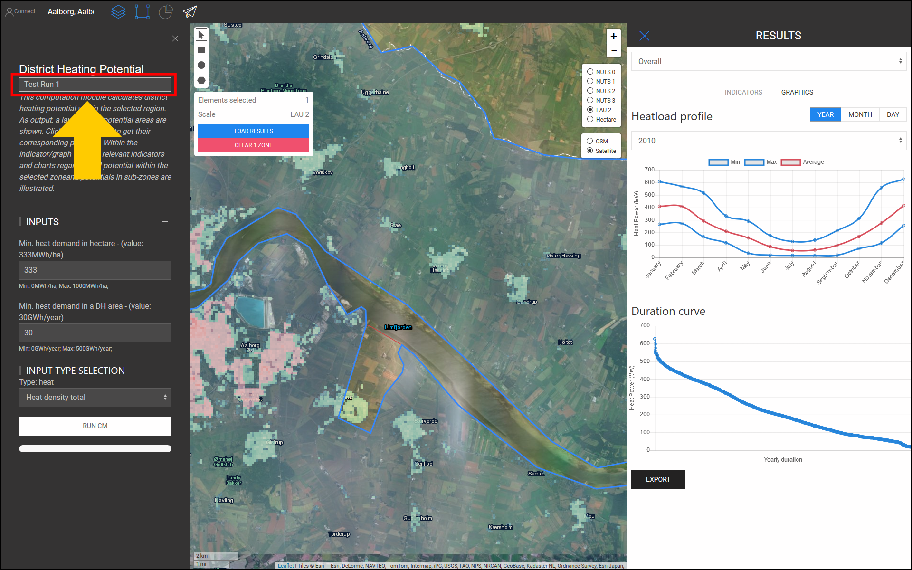

<h1><a class="anchor" id="cm-district-heating-potential-areas-user-defined-thresholds" href="#cm-district-heating-potential-areas-user-defined-thresholds"><i class="fa fa-link"></i></a>CM Stadsverwarming potentiële gebieden door de gebruiker gedefinieerde drempels</h1><h2><a class="anchor" id="table-of-contents" href="#table-of-contents"><i class="fa fa-link"></i></a> Inhoudsopgave</h2><ul><li> <a href="#in-a-glance">In een oogopslag</a></li><li> <a href="#introduction">Invoering</a></li><li> <a href="#inputs-and-outputs">Ingangen en uitgangen</a></li><li> <a href="#method">Methode</a></li><li> <a href="#github-repository-of-this-calculation-module">GitHub repository van deze rekenmodule</a></li><li> <a href="#sample-run">Voorbeeldrun</a><ul><li> <a href="#sample-run_test-run-1-default-input-values">Testrun 1: standaard invoerwaarden</a></li><li> <a href="#sample-run_test-run-2-modified-input-values">Testrun 2: gewijzigde invoerwaarden</a></li></ul></li><li> <a href="#how-to-cite">Hoe te citeren</a></li><li> <a href="#authors-and-reviewers">Auteurs en recensenten</a></li><li> <a href="#license">Licentie</a></li><li> <a href="#acknowledgement">Erkenning</a></li></ul><h2><a class="anchor" id="in-a-glance" href="#in-a-glance"><i class="fa fa-link"></i></a> In een oogopslag</h2>
 Deze rekenmodule berekent het stadsverwarmingspotentieel binnen de geselecteerde regio aan de hand van 2 drempelwaarden: 1) Minimale warmtevraag per hectare, 2) Minimale warmtevraag in een DH-gebied. Gebieden binnen de geselecteerde regio die aan deze voorwaarden voldoen, worden geretourneerd als DH-gebieden. Bovendien wordt de warmtevraag in deze regio&#39;s geretourneerd in de vorm van indicatoren als DH-potentieel.

 <a href="#table-of-contents"><strong><code>To Top</code></strong></a>
<h2><a class="anchor" id="introduction" href="#introduction"><i class="fa fa-link"></i></a> Invoering</h2>
 De warmtevraag speelt een belangrijke rol bij het bepalen van potentiële stadsverwarmingsgebieden (DH). De implementatie van stadsverwarming in gebieden met een lage warmtevraag is bijvoorbeeld economisch niet haalbaar. Aan de andere kant kan het ook onnauwkeurig zijn om een gebied met een hoge warmtevraagdichtheid te definiëren als een potentieel DH-gebied. Een hoge warmtevraagdichtheid in een gebied kan het gevolg zijn van de aanwezigheid van een paar afnemers met een zeer hoge warmtevraag binnen dat gebied. Integendeel, een lage gemiddelde warmtevraagdichtheid kan een teken zijn van zones met een zeer lage warmtevraag binnen het geselecteerde gebied. Het doel van de rekenmodule &quot;CM - GEBIED VERWARMINGSPOTENTIEEL: DOOR GEBRUIKER GEDEFINIEERDE DREMPEL&quot; is om een redelijk evenwicht te bieden tussen de dichtheid van de warmtevraag in een gebied en zijn samenstellende zones.

 Het &quot;CM - GEBIED VERWARMINGSPOTENTIEEL GEBIED: DOOR DE GEBRUIKER GEDEFINIEERDE DREMPEL&quot; bepaalt de DH-gebieden en hun corresponderende DH-potentiaal op basis van de dichtheden van de warmtevraag. De dichtheden van de warmtevraag worden verkregen uit een input GIS-laag. De toolbox en database van Hotmaps bieden een <strong><a href="https://gitlab.com/hotmaps/heat/heat_tot_curr_density">standaard warmtedichtheidskaart</a></strong> die in deze rekenmodule kan worden gebruikt. De warmtedichtheidskaart van Hotmaps is in rasterformaat en heeft een resolutie van één hectare en een coördinatenreferentiesysteem (CRS) van &quot; <em><em>ETRS89 / LAEA Europe - EPSG 3035</em></em> &quot;. De cellen op de kaart tonen de warmtedichtheden in <em><strong>MWh / ha</strong></em> . Naast deze standaardkaart kunnen ook door de gebruiker gegenereerde kaarten worden geüpload naar de toolbox en in deze CM worden gebruikt.

 Als output worden één GIS-laag, drie indicatoren en twee diagrammen gepresenteerd. Deze outputs worden in detail uitgelegd in de sectie <a href="#sample-run">Sample Run</a> . De outputlaag toont de potentiële DH-gebieden. Door op elk gebied op de kaart te klikken, verschijnt een venster en wordt het DH-potentieel dat overeenkomt met dat gebied weergegeven. Binnen de INDICATORS / GRAPHICS-vensters in de RESULTATEN-sectie van de toolbox worden relevante indicatoren en grafieken met betrekking tot DH-potentiaal binnen de geselecteerde zone en potentialen in subzones geïllustreerd.

 <a href="#table-of-contents"><strong><code>To Top</code></strong></a>
<h2><a class="anchor" id="inputs-and-outputs" href="#inputs-and-outputs"><i class="fa fa-link"></i></a> Ingangen en uitgangen</h2>
 De invoerparameters en lagen, evenals uitvoerlagen en parameters, zijn als volgt.

 <strong>Invoerlagen en parameters zijn:</strong>
<ul><li> Minimale warmtevraag per hectare [ <em><strong>MWh / ha</strong></em> ]: een waarde tussen <em><em>0</em></em> en <em><em>1000</em></em></li><li> Minimale warmtevraag in een DH-zone [ <em><strong>GWh / jaar</strong></em> ]: een waarde tussen <em><em>0</em></em> en <em><em>500</em></em></li><li> Warmtedichtheidskaart: een standaardkaart is voorzien in de toolbox; eigen geüploade kaarten kunnen ook in de CM worden gebruikt<ul><li> in rasterformaat (* .tif)</li><li> met een resolutie van 1 hectare</li><li> vraagdichtheden in <em><strong>MWh / ha</strong></em></li></ul></li></ul>
 <strong>Uitvoerlagen en parameters zijn:</strong>
<ul><li> DH-gebieden in raster- en shapefile-indelingen</li><li> DH-potentieel in elk DH-gebied [ <em><strong>GWh / jaar</strong></em> ] (klik op de kaart)</li><li> Totale warmtevraag in GWh binnen de geselecteerde zone</li><li> Totaal potentieel voor stadsverwarming in GWh binnen de geselecteerde zone</li><li> Potentieel aandeel stadsverwarming ten opzichte van de totale vraag in de geselecteerde zone</li></ul>
 <a href="#table-of-contents"><strong><code>To Top</code></strong></a>
<h2><a class="anchor" id="method" href="#method"><i class="fa fa-link"></i></a> Methode</h2>
 Het potentieel voor DH in een specifieke regio kan worden bepaald door de totale warmtevraag en de ruimtelijke toewijzing ervan. In de toolbox Hotmaps wordt de warmtevraag weergegeven in de vorm van een rasterkaart. Om potentiële DH-gebieden goed te definiëren, moet zowel de warmtevraag in elke cel als in een gebied een bepaald niveau bereiken. Om te beginnen stelt de Hotmaps-toolbox standaardwaarden voor deze twee parameters voor. Afhankelijk van de verdeling van de warmtevraag en ook de lokale omstandigheden kan de Hotmaps-gebruiker deze waarden wijzigen.

 Het bepalen van DH-gebieden gebeurt in twee stappen:

 In de eerste stap worden alle cellen met warmtevraag onder de ingangsparameter &quot;Minimale warmtevraag in hectare&quot; gefilterd. Door deze cellen van de kaart te verwijderen, krijgen we groepen cellen die aan elkaar vastzitten. Elk stel van deze aangehechte cellen vormt kleine zones die hier &quot;coherente gebieden&quot; worden genoemd. In de tweede stappen wordt de totale warmtevraag in elk samenhangend gebied berekend. Als de totale warmtevraag voor elk samenhangend gebied hoger is dan de ingangsparameter &quot;Minimale warmtevraag in een DH-zone&quot;, wordt deze beschouwd als een potentiële DH-zone.

 Ten slotte wordt voor de DH-gebieden het potentieel berekend en gepresenteerd in de vorm van een GIS-laag, die te zien is in de toolbox.

 <a href="#table-of-contents"><strong><code>To Top</code></strong></a>
<h2><a class="anchor" id="github-repository-of-this-calculation-module" href="#github-repository-of-this-calculation-module"><i class="fa fa-link"></i></a> GitHub repository van deze rekenmodule</h2>
 <a href="https://github.com/HotMaps/dh_potential/tree/develop">Hier</a> krijg je de meest geavanceerde ontwikkeling voor deze rekenmodule.

 <a href="#table-of-contents"><strong><code>To Top</code></strong></a>
<h2><a class="anchor" id="sample-run" href="#sample-run"><i class="fa fa-link"></i></a> Voorbeeldrun</h2>
 Hier wordt de rekenmodule gedraaid voor de case study van Aalborg in Denemarken.
<ul><li> Gebruik eerst de &quot;Go To Place&quot; -balk om naar Aalborg te navigeren en de stad te selecteren.</li></ul><ul><li>
 Volg de stappen zoals weergegeven in de onderstaande afbeelding:
<ul><li> Klik op de &quot;Lagen&quot; knop om het &quot;Lagen&quot; venster te openen:</li><li> Klik op het tabblad &quot;CALCULATION MODULES&quot;.</li><li> Klik op de knop &quot;CM-DISTRICT VERWARMINGSPOTENTIËLE GEBIEDEN: DOOR GEBRUIKER GEDEFINIEERDE DREMPELS&quot;.</li></ul></li><li>
 Nu wordt de rekenmodule &quot;CM-DISTRICT VERWARMINGSPOTENTIËLE GEBIEDEN: DOOR GEBRUIKER GEDEFINIEERDE DREMPELS&quot; geopend en is klaar voor gebruik.
</li></ul>
 <a href="#table-of-contents"><strong><code>To Top</code></strong></a>
<h3><a class="anchor" id="test-run-1--default-input-values" href="#test-run-1--default-input-values"><i class="fa fa-link"></i></a> Testrun 1: standaard invoerwaarden</h3>
 De standaard invoerwaarden tonen de algemene voorwaarden waaronder een gebied kan worden beschouwd als een potentieel DH-gebied. Deze waarden dienen alleen als uitgangspunt te worden beschouwd. Mogelijk moet u waarden instellen onder of boven de standaardwaarden in de toolbox, rekening houdend met aanvullende lokale omstandigheden. Daarom moet de gebruiker deze waarden aanpassen om de beste combinatie van drempels voor zijn of haar casestudy te vinden.

 Volg de volgende stappen om de rekenmodule uit te voeren:
<ul><li> Wijs een naam toe aan de run-sessie (optioneel - hier kozen we &quot;Test Run 1&quot;) en stel de invoerparameters in (hier werden standaardwaarden gebruikt).</li></ul><ul><li> Druk op de knop &quot;RUN CM&quot; linksonder.</li><li> Wacht tot het proces is voltooid.</li></ul>
 <strong><code>Note: If you wish to change your input parameters, you can press &quot;STOP CM&quot;, modify your input parameters and re-run the CM</code></strong>
<ul><li> Als output worden indicatoren en diagrammen getoond in de sectie &quot;RESULTATEN&quot; aan de rechterkant van de toolbox. De indicatoren tonen:<ul><li> de totale warmtevraag in <em><em>GWh</em></em> binnen de geselecteerde zone,</li><li> totaal DH-potentieel in <em><em>GWh</em></em> binnen de geselecteerde zone,</li><li> het aandeel van het DH-potentieel van de totale vraag, dat wordt verkregen door het DH-potentieel te delen door de totale warmtevraag in de regio.</li></ul></li></ul>
 Daarnaast worden ook twee diagrammen gegenereerd. De eerste toont het DH-potentieel in elk DH-gebied. De bijbehorende labels zijn ook op de kaart te vinden. Het tweede diagram illustreert het totale DH-potentieel in vergelijking met de totale warmtevraag in het geselecteerde gebied.
<ul><li> Er is ook een nieuwe laag toegevoegd aan het canvas met DH-gebieden. Deze laag wordt toegevoegd aan de lijst met lagen onder de categorie &quot;Berekeningsmodule&quot; helemaal onderaan de sectie met lagen. De naam van de run-sessie onderscheidt de outputs van deze run van andere.</li></ul>
 Door deze stappen te volgen krijgt u een indruk van de invoerwaarden en mogelijke DH-gebieden.

 <a href="#table-of-contents"><strong><code>To Top</code></strong></a>
<h3><a class="anchor" id="test-run-2--modified-input-values" href="#test-run-2--modified-input-values"><i class="fa fa-link"></i></a> Testrun 2: gewijzigde invoerwaarden</h3>
 Afhankelijk van uw ervaring en lokale kennis, kunt u de invoerwaarden verhogen of verlagen om betere resultaten te verkrijgen. In het geval van Aalborg weet u bijvoorbeeld misschien dat de warmtevraag in buitenstedelijke gebieden relatief dicht bij het centrale deel van de stad ligt en dat DH-systeem ook in die gebieden haalbaar is. Daarom kunt u besluiten om de minimale warmtevraag in cellen die deel uitmaken van een DH-gebied te verlagen; Om voldoende warmtevraag te garanderen, kunt u de minimale warmtevraag in een DH-gebied echter verhogen. Hier voer je de rekenmodules opnieuw uit met nieuwe invoerparameters.
<ul><li> Geef de run-sessie een naam (optioneel - hier kozen we voor &quot;Test Run 2&quot;) en stel de inputparameters in ( <em><em>250 MWh / ha</em></em> voor min. Warmtevraag in hectare en <em><em>35 GWh / jaar</em></em> voor de minimale vraag in DH-gebied) .</li></ul><ul><li> Druk op de knop &quot;RUN CM&quot; linksonder.</li><li> Wacht tot het proces is voltooid.</li><li> Als output worden indicatoren en diagrammen getoond in de sectie &quot;RESULTATEN&quot; aan de rechterkant van de toolbox. De indicatoren tonen:<ul><li> de totale warmtevraag in <em><em>GWh</em></em> binnen de geselecteerde zone,</li><li> totaal DH-potentieel in <em><em>GWh</em></em> binnen de geselecteerde zone,</li><li> het aandeel van het DH-potentieel van de totale vraag, dat wordt verkregen door het DH-potentieel te delen door de totale warmtevraag in de regio.</li></ul></li></ul>
 Daarnaast worden ook twee diagrammen gegenereerd. De eerste toont het DH-potentieel in elk DH-gebied. De bijbehorende labels zijn ook op de kaart te vinden. Het tweede diagram illustreert het totale DH-potentieel in vergelijking met de totale warmtevraag in het geselecteerde gebied.
<ul><li> Er is ook een nieuwe laag toegevoegd aan het canvas met DH-gebieden. Deze laag wordt toegevoegd aan de lijst met lagen onder de categorie &quot;Berekeningsmodule&quot;. De naam van de run-sessie onderscheidt de outputs van deze run van andere.</li></ul>
 <a href="#table-of-contents"><strong><code>To Top</code></strong></a>
<h2><a class="anchor" id="how-to-cite" href="#how-to-cite"><i class="fa fa-link"></i></a> Hoe te citeren</h2>
 Mostafa Fallahnejad, in Hotmaps-Wiki, CM-Stadsverwarmingspotentieel-gebieden: door gebruiker gedefinieerde-drempels (april 2019)

 <a href="#table-of-contents"><strong><code>To Top</code></strong></a>
<h2><a class="anchor" id="authors-and-reviewers" href="#authors-and-reviewers"><i class="fa fa-link"></i></a> Auteurs en recensenten</h2>
 Deze pagina is geschreven door Mostafa Fallahnejad ( <strong><a href="https://eeg.tuwien.ac.at/">EEG - TU Wien</a></strong> ).

 ☑ Deze pagina is beoordeeld door Marcul Hummel ( <strong><a href="https://e-think.ac.at">e-think</a></strong> ).

 <a href="#table-of-contents"><strong><code>To Top</code></strong></a>
<h2><a class="anchor" id="license" href="#license"><i class="fa fa-link"></i></a> Licentie</h2>
 Auteursrecht © 2016-2020: Mostafa Fallahnejad

 Creative Commons Attribution 4.0 Internationale licentie

 Dit werk is gelicentieerd onder een Creative Commons CC BY 4.0 internationale licentie.

 SPDX-licentie-ID: CC-BY-4.0

 Licentie-tekst: https://spdx.org/licenses/CC-BY-4.0.html

 <a href="#table-of-contents"><strong><code>To Top</code></strong></a>
<h2><a class="anchor" id="acknowledgement" href="#acknowledgement"><i class="fa fa-link"></i></a> Erkenning</h2>
 We willen onze diepste waardering <a href="https://www.hotmaps-project.eu">uitspreken</a> voor het Horizon 2020 <a href="https://www.hotmaps-project.eu">Hotmaps-project</a> (subsidieovereenkomst nummer 723677), dat de financiering heeft verstrekt om het huidige onderzoek uit te voeren.

 <a href="#table-of-contents"><strong><code>To Top</code></strong></a>

<!--- THIS IS A SUPER UNIQUE IDENTIFIER -->

This page was automatically translated. View in another language:

[English](../en/CM-District-heating-potential-areas-user-defined-thresholds) (original) [Bulgarian](../bg/CM-District-heating-potential-areas-user-defined-thresholds)\* [Czech](../cs/CM-District-heating-potential-areas-user-defined-thresholds)\* [Danish](../da/CM-District-heating-potential-areas-user-defined-thresholds)\* [German](../de/CM-District-heating-potential-areas-user-defined-thresholds)\* [Greek](../el/CM-District-heating-potential-areas-user-defined-thresholds)\* [Spanish](../es/CM-District-heating-potential-areas-user-defined-thresholds)\* [Estonian](../et/CM-District-heating-potential-areas-user-defined-thresholds)\* [Finnish](../fi/CM-District-heating-potential-areas-user-defined-thresholds)\* [French](../fr/CM-District-heating-potential-areas-user-defined-thresholds)\* [Irish](../ga/CM-District-heating-potential-areas-user-defined-thresholds)\* [Croatian](../hr/CM-District-heating-potential-areas-user-defined-thresholds)\* [Hungarian](../hu/CM-District-heating-potential-areas-user-defined-thresholds)\* [Italian](../it/CM-District-heating-potential-areas-user-defined-thresholds)\* [Lithuanian](../lt/CM-District-heating-potential-areas-user-defined-thresholds)\* [Latvian](../lv/CM-District-heating-potential-areas-user-defined-thresholds)\* [Maltese](../mt/CM-District-heating-potential-areas-user-defined-thresholds)\*  [Polish](../pl/CM-District-heating-potential-areas-user-defined-thresholds)\* [Portuguese (Portugal, Brazil)](../pt/CM-District-heating-potential-areas-user-defined-thresholds)\* [Romanian](../ro/CM-District-heating-potential-areas-user-defined-thresholds)\* [Slovak](../sk/CM-District-heating-potential-areas-user-defined-thresholds)\* [Slovenian](../sl/CM-District-heating-potential-areas-user-defined-thresholds)\* [Swedish](../sv/CM-District-heating-potential-areas-user-defined-thresholds)\* 

\* machine translated
