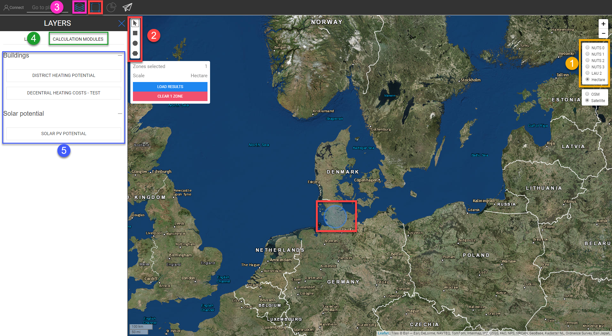
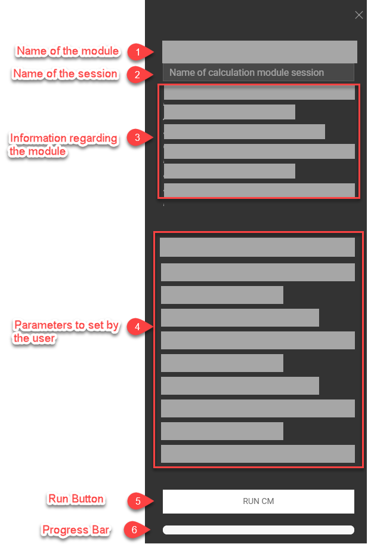

<h1><a class="anchor" id="access-to-calculation-modules" href="#access-to-calculation-modules"><i class="fa fa-link"></i></a>Dostęp do modułów obliczeniowych</h1><h2><a class="anchor" id="table-of-contents" href="#table-of-contents"><i class="fa fa-link"></i></a> Spis treści</h2><ul><li> <a href="#introduction">Wprowadzenie</a></li><li> <a href="#structure-of-a-calculation-module">Struktura modułu obliczeniowego</a></li><li> <a href="#list-of-calculation-modules">Lista modułów obliczeniowych</a></li><li> <a href="#how-to-cite">Jak cytować</a></li><li> <a href="#authors-and-reviewers">Autorzy i recenzenci</a></li><li> <a href="#license">Licencja</a></li><li> <a href="#acknowledgement">Potwierdzenie</a></li></ul><h2><a class="anchor" id="introduction" href="#introduction"><i class="fa fa-link"></i></a> Wprowadzenie</h2>
 W następnym rozdziale opiszemy, jak uzyskać dostęp do modułu obliczeniowego

 <strong>Kroki, aby uzyskać dostęp do modułu obliczeniowego</strong>

 <strong>Kroki:</strong>
<ol><li> Zdefiniuj skalę terytorialną</li><li> Wybierz region</li><li> Włącz sekcję warstw</li><li> Przejdź do <code>Calculation Modules</code></li><li> Uzyskaj dostęp do wybranego modułu</li><li> Zdefiniuj parametry, nadaj nazwę przebiegu i uruchom moduł</li><li> wyniki są wyświetlane na pasku wyników i na mapie</li></ol>

<h2><a class="anchor" id="structure-of-a-calculation-module" href="#structure-of-a-calculation-module"><i class="fa fa-link"></i></a> Struktura modułu obliczeniowego</h2>
 Poniższy rysunek przedstawia strukturę modułu obliczeniowego

<h2><a class="anchor" id="list-of-calculation-modules" href="#list-of-calculation-modules"><i class="fa fa-link"></i></a> Lista modułów obliczeniowych</h2>
 Poniżej widać aktualnie dostępne moduły. W dolnej części wymienione są samodzielne moduły obliczeniowe. Każdy z nich ma link do swojej dedykowanej strony wiki lub oddzielnej wiki i do swojego repozytorium, ponieważ nie są one integralną częścią zestawu narzędzi Hotmaps.
<h2><a class="anchor" id="how-to-cite" href="#how-to-cite"><i class="fa fa-link"></i></a> Jak cytować</h2>
 Jeton Hasani, w Hotmaps-Wiki, dostęp do modułów obliczeniowych (kwiecień 2019)
<h2><a class="anchor" id="authors-and-reviewers" href="#authors-and-reviewers"><i class="fa fa-link"></i></a> Autorzy i recenzenci</h2>
 Ta strona została napisana przez Jetona Hasaniego <strong><a href="https://eeg.tuwien.ac.at/">EEG - TU Wien</a></strong> .

 ☑ Ta strona została sprawdzona przez Mostafa Fallahnejad.

 <a href="#table-of-contents"><strong><code>To Top</code></strong></a>
<h2><a class="anchor" id="license" href="#license"><i class="fa fa-link"></i></a> Licencja</h2>
 Prawa autorskie © 2016-2020: Jeton Hasani

 Licencja międzynarodowa Creative Commons Attribution 4.0

 Ta praca jest objęta licencją Creative Commons CC BY 4.0 International License.

 Identyfikator licencji SPDX: CC-BY-4.0

 Tekst licencji: https://spdx.org/licenses/CC-BY-4.0.html

 <a href="#table-of-contents"><strong><code>To Top</code></strong></a>
<h2><a class="anchor" id="acknowledgement" href="#acknowledgement"><i class="fa fa-link"></i></a> Potwierdzenie</h2>
 Chcielibyśmy wyrazić nasze najgłębsze uznanie dla <a href="https://www.hotmaps-project.eu">projektu Hotmaps</a> programu „Horyzont 2020 <a href="https://www.hotmaps-project.eu">”</a> (umowa o udzielenie dotacji nr 723677), który zapewnił fundusze na przeprowadzenie obecnego dochodzenia.

 <a href="#table-of-contents"><strong><code>To Top</code></strong></a>

<!--- THIS IS A SUPER UNIQUE IDENTIFIER -->

This page was automatically translated. View in another language:

[English](../en/Access-to-calculation-modules) (original) [Bulgarian](../bg/Access-to-calculation-modules)\* [Czech](../cs/Access-to-calculation-modules)\* [Danish](../da/Access-to-calculation-modules)\* [German](../de/Access-to-calculation-modules)\* [Greek](../el/Access-to-calculation-modules)\* [Spanish](../es/Access-to-calculation-modules)\* [Estonian](../et/Access-to-calculation-modules)\* [Finnish](../fi/Access-to-calculation-modules)\* [French](../fr/Access-to-calculation-modules)\* [Irish](../ga/Access-to-calculation-modules)\* [Croatian](../hr/Access-to-calculation-modules)\* [Hungarian](../hu/Access-to-calculation-modules)\* [Italian](../it/Access-to-calculation-modules)\* [Lithuanian](../lt/Access-to-calculation-modules)\* [Latvian](../lv/Access-to-calculation-modules)\* [Maltese](../mt/Access-to-calculation-modules)\* [Dutch](../nl/Access-to-calculation-modules)\*  [Portuguese (Portugal, Brazil)](../pt/Access-to-calculation-modules)\* [Romanian](../ro/Access-to-calculation-modules)\* [Slovak](../sk/Access-to-calculation-modules)\* [Slovenian](../sl/Access-to-calculation-modules)\* [Swedish](../sv/Access-to-calculation-modules)\* 

\* machine translated
