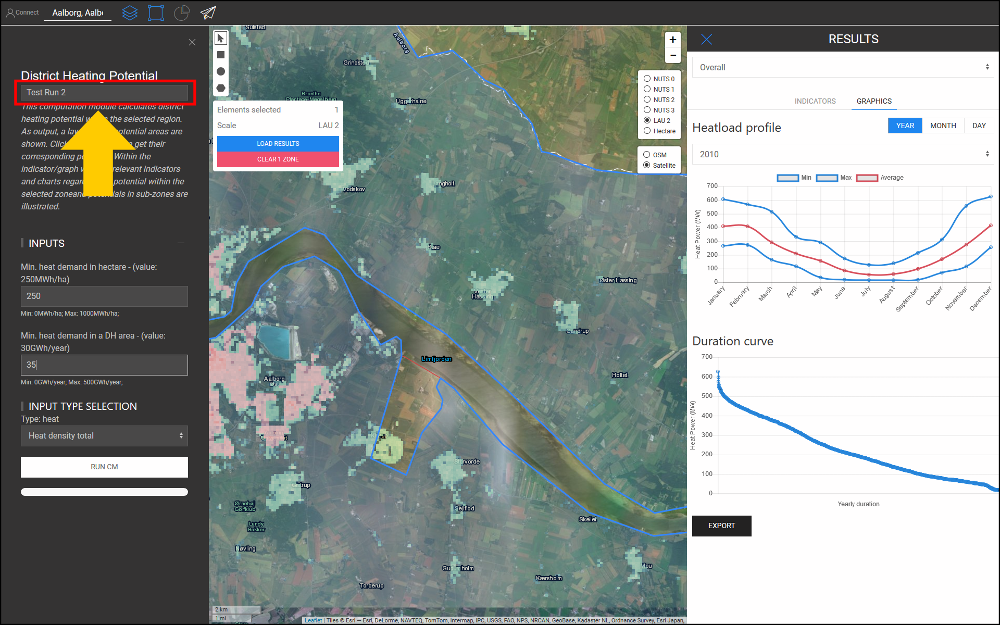

<h1><a class="anchor" id="cm-district-heating-potential-areas-user-defined-thresholds" href="#cm-district-heating-potential-areas-user-defined-thresholds"><i class="fa fa-link"></i></a>CM Potencjalne obszary ciepłownictwa określone przez użytkownika</h1><h2><a class="anchor" id="table-of-contents" href="#table-of-contents"><i class="fa fa-link"></i></a> Spis treści</h2><ul><li> <a href="#in-a-glance">W skrócie</a></li><li> <a href="#introduction">Wprowadzenie</a></li><li> <a href="#inputs-and-outputs">Wejścia i wyjścia</a></li><li> <a href="#method">metoda</a></li><li> <a href="#github-repository-of-this-calculation-module">Repozytorium GitHub tego modułu obliczeniowego</a></li><li> <a href="#sample-run">Próbny przebieg</a><ul><li> <a href="#sample-run_test-run-1-default-input-values">Uruchomienie testowe 1: domyślne wartości wejściowe</a></li><li> <a href="#sample-run_test-run-2-modified-input-values">Uruchomienie testowe 2: zmodyfikowane wartości wejściowe</a></li></ul></li><li> <a href="#how-to-cite">Jak cytować</a></li><li> <a href="#authors-and-reviewers">Autorzy i recenzenci</a></li><li> <a href="#license">Licencja</a></li><li> <a href="#acknowledgement">Potwierdzenie</a></li></ul><h2><a class="anchor" id="in-a-glance" href="#in-a-glance"><i class="fa fa-link"></i></a> W skrócie</h2>
 Ten moduł obliczeniowy oblicza potencjał ciepłowniczy w wybranym regionie przy użyciu 2 wartości progowych: 1) Minimalne zapotrzebowanie na ciepło na każdym hektarze, 2) Minimalne zapotrzebowanie na ciepło w obszarze ciepłowniczym. Obszary w wybranym regionie, które spełniają te warunki, są zwracane jako obszary ciepłownicze. Ponadto zapotrzebowanie na ciepło w tych regionach jest zwracane w postaci wskaźników jako potencjał ciepłowniczy.

 <a href="#table-of-contents"><strong><code>To Top</code></strong></a>
<h2><a class="anchor" id="introduction" href="#introduction"><i class="fa fa-link"></i></a> Wprowadzenie</h2>
 Zapotrzebowanie na ciepło odgrywa ważną rolę w określaniu potencjalnych obszarów ciepłowniczych (ciepłowniczych). Na przykład wdrażanie ciepłownictwa na obszarach o niskim zapotrzebowaniu na ciepło nie jest ekonomicznie opłacalne. Z drugiej strony określenie dowolnego obszaru o dużej gęstości zapotrzebowania na ciepło jako potencjalnego obszaru ciepłowniczego może być również niedokładne. Wysoka gęstość zapotrzebowania na ciepło na danym obszarze może wynikać z obecności kilku odbiorców o bardzo dużym zapotrzebowaniu na ciepło na tym obszarze. Wręcz przeciwnie, niska średnia gęstość zapotrzebowania na ciepło może być oznaką stref o bardzo niskim zapotrzebowaniu na ciepło na wybranym obszarze. Zadaniem modułu obliczeniowego „CM - POWIERZCHNIA POTENCJALNA GRZEWCZEGO POWIERZCHNI: PRÓG ZDEFINIOWANY PRZEZ UŻYTKOWNIKA” jest zapewnienie rozsądnej równowagi pomiędzy gęstością zapotrzebowania na ciepło na danym obszarze i jego strefami.

 „CM - POWIERZCHNIA POTENCJALNA OBSZARU CIEPLNEGO: PRÓG ZDEFINIOWANY PRZEZ UŻYTKOWNIKA” określa obszary ciepłownicze i odpowiadający im potencjał ciepłowniczy na podstawie gęstości zapotrzebowania na ciepło. Gęstości zapotrzebowania na ciepło uzyskuje się z wejściowej warstwy GIS. Przybornik i baza danych Hotmaps zawiera <strong><a href="https://gitlab.com/hotmaps/heat/heat_tot_curr_density">domyślną mapę gęstości ciepła,</a></strong> której można użyć w tym module obliczeniowym. Mapa gęstości ciepła Hotmaps jest w formacie rastrowym i ma rozdzielczość jednego hektara i system odniesienia za pomocą współrzędnych (CRS) „ <em><em>ETRS89 / LAEA Europa - EPSG 3035</em></em> ”. Komórki na mapie pokazują gęstości ciepła w <em><strong>MWh / ha</strong></em> . Oprócz tej domyślnej mapy również mapy wygenerowane przez użytkownika można załadować do przybornika i wykorzystać w tym CM.

 Jako wynik przedstawiono jedną warstwę GIS, trzy wskaźniki i dwa wykresy. Te dane wyjściowe są szczegółowo wyjaśnione w sekcji <a href="#sample-run">Uruchomienie próbki</a> . Warstwa wyjściowa przedstawia potencjalne obszary ciepłownicze. Kliknięcie każdego obszaru na mapie powoduje wyświetlenie okna i pokazanie potencjału ciepłowniczego odpowiadającego temu obszarowi. W oknach WSKAŹNIKI / GRAFIKA w sekcji WYNIKI w przyborniku zilustrowane są odpowiednie wskaźniki i wykresy dotyczące potencjału ciepłowniczego w wybranej strefie oraz potencjałów w podstrefach.

 <a href="#table-of-contents"><strong><code>To Top</code></strong></a>
<h2><a class="anchor" id="inputs-and-outputs" href="#inputs-and-outputs"><i class="fa fa-link"></i></a> Wejścia i wyjścia</h2>
 Parametry i warstwy wejściowe, a także warstwy i parametry wyjściowe są następujące.

 <strong>Warstwy i parametry wejściowe to:</strong>
<ul><li> Minimalne zapotrzebowanie na ciepło w każdym hektarze [ <em><strong>MWh / ha</strong></em> ]: wartość między <em><em>0</em></em> a <em><em>1000</em></em></li><li> Minimalne zapotrzebowanie na ciepło w obszarze ciepłowniczym [ <em><strong>GWh / rok</strong></em> ]: wartość między <em><em>0</em></em> a <em><em>500</em></em></li><li> Mapa gęstości ciepła: domyślna mapa znajduje się w przyborniku; własne przesłane mapy mogą być również używane w CM<ul><li> w formacie rastrowym (* .tif)</li><li> z rozdzielczością 1 hektara</li><li> gęstości zapotrzebowania w <em><strong>MWh / ha</strong></em></li></ul></li></ul>
 <strong>Warstwy wyjściowe i parametry to:</strong>
<ul><li> Obszary DH w formatach rastrowych i shapefile</li><li> Potencjał ciepłowniczy w każdym obszarze <em><strong>ciepłowniczym</strong></em> [ <em><strong>GWh / rok</strong></em> ] (kliknij na mapę)</li><li> Całkowite zapotrzebowanie na ciepło w GWh w wybranej strefie</li><li> Całkowity potencjał ciepłowniczy w GWh w wybranej strefie</li><li> Potencjalny udział ciepła sieciowego w całkowitym zapotrzebowaniu w wybranej strefie</li></ul>
 <a href="#table-of-contents"><strong><code>To Top</code></strong></a>
<h2><a class="anchor" id="method" href="#method"><i class="fa fa-link"></i></a> metoda</h2>
 Potencjał ciepłownictwa w określonym regionie można zdefiniować na podstawie całkowitego zapotrzebowania na ciepło i jego przestrzennego przydziału. W przyborniku Hotmaps zapotrzebowanie na ciepło jest przedstawiane w postaci mapy rastrowej. Aby prawidłowo zdefiniować potencjalne obszary ciepłownicze, zarówno zapotrzebowanie na ciepło w każdej komórce, jak i na danym obszarze powinno osiągnąć określony poziom. Na początek przybornik Hotmaps sugeruje domyślne wartości tych dwóch parametrów. Jednak w zależności od rozkładu zapotrzebowania na ciepło, a także warunków lokalnych, użytkownik Hotmaps może modyfikować te wartości.

 Wyznaczanie obszarów DH odbywa się w dwóch etapach:

 W pierwszym etapie filtrowane są wszystkie ogniwa z zapotrzebowaniem na ciepło poniżej parametru wejściowego „Minimalne zapotrzebowanie na ciepło w hektarach”. Eliminując te komórki z mapy, otrzymujemy grupy komórek, które są ze sobą połączone. Każdy zestaw tych przyczepionych komórek tworzy małe strefy, które tutaj nazywane są „obszarami spójnymi”. W drugim kroku obliczane jest całkowite zapotrzebowanie na ciepło w każdym spójnym obszarze. Dla każdego obszaru koherentnego, jeśli całkowite zapotrzebowanie na ciepło jest wyższe niż parametr wejściowy „Minimalne zapotrzebowanie na ciepło w obszarze ciepłowniczym”, jest ono traktowane jako potencjalny obszar ciepłowniczy.

 Wreszcie, dla obszarów ciepłowniczych, potencjał jest obliczany i przedstawiany w postaci warstwy GIS, którą można zobaczyć w przyborniku.

 <a href="#table-of-contents"><strong><code>To Top</code></strong></a>
<h2><a class="anchor" id="github-repository-of-this-calculation-module" href="#github-repository-of-this-calculation-module"><i class="fa fa-link"></i></a> Repozytorium GitHub tego modułu obliczeniowego</h2>
 <a href="https://github.com/HotMaps/dh_potential/tree/develop">Tutaj</a> otrzymujesz najnowocześniejszy rozwój tego modułu obliczeniowego.

 <a href="#table-of-contents"><strong><code>To Top</code></strong></a>
<h2><a class="anchor" id="sample-run" href="#sample-run"><i class="fa fa-link"></i></a> Próbny przebieg</h2>
 Tutaj uruchamiany jest moduł obliczeniowy dla studium przypadku Aalborg w Danii.
<ul><li> Najpierw użyj paska „Go To Place”, aby przejść do Aalborg i wybrać miasto.</li></ul><ul><li>
 Wykonaj czynności pokazane na poniższym rysunku:
<ul><li> Kliknij przycisk „Warstwy”, aby otworzyć okno „Warstwy”:</li><li> Kliknij na zakładkę „MODUŁY OBLICZENIOWE”.</li><li> Kliknij przycisk „CM-DISTRICT CIEPLNE OBSZARY POTENCJALNE: PROGI ZDEFINIOWANE PRZEZ UŻYTKOWNIKA”.</li></ul></li><li>
 Teraz otwiera się moduł obliczeniowy &quot;CM-DISTRICT CIEPLNE OBSZARY POTENCJALNE: PROGI ZDEFINIOWANE PRZEZ UŻYTKOWNIKA&quot; i jest gotowy do pracy.
</li></ul>
 <a href="#table-of-contents"><strong><code>To Top</code></strong></a>
<h3><a class="anchor" id="test-run-1--default-input-values" href="#test-run-1--default-input-values"><i class="fa fa-link"></i></a> Uruchomienie testowe 1: domyślne wartości wejściowe</h3>
 Domyślne wartości wejściowe pokazują ogólne warunki, w których obszar można uznać za potencjalny obszar ciepłowniczy. Wartości te należy traktować jedynie jako punkt wyjścia. Może być konieczne ustawienie wartości poniżej lub powyżej wartości domyślnych w przyborniku, biorąc pod uwagę dodatkowe warunki lokalne. Dlatego użytkownik powinien dostosować te wartości, aby znaleźć najlepszą kombinację progów dla swojego studium przypadku.

 Aby uruchomić moduł obliczeniowy, wykonaj następujące kroki:
<ul><li> Nadaj nazwę sesji uruchomieniowej (opcjonalnie - tutaj wybraliśmy „Test Run 1”) i ustaw parametry wejściowe (tutaj zostały użyte wartości domyślne).</li></ul><ul><li> Naciśnij przycisk „RUN CM” w lewym dolnym rogu.</li><li> Poczekaj, aż proces się zakończy.</li></ul>
 <strong><code>Note: If you wish to change your input parameters, you can press &quot;STOP CM&quot;, modify your input parameters and re-run the CM</code></strong>
<ul><li> Jako wynik, wskaźniki i diagramy są pokazane w sekcji „WYNIKI” po prawej stronie przybornika. Wskaźniki pokazują:<ul><li> całkowite zapotrzebowanie na ciepło w <em><em>GWh</em></em> w wybranej strefie,</li><li> całkowity potencjał <em><em>ciepłowniczy</em></em> w <em><em>GWh</em></em> w wybranej strefie,</li><li> udział potencjału ciepłowniczego w całkowitym zapotrzebowaniu, który uzyskuje się poprzez podział potencjału ciepłowniczego przez całkowite zapotrzebowanie na ciepło w regionie.</li></ul></li></ul>
 Dodatkowo generowane są również dwa diagramy. Pierwsza pokazuje potencjał ciepłowniczy w każdym obszarze ciepłowniczym. Odpowiednie etykiety można również znaleźć na mapie. Drugi wykres ilustruje całkowity potencjał ciepłowniczy w porównaniu z całkowitym zapotrzebowaniem na ciepło na wybranym obszarze.
<ul><li> Dodano również nową warstwę do płótna pokazującą obszary DH. Ta warstwa jest dodawana do listy warstw w kategorii „Moduł obliczeniowy” na samym dole sekcji warstw. Nazwa sesji uruchamiania odróżnia wyniki tego przebiegu od innych.</li></ul>
 Wykonując te kroki, uzyskasz wgląd w wartości wejściowe i potencjalne obszary ciepłownicze.

 <a href="#table-of-contents"><strong><code>To Top</code></strong></a>
<h3><a class="anchor" id="test-run-2--modified-input-values" href="#test-run-2--modified-input-values"><i class="fa fa-link"></i></a> Uruchomienie testowe 2: zmodyfikowane wartości wejściowe</h3>
 W zależności od własnego doświadczenia i wiedzy lokalnej możesz zwiększyć lub zmniejszyć wartości wejściowe, aby uzyskać lepsze wyniki. Na przykład w przypadku Aalborga możesz wiedzieć, że zapotrzebowanie na ciepło w zewnętrznych obszarach miasta jest stosunkowo blisko centralnej części miasta, a system ciepłowniczy jest również możliwy na tych obszarach. Dlatego możesz zdecydować się na zmniejszenie minimalnego zapotrzebowania na ciepło w komórkach, które są częścią obszaru ciepłowniczego; jednakże, aby zagwarantować wystarczające zapotrzebowanie na ciepło, można zwiększyć minimalne zapotrzebowanie na ciepło w obszarze ciepłowniczym. Tutaj ponownie uruchamiasz moduły obliczeniowe z nowymi parametrami wejściowymi.
<ul><li> Nadaj nazwę sesji uruchomienia (opcjonalnie - tutaj wybraliśmy &quot;Test Run 2&quot;) i ustaw parametry wejściowe ( <em><em>250 MWh / ha</em></em> dla minimalnego zapotrzebowania na ciepło w hektarach i <em><em>35 GWh / rok</em></em> dla minimalnego zapotrzebowania w obszarze ciepłowniczym) .</li></ul><ul><li> Naciśnij przycisk „RUN CM” w lewym dolnym rogu.</li><li> Poczekaj, aż proces się zakończy.</li><li> Jako wynik, wskaźniki i diagramy są pokazane w sekcji „WYNIKI” po prawej stronie przybornika. Wskaźniki pokazują:<ul><li> całkowite zapotrzebowanie na ciepło w <em><em>GWh</em></em> w wybranej strefie,</li><li> całkowity potencjał <em><em>ciepłowniczy</em></em> w <em><em>GWh</em></em> w wybranej strefie,</li><li> udział potencjału ciepłowniczego w całkowitym zapotrzebowaniu, który uzyskuje się poprzez podział potencjału ciepłowniczego przez całkowite zapotrzebowanie na ciepło w regionie.</li></ul></li></ul>
 Dodatkowo generowane są również dwa diagramy. Pierwsza pokazuje potencjał ciepłowniczy w każdym obszarze ciepłowniczym. Odpowiednie etykiety można również znaleźć na mapie. Drugi wykres ilustruje całkowity potencjał ciepłowniczy w porównaniu z całkowitym zapotrzebowaniem na ciepło na wybranym obszarze.
<ul><li> Dodano również nową warstwę do płótna pokazującą obszary DH. Ta warstwa jest dodawana do listy warstw w kategorii „Moduł obliczeniowy”. Nazwa sesji uruchamiania odróżnia wyniki tego przebiegu od innych.</li></ul>
 <a href="#table-of-contents"><strong><code>To Top</code></strong></a>
<h2><a class="anchor" id="how-to-cite" href="#how-to-cite"><i class="fa fa-link"></i></a> Jak cytować</h2>
 Mostafa Fallahnejad, w Hotmaps-Wiki, CM-District-Heating-Potencjalne obszary: progi-zdefiniowane przez użytkownika (kwiecień 2019)

 <a href="#table-of-contents"><strong><code>To Top</code></strong></a>
<h2><a class="anchor" id="authors-and-reviewers" href="#authors-and-reviewers"><i class="fa fa-link"></i></a> Autorzy i recenzenci</h2>
 Ta strona została napisana przez Mostafę Fallahnejad ( <strong><a href="https://eeg.tuwien.ac.at/">EEG - TU Wien</a></strong> ).

 ☑ Ta strona została sprawdzona przez Marcul Hummel ( <strong><a href="https://e-think.ac.at">e-think</a></strong> ).

 <a href="#table-of-contents"><strong><code>To Top</code></strong></a>
<h2><a class="anchor" id="license" href="#license"><i class="fa fa-link"></i></a> Licencja</h2>
 Prawa autorskie © 2016-2020: Mostafa Fallahnejad

 Licencja międzynarodowa Creative Commons Attribution 4.0

 Ta praca jest objęta licencją Creative Commons CC BY 4.0 International License.

 Identyfikator licencji SPDX: CC-BY-4.0

 Tekst licencji: https://spdx.org/licenses/CC-BY-4.0.html

 <a href="#table-of-contents"><strong><code>To Top</code></strong></a>
<h2><a class="anchor" id="acknowledgement" href="#acknowledgement"><i class="fa fa-link"></i></a> Potwierdzenie</h2>
 Chcielibyśmy wyrazić nasze najgłębsze uznanie dla <a href="https://www.hotmaps-project.eu">projektu Hotmaps</a> programu „Horyzont 2020 <a href="https://www.hotmaps-project.eu">”</a> (umowa o udzielenie dotacji nr 723677), który zapewnił fundusze na przeprowadzenie obecnego dochodzenia.

 <a href="#table-of-contents"><strong><code>To Top</code></strong></a>

<!--- THIS IS A SUPER UNIQUE IDENTIFIER -->

This page was automatically translated. View in another language:

[English](../en/CM-District-heating-potential-areas-user-defined-thresholds) (original) [Bulgarian](../bg/CM-District-heating-potential-areas-user-defined-thresholds)\* [Czech](../cs/CM-District-heating-potential-areas-user-defined-thresholds)\* [Danish](../da/CM-District-heating-potential-areas-user-defined-thresholds)\* [German](../de/CM-District-heating-potential-areas-user-defined-thresholds)\* [Greek](../el/CM-District-heating-potential-areas-user-defined-thresholds)\* [Spanish](../es/CM-District-heating-potential-areas-user-defined-thresholds)\* [Estonian](../et/CM-District-heating-potential-areas-user-defined-thresholds)\* [Finnish](../fi/CM-District-heating-potential-areas-user-defined-thresholds)\* [French](../fr/CM-District-heating-potential-areas-user-defined-thresholds)\* [Irish](../ga/CM-District-heating-potential-areas-user-defined-thresholds)\* [Croatian](../hr/CM-District-heating-potential-areas-user-defined-thresholds)\* [Hungarian](../hu/CM-District-heating-potential-areas-user-defined-thresholds)\* [Italian](../it/CM-District-heating-potential-areas-user-defined-thresholds)\* [Lithuanian](../lt/CM-District-heating-potential-areas-user-defined-thresholds)\* [Latvian](../lv/CM-District-heating-potential-areas-user-defined-thresholds)\* [Maltese](../mt/CM-District-heating-potential-areas-user-defined-thresholds)\* [Dutch](../nl/CM-District-heating-potential-areas-user-defined-thresholds)\*  [Portuguese (Portugal, Brazil)](../pt/CM-District-heating-potential-areas-user-defined-thresholds)\* [Romanian](../ro/CM-District-heating-potential-areas-user-defined-thresholds)\* [Slovak](../sk/CM-District-heating-potential-areas-user-defined-thresholds)\* [Slovenian](../sl/CM-District-heating-potential-areas-user-defined-thresholds)\* [Swedish](../sv/CM-District-heating-potential-areas-user-defined-thresholds)\* 

\* machine translated
