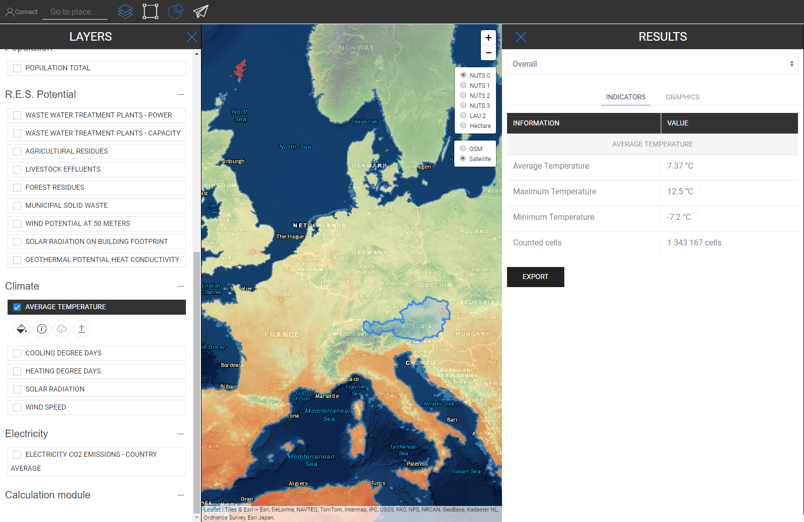
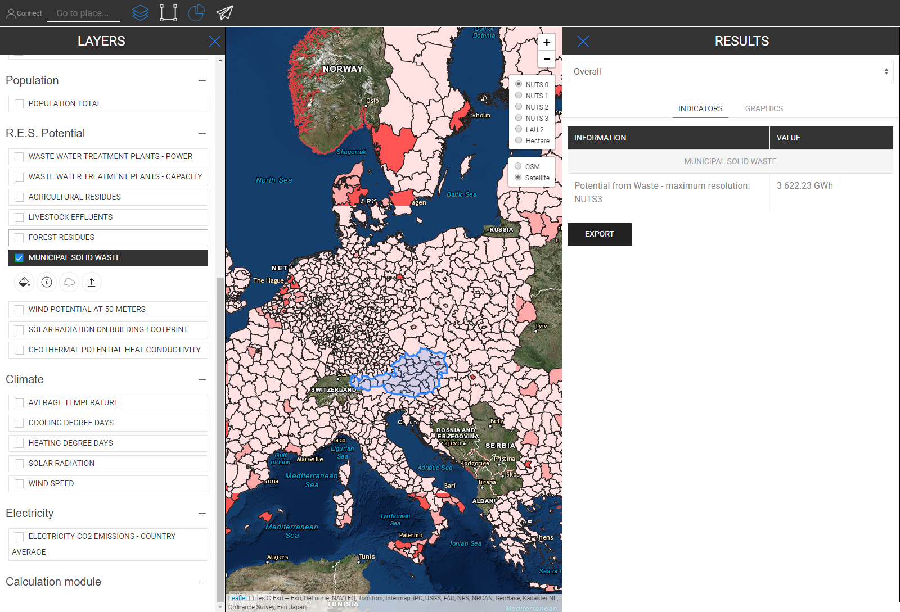

<h1><a class="anchor" id="retrieve-indicators-of-a-selected-area" href="#retrieve-indicators-of-a-selected-area"><i class="fa fa-link"></i></a>Pobierz wskaźniki wybranego obszaru</h1><h2><a class="anchor" id="table-of-contents" href="#table-of-contents"><i class="fa fa-link"></i></a> Spis treści</h2><ul><li> <a href="#introduction">Wprowadzenie</a></li><li> <a href="#indicators-for-raster-layers">Wskaźniki dla warstw rastrowych</a><ul><li> <a href="#indicators-for-raster-layers_buildings">Budynki</a></li><li> <a href="#indicators-for-raster-layers_population">Populacja</a></li><li> <a href="#indicators-for-raster-layers_renewable-energy-source-potentials">Potencjał odnawialnych źródeł energii</a></li></ul></li><li> <a href="#indicators-for-vector-layers">Wskaźniki dla warstw wektorowych</a><ul><li> <a href="#indicators-for-vector-layers_industry">Przemysł</a></li><li> <a href="#indicators-for-vector-layers_renewable-energy-source-potentials">Potencjał odnawialnych źródeł energii</a></li><li> <a href="#indicators-for-vector-layers_electricity">Elektryczność</a></li></ul></li><li> <a href="#example">Przykład</a></li><li> <a href="#how-to-cite">Jak cytować</a></li><li> <a href="#authors-and-reviewers">Autorzy i recenzenci</a></li><li> <a href="#license">Licencja</a></li><li> <a href="#acknowledgement">Potwierdzenie</a></li></ul><h2><a class="anchor" id="introduction" href="#introduction"><i class="fa fa-link"></i></a> Wprowadzenie</h2>
 W zależności od warstw i regionu, które wybrałeś, wskaźniki konfiguracji są wyświetlane na pasku bocznym po prawej stronie ekranu

 <a href="#table-of-contents"><strong><code>To Top</code></strong></a>

 Poniżej przyjrzymy się wskaźnikom wyświetlanym dla warstw rastrowych i wektorowych.
<h2><a class="anchor" id="indicators-for-raster-layers" href="#indicators-for-raster-layers"><i class="fa fa-link"></i></a> Wskaźniki dla warstw rastrowych</h2>
 Wskaźniki na warstwach rastrowych różnią się od warstw wektorowych. Przez różne mamy na myśli agregację i dezagregację. To odmienne zachowanie wynika z postanowień terytorialnych.

 Warstwy rastrowe mają na ogół znacznie wyższą rozdzielczość, podczas gdy warstwy wektorowe mają atrybuty tylko w punktach lub wielokątach.

 Oznacza to z jednej strony, że na przykład jeśli wybierzesz warstwę wektorową, która jest zdefiniowana przez wielokąty NUTS3 i chcesz na przykład wybrać region LAU, wówczas wartość NUTS3 nie zostanie zdezagregowana do poziomu LAU, zamiast tego wskaźnik NUTS3 Region LAU zostanie wyświetlony na pasku bocznym wyników.

 Z drugiej strony warstwy rastrowe są agregowane i dezagregowane „arbitralnie” *

 * według komórek zawierających w wybranym regionie (oczywiście w granicach samej rozdzielczości rastra)

 <a href="#table-of-contents"><strong><code>To Top</code></strong></a>
<h3><a class="anchor" id="buildings" href="#buildings"><i class="fa fa-link"></i></a> Budynki</h3>
 <strong>Mapa gęstości ciepła</strong>

 <strong>Dodatkowa funkcja</strong>

 Po wybraniu warstwy gęstości ciepła i warstwy populacji w tym samym czasie wyświetlany jest dodatkowy wskaźnik (patrz rysunek poniżej)

 <a href="#table-of-contents"><strong><code>To Top</code></strong></a>
<h3><a class="anchor" id="in-general-" href="#in-general-"><i class="fa fa-link"></i></a> Ogólnie:</h3>
 Gdy jedna z warstw budynku i warstwa populacji zostanie wybrana w tym samym czasie, zostanie wyświetlony dodatkowy wskaźnik, jak opisano wcześniej

<ins> <code><strong><a href="#indicators-for-raster-layers">To Chapter</a></strong></code></ins>

 <strong>Mapa gęstości chłodzenia</strong>

<ins> <code><strong><a href="#indicators-for-raster-layers">To Chapter</a></strong></code></ins>

 <strong>Budowanie woluminów</strong>

<ins> <code><strong><a href="#indicators-for-raster-layers">To Chapter</a></strong></code></ins>

 <strong>Powierzchnia brutto</strong>

<ins> <code><strong><a href="#indicators-for-raster-layers">To Chapter</a></strong></code></ins> <a href="#table-of-contents"><strong><code>To Top</code></strong></a>
<h3><a class="anchor" id="population" href="#population"><i class="fa fa-link"></i></a> Populacja</h3>

<ins> <code><strong><a href="#indicators-for-raster-layers">To Chapter</a></strong></code></ins> <a href="#table-of-contents"><strong><code>To Top</code></strong></a>
<h3><a class="anchor" id="climate" href="#climate"><i class="fa fa-link"></i></a> Klimat</h3>
 <strong>Temperatura</strong>

<ins> <code><strong><a href="#indicators-for-raster-layers">To Chapter</a></strong></code></ins>

 <strong>Dni stopni chłodzenia</strong>

<ins> <code><strong><a href="#indicators-for-raster-layers">To Chapter</a></strong></code></ins>

 <strong>Stopniodni ogrzewania</strong>

<ins> <code><strong><a href="#indicators-for-raster-layers">To Chapter</a></strong></code></ins>

 <strong>Promieniowania słonecznego</strong>

<ins> <code><strong><a href="#indicators-for-raster-layers">To Chapter</a></strong></code></ins>

 <strong>Prędkość wiatru</strong>

<ins> <code><strong><a href="#indicators-for-raster-layers">To Chapter</a></strong></code></ins> <a href="#table-of-contents"><strong><code>To Top</code></strong></a>
<h3><a class="anchor" id="renewable-energy-source-potentials" href="#renewable-energy-source-potentials"><i class="fa fa-link"></i></a> Potencjał odnawialnych źródeł energii</h3>
 <strong>Promieniowanie słoneczne na ślad budynku</strong>

<ins> <code><strong><a href="#indicators-for-raster-layers">To Chapter</a></strong></code></ins>

 <strong>Potencjał wiatru na 50m</strong>

<ins> <code><strong><a href="#indicators-for-raster-layers">To Chapter</a></strong></code></ins>

 <strong>Pozostałości leśne</strong>

<ins> <code><strong><a href="#indicators-for-raster-layers">To Chapter</a></strong></code></ins> <a href="#table-of-contents"><strong><code>To Top</code></strong></a>
<h2><a class="anchor" id="indicators-for-vector-layers" href="#indicators-for-vector-layers"><i class="fa fa-link"></i></a> Wskaźniki dla warstw wektorowych</h2><h3><a class="anchor" id="industry" href="#industry"><i class="fa fa-link"></i></a> Przemysł</h3>
 <strong>Emisje w obiektach przemysłowych</strong>

<ins> <code><strong><a href="#indicators-for-vector-layers">To Chapter</a></strong></code></ins>

 <strong>Nadmiar ciepła w miejscu pracy</strong>

<ins> <code><strong><a href="#indicators-for-vector-layers">To Chapter</a></strong></code></ins>

 <strong>Nazwa firmy w zakładzie przemysłowym</strong>

<ins> <code><strong><a href="#indicators-for-vector-layers">To Chapter</a></strong></code></ins>

 <strong>Podsektor terenu przemysłowego</strong>

<ins> <code><strong><a href="#indicators-for-vector-layers">To Chapter</a></strong></code></ins> <a href="#table-of-contents"><strong><code>To Top</code></strong></a>
<h3><a class="anchor" id="renewable-energy-source-potentials" href="#renewable-energy-source-potentials"><i class="fa fa-link"></i></a> Potencjał odnawialnych źródeł energii</h3>
 <strong>Oczyszczalnie ścieków Power</strong>

<ins> <code><strong><a href="#indicators-for-vector-layers">To Chapter</a></strong></code></ins>

 <strong>Wydajność oczyszczalni ścieków</strong>

<ins> <code><strong><a href="#indicators-for-vector-layers">To Chapter</a></strong></code></ins>

 <strong>Pozostałości rolnicze</strong>

<ins> <code><strong><a href="#indicators-for-vector-layers">To Chapter</a></strong></code></ins>

 <strong>Ścieki zwierzęce</strong>

<ins> <code><strong><a href="#indicators-for-vector-layers">To Chapter</a></strong></code></ins>

 <strong>Miejskie odpady stałe</strong>

<ins> <code><strong><a href="#indicators-for-vector-layers">To Chapter</a></strong></code></ins>

 <strong>Potencjalne przewodnictwo cieplne geotermalne</strong>

<ins> <code><strong><a href="#indicators-for-vector-layers">To Chapter</a></strong></code></ins> <a href="#table-of-contents"><strong><code>To Top</code></strong></a>
<h3><a class="anchor" id="electricity" href="#electricity"><i class="fa fa-link"></i></a> Elektryczność</h3>
 <strong>Emisje CO2 z energii elektrycznej</strong>

<ins> <code><strong><a href="#indicators-for-vector-layers">To Chapter</a></strong></code></ins> <a href="#table-of-contents"><strong><code>To Top</code></strong></a>
<h2><a class="anchor" id="example" href="#example"><i class="fa fa-link"></i></a> Przykład</h2>
 Na poniższym obrazku możesz zobaczyć, jak to wygląda, gdy wszystkie warstwy są wizualizowane (tutaj jest Austria jako wybrana NUTS0)

 Chociaż na pierwszy rzut oka ta mapa może wydawać się nieco zagmatwana, jej wskaźniki są wyraźnie zilustrowane. Zobacz poniżej wszystkie wskaźniki opisane na pasku bocznym wyników po wybraniu wszystkich warstw dla Austrii (NUTS0)

 <a href="#table-of-contents"><strong><code>To Top</code></strong></a>
<h2><a class="anchor" id="how-to-cite" href="#how-to-cite"><i class="fa fa-link"></i></a> Jak cytować</h2>
 Jeton Hasani, w Hotmaps-Wiki, Retrieve-Indicators-of-a-selected-area (kwiecień 2019)

 <a href="#table-of-contents"><strong><code>To Top</code></strong></a>
<h2><a class="anchor" id="authors-and-reviewers" href="#authors-and-reviewers"><i class="fa fa-link"></i></a> Autorzy i recenzenci</h2>
 Ta strona została napisana przez Jetona Hasaniego <strong><a href="https://eeg.tuwien.ac.at/">EEG - TU Wien</a></strong> .

 ☑ Ta strona została sprawdzona przez Mostafa Fallahnejad <strong><a href="https://eeg.tuwien.ac.at/">EEG - TU Wien</a></strong> .

 <a href="#table-of-contents"><strong><code>To Top</code></strong></a>
<h2><a class="anchor" id="license" href="#license"><i class="fa fa-link"></i></a> Licencja</h2>
 Prawa autorskie © 2016-2020: Jeton Hasani

 Licencja międzynarodowa Creative Commons Attribution 4.0

 Ta praca jest objęta licencją Creative Commons CC BY 4.0 International License.

 Identyfikator licencji SPDX: CC-BY-4.0

 Tekst licencji: https://spdx.org/licenses/CC-BY-4.0.html

 <a href="#table-of-contents"><strong><code>To Top</code></strong></a>
<h2><a class="anchor" id="acknowledgement" href="#acknowledgement"><i class="fa fa-link"></i></a> Potwierdzenie</h2>
 Chcielibyśmy wyrazić nasze najgłębsze uznanie dla <a href="https://www.hotmaps-project.eu">projektu Hotmaps</a> programu „Horyzont 2020 <a href="https://www.hotmaps-project.eu">”</a> (umowa o udzielenie dotacji nr 723677), który zapewnił fundusze na przeprowadzenie obecnego dochodzenia.

 <a href="#table-of-contents"><strong><code>To Top</code></strong></a> <code><a href="Indicator-Section/_edit">Review this page</a></code>

<!--- THIS IS A SUPER UNIQUE IDENTIFIER -->

This page was automatically translated. View in another language:

[English](../en/Retrieve-indicators-of-a-selected-area) (original) [Bulgarian](../bg/Retrieve-indicators-of-a-selected-area)\* [Czech](../cs/Retrieve-indicators-of-a-selected-area)\* [Danish](../da/Retrieve-indicators-of-a-selected-area)\* [German](../de/Retrieve-indicators-of-a-selected-area)\* [Greek](../el/Retrieve-indicators-of-a-selected-area)\* [Spanish](../es/Retrieve-indicators-of-a-selected-area)\* [Estonian](../et/Retrieve-indicators-of-a-selected-area)\* [Finnish](../fi/Retrieve-indicators-of-a-selected-area)\* [French](../fr/Retrieve-indicators-of-a-selected-area)\* [Irish](../ga/Retrieve-indicators-of-a-selected-area)\* [Croatian](../hr/Retrieve-indicators-of-a-selected-area)\* [Hungarian](../hu/Retrieve-indicators-of-a-selected-area)\* [Italian](../it/Retrieve-indicators-of-a-selected-area)\* [Lithuanian](../lt/Retrieve-indicators-of-a-selected-area)\* [Latvian](../lv/Retrieve-indicators-of-a-selected-area)\* [Maltese](../mt/Retrieve-indicators-of-a-selected-area)\* [Dutch](../nl/Retrieve-indicators-of-a-selected-area)\*  [Portuguese (Portugal, Brazil)](../pt/Retrieve-indicators-of-a-selected-area)\* [Romanian](../ro/Retrieve-indicators-of-a-selected-area)\* [Slovak](../sk/Retrieve-indicators-of-a-selected-area)\* [Slovenian](../sl/Retrieve-indicators-of-a-selected-area)\* [Swedish](../sv/Retrieve-indicators-of-a-selected-area)\* 

\* machine translated
