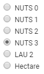

<h1><a class="anchor" id="select-a-region-in-the-hotmaps-toolbox" href="#select-a-region-in-the-hotmaps-toolbox"><i class="fa fa-link"></i></a>Wybierz region w przyborniku Hotmaps</h1><h2><a class="anchor" id="table-of-contents" href="#table-of-contents"><i class="fa fa-link"></i></a> Spis treści</h2><ul><li> <a href="#introduction">Wprowadzenie</a></li><li> <a href="#selection-by-nuts-boundaries">Wybór według granic NUTS</a><ul><li> <a href="#selection-by-nuts-boundaries_nuts-0-selection">NUTS 0 Wybór</a></li><li> <a href="#selection-by-nuts-boundaries_nuts-1-selection">Wybór NUTS 1</a></li><li> <a href="#selection-by-nuts-boundaries_nuts-2-selection">Wybór NUTS 2</a></li><li> <a href="#selection-by-nuts-boundaries_nuts-3-selection">Wybór NUTS 3</a></li><li> <a href="#selection-by-nuts-boundaries_lau-selection">Wybór LAU</a></li></ul></li><li> <a href="#custom-selection">Wybór niestandardowy</a></li><li> <a href="#bounding-box-and-area-selection-limit">Obwiednia i limit wyboru obszaru</a></li><li> <a href="#how-to-cite">Jak cytować</a></li><li> <a href="#authors-and-reviewers">Autorzy i recenzenci</a></li><li> <a href="#license">Licencja</a></li><li> <a href="#acknowledgement">Potwierdzenie</a></li></ul><h2><a class="anchor" id="introduction" href="#introduction"><i class="fa fa-link"></i></a> Wprowadzenie</h2>
 Istnieją dwa sposoby na wybranie regionu w przyborniku Hotmaps:
<ol><li> wybór według <a href="https://ec.europa.eu/eurostat/web/nuts/background">klasyfikacji NUTS (nomenklatura jednostek terytorialnych do celów statystycznych))</a></li><li> niestandardowy dobór hektarów</li></ol>
 Za pomocą <a href="#fig1">przycisków radiowych</a> po prawej stronie ekranu możesz wybrać skalę terytorialną, którą chcesz przeanalizować (regiony NUTS, <a href="https://ec.europa.eu/eurostat/web/nuts/local-administrative-units">LAU (lokalne jednostki administracyjne</a> lub poziom hektarów)

 Rys.1 .: Przyciski radiowe dla skali terytorialnej

 <a href="#table-of-contents"><strong><code>To Top</code></strong></a>
<h2><a class="anchor" id="selection-by-nuts-boundaries-" href="#selection-by-nuts-boundaries-"><i class="fa fa-link"></i></a> Wybór według granic NUTS:</h2>
 Po wybraniu regionu i naciśnięciu przycisku <em>LOAD RESULTS</em> wyświetlany jest boczny pasek wyników po prawej stronie iw zależności od wybranej warstwy wyświetlane są dla nich wskaźniki. Możesz zobaczyć, że po wybraniu innego regionu wyniki będą agregowane w locie.

 <a href="#table-of-contents"><strong><code>To Top</code></strong></a>
<h3><a class="anchor" id="nuts-0-selection" href="#nuts-0-selection"><i class="fa fa-link"></i></a> NUTS 0 Wybór</h3>
 <a href="#table-of-contents"><strong><code>To Top</code></strong></a>
<h3><a class="anchor" id="nuts-1-selection" href="#nuts-1-selection"><i class="fa fa-link"></i></a> Wybór NUTS 1</h3>
 <a href="#table-of-contents"><strong><code>To Top</code></strong></a>
<h3><a class="anchor" id="nuts-2-selection" href="#nuts-2-selection"><i class="fa fa-link"></i></a> Wybór NUTS 2</h3>
 <a href="#table-of-contents"><strong><code>To Top</code></strong></a>
<h3><a class="anchor" id="nuts-3-selection" href="#nuts-3-selection"><i class="fa fa-link"></i></a> Wybór NUTS 3</h3>
 <a href="#table-of-contents"><strong><code>To Top</code></strong></a>
<h3><a class="anchor" id="lau-selection" href="#lau-selection"><i class="fa fa-link"></i></a> Wybór LAU</h3>
 Oprócz trzech poziomów NUTS masz również możliwość analizy na poziomie LAU

 <a href="#table-of-contents"><strong><code>To Top</code></strong></a>
<h2><a class="anchor" id="custom-selection-" href="#custom-selection-"><i class="fa fa-link"></i></a> Wybór niestandardowy:</h2>
 Jeśli potrzebujesz bardziej elastycznego sposobu i chcesz przeanalizować region, który nie jest objęty granicami NUTS lub LAU, lepiej jest określić własne regiony celne. Przybornik oferuje wiele narzędzi do zaznaczania: prostokątne, okrągłe lub wielokątne. Narysuj kształt, który chcesz przeanalizować, a następnie kliknij narysowaną obwiednię, aby zaznaczyć obszar.

 Inną opcją, która jest dostępna tylko na poziomie hektara, jest przesłanie obiektu selekcji GeoJSON. GeoJSON to format do kodowania geograficznych struktur danych. Jeśli utworzyłeś obiekt GeoJSON, który reprezentuje region przestrzeni lub zbiór obiektów ograniczonych przestrzennie, przesyłając swój obiekt GeoJSN, ten wybór będzie łatwo używany w Hotmapach.

 <a href="#table-of-contents"><strong><code>To Top</code></strong></a>
<h2><a class="anchor" id="bounding-box-and-area-selection-limit" href="#bounding-box-and-area-selection-limit"><i class="fa fa-link"></i></a> Obwiednia i limit wyboru obszaru</h2>
 Podczas wybierania jednego lub więcej regionów na mapie, pole po lewej stronie ekranu z przyciskami do wczytywania wyników pokazuje następujące informacje o aktualnym wyborze:
<ul><li> Wybrane elementy: liczba pojedynczych stref, które zostały wybrane</li><li> Obwiednia: ogólna powierzchnia najmniejszego prostokątnego kształtu, który może pokryć wybrany obszar</li><li> Skala: poziom, na którym dokonywany jest wybór</li></ul>
 <strong>WAŻNA UWAGA</strong> Ramka ograniczająca ma próg limitu wynoszący około 640 000 km2. Nie można uruchamiać / ładować modułów obliczeniowych i warstw wyników powyżej tego progu. Wybranie obszaru powyżej limitu wyboru zwróci następujący komunikat o błędzie: <em>Przekroczono LIMIT WYBORU OBSZARU dla swobodnego wyboru, jak również dla uruchomionych modułów obliczeniowych! Wybierz mniejszy obszar.</em>

 <a href="#table-of-contents"><strong><code>To Top</code></strong></a>
<h2><a class="anchor" id="how-to-cite" href="#how-to-cite"><i class="fa fa-link"></i></a> Jak cytować</h2>
 Jeton Hasani, w Hotmaps-Wiki, Select-a-region-in-the-Hotmaps-toolbox (kwiecień 2019)

 <a href="#table-of-contents"><strong><code>To Top</code></strong></a>
<h2><a class="anchor" id="authors-and-reviewers" href="#authors-and-reviewers"><i class="fa fa-link"></i></a> Autorzy i recenzenci</h2>
 Ta strona została napisana przez Jetona Hasaniego <strong><a href="https://eeg.tuwien.ac.at/">EEG - TU Wien</a></strong> .

 ☑ Ta strona została sprawdzona przez Mostafa Fallahnejad <strong><a href="https://eeg.tuwien.ac.at/">EEG - TU Wien</a></strong> .

 <a href="#table-of-contents"><strong><code>To Top</code></strong></a>
<h2><a class="anchor" id="license" href="#license"><i class="fa fa-link"></i></a> Licencja</h2>
 Prawa autorskie © 2016-2020: Jeton Hasani

 Licencja międzynarodowa Creative Commons Attribution 4.0

 Ta praca jest objęta licencją Creative Commons CC BY 4.0 International License.

 Identyfikator licencji SPDX: CC-BY-4.0

 Tekst licencji: https://spdx.org/licenses/CC-BY-4.0.html

<ins> <code><strong><a href="#hotmaps-toolbox">To Top</a></strong></code></ins>
<h2><a class="anchor" id="acknowledgement" href="#acknowledgement"><i class="fa fa-link"></i></a> Potwierdzenie</h2>
 Chcielibyśmy wyrazić nasze najgłębsze uznanie dla <a href="https://www.hotmaps-project.eu">projektu Hotmaps</a> programu „Horyzont 2020 <a href="https://www.hotmaps-project.eu">”</a> (umowa o udzielenie dotacji nr 723677), który zapewnił fundusze na przeprowadzenie obecnego dochodzenia.

 <a href="#table-of-contents"><strong><code>To Top</code></strong></a>

<!--- THIS IS A SUPER UNIQUE IDENTIFIER -->

This page was automatically translated. View in another language:

[English](../en/Select-a-region-in-the-Hotmaps-toolbox) (original) [Bulgarian](../bg/Select-a-region-in-the-Hotmaps-toolbox)\* [Czech](../cs/Select-a-region-in-the-Hotmaps-toolbox)\* [Danish](../da/Select-a-region-in-the-Hotmaps-toolbox)\* [German](../de/Select-a-region-in-the-Hotmaps-toolbox)\* [Greek](../el/Select-a-region-in-the-Hotmaps-toolbox)\* [Spanish](../es/Select-a-region-in-the-Hotmaps-toolbox)\* [Estonian](../et/Select-a-region-in-the-Hotmaps-toolbox)\* [Finnish](../fi/Select-a-region-in-the-Hotmaps-toolbox)\* [French](../fr/Select-a-region-in-the-Hotmaps-toolbox)\* [Irish](../ga/Select-a-region-in-the-Hotmaps-toolbox)\* [Croatian](../hr/Select-a-region-in-the-Hotmaps-toolbox)\* [Hungarian](../hu/Select-a-region-in-the-Hotmaps-toolbox)\* [Italian](../it/Select-a-region-in-the-Hotmaps-toolbox)\* [Lithuanian](../lt/Select-a-region-in-the-Hotmaps-toolbox)\* [Latvian](../lv/Select-a-region-in-the-Hotmaps-toolbox)\* [Maltese](../mt/Select-a-region-in-the-Hotmaps-toolbox)\* [Dutch](../nl/Select-a-region-in-the-Hotmaps-toolbox)\*  [Portuguese (Portugal, Brazil)](../pt/Select-a-region-in-the-Hotmaps-toolbox)\* [Romanian](../ro/Select-a-region-in-the-Hotmaps-toolbox)\* [Slovak](../sk/Select-a-region-in-the-Hotmaps-toolbox)\* [Slovenian](../sl/Select-a-region-in-the-Hotmaps-toolbox)\* [Swedish](../sv/Select-a-region-in-the-Hotmaps-toolbox)\* 

\* machine translated
