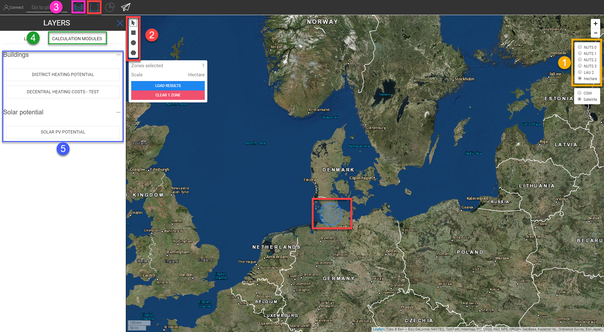

<h1><a class="anchor" id="access-to-calculation-modules" href="#access-to-calculation-modules"><i class="fa fa-link"></i></a>Acesso aos módulos de cálculo</h1><h2><a class="anchor" id="table-of-contents" href="#table-of-contents"><i class="fa fa-link"></i></a> Índice</h2><ul><li> <a href="#introduction">Introdução</a></li><li> <a href="#structure-of-a-calculation-module">Estrutura de um módulo de cálculo</a></li><li> <a href="#list-of-calculation-modules">Lista de Módulos de Cálculo</a></li><li> <a href="#how-to-cite">Como citar</a></li><li> <a href="#authors-and-reviewers">Autores e revisores</a></li><li> <a href="#license">Licença</a></li><li> <a href="#acknowledgement">Reconhecimento</a></li></ul><h2><a class="anchor" id="introduction" href="#introduction"><i class="fa fa-link"></i></a> Introdução</h2>
 No capítulo seguinte, descreveremos como acessar um módulo de cálculo

 <strong>Etapas para acessar um módulo de cálculo</strong>

 <strong>Passos:</strong>
<ol><li> Defina uma escala territorial</li><li> Selecione uma região</li><li> Habilite a seção da camada</li><li> Vá para a guia <code>Calculation Modules</code></li><li> Acesse o módulo desejado</li><li> Defina os parâmetros, dê um nome para a execução e execute o módulo</li><li> os resultados são mostrados na barra de resultados e no mapa</li></ol>

<h2><a class="anchor" id="structure-of-a-calculation-module" href="#structure-of-a-calculation-module"><i class="fa fa-link"></i></a> Estrutura de um módulo de cálculo</h2>
 A imagem abaixo mostra a estrutura de um módulo de cálculo

<h2><a class="anchor" id="list-of-calculation-modules" href="#list-of-calculation-modules"><i class="fa fa-link"></i></a> Lista de Módulos de Cálculo</h2>
 Abaixo você vê os módulos disponíveis atualmente. Na parte inferior, os módulos de cálculo autônomos são listados. Cada um tem um link para sua página wiki dedicada ou wiki separado e para seu repositório, pois eles não são parte integrante da caixa de ferramentas Hotmaps.
<h2><a class="anchor" id="how-to-cite" href="#how-to-cite"><i class="fa fa-link"></i></a> Como citar</h2>
 Jeton Hasani, em Hotmaps-Wiki, Módulos de cálculo de acesso (abril de 2019)
<h2><a class="anchor" id="authors-and-reviewers" href="#authors-and-reviewers"><i class="fa fa-link"></i></a> Autores e revisores</h2>
 Esta página foi escrita por Jeton Hasani <strong><a href="https://eeg.tuwien.ac.at/">EEG - TU Wien</a></strong> .

 ☑ Esta página foi revisada por Mostafa Fallahnejad.

 <a href="#table-of-contents"><strong><code>To Top</code></strong></a>
<h2><a class="anchor" id="license" href="#license"><i class="fa fa-link"></i></a> Licença</h2>
 Copyright © 2016-2020: Jeton Hasani

 Licença Creative Commons Atribuição 4.0 Internacional

 Este trabalho está licenciado sob uma Licença Internacional Creative Commons CC BY 4.0.

 SPDX-License-Identifier: CC-BY-4.0

 License-Text: https://spdx.org/licenses/CC-BY-4.0.html

 <a href="#table-of-contents"><strong><code>To Top</code></strong></a>
<h2><a class="anchor" id="acknowledgement" href="#acknowledgement"><i class="fa fa-link"></i></a> Reconhecimento</h2>
 Gostaríamos de transmitir o nosso mais profundo agradecimento ao <a href="https://www.hotmaps-project.eu">Projeto Hotmaps</a> Horizonte 2020 (Contrato de Subvenção n.º 723677), que forneceu o financiamento para a realização da presente investigação.

 <a href="#table-of-contents"><strong><code>To Top</code></strong></a>

<!--- THIS IS A SUPER UNIQUE IDENTIFIER -->

This page was automatically translated. View in another language:

[English](../en/Access-to-calculation-modules) (original) [Bulgarian](../bg/Access-to-calculation-modules)\* [Czech](../cs/Access-to-calculation-modules)\* [Danish](../da/Access-to-calculation-modules)\* [German](../de/Access-to-calculation-modules)\* [Greek](../el/Access-to-calculation-modules)\* [Spanish](../es/Access-to-calculation-modules)\* [Estonian](../et/Access-to-calculation-modules)\* [Finnish](../fi/Access-to-calculation-modules)\* [French](../fr/Access-to-calculation-modules)\* [Irish](../ga/Access-to-calculation-modules)\* [Croatian](../hr/Access-to-calculation-modules)\* [Hungarian](../hu/Access-to-calculation-modules)\* [Italian](../it/Access-to-calculation-modules)\* [Lithuanian](../lt/Access-to-calculation-modules)\* [Latvian](../lv/Access-to-calculation-modules)\* [Maltese](../mt/Access-to-calculation-modules)\* [Dutch](../nl/Access-to-calculation-modules)\* [Polish](../pl/Access-to-calculation-modules)\*  [Romanian](../ro/Access-to-calculation-modules)\* [Slovak](../sk/Access-to-calculation-modules)\* [Slovenian](../sl/Access-to-calculation-modules)\* [Swedish](../sv/Access-to-calculation-modules)\* 

\* machine translated
