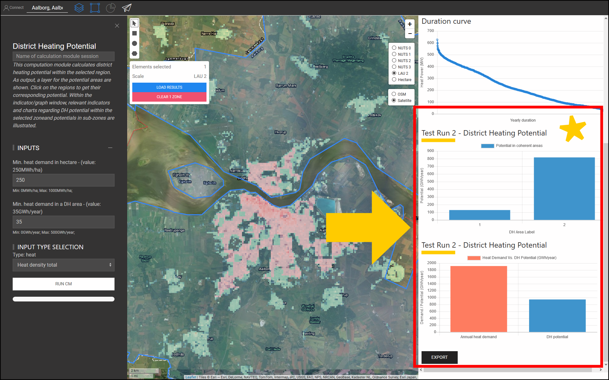

<h1><a class="anchor" id="cm-district-heating-potential-areas-user-defined-thresholds" href="#cm-district-heating-potential-areas-user-defined-thresholds"><i class="fa fa-link"></i></a>Limites definidos pelo usuário das áreas potenciais de aquecimento urbano do CM</h1><h2><a class="anchor" id="table-of-contents" href="#table-of-contents"><i class="fa fa-link"></i></a> Índice</h2><ul><li> <a href="#in-a-glance">Em um relance</a></li><li> <a href="#introduction">Introdução</a></li><li> <a href="#inputs-and-outputs">Entradas e saídas</a></li><li> <a href="#method">Método</a></li><li> <a href="#github-repository-of-this-calculation-module">Repositório GitHub deste módulo de cálculo</a></li><li> <a href="#sample-run">Execução de amostra</a><ul><li> <a href="#sample-run_test-run-1-default-input-values">Execução de teste 1: valores de entrada padrão</a></li><li> <a href="#sample-run_test-run-2-modified-input-values">Execução de teste 2: valores de entrada modificados</a></li></ul></li><li> <a href="#how-to-cite">Como citar</a></li><li> <a href="#authors-and-reviewers">Autores e revisores</a></li><li> <a href="#license">Licença</a></li><li> <a href="#acknowledgement">Reconhecimento</a></li></ul><h2><a class="anchor" id="in-a-glance" href="#in-a-glance"><i class="fa fa-link"></i></a> Em um relance</h2>
 Este módulo de cálculo calcula o potencial de aquecimento urbano dentro da região selecionada usando 2 valores de limiar: 1) Demanda mínima de calor em cada hectare, 2) Demanda mínima de calor em uma área DH. As áreas dentro da região selecionada, que atendem a essas condições, são retornadas como áreas DH. Além disso, as demandas de calor nessas regiões são retornadas na forma de indicadores como potencial DH.

 <a href="#table-of-contents"><strong><code>To Top</code></strong></a>
<h2><a class="anchor" id="introduction" href="#introduction"><i class="fa fa-link"></i></a> Introdução</h2>
 A demanda de calor desempenha um papel importante na determinação de áreas potenciais de aquecimento urbano (DH). Por exemplo, a implementação de aquecimento urbano em áreas com baixa demanda de calor não é economicamente viável. Por outro lado, definir qualquer área com alta densidade de demanda de calor como uma área DH potencial também pode ser impreciso. Uma alta densidade de demanda de calor em uma área pode ser devido à presença de alguns consumidores com uma demanda de calor muito alta nessa área. Pelo contrário, uma densidade de demanda de calor média baixa pode ser um sinal de zonas com uma demanda de calor muito baixa dentro da área selecionada. O objetivo do módulo de cálculo &quot;CM - ÁREA POTENCIAL DE AQUECIMENTO DO DISTRITO: LIMIAR DEFINIDO PELO USUÁRIO&quot; é fornecer um equilíbrio razoável entre a densidade de demanda de calor em uma área e suas zonas constituintes.

 O &quot;CM - ÁREA POTENCIAL DE AQUECIMENTO DO DISTRITO: LIMIAR DEFINIDO PELO USUÁRIO&quot; determina as áreas DH e seu potencial DH correspondente com base nas densidades de demanda de calor. As densidades de demanda de calor são obtidas a partir de uma camada GIS de entrada. A caixa de ferramentas e o banco de dados do Hotmaps fornecem um <strong><a href="https://gitlab.com/hotmaps/heat/heat_tot_curr_density">mapa de densidade de calor padrão</a></strong> que pode ser usado neste módulo de cálculo. O mapa de densidade de calor Hotmaps está em formato raster e tem resolução de um hectare e Sistema de Referência de Coordenadas (CRS) de &quot; <em><em>ETRS89 / LAEA Europe - EPSG 3035</em></em> &quot;. As células no mapa mostram as densidades de calor em <em><strong>MWh / ha</strong></em> . Além desse mapa padrão, também os mapas gerados pelo usuário podem ser carregados na caixa de ferramentas e usados neste CM.

 Como saída, uma camada GIS, três indicadores e dois diagramas são apresentados. Essas saídas são explicadas em detalhes na seção <a href="#sample-run">Execução de amostra</a> . A camada de saída demonstra as áreas DH potenciais. Ao clicar em cada área do mapa, uma janela é exibida e o potencial DH correspondente a essa área é mostrado. Dentro das janelas INDICADORES / GRÁFICOS na seção RESULTADOS da caixa de ferramentas, indicadores relevantes e gráficos relativos ao potencial DH dentro da zona selecionada e potenciais nas subzonas são ilustrados.

 <a href="#table-of-contents"><strong><code>To Top</code></strong></a>
<h2><a class="anchor" id="inputs-and-outputs" href="#inputs-and-outputs"><i class="fa fa-link"></i></a> Entradas e saídas</h2>
 Os parâmetros e camadas de entrada, bem como as camadas e parâmetros de saída, são os seguintes.

 <strong>Camadas de entrada e parâmetros são:</strong>
<ul><li> Demanda mínima de calor em cada hectare [ <em><strong>MWh / ha</strong></em> ]: um valor entre <em><em>0</em></em> e <em><em>1000</em></em></li><li> Demanda mínima de calor em uma área DH [ <em><strong>GWh / ano</strong></em> ]: um valor entre <em><em>0</em></em> e <em><em>500</em></em></li><li> Mapa de densidade de calor: um mapa padrão é fornecido na caixa de ferramentas; os próprios mapas carregados também podem ser usados no CM<ul><li> em formato raster (* .tif)</li><li> com resolução de 1 hectare</li><li> densidades de demanda em <em><strong>MWh / ha</strong></em></li></ul></li></ul>
 <strong>As camadas e parâmetros de saída são:</strong>
<ul><li> Áreas DH em formatos raster e shapefile</li><li> Potencial DH em cada área DH [ <em><strong>GWh / ano</strong></em> ] (clique no mapa)</li><li> Demanda total de calor em GWh dentro da zona selecionada</li><li> Potencial total de aquecimento urbano em GWh dentro da zona selecionada</li><li> Participação potencial do aquecimento urbano da demanda total na zona selecionada</li></ul>
 <a href="#table-of-contents"><strong><code>To Top</code></strong></a>
<h2><a class="anchor" id="method" href="#method"><i class="fa fa-link"></i></a> Método</h2>
 O potencial para DH em uma região específica pode ser definido pela demanda geral de calor e sua alocação espacial. Na caixa de ferramentas Hotmaps, a demanda de calor é representada na forma de um mapa raster. A fim de definir adequadamente as áreas DH potenciais, tanto a demanda de calor em cada célula quanto em uma área deve atingir um determinado nível. Como ponto de partida, a caixa de ferramentas Hotmaps sugere valores padrão para esses dois parâmetros. Porém, dependendo da distribuição da demanda de calor e também das condições locais, o usuário Hotmaps pode modificar esses valores.

 A determinação das áreas DH é feita em duas etapas:

 Na primeira etapa, todas as células com demanda de calor abaixo do parâmetro de entrada “Demanda mínima de calor em hectare” são filtradas. Ao eliminar essas células do mapa, obtemos grupos de células que são anexadas umas às outras. Cada conjunto dessas células anexadas constitui pequenas zonas que aqui são chamadas de “áreas coerentes”. Nas segundas etapas, a demanda total de calor em cada área coerente é calculada. Para cada área coerente, se a demanda total de calor for superior ao parâmetro de entrada &quot;Demanda mínima de calor em uma área DH&quot;, é considerada uma área DH potencial.

 Por fim, para as áreas de DH, o potencial é calculado e apresentado na forma de uma camada GIS, que pode ser vista na caixa de ferramentas.

 <a href="#table-of-contents"><strong><code>To Top</code></strong></a>
<h2><a class="anchor" id="github-repository-of-this-calculation-module" href="#github-repository-of-this-calculation-module"><i class="fa fa-link"></i></a> Repositório GitHub deste módulo de cálculo</h2>
 <a href="https://github.com/HotMaps/dh_potential/tree/develop">Aqui</a> você obtém o desenvolvimento de ponta para este módulo de cálculo.

 <a href="#table-of-contents"><strong><code>To Top</code></strong></a>
<h2><a class="anchor" id="sample-run" href="#sample-run"><i class="fa fa-link"></i></a> Execução de amostra</h2>
 Aqui, o módulo de cálculo é executado para o estudo de caso de Aalborg na Dinamarca.
<ul><li> Primeiro, use a barra &quot;Go To Place&quot; para navegar até Aalborg e selecionar a cidade.</li></ul><ul><li>
 Siga as etapas conforme mostrado na figura abaixo:
<ul><li> Clique no botão &quot;Camadas&quot; para abrir a janela &quot;Camadas&quot;:</li><li> Clique na guia &quot;MÓDULOS DE CÁLCULO&quot;.</li><li> Clique no botão &quot;ÁREAS POTENCIAIS DE AQUECIMENTO DO DISTRITO CM: LIMIARES DEFINIDOS PELO USUÁRIO&quot;.</li></ul></li><li>
 Agora, o módulo de cálculo &quot;ÁREAS POTENCIAIS DE AQUECIMENTO DE DISTRITO CM: LIMIARES DEFINIDOS PELO USUÁRIO&quot; abre e está pronto para ser executado.
</li></ul>
 <a href="#table-of-contents"><strong><code>To Top</code></strong></a>
<h3><a class="anchor" id="test-run-1--default-input-values" href="#test-run-1--default-input-values"><i class="fa fa-link"></i></a> Execução de teste 1: valores de entrada padrão</h3>
 Os valores de entrada padrão mostram as condições gerais sob as quais uma área pode ser considerada como uma área DH potencial. Esses valores devem ser considerados apenas como ponto de partida. Você pode precisar definir valores abaixo ou acima dos valores padrão na caixa de ferramentas, considerando as condições locais adicionais. Portanto, o usuário deve adaptar esses valores para encontrar a melhor combinação de limites para seu estudo de caso.

 Para executar o módulo de cálculo, siga as próximas etapas:
<ul><li> Atribua um nome à sessão de execução (opcional - aqui, escolhemos &quot;Execução de teste 1&quot;) e definimos os parâmetros de entrada (aqui, foram usados os valores padrão).</li></ul><ul><li> Pressione o botão &quot;RUN CM&quot; na parte inferior esquerda.</li><li> Espere até que o processo termine.</li></ul>
 <strong><code>Note: If you wish to change your input parameters, you can press &quot;STOP CM&quot;, modify your input parameters and re-run the CM</code></strong>
<ul><li> Como saída, indicadores e diagramas são mostrados na seção &quot;RESULTADOS&quot; no lado direito da caixa de ferramentas. Os indicadores mostram:<ul><li> a demanda total de calor em <em><em>GWh</em></em> dentro da zona selecionada,</li><li> potencial DH total em <em><em>GWh</em></em> dentro da zona selecionada,</li><li> a parte do potencial DH da demanda total, que é obtida pela divisão do potencial DH pela demanda total de calor na região.</li></ul></li></ul>
 Além disso, também são gerados dois diagramas. O primeiro mostra o potencial de DH em cada área de DH. Os rótulos correspondentes também podem ser encontrados no mapa. O segundo diagrama ilustra o potencial DH total em comparação com a demanda total de calor na área selecionada.
<ul><li> Além disso, uma nova camada é adicionada à tela mostrando as áreas DH. Esta camada é adicionada à lista de camadas sob a categoria &quot;Módulo de cálculo&quot; na parte inferior da seção de camadas. O nome da sessão de execução distingue as saídas desta execução de outras.</li></ul>
 Seguindo essas etapas, você terá uma impressão dos valores de entrada e das áreas DH potenciais.

 <a href="#table-of-contents"><strong><code>To Top</code></strong></a>
<h3><a class="anchor" id="test-run-2--modified-input-values" href="#test-run-2--modified-input-values"><i class="fa fa-link"></i></a> Execução de teste 2: valores de entrada modificados</h3>
 Dependendo de sua experiência e conhecimento local, você pode aumentar ou diminuir os valores de entrada para obter melhores resultados. No caso de Aalborg, por exemplo, você deve saber que a demanda de calor nas áreas externas da cidade é relativamente próxima à parte central da cidade e o sistema DH também é viável nessas áreas. Portanto, você pode decidir reduzir a demanda mínima de calor nas células que fazem parte de uma área DH; entretanto, para garantir a demanda de calor suficiente, você pode aumentar a demanda mínima de calor em uma área DH. Aqui, você executa novamente os módulos de cálculo com novos parâmetros de entrada.
<ul><li> Atribua um nome à sessão de corrida (opcional - aqui, escolhemos &quot;Test Run 2&quot;) e definimos os parâmetros de entrada ( <em><em>250 MWh / ha</em></em> para demanda mínima de calor em hectare e <em><em>35 GWh / ano</em></em> para a demanda mínima na área DH) .</li></ul><ul><li> Pressione o botão &quot;RUN CM&quot; no canto inferior esquerdo.</li><li> Espere até que o processo termine.</li><li> Como saída, indicadores e diagramas são mostrados na seção &quot;RESULTADOS&quot; no lado direito da caixa de ferramentas. Os indicadores mostram:<ul><li> a demanda total de calor em <em><em>GWh</em></em> dentro da zona selecionada,</li><li> potencial DH total em <em><em>GWh</em></em> dentro da zona selecionada,</li><li> a parcela do potencial de DH da demanda total, que é obtida pela divisão do potencial de DH pela demanda total de calor na região.</li></ul></li></ul>
 Além disso, também são gerados dois diagramas. O primeiro mostra o potencial de DH em cada área de DH. Os rótulos correspondentes também podem ser encontrados no mapa. O segundo diagrama ilustra o potencial DH total em comparação com a demanda total de calor na área selecionada.
<ul><li> Além disso, uma nova camada é adicionada à tela mostrando as áreas DH. Esta camada é adicionada à lista de camadas na categoria &quot;Módulo de cálculo&quot;. O nome da sessão de execução distingue as saídas desta execução de outras.</li></ul>
 <a href="#table-of-contents"><strong><code>To Top</code></strong></a>
<h2><a class="anchor" id="how-to-cite" href="#how-to-cite"><i class="fa fa-link"></i></a> Como citar</h2>
 Mostafa Fallahnejad, em Hotmaps-Wiki, CM-District-heating-potenciais-areas: user-defined-thresholds (abril de 2019)

 <a href="#table-of-contents"><strong><code>To Top</code></strong></a>
<h2><a class="anchor" id="authors-and-reviewers" href="#authors-and-reviewers"><i class="fa fa-link"></i></a> Autores e revisores</h2>
 Esta página foi escrita por Mostafa Fallahnejad ( <strong><a href="https://eeg.tuwien.ac.at/">EEG - TU Wien</a></strong> ).

 ☑ Esta página foi revisada por Marcul Hummel ( <strong><a href="https://e-think.ac.at">e-think</a></strong> ).

 <a href="#table-of-contents"><strong><code>To Top</code></strong></a>
<h2><a class="anchor" id="license" href="#license"><i class="fa fa-link"></i></a> Licença</h2>
 Copyright © 2016-2020: Mostafa Fallahnejad

 Licença Creative Commons Atribuição 4.0 Internacional

 Este trabalho está licenciado sob uma Licença Internacional Creative Commons CC BY 4.0.

 SPDX-License-Identifier: CC-BY-4.0

 License-Text: https://spdx.org/licenses/CC-BY-4.0.html

 <a href="#table-of-contents"><strong><code>To Top</code></strong></a>
<h2><a class="anchor" id="acknowledgement" href="#acknowledgement"><i class="fa fa-link"></i></a> Reconhecimento</h2>
 Gostaríamos de transmitir o nosso mais profundo agradecimento ao <a href="https://www.hotmaps-project.eu">Projeto Hotmaps</a> Horizonte 2020 (Contrato de Subvenção n.º 723677), que forneceu o financiamento para a realização da presente investigação.

 <a href="#table-of-contents"><strong><code>To Top</code></strong></a>

<!--- THIS IS A SUPER UNIQUE IDENTIFIER -->

This page was automatically translated. View in another language:

[English](../en/CM-District-heating-potential-areas-user-defined-thresholds) (original) [Bulgarian](../bg/CM-District-heating-potential-areas-user-defined-thresholds)\* [Czech](../cs/CM-District-heating-potential-areas-user-defined-thresholds)\* [Danish](../da/CM-District-heating-potential-areas-user-defined-thresholds)\* [German](../de/CM-District-heating-potential-areas-user-defined-thresholds)\* [Greek](../el/CM-District-heating-potential-areas-user-defined-thresholds)\* [Spanish](../es/CM-District-heating-potential-areas-user-defined-thresholds)\* [Estonian](../et/CM-District-heating-potential-areas-user-defined-thresholds)\* [Finnish](../fi/CM-District-heating-potential-areas-user-defined-thresholds)\* [French](../fr/CM-District-heating-potential-areas-user-defined-thresholds)\* [Irish](../ga/CM-District-heating-potential-areas-user-defined-thresholds)\* [Croatian](../hr/CM-District-heating-potential-areas-user-defined-thresholds)\* [Hungarian](../hu/CM-District-heating-potential-areas-user-defined-thresholds)\* [Italian](../it/CM-District-heating-potential-areas-user-defined-thresholds)\* [Lithuanian](../lt/CM-District-heating-potential-areas-user-defined-thresholds)\* [Latvian](../lv/CM-District-heating-potential-areas-user-defined-thresholds)\* [Maltese](../mt/CM-District-heating-potential-areas-user-defined-thresholds)\* [Dutch](../nl/CM-District-heating-potential-areas-user-defined-thresholds)\* [Polish](../pl/CM-District-heating-potential-areas-user-defined-thresholds)\*  [Romanian](../ro/CM-District-heating-potential-areas-user-defined-thresholds)\* [Slovak](../sk/CM-District-heating-potential-areas-user-defined-thresholds)\* [Slovenian](../sl/CM-District-heating-potential-areas-user-defined-thresholds)\* [Swedish](../sv/CM-District-heating-potential-areas-user-defined-thresholds)\* 

\* machine translated
