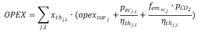

<h1><a class="anchor" id="cm-district-heating-supply-dispatch" href="#cm-district-heating-supply-dispatch"><i class="fa fa-link"></i></a>Despacho de abastecimento de aquecimento distrital da CM</h1><h2><a class="anchor" id="table-of-contents" href="#table-of-contents"><i class="fa fa-link"></i></a> Índice</h2><ul><li> <a href="#in-a-glance">Em um relance</a></li><li> <a href="#introduction">Introdução</a></li><li> <a href="#inputs-and-outputs">Entradas e saídas</a></li><li> <a href="#method">Método</a></li><li> <a href="#github-repository-of-this-calculation-module">Repositório GitHub deste módulo de cálculo</a></li><li> <a href="#sample-run">Execução de amostra</a></li><li> <a href="#how-to-cite">Como citar</a></li><li> <a href="#authors-and-reviewers">Autores e revisores</a></li><li> <a href="#license">Licença</a></li><li> <a href="#acknowledgement">Reconhecimento</a></li></ul><h2><a class="anchor" id="in-a-glance" href="#in-a-glance"><i class="fa fa-link"></i></a> Em um relance</h2>
 Este módulo pode ser executado em dois modos: 1) envio, 2) investimento. No modo de despacho, ele calcula o custo mínimo de operação de um portfólio de tecnologias de fornecimento de calor em um sistema de aquecimento urbano definido para cada hora do ano. As entradas para o módulo são perfis horários para a demanda de calor na rede, para o fornecimento potencial de calor de diferentes fontes e para os preços dos portadores de energia. Além disso, são necessários parâmetros de custo e eficiência para cada tecnologia. O módulo fornece os custos de fornecimento de calor, a parcela de transportadores de energia usados e as emissões implícitas de CO2. No modo de investimento, o módulo otimiza as capacidades das tecnologias de fornecimento de calor instaladas para cobrir a demanda de calor.

 <a href="#table-of-contents"><strong><code>To Top</code></strong></a>
<h2><a class="anchor" id="introduction" href="#introduction"><i class="fa fa-link"></i></a> Introdução</h2>
 Este módulo pode ser executado em dois modos: 1) envio, 2) investimento. No modo de despacho, ele calcula o custo mínimo de operação de um portfólio de tecnologias de fornecimento de calor em um sistema de aquecimento urbano definido para cada hora do ano. As entradas para o módulo são perfis horários para a demanda de calor na rede, para o fornecimento potencial de calor de diferentes fontes e para os preços dos portadores de energia. Além disso, são necessários parâmetros de custo e eficiência para cada tecnologia. O módulo fornece os custos de fornecimento de calor, a parcela de transportadores de energia usados e as emissões implícitas de CO2. No modo de investimento, o módulo otimiza as capacidades das tecnologias de fornecimento de calor instaladas para cobrir a demanda de calor.

 O módulo de despacho do fornecimento de aquecimento urbano é um modelo de despacho que tenta encontrar uma solução de custo otimizado para cobrir a demanda de calor em todas as horas do ano.

 O método aqui descrito deve ser entendido como um primeiro conceito e pode divergir da implementação real (complexidade do modelo, entradas e saídas, etc. devem ser vistas deste ponto de vista). Esta página wiki explica a versão do módulo de cálculo que está integrado à caixa de ferramentas. Uma <strong>versão independente</strong> do módulo de cálculo é muito mais abrangente e pode ser baixada <strong><a href="https://github.com/tuw-eeg/hotmapsDispatch">AQUI</a></strong> . Esta versão requer, no entanto, conhecimento básico de programação Python. A <strong>documentação</strong> da versão autônoma pode ser encontrada <strong><a href="https://hotmapsdispatch.readthedocs.io/en/latest/">AQUI</a></strong> .

 <a href="#table-of-contents"><strong><code>To Top</code></strong></a>
<h2><a class="anchor" id="inputs-and-outputs" href="#inputs-and-outputs"><i class="fa fa-link"></i></a> Entradas e saídas</h2><h3><a class="anchor" id="main-inputs" href="#main-inputs"><i class="fa fa-link"></i></a> Entradas principais</h3>
 O módulo requer uma grande variedade de parâmetros de entrada. Os principais parâmetros de entrada são, entretanto:
<ol><li> Demanda de calor da rede (região selecionada)</li><li> Capacidades instaladas de geradores de calor / armazenamento</li><li> Parâmetros técnicos (eficiências) e financeiros (opex, capex, vida útil) de geradores de calor / armazenamentos</li><li> Perfis (séries temporais da demanda de calor, radiação solar, temperatura, preços da eletricidade, etc.)</li></ol><h3><a class="anchor" id="main-outputs" href="#main-outputs"><i class="fa fa-link"></i></a> Saídas principais</h3>
 Os principais indicadores de saída do módulo de cálculo são:
<ul><li> Custos de geração de calor</li><li> Custos de investimento, operação e combustível</li><li> Mistura de geração de calor por gerador de calor</li><li> Emissões de CO2</li><li> Full Load Hours,</li></ul>
 <strong>NOTA IMPORTANTE</strong> Em Hotmaps, as emissões de biomassa não são consideradas zero porque Hotmaps é uma ferramenta destinada a apoiar a transição energética em andamento. Considerar a biomassa como uma fonte de energia neutra em carbono implica que a queima de biomassa reduz as emissões totais atuais em comparação com a queima de combustíveis fósseis, o que não é verdade. O armazenamento de dióxido de carbono nas árvores ocorre ao longo de décadas, enquanto sua liberação na atmosfera ocorre de uma só vez. Portanto, o balanço líquido de carbono da biomassa é zero no longo prazo, mas não no curto prazo e as medidas de mitigação das mudanças climáticas precisam trazer resultados na redução das emissões de carbono no curto prazo.

 <a href="#table-of-contents"><strong><code>To Top</code></strong></a>
<h2><a class="anchor" id="method" href="#method"><i class="fa fa-link"></i></a> Método</h2>
 O módulo é implementado como um programa linear e pode ser usado por um lado como um modelo de despacho puro e por outro lado para o planejamento de investimento para cobrir um perfil de carga. A função objetivo tenta encontrar o mínimo da diferença entre os custos de fornecimento de calor e as receitas da produção de eletricidade.
<h3><a class="anchor" id="equation-fragments-of-the-linear-program-" href="#equation-fragments-of-the-linear-program-"><i class="fa fa-link"></i></a> Fragmentos de equação do programa linear:</h3>

<h4> <a class="anchor" id="the-total-costs-<code>ctotal<-sub><-code>-yield-from-the-sum-of-" href="#the-total-costs-<code>ctotal<-sub><-code>-yield-from-the-sum-of-"><i class="fa fa-link"></i></a> Os custos totais <code>c total</code> rendimento <code>c total</code> da soma de:</h4><h5> <a class="anchor" id="investment-costs-<code>ic<-code>-installed-capacities-multiplied-by-the-annuities-of-the-specific-investment-costs" href="#investment-costs-<code>ic<-code>-installed-capacities-multiplied-by-the-annuities-of-the-specific-investment-costs"><i class="fa fa-link"></i></a> custos de investimento <code>IC</code> (capacidades instaladas multiplicadas pelas anuidades dos custos de investimento específicos)</h5>

<h5> <a class="anchor" id="captial-costs-<code>cc<-code>--" href="#captial-costs-<code>cc<-code>--"><i class="fa fa-link"></i></a> custos de capital <code>CC</code> :</h5>

<h5> <a class="anchor" id="the-variable-costs-<code>opex<-code>--" href="#the-variable-costs-<code>opex<-code>--"><i class="fa fa-link"></i></a> os custos variáveis <code>OPEX</code> :</h5>

<h5><a class="anchor" id="ramp-costs-of-chp-and-waste-incineration-plants-rough-estimation--" href="#ramp-costs-of-chp-and-waste-incineration-plants-rough-estimation--"><i class="fa fa-link"></i></a> custos de rampa de CHP e plantas de incineração de resíduos (estimativa aproximada):</h5>

<h5><a class="anchor" id="assumed-costs-for-the-peak-electrical-load-in-the-winter-time-rough-estimation-" href="#assumed-costs-for-the-peak-electrical-load-in-the-winter-time-rough-estimation-"><i class="fa fa-link"></i></a> custos assumidos para o pico de carga elétrica no inverno (estimativa aproximada):</h5>

<h4> <a class="anchor" id="the-total-revenues-<code>revtotal<-sub><-code>-yield-from--" href="#the-total-revenues-<code>revtotal<-sub><-code>-yield-from--"><i class="fa fa-link"></i></a> A receita total <code>rev total</code> rendimento <code>rev total</code> de:</h4><h5><a class="anchor" id="the-sale-of-electricity-for-example-from-chp-plants-and-waste-incineration-plants.-" href="#the-sale-of-electricity-for-example-from-chp-plants-and-waste-incineration-plants.-"><i class="fa fa-link"></i></a> a venda de eletricidade (por exemplo, de usinas CHP e usinas de incineração de resíduos):</h5>

 <a href="#table-of-contents"><strong><code>To Top</code></strong></a>
<h4><a class="anchor" id="legend" href="#legend"><i class="fa fa-link"></i></a> lenda</h4>

 <a href="#table-of-contents"><strong><code>To Top</code></strong></a>
<h2><a class="anchor" id="github-repository-of-this-calculation-module" href="#github-repository-of-this-calculation-module"><i class="fa fa-link"></i></a> Repositório GitHub deste módulo de cálculo</h2>
 <a href="https://github.com/HotMaps/dispatch_module/tree/develop">Aqui</a> você obtém o desenvolvimento de ponta para este módulo de cálculo.

 <a href="#table-of-contents"><strong><code>To Top</code></strong></a>
<h2><a class="anchor" id="sample-run" href="#sample-run"><i class="fa fa-link"></i></a> Execução de amostra</h2>
 Depois de selecionar uma região e não fazer alterações nos parâmetros padrão, o modelo será executado no modo de investimento. Isso significa que as capacidades instaladas também são otimizadas para a cobertura de custo ideal da demanda de calor.

 Abaixo você pode ver todos os parâmetros de entrada que podem ser alterados
<h4><a class="anchor" id="output-indicators" href="#output-indicators"><i class="fa fa-link"></i></a> Indicadores de saída</h4><h4><a class="anchor" id="output-charts" href="#output-charts"><i class="fa fa-link"></i></a> Gráficos de saída</h4>
 <a href="#table-of-contents"><strong><code>To Top</code></strong></a>
<h2><a class="anchor" id="how-to-cite" href="#how-to-cite"><i class="fa fa-link"></i></a> Como citar</h2>
 Jeton Hasani, em Hotmaps Wiki, despacho de abastecimento de aquecimento distrital da CM (setembro de 2020)

 <a href="#table-of-contents"><strong><code>To Top</code></strong></a>
<h2><a class="anchor" id="authors-and-reviewers" href="#authors-and-reviewers"><i class="fa fa-link"></i></a> Autores e revisores</h2>
 Esta página foi escrita por Jeton Hasani ( <strong><a href="https://eeg.tuwien.ac.at/">EEG - TU Wien</a></strong> ).

 ☑ Esta página foi revisada por Mostafa Fallahnejad ( <strong><a href="https://eeg.tuwien.ac.at/">EEG - TU Wien</a></strong> ).

 <a href="#table-of-contents"><strong><code>To Top</code></strong></a>
<h2><a class="anchor" id="license" href="#license"><i class="fa fa-link"></i></a> Licença</h2>
 Copyright © 2016-2020: Jeton Hasani

 Licença Creative Commons Atribuição 4.0 Internacional

 Este trabalho está licenciado sob uma Licença Internacional Creative Commons CC BY 4.0.

 SPDX-License-Identifier: CC-BY-4.0

 License-Text: https://spdx.org/licenses/CC-BY-4.0.html

 <a href="#table-of-contents"><strong><code>To Top</code></strong></a>
<h2><a class="anchor" id="acknowledgement" href="#acknowledgement"><i class="fa fa-link"></i></a> Reconhecimento</h2>
 Gostaríamos de transmitir o nosso mais profundo agradecimento ao <a href="https://www.hotmaps-project.eu">Projeto Hotmaps</a> Horizonte 2020 (Contrato de Subvenção n.º 723677), que forneceu o financiamento para a realização da presente investigação.

 <a href="#table-of-contents"><strong><code>To Top</code></strong></a>

<!--- THIS IS A SUPER UNIQUE IDENTIFIER -->

This page was automatically translated. View in another language:

[English](../en/CM-District-heating-supply-dispatch) (original) [Bulgarian](../bg/CM-District-heating-supply-dispatch)\* [Czech](../cs/CM-District-heating-supply-dispatch)\* [Danish](../da/CM-District-heating-supply-dispatch)\* [German](../de/CM-District-heating-supply-dispatch)\* [Greek](../el/CM-District-heating-supply-dispatch)\* [Spanish](../es/CM-District-heating-supply-dispatch)\* [Estonian](../et/CM-District-heating-supply-dispatch)\* [Finnish](../fi/CM-District-heating-supply-dispatch)\* [French](../fr/CM-District-heating-supply-dispatch)\* [Irish](../ga/CM-District-heating-supply-dispatch)\* [Croatian](../hr/CM-District-heating-supply-dispatch)\* [Hungarian](../hu/CM-District-heating-supply-dispatch)\* [Italian](../it/CM-District-heating-supply-dispatch)\* [Lithuanian](../lt/CM-District-heating-supply-dispatch)\* [Latvian](../lv/CM-District-heating-supply-dispatch)\* [Maltese](../mt/CM-District-heating-supply-dispatch)\* [Dutch](../nl/CM-District-heating-supply-dispatch)\* [Polish](../pl/CM-District-heating-supply-dispatch)\*  [Romanian](../ro/CM-District-heating-supply-dispatch)\* [Slovak](../sk/CM-District-heating-supply-dispatch)\* [Slovenian](../sl/CM-District-heating-supply-dispatch)\* [Swedish](../sv/CM-District-heating-supply-dispatch)\* 

\* machine translated
