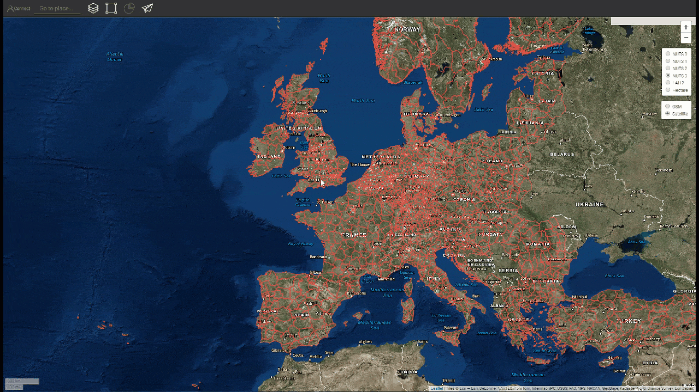

<h1><a class="anchor" id="introduction-to-user-interface" href="#introduction-to-user-interface"><i class="fa fa-link"></i></a>Introdução à interface do usuário</h1><h2><a class="anchor" id="table-of-contents" href="#table-of-contents"><i class="fa fa-link"></i></a> Índice</h2><ul><li>
 <a href="#introduction-page">Página de introdução</a>
</li><li>
 <a href="#upper-toolbar">Barra de Ferramentas Superior</a>
<ul><li> <a href="#upper-toolbar_connect">Conectar</a><ul><li> <a href="#upper-toolbar_connect_login">Conecte-se</a></li><li> <a href="#upper-toolbar_connect_register">Registro</a></li><li> <a href="#upper-toolbar_connect_recover">Recuperar</a></li></ul></li><li> <a href="#upper-toolbar_go-to-place">Vá para o lugar</a></li><li> <a href="#upper-toolbar_layers">Camadas</a></li><li> <a href="#upper-toolbar_selection-tools">Ferramentas de Seleção</a></li><li> <a href="#upper-toolbar_show-result">Mostrar resultado</a></li><li> <a href="#upper-toolbar_feedback">Comentários</a></li><li> <a href="#upper-toolbar_save-session">Salvar Sessão</a></li><li> <a href="#upper-toolbar_save-session-folder">Salvar pasta de sessão</a></li></ul></li><li>
 <a href="#tiles">Azulejos</a>
</li><li>
 <a href="#how-to-cite">Como citar</a>
</li><li>
 <a href="#authors-and-reviewers">Autores e revisores</a>
</li><li>
 <a href="#license">Licença</a>
</li><li>
 <a href="#acknowledgement">Reconhecimento</a>
</li></ul><h2><a class="anchor" id="introduction-page" href="#introduction-page"><i class="fa fa-link"></i></a> Página de introdução</h2>
 Depois que a caixa de ferramentas é aberta, a página de isenção de direitos é exibida. Além da mensagem de isenção de responsabilidade, são fornecidas informações adicionais sobre os navegadores suportados, os objetivos do projeto Hotmaps, o link para o site do projeto Hotmaps e os repositórios de dados.

 <em>Fig. 1 Breve introdução à caixa de ferramentas Hotmaps</em>

 A GUI do Hotmaps é uma interface baseada em GIS. Ao fechar a página de renúncia, o usuário vê o mapa da Europa. Por padrão, o mapa de densidade de demanda de calor dos países da UE-28 e os limites NUTS 2 são representados. Além desses dois mapas, algumas ferramentas e botões podem ser vistos na GUI. Essas ferramentas são ilustradas na figura a seguir.

 <em>Fig. 2 Página inicial</em>

 Aqui você pode identificar, à primeira vista, 3 partes da interface do usuário:
<ol><li> <a href="#upper-toolbar">uma barra de ferramentas no canto superior esquerdo</a> ,</li><li> o próprio mapa,</li><li> <a href="#tiles">algumas ferramentas para mudar o estilo do mapa</a> .</li><li> dois links no canto superior direito: para este <a href="https://wiki.hotmaps.eu/">Wiki do Hotmaps</a> e para o <a href="https://www.hotmaps-project.eu/">site do Projeto Hotmaps</a> .</li></ol>
 Nos capítulos seguintes, os primeiros 3 pontos são explicados em detalhes.

 <a href="#table-of-contents"><strong><code>To Top</code></strong></a>
<h2><a class="anchor" id="upper-toolbar" href="#upper-toolbar"><i class="fa fa-link"></i></a> Barra de Ferramentas Superior</h2>

 Com esta barra de ferramentas, você pode:
<ol><li> <a href="#upper-toolbar_connect"><em>Conecte-</em></a> se <a href="#upper-toolbar_connect"><em>:</em></a> registre <a href="#upper-toolbar_connect"><em>-</em></a> se e faça login no aplicativo da web para salvar seu trabalho,</li><li> <a href="#upper-toolbar_go-to-place"><em>Ir para o lugar:</em></a> amplie uma região específica digitando o nome,</li><li> <a href="#upper-toolbar_layers"><em>Camadas:</em></a> mostra a barra lateral da camada,</li><li> <a href="#upper-toolbar_selection-tools"><em>Ferramentas de seleção</em> :</a> habilite ou desabilite as ferramentas de seleção,</li><li> <a href="#upper-toolbar_show-result"><em>Mostrar resultado:</em></a> mostra a barra lateral de resultados de suas regiões selecionadas,</li><li> <a href="#upper-toolbar_feedback"><em>Feedback:</em></a> dê-nos feedback sobre a ferramenta,</li><li> <a href="#upper-toolbar_save-session"><em>Salvar sessão:</em></a> você pode salvar as camadas selecionadas e o nível de zoom e recuperá-los mais tarde,</li><li> <a href="#upper-toolbar_save-session-folder"><em>Salvar pasta de sessão:</em></a> onde você pode ver a lista de todas as sessões salvas.</li></ol>
 <a href="#table-of-contents"><strong><code>To Top</code></strong></a>
<h3><a class="anchor" id="connect" href="#connect"><i class="fa fa-link"></i></a> Conectar</h3>
 Aqui você pode:
<ul><li> Crie a sua conta aqui</li><li> Faça login em sua conta para salvar seu progresso</li><li> Ou redefina sua senha caso a esqueça</li></ul>
 <a href="#table-of-contents"><strong><code>To Top</code></strong></a>
<h4><a class="anchor" id="login" href="#login"><i class="fa fa-link"></i></a> Conecte-se</h4>
 Depois de <a href="#register">registrar</a> e ativar sua conta, você poderá fazer o login com seu e-mail e senha (ver <a href="#fig4">Fig.4</a> abaixo).

 <em>Fig.4 .: Formulário de Login</em>

 <a href="#table-of-contents"><strong><code>To Top</code></strong></a>
<h4><a class="anchor" id="register" href="#register"><i class="fa fa-link"></i></a> Registro</h4>
 Aqui você pode criar uma conta para o site <em>hotmaps</em> . Após o envio do <a href="#fig5">formulário,</a> você receberá um e-mail para ativação de sua conta. Com sua conta, você poderá salvar seu progresso.

 <em>Fig.5 .: Formulário de Registro</em>

 <a href="#table-of-contents"><strong><code>To Top</code></strong></a>
<h4><a class="anchor" id="recover" href="#recover"><i class="fa fa-link"></i></a> Recuperar</h4>
 Se você esquecer sua senha, você pode recuperá-la neste menu (ver <a href="#fig6">Fig.6</a> abaixo). Lembre-se de definir uma nova senha posteriormente.

 <em>Fig.6 .: Formulário de Recuperação</em>

 <a href="#table-of-contents"><strong><code>To Top</code></strong></a>
<h3><a class="anchor" id="go-to-place" href="#go-to-place"><i class="fa fa-link"></i></a> Vá para o lugar</h3>
 Você pode aplicar zoom a uma região especificada digitando seu nome (veja a animação abaixo)

 <a href="#table-of-contents"><strong><code>To Top</code></strong></a>
<h3><a class="anchor" id="layers" href="#layers"><i class="fa fa-link"></i></a> Camadas</h3>
 Ao pressionar este botão, uma barra lateral com diferentes tipos de camadas é mostrada à esquerda.

 As seguintes camadas podem ser encontradas e visualizadas:

 <a href="#table-of-contents"><strong><code>To Top</code></strong></a>
<h3><a class="anchor" id="selection-tools" href="#selection-tools"><i class="fa fa-link"></i></a> Ferramentas de Seleção</h3>
 Ao pressionar este botão, as ferramentas de seleção aparecerão à esquerda da tela

 A figura abaixo mostra a aparência das ferramentas:

<ol><li> Ferramenta para a seleção de regiões</li><li> Crie uma região quadrada personalizada</li><li> Crie uma região de círculo personalizada</li><li> Crie uma região poligonal personalizada</li><li> Faça upload de um objeto GeoJSON para usar uma seleção de área personalizada</li></ol><ol type="A"><li> mostra quantas regiões você selecionou</li><li> mostra a superfície geral do menor retângulo que pode cobrir a área selecionada</li><li> mostra a escala que você selecionou da barra de ferramentas direita</li></ol><ol type="a"><li> botão para carregar os resultados de sua região selecionada e camadas selecionadas</li><li> botão para deletar uma região selecionada</li></ol>
 <a href="#table-of-contents"><strong><code>To Top</code></strong></a>
<h3><a class="anchor" id="show-result" href="#show-result"><i class="fa fa-link"></i></a> Mostrar resultado</h3>
 Dependendo das camadas e da região que você selecionou, os resultados da sua configuração são mostrados em uma barra lateral à direita da tela

 <a href="#table-of-contents"><strong><code>To Top</code></strong></a>
<h3><a class="anchor" id="feedback" href="#feedback"><i class="fa fa-link"></i></a> Comentários</h3>
 Você tem alguma sugestão de como melhorar a ferramenta? Você notou algum erro? Por favor nos informe! Ao nos fornecer feedback, você pode nos ajudar a melhorar a caixa de ferramentas!

 Por favor, preencha o <a href="#Fig7">formulário</a> abaixo:

 <a href="#table-of-contents"><strong><code>To Top</code></strong></a>

 você pode escolher entre os seguintes tipos:

 e definir uma prioridade:

 <a href="#table-of-contents"><strong><code>To Top</code></strong></a>
<h3><a class="anchor" id="save-session" href="#save-session"><i class="fa fa-link"></i></a> Salvar Sessão</h3>
 você pode fazer um instantâneo do seu trabalho (áreas e camadas selecionadas, níveis de zoom, etc.) pressionando este botão. Você também pode definir um nome e uma descrição do instantâneo.
<h3><a class="anchor" id="save-session-folder" href="#save-session-folder"><i class="fa fa-link"></i></a> Salvar pasta de sessão</h3>
 Aqui você vê todos os seus instantâneos com seus nomes e descrição. Quando você seleciona uma das camadas selecionadas, áreas, o nível de zoom e outras configurações são carregados.
<h2><a class="anchor" id="tiles" href="#tiles"><i class="fa fa-link"></i></a> Azulejos</h2>
 Você pode escolher a escala territorial que deseja analisar (regiões NUTS ou nível de hectare) e definir o bloco do mapa

 Existem as seguintes configurações possíveis

<ol><li> Amplie e afaste o mapa</li><li> Mostre os limites NUTS para selecionar regiões NUTS específicas ou use hectares para personalizar sua <a href="#upper-toolbar_selection-tools">seleção</a></li><li> Use bloco do OpenStreetMap ou bloco de satélite</li></ol>
 <a href="#table-of-contents"><strong><code>To Top</code></strong></a>
<h2><a class="anchor" id="how-to-cite" href="#how-to-cite"><i class="fa fa-link"></i></a> Como citar</h2>
 Jeton Hasani, em Hotmaps-Wiki, Introdução à interface do usuário (abril de 2019)

 <a href="#table-of-contents"><strong><code>To Top</code></strong></a>
<h2><a class="anchor" id="authors-and-reviewers" href="#authors-and-reviewers"><i class="fa fa-link"></i></a> Autores e revisores</h2>
 Esta página foi escrita por Jeton Hasani <strong><a href="https://eeg.tuwien.ac.at/">EEG - TU Wien</a></strong> .

 ☑ Esta página foi revisada por Mostafa Fallahnejad <strong><a href="https://eeg.tuwien.ac.at/">EEG - TU Wien</a></strong> .

 <a href="#table-of-contents"><strong><code>To Top</code></strong></a>
<h2><a class="anchor" id="license" href="#license"><i class="fa fa-link"></i></a> Licença</h2>
 Copyright © 2016-2020: Jeton Hasani

 Licença Creative Commons Atribuição 4.0 Internacional

 Este trabalho está licenciado sob uma Licença Internacional Creative Commons CC BY 4.0.

 SPDX-License-Identifier: CC-BY-4.0

 License-Text: https://spdx.org/licenses/CC-BY-4.0.html

 <a href="#table-of-contents"><strong><code>To Top</code></strong></a>
<h2><a class="anchor" id="acknowledgement" href="#acknowledgement"><i class="fa fa-link"></i></a> Reconhecimento</h2>
 Gostaríamos de transmitir o nosso mais profundo agradecimento ao <a href="https://www.hotmaps-project.eu">Projeto Hotmaps</a> Horizonte 2020 (Contrato de Subvenção n.º 723677), que proporcionou o financiamento para a realização da presente investigação.

 <a href="#table-of-contents"><strong><code>To Top</code></strong></a>

<!--- THIS IS A SUPER UNIQUE IDENTIFIER -->

This page was automatically translated. View in another language:

[English](../en/Introduction-to-user-interface) (original) [Bulgarian](../bg/Introduction-to-user-interface)\* [Czech](../cs/Introduction-to-user-interface)\* [Danish](../da/Introduction-to-user-interface)\* [German](../de/Introduction-to-user-interface)\* [Greek](../el/Introduction-to-user-interface)\* [Spanish](../es/Introduction-to-user-interface)\* [Estonian](../et/Introduction-to-user-interface)\* [Finnish](../fi/Introduction-to-user-interface)\* [French](../fr/Introduction-to-user-interface)\* [Irish](../ga/Introduction-to-user-interface)\* [Croatian](../hr/Introduction-to-user-interface)\* [Hungarian](../hu/Introduction-to-user-interface)\* [Italian](../it/Introduction-to-user-interface)\* [Lithuanian](../lt/Introduction-to-user-interface)\* [Latvian](../lv/Introduction-to-user-interface)\* [Maltese](../mt/Introduction-to-user-interface)\* [Dutch](../nl/Introduction-to-user-interface)\* [Polish](../pl/Introduction-to-user-interface)\*  [Romanian](../ro/Introduction-to-user-interface)\* [Slovak](../sk/Introduction-to-user-interface)\* [Slovenian](../sl/Introduction-to-user-interface)\* [Swedish](../sv/Introduction-to-user-interface)\* 

\* machine translated
