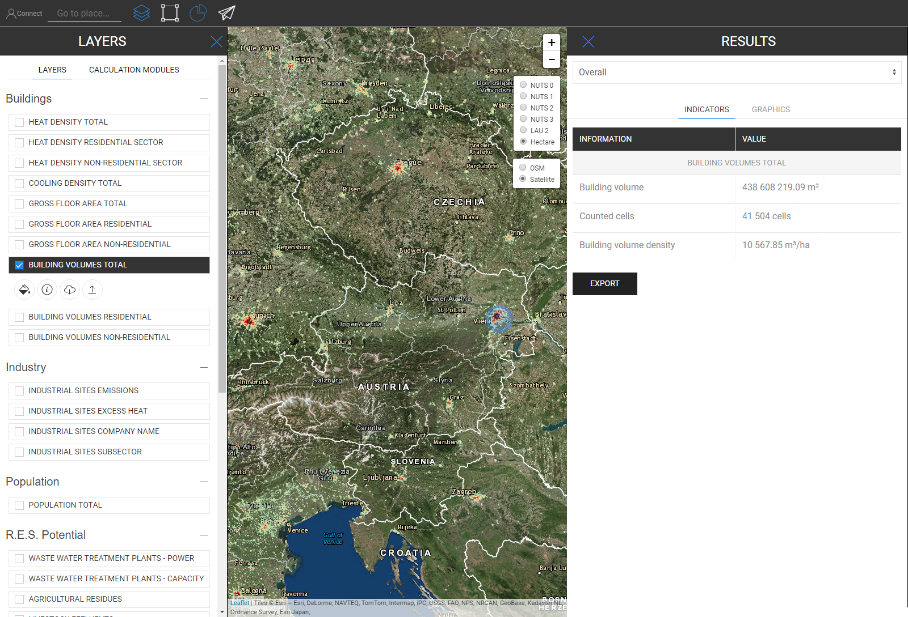
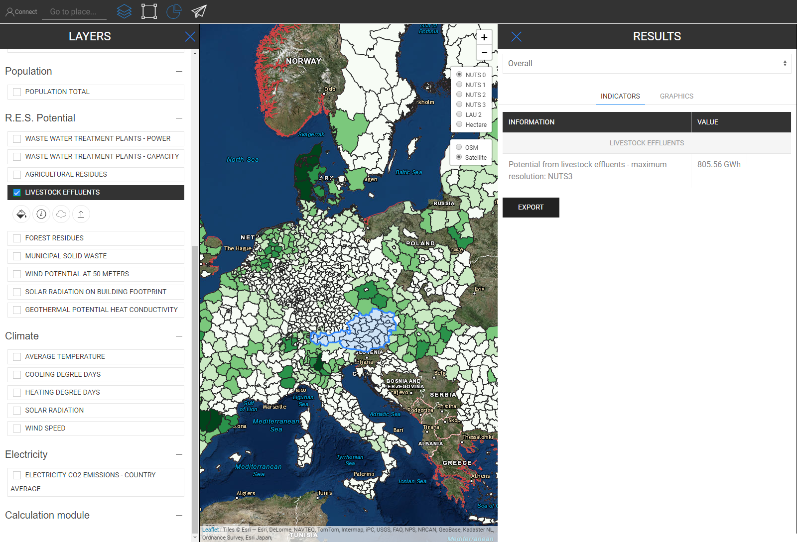

<h1><a class="anchor" id="retrieve-indicators-of-a-selected-area" href="#retrieve-indicators-of-a-selected-area"><i class="fa fa-link"></i></a>Recuperar indicadores de uma área selecionada</h1><h2><a class="anchor" id="table-of-contents" href="#table-of-contents"><i class="fa fa-link"></i></a> Índice</h2><ul><li> <a href="#introduction">Introdução</a></li><li> <a href="#indicators-for-raster-layers">Indicadores para camadas raster</a><ul><li> <a href="#indicators-for-raster-layers_buildings">Edifícios</a></li><li> <a href="#indicators-for-raster-layers_population">População</a></li><li> <a href="#indicators-for-raster-layers_renewable-energy-source-potentials">Potenciais de fonte de energia renovável</a></li></ul></li><li> <a href="#indicators-for-vector-layers">Indicadores para camadas vetoriais</a><ul><li> <a href="#indicators-for-vector-layers_industry">Indústria</a></li><li> <a href="#indicators-for-vector-layers_renewable-energy-source-potentials">Potenciais de fonte de energia renovável</a></li><li> <a href="#indicators-for-vector-layers_electricity">Eletricidade</a></li></ul></li><li> <a href="#example">Exemplo</a></li><li> <a href="#how-to-cite">Como citar</a></li><li> <a href="#authors-and-reviewers">Autores e revisores</a></li><li> <a href="#license">Licença</a></li><li> <a href="#acknowledgement">Reconhecimento</a></li></ul><h2><a class="anchor" id="introduction" href="#introduction"><i class="fa fa-link"></i></a> Introdução</h2>
 Dependendo das camadas e da região que você selecionou, os indicadores para a sua configuração são mostrados em uma barra lateral à direita da tela

 <a href="#table-of-contents"><strong><code>To Top</code></strong></a>

 A seguir, veremos os indicadores que são exibidos para camadas raster e vetoriais.
<h2><a class="anchor" id="indicators-for-raster-layers" href="#indicators-for-raster-layers"><i class="fa fa-link"></i></a> Indicadores para camadas raster</h2>
 Os indicadores nas camadas raster são diferentes das camadas vetoriais. Com diferente, queremos dizer em termos de agregação e desagregação. Esse comportamento diferente vem de resoluções territoriais.

 As camadas raster geralmente têm uma resolução muito mais alta, enquanto as camadas vetoriais têm apenas atributos em pontos ou polígonos.

 Isso significa por um lado, por exemplo, que se você selecionar uma camada vetorial que é definida por polígonos NUTS3 e quiser, por exemplo, selecionar uma região LAU, o valor NUTS3 não será desagregado para o nível LAU, em vez disso, o indicador NUTS3 onde este A região LAU está localizada será mostrada na barra lateral de resultados.

 Por outro lado, as camadas raster são agregadas e desagregadas &quot;arbitrariamente&quot; *

 * pelas células que contêm dentro da região que você selecionou (naturalmente dentro do limite da própria resolução de raster)

 <a href="#table-of-contents"><strong><code>To Top</code></strong></a>
<h3><a class="anchor" id="buildings" href="#buildings"><i class="fa fa-link"></i></a> Edifícios</h3>
 <strong>Mapa de densidade de calor</strong>

 <strong>Recurso Extra</strong>

 Quando você seleciona a camada de densidade de calor e a Camada de população ao mesmo tempo, um indicador extra é mostrado (veja a imagem abaixo)

 <a href="#table-of-contents"><strong><code>To Top</code></strong></a>
<h3><a class="anchor" id="in-general-" href="#in-general-"><i class="fa fa-link"></i></a> Em geral:</h3>
 Quando uma das camadas de construção e a camada de população são selecionadas ao mesmo tempo, um indicador extra será mostrado conforme descrito antes

<ins> <code><strong><a href="#indicators-for-raster-layers">To Chapter</a></strong></code></ins>

 <strong>Mapa de densidade de resfriamento</strong>

<ins> <code><strong><a href="#indicators-for-raster-layers">To Chapter</a></strong></code></ins>

 <strong>Volumes de construção</strong>

<ins> <code><strong><a href="#indicators-for-raster-layers">To Chapter</a></strong></code></ins>

 <strong>Área bruta de piso</strong>

<ins> <code><strong><a href="#indicators-for-raster-layers">To Chapter</a></strong></code></ins> <a href="#table-of-contents"><strong><code>To Top</code></strong></a>
<h3><a class="anchor" id="population" href="#population"><i class="fa fa-link"></i></a> População</h3>

<ins> <code><strong><a href="#indicators-for-raster-layers">To Chapter</a></strong></code></ins> <a href="#table-of-contents"><strong><code>To Top</code></strong></a>
<h3><a class="anchor" id="climate" href="#climate"><i class="fa fa-link"></i></a> Clima</h3>
 <strong>Temperatura</strong>

<ins> <code><strong><a href="#indicators-for-raster-layers">To Chapter</a></strong></code></ins>

 <strong>Grau-dias de resfriamento</strong>

<ins> <code><strong><a href="#indicators-for-raster-layers">To Chapter</a></strong></code></ins>

 <strong>Grau-dias de aquecimento</strong>

<ins> <code><strong><a href="#indicators-for-raster-layers">To Chapter</a></strong></code></ins>

 <strong>Radiação solar</strong>

<ins> <code><strong><a href="#indicators-for-raster-layers">To Chapter</a></strong></code></ins>

 <strong>Velocidade do vento</strong>

<ins> <code><strong><a href="#indicators-for-raster-layers">To Chapter</a></strong></code></ins> <a href="#table-of-contents"><strong><code>To Top</code></strong></a>
<h3><a class="anchor" id="renewable-energy-source-potentials" href="#renewable-energy-source-potentials"><i class="fa fa-link"></i></a> Potenciais de fonte de energia renovável</h3>
 <strong>Radiação solar na pegada do edifício</strong>

<ins> <code><strong><a href="#indicators-for-raster-layers">To Chapter</a></strong></code></ins>

 <strong>Potencial de vento a 50m</strong>

<ins> <code><strong><a href="#indicators-for-raster-layers">To Chapter</a></strong></code></ins>

 <strong>Resíduos Florestais</strong>

<ins> <code><strong><a href="#indicators-for-raster-layers">To Chapter</a></strong></code></ins> <a href="#table-of-contents"><strong><code>To Top</code></strong></a>
<h2><a class="anchor" id="indicators-for-vector-layers" href="#indicators-for-vector-layers"><i class="fa fa-link"></i></a> Indicadores para camadas vetoriais</h2><h3><a class="anchor" id="industry" href="#industry"><i class="fa fa-link"></i></a> Indústria</h3>
 <strong>Emissões de instalações industriais</strong>

<ins> <code><strong><a href="#indicators-for-vector-layers">To Chapter</a></strong></code></ins>

 <strong>Excesso de calor do local industrial</strong>

<ins> <code><strong><a href="#indicators-for-vector-layers">To Chapter</a></strong></code></ins>

 <strong>Nome da empresa local industrial</strong>

<ins> <code><strong><a href="#indicators-for-vector-layers">To Chapter</a></strong></code></ins>

 <strong>Subsetor de local industrial</strong>

<ins> <code><strong><a href="#indicators-for-vector-layers">To Chapter</a></strong></code></ins> <a href="#table-of-contents"><strong><code>To Top</code></strong></a>
<h3><a class="anchor" id="renewable-energy-source-potentials" href="#renewable-energy-source-potentials"><i class="fa fa-link"></i></a> Potenciais de fonte de energia renovável</h3>
 <strong>Energia de usinas de tratamento de águas residuais</strong>

<ins> <code><strong><a href="#indicators-for-vector-layers">To Chapter</a></strong></code></ins>

 <strong>Capacidade das estações de tratamento de águas residuais</strong>

<ins> <code><strong><a href="#indicators-for-vector-layers">To Chapter</a></strong></code></ins>

 <strong>Resíduos Agrícolas</strong>

<ins> <code><strong><a href="#indicators-for-vector-layers">To Chapter</a></strong></code></ins>

 <strong>Efluentes de gado</strong>

<ins> <code><strong><a href="#indicators-for-vector-layers">To Chapter</a></strong></code></ins>

 <strong>Resíduos sólidos municipais</strong>

<ins> <code><strong><a href="#indicators-for-vector-layers">To Chapter</a></strong></code></ins>

 <strong>Potencial geotérmico de condutividade de calor</strong>

<ins> <code><strong><a href="#indicators-for-vector-layers">To Chapter</a></strong></code></ins> <a href="#table-of-contents"><strong><code>To Top</code></strong></a>
<h3><a class="anchor" id="electricity" href="#electricity"><i class="fa fa-link"></i></a> Eletricidade</h3>
 <strong>Emissões de C02 de eletricidade</strong>

<ins> <code><strong><a href="#indicators-for-vector-layers">To Chapter</a></strong></code></ins> <a href="#table-of-contents"><strong><code>To Top</code></strong></a>
<h2><a class="anchor" id="example" href="#example"><i class="fa fa-link"></i></a> Exemplo</h2>
 Na imagem abaixo você pode ver como fica quando todas as camadas são visualizadas (aqui está a Áustria como NUTS0 selecionado)

 Embora este mapa possa parecer um pouco confuso à primeira vista, seus indicadores são ilustrados de maneira direta. Veja abaixo todos os indicadores que são descritos na barra lateral de resultados ao selecionar todas as camadas para a Áustria (NUTS0)

 <a href="#table-of-contents"><strong><code>To Top</code></strong></a>
<h2><a class="anchor" id="how-to-cite" href="#how-to-cite"><i class="fa fa-link"></i></a> Como citar</h2>
 Jeton Hasani, em Hotmaps-Wiki, Retrieve-indicadores-of-a-selected-area (abril de 2019)

 <a href="#table-of-contents"><strong><code>To Top</code></strong></a>
<h2><a class="anchor" id="authors-and-reviewers" href="#authors-and-reviewers"><i class="fa fa-link"></i></a> Autores e revisores</h2>
 Esta página foi escrita por Jeton Hasani <strong><a href="https://eeg.tuwien.ac.at/">EEG - TU Wien</a></strong> .

 ☑ Esta página foi revisada por Mostafa Fallahnejad <strong><a href="https://eeg.tuwien.ac.at/">EEG - TU Wien</a></strong> .

 <a href="#table-of-contents"><strong><code>To Top</code></strong></a>
<h2><a class="anchor" id="license" href="#license"><i class="fa fa-link"></i></a> Licença</h2>
 Copyright © 2016-2020: Jeton Hasani

 Licença Creative Commons Atribuição 4.0 Internacional

 Este trabalho está licenciado sob uma Licença Internacional Creative Commons CC BY 4.0.

 SPDX-License-Identifier: CC-BY-4.0

 License-Text: https://spdx.org/licenses/CC-BY-4.0.html

 <a href="#table-of-contents"><strong><code>To Top</code></strong></a>
<h2><a class="anchor" id="acknowledgement" href="#acknowledgement"><i class="fa fa-link"></i></a> Reconhecimento</h2>
 Gostaríamos de transmitir o nosso mais profundo agradecimento ao <a href="https://www.hotmaps-project.eu">Projeto Hotmaps</a> Horizonte 2020 (Contrato de Subvenção n.º 723677), que forneceu o financiamento para a realização da presente investigação.

 <a href="#table-of-contents"><strong><code>To Top</code></strong></a> <code><a href="Indicator-Section/_edit">Review this page</a></code>

<!--- THIS IS A SUPER UNIQUE IDENTIFIER -->

This page was automatically translated. View in another language:

[English](../en/Retrieve-indicators-of-a-selected-area) (original) [Bulgarian](../bg/Retrieve-indicators-of-a-selected-area)\* [Czech](../cs/Retrieve-indicators-of-a-selected-area)\* [Danish](../da/Retrieve-indicators-of-a-selected-area)\* [German](../de/Retrieve-indicators-of-a-selected-area)\* [Greek](../el/Retrieve-indicators-of-a-selected-area)\* [Spanish](../es/Retrieve-indicators-of-a-selected-area)\* [Estonian](../et/Retrieve-indicators-of-a-selected-area)\* [Finnish](../fi/Retrieve-indicators-of-a-selected-area)\* [French](../fr/Retrieve-indicators-of-a-selected-area)\* [Irish](../ga/Retrieve-indicators-of-a-selected-area)\* [Croatian](../hr/Retrieve-indicators-of-a-selected-area)\* [Hungarian](../hu/Retrieve-indicators-of-a-selected-area)\* [Italian](../it/Retrieve-indicators-of-a-selected-area)\* [Lithuanian](../lt/Retrieve-indicators-of-a-selected-area)\* [Latvian](../lv/Retrieve-indicators-of-a-selected-area)\* [Maltese](../mt/Retrieve-indicators-of-a-selected-area)\* [Dutch](../nl/Retrieve-indicators-of-a-selected-area)\* [Polish](../pl/Retrieve-indicators-of-a-selected-area)\*  [Romanian](../ro/Retrieve-indicators-of-a-selected-area)\* [Slovak](../sk/Retrieve-indicators-of-a-selected-area)\* [Slovenian](../sl/Retrieve-indicators-of-a-selected-area)\* [Swedish](../sv/Retrieve-indicators-of-a-selected-area)\* 

\* machine translated
