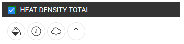

<h2> Cuprins </h2><ul><li> <a href="#Introduction">Introducere</a> </li><li> <a href="#How-to-export-a-dataset">Cum să exporti un set de date</a> </li><li> <a href="#References">Referințe</a> </li><li> <a href="#How-to-cite">Cum să cităm</a> </li><li> <a href="#Authors-and-reviewers">Autori și recenzori</a> </li><li> <a href="#Acknowledgement">Confirmare</a> </li></ul><h2> Introducere </h2>
 Cutia de instrumente Hotmaps permite oricui să exporte o parte dintr-un strat / set de date. 

 Această caracteristică necesită cunoștințe de utilizare de bază despre selecție și niveluri. 

 Dacă aveți dificultăți, citiți următoarele ghiduri: 
<ul><li> <a href="How-to-select-a-region-in-the-Hotmaps-toolbox">Cum să selectați o regiune în caseta de instrumente Hotmaps</a> </li><li> <a href="Layer-section">Selectarea stratului</a> </li></ul>
<ins> <code><strong><a href="#table-of-contents">To Top</a></strong></code> </ins> 
<h2> Cum să exporti un set de date </h2><ol><li>
 Selectați stratul pe care doriți să-l exportați în lista straturilor (panoul din stânga) 
</li><li>
 Selectați scala de selectare din dreapta hărții (NUTS / LAU / hectar) 
</li><li>
 Selectați regiunea dorită cu instrumentele de selecție 
</li><li>
 Odată ce selecția este în regulă, faceți clic pe butonul  butonul de sub numele stratului de pe panoul din stânga pentru a începe procesul de descărcare. 

</li><li>
 Odată terminat, veți primi un fișier .tif pe computer 
</li></ol>
 Odată ce toți acești pași sunt realizați, veți avea un export al unuia dintre straturi. 

 Puteți apoi să-l utilizați cu propriile instrumente și chiar să-l editați pentru a-l importa înapoi pe platformă (consultați <a href="Data_upload">Încărcare de date</a> pentru indicații despre cum se face). 

<ins> <code><strong><a href="#table-of-contents">To Top</a></strong></code> </ins> 
<h2> Referințe </h2>
<ins> <code><strong><a href="#table-of-contents">To Top</a></strong></code> </ins> 
<h2> Cum să cităm </h2>
<ins> <code><strong><a href="#table-of-contents">To Top</a></strong></code> </ins> 
<h2> Autori și recenzori </h2>
 Autori: 
<ul><li> Daniel Hunacek </li><li> Lucien Zuber </li></ul>
 Referenți: 

<ins> <code><strong><a href="#table-of-contents">To Top</a></strong></code> </ins> 
<h2> Confirmare </h2>
 Am dori să transmitem aprecierile noastre cele mai profunde <a href="https://www.hotmaps-project.eu">proiectului de hărți hot-uri</a> Orizont 2020 (Acordul de finanțare nr. 723677), care a oferit finanțarea pentru realizarea prezentei investigații 

<ins> <code><strong><a href="#table-of-contents">To Top</a></strong></code> </ins> 

This page was automatically translated. View in another language:

[English](../en/Data-export-functionalities.md) (original) [Bulgarian](../bg/Data-export-functionalities.md)\* [Croatian](../hr/Data-export-functionalities.md)\* [Czech](../cs/Data-export-functionalities.md)\* [Danish](../da/Data-export-functionalities.md)\* [Dutch](../nl/Data-export-functionalities.md)\* [Estonian](../et/Data-export-functionalities.md)\* [Finnish](../fi/Data-export-functionalities.md)\* [French](../fr/Data-export-functionalities.md)\* [German](../de/Data-export-functionalities.md)\* [Greek](../el/Data-export-functionalities.md)\* [Hungarian](../hu/Data-export-functionalities.md)\* [Irish](../ga/Data-export-functionalities.md)\* [Italian](../it/Data-export-functionalities.md)\* [Latvian](../lv/Data-export-functionalities.md)\* [Lithuanian](../lt/Data-export-functionalities.md)\* [Maltese](../mt/Data-export-functionalities.md)\* [Polish](../pl/Data-export-functionalities.md)\* [Portuguese (Portugal, Brazil)](../pt/Data-export-functionalities.md)\*  [Slovak](../sk/Data-export-functionalities.md)\* [Slovenian](../sl/Data-export-functionalities.md)\* [Spanish](../es/Data-export-functionalities.md)\* [Swedish](../sv/Data-export-functionalities.md)\* 

\*: machine translated
