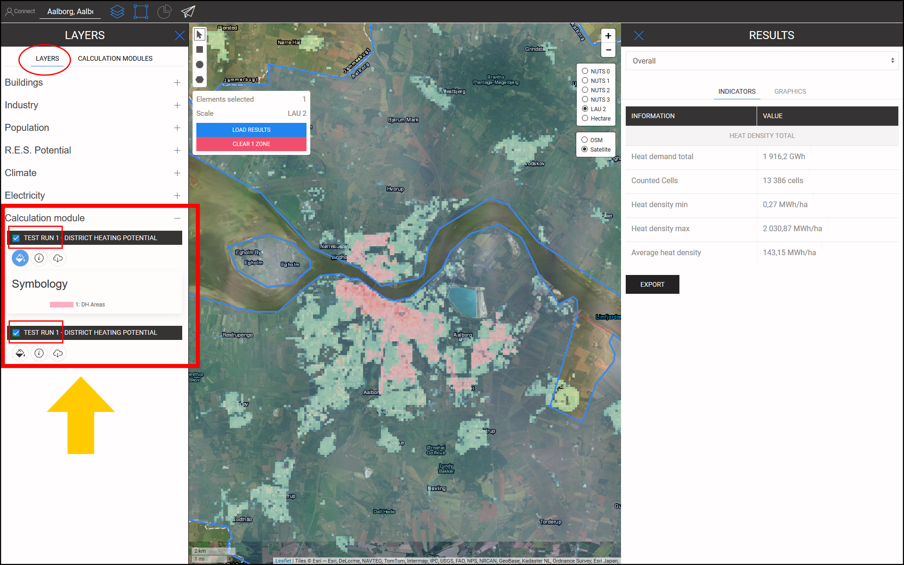

<h1><a class="anchor" id="cm-district-heating-potential-areas-user-defined-thresholds" href="#cm-district-heating-potential-areas-user-defined-thresholds"><i class="fa fa-link"></i></a>CM Potențiale definite de utilizator pentru zonele potențiale de încălzire centralizată</h1><h2><a class="anchor" id="table-of-contents" href="#table-of-contents"><i class="fa fa-link"></i></a> Cuprins</h2><ul><li> <a href="#in-a-glance">Într-o privire</a></li><li> <a href="#introduction">Introducere</a></li><li> <a href="#inputs-and-outputs">Intrări și ieșiri</a></li><li> <a href="#method">Metodă</a></li><li> <a href="#github-repository-of-this-calculation-module">Depozitul GitHub al acestui modul de calcul</a></li><li> <a href="#sample-run">Exemplu de rulare</a><ul><li> <a href="#sample-run_test-run-1-default-input-values">Test Run 1: valori implicite de intrare</a></li><li> <a href="#sample-run_test-run-2-modified-input-values">Test Run 2: valori de intrare modificate</a></li></ul></li><li> <a href="#how-to-cite">Cum se citează</a></li><li> <a href="#authors-and-reviewers">Autori și recenzori</a></li><li> <a href="#license">Licență</a></li><li> <a href="#acknowledgement">Confirmare</a></li></ul><h2><a class="anchor" id="in-a-glance" href="#in-a-glance"><i class="fa fa-link"></i></a> Într-o privire</h2>
 Acest modul de calcul calculează potențialul de încălzire urbană în regiunea selectată utilizând 2 valori prag: 1) Cererea minimă de căldură în fiecare hectar, 2) Cererea minimă de căldură într-o zonă DH. Zonele din regiunea selectată, care îndeplinesc aceste condiții, sunt returnate ca zone DH. Mai mult, cererea de căldură din aceste regiuni revine sub formă de indicatori ca potențial de DH.

 <a href="#table-of-contents"><strong><code>To Top</code></strong></a>
<h2><a class="anchor" id="introduction" href="#introduction"><i class="fa fa-link"></i></a> Introducere</h2>
 Cererea de căldură joacă un rol important în determinarea zonelor potențiale de încălzire urbană (DH). De exemplu, implementarea încălzirii urbane în zonele cu cerere redusă de căldură nu este viabilă din punct de vedere economic. Pe de altă parte, definirea oricărei zone cu densitate ridicată a cererii de căldură ca zonă DH potențială poate fi, de asemenea, inexactă. O densitate ridicată a cererii de căldură într-o zonă s-ar putea datora prezenței câtorva consumatori cu o cerere foarte mare de căldură în acea zonă. Dimpotrivă, o densitate medie scăzută a cererii de căldură ar putea fi un semn al zonelor cu o cerere foarte mică de căldură în zona selectată. Scopul modulului de calcul „CM - ZONA POTENȚIALĂ DE ÎNCĂLZIRE A DISTRICTULUI: PRAGUL DEFINIT DE UTILIZATOR” este de a oferi un echilibru rezonabil între densitatea cererii de căldură într-o zonă și zonele sale constitutive.

 „CM - ZONA POTENȚIALĂ DE ÎNCĂLZIRE A DISTRICTULUI: PRAGUL DEFINIT DE UTILIZATOR” determină zonele DH și potențialul lor DH corespunzător pe baza densităților cererii de căldură. Densitățile cererii de căldură sunt obținute dintr-un strat GIS de intrare. Cutia de instrumente Hotmaps și baza de date oferă o <strong><a href="https://gitlab.com/hotmaps/heat/heat_tot_curr_density">hartă implicită a densității căldurii</a></strong> care poate fi utilizată în acest modul de calcul. Harta densității căldurii Hotmaps este în format raster și are o rezoluție de un hectar și sistemul de coordonate de referință (CRS) al „ <em><em>ETRS89 / LAEA Europe - EPSG 3035</em></em> ”. Celulele de pe hartă arată densitatea căldurii în <em><strong>MWh / ha</strong></em> . Pe lângă această hartă implicită, de asemenea, hărțile generate de utilizator pot fi încărcate în caseta de instrumente și utilizate în acest CM.

 Ca rezultat, sunt prezentate un strat GIS, trei indicatori și două diagrame. Aceste rezultate sunt explicate în detaliu în secțiunea <a href="#sample-run">Exemplu de rulare</a> . Stratul de ieșire demonstrează potențialele zone DH. Făcând clic pe fiecare zonă de pe hartă, apare o fereastră și se afișează potențialul DH corespunzător acelei zone. În cadrul ferestrelor INDICATORI / GRAFICI din secțiunea REZULTATE a casetei de instrumente, sunt ilustrați indicatorii și diagramele relevante privind potențialul DH în zona selectată și potențialele din subzone.

 <a href="#table-of-contents"><strong><code>To Top</code></strong></a>
<h2><a class="anchor" id="inputs-and-outputs" href="#inputs-and-outputs"><i class="fa fa-link"></i></a> Intrări și ieșiri</h2>
 Parametrii și straturile de intrare, precum și straturile și parametrii de ieșire sunt după cum urmează.

 <strong>Straturile de intrare și parametrii sunt:</strong>
<ul><li> Cerere minimă de căldură în fiecare hectar [ <em><strong>MWh / ha</strong></em> ]: o valoare cuprinsă între <em><em>0</em></em> și <em><em>1000</em></em></li><li> Cerere minimă de căldură într-o zonă DH [ <em><strong>GWh / an</strong></em> ]: o valoare între <em><em>0</em></em> și <em><em>500</em></em></li><li> Harta densității căldurii: o hartă implicită este furnizată în caseta de instrumente; hărțile proprii încărcate pot fi folosite și în CM<ul><li> în format raster (* .tif)</li><li> cu rezoluție de 1 hectar</li><li> densitatea cererii în <em><strong>MWh / ha</strong></em></li></ul></li></ul>
 <strong>Straturile și parametrii de ieșire sunt:</strong>
<ul><li> Zonele DH în formate raster și shapefile</li><li> Potențial DH în fiecare zonă DH [ <em><strong>GWh / an</strong></em> ] (faceți clic pe hartă)</li><li> Cererea totală de căldură în GWh în zona selectată</li><li> Potențialul total de încălzire urbană în GWh în zona selectată</li><li> Ponderea potențială a încălzirii urbane din cererea totală în zona selectată</li></ul>
 <a href="#table-of-contents"><strong><code>To Top</code></strong></a>
<h2><a class="anchor" id="method" href="#method"><i class="fa fa-link"></i></a> Metodă</h2>
 Potențialul pentru DH într-o anumită regiune poate fi definit de cererea totală de căldură și de alocarea spațială a acesteia. În caseta de instrumente Hotmaps, cererea de căldură este reprezentată sub forma unei hărți raster. Pentru a defini în mod corespunzător potențialele zone DH, atât cererea de căldură în fiecare celulă, cât și într-o zonă ar trebui să atingă un anumit nivel. Ca punct de plecare, caseta de instrumente Hotmaps sugerează valori implicite pentru acești doi parametri. Cu toate acestea, în funcție de distribuția cererii de căldură și de condițiile locale, utilizatorul Hotmaps poate modifica aceste valori.

 Determinarea zonelor DH se face în doi pași:

 În primul pas, sunt filtrate toate celulele cu cerere de căldură sub parametrul de intrare „Cerere minimă de căldură în hectar”. Eliminând aceste celule de pe hartă, obținem grupuri de celule care sunt atașate una de cealaltă. Fiecare set al acestor celule atașate constituie zone mici care aici sunt denumite „zone coerente”. În al doilea pas, se calculează cererea totală de căldură în fiecare zonă coerentă. Pentru fiecare zonă coerentă, dacă cererea totală de căldură este mai mare decât parametrul de intrare „Cererea minimă de căldură într-o zonă DH”, aceasta este considerată ca o zonă DH potențială.

 În cele din urmă, pentru zonele DH, potențialul este calculat și prezentat sub forma unui strat GIS, care poate fi văzut în cutia de instrumente.

 <a href="#table-of-contents"><strong><code>To Top</code></strong></a>
<h2><a class="anchor" id="github-repository-of-this-calculation-module" href="#github-repository-of-this-calculation-module"><i class="fa fa-link"></i></a> Depozitul GitHub al acestui modul de calcul</h2>
 <a href="https://github.com/HotMaps/dh_potential/tree/develop">Aici</a> veți obține dezvoltarea de sângerare pentru acest modul de calcul.

 <a href="#table-of-contents"><strong><code>To Top</code></strong></a>
<h2><a class="anchor" id="sample-run" href="#sample-run"><i class="fa fa-link"></i></a> Exemplu de rulare</h2>
 Aici, modulul de calcul este rulat pentru studiul de caz al Aalborg din Danemarca.
<ul><li> Mai întâi, utilizați bara „Du-te la locul” pentru a naviga la Aalborg și a selecta orașul.</li></ul><ul><li>
 Urmați pașii așa cum se arată în figura de mai jos:
<ul><li> Faceți clic pe butonul „Straturi” pentru a deschide fereastra „Straturi”:</li><li> Faceți clic pe fila „MODULURI DE CALCUL”.</li><li> Faceți clic pe butonul „ZONE POTENȚIALE DE ÎNCĂLZIRE CM-DISTRICT: PRAZE DEFINITE DE UTILIZATOR”</li></ul></li><li>
 Acum, modulul de calcul „ZONE POTENȚIALE DE ÎNCĂLZIRE CM-DISTRICT: PRAZE DEFINITE DE UTILIZATOR” se deschide și este gata de rulare.
</li></ul>
 <a href="#table-of-contents"><strong><code>To Top</code></strong></a>
<h3><a class="anchor" id="test-run-1--default-input-values" href="#test-run-1--default-input-values"><i class="fa fa-link"></i></a> Test Run 1: valori implicite de intrare</h3>
 Valorile implicite de intrare arată condițiile generale în care o zonă poate fi considerată ca o zonă DH potențială. Aceste valori trebuie considerate doar ca punct de plecare. Poate fi necesar să setați valori sub sau peste valorile implicite din caseta de instrumente, având în vedere condițiile locale suplimentare. Prin urmare, utilizatorul ar trebui să adapteze aceste valori pentru a găsi cea mai bună combinație de praguri pentru studiul său de caz.

 Pentru a rula modulul de calcul, urmați pașii următori:
<ul><li> Alocați un nume sesiunii de rulare (opțional - aici, am ales „Test Run 1”) și setați parametrii de intrare (aici au fost utilizate valorile implicite).</li></ul><ul><li> Apăsați butonul „RUN CM” din stânga jos.</li><li> Așteptați până când procesul se termină.</li></ul>
 <strong><code>Note: If you wish to change your input parameters, you can press &quot;STOP CM&quot;, modify your input parameters and re-run the CM</code></strong>
<ul><li> Ca rezultat, indicatorii și diagramele sunt afișate în secțiunea „REZULTATE” din partea dreaptă a casetei de instrumente. Indicatorii arată:<ul><li> cererea totală de căldură în <em><em>GWh</em></em> în zona selectată,</li><li> potențialul total DH în <em><em>GWh</em></em> în zona selectată,</li><li> ponderea potențialului de DH din cererea totală, care se obține prin împărțirea potențialului de DH la cererea totală de căldură din regiune.</li></ul></li></ul>
 În plus, sunt generate și două diagrame. Primul arată potențialul DH în fiecare zonă DH. Etichetele corespunzătoare pot fi găsite și pe hartă. A doua diagramă ilustrează potențialul total de DH în comparație cu cererea totală de căldură din zona selectată.
<ul><li> De asemenea, un nou strat este adăugat pe pânză care arată zonele DH. Acest strat este adăugat la lista straturilor din categoria „Modul de calcul” chiar în partea de jos a secțiunii de straturi. Numele sesiunii de rulare distinge ieșirile acestei rulări de altele.</li></ul>
 Urmând acești pași, veți obține o impresie a valorilor de intrare și a potențialelor zone DH.

 <a href="#table-of-contents"><strong><code>To Top</code></strong></a>
<h3><a class="anchor" id="test-run-2--modified-input-values" href="#test-run-2--modified-input-values"><i class="fa fa-link"></i></a> Test Run 2: valori de intrare modificate</h3>
 În funcție de experiența și cunoștințele locale, puteți crește sau micșora valorile de intrare pentru a obține rezultate mai bune. De exemplu, în cazul Aalborg, este posibil să știți că cererea de căldură în zonele exterioare ale orașului este relativ apropiată de partea centrală a orașului, iar sistemul DH este, de asemenea, fezabil în aceste zone. Prin urmare, puteți decide să reduceți cererea minimă de căldură în celulele care fac parte dintr-o zonă DH; totuși, pentru a garanta o cerere suficientă de căldură, puteți crește cererea minimă de căldură într-o zonă DH. Aici executați din nou modulele de calcul cu noi parametri de intrare.
<ul><li> Alocați un nume sesiunii de rulare (opțional - aici, am ales „Test Run 2”) și setați parametrii de intrare ( <em><em>250 MWh / ha</em></em> pentru cererea minimă de căldură în hectar și <em><em>35 GWh / an</em></em> pentru cererea minimă în zona DH) .</li></ul><ul><li> Apăsați butonul „RUN CM” din stânga jos.</li><li> Așteptați până când procesul se termină.</li><li> Ca rezultat, indicatorii și diagramele sunt afișate în secțiunea „REZULTATE” din partea dreaptă a casetei de instrumente. Indicatorii arată:<ul><li> cererea totală de căldură în <em><em>GWh</em></em> în zona selectată,</li><li> potențialul total DH în <em><em>GWh</em></em> în zona selectată,</li><li> ponderea potențialului de DH din cererea totală, care se obține prin împărțirea potențialului de DH la cererea totală de căldură din regiune.</li></ul></li></ul>
 În plus, sunt generate și două diagrame. Primul arată potențialul DH în fiecare zonă DH. Etichetele corespunzătoare pot fi găsite și pe hartă. A doua diagramă ilustrează potențialul total de DH în comparație cu cererea totală de căldură din zona selectată.
<ul><li> De asemenea, un nou strat este adăugat pe pânză care arată zonele DH. Acest strat este adăugat la lista straturilor din categoria „Modul de calcul”. Numele sesiunii de rulare distinge ieșirile acestei rulări de altele.</li></ul>
 <a href="#table-of-contents"><strong><code>To Top</code></strong></a>
<h2><a class="anchor" id="how-to-cite" href="#how-to-cite"><i class="fa fa-link"></i></a> Cum se citează</h2>
 Mostafa Fallahnejad, în Hotmaps-Wiki, CM-District-heating-potential-areas: praguri definite de utilizator (aprilie 2019)

 <a href="#table-of-contents"><strong><code>To Top</code></strong></a>
<h2><a class="anchor" id="authors-and-reviewers" href="#authors-and-reviewers"><i class="fa fa-link"></i></a> Autori și recenzori</h2>
 Această pagină a fost scrisă de Mostafa Fallahnejad ( <strong><a href="https://eeg.tuwien.ac.at/">EEG - TU Wien</a></strong> ).

 ☑ Această pagină a fost revizuită de Marcul Hummel ( <strong><a href="https://e-think.ac.at">e-think</a></strong> ).

 <a href="#table-of-contents"><strong><code>To Top</code></strong></a>
<h2><a class="anchor" id="license" href="#license"><i class="fa fa-link"></i></a> Licență</h2>
 Copyright © 2016-2020: Mostafa Fallahnejad

 Licență internațională Creative Commons Attribution 4.0

 Această lucrare este licențiată sub o licență internațională Creative Commons CC BY 4.0.

 Identificator licență SPDX: CC-BY-4.0

 Text-licență: https://spdx.org/licenses/CC-BY-4.0.html

 <a href="#table-of-contents"><strong><code>To Top</code></strong></a>
<h2><a class="anchor" id="acknowledgement" href="#acknowledgement"><i class="fa fa-link"></i></a> Confirmare</h2>
 Dorim să transmitem cea mai profundă apreciere pentru <a href="https://www.hotmaps-project.eu">Proiectul Hotmaps</a> Horizon 2020 (acordul de subvenționare numărul 723677), care a furnizat finanțarea pentru desfășurarea prezentei investigații.

 <a href="#table-of-contents"><strong><code>To Top</code></strong></a>

<!--- THIS IS A SUPER UNIQUE IDENTIFIER -->

This page was automatically translated. View in another language:

[English](../en/CM-District-heating-potential-areas-user-defined-thresholds) (original) [Bulgarian](../bg/CM-District-heating-potential-areas-user-defined-thresholds)\* [Czech](../cs/CM-District-heating-potential-areas-user-defined-thresholds)\* [Danish](../da/CM-District-heating-potential-areas-user-defined-thresholds)\* [German](../de/CM-District-heating-potential-areas-user-defined-thresholds)\* [Greek](../el/CM-District-heating-potential-areas-user-defined-thresholds)\* [Spanish](../es/CM-District-heating-potential-areas-user-defined-thresholds)\* [Estonian](../et/CM-District-heating-potential-areas-user-defined-thresholds)\* [Finnish](../fi/CM-District-heating-potential-areas-user-defined-thresholds)\* [French](../fr/CM-District-heating-potential-areas-user-defined-thresholds)\* [Irish](../ga/CM-District-heating-potential-areas-user-defined-thresholds)\* [Croatian](../hr/CM-District-heating-potential-areas-user-defined-thresholds)\* [Hungarian](../hu/CM-District-heating-potential-areas-user-defined-thresholds)\* [Italian](../it/CM-District-heating-potential-areas-user-defined-thresholds)\* [Lithuanian](../lt/CM-District-heating-potential-areas-user-defined-thresholds)\* [Latvian](../lv/CM-District-heating-potential-areas-user-defined-thresholds)\* [Maltese](../mt/CM-District-heating-potential-areas-user-defined-thresholds)\* [Dutch](../nl/CM-District-heating-potential-areas-user-defined-thresholds)\* [Polish](../pl/CM-District-heating-potential-areas-user-defined-thresholds)\* [Portuguese (Portugal, Brazil)](../pt/CM-District-heating-potential-areas-user-defined-thresholds)\*  [Slovak](../sk/CM-District-heating-potential-areas-user-defined-thresholds)\* [Slovenian](../sl/CM-District-heating-potential-areas-user-defined-thresholds)\* [Swedish](../sv/CM-District-heating-potential-areas-user-defined-thresholds)\* 

\* machine translated
