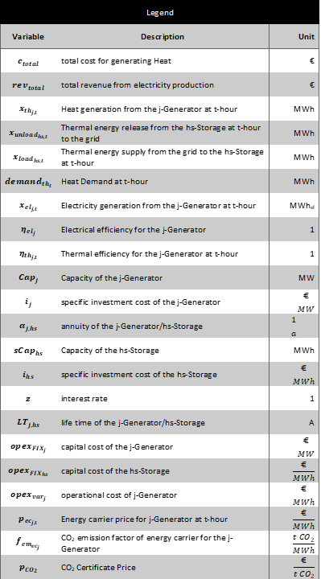

<h1><a class="anchor" id="cm-district-heating-supply-dispatch" href="#cm-district-heating-supply-dispatch"><i class="fa fa-link"></i></a>Dispecerat de alimentare termică CM</h1><h2><a class="anchor" id="table-of-contents" href="#table-of-contents"><i class="fa fa-link"></i></a> Cuprins</h2><ul><li> <a href="#in-a-glance">Într-o privire</a></li><li> <a href="#introduction">Introducere</a></li><li> <a href="#inputs-and-outputs">Intrări și ieșiri</a></li><li> <a href="#method">Metodă</a></li><li> <a href="#github-repository-of-this-calculation-module">Depozitul GitHub al acestui modul de calcul</a></li><li> <a href="#sample-run">Exemplu de rulare</a></li><li> <a href="#how-to-cite">Cum se citează</a></li><li> <a href="#authors-and-reviewers">Autori și recenzori</a></li><li> <a href="#license">Licență</a></li><li> <a href="#acknowledgement">Confirmare</a></li></ul><h2><a class="anchor" id="in-a-glance" href="#in-a-glance"><i class="fa fa-link"></i></a> Într-o privire</h2>
 Acest modul poate fi rulat în două moduri: 1) expediere, 2) investiți. În modul de expediere, calculează funcționarea cost-minimă a unui portofoliu de tehnologii de alimentare cu căldură într-un sistem de termoficare definit pentru fiecare oră a anului. Intrările în modul sunt profiluri orare pentru cererea de căldură din rețea, pentru furnizarea potențială de căldură din surse diferite și pentru prețurile transportatorului de energie. În plus, sunt necesari parametrii de cost și eficiență pentru fiecare tehnologie. Modulul generează costurile de alimentare cu căldură, cota de transportatori de energie utilizată și emisiile implicite de CO2. În modul de investiție, modulul optimizează capacitățile tehnologiilor de alimentare cu căldură instalate pentru a acoperi cererea de căldură.

 <a href="#table-of-contents"><strong><code>To Top</code></strong></a>
<h2><a class="anchor" id="introduction" href="#introduction"><i class="fa fa-link"></i></a> Introducere</h2>
 Acest modul poate fi rulat în două moduri: 1) expediere, 2) investiți. În modul de expediere, calculează funcționarea cost-minimă a unui portofoliu de tehnologii de alimentare cu căldură într-un sistem de termoficare definit pentru fiecare oră a anului. Intrările în modul sunt profiluri orare pentru cererea de căldură din rețea, pentru furnizarea potențială de căldură din surse diferite și pentru prețurile transportatorului de energie. În plus, sunt necesari parametrii de cost și eficiență pentru fiecare tehnologie. Modulul generează costurile de alimentare cu căldură, cota de transportatori de energie utilizată și emisiile implicite de CO2. În modul de investiție, modulul optimizează capacitățile tehnologiilor de alimentare cu căldură instalate pentru a acoperi cererea de căldură.

 Modulul de dispecerizare a alimentării cu încălzire urbană este un model de expediere care încearcă să găsească o soluție optimă de cost pentru acoperirea cererii de căldură în fiecare oră a anului.

 Metoda descrisă aici trebuie înțeleasă ca un prim concept și se poate abate de la implementarea efectivă (complexitatea modelului, intrările și ieșirile etc. trebuie văzute din acest punct de vedere). Această pagină wiki explică versiunea modulului de calcul care este integrată în caseta de instrumente. O <strong>versiune autonomă a</strong> modulului de calcul este mult mai cuprinzătoare și poate fi descărcată de <strong><a href="https://github.com/tuw-eeg/hotmapsDispatch">AICI</a></strong> . Această versiune necesită totuși cunoștințe de bază despre programarea python. <strong>Documentația</strong> versiunii autonome poate fi găsită <strong><a href="https://hotmapsdispatch.readthedocs.io/en/latest/">AICI</a></strong> .

 <a href="#table-of-contents"><strong><code>To Top</code></strong></a>
<h2><a class="anchor" id="inputs-and-outputs" href="#inputs-and-outputs"><i class="fa fa-link"></i></a> Intrări și ieșiri</h2><h3><a class="anchor" id="main-inputs" href="#main-inputs"><i class="fa fa-link"></i></a> Principalele intrări</h3>
 Modulul necesită o gamă lungă de parametri de intrare. Principalii parametri de intrare sunt totuși:
<ol><li> Cererea de căldură a rețelei (regiunea selectată)</li><li> Capacități instalate de generatoare de căldură / stocare</li><li> Parametrii tehnici (en-eficiență) și financiari (opex, capex, durata de viață) a generatoarelor / depozitelor de căldură</li><li> Profiluri (serii temporale ale cererii de căldură, radiații solare, temperatură, prețuri la electricitate etc.)</li></ol><h3><a class="anchor" id="main-outputs" href="#main-outputs"><i class="fa fa-link"></i></a> Principalele ieșiri</h3>
 Principalii indicatori de ieșire ai modulului de calcul sunt:
<ul><li> Costuri de generare a căldurii</li><li> Investiții, exploatare și costuri de combustibil</li><li> Mix de generare de căldură per generator de căldură</li><li> Emisiile de CO2</li><li> Ore de încărcare completă,</li></ul>
 <strong>NOTĂ IMPORTANTĂ</strong> În Hotmaps, emisiile de biomasă nu sunt considerate zero, deoarece Hotmaps este un instrument menit să susțină tranziția energetică în curs. Considerarea biomasei ca o sursă de energie neutră din punct de vedere al emisiilor de carbon implică faptul că arderea biomasei reduce emisiile totale actuale în comparație cu arderea combustibililor fosili, ceea ce nu este adevărat. Depozitarea dioxidului de carbon în copaci are loc de-a lungul deceniilor, în timp ce eliberarea acestuia în atmosferă are loc dintr-o dată. Prin urmare, bilanțul net de carbon al biomasei este zero pe termen lung, dar nu pe termen scurt, iar măsurile de atenuare a schimbărilor climatice trebuie să aducă rezultate în reducerea emisiilor de carbon pe termen scurt.

 <a href="#table-of-contents"><strong><code>To Top</code></strong></a>
<h2><a class="anchor" id="method" href="#method"><i class="fa fa-link"></i></a> Metodă</h2>
 Modulul este implementat ca un program liniar și poate fi utilizat pe de o parte ca un model de expediere pur și, pe de altă parte, pentru planificarea investițiilor pentru a acoperi un profil de încărcare. Funcția obiectivă încearcă să găsească minimul diferenței față de costurile pentru furnizarea căldurii și a veniturilor din producția de energie electrică.
<h3><a class="anchor" id="equation-fragments-of-the-linear-program-" href="#equation-fragments-of-the-linear-program-"><i class="fa fa-link"></i></a> Fragmente de ecuație ale programului liniar:</h3>

<h4> <a class="anchor" id="the-total-costs-<code>ctotal<-sub><-code>-yield-from-the-sum-of-" href="#the-total-costs-<code>ctotal<-sub><-code>-yield-from-the-sum-of-"><i class="fa fa-link"></i></a> Costurile totale <code>c total</code> randamentul <code>c total</code> din suma de:</h4><h5> <a class="anchor" id="investment-costs-<code>ic<-code>-installed-capacities-multiplied-by-the-annuities-of-the-specific-investment-costs" href="#investment-costs-<code>ic<-code>-installed-capacities-multiplied-by-the-annuities-of-the-specific-investment-costs"><i class="fa fa-link"></i></a> costuri de investiții <code>IC</code> (capacități instalate înmulțite cu anuitățile costurilor de investiții specifice)</h5>

<h5> <a class="anchor" id="captial-costs-<code>cc<-code>--" href="#captial-costs-<code>cc<-code>--"><i class="fa fa-link"></i></a> costuri captiale <code>CC</code> :</h5>

<h5> <a class="anchor" id="the-variable-costs-<code>opex<-code>--" href="#the-variable-costs-<code>opex<-code>--"><i class="fa fa-link"></i></a> variabila costuri <code>OPEX</code> :</h5>

<h5><a class="anchor" id="ramp-costs-of-chp-and-waste-incineration-plants-rough-estimation--" href="#ramp-costs-of-chp-and-waste-incineration-plants-rough-estimation--"><i class="fa fa-link"></i></a> costurile de rampă ale cogenerării și instalațiilor de incinerare a deșeurilor (estimare aproximativă):</h5>

<h5><a class="anchor" id="assumed-costs-for-the-peak-electrical-load-in-the-winter-time-rough-estimation-" href="#assumed-costs-for-the-peak-electrical-load-in-the-winter-time-rough-estimation-"><i class="fa fa-link"></i></a> costuri asumate pentru sarcina electrică de vârf în timpul iernii (estimare aproximativă):</h5>

<h4> <a class="anchor" id="the-total-revenues-<code>revtotal<-sub><-code>-yield-from--" href="#the-total-revenues-<code>revtotal<-sub><-code>-yield-from--"><i class="fa fa-link"></i></a> Veniturile totale <code>rev total</code> randamentul <code>rev total</code> la ::</h4><h5><a class="anchor" id="the-sale-of-electricity-for-example-from-chp-plants-and-waste-incineration-plants.-" href="#the-sale-of-electricity-for-example-from-chp-plants-and-waste-incineration-plants.-"><i class="fa fa-link"></i></a> vânzarea de energie electrică (de exemplu, de la uzine de cogenerare și instalații de incinerare a deșeurilor):</h5>

 <a href="#table-of-contents"><strong><code>To Top</code></strong></a>
<h4><a class="anchor" id="legend" href="#legend"><i class="fa fa-link"></i></a> Legendă</h4>

 <a href="#table-of-contents"><strong><code>To Top</code></strong></a>
<h2><a class="anchor" id="github-repository-of-this-calculation-module" href="#github-repository-of-this-calculation-module"><i class="fa fa-link"></i></a> Depozitul GitHub al acestui modul de calcul</h2>
 <a href="https://github.com/HotMaps/dispatch_module/tree/develop">Aici</a> veți obține dezvoltarea de sângerare pentru acest modul de calcul.

 <a href="#table-of-contents"><strong><code>To Top</code></strong></a>
<h2><a class="anchor" id="sample-run" href="#sample-run"><i class="fa fa-link"></i></a> Exemplu de rulare</h2>
 După ce selectați o regiune și nu efectuați modificări la parametrii impliciți, modelul va rula în modul investiție. Aceasta înseamnă că și capacitățile instalate sunt optimizate pentru acoperirea optimă a costurilor cererii de căldură.

 Mai jos puteți vedea toți parametrii de intrare care pot fi modificați
<h4><a class="anchor" id="output-indicators" href="#output-indicators"><i class="fa fa-link"></i></a> Indicatori de ieșire</h4><h4><a class="anchor" id="output-charts" href="#output-charts"><i class="fa fa-link"></i></a> Diagramele de ieșire</h4>
 <a href="#table-of-contents"><strong><code>To Top</code></strong></a>
<h2><a class="anchor" id="how-to-cite" href="#how-to-cite"><i class="fa fa-link"></i></a> Cum se citează</h2>
 Jeton Hasani, în Hotmaps Wiki, dispeceratul de alimentare cu energie termică CM (septembrie 2020)

 <a href="#table-of-contents"><strong><code>To Top</code></strong></a>
<h2><a class="anchor" id="authors-and-reviewers" href="#authors-and-reviewers"><i class="fa fa-link"></i></a> Autori și recenzori</h2>
 Această pagină a fost scrisă de Jeton Hasani ( <strong><a href="https://eeg.tuwien.ac.at/">EEG - TU Wien</a></strong> ).

 ☑ Această pagină a fost revizuită de Mostafa Fallahnejad ( <strong><a href="https://eeg.tuwien.ac.at/">EEG - TU Wien</a></strong> ).

 <a href="#table-of-contents"><strong><code>To Top</code></strong></a>
<h2><a class="anchor" id="license" href="#license"><i class="fa fa-link"></i></a> Licență</h2>
 Copyright © 2016-2020: Jeton Hasani

 Licență internațională Creative Commons Attribution 4.0

 Această lucrare este licențiată sub o licență internațională Creative Commons CC BY 4.0.

 Identificator licență SPDX: CC-BY-4.0

 Text-licență: https://spdx.org/licenses/CC-BY-4.0.html

 <a href="#table-of-contents"><strong><code>To Top</code></strong></a>
<h2><a class="anchor" id="acknowledgement" href="#acknowledgement"><i class="fa fa-link"></i></a> Confirmare</h2>
 Dorim să transmitem cea mai profundă apreciere pentru <a href="https://www.hotmaps-project.eu">Proiectul Hotmaps</a> Horizon 2020 (acordul de subvenționare numărul 723677), care a furnizat finanțarea pentru desfășurarea prezentei investigații.

 <a href="#table-of-contents"><strong><code>To Top</code></strong></a>

<!--- THIS IS A SUPER UNIQUE IDENTIFIER -->

This page was automatically translated. View in another language:

[English](../en/CM-District-heating-supply-dispatch) (original) [Bulgarian](../bg/CM-District-heating-supply-dispatch)\* [Czech](../cs/CM-District-heating-supply-dispatch)\* [Danish](../da/CM-District-heating-supply-dispatch)\* [German](../de/CM-District-heating-supply-dispatch)\* [Greek](../el/CM-District-heating-supply-dispatch)\* [Spanish](../es/CM-District-heating-supply-dispatch)\* [Estonian](../et/CM-District-heating-supply-dispatch)\* [Finnish](../fi/CM-District-heating-supply-dispatch)\* [French](../fr/CM-District-heating-supply-dispatch)\* [Irish](../ga/CM-District-heating-supply-dispatch)\* [Croatian](../hr/CM-District-heating-supply-dispatch)\* [Hungarian](../hu/CM-District-heating-supply-dispatch)\* [Italian](../it/CM-District-heating-supply-dispatch)\* [Lithuanian](../lt/CM-District-heating-supply-dispatch)\* [Latvian](../lv/CM-District-heating-supply-dispatch)\* [Maltese](../mt/CM-District-heating-supply-dispatch)\* [Dutch](../nl/CM-District-heating-supply-dispatch)\* [Polish](../pl/CM-District-heating-supply-dispatch)\* [Portuguese (Portugal, Brazil)](../pt/CM-District-heating-supply-dispatch)\*  [Slovak](../sk/CM-District-heating-supply-dispatch)\* [Slovenian](../sl/CM-District-heating-supply-dispatch)\* [Swedish](../sv/CM-District-heating-supply-dispatch)\* 

\* machine translated
