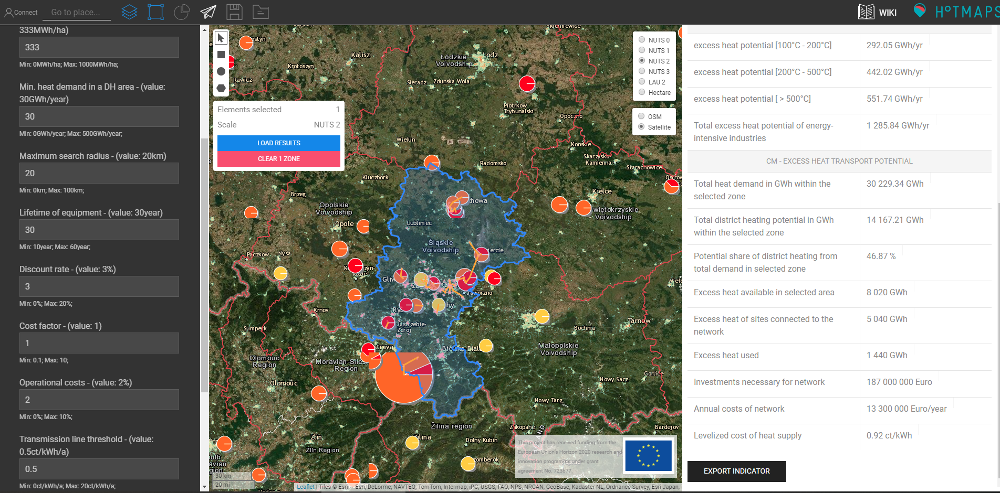

<h1><a class="anchor" id="cm-excess-heat-transport-potential" href="#cm-excess-heat-transport-potential"><i class="fa fa-link"></i></a>CM Potențial de transport al căldurii în exces</h1><h2><a class="anchor" id="table-of-contents" href="#table-of-contents"><i class="fa fa-link"></i></a> Cuprins</h2><ul><li> <a href="#in-a-glance">Într-o privire</a></li><li> <a href="#introduction">Introducere</a></li><li> <a href="#inputs-and-outputs">Intrări și ieșiri</a><ul><li> <a href="#inputs-and-outputs_input-layers-and-parameters">Straturi de intrare și parametri</a></li><li> <a href="#inputs-and-outputs_output">Ieșire</a></li></ul></li><li> <a href="#method">Metodă</a><ul><li> <a href="#method_overview">Prezentare generală</a></li><li> <a href="#method_details">Detalii</a></li><li> <a href="#method_implementation">Implementare</a></li></ul></li><li> <a href="#github-repository-of-this-calculation-module">Depozitul GitHub al acestui modul de calcul</a></li><li> <a href="#quick-start">Pornire rapidă</a></li><li> <a href="#troubleshooting">Depanare</a></li><li> <a href="#sample-run">Exemplu de rulare</a></li><li> <a href="#how-to-cite">Cum se citează</a></li><li> <a href="#authors-and-reviewers">Autori și recenzori</a></li><li> <a href="#license">Licență</a></li><li> <a href="#acknowledgement">Confirmare</a></li></ul><h2><a class="anchor" id="in-a-glance" href="#in-a-glance"><i class="fa fa-link"></i></a> Într-o privire</h2>
 Acest modul calculează debitul și costurile de transmitere a căldurii de la sursele potențiale de căldură în exces situate în afara zonelor potențiale de încălzire centrală până la zona de încălzire centralizată. Intrările sunt profiluri de încărcare pe oră a fluxului de căldură în exces și a cererii de încălzire urbană, amplasarea sursei de căldură în exces și a sistemului potențial de încălzire urbană, costuri de investiții în schimbătoare de căldură și linii de transport și valori prag pentru distanță și costuri de transport.

 <a href="#table-of-contents"><strong><code>To Top</code></strong></a>
<h2><a class="anchor" id="introduction" href="#introduction"><i class="fa fa-link"></i></a> Introducere</h2>
 Modulul de calcul „Potențial de transport al căldurii în exces” va ajuta utilizatorul să identifice potențialele de integrare a excesului de căldură în rețelele de termoficare. Potențialele se bazează pe <a href="https://wiki.hotmaps.hevs.ch/en/CM-District-heating-potential-areas-user-defined-thresholds">CM - Potențialul de încălzire urbană</a> . Acest CM identifică zonele cu condiții favorabile pentru rețelele de termoficare și arată cât de multă căldură ar putea fi acoperită de căldura industrială în exces în aceste zone. Cu toate acestea, acest lucru nu înseamnă că există deja o rețea de termoficare în această regiune.

 Următoarele date și metode sunt combinate pentru sarcina anterioară.

 Date:
<ul><li>
 Cerințe de încălzire pentru zonele din apropiere, cu condiții favorabile pentru rețelele de termoficare, care sunt dizolvate orar (din <a href="https://wiki.hotmaps.hevs.ch/en/CM-District-heating-potential-areas-user-defined-thresholds">CM - Potențial de încălzire</a> urbană).
</li><li>
 Date privind cantitățile de căldură în exces ale companiilor industriale din zonă, care sunt, de asemenea, rezolvate orar (din baza de date industrială a setului de date).
</li><li>
 Ipoteze cu privire la costurile schimbătorilor de căldură, pompelor și conductelor, precum și pierderile de căldură pentru conductele de termoficare.
</li></ul>
 Metoda (simplificată):
<ul><li> Proiectarea conductelor pe baza unei euristici dezvoltate, care reprezintă problema proiectării ca o problemă a fluxului de rețea.</li></ul>
 Scopul metodei este de a reprezenta cel mai mare flux de căldură în exces posibil, cu conducte nu prea multe și, prin urmare, prea lungi către posibilii utilizatori de termoficare prin generarea de rețele cu debituri maxime. Cu toate acestea, în rețeaua finală nu sunt luate în considerare în special liniile de transport ineficiente (cu fluxuri de căldură reduse și, prin urmare, costuri specifice de transport termice ridicate). Pragul pentru eficiența economică a liniilor de transport individuale poate fi specificat de utilizator (cf. pragul liniei de transport).

 Fundalul de bază al abordării este următorul: dacă există doar câteva surse de căldură în exces, o singură conductă pe sursă ar putea fi întotdeauna luată în considerare pentru transportul căldurii într-o zonă din apropiere, cu condiții favorabile pentru încălzirea centralizată. Cu toate acestea, dacă există mai multe surse de căldură în exces care urmează să curgă în aceeași zonă, ar avea sens să colectăm căldura și să o transportăm în zonă într-o conductă comună mai mare. Abordarea cu o conductă pe sursă tinde să supraestimeze efortul pentru conducte.

 Pentru a contracara cele de mai sus, problema planificării conductelor a fost aproximată prin asumarea unei probleme a fluxului de rețea. O metodă euristică este utilizată pentru a rezolva problema, în care excesul de căldură poate fi grupat și transportat către posibilii utilizatori. Proiectarea metodică concretă a soluției cu abordarea arborelui minim de acoperire este descrisă în partea metodică corespunzătoare. Proiectarea conductei determinată în contextul anterior nu reprezintă, prin urmare, o planificare detaliată sau o ghidare reală a rutei, ci este utilizată doar pentru aproximarea costurilor pentru distribuția cantităților de căldură în exces în zonele din apropiere cu condiții favorabile pentru rețelele de termoficare (vezi <a href="https://wiki.hotmaps.hevs.ch/en/CM-District-heating-potential-areas-user-defined-thresholds">CM - Potențial de încălzire centralizată</a> , zone coerente cu cuvinte cheie). Această aproximare a costurilor se referă astfel la întreaga rețea.

 Rezultatele ar trebui mai întâi interpretate după cum urmează: dacă cantitățile de căldură în exces înregistrate ar fi transportate împreună în zonele apropiate indicate, atunci costurile pentru distribuția căldurii ar putea fi în ordinea mărimii, așa cum este indicat de instrument (cf. Costul nivelat de alimentare cu căldură). De regulă, valorile pentru întreaga rețea sunt, de asemenea, un bun indicator de pornire pentru conductele individuale. Scopul rezultatelor este, prin urmare, de a oferi unui dezvoltator de proiect sau unui planificator un ordin de mărime pentru posibilele costuri de distribuție.

 <a href="#table-of-contents"><strong><code>To Top</code></strong></a>
<h2><a class="anchor" id="inputs-and-outputs" href="#inputs-and-outputs"><i class="fa fa-link"></i></a> Intrări și ieșiri</h2><h3><a class="anchor" id="input-layers-and-parameters" href="#input-layers-and-parameters"><i class="fa fa-link"></i></a> Straturi de intrare și parametri</h3><h4><a class="anchor" id="provided-by-toolbox" href="#provided-by-toolbox"><i class="fa fa-link"></i></a> Furnizat de Toolbox</h4><ul><li>
 Zonele de termoficare (deocamdată asigurate direct de potențialul de termoficare CM)
</li><li>
 Baza de date industrială (furnizată implicit de setul de instrumente)
</li><li>
 Profiluri de încărcare pentru industrie
</li><li>
 Profiluri de încărcare pentru încălzire rezidențială și apă caldă menajeră
</li></ul><h4><a class="anchor" id="provided-by-the-user" href="#provided-by-the-user"><i class="fa fa-link"></i></a> Furnizat de utilizator</h4><ul><li>
 Min. cererea de căldură la hectar

 Vezi <a href="https://wiki.hotmaps.hevs.ch/en/CM-District-heating-potential-areas-user-defined-thresholds">CM - Potențial de încălzire urbană</a> .
</li><li>
 Min. cererea de căldură într-o zonă DH

 Vezi <a href="https://wiki.hotmaps.hevs.ch/en/CM-District-heating-potential-areas-user-defined-thresholds">CM - Potențial de încălzire urbană</a> .
</li><li>
 Durata de viață a echipamentelor în ani

 Costurile nivelate ale căldurii se referă la această perioadă de timp.
</li><li>
 Rata de reducere în%

 Rata dobânzii pentru credit necesară pentru construirea rețelei.
</li><li>
 Factorul de cost

 Factor pentru adaptarea costurilor rețelei în cazul în care valorile implicite nu reprezintă cu exactitate costurile. Investițiile necesare rețelei se înmulțesc cu acest factor. Costurile implicite pot fi găsite în secțiunea <a href="en-CM-Excess-heat-transport-potential#computation-of-costs">Calculul costurilor</a> .
</li><li>
 Costuri operaționale în%

 Costurile operaționale ale rețelei pe an. În procente din investițiile necesare rețelei.
</li><li>
 Valoarea pragului pentru liniile de transport în ct / kWh

 Costul maxim nivelat al căldurii pentru fiecare linie de transport individuală. Acest parametru poate fi utilizat pentru a controla costul nivelat al căldurii pentru întreaga rețea. O valoare mai mică este egală cu costul mai scăzut al căldurii, dar și o reducere a excesului de căldură utilizat și invers.
</li></ul><h4><a class="anchor" id="performance-parameters" href="#performance-parameters"><i class="fa fa-link"></i></a> Parametrii de performanță</h4><ul><li>
 Rezoluția timpului

 Setează intervalul dintre calculele fluxului de rețea pe tot parcursul anului. Poate fi una dintre aceste valori: (oră, zi, săptămână, lună, an)
</li></ul>
 <a href="#table-of-contents"><strong><code>To Top</code></strong></a>
<h3><a class="anchor" id="output" href="#output"><i class="fa fa-link"></i></a> Ieșire</h3><h4><a class="anchor" id="layers" href="#layers"><i class="fa fa-link"></i></a> Straturi</h4><ul><li>
 Linii de transmisie

 Fișier tip care arată liniile de transmisie sugerate cu temperatura, debitul anual de căldură și costul acestora. Detalii puteți găsi aici.
</li></ul><h4><a class="anchor" id="indicators" href="#indicators"><i class="fa fa-link"></i></a> Indicatori</h4><ul><li>
 Excesul total de căldură în zona selectată în GWh

 Excesul total de căldură disponibil al instalațiilor industriale în zona selectată și în apropiere.
</li><li>
 Excesul de căldură conectat în GWh

 Excesul total de căldură disponibil al instalațiilor industriale conectate la o rețea.
</li><li>
 Excesul de căldură utilizat în GWh

 Excesul de căldură efectiv utilizat pentru DH.
</li><li>
 Investițiile necesare rețelei în EUR

 Investiții necesare pentru construirea rețelei.
</li><li>
 Costurile anuale ale rețelei în euro / an

 Costurile cauzate de anuitatea și costurile operaționale ale rețelei pe an.
</li><li>
 Costuri nivelate ale alimentării cu căldură în ct / kWh

 costul nivelat al căldurii rețelei complete.
</li></ul><h4><a class="anchor" id="graphics" href="#graphics"><i class="fa fa-link"></i></a> Grafică</h4><ul><li>
 Potențial de DH și căldură în exces

 Grafic care arată potențialul DH, excesul total de căldură, excesul de căldură conectat și excesul de căldură utilizat. Detalii puteți găsi <a href="en-CM-Excess-heat-transport-potential#dh-potential-and-excess-heat">aici</a> .
</li><li>
 Excesul de căldură utilizat și investiția necesară

 Grafic care prezintă excesul de căldură livrat anual la investiția necesară rețelei. Detalii puteți găsi <a href="en-CM-Excess-heat-transport-potential#excess-heat-used-and-investment-necessary">aici</a> .
</li><li>
 Curbele de încărcare

 Grafic care arată cererea și excesul lunar de căldură. Detalii puteți găsi <a href="en-CM-Excess-heat-transport-potential#load-curves">aici</a> .
</li><li>
 Curbele de încărcare

 Grafic care arată cererea zilnică medie și excesul de căldură. Detalii puteți găsi <a href="en-CM-Excess-heat-transport-potential#load-curves">aici</a> .
</li></ul><h4><a class="anchor" id="examples-of-layer" href="#examples-of-layer"><i class="fa fa-link"></i></a> Exemple de Layer</h4><h5><a class="anchor" id="transmission-lines" href="#transmission-lines"><i class="fa fa-link"></i></a> Linii de transmisie</h5><figcaption> <i> Exemplu de linie de transmisie afișată în caseta de instrumente</i></figcaption>
 Făcând clic pe linia de transmisie vor apărea informații suplimentare.
<h4><a class="anchor" id="examples-of-graphics" href="#examples-of-graphics"><i class="fa fa-link"></i></a> Exemple de grafică</h4><h5><a class="anchor" id="dh-potential-and-excess-heat" href="#dh-potential-and-excess-heat"><i class="fa fa-link"></i></a> Potențial de DH și căldură în exces</h5>
 <em>Această grafică compară potențialul DH, excesul total de căldură, excesul de căldură conectat și excesul de căldură utilizat.</em>

 Mai multe informații despre cererea anuală de căldură și potențialul de DH pot fi găsite <a href="CM-District-heating-potential-areas-user-defined-thresholds">aici</a> . Excesul de căldură conectat excesul de căldură și excesul de căldură utilizat sunt aceleași cu indicatorii lor numiți în mod egal, în secțiunea <a href="en-CM-Excess-heat-transport-potential#inputs-and-outputs_input-layers-and-parameters">Intrare și ieșire</a> .
<h5><a class="anchor" id="load-curves" href="#load-curves"><i class="fa fa-link"></i></a> Curbele de încărcare</h5><figure><figcaption><i> </i>
 <i>Această grafică arată fluxul total prin rețea pe tot parcursul anului. Graficul inferior reprezintă ziua medie.</i>
</figcaption></figure>
 Axa x reprezintă timpul și puterea axei y. Curbele albastre reprezintă cererea de căldură a zonelor DH și roșu excesul de căldură disponibil. Intersecția ambelor curbe reprezintă fluxul total real de căldură. Graficul superior arată fluxul de-a lungul anului, iar cel de jos fluxul zilei medii. Rețineți că <a href="en-CM-Excess-heat-transport-potential#performance-parameters">rezoluția timpului</a> trebuie setată cel puțin la „lună” pentru partea superioară și „oră” pentru ca graficul inferior să fie reprezentativ.

 <a href="#table-of-contents"><strong><code>To Top</code></strong></a>
<h2><a class="anchor" id="method" href="#method"><i class="fa fa-link"></i></a> Metodă</h2><h3><a class="anchor" id="overview" href="#overview"><i class="fa fa-link"></i></a> Prezentare generală</h3>
 Elementul cheie al modulului de căldură în exces este modelul sursă-chiuvetă utilizat. Construiește o rețea de transmisie cu lungime minimă și calculează debitul pentru fiecare oră a anului pe baza profilelor de încărcare a încălzirii rezidențiale cu rezoluție NUTS 2 și a profilelor de încărcare din industrie cu rezoluția NUTS 0. Pe baza debitelor de vârf medii pe tot parcursul anului, pot fi calculate costurile pentru fiecare linie de transmisie și schimbător de căldură pe partea sursă și chiuvetă.

 <a href="#table-of-contents"><strong><code>To Top</code></strong></a>
<h3><a class="anchor" id="details" href="#details"><i class="fa fa-link"></i></a> Detalii</h3><h4><a class="anchor" id="modeling-of-sources" href="#modeling-of-sources"><i class="fa fa-link"></i></a> Modelarea surselor</h4>
 Pe baza ID-ului NUTS 0 și a sectorului industrial, se atribuie fiecărei surse un profil de încărcare rezolvat orar pe tot parcursul anului.
<h4><a class="anchor" id="modeling-of-sinks" href="#modeling-of-sinks"><i class="fa fa-link"></i></a> Modelarea chiuvetelor</h4>
 Pe baza modulului de calcul al potențialului de încălzire urbană, se creează puncte de intrare echidistante în zonele coerente. În funcție de ID-ul NUTS 2 al punctelor de intrare, este atribuit un profil de încărcare.
<h4><a class="anchor" id="fixed-radius-search" href="#fixed-radius-search"><i class="fa fa-link"></i></a> Căutare pe rază fixă</h4>
 Într-o rază prestabilită, se verifică ce surse se află în raza de acțiune, ce chiuvete sunt în raza de acțiune și care chiuvete sunt în raza de acțiune pentru surse. Aceasta poate fi reprezentată printr-un grafic cu surse și chiuvete care formează vârfurile și vârfurile din interval fiind conectate printr-o margine.
<h4><a class="anchor" id="reduction-to-minimum-length-network" href="#reduction-to-minimum-length-network"><i class="fa fa-link"></i></a> Reducerea la rețeaua de lungime minimă</h4>
 Un copac minim care se întinde este calculat cu distanța marginilor ca greutăți. Acest lucru are ca rezultat un grafic care își păstrează conectivitatea în timp ce are o lungime totală minimă a muchiilor. Rețineți că punctele de intrare ale zonelor coerente sunt conectate intern gratuit, deoarece formează propria rețea de distribuție.
<h4><a class="anchor" id="flow-computation" href="#flow-computation"><i class="fa fa-link"></i></a> Calculul fluxului</h4>
 Debitul maxim de la surse la chiuvete este calculat pentru fiecare oră a anului.
<h4><a class="anchor" id="cost-determination" href="#cost-determination"><i class="fa fa-link"></i></a> Determinarea costurilor</h4>
 Debitul maxim al anului în medie pe 3 ore determină capacitatea necesară pentru liniile de transmisie și schimbătoarele de căldură. Costurile liniilor de transport depind de lungime și capacitate, în timp ce costurile schimbătoarelor de căldură sunt influențate doar de capacitate. Pe partea sursă, se presupune schimbătorul de căldură aer-lichid cu pompă integrată pentru linia de transmisie, iar pe partea chiuvetei se presupune un schimbător de căldură lichid-lichid.
<h4><a class="anchor" id="variation-of-network" href="#variation-of-network"><i class="fa fa-link"></i></a> Variația rețelei</h4>
 Deoarece costul și debitul fiecărei linii de transport sunt cunoscute, liniile cu cel mai mare raport de cost la debit pot fi eliminate și debitul recalculat până la atingerea costului pe debit dorit.

 <a href="#table-of-contents"><strong><code>To Top</code></strong></a>
<h3><a class="anchor" id="implementation" href="#implementation"><i class="fa fa-link"></i></a> Implementare</h3><h4><a class="anchor" id="fixed-radius-search" href="#fixed-radius-search"><i class="fa fa-link"></i></a> Căutare pe rază fixă</h4>
 Pentru calcularea distanței dintre două puncte, se utilizează o aproximare a unghiului mic a lungimii loxodromului. Deși există, de asemenea, o implementare precisă a distanței ortodromului, precizia crescută nu are niciun beneficiu real din cauza distanțelor mici, în cea mai mare parte mai mici de 20 km, și a incertitudinii lungimii reale a liniei de transmisie din cauza multor factori precum topologia. Dacă două puncte se află în raza razei, acesta este stocat într-o listă de adiacență. Crearea unor astfel de liste de adiacență se realizează între surse și surse, chiuvete și chiuvete și surse și chiuvete. Motivul separării constă în flexibilitatea de a adăuga anumite cerințe de temperatură pentru surse sau chiuvete.
<figure><figcaption> <i> Exemplu de căutare pe rază fixă. Vârfurile roșii reprezintă surse, iar cele albastre se scufundă. Numerele reprezintă distanța dintre puncte. Desenul nu este la scară.</i></figcaption></figure><h4><a class="anchor" id="networkgraph-class" href="#networkgraph-class"><i class="fa fa-link"></i></a> Clasa NetworkGraph</h4>
 Pe baza bibliotecii igraph este implementată o clasă NetworkGraph cu toate funcționalitățile necesare pentru modulul de calcul. În timp ce igraph este slab documentat, acesta oferă o performanță mult mai bună decât modulele python pure, cum ar fi NetworkX și suportul mai larg al platformei dincolo de Linux, spre deosebire de grafic-instrument. Clasa NetworkGraph descrie o singură rețea la suprafață, dar conține 3 grafice diferite. În primul rând, graficul care descrie rețeaua așa cum este definită de cele trei liste de adiacență. În al doilea rând, graficul de corespondență conectează chiuvete interne din aceeași zonă coerentă și durează graficul de debit maxim utilizat pentru calculul debitului maxim.
<h5><a class="anchor" id="graph" href="#graph"><i class="fa fa-link"></i></a> Grafic</h5>
 Conține doar sursele reale și chiuvetele ca vârfuri.
<figure><figcaption> <i> Exemplu de grafic. Vârfurile roșii reprezintă surse, iar cele albastre se scufundă.</i></figcaption></figure><h5><a class="anchor" id="correspondence-graph" href="#correspondence-graph"><i class="fa fa-link"></i></a> Grafic de corespondență</h5>
 Fiecare chiuvetă are nevoie de un cod de corespondență, care să indice dacă este conectat intern de o rețea deja existentă ca în zone coerente. Chiuvetele cu același id de corespondență sunt conectate la un nou vârf cu margini cu greutăți zero. Acest lucru este crucial pentru calculul unui copac minim care se întinde și motivul pentru care este utilizat graficul de corespondență pentru acesta. Această caracteristică este implementată și pentru surse, dar nu este utilizată.
<figure><figcaption><i> </i>
 <i>Exemplu de grafic de corespondență. Vârfurile roșii reprezintă surse, iar cele albastre se scufundă. Cele trei chiuvete din dreapta sunt coerente conectate printr-un vârf suplimentar mai mare</i>
</figcaption></figure><h5><a class="anchor" id="maximum-flow-graph" href="#maximum-flow-graph"><i class="fa fa-link"></i></a> Graficul debitului maxim</h5>
 Deoarece igraph nu acceptă mai multe surse și se scufundă în funcția sa de debit maxim este necesar un grafic auxiliar. Introduce o sursă infinită și un vârf de scufundare. Fiecare sursă reală este conectată la sursa infinită și fiecare chiuvetă reală este conectată la chiuveta infinită printr-o margine. Rețineți că dacă o chiuvetă este conectată la un vârf de corespondență, acest vârf va fi conectat mai degrabă decât chiuveta în sine.
<figure><figcaption><i> </i>
 <i>Exemplu de grafic de debit maxim.</i>
</figcaption></figure><h5><a class="anchor" id="minimum-spanning-tree-computation" href="#minimum-spanning-tree-computation"><i class="fa fa-link"></i></a> Calcul minim al arborelui</h5>
 Pe baza graficului de corespondență se calculează arborele minim de întindere. Marginile care leagă chiuvetele coerente au întotdeauna greutatea 0, astfel încât vor rămâne întotdeauna parte a arborelui minim de întindere.
<figure><figcaption><i> </i>
 <i>Exemplu de grafic de corespondență cu greutățile fiecărei muchii și arborele său minim de întindere.</i>
</figcaption></figure><h5><a class="anchor" id="maximum-flow-computation" href="#maximum-flow-computation"><i class="fa fa-link"></i></a> Calcul de debit maxim</h5>
 Fluxul prin margini care leagă sursele reale sau chiuvetele de sursa infinită sau respectiv chiuveta este limitat la capacitatea reală a fiecărei surse sau chiuvete. Din motive numerice, capacitățile sunt normalizate, astfel încât capacitatea cea mai mare este 1. Fluxul prin subsetul de margini conținut în graficul de corespondență este limitat la 1000, care ar trebui, pentru toate intensitățile și scopurile, să ofere un flux nerestricționat. Apoi, debitul maxim de la sursa infinită la chiuveta infinită este calculat și fluxul redimensionat la dimensiunea inițială. Deoarece chiuvete coerente nu sunt conectate direct la vârful chiuvetei infinite, ci prin vârful corespondenței, fluxul prin acesta este limitat la suma tuturor chiuvetelor coerente.
<figure><figcaption><i> </i>
 <i>Exemplu de grafic de flux maxim și capacitățile fiecărei surse și scufundări. Graficul din dreapta arată fluxul maxim permis prin fiecare muchie după normalizare. Rețineți că debitul maxim permis prin margini cu simbolul infinit este de fapt limitat la 1000 în implementare.</i>
</figcaption></figure>
 Implementarea funcției igraph flux maxim utilizează algoritmul Push-relabel. Acest tip de algoritm nu este sensibil la costuri și s-ar putea să nu găsească întotdeauna cea mai scurtă cale de rutare a fluxului. Un algoritm sensibil la costuri nu este disponibil în igraph și performanța ar fi probabil scăzută pentru a putea rezolva un flux bazat pe oră pe tot parcursul anului. Dar, din cauza reducerii anterioare la un copac minim care se întinde, cazurile în care se alege o soluție neideală sunt foarte limitate și puțin probabile. Algoritmul Push-relabel are, de asemenea, tendința de a dirija fluxul prin cea mai mică cantitate de margini. Implementarea igraph pare a fi deterministă în ordinea alocării fluxului dacă graficele sunt cel puțin automorfisme, ceea ce este important pentru calculul debitului pe oră, deoarece orice oscilație a fluxului introdusă artificial între margini este nedorită.
<figure><figcaption> <i> Flux calculat de algoritmul fluxului maxim și redimensionarea la dimensiunea inițială.</i></figcaption></figure><h4><a class="anchor" id="heat-sources" href="#heat-sources"><i class="fa fa-link"></i></a> Surse de căldură</h4>
 Sursele de căldură sunt preluate din <strong><a href="https://gitlab.com/hotmaps/industrial_sites/industrial_sites_Industrial_Database">baza de date industrială.</a></strong> Pe baza căldurii în exces, Nuts0 ID și sectorul industrial se creează un profil de încărcare care acoperă fiecare oră a anului pentru fiecare sit. Este planificată adăugarea personalizată a site-urilor.
<h4><a class="anchor" id="heat-sinks" href="#heat-sinks"><i class="fa fa-link"></i></a> Radiatoare</h4>
 Radiatoarele se bazează pe zone coerente cu cerere de căldură cunoscută. Zonele coerente formează o mască pentru o rețea pe care punctele echidistante sunt plasate ca puncte de intrare. În funcție de ID-ul NUTS 2 selectat, un profil de încălzire rezidențială este atribuit chiuvetelor. Este planificată adăugarea personalizată a punctelor de intrare și a chiuvetelor.
<figure><figcaption> <i> Exemplu de zonă coerentă și punctele sale de intrare generate.</i></figcaption></figure><h4><a class="anchor" id="load-profiles" href="#load-profiles"><i class="fa fa-link"></i></a> Încărcați profilurile</h4>
 Profilurile de încărcare menționate constau din 8760 de puncte care reprezintă încărcarea pentru fiecare oră din cele 365 de zile. Informații suplimentare despre <strong><a href="https://gitlab.com/hotmaps/load_profile">profilurile de încărcare pot fi găsite aici.</a></strong>
<h4><a class="anchor" id="computation-of-costs" href="#computation-of-costs"><i class="fa fa-link"></i></a> Calculul costurilor</h4>
 Deoarece sistemele de încălzire urbană au o capacitate termică mare, un vârf în flux nu înseamnă că liniile de transmisie trebuie să livreze instantaneu acel vârf scurt de căldură. Prin urmare, capacitățile necesare pentru liniile de transmisie și schimbătoarele de căldură sunt determinate de sarcina maximă medie. În mod specific, funcția de convoluție numpy este utilizată pentru a medie fluxul în ultimele trei ore prin convoluția cu o funcție constantă. În funcție de această valoare, se alege o linie de transmisie din tabelul următor.

 <em>Costuri specifice liniilor de transport utilizate</em>

 | Puterea în MW | Costuri în € / m | Temperatura în ° C | | ------------- |: -------------: | -----: | | 0,2 | 195 | &lt;150 | | 0,3 | 206 | &lt;150 | | 0,6 | 220 | &lt;150 | | 1.2 | 240 | &lt;150 | | 1.9 | 261 | &lt;150 | | 3.6 | 288 | &lt;150 | | 6.1 | 323 | &lt;150 | | 9.8 | 357 | &lt;150 | | 20 | 426 | &lt;150 | | 45 | 564 | &lt;150 | | 75 | 701 | &lt;150 | | 125 | 839 | &lt;150 | | 190 | 976 | &lt;150 | | &gt; 190 | 976 | &lt;150 |

 Costurile schimbătorului de căldură din partea sursei care este presupus ca aer în lichid se calculează cu

 C HSource (en-P) = P peak * 15.000 € / MW.

 Costurile schimbătorului de căldură lichid la lichid de pe chiuvetă se determină cu

 C HSink (en-P) = P peak * 265.000 € / MW dacă P peak &lt;1MW sau

 C HSink (en-P) = P peak * 100.000 € / MW altul.
<h4><a class="anchor" id="removal-of-transmission-lines" href="#removal-of-transmission-lines"><i class="fa fa-link"></i></a> Îndepărtarea liniilor de transmisie</h4>
 Cu un prag de cost la debit pentru liniile de transport, acestea pot fi eliminate dacă se depășește pentru a îmbunătăți raportul debit-cost. După îndepărtarea muchiilor, fluxul trebuie recalculat, deoarece continuitatea fluxului în grafic nu mai este garantată. Raportul cost-flux ar putea crește și pentru alte margini acum, astfel încât acest proces se repetă până când suma tuturor fluxurilor nu se mai modifică.
<h4><a class="anchor" id="description-of-the-complete-routine" href="#description-of-the-complete-routine"><i class="fa fa-link"></i></a> Descrierea rutinei complete</h4>
 În primul rând, sursele de căldură și chiuvetele sunt încărcate cu profilurile lor de încărcare. Apoi se efectuează căutarea pe rază fixă și se inițializează rețeaua. Ulterior, rețeaua este redusă la arborele său minim de întindere și debitul maxim este calculat pentru fiecare oră a anului. Pe baza debitului, se calculează costurile pentru fiecare schimbător de căldură, pompă și linie de transmisie. Dacă este definit un raport prag cost-flux, se execută procedura de eliminare a liniei de transmisie. În cele din urmă, costul total și fluxul total al rețelei și aspectul rețelei sunt returnate.

 <a href="#table-of-contents"><strong><code>To Top</code></strong></a>
<h2><a class="anchor" id="github-repository-of-this-calculation-module" href="#github-repository-of-this-calculation-module"><i class="fa fa-link"></i></a> Depozitul GitHub al acestui modul de calcul</h2>
 <a href="https://github.com/HotMaps/excess_heat_cm/tree/develop">Aici</a> veți obține dezvoltarea de sângerare pentru acest modul de calcul.

 <a href="#table-of-contents"><strong><code>To Top</code></strong></a>
<h2><a class="anchor" id="quick-start" href="#quick-start"><i class="fa fa-link"></i></a> Pornire rapidă</h2>
 Prezentul CM - POTENȚIAL DE TRANSPORT DE CĂLDURĂ EXCES este destinat să ajute utilizatorul să identifice potențialele de integrare pentru excesul de căldură în rețelele de termoficare. Deși sunt date numeroase funcții de analiză pentru a nu restricționa utilizatorul, trebuie subliniat în mod explicit că aceasta nu este o planificare tehnică detaliată. Potențialele se bazează pe <a href="https://wiki.hotmaps.hevs.ch/en/CM-District-heating-potential-areas-user-defined-thresholds">CM - Potențialul de încălzire urbană</a> . Acest CM identifică zonele cu condiții favorabile pentru rețelele de termoficare. Astfel, arată cât de multă căldură ar putea fi acoperită de căldura industrială în exces în aceste zone. Cu toate acestea, acest lucru nu înseamnă că există deja o rețea de termoficare în această regiune. Prin urmare, o utilizare orientată spre aplicație a instrumentului pentru practicieni ar putea arăta astfel:
<ul><li>
 Dacă este necesar, adăugați propriile date despre excesul de căldură oferind companiilor din regiune cu <a href="https://wiki.hotmaps.hevs.ch/en/CM-Add-industry-plant">fabrica de adăugare</a> CM.
</li><li>
 Porniți „Căldura excesivă a siturilor industriale”
</li><li>
 Executați CM - EXCES POTENȚIAL DE TRANSPORT DE CĂLDURĂ.
</li><li>
 Valoarea
</li></ul><figure><figcaption> <i>Această grafică compară potențialul DH, excesul total de căldură, excesul de căldură conectat și excesul de căldură utilizat.</i></figcaption></figure>
 Acest grafic arată cât de multă căldură ar putea fi acoperită de excesul de căldură în zona investigată.
<ul><li> Valoare</li></ul><figure><figcaption> <i>Indicatori Investiții necesare, costuri anuale și costuri uniformizate ale căldurii</i></figcaption></figure>
 Acest grafic prezintă costurile specifice producției de căldură pentru întreaga rețea. Notă: costurile afișate au fost estimate utilizând o abordare simplificată. Aceste costuri nu se aplică conductelor individuale. Cu toate acestea, costurile afișate pot fi utilizate ca o ipoteză simplificată de pornire ca costuri de transport pentru integrarea excesului de căldură într-o rețea de termoficare posibil din apropiere.

 Din cele de mai sus, ar putea fi utilizată următoarea ierarhie de lucru:
<ol><li>
 Verificați dacă există sau este planificată o rețea de termoficare în regiunea în cauză.
</li><li>
 Țevile afișate conțin fluxuri. Acolo puteți vedea cât de mult căldură în exces este transportată din sursele respective. Companiile afectate ar putea fi acum contactate. Probabil mai întâi companiile cu cantități mari.
</li></ol><figure><figcaption> <i>Linia de transmisie și fluxul acesteia</i></figcaption></figure><ol start="3"><li> Dacă operatorul rețelei de termoficare și producătorul de căldură în exces sunt interesați să coopereze, ar putea fi puse în funcțiune studii de fezabilitate mai detaliate. În cel mai bun caz, datele afișate vă vor ajuta să inițiați proiecte reale.</li></ol>
 <a href="#table-of-contents"><strong><code>To Top</code></strong></a>
<h2><a class="anchor" id="troubleshooting" href="#troubleshooting"><i class="fa fa-link"></i></a> Depanare</h2><h3><a class="anchor" id="cm-does-not-finish" href="#cm-does-not-finish"><i class="fa fa-link"></i></a> CM nu termină</h3><ul><li> Reduceți rezoluția spațială</li><li> Reduceți rezoluția timpului</li><li> Selectați o zonă mai mică</li><li> Repetați mai târziu</li></ul><h3><a class="anchor" id="cm-crashes-without-a-message" href="#cm-crashes-without-a-message"><i class="fa fa-link"></i></a> CM se blochează fără mesaj</h3><ul><li> Repetați mai târziu</li><li> Contactați dezvoltatorul CM</li></ul><h3><a class="anchor" id="error--"no-dh-area-in-selection."" href="#error--"no-dh-area-in-selection.""><i class="fa fa-link"></i></a> Eroare: „Nu există zonă DH în selecție”.</h3>
 Verificați <a href="https://wiki.hotmaps.hevs.ch/en/CM-District-heating-potential-areas-user-defined-thresholds">DH Potential CM</a> pentru a adapta intrările astfel încât să fie creată o zonă DH.
<h3><a class="anchor" id="error--"no-industrial-sites-in-the-selected-area."" href="#error--"no-industrial-sites-in-the-selected-area.""><i class="fa fa-link"></i></a> Eroare: „Nu există site-uri industriale în zona selectată”.</h3>
 Verificați stratul „site-uri industriale” din selecția utilizatorului.
<h3><a class="anchor" id="error--"no-entry-points-in-selected-area."" href="#error--"no-entry-points-in-selected-area.""><i class="fa fa-link"></i></a> Eroare: „Nu există puncte de intrare în zona selectată.”</h3>
 Verificați <a href="#troubleshooting_warning-no-industry-profiles-available-for">avertismentul</a> .
<h3><a class="anchor" id="error--"no-industrial-sites-in-range."" href="#error--"no-industrial-sites-in-range.""><i class="fa fa-link"></i></a> Eroare: „Nu există site-uri industriale în raza de acțiune”.</h3>
 Selectați o zonă mai mare, în care găsiți cel puțin un site industrial pe baza setului de date industriale implicit disponibil în caseta de instrumente Hotmaps.
<h3><a class="anchor" id="error--"no-excess-heat-used."" href="#error--"no-excess-heat-used.""><i class="fa fa-link"></i></a> Eroare: „Nu s-a utilizat exces de căldură”.</h3>
 Măriți <a href="#inputs-and-outputs_input-layers-and-parameters_provided-by-the-user">pragul liniei de transmisie</a>
<h3><a class="anchor" id="warning--"no-industry-profiles-available-for-..."" href="#warning--"no-industry-profiles-available-for-...""><i class="fa fa-link"></i></a> Avertisment: „Nu există profiluri industriale disponibile pentru ...”</h3>
 Verificați țara și subsectorul site-urilor industriale încărcate.
<h3><a class="anchor" id="warning--"no-residential-heating-profile-available-for-..."" href="#warning--"no-residential-heating-profile-available-for-...""><i class="fa fa-link"></i></a> Avertisment: „Nu există un profil de încălzire rezidențial disponibil pentru ...”</h3>
 CM nu are acces la datele profilului de încălzire rezidențială care trebuie executate în această zonă.

 <a href="#table-of-contents"><strong><code>To Top</code></strong></a>
<h2><a class="anchor" id="sample-run" href="#sample-run"><i class="fa fa-link"></i></a> Exemplu de rulare</h2>
 Exemplu de rulare în PL22 cu parametrii impliciți. Este recomandat să porniți excesul de căldură în fila straturi.
<figure><figcaption> <i>Exemplu de rulare în PL22. Zonele roz reprezintă încălzirea urbană. Portocaliul înconjoară sursa de căldură, iar portocaliul liniile de transmisie ale rețelei.</i></figcaption></figure><figure><figcaption> <i> Această grafică arată fluxul total prin rețea pe tot parcursul anului. Graficul inferior reprezintă ziua medie. Deoarece rezoluția de timp implicită este setată la „săptămână”, este constantă în acest caz.</i></figcaption></figure>
 <a href="#table-of-contents"><strong><code>To Top</code></strong></a>
<h2><a class="anchor" id="how-to-cite" href="#how-to-cite"><i class="fa fa-link"></i></a> Cum se citează</h2>
 Ali Aydemir și David Schilling, în Hotmaps Wiki, CM Excesul de potențial de transport al căldurii (septembrie 2020)

 <a href="#table-of-contents"><strong><code>To Top</code></strong></a>
<h2><a class="anchor" id="authors-and-reviewers" href="#authors-and-reviewers"><i class="fa fa-link"></i></a> Autori și recenzori</h2>
 Această pagină a fost scrisă de Ali Aydemir și David Schilling ( <strong><a href="https://isi.fraunhofer.de/">Fraunhofer ISI</a></strong> ).

 ☑ Această pagină a fost revizuită de Tobias Fleiter ( <strong><a href="https://isi.fraunhofer.de/">Fraunhofer ISI</a></strong> ).

 <a href="#table-of-contents"><strong><code>To Top</code></strong></a>
<h2><a class="anchor" id="license" href="#license"><i class="fa fa-link"></i></a> Licență</h2>
 Copyright © 2016-2020: Ali Aydemir și David Schilling

 Licență internațională Creative Commons Attribution 4.0

 Această lucrare este licențiată sub o licență internațională Creative Commons CC BY 4.0.

 Identificator licență SPDX: CC-BY-4.0

 Text-licență: https://spdx.org/licenses/CC-BY-4.0.html

 <a href="#table-of-contents"><strong><code>To Top</code></strong></a>
<h2><a class="anchor" id="acknowledgement" href="#acknowledgement"><i class="fa fa-link"></i></a> Confirmare</h2>
 Dorim să transmitem cea mai profundă apreciere pentru <a href="https://www.hotmaps-project.eu">Proiectul Hotmaps</a> Horizon 2020 (acordul de subvenționare numărul 723677), care a furnizat finanțarea pentru desfășurarea prezentei investigații.

 <a href="#table-of-contents"><strong><code>To Top</code></strong></a>

<!--- THIS IS A SUPER UNIQUE IDENTIFIER -->

This page was automatically translated. View in another language:

[English](../en/CM-Excess-heat-transport-potential) (original) [Bulgarian](../bg/CM-Excess-heat-transport-potential)\* [Czech](../cs/CM-Excess-heat-transport-potential)\* [Danish](../da/CM-Excess-heat-transport-potential)\* [German](../de/CM-Excess-heat-transport-potential)\* [Greek](../el/CM-Excess-heat-transport-potential)\* [Spanish](../es/CM-Excess-heat-transport-potential)\* [Estonian](../et/CM-Excess-heat-transport-potential)\* [Finnish](../fi/CM-Excess-heat-transport-potential)\* [French](../fr/CM-Excess-heat-transport-potential)\* [Irish](../ga/CM-Excess-heat-transport-potential)\* [Croatian](../hr/CM-Excess-heat-transport-potential)\* [Hungarian](../hu/CM-Excess-heat-transport-potential)\* [Italian](../it/CM-Excess-heat-transport-potential)\* [Lithuanian](../lt/CM-Excess-heat-transport-potential)\* [Latvian](../lv/CM-Excess-heat-transport-potential)\* [Maltese](../mt/CM-Excess-heat-transport-potential)\* [Dutch](../nl/CM-Excess-heat-transport-potential)\* [Polish](../pl/CM-Excess-heat-transport-potential)\* [Portuguese (Portugal, Brazil)](../pt/CM-Excess-heat-transport-potential)\*  [Slovak](../sk/CM-Excess-heat-transport-potential)\* [Slovenian](../sl/CM-Excess-heat-transport-potential)\* [Swedish](../sv/CM-Excess-heat-transport-potential)\* 

\* machine translated
