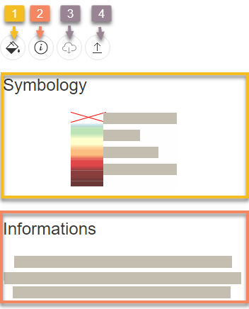

<h1><a class="anchor" id="layers-section-in-the-hotmaps-toolbox" href="#layers-section-in-the-hotmaps-toolbox"><i class="fa fa-link"></i></a>Secțiunea Straturi din caseta de instrumente Hotmaps</h1><h2><a class="anchor" id="table-of-contents" href="#table-of-contents"><i class="fa fa-link"></i></a> Cuprins</h2><ul><li> <a href="#introduction">Introducere</a></li><li> <a href="#layers">Straturi</a></li><li> <a href="#raster-layers">Straturi raster</a></li><li> <a href="#vector-layers">Straturi vectoriale</a></li><li> <a href="#calculation-module-layers">Straturi ale modulului de calcul</a></li><li> <a href="#how-to-cite">Cum se citează</a></li><li> <a href="#authors-and-reviewers">Autori și recenzori</a></li><li> <a href="#license">Licență</a></li><li> <a href="#acknowledgement">Confirmare</a></li></ul><h2><a class="anchor" id="introduction" href="#introduction"><i class="fa fa-link"></i></a> Introducere</h2>
 Prin apăsarea butonului Butonul unei bare laterale cu diferite tipuri de straturi este afișat în stânga ecranului.

 <strong>Fiecare strat are un set de instrumente așa cum se arată mai jos</strong>

<ol><li> Afișează secțiunea de simbolologie a stratului (legendă)</li><li> Afișează secțiunea de informații (primar un link către depozitul GitLab, este foarte recomandat să căutați mai multe informații despre datele din <a href="https://gitlab.com/hotmaps">depozitul GitLab</a> )</li><li> Descărcați setul de date implicit</li><li> Descărcați stratul pentru selectarea stratului</li></ol>
 <a href="#table-of-contents"><strong><code>To Top</code></strong></a>
<h2><a class="anchor" id="layers" href="#layers"><i class="fa fa-link"></i></a> Straturi</h2>
 Există <a href="https://www.gislounge.com/geodatabases-explored-vector-and-raster-data">două categorii de straturi</a> :
<ol><li> Straturi vectoriale</li><li> Straturi raster</li></ol>
 Următoarele straturi pot fi găsite și vizualizate (puteți vedea și legenda și secțiunea de informații a fiecărui strat):

 <a href="#table-of-contents"><strong><code>To Top</code></strong></a>
<h2><a class="anchor" id="raster-layers" href="#raster-layers"><i class="fa fa-link"></i></a> Straturi raster</h2>
 Următoarele straturi raster sunt vizualizate:
<ol><li>
 <strong>17 x straturi de clădiri:</strong>
<ul><li> Harta densității căldurii (totală / rezidențială / nerezidențială)</li><li> Harta densității de răcire (totală / rezidențială / nerezidențială)</li><li> Suprafața brută (total / rezidențial / nerezidențial)</li><li> Volum clădiri (total / rezidențial / nerezidențial)</li></ul></li><li>
 <strong>1 x Strat de populație</strong>
<ul><li> Populația Totală</li></ul></li><li>
 <strong>3 x Surse de energie regenerabilă Straturi potențiale:</strong>
<ul><li> Radiația solară pe amprenta clădirii</li><li> Potențial eolian la 50m</li><li> Reziduuri forestiere</li></ul></li><li>
 <strong>5 x straturi climatice:</strong>
<ul><li> Temperatura</li><li> Zile de răcire</li><li> Zile de grad de încălzire</li><li> Radiatie solara</li><li> Viteza vântului</li></ul></li></ol>
 <a href="#table-of-contents"><strong><code>To Top</code></strong></a>
<h2><a class="anchor" id="vector-layers" href="#vector-layers"><i class="fa fa-link"></i></a> Straturi vectoriale</h2>
 Sunt vizualizate următoarele straturi vectoriale:
<ol><li>
 <strong>4x straturi industriale:</strong>
<ul><li> Emisie de sit industrial</li><li> Excesul de căldură al sitului industrial</li><li> Numele companiei site-ului industrial</li><li> Subsectorul sitului industrial</li></ul></li><li>
 <strong>6 x Surse de energie regenerabilă Straturi potențiale:</strong>
<ul><li> Puterea instalațiilor de tratare a apelor uzate</li><li> Capacitatea instalațiilor de tratare a apelor uzate</li><li> Reziduuri agricole</li><li> Efluenți de animale</li><li> Conductivitate termică potențială geotermală</li><li> Deșeuri solide municipale</li></ul></li><li>
 <strong>1 x strat electric:</strong>
<ul><li> Electricitate Emisii de CO2 Mediu pe țară</li></ul></li></ol>
 <a href="#table-of-contents"><strong><code>To Top</code></strong></a>
<h2><a class="anchor" id="calculation-module-layers" href="#calculation-module-layers"><i class="fa fa-link"></i></a> Straturi ale modulului de calcul</h2>
 Unele module de calcul generează un strat cu rezultatele calculate, cum ar fi <a href="/en/CM-Scale-heat-and-cool-density-maps">CM - Scale Heat and Cool Density Maps,</a> de exemplu. Când se execută aceste CM, stratul relativ apare în partea stângă a ecranului, în secțiunea stratului, chiar în partea de jos. Stratul poate fi apoi selectat și utilizat în alte calcule. La fel ca pentru orice alt strat, câteva butoane de sub titlul stratului permit afișarea simbolologiei stratului, informații disponibile despre strat, descărcarea setului de date strat și descărcarea stratului ca fișier raster.

 <a href="#table-of-contents"><strong><code>To Top</code></strong></a>
<h2><a class="anchor" id="how-to-cite" href="#how-to-cite"><i class="fa fa-link"></i></a> Cum se citează</h2>
 Jeton Hasani, în Hotmaps-Wiki, Layers-section-in-the-Hotmaps-toolbox (aprilie 2019)

 <a href="#table-of-contents"><strong><code>To Top</code></strong></a>
<h2><a class="anchor" id="authors-and-reviewers" href="#authors-and-reviewers"><i class="fa fa-link"></i></a> Autori și recenzori</h2>
 Această pagină a fost scrisă de Jeton Hasani <strong><a href="https://eeg.tuwien.ac.at/">EEG - TU Wien</a></strong> .

 ☑ Această pagină a fost revizuită de Mostafa Fallahnejad <strong><a href="https://eeg.tuwien.ac.at/">EEG - TU Wien</a></strong> .

 <a href="#table-of-contents"><strong><code>To Top</code></strong></a>
<h2><a class="anchor" id="license" href="#license"><i class="fa fa-link"></i></a> Licență</h2>
 Copyright © 2016-2020: Jeton Hasani

 Licență internațională Creative Commons Attribution 4.0

 Această lucrare este licențiată sub o licență internațională Creative Commons CC BY 4.0.

 Identificator licență SPDX: CC-BY-4.0

 Text-licență: https://spdx.org/licenses/CC-BY-4.0.html

 <a href="#table-of-contents"><strong><code>To Top</code></strong></a>
<h2><a class="anchor" id="acknowledgement" href="#acknowledgement"><i class="fa fa-link"></i></a> Confirmare</h2>
 Dorim să transmitem cea mai profundă apreciere pentru <a href="https://www.hotmaps-project.eu">Proiectul Hotmaps</a> Horizon 2020 (acordul de subvenționare numărul 723677), care a furnizat finanțarea pentru desfășurarea prezentei investigații.

 <a href="#table-of-contents"><strong><code>To Top</code></strong></a>

<!--- THIS IS A SUPER UNIQUE IDENTIFIER -->

This page was automatically translated. View in another language:

[English](../en/Layers-section-in-the-Hotmaps-toolbox) (original) [Bulgarian](../bg/Layers-section-in-the-Hotmaps-toolbox)\* [Czech](../cs/Layers-section-in-the-Hotmaps-toolbox)\* [Danish](../da/Layers-section-in-the-Hotmaps-toolbox)\* [German](../de/Layers-section-in-the-Hotmaps-toolbox)\* [Greek](../el/Layers-section-in-the-Hotmaps-toolbox)\* [Spanish](../es/Layers-section-in-the-Hotmaps-toolbox)\* [Estonian](../et/Layers-section-in-the-Hotmaps-toolbox)\* [Finnish](../fi/Layers-section-in-the-Hotmaps-toolbox)\* [French](../fr/Layers-section-in-the-Hotmaps-toolbox)\* [Irish](../ga/Layers-section-in-the-Hotmaps-toolbox)\* [Croatian](../hr/Layers-section-in-the-Hotmaps-toolbox)\* [Hungarian](../hu/Layers-section-in-the-Hotmaps-toolbox)\* [Italian](../it/Layers-section-in-the-Hotmaps-toolbox)\* [Lithuanian](../lt/Layers-section-in-the-Hotmaps-toolbox)\* [Latvian](../lv/Layers-section-in-the-Hotmaps-toolbox)\* [Maltese](../mt/Layers-section-in-the-Hotmaps-toolbox)\* [Dutch](../nl/Layers-section-in-the-Hotmaps-toolbox)\* [Polish](../pl/Layers-section-in-the-Hotmaps-toolbox)\* [Portuguese (Portugal, Brazil)](../pt/Layers-section-in-the-Hotmaps-toolbox)\*  [Slovak](../sk/Layers-section-in-the-Hotmaps-toolbox)\* [Slovenian](../sl/Layers-section-in-the-Hotmaps-toolbox)\* [Swedish](../sv/Layers-section-in-the-Hotmaps-toolbox)\* 

\* machine translated
