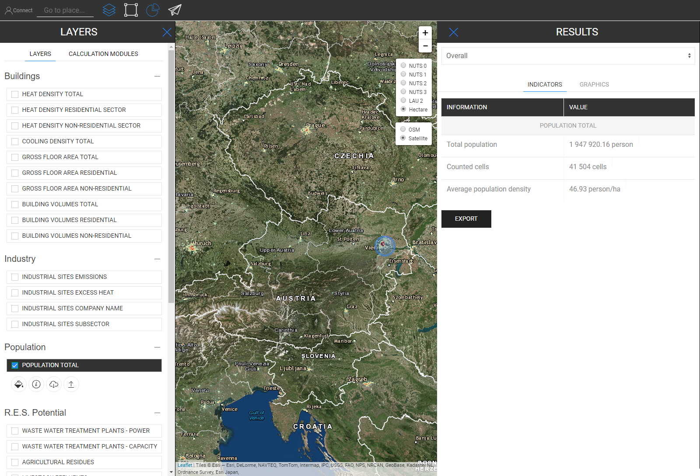
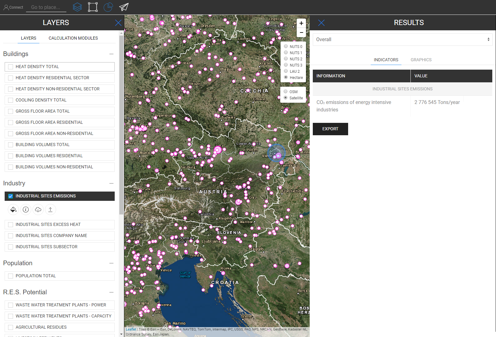

<h1><a class="anchor" id="retrieve-indicators-of-a-selected-area" href="#retrieve-indicators-of-a-selected-area"><i class="fa fa-link"></i></a>Recuperați indicatorii unei zone selectate</h1><h2><a class="anchor" id="table-of-contents" href="#table-of-contents"><i class="fa fa-link"></i></a> Cuprins</h2><ul><li> <a href="#introduction">Introducere</a></li><li> <a href="#indicators-for-raster-layers">Indicatori pentru straturile raster</a><ul><li> <a href="#indicators-for-raster-layers_buildings">Clădiri</a></li><li> <a href="#indicators-for-raster-layers_population">Populația</a></li><li> <a href="#indicators-for-raster-layers_renewable-energy-source-potentials">Potențiale de sursă de energie regenerabilă</a></li></ul></li><li> <a href="#indicators-for-vector-layers">Indicatori pentru straturi vectoriale</a><ul><li> <a href="#indicators-for-vector-layers_industry">Industrie</a></li><li> <a href="#indicators-for-vector-layers_renewable-energy-source-potentials">Potențiale de sursă de energie regenerabilă</a></li><li> <a href="#indicators-for-vector-layers_electricity">Electricitate</a></li></ul></li><li> <a href="#example">Exemplu</a></li><li> <a href="#how-to-cite">Cum se citează</a></li><li> <a href="#authors-and-reviewers">Autori și recenzori</a></li><li> <a href="#license">Licență</a></li><li> <a href="#acknowledgement">Confirmare</a></li></ul><h2><a class="anchor" id="introduction" href="#introduction"><i class="fa fa-link"></i></a> Introducere</h2>
 În funcție de straturi și regiune, indicatorii selectați pentru configurația dvs. sunt afișați într-o bară laterală din dreapta ecranului

 <a href="#table-of-contents"><strong><code>To Top</code></strong></a>

 În cele ce urmează, ne uităm la indicatorii care sunt afișați pentru straturile raster și vectoriale.
<h2><a class="anchor" id="indicators-for-raster-layers" href="#indicators-for-raster-layers"><i class="fa fa-link"></i></a> Indicatori pentru straturile raster</h2>
 Indicatorii de pe straturile raster sunt diferite de straturile vectoriale. Prin diferit, ne referim la termeni de agregare și dezagregare. Acest comportament diferit provine din rezoluțiile teritoriale.

 Straturile raster au, în general, o rezoluție mult mai mare, în timp ce straturile vectoriale au numai atribute în puncte sau poligoane.

 Asta înseamnă, pe de o parte, de exemplu, că, dacă selectați un strat vector care este definit de poligoanele NUTS3 și doriți, de exemplu, să selectați o regiune LAU, atunci valoarea NUTS3 nu va fi dezagregată la nivelul LAU, în schimb, indicatorul NUTS3 unde Regiunea LAU este situată va fi afișată în bara laterală a rezultatelor.

 Pe de altă parte, straturile raster sunt agregate și dezagregate „în mod arbitrar” *

 * de celulele care conțin în regiunea pe care ați selectat-o (în mod natural în limita rezoluției raster în sine)

 <a href="#table-of-contents"><strong><code>To Top</code></strong></a>
<h3><a class="anchor" id="buildings" href="#buildings"><i class="fa fa-link"></i></a> Clădiri</h3>
 <strong>Harta densității căldurii</strong>

 <strong>Funcție suplimentară</strong>

 Când selectați stratul de densitate a căldurii și stratul de populație în același timp, este afișat un indicator suplimentar (a se vedea imaginea de mai jos)

 <a href="#table-of-contents"><strong><code>To Top</code></strong></a>
<h3><a class="anchor" id="in-general-" href="#in-general-"><i class="fa fa-link"></i></a> În general:</h3>
 Când unul dintre straturile de clădire și stratul de populație este selectat în același timp, va fi afișat un indicator suplimentar, așa cum s-a descris anterior

<ins> <code><strong><a href="#indicators-for-raster-layers">To Chapter</a></strong></code></ins>

 <strong>Harta densității de răcire</strong>

<ins> <code><strong><a href="#indicators-for-raster-layers">To Chapter</a></strong></code></ins>

 <strong>Construirea volumelor</strong>

<ins> <code><strong><a href="#indicators-for-raster-layers">To Chapter</a></strong></code></ins>

 <strong>Suprafața brută</strong>

<ins> <code><strong><a href="#indicators-for-raster-layers">To Chapter</a></strong></code></ins> <a href="#table-of-contents"><strong><code>To Top</code></strong></a>
<h3><a class="anchor" id="population" href="#population"><i class="fa fa-link"></i></a> Populația</h3>

<ins> <code><strong><a href="#indicators-for-raster-layers">To Chapter</a></strong></code></ins> <a href="#table-of-contents"><strong><code>To Top</code></strong></a>
<h3><a class="anchor" id="climate" href="#climate"><i class="fa fa-link"></i></a> Climat</h3>
 <strong>Temperatura</strong>

<ins> <code><strong><a href="#indicators-for-raster-layers">To Chapter</a></strong></code></ins>

 <strong>Zile de răcire</strong>

<ins> <code><strong><a href="#indicators-for-raster-layers">To Chapter</a></strong></code></ins>

 <strong>Zile de grad de încălzire</strong>

<ins> <code><strong><a href="#indicators-for-raster-layers">To Chapter</a></strong></code></ins>

 <strong>Radiatie solara</strong>

<ins> <code><strong><a href="#indicators-for-raster-layers">To Chapter</a></strong></code></ins>

 <strong>Viteza vântului</strong>

<ins> <code><strong><a href="#indicators-for-raster-layers">To Chapter</a></strong></code></ins> <a href="#table-of-contents"><strong><code>To Top</code></strong></a>
<h3><a class="anchor" id="renewable-energy-source-potentials" href="#renewable-energy-source-potentials"><i class="fa fa-link"></i></a> Potențiale de sursă de energie regenerabilă</h3>
 <strong>Radiația solară pe amprenta clădirii</strong>

<ins> <code><strong><a href="#indicators-for-raster-layers">To Chapter</a></strong></code></ins>

 <strong>Potențial de vânt la 50m</strong>

<ins> <code><strong><a href="#indicators-for-raster-layers">To Chapter</a></strong></code></ins>

 <strong>Reziduuri forestiere</strong>

<ins> <code><strong><a href="#indicators-for-raster-layers">To Chapter</a></strong></code></ins> <a href="#table-of-contents"><strong><code>To Top</code></strong></a>
<h2><a class="anchor" id="indicators-for-vector-layers" href="#indicators-for-vector-layers"><i class="fa fa-link"></i></a> Indicatori pentru straturi vectoriale</h2><h3><a class="anchor" id="industry" href="#industry"><i class="fa fa-link"></i></a> Industrie</h3>
 <strong>Emisii pe site-ul industrial</strong>

<ins> <code><strong><a href="#indicators-for-vector-layers">To Chapter</a></strong></code></ins>

 <strong>Excesul de căldură al sitului industrial</strong>

<ins> <code><strong><a href="#indicators-for-vector-layers">To Chapter</a></strong></code></ins>

 <strong>Numele companiei site-ului industrial</strong>

<ins> <code><strong><a href="#indicators-for-vector-layers">To Chapter</a></strong></code></ins>

 <strong>Subsectorul sitului industrial</strong>

<ins> <code><strong><a href="#indicators-for-vector-layers">To Chapter</a></strong></code></ins> <a href="#table-of-contents"><strong><code>To Top</code></strong></a>
<h3><a class="anchor" id="renewable-energy-source-potentials" href="#renewable-energy-source-potentials"><i class="fa fa-link"></i></a> Potențiale de sursă de energie regenerabilă</h3>
 <strong>Puterea instalațiilor de tratare a apelor uzate</strong>

<ins> <code><strong><a href="#indicators-for-vector-layers">To Chapter</a></strong></code></ins>

 <strong>Capacitatea instalațiilor de tratare a apelor uzate</strong>

<ins> <code><strong><a href="#indicators-for-vector-layers">To Chapter</a></strong></code></ins>

 <strong>Reziduuri agricole</strong>

<ins> <code><strong><a href="#indicators-for-vector-layers">To Chapter</a></strong></code></ins>

 <strong>Efluenți de animale</strong>

<ins> <code><strong><a href="#indicators-for-vector-layers">To Chapter</a></strong></code></ins>

 <strong>Deșeuri solide municipale</strong>

<ins> <code><strong><a href="#indicators-for-vector-layers">To Chapter</a></strong></code></ins>

 <strong>Conductivitate termică potențială geotermală</strong>

<ins> <code><strong><a href="#indicators-for-vector-layers">To Chapter</a></strong></code></ins> <a href="#table-of-contents"><strong><code>To Top</code></strong></a>
<h3><a class="anchor" id="electricity" href="#electricity"><i class="fa fa-link"></i></a> Electricitate</h3>
 <strong>Emisii de energie electrică C02</strong>

<ins> <code><strong><a href="#indicators-for-vector-layers">To Chapter</a></strong></code></ins> <a href="#table-of-contents"><strong><code>To Top</code></strong></a>
<h2><a class="anchor" id="example" href="#example"><i class="fa fa-link"></i></a> Exemplu</h2>
 În imaginea de mai jos puteți vedea cum arată atunci când sunt vizualizate toate straturile (aici este Austria selectată NUTS0)

 Deși această hartă poate părea puțin confuză la prima vedere, indicatorii săi sunt ilustrați direct. Vedeți mai jos toți indicatorii descriși în bara laterală a rezultatului atunci când selectați toate straturile pentru Austria (NUTS0)

 <a href="#table-of-contents"><strong><code>To Top</code></strong></a>
<h2><a class="anchor" id="how-to-cite" href="#how-to-cite"><i class="fa fa-link"></i></a> Cum se citează</h2>
 Jeton Hasani, în Hotmaps-Wiki, Retrieve-indicator-of-a-selected-area (aprilie 2019)

 <a href="#table-of-contents"><strong><code>To Top</code></strong></a>
<h2><a class="anchor" id="authors-and-reviewers" href="#authors-and-reviewers"><i class="fa fa-link"></i></a> Autori și recenzori</h2>
 Această pagină a fost scrisă de Jeton Hasani <strong><a href="https://eeg.tuwien.ac.at/">EEG - TU Wien</a></strong> .

 ☑ Această pagină a fost revizuită de Mostafa Fallahnejad <strong><a href="https://eeg.tuwien.ac.at/">EEG - TU Wien</a></strong> .

 <a href="#table-of-contents"><strong><code>To Top</code></strong></a>
<h2><a class="anchor" id="license" href="#license"><i class="fa fa-link"></i></a> Licență</h2>
 Copyright © 2016-2020: Jeton Hasani

 Licență internațională Creative Commons Attribution 4.0

 Această lucrare este licențiată sub o licență internațională Creative Commons CC BY 4.0.

 Identificator licență SPDX: CC-BY-4.0

 Text-licență: https://spdx.org/licenses/CC-BY-4.0.html

 <a href="#table-of-contents"><strong><code>To Top</code></strong></a>
<h2><a class="anchor" id="acknowledgement" href="#acknowledgement"><i class="fa fa-link"></i></a> Confirmare</h2>
 Dorim să transmitem cea mai profundă apreciere pentru <a href="https://www.hotmaps-project.eu">Proiectul Hotmaps</a> Horizon 2020 (acordul de subvenționare numărul 723677), care a furnizat finanțarea pentru desfășurarea prezentei investigații.

 <a href="#table-of-contents"><strong><code>To Top</code></strong></a> <code><a href="Indicator-Section/_edit">Review this page</a></code>

<!--- THIS IS A SUPER UNIQUE IDENTIFIER -->

This page was automatically translated. View in another language:

[English](../en/Retrieve-indicators-of-a-selected-area) (original) [Bulgarian](../bg/Retrieve-indicators-of-a-selected-area)\* [Czech](../cs/Retrieve-indicators-of-a-selected-area)\* [Danish](../da/Retrieve-indicators-of-a-selected-area)\* [German](../de/Retrieve-indicators-of-a-selected-area)\* [Greek](../el/Retrieve-indicators-of-a-selected-area)\* [Spanish](../es/Retrieve-indicators-of-a-selected-area)\* [Estonian](../et/Retrieve-indicators-of-a-selected-area)\* [Finnish](../fi/Retrieve-indicators-of-a-selected-area)\* [French](../fr/Retrieve-indicators-of-a-selected-area)\* [Irish](../ga/Retrieve-indicators-of-a-selected-area)\* [Croatian](../hr/Retrieve-indicators-of-a-selected-area)\* [Hungarian](../hu/Retrieve-indicators-of-a-selected-area)\* [Italian](../it/Retrieve-indicators-of-a-selected-area)\* [Lithuanian](../lt/Retrieve-indicators-of-a-selected-area)\* [Latvian](../lv/Retrieve-indicators-of-a-selected-area)\* [Maltese](../mt/Retrieve-indicators-of-a-selected-area)\* [Dutch](../nl/Retrieve-indicators-of-a-selected-area)\* [Polish](../pl/Retrieve-indicators-of-a-selected-area)\* [Portuguese (Portugal, Brazil)](../pt/Retrieve-indicators-of-a-selected-area)\*  [Slovak](../sk/Retrieve-indicators-of-a-selected-area)\* [Slovenian](../sl/Retrieve-indicators-of-a-selected-area)\* [Swedish](../sv/Retrieve-indicators-of-a-selected-area)\* 

\* machine translated
