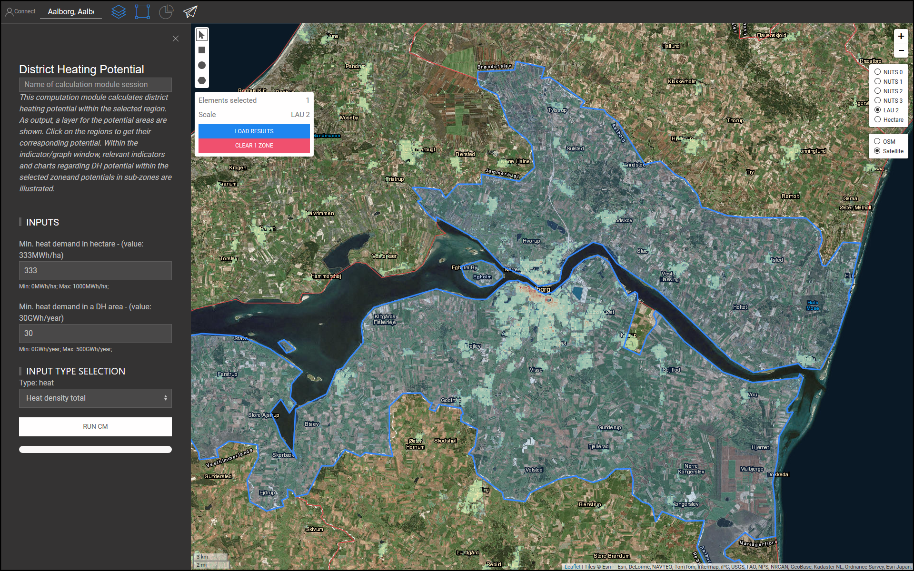
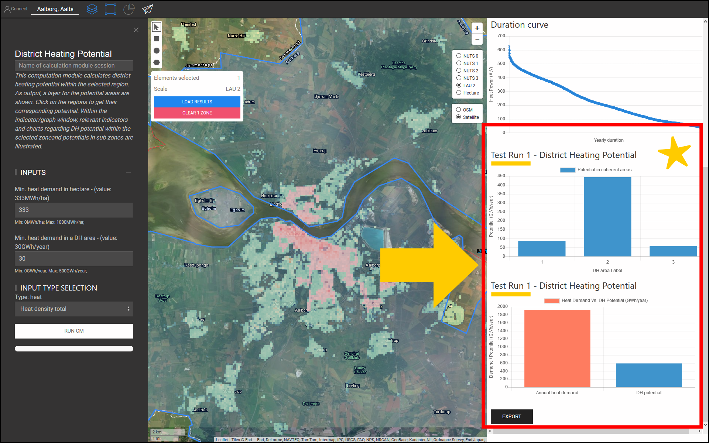

<h1><a class="anchor" id="cm-district-heating-potential-areas-user-defined-thresholds" href="#cm-district-heating-potential-areas-user-defined-thresholds"><i class="fa fa-link"></i></a>Užívateľom definované prahy oblastí potenciálu diaľkového vykurovania</h1><h2><a class="anchor" id="table-of-contents" href="#table-of-contents"><i class="fa fa-link"></i></a> Obsah</h2><ul><li> <a href="#in-a-glance">Jedným pohľadom</a></li><li> <a href="#introduction">Úvod</a></li><li> <a href="#inputs-and-outputs">Vstupy a výstupy</a></li><li> <a href="#method">Metóda</a></li><li> <a href="#github-repository-of-this-calculation-module">Úložisko GitHub tohto výpočtového modulu</a></li><li> <a href="#sample-run">Ukážka behu</a><ul><li> <a href="#sample-run_test-run-1-default-input-values">Testovací beh 1: predvolené vstupné hodnoty</a></li><li> <a href="#sample-run_test-run-2-modified-input-values">Skúšobný chod 2: upravené vstupné hodnoty</a></li></ul></li><li> <a href="#how-to-cite">Ako citovať</a></li><li> <a href="#authors-and-reviewers">Autori a recenzenti</a></li><li> <a href="#license">Licencia</a></li><li> <a href="#acknowledgement">Poďakovanie</a></li></ul><h2><a class="anchor" id="in-a-glance" href="#in-a-glance"><i class="fa fa-link"></i></a> Jedným pohľadom</h2>
 Tento výpočtový modul počíta potenciál diaľkového vykurovania vo vybranom regióne pomocou 2 prahových hodnôt: 1) minimálna potreba tepla na každom hektári, 2) minimálna potreba tepla v oblasti CZT. Plochy vo vybranom regióne, ktoré spĺňajú tieto podmienky, sa vracajú ako oblasti DH. Ďalej sa potreba tepla v týchto regiónoch vracia vo forme ukazovateľov ako potenciál CZT.

 <a href="#table-of-contents"><strong><code>To Top</code></strong></a>
<h2><a class="anchor" id="introduction" href="#introduction"><i class="fa fa-link"></i></a> Úvod</h2>
 Potreba tepla hrá dôležitú úlohu pri určovaní oblastí potenciálneho diaľkového vykurovania (CZT). Napríklad implementácia diaľkového vykurovania v oblastiach s nízkou potrebou tepla nie je ekonomicky životaschopná. Na druhej strane, definovanie akejkoľvek oblasti s vysokou hustotou potreby tepla ako potenciálnej oblasti CZT môže byť tiež nepresné. Vysoká hustota potreby tepla v oblasti môže byť spôsobená prítomnosťou niekoľkých spotrebiteľov s veľmi vysokou potrebou tepla v tejto oblasti. Naopak, nízka priemerná hustota potreby tepla by mohla byť znakom zón s veľmi nízkou potrebou tepla vo vybranej oblasti. Cieľom výpočtového modulu „CM - POTENCIÁLOVÁ OBLASTI OKRUHOVÉHO VYKUROVANIA: PRAHOM VYMEDZENÝ UŽÍVATEĽOM“ je poskytnúť primeranú rovnováhu medzi hustotou potreby tepla v oblasti a jej zónach.

 „CM - MOŽNOSŤ OKRESNÉHO VYKUROVANIA: PRAHOM VYMEDZENÝ UŽÍVATEĽOM“ určuje oblasti CZT a ich zodpovedajúci potenciál CZT na základe hustôt potreby tepla. Hustoty potreby tepla sa získavajú zo vstupnej vrstvy GIS. Súbor nástrojov a databáza Hotmaps poskytuje <strong><a href="https://gitlab.com/hotmaps/heat/heat_tot_curr_density">predvolenú mapu hustoty tepla,</a></strong> ktorú je možné použiť v tomto výpočtovom module. Mapa tepelnej hustoty Hotmaps je v rastrovom formáte a má rozlíšenie jedného hektára a súradnicový referenčný systém (CRS) systému „ <em><em>ETRS89 / LAEA Europe - EPSG 3035</em></em> “. Články na mape zobrazujú hustoty tepla v <em><strong>MWh / ha</strong></em> . Okrem tejto predvolenej mapy je možné do súboru nástrojov nahrať aj mapy vygenerované používateľom a použiť ich v tomto CM.

 Ako výstup je uvedená jedna vrstva GIS, tri indikátory a dva diagramy. Tieto výstupy sú podrobne vysvetlené v časti <a href="#sample-run">Ukážka behu</a> . Výstupná vrstva demonštruje potenciálne oblasti DH. Kliknutím na každú oblasť na mape sa zobrazí okno a zobrazí sa potenciál DH zodpovedajúci tejto oblasti. V oknách INDIKÁTORY / GRAFIKA v časti VÝSLEDKY v súbore nástrojov sú zobrazené príslušné ukazovatele a grafy týkajúce sa potenciálu DH vo vybranej zóne a potenciálov v subzónach.

 <a href="#table-of-contents"><strong><code>To Top</code></strong></a>
<h2><a class="anchor" id="inputs-and-outputs" href="#inputs-and-outputs"><i class="fa fa-link"></i></a> Vstupy a výstupy</h2>
 Vstupné parametre a vrstvy, ako aj výstupné vrstvy a parametre sú nasledujúce.

 <strong>Vstupné vrstvy a parametre sú:</strong>
<ul><li> Minimálna potreba tepla na každom hektári [ <em><strong>MWh / ha</strong></em> ]: hodnota medzi <em><em>0</em></em> a <em><em>1 000</em></em></li><li> Minimálna potreba tepla v oblasti CZT [ <em><strong>GWh / rok</strong></em> ]: hodnota medzi <em><em>0</em></em> a <em><em>500</em></em></li><li> Mapa tepelnej hustoty: v paneli nástrojov je poskytnutá predvolená mapa; v CM môžu byť použité aj vlastné nahrané mapy<ul><li> v rastrovom formáte (* .tif)</li><li> s rozlíšením 1 hektár</li><li> hustoty dopytu v <em><strong>MWh / ha</strong></em></li></ul></li></ul>
 <strong>Výstupné vrstvy a parametre sú:</strong>
<ul><li> DH oblasti v rastrových a tvarových formátoch</li><li> Potenciál DH v každej oblasti DH [ <em><strong>GWh / rok</strong></em> ] (kliknite na mapu)</li><li> Celková potreba tepla v GWh vo vybranej zóne</li><li> Celkový potenciál diaľkového vykurovania v GWh vo vybranej zóne</li><li> Potenciálny podiel diaľkového vykurovania na celkovom dopyte vo vybranej zóne</li></ul>
 <a href="#table-of-contents"><strong><code>To Top</code></strong></a>
<h2><a class="anchor" id="method" href="#method"><i class="fa fa-link"></i></a> Metóda</h2>
 Potenciál pre CZT v konkrétnom regióne možno definovať celkovou potrebou tepla a jeho priestorovým rozdelením. V paneli nástrojov Hotmaps je potreba tepla znázornená vo forme rastrovej mapy. Aby bolo možné správne definovať potenciálne oblasti CZT, mala by potreba tepla v každom článku aj v oblasti dosiahnuť určitú úroveň. Ako východiskový bod navrhuje sada nástrojov Hotmaps predvolené hodnoty pre tieto dva parametre. Avšak v závislosti od rozloženia potreby tepla a tiež od miestnych podmienok môže užívateľ Hotmaps tieto hodnoty upraviť.

 Stanovenie oblastí CZT sa vykonáva v dvoch krokoch:

 V prvom kroku sa filtrujú všetky články s požiadavkou na teplo pod vstupným parametrom „Minimálna potreba tepla v hektároch“. Vylúčením týchto buniek z mapy získame skupiny buniek, ktoré sú navzájom spojené. Každá sada týchto pripojených buniek predstavuje malé zóny, ktoré sa tu označujú ako „koherentné oblasti“. V druhých krokoch sa počíta celková potreba tepla v každej súvislej oblasti. Ak je pre každú súvislú oblasť celková potreba tepla vyššia ako vstupný parameter „Minimálna potreba tepla v oblasti CZT“, považuje sa to za potenciálnu oblasť CZT.

 Nakoniec sa pre oblasti DH vypočíta potenciál a prezentuje sa vo forme vrstvy GIS, ktorú je možné vidieť v paneli nástrojov.

 <a href="#table-of-contents"><strong><code>To Top</code></strong></a>
<h2><a class="anchor" id="github-repository-of-this-calculation-module" href="#github-repository-of-this-calculation-module"><i class="fa fa-link"></i></a> Úložisko GitHub tohto výpočtového modulu</h2>
 <a href="https://github.com/HotMaps/dh_potential/tree/develop">Tu</a> získate špičkový vývoj pre tento výpočtový modul.

 <a href="#table-of-contents"><strong><code>To Top</code></strong></a>
<h2><a class="anchor" id="sample-run" href="#sample-run"><i class="fa fa-link"></i></a> Ukážka behu</h2>
 Tu je spustený výpočtový modul pre prípadovú štúdiu dánskeho Aalborgu.
<ul><li> Najskôr pomocou panela „Prejsť na miesto“ prejdite do Aalborgu a vyberte mesto.</li></ul><ul><li>
 Postupujte podľa pokynov na obrázku nižšie:
<ul><li> Kliknutím na tlačidlo „Vrstvy“ otvoríte okno „Vrstvy“:</li><li> Kliknite na kartu „VÝPOČETOVÉ MODULY“.</li><li> Kliknite na tlačidlo „MOŽNÉ OBLASTI VYKUROVANIA CM-OKRESU: PRAHY VYMEDZENÉ UŽÍVATEĽOM“.</li></ul></li><li>
 Teraz sa otvára výpočtový modul „CM-DISTRICT HEATING POTENCIÁLOVÉ OBLASTI: UŽÍVATEĽOM VYMEDENÉ PRAHY“ a je pripravený na spustenie.
</li></ul>
 <a href="#table-of-contents"><strong><code>To Top</code></strong></a>
<h3><a class="anchor" id="test-run-1--default-input-values" href="#test-run-1--default-input-values"><i class="fa fa-link"></i></a> Testovací beh 1: predvolené vstupné hodnoty</h3>
 Predvolené vstupné hodnoty zobrazujú všeobecné podmienky, za ktorých možno oblasť považovať za potenciálnu oblasť DH. Tieto hodnoty by sa mali považovať iba za východiskový bod. Možno budete musieť nastaviť hodnoty pod alebo nad predvolené hodnoty v súbore nástrojov, vzhľadom na ďalšie miestne podmienky. Používateľ by preto mal prispôsobiť tieto hodnoty tak, aby našiel najlepšiu kombináciu prahových hodnôt pre svoju prípadovú štúdiu.

 Ak chcete spustiť výpočtový modul, postupujte podľa nasledujúcich krokov:
<ul><li> Priradenie relácie behu (voliteľné - tu sme zvolili „Test Run 1“) a nastavenie vstupných parametrov (tu boli použité predvolené hodnoty).</li></ul><ul><li> Stlačte tlačidlo „RUN CM“ vľavo dole.</li><li> Počkajte, kým sa proces nedokončí.</li></ul>
 <strong><code>Note: If you wish to change your input parameters, you can press &quot;STOP CM&quot;, modify your input parameters and re-run the CM</code></strong>
<ul><li> Ako výstup sú indikátory a diagramy zobrazené v časti „VÝSLEDKY“ na pravej strane panela s nástrojmi. Ukazovatele ukazujú:<ul><li> celková potreba tepla v <em><em>GWh</em></em> vo vybranej zóne,</li><li> celkový potenciál DH v <em><em>GWh</em></em> vo vybranej zóne,</li><li> podiel potenciálu CZT na celkovom dopyte, ktorý sa získa delením potenciálu CZT na celkovú potrebu tepla v kraji.</li></ul></li></ul>
 Ďalej sú tiež generované dva diagramy. Prvý ukazuje potenciál DH v každej oblasti DH. Zodpovedajúce štítky nájdete tiež na mape. Druhý diagram ilustruje celkový potenciál CZT v porovnaní s celkovou potrebou tepla vo vybranej oblasti.
<ul><li> Na plátno je tiež pridaná nová vrstva zobrazujúca oblasti DH. Táto vrstva je pridaná do zoznamu vrstiev v kategórii „Modul výpočtu“ v dolnej časti sekcie vrstiev. Názov relácie behu odlišuje výstupy tohto behu od ostatných.</li></ul>
 Podľa týchto krokov získate dojem o vstupných hodnotách a potenciálnych oblastiach DH.

 <a href="#table-of-contents"><strong><code>To Top</code></strong></a>
<h3><a class="anchor" id="test-run-2--modified-input-values" href="#test-run-2--modified-input-values"><i class="fa fa-link"></i></a> Testovací beh 2: upravené vstupné hodnoty</h3>
 V závislosti od vašich skúseností a miestnych znalostí môžete zvýšiť alebo znížiť vstupné hodnoty, aby ste dosiahli lepšie výsledky. Napríklad v prípade Aalborgu možno viete, že potreba tepla vo vonkajších mestských častiach je relatívne blízko k centrálnej časti mesta a systém CZT je v týchto oblastiach tiež uskutočniteľný. Preto sa môžete rozhodnúť znížiť minimálnu potrebu tepla v článkoch, ktoré sú súčasťou oblasti CZT; na zabezpečenie dostatočnej potreby tepla však môžete zvýšiť minimálnu potrebu tepla v oblasti CZT. Tu znova spustíte výpočtové moduly s novými vstupnými parametrami.
<ul><li> Priraďte relácii chodu (voliteľné - tu sme zvolili „Test Run 2“) a nastavte vstupné parametre ( <em><em>250 MWh / ha</em></em> pre minimálnu potrebu tepla v hektároch a <em><em>35 GWh / rok</em></em> pre minimálnu potrebu v oblasti CZT) .</li></ul><ul><li> Stlačte tlačidlo „RUN CM“ vľavo dole.</li><li> Počkajte, kým sa proces nedokončí.</li><li> Ako výstup sú indikátory a diagramy zobrazené v časti „VÝSLEDKY“ na pravej strane panela s nástrojmi. Ukazovatele ukazujú:<ul><li> celková potreba tepla v <em><em>GWh</em></em> vo vybranej zóne,</li><li> celkový potenciál DH v <em><em>GWh</em></em> vo vybranej zóne,</li><li> podiel potenciálu CZT na celkovom dopyte, ktorý sa získa delením potenciálu CZT na celkovú potrebu tepla v kraji.</li></ul></li></ul>
 Ďalej sú tiež generované dva diagramy. Prvý ukazuje potenciál DH v každej oblasti DH. Zodpovedajúce štítky nájdete tiež na mape. Druhý diagram ilustruje celkový potenciál CZT v porovnaní s celkovou potrebou tepla vo vybranej oblasti.
<ul><li> Na plátno je tiež pridaná nová vrstva zobrazujúca oblasti DH. Táto vrstva sa pridá do zoznamu vrstiev v kategórii „Modul výpočtu“. Názov relácie behu odlišuje výstupy tohto behu od ostatných.</li></ul>
 <a href="#table-of-contents"><strong><code>To Top</code></strong></a>
<h2><a class="anchor" id="how-to-cite" href="#how-to-cite"><i class="fa fa-link"></i></a> Ako citovať</h2>
 Mostafa Fallahnejad, v Hotmaps-Wiki, CM-District-heating-potential-areas: user-defined-thresholds (apríl 2019)

 <a href="#table-of-contents"><strong><code>To Top</code></strong></a>
<h2><a class="anchor" id="authors-and-reviewers" href="#authors-and-reviewers"><i class="fa fa-link"></i></a> Autori a recenzenti</h2>
 Túto stránku napísal Mostafa Fallahnejad ( <strong><a href="https://eeg.tuwien.ac.at/">EEG - TU Wien</a></strong> ).

 ☑ Túto stránku skontroloval Marcul Hummel ( <strong><a href="https://e-think.ac.at">e-think</a></strong> ).

 <a href="#table-of-contents"><strong><code>To Top</code></strong></a>
<h2><a class="anchor" id="license" href="#license"><i class="fa fa-link"></i></a> Licencia</h2>
 Autorské práva © 2016-2020: Mostafa Fallahnejad

 Medzinárodná licencia Creative Commons Attribution 4.0

 Toto dielo je licencované podľa medzinárodnej licencie Creative Commons CC BY 4.0.

 Identifikátor licencie SPDX: CC-BY-4.0

 Text licencie: https://spdx.org/licenses/CC-BY-4.0.html

 <a href="#table-of-contents"><strong><code>To Top</code></strong></a>
<h2><a class="anchor" id="acknowledgement" href="#acknowledgement"><i class="fa fa-link"></i></a> Poďakovanie</h2>
 Chceli by sme najhlbšie oceniť projekt Horizont 2020 <a href="https://www.hotmaps-project.eu">Hotmaps</a> (dohoda o grante č. 723677), ktorý poskytol finančné prostriedky na uskutočnenie tohto prešetrovania.

 <a href="#table-of-contents"><strong><code>To Top</code></strong></a>

<!--- THIS IS A SUPER UNIQUE IDENTIFIER -->

This page was automatically translated. View in another language:

[English](../en/CM-District-heating-potential-areas-user-defined-thresholds) (original) [Bulgarian](../bg/CM-District-heating-potential-areas-user-defined-thresholds)\* [Czech](../cs/CM-District-heating-potential-areas-user-defined-thresholds)\* [Danish](../da/CM-District-heating-potential-areas-user-defined-thresholds)\* [German](../de/CM-District-heating-potential-areas-user-defined-thresholds)\* [Greek](../el/CM-District-heating-potential-areas-user-defined-thresholds)\* [Spanish](../es/CM-District-heating-potential-areas-user-defined-thresholds)\* [Estonian](../et/CM-District-heating-potential-areas-user-defined-thresholds)\* [Finnish](../fi/CM-District-heating-potential-areas-user-defined-thresholds)\* [French](../fr/CM-District-heating-potential-areas-user-defined-thresholds)\* [Irish](../ga/CM-District-heating-potential-areas-user-defined-thresholds)\* [Croatian](../hr/CM-District-heating-potential-areas-user-defined-thresholds)\* [Hungarian](../hu/CM-District-heating-potential-areas-user-defined-thresholds)\* [Italian](../it/CM-District-heating-potential-areas-user-defined-thresholds)\* [Lithuanian](../lt/CM-District-heating-potential-areas-user-defined-thresholds)\* [Latvian](../lv/CM-District-heating-potential-areas-user-defined-thresholds)\* [Maltese](../mt/CM-District-heating-potential-areas-user-defined-thresholds)\* [Dutch](../nl/CM-District-heating-potential-areas-user-defined-thresholds)\* [Polish](../pl/CM-District-heating-potential-areas-user-defined-thresholds)\* [Portuguese (Portugal, Brazil)](../pt/CM-District-heating-potential-areas-user-defined-thresholds)\* [Romanian](../ro/CM-District-heating-potential-areas-user-defined-thresholds)\*  [Slovenian](../sl/CM-District-heating-potential-areas-user-defined-thresholds)\* [Swedish](../sv/CM-District-heating-potential-areas-user-defined-thresholds)\* 

\* machine translated
