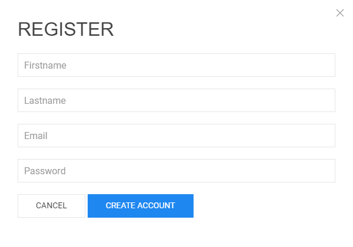

<h1><a class="anchor" id="introduction-to-user-interface" href="#introduction-to-user-interface"><i class="fa fa-link"></i></a>Úvod do používateľského rozhrania</h1><h2><a class="anchor" id="table-of-contents" href="#table-of-contents"><i class="fa fa-link"></i></a> Obsah</h2><ul><li>
 <a href="#introduction-page">Úvodná stránka</a>
</li><li>
 <a href="#upper-toolbar">Horný panel s nástrojmi</a>
<ul><li> <a href="#upper-toolbar_connect">Pripojte sa</a><ul><li> <a href="#upper-toolbar_connect_login">Prihlásiť sa</a></li><li> <a href="#upper-toolbar_connect_register">Registrovať</a></li><li> <a href="#upper-toolbar_connect_recover">Obnoviť</a></li></ul></li><li> <a href="#upper-toolbar_go-to-place">Choďte na miesto</a></li><li> <a href="#upper-toolbar_layers">Vrstvy</a></li><li> <a href="#upper-toolbar_selection-tools">Nástroje na výber</a></li><li> <a href="#upper-toolbar_show-result">Zobraziť Výsledok</a></li><li> <a href="#upper-toolbar_feedback">Spätná väzba</a></li><li> <a href="#upper-toolbar_save-session">Uložiť reláciu</a></li><li> <a href="#upper-toolbar_save-session-folder">Uložiť priečinok relácie</a></li></ul></li><li>
 <a href="#tiles">Dlaždice</a>
</li><li>
 <a href="#how-to-cite">Ako citovať</a>
</li><li>
 <a href="#authors-and-reviewers">Autori a recenzenti</a>
</li><li>
 <a href="#license">Licencia</a>
</li><li>
 <a href="#acknowledgement">Poďakovanie</a>
</li></ul><h2><a class="anchor" id="introduction-page" href="#introduction-page"><i class="fa fa-link"></i></a> Úvodná stránka</h2>
 Po otvorení panela s nástrojmi sa zobrazí stránka s vylúčením zodpovednosti. Okrem správy o vylúčení zodpovednosti sú poskytnuté ďalšie informácie týkajúce sa podporovaných prehľadávačov, cieľov projektu Hotmaps, odkazu na webovú stránku projektu Hotmaps a dátových úložísk.

 <em>Obr. 1 Krátky úvod do panela nástrojov Hotmaps</em>

 Hotmaps GUI je rozhranie založené na GIS. Po zatvorení stránky s vylúčením zodpovednosti sa používateľovi zobrazí mapa Európy. Štandardne je zobrazená mapa hustoty potreby tepla krajín EÚ-28 a hranice NUTS 2. Okrem týchto dvoch máp môžete v grafickom používateľskom rozhraní vidieť niektoré nástroje a tlačidlá. Tieto nástroje sú znázornené na nasledujúcom obrázku.

 <em>Obr. 2 Úvodná strana</em>

 Tu si na prvý pohľad všimnete 3 časti používateľského rozhrania:
<ol><li> <a href="#upper-toolbar">panel nástrojov vľavo hore</a> ,</li><li> samotná mapa,</li><li> <a href="#tiles">niektoré nástroje na zmenu štýlu mapy</a> .</li><li> dva odkazy vpravo hore: na túto <a href="https://wiki.hotmaps.eu/">Hotmaps Wiki</a> a na <a href="https://www.hotmaps-project.eu/">webovú stránku Hotmaps Project</a> .</li></ol>
 V nasledujúcich kapitolách sú prvé 3 body podrobne vysvetlené.

 <a href="#table-of-contents"><strong><code>To Top</code></strong></a>
<h2><a class="anchor" id="upper-toolbar" href="#upper-toolbar"><i class="fa fa-link"></i></a> Horný panel s nástrojmi</h2>

 Pomocou tohto panela s nástrojmi môžete:
<ol><li> <a href="#upper-toolbar_connect"><em>Pripojiť:</em></a> zaregistrujte sa a prihláste sa do webovej aplikácie, aby ste ušetrili svoju prácu,</li><li> <a href="#upper-toolbar_go-to-place"><em>Ísť na miesto:</em></a> priblížiť konkrétny región zadaním názvu,</li><li> <a href="#upper-toolbar_layers"><em>Vrstvy:</em></a> zobraziť bočný panel vrstvy,</li><li> <a href="#upper-toolbar_selection-tools"><em>Nástroje na výber</em> :</a> zapnutie alebo vypnutie nástrojov na výber,</li><li> <a href="#upper-toolbar_show-result"><em>Zobraziť výsledok:</em></a> zobrazí bočný panel s výsledkami vybratých oblastí,</li><li> <a href="#upper-toolbar_feedback"><em>Spätná väzba:</em></a> dajte nám spätnú väzbu ohľadom nástroja,</li><li> <a href="#upper-toolbar_save-session"><em>Save Session:</em></a> môžete uložiť vybrané vrstvy a úroveň priblíženia a neskôr si ich znova vyvolať,</li><li> <a href="#upper-toolbar_save-session-folder"><em>Uložiť priečinok relácie:</em></a> kde môžete vidieť zoznam všetkých uložených relácií.</li></ol>
 <a href="#table-of-contents"><strong><code>To Top</code></strong></a>
<h3><a class="anchor" id="connect" href="#connect"><i class="fa fa-link"></i></a> Pripojte sa</h3>
 Tu môžete:
<ul><li> Vytvoriť účet</li><li> Prihláste sa do svojho účtu, aby ste uložili svoj postup</li><li> Alebo ak si zabudnete heslo, resetujte ho</li></ul>
 <a href="#table-of-contents"><strong><code>To Top</code></strong></a>
<h4><a class="anchor" id="login" href="#login"><i class="fa fa-link"></i></a> Prihlásiť sa</h4>
 Po <a href="#register">registrácii</a> a aktivácii účtu by ste mali byť schopní prihlásiť sa pomocou svojho e-mailu a hesla (pozri <a href="#fig4">obrázok 4</a> nižšie).

 <em>Obr.4 .: Prihlasovací formulár</em>

 <a href="#table-of-contents"><strong><code>To Top</code></strong></a>
<h4><a class="anchor" id="register" href="#register"><i class="fa fa-link"></i></a> Registrovať</h4>
 Tu si môžete vytvoriť účet pre web <em>hotmaps</em> . Po odoslaní <a href="#fig5">formulára</a> dostanete e-mail na aktiváciu vášho účtu. Vďaka svojmu účtu budete môcť uložiť svoj postup.

 <em>Obr.5 .: Registračný formulár</em>

 <a href="#table-of-contents"><strong><code>To Top</code></strong></a>
<h4><a class="anchor" id="recover" href="#recover"><i class="fa fa-link"></i></a> Obnoviť</h4>
 Ak ste niekedy zabudli svoje heslo, môžete si ho obnoviť v tejto ponuke (pozri <a href="#fig6">obr. 6</a> nižšie). Potom nezabudnite nastaviť nové heslo.

 <em>Obr.6 .: Obnoviť formulár</em>

 <a href="#table-of-contents"><strong><code>To Top</code></strong></a>
<h3><a class="anchor" id="go-to-place" href="#go-to-place"><i class="fa fa-link"></i></a> Choďte na miesto</h3>
 Zadanú oblasť môžete zväčšiť zadaním jej názvu (pozri animáciu nižšie).

 <a href="#table-of-contents"><strong><code>To Top</code></strong></a>
<h3><a class="anchor" id="layers" href="#layers"><i class="fa fa-link"></i></a> Vrstvy</h3>
 Stlačením tohto tlačidla sa vľavo zobrazí bočný panel s rôznymi druhmi vrstiev.

 Nasledujúce vrstvy možno nájsť a vizualizovať:

 <a href="#table-of-contents"><strong><code>To Top</code></strong></a>
<h3><a class="anchor" id="selection-tools" href="#selection-tools"><i class="fa fa-link"></i></a> Nástroje na výber</h3>
 Stlačením tohto tlačidla sa nástroje na výber zobrazia v ľavej časti obrazovky

 Nasledujúci obrázok zobrazuje vzhľad nástrojov:

<ol><li> Nástroj na výber regiónov</li><li> Vytvorte si vlastnú štvorcovú oblasť</li><li> Vytvorte si vlastnú oblasť kruhu</li><li> Vytvorte si vlastnú oblasť mnohouholníkov</li><li> Ak chcete použiť výber vlastnej oblasti, nahrajte objekt GeoJSON</li></ol><ol type="A"><li> zobrazuje počet regiónov, ktoré ste vybrali</li><li> zobrazuje celkovú plochu najmenšieho obdĺžnika, ktorý môže pokrývať vybranú oblasť</li><li> zobrazuje mierku, ktorú ste vybrali na pravom paneli nástrojov</li></ol><ol type="a"><li> tlačidlo na načítanie výsledkov vybratej oblasti a vybratých vrstiev</li><li> tlačidlo na odstránenie vybratej oblasti</li></ol>
 <a href="#table-of-contents"><strong><code>To Top</code></strong></a>
<h3><a class="anchor" id="show-result" href="#show-result"><i class="fa fa-link"></i></a> Zobraziť Výsledok</h3>
 V závislosti od vrstiev a oblastí, ktoré ste vybrali, sa výsledky pre vašu konfiguráciu zobrazia na bočnom paneli v pravej časti obrazovky

 <a href="#table-of-contents"><strong><code>To Top</code></strong></a>
<h3><a class="anchor" id="feedback" href="#feedback"><i class="fa fa-link"></i></a> Spätná väzba</h3>
 Máte nejaké návrhy, ako tento nástroj vylepšiť? Všimli ste si nejaké chyby? Prosím dajte nám vedieť! Poskytnutím spätnej väzby nám pomôžete vylepšiť súbor nástrojov!

 Vyplňte nasledujúci <a href="#Fig7">formulár</a> :

 <a href="#table-of-contents"><strong><code>To Top</code></strong></a>

 môžete si vybrať z nasledujúcich typov:

 a nastaviť prioritu:

 <a href="#table-of-contents"><strong><code>To Top</code></strong></a>
<h3><a class="anchor" id="save-session" href="#save-session"><i class="fa fa-link"></i></a> Uložiť reláciu</h3>
 stlačením tohto tlačidla môžete vytvoriť snímku svojej práce (vybrané oblasti a vrstvy, úrovne zväčšenia atď.). Môžete tiež definovať názov a popis snímky.
<h3><a class="anchor" id="save-session-folder" href="#save-session-folder"><i class="fa fa-link"></i></a> Uložiť priečinok relácie</h3>
 Tu uvidíte všetky svoje snímky s ich názvami a popisom. Keď vyberiete jednu, načítajú sa vybrané vrstvy, oblasti, úroveň zväčšenia a ďalšia konfigurácia.
<h2><a class="anchor" id="tiles" href="#tiles"><i class="fa fa-link"></i></a> Dlaždice</h2>
 Môžete si zvoliť územnú mierku, ktorú chcete analyzovať (regióny NUTS alebo hektárová úroveň), a nastaviť dlaždicu mapy

 Možné sú nasledujúce konfigurácie

<ol><li> Priblíženie a oddialenie mapy</li><li> Ukážte hranice NUTS, aby ste vybrali konkrétne regióny NUTS, alebo použite hektár na prispôsobenie svojho <a href="#upper-toolbar_selection-tools">výberu</a></li><li> Použite dlaždicu OpenStreetMap alebo dlaždicu Satelite</li></ol>
 <a href="#table-of-contents"><strong><code>To Top</code></strong></a>
<h2><a class="anchor" id="how-to-cite" href="#how-to-cite"><i class="fa fa-link"></i></a> Ako citovať</h2>
 Jeton Hasani, Hotmaps-Wiki, Úvod do používateľského rozhrania (apríl 2019)

 <a href="#table-of-contents"><strong><code>To Top</code></strong></a>
<h2><a class="anchor" id="authors-and-reviewers" href="#authors-and-reviewers"><i class="fa fa-link"></i></a> Autori a recenzenti</h2>
 Túto stránku napísal Jeton Hasani <strong><a href="https://eeg.tuwien.ac.at/">EEG - TU Wien</a></strong> .

 ☑ Túto stránku skontroloval Mostafa Fallahnejad <strong><a href="https://eeg.tuwien.ac.at/">EEG - TU Wien</a></strong> .

 <a href="#table-of-contents"><strong><code>To Top</code></strong></a>
<h2><a class="anchor" id="license" href="#license"><i class="fa fa-link"></i></a> Licencia</h2>
 Autorské práva © 2016-2020: Jeton Hasani

 Medzinárodná licencia Creative Commons Attribution 4.0

 Toto dielo je licencované podľa medzinárodnej licencie Creative Commons CC BY 4.0.

 Identifikátor licencie SPDX: CC-BY-4.0

 Text licencie: https://spdx.org/licenses/CC-BY-4.0.html

 <a href="#table-of-contents"><strong><code>To Top</code></strong></a>
<h2><a class="anchor" id="acknowledgement" href="#acknowledgement"><i class="fa fa-link"></i></a> Poďakovanie</h2>
 Chceli by sme najhlbšie oceniť projekt Horizont 2020 <a href="https://www.hotmaps-project.eu">Hotmaps</a> (dohoda o grante č. 723677), ktorý poskytol finančné prostriedky na uskutočnenie tohto prešetrovania.

 <a href="#table-of-contents"><strong><code>To Top</code></strong></a>

<!--- THIS IS A SUPER UNIQUE IDENTIFIER -->

This page was automatically translated. View in another language:

[English](../en/Introduction-to-user-interface) (original) [Bulgarian](../bg/Introduction-to-user-interface)\* [Czech](../cs/Introduction-to-user-interface)\* [Danish](../da/Introduction-to-user-interface)\* [German](../de/Introduction-to-user-interface)\* [Greek](../el/Introduction-to-user-interface)\* [Spanish](../es/Introduction-to-user-interface)\* [Estonian](../et/Introduction-to-user-interface)\* [Finnish](../fi/Introduction-to-user-interface)\* [French](../fr/Introduction-to-user-interface)\* [Irish](../ga/Introduction-to-user-interface)\* [Croatian](../hr/Introduction-to-user-interface)\* [Hungarian](../hu/Introduction-to-user-interface)\* [Italian](../it/Introduction-to-user-interface)\* [Lithuanian](../lt/Introduction-to-user-interface)\* [Latvian](../lv/Introduction-to-user-interface)\* [Maltese](../mt/Introduction-to-user-interface)\* [Dutch](../nl/Introduction-to-user-interface)\* [Polish](../pl/Introduction-to-user-interface)\* [Portuguese (Portugal, Brazil)](../pt/Introduction-to-user-interface)\* [Romanian](../ro/Introduction-to-user-interface)\*  [Slovenian](../sl/Introduction-to-user-interface)\* [Swedish](../sv/Introduction-to-user-interface)\* 

\* machine translated
