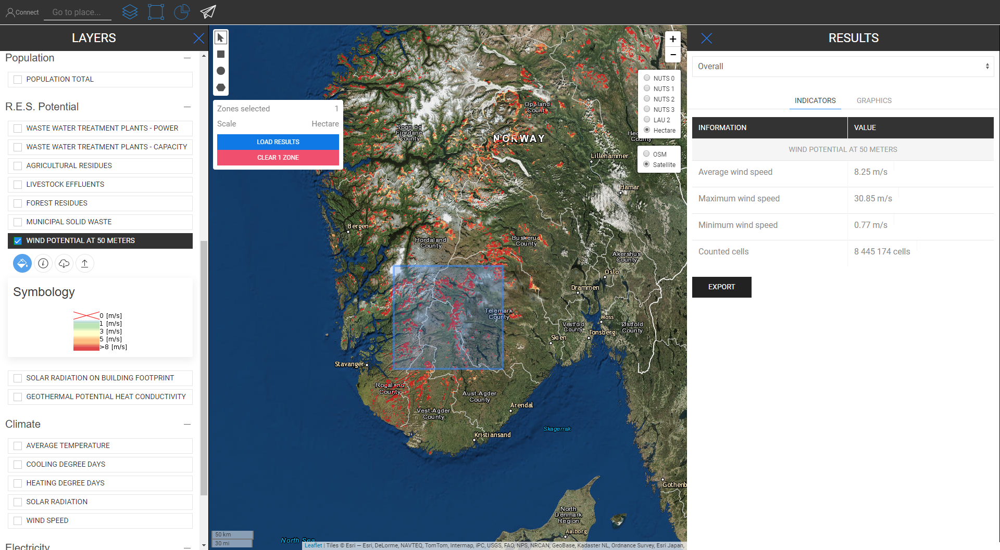

<h1><a class="anchor" id="retrieve-indicators-of-a-selected-area" href="#retrieve-indicators-of-a-selected-area"><i class="fa fa-link"></i></a>Načítajte indikátory vybranej oblasti</h1><h2><a class="anchor" id="table-of-contents" href="#table-of-contents"><i class="fa fa-link"></i></a> Obsah</h2><ul><li> <a href="#introduction">Úvod</a></li><li> <a href="#indicators-for-raster-layers">Indikátory pre rastrové vrstvy</a><ul><li> <a href="#indicators-for-raster-layers_buildings">Budovy</a></li><li> <a href="#indicators-for-raster-layers_population">Populácia</a></li><li> <a href="#indicators-for-raster-layers_renewable-energy-source-potentials">Potenciál obnoviteľných zdrojov energie</a></li></ul></li><li> <a href="#indicators-for-vector-layers">Indikátory pre vektorové vrstvy</a><ul><li> <a href="#indicators-for-vector-layers_industry">Priemysel</a></li><li> <a href="#indicators-for-vector-layers_renewable-energy-source-potentials">Potenciál obnoviteľných zdrojov energie</a></li><li> <a href="#indicators-for-vector-layers_electricity">Elektrina</a></li></ul></li><li> <a href="#example">Príklad</a></li><li> <a href="#how-to-cite">Ako citovať</a></li><li> <a href="#authors-and-reviewers">Autori a recenzenti</a></li><li> <a href="#license">Licencia</a></li><li> <a href="#acknowledgement">Poďakovanie</a></li></ul><h2><a class="anchor" id="introduction" href="#introduction"><i class="fa fa-link"></i></a> Úvod</h2>
 V závislosti od vrstiev a oblastí, ktoré ste vybrali, sa indikátory pre vašu konfiguráciu zobrazujú na bočnom paneli v pravej časti obrazovky

 <a href="#table-of-contents"><strong><code>To Top</code></strong></a>

 V ďalšom sa pozrieme na indikátory, ktoré sa zobrazujú pre rastrové a vektorové vrstvy.
<h2><a class="anchor" id="indicators-for-raster-layers" href="#indicators-for-raster-layers"><i class="fa fa-link"></i></a> Indikátory pre rastrové vrstvy</h2>
 Indikátory na rastrových vrstvách sa líšia od vektorových vrstiev. Pod pojmom rôzne rozumieme agregáciu a dezagregáciu. Toto odlišné správanie vychádza z územných rozhodnutí.

 Rastrové vrstvy majú zvyčajne oveľa vyššie rozlíšenie, zatiaľ čo vektorové vrstvy majú iba atribúty v bodoch alebo mnohouholníkoch.

 To napríklad na jednej strane znamená, že ak vyberiete vektorovú vrstvu, ktorá je definovaná polygónmi NUTS3, a chcete napríklad vybrať oblasť LAU, potom nebude hodnota NUTS3 rozčlenená na úroveň LAU, namiesto toho indikátor NUTS3, kde je to Nachádza sa oblasť LAU, ktorá sa zobrazí v bočnom paneli výsledkov.

 Na druhej strane sú rastrové vrstvy agregované a disagregované „ľubovoľne“ *

 * podľa obsahujúcich buniek vo vybratej oblasti (prirodzene v medziach samotného rastrového rozlíšenia)

 <a href="#table-of-contents"><strong><code>To Top</code></strong></a>
<h3><a class="anchor" id="buildings" href="#buildings"><i class="fa fa-link"></i></a> Budovy</h3>
 <strong>Mapa tepelnej hustoty</strong>

 <strong>Špeciálna funkcia</strong>

 Ak súčasne vyberiete vrstvu tepelnej hustoty a vrstvu obyvateľstva, zobrazí sa ďalší indikátor (pozri obrázok nižšie)

 <a href="#table-of-contents"><strong><code>To Top</code></strong></a>
<h3><a class="anchor" id="in-general-" href="#in-general-"><i class="fa fa-link"></i></a> Všeobecne:</h3>
 Keď je súčasne vybraná jedna z vrstiev budovy a vrstva obyvateľstva, zobrazí sa ďalší indikátor, ako je opísané vyššie

<ins> <code><strong><a href="#indicators-for-raster-layers">To Chapter</a></strong></code></ins>

 <strong>Mapa hustoty chladenia</strong>

<ins> <code><strong><a href="#indicators-for-raster-layers">To Chapter</a></strong></code></ins>

 <strong>Budovanie zväzkov</strong>

<ins> <code><strong><a href="#indicators-for-raster-layers">To Chapter</a></strong></code></ins>

 <strong>Hrubá podlahová plocha</strong>

<ins> <code><strong><a href="#indicators-for-raster-layers">To Chapter</a></strong></code></ins> <a href="#table-of-contents"><strong><code>To Top</code></strong></a>
<h3><a class="anchor" id="population" href="#population"><i class="fa fa-link"></i></a> Populácia</h3>

<ins> <code><strong><a href="#indicators-for-raster-layers">To Chapter</a></strong></code></ins> <a href="#table-of-contents"><strong><code>To Top</code></strong></a>
<h3><a class="anchor" id="climate" href="#climate"><i class="fa fa-link"></i></a> Podnebie</h3>
 <strong>Teplota</strong>

<ins> <code><strong><a href="#indicators-for-raster-layers">To Chapter</a></strong></code></ins>

 <strong>Dni chladenia</strong>

<ins> <code><strong><a href="#indicators-for-raster-layers">To Chapter</a></strong></code></ins>

 <strong>Dni vykurovania</strong>

<ins> <code><strong><a href="#indicators-for-raster-layers">To Chapter</a></strong></code></ins>

 <strong>Slnečné žiarenie</strong>

<ins> <code><strong><a href="#indicators-for-raster-layers">To Chapter</a></strong></code></ins>

 <strong>Rýchlosť vetra</strong>

<ins> <code><strong><a href="#indicators-for-raster-layers">To Chapter</a></strong></code></ins> <a href="#table-of-contents"><strong><code>To Top</code></strong></a>
<h3><a class="anchor" id="renewable-energy-source-potentials" href="#renewable-energy-source-potentials"><i class="fa fa-link"></i></a> Potenciál obnoviteľných zdrojov energie</h3>
 <strong>Solárne žiarenie na pôdoryse budovy</strong>

<ins> <code><strong><a href="#indicators-for-raster-layers">To Chapter</a></strong></code></ins>

 <strong>Potenciál vetra vo vzdialenosti 50m</strong>

<ins> <code><strong><a href="#indicators-for-raster-layers">To Chapter</a></strong></code></ins>

 <strong>Zvyšky z lesa</strong>

<ins> <code><strong><a href="#indicators-for-raster-layers">To Chapter</a></strong></code></ins> <a href="#table-of-contents"><strong><code>To Top</code></strong></a>
<h2><a class="anchor" id="indicators-for-vector-layers" href="#indicators-for-vector-layers"><i class="fa fa-link"></i></a> Indikátory pre vektorové vrstvy</h2><h3><a class="anchor" id="industry" href="#industry"><i class="fa fa-link"></i></a> Priemysel</h3>
 <strong>Emisie z priemyselných areálov</strong>

<ins> <code><strong><a href="#indicators-for-vector-layers">To Chapter</a></strong></code></ins>

 <strong>Prebytočné teplo priemyselného areálu</strong>

<ins> <code><strong><a href="#indicators-for-vector-layers">To Chapter</a></strong></code></ins>

 <strong>Názov spoločnosti na priemyselnom webe</strong>

<ins> <code><strong><a href="#indicators-for-vector-layers">To Chapter</a></strong></code></ins>

 <strong>Subsektor priemyselných stavieb</strong>

<ins> <code><strong><a href="#indicators-for-vector-layers">To Chapter</a></strong></code></ins> <a href="#table-of-contents"><strong><code>To Top</code></strong></a>
<h3><a class="anchor" id="renewable-energy-source-potentials" href="#renewable-energy-source-potentials"><i class="fa fa-link"></i></a> Potenciál obnoviteľných zdrojov energie</h3>
 <strong>Energia z čistiarní odpadových vôd</strong>

<ins> <code><strong><a href="#indicators-for-vector-layers">To Chapter</a></strong></code></ins>

 <strong>Kapacita čistiarní odpadových vôd</strong>

<ins> <code><strong><a href="#indicators-for-vector-layers">To Chapter</a></strong></code></ins>

 <strong>Poľnohospodárske zvyšky</strong>

<ins> <code><strong><a href="#indicators-for-vector-layers">To Chapter</a></strong></code></ins>

 <strong>Výtoky hospodárskych zvierat</strong>

<ins> <code><strong><a href="#indicators-for-vector-layers">To Chapter</a></strong></code></ins>

 <strong>Komunálny tuhý odpad</strong>

<ins> <code><strong><a href="#indicators-for-vector-layers">To Chapter</a></strong></code></ins>

 <strong>Geotermálna potenciálna tepelná vodivosť</strong>

<ins> <code><strong><a href="#indicators-for-vector-layers">To Chapter</a></strong></code></ins> <a href="#table-of-contents"><strong><code>To Top</code></strong></a>
<h3><a class="anchor" id="electricity" href="#electricity"><i class="fa fa-link"></i></a> Elektrina</h3>
 <strong>Emisie elektriny C02</strong>

<ins> <code><strong><a href="#indicators-for-vector-layers">To Chapter</a></strong></code></ins> <a href="#table-of-contents"><strong><code>To Top</code></strong></a>
<h2><a class="anchor" id="example" href="#example"><i class="fa fa-link"></i></a> Príklad</h2>
 Na obrázku nižšie vidíte, ako to vyzerá, keď sú vizualizované všetky vrstvy (tu je Rakúsko vybraté ako NUTS0)

 Aj keď táto mapa môže na prvý pohľad pôsobiť trochu mätúco, jej indikátory sú znázornené priamo. Nižšie nájdete všetky indikátory, ktoré sú popísané na bočnom paneli výsledkov, keď vyberiete všetky vrstvy pre Rakúsko (NUTS0).

 <a href="#table-of-contents"><strong><code>To Top</code></strong></a>
<h2><a class="anchor" id="how-to-cite" href="#how-to-cite"><i class="fa fa-link"></i></a> Ako citovať</h2>
 Jeton Hasani, in Hotmaps-Wiki, Získanie indikátorov vybranej oblasti (apríl 2019)

 <a href="#table-of-contents"><strong><code>To Top</code></strong></a>
<h2><a class="anchor" id="authors-and-reviewers" href="#authors-and-reviewers"><i class="fa fa-link"></i></a> Autori a recenzenti</h2>
 Túto stránku napísal Jeton Hasani <strong><a href="https://eeg.tuwien.ac.at/">EEG - TU Wien</a></strong> .

 ☑ Túto stránku skontroloval Mostafa Fallahnejad <strong><a href="https://eeg.tuwien.ac.at/">EEG - TU Wien</a></strong> .

 <a href="#table-of-contents"><strong><code>To Top</code></strong></a>
<h2><a class="anchor" id="license" href="#license"><i class="fa fa-link"></i></a> Licencia</h2>
 Autorské práva © 2016-2020: Jeton Hasani

 Medzinárodná licencia Creative Commons Attribution 4.0

 Toto dielo je licencované podľa medzinárodnej licencie Creative Commons CC BY 4.0.

 Identifikátor licencie SPDX: CC-BY-4.0

 Text licencie: https://spdx.org/licenses/CC-BY-4.0.html

 <a href="#table-of-contents"><strong><code>To Top</code></strong></a>
<h2><a class="anchor" id="acknowledgement" href="#acknowledgement"><i class="fa fa-link"></i></a> Poďakovanie</h2>
 Chceli by sme najhlbšie oceniť projekt Horizont 2020 <a href="https://www.hotmaps-project.eu">Hotmaps</a> (dohoda o grante č. 723677), ktorý poskytol finančné prostriedky na uskutočnenie tohto prešetrovania.

 <a href="#table-of-contents"><strong><code>To Top</code></strong></a> <code><a href="Indicator-Section/_edit">Review this page</a></code>

<!--- THIS IS A SUPER UNIQUE IDENTIFIER -->

This page was automatically translated. View in another language:

[English](../en/Retrieve-indicators-of-a-selected-area) (original) [Bulgarian](../bg/Retrieve-indicators-of-a-selected-area)\* [Czech](../cs/Retrieve-indicators-of-a-selected-area)\* [Danish](../da/Retrieve-indicators-of-a-selected-area)\* [German](../de/Retrieve-indicators-of-a-selected-area)\* [Greek](../el/Retrieve-indicators-of-a-selected-area)\* [Spanish](../es/Retrieve-indicators-of-a-selected-area)\* [Estonian](../et/Retrieve-indicators-of-a-selected-area)\* [Finnish](../fi/Retrieve-indicators-of-a-selected-area)\* [French](../fr/Retrieve-indicators-of-a-selected-area)\* [Irish](../ga/Retrieve-indicators-of-a-selected-area)\* [Croatian](../hr/Retrieve-indicators-of-a-selected-area)\* [Hungarian](../hu/Retrieve-indicators-of-a-selected-area)\* [Italian](../it/Retrieve-indicators-of-a-selected-area)\* [Lithuanian](../lt/Retrieve-indicators-of-a-selected-area)\* [Latvian](../lv/Retrieve-indicators-of-a-selected-area)\* [Maltese](../mt/Retrieve-indicators-of-a-selected-area)\* [Dutch](../nl/Retrieve-indicators-of-a-selected-area)\* [Polish](../pl/Retrieve-indicators-of-a-selected-area)\* [Portuguese (Portugal, Brazil)](../pt/Retrieve-indicators-of-a-selected-area)\* [Romanian](../ro/Retrieve-indicators-of-a-selected-area)\*  [Slovenian](../sl/Retrieve-indicators-of-a-selected-area)\* [Swedish](../sv/Retrieve-indicators-of-a-selected-area)\* 

\* machine translated
