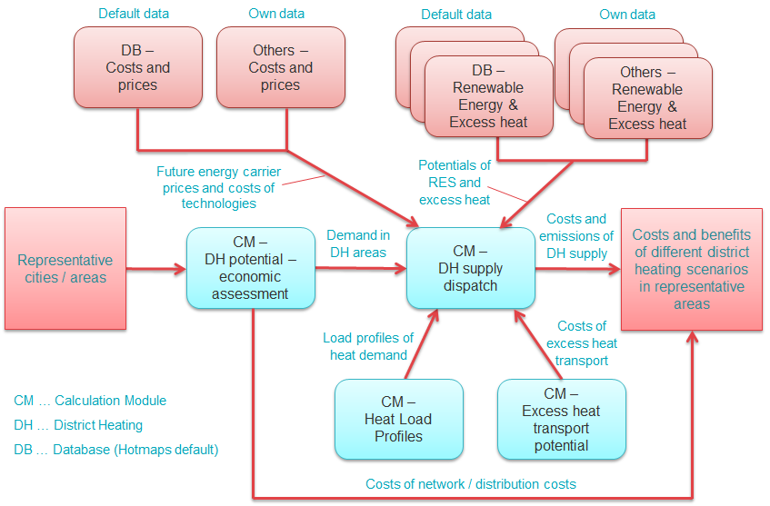

<h1><a class="anchor" id="national-level---step-2--costs-and-potentials-for-district-heating-in-representative-regions-or-cities" href="#national-level---step-2--costs-and-potentials-for-district-heating-in-representative-regions-or-cities"><i class="fa fa-link"></i></a>Národná úroveň - Krok 2: Náklady a potenciál diaľkového vykurovania v reprezentatívnych regiónoch alebo mestách</h1>
 <a href="guide-national-level-comprehensive-assessment-eed#part-iii-analysis-of-the-economic-potential-for-efficiency-in-heating-and-cooling_different-steps"><strong><code>Scenario Toolchain Steps</code></strong></a> <a href="step-1-identification-of-different-representative-cases-for-district-heating"><strong><code>Previous step</code></strong></a> <a href="Step-3-Calculation-of-decentral-heat-supply"><strong><code>Next step</code></strong></a> 
<h2><a class="anchor" id="table-of-contents" href="#table-of-contents"><i class="fa fa-link"></i></a> Obsah</h2><ul><li> <a href="#introduction">Úvod</a></li><li> <a href="#costs-and-potentials-for-district-heating-in-representative-regions-or-cities">Náklady a potenciál diaľkového vykurovania v reprezentatívnych regiónoch alebo mestách</a><ul><li> <a href="#costs-and-potentials-for-district-heating-in-representative-regions-or-cities_economic-assessment-of-the-potential-for-district-heating">Ekonomické hodnotenie potenciálu diaľkového vykurovania</a></li><li> <a href="#costs-and-potentials-for-district-heating-in-representative-regions-or-cities_estimation-of-costs-for-the-transport-of-excess-heat-to-district-heating-areas">Odhad nákladov na prepravu prebytočného tepla do oblastí diaľkového vykurovania</a></li><li> <a href="#costs-and-potentials-for-district-heating-in-representative-regions-or-cities_development-of-future-heat-load-profiles">Vývoj budúcich profilov tepelného zaťaženia</a></li><li> <a href="#costs-and-potentials-for-district-heating-in-representative-regions-or-cities_calculation-of-costs-and-emissions-of-heat-supply-in-district-heating">Výpočet nákladov a emisií dodávky tepla pri diaľkovom vykurovaní</a></li></ul></li><li> <a href="#how-to-cite">Ako citovať</a></li><li> <a href="#authors-and-reviewers">Autori a recenzenti</a></li><li> <a href="#license">Licencia</a></li><li> <a href="#acknowledgement">Poďakovanie</a></li></ul><h2><a class="anchor" id="introduction" href="#introduction"><i class="fa fa-link"></i></a> Úvod</h2>
 Toto je druhý krok analýzy na vnútroštátnej úrovni.

<ins> <code><strong><a href="#table-of-contents">To Top</a></strong></code></ins>
<h2><a class="anchor" id="costs-and-potentials-for-district-heating-in-representative-regions-or-cities" href="#costs-and-potentials-for-district-heating-in-representative-regions-or-cities"><i class="fa fa-link"></i></a> Náklady a potenciál diaľkového vykurovania v reprezentatívnych regiónoch alebo mestách</h2>
 Pre identifikované reprezentatívne mestá / oblasti je možné vykonať analýzy nákladov a potenciálov na dodávku tepla diaľkovým vykurovaním. Pre tieto analýzy poskytuje Hotmaps rôzne predvolené dátové vrstvy v databáze Hotmaps, ako aj rôzne výpočtové moduly (CM). Môžu sa tiež nahrávať a používať vlastné údaje. Tieto analýzy môžu pozostávať z nasledujúcich krokov:
<ul><li> Posúdiť ekonomický potenciál sietí diaľkového vykurovania</li><li> Odhadnite náklady na prepravu prebytočného tepla do oblastí diaľkového vykurovania</li><li> Vypracovať budúce profily tepelného zaťaženia</li><li> Vypočítajte náklady a emisie z dodávky tepla pri diaľkovom vykurovaní</li></ul>
 Nasledujúci obrázok zobrazuje tento postup graficky a zobrazuje rôzne zdroje údajov a výpočtové moduly, ktoré je možné použiť.
 * Obrázok: Analýza nákladov a potenciálov diaľkového vykurovania v reprezentatívnych mestách / regiónoch (krok 2) *
 V nasledujúcich podkapitolách sú rôzne kroky v tomto postupe podrobnejšie popísané.

<ins> <code><strong><a href="#table-of-contents">To Top</a></strong></code></ins>
<h3><a class="anchor" id="economic-assessment-of-the-potential-for-district-heating" href="#economic-assessment-of-the-potential-for-district-heating"><i class="fa fa-link"></i></a> Ekonomické hodnotenie potenciálu diaľkového vykurovania</h3>
 Pre reprezentatívne mestá / oblasti je možné vykonať ekonomické hodnotenie diaľkového vykurovania, aby sa získal podrobnejší prehľad o nákladoch a ekonomickej uskutočniteľnosti diaľkového vykurovania a množstve tepla potenciálne dodávaného diaľkovým vykurovaním v týchto oblastiach. Na tento účel možno použiť CM - Potenciál diaľkového vykurovania: ekonomické hodnotenie. Tento modul generuje mapu potenciálnych oblastí diaľkového vykurovania na základe posúdenia nákladov na distribúciu tepla. Analýzu uskutočniteľnosti diaľkového vykurovania v analyzovaných oblastiach je možné hodnotiť takto:
<ul><li> Prispôsobte náklady na výstavbu siete podľa skúseností vo vašom regióne / krajine záujmu</li><li> Vypočítajte priemerné náklady na distribúciu tepla a požiadavky na diaľkové vykurovanie pre rôzne vstupné parametre</li><li> Vymeňte napríklad tieto dôležité ovplyvňujúce faktory:<ul><li> Úspory tepla za analytické obdobie</li><li> Trhové podiely diaľkového vykurovania</li><li> Prahová hodnota pre prijateľné náklady na distribúciu tepla</li><li> Náklady na výstavbu siete</li><li> Čas odpisovania a úroková sadzba</li></ul></li></ul>
 Scenáre je možné použiť na analýzu vplyvu rôznych faktorov na náklady na distribúciu tepla v systémoch diaľkového vykurovania v rôznych reprezentatívnych mestách / oblastiach. Pre rôzne nastavenia doby odpisu a úrokovej sadzby by sa mal pre ďalšiu analýzu zvoliť jeden scenár rozšírenia diaľkového vykurovania na reprezentatívne mesto / oblasť.

 Výsledkom tohto kroku je potreba tepla na diaľkové vykurovanie [GWh / rok] a náklady na distribúciu tepla [EUR / MWh] v každom z reprezentatívnych miest / oblastí. Tieto výsledky sa potom použijú pri celkovom porovnaní scenárov v kroku 4.

<ins> <code><strong><a href="#table-of-contents">To Top</a></strong></code></ins>
<h3><a class="anchor" id="estimation-of-costs-for-the-transport-of-excess-heat-to-district-heating-areas" href="#estimation-of-costs-for-the-transport-of-excess-heat-to-district-heating-areas"><i class="fa fa-link"></i></a> Odhad nákladov na prepravu prebytočného tepla do oblastí diaľkového vykurovania</h3>
 Na odhad nákladov na prepravu prebytočného tepla z potenciálnych zdrojov mimo oblastí diaľkového vykurovania do potenciálnych oblastí diaľkového vykurovania možno použiť CM - Potenciál prepravy nadmerného tepla. Modul poskytuje vyrovnané náklady na prebytočné teplo transportované do siete diaľkového vykurovania [EUR / MWh]. Toto je možné ďalej použiť v ďalšom kroku výpočtu nákladov na dodávku tepla pri diaľkovom vykurovaní.

<ins> <code><strong><a href="#table-of-contents">To Top</a></strong></code></ins>
<h3><a class="anchor" id="development-of-future-heat-load-profiles" href="#development-of-future-heat-load-profiles"><i class="fa fa-link"></i></a> Vývoj budúcich profilov tepelného zaťaženia</h3>
 Renovácia budov vedie k zníženiu potreby energie na vykurovanie priestorov. To ovplyvňuje aj profily zaťaženia potreby tepla v systémoch diaľkového vykurovania: znižujú sa špičkové požiadavky v zime a zvyšuje sa počet hodín plného zaťaženia v dôsledku vyššieho podielu výroby teplej vody na celkovej potrebe tepla. S profilmi CM - Tepelné zaťaženie možno budúce profily tepelného zaťaženia vytvoriť podľa rôznych úrovní úspory tepla. To možno vykonať na základe profilov načítania poskytnutých v databáze Hotmaps (predvolené profily pre všetky regióny NUTS2 v Európe) alebo na základe vašich vlastných profilov nahraných do panela nástrojov. Výsledné záťažové profily sa potom použijú v ďalšom kroku, pri výpočte nákladov a emisií dodávky tepla v diaľkovom vykurovaní pomocou dispečerského modulu.

<ins> <code><strong><a href="#table-of-contents">To Top</a></strong></code></ins>
<h3><a class="anchor" id="calculation-of-costs-and-emissions-of-heat-supply-in-district-heating" href="#calculation-of-costs-and-emissions-of-heat-supply-in-district-heating"><i class="fa fa-link"></i></a> Výpočet nákladov a emisií dodávky tepla pri diaľkovom vykurovaní</h3>
 Náklady a emisie za dodávku tepla v systéme diaľkového vykurovania závisia od interakcie rôznych inštalovaných napájacích kapacít. Preto je zaujímavé kombinovať kapacity a ich prevádzku v priebehu času s najmenšími nákladmi. Na analýzu tzv. Hodinovej expedície rôznych kombinácií technológií dodávok a vplyvu na celkové náklady a emisie dodávky tepla pri diaľkovom vykurovaní je možné použiť CM - dodávka diaľkového vykurovania. S modulom je možné vypočítať niekoľko scenárov s nasledujúcimi kombináciami vstupných údajov, aby sa z nich odvodili náklady a prínosy:
<ul><li> Kombinácie rôznych technológií v dodávateľských portfóliách:<ul><li> Prebytočné teplo z priemyslu (s tepelným čerpadlom alebo bez neho)</li><li> Spaľovanie odpadu</li><li> Vysoko efektívna kogenerácia</li><li> Solárne tepelné</li><li> Geotermálna</li><li> Biomasa</li><li> Tepelné čerpadlá s rôznymi zdrojmi tepla, ako napr<ul><li> čistiarne odpadových vôd</li><li> riečna voda</li><li> prebytočné teplo z dátových centier</li></ul></li></ul></li><li> Cenové scenáre:<ul><li> pre ceny rôznych nosičov energie</li><li> pre ceny emisie CO2</li></ul></li></ul>
 Výpočty môžu byť použité na identifikáciu prospešných portfólií dodávok v rôznych reprezentatívnych mestách / oblastiach a ich citlivosti na dôležité ovplyvňujúce parametre, ako je energetický nosič a ceny CO2 alebo úroková miera a doba odpisovania.

 Výsledkom tohto kroku sú náklady na dodávku tepla do systému diaľkového vykurovania [EUR / MWh] v každom z reprezentatívnych miest / oblastí a súvisiace emisie CO2 [kt / rok]. Tieto výsledky sa potom použijú pri celkovom porovnaní scenárov v kroku 4.

<ins> <code><strong><a href="#table-of-contents">To Top</a></strong></code></ins>
<h2><a class="anchor" id="how-to-cite" href="#how-to-cite"><i class="fa fa-link"></i></a> Ako citovať</h2>
 Marcus Hummel, Giulia Conforto, Hotmaps-Wiki, Pokyny pre používanie súpravy nástrojov Hotmaps na analýzy na národnej úrovni (august 2020)

<ins> <code><strong><a href="#table-of-contents">To Top</a></strong></code></ins>
<h2><a class="anchor" id="authors-and-reviewers" href="#authors-and-reviewers"><i class="fa fa-link"></i></a> Autori a recenzenti</h2>
 Túto stránku napísali Marcus Hummel a Giulia Conforto ( <strong><a href="https://e-think.ac.at">e-think</a></strong> ).

 ☑ Túto stránku skontroloval Mostafa Fallahnejad ( <strong><a href="https://eeg.tuwien.ac.at/">EEG - TU Wien</a></strong> ).

 <a href="#table-of-contents"><strong><code>To Top</code></strong></a>
<h2><a class="anchor" id="license" href="#license"><i class="fa fa-link"></i></a> Licencia</h2>
 Copyright © 2016-2020: Marcus Hummel, Giulia Conforto

 Medzinárodná licencia Creative Commons Attribution 4.0

 Toto dielo je licencované podľa medzinárodnej licencie Creative Commons CC BY 4.0.

 Identifikátor licencie SPDX: CC-BY-4.0

 Text licencie: https://spdx.org/licenses/CC-BY-4.0.html

<ins> <code><strong><a href="#table-of-contents">To Top</a></strong></code></ins>
<h2><a class="anchor" id="acknowledgement" href="#acknowledgement"><i class="fa fa-link"></i></a> Poďakovanie</h2>
 Chceli by sme najhlbšie oceniť projekt Horizont 2020 <a href="https://www.hotmaps-project.eu">Hotmaps</a> (dohoda o grante č. 723677), ktorý poskytol finančné prostriedky na uskutočnenie tohto prešetrovania.

<ins> <code><strong><a href="#table-of-contents">To Top</a></strong></code></ins>

<!--- THIS IS A SUPER UNIQUE IDENTIFIER -->

This page was automatically translated. View in another language:

[English](../en/Step-2-Costs-and-potentials-for-district-heating-in-representative-regions-or-cities) (original) [Bulgarian](../bg/Step-2-Costs-and-potentials-for-district-heating-in-representative-regions-or-cities)\* [Czech](../cs/Step-2-Costs-and-potentials-for-district-heating-in-representative-regions-or-cities)\* [Danish](../da/Step-2-Costs-and-potentials-for-district-heating-in-representative-regions-or-cities)\* [German](../de/Step-2-Costs-and-potentials-for-district-heating-in-representative-regions-or-cities)\* [Greek](../el/Step-2-Costs-and-potentials-for-district-heating-in-representative-regions-or-cities)\* [Spanish](../es/Step-2-Costs-and-potentials-for-district-heating-in-representative-regions-or-cities)\* [Estonian](../et/Step-2-Costs-and-potentials-for-district-heating-in-representative-regions-or-cities)\* [Finnish](../fi/Step-2-Costs-and-potentials-for-district-heating-in-representative-regions-or-cities)\* [French](../fr/Step-2-Costs-and-potentials-for-district-heating-in-representative-regions-or-cities)\* [Irish](../ga/Step-2-Costs-and-potentials-for-district-heating-in-representative-regions-or-cities)\* [Croatian](../hr/Step-2-Costs-and-potentials-for-district-heating-in-representative-regions-or-cities)\* [Hungarian](../hu/Step-2-Costs-and-potentials-for-district-heating-in-representative-regions-or-cities)\* [Italian](../it/Step-2-Costs-and-potentials-for-district-heating-in-representative-regions-or-cities)\* [Lithuanian](../lt/Step-2-Costs-and-potentials-for-district-heating-in-representative-regions-or-cities)\* [Latvian](../lv/Step-2-Costs-and-potentials-for-district-heating-in-representative-regions-or-cities)\* [Maltese](../mt/Step-2-Costs-and-potentials-for-district-heating-in-representative-regions-or-cities)\* [Dutch](../nl/Step-2-Costs-and-potentials-for-district-heating-in-representative-regions-or-cities)\* [Polish](../pl/Step-2-Costs-and-potentials-for-district-heating-in-representative-regions-or-cities)\* [Portuguese (Portugal, Brazil)](../pt/Step-2-Costs-and-potentials-for-district-heating-in-representative-regions-or-cities)\* [Romanian](../ro/Step-2-Costs-and-potentials-for-district-heating-in-representative-regions-or-cities)\*  [Slovenian](../sl/Step-2-Costs-and-potentials-for-district-heating-in-representative-regions-or-cities)\* [Swedish](../sv/Step-2-Costs-and-potentials-for-district-heating-in-representative-regions-or-cities)\* 

\* machine translated
