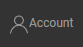
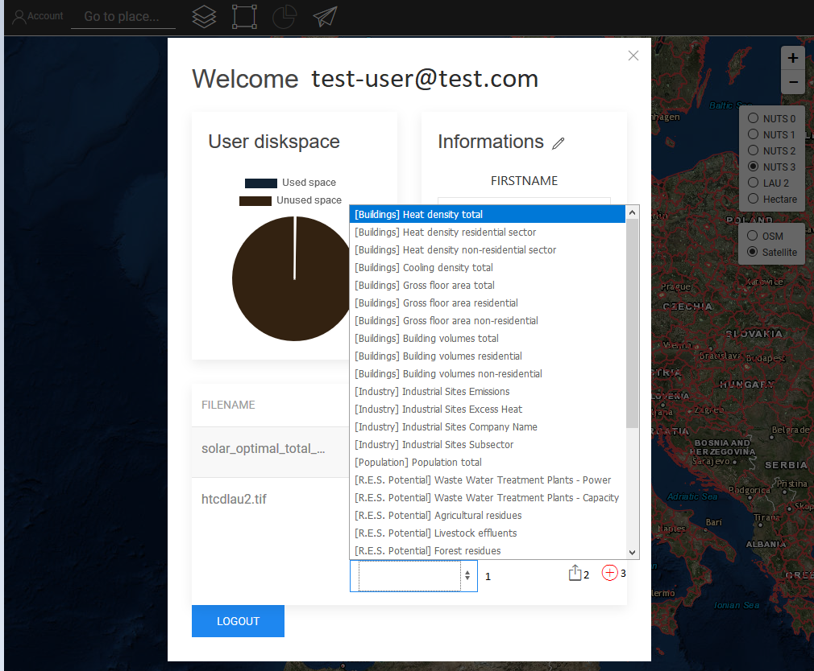
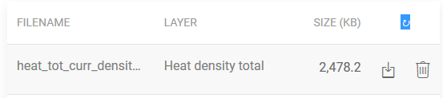
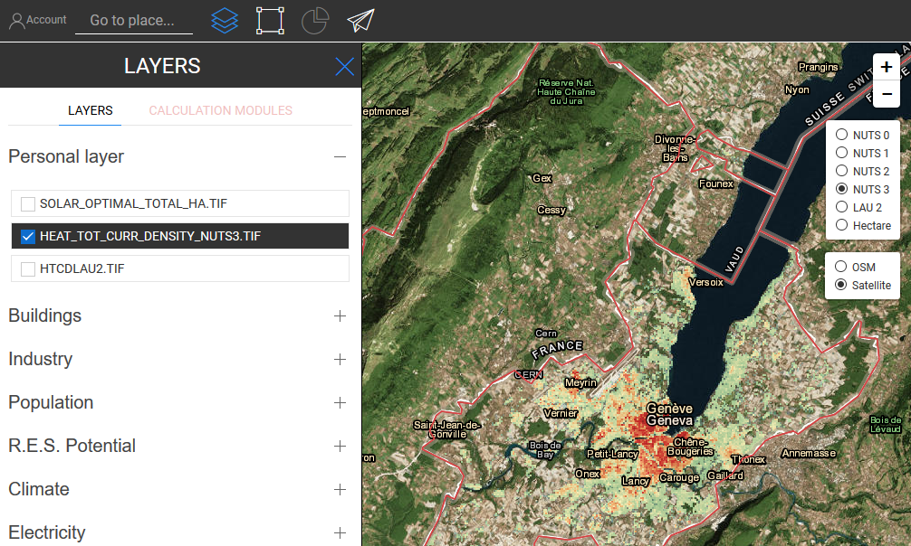

<h2> Kazalo vsebine </h2><ul><li> <a href="#Introduction">Uvod</a> </li><li> <a href="#How-to-upload-a-layer-with-custom-data">Kako naložiti plast s podatki po meri</a> </li><li> <a href="#How-to-display-an-uploaded-layer">Kako prikazati naloženi sloj</a> </li><li> <a href="#Offline-mode">Način brez povezave</a> </li><li> <a href="#Data-security-and-privacy">Varnost podatkov in zasebnost</a> </li><li> <a href="#References">Reference</a> </li><li> <a href="#How-to-cite">Kako navajati</a> </li><li> <a href="#Authors-and-reviewers">Avtorji in recenzenti</a> </li><li> <a href="#Acknowledgement">Zahvala</a> </li></ul><h2> Uvod </h2>
 Platforma omogoča nalaganje nekaterih podatkov po meri iz vašega računalnika v Hotmaps. Ta del je tesno povezan z <a href="sl-Data-export-functionalities">izvozno</a> funkcijo, saj je končni cilj teh dveh funkcij izvoz nekaterih podatkov, urejanje le-teh in vizualizacija v orodju pozneje z uvozom teh podatkov nazaj. Upoštevajte, da se lahko naloženi podatki samo vizualizirajo, na njih trenutno ni mogoče izvajati računskih modulov. 

 Za to operacijo je <strong>potreben uporabniški račun</strong> . Postopki registracije in prijave so razloženi na naslednji strani: <a href="sl-Introduction-to-user-interface#Connect">Uporabniški račun</a> . 

 Če želite naložiti nabor podatkov brez kakršnih koli težav. Najprej uporabite funkcijo <a href="sl-Data-export-functionalities">izvoza</a> za območje, ki ga želite uvoziti (glejte stran <a href="sl-Data-export-functionalities">Izvoz podatkov</a> ). 

<ins> <code><strong><a href="#table-of-contents">To Top</a></strong></code> </ins> 
<h2> Kako naložiti plast s podatki po meri </h2>
 S pritiskom na  gumb v zgornjem levem kotu strani. Tako bo stran s profilom spredaj. 

 Na strani profila: 
<ol><li> izbira vrste nabora podatkov </li><li> izbira datoteke za nalaganje (.tif ali .csv) </li><li> naložite s klikom na ikono "+" </li></ol>

 Izbira vrste nabora podatkov se uporablja za pridobitev pravilne simbologije. Če se vaš nabor podatkov ne ujema s simboliko plasti, ne bo prikazan pravilno. 

 Ko to storite, se prikaže sporočilo o uspehu in plast se pojavi na seznamu plasti na strani profila. 

 Vsak uporabnik ima omejen prostor na disku, ko uporabnik nima dovolj prostega prostora, ne bo mogel dodati več datotek, lahko levi prostor vizualno predstavite s skodelico v polju Uporabniški diskovni prostor. 

 Preden lahko plast prikaže na zemljevidu, bo strežnik potreboval nekaj časa (do nekaj minut) po sporočilu o uspehu, da pravilno uvozi nabor podatkov. Nabor podatkov je na voljo za prikaz, ko njegova velikost ni več 0. 

 Plast lahko zdaj prikažemo na zemljevidu, tako da jo aktiviramo na plošči plasti. 

<ins> <code><strong><a href="#table-of-contents">To Top</a></strong></code> </ins> 
<h2> Kako prikazati naloženi sloj </h2>
 S klikom na ikono je mogoče prikazati plast, ki je bila predhodno naložena s plošče slojev  gumb. 

 Seznam naloženih slojev je prikazan v razdelku »Osebni sloji« na vrhu leve plošče. 

 Plast lahko prikažemo tako, da jo aktiviramo na levi plošči. 

<ins> <code><strong><a href="#table-of-contents">To Top</a></strong></code> </ins> 
<h2> Način brez povezave </h2>
 Če ste odjavljeni, ne boste mogli dostopati do nobenih vaših osebnih slojev, vendar so še vedno na voljo, ko se ponovno prijavite. 

<ins> <code><strong><a href="#table-of-contents">To Top</a></strong></code> </ins> 
<h2> Varnost podatkov in zasebnost </h2>
 Orodja Hotmaps nudi varnost uporabnikom, ki ustvarjajo račun na platformi. Izvedeni so običajni varnostni ukrepi: HTTPS protokol, šivanje / soljenje gesla in tako naprej. Upoštevajte pa, da naloženi nabor podatkov trenutno ni šifriran, ko so shranjeni na strežniku, zato se izogibajte nalaganju občutljivih podatkov. 

<ins> <code><strong><a href="#table-of-contents">To Top</a></strong></code> </ins> 
<h2> Reference </h2>
<ins> <code><strong><a href="#table-of-contents">To Top</a></strong></code> </ins> 
<h2> Kako navajati </h2>
<ins> <code><strong><a href="#table-of-contents">To Top</a></strong></code> </ins> 
<h2> Avtorji in recenzenti </h2>
 Avtorji: 
<ul><li> Daniel Hunacek </li><li> Lucien Zuber </li></ul>
 Recenzenti: 

<ins> <code><strong><a href="#table-of-contents">To Top</a></strong></code> </ins> 
<h2> Zahvala </h2>
 Želeli bi izraziti našo globoko zahvalo projektu Obzorja 2020 <a href="https://www.hotmaps-project.eu">Hotmaps</a> (sporazum o dodelitvi sredstev 723677), ki je zagotovil sredstva za izvedbo te preiskave. 

<ins> <code><strong><a href="#table-of-contents">To Top</a></strong></code> </ins> 

This page was automatically translated. View in another language:

[English](en-Data-upload-functionalities) (original) [Bulgarian](bg-Data-upload-functionalities)\* [Croatian](hr-Data-upload-functionalities)\* [Czech](cs-Data-upload-functionalities)\* [Danish](da-Data-upload-functionalities)\* [Dutch](nl-Data-upload-functionalities)\* [Estonian](et-Data-upload-functionalities)\* [Finnish](fi-Data-upload-functionalities)\* [French](fr-Data-upload-functionalities)\* [German](de-Data-upload-functionalities)\* [Greek](el-Data-upload-functionalities)\* [Hungarian](hu-Data-upload-functionalities)\* [Irish](ga-Data-upload-functionalities)\* [Italian](it-Data-upload-functionalities)\* [Latvian](lv-Data-upload-functionalities)\* [Lithuanian](lt-Data-upload-functionalities)\* [Maltese](mt-Data-upload-functionalities)\* [Polish](pl-Data-upload-functionalities)\* [Portuguese (Portugal, Brazil)](pt-Data-upload-functionalities)\* [Romanian](ro-Data-upload-functionalities)\* [Slovak](sk-Data-upload-functionalities)\*  [Spanish](es-Data-upload-functionalities)\* [Swedish](sv-Data-upload-functionalities)\*
\*: machine translated
