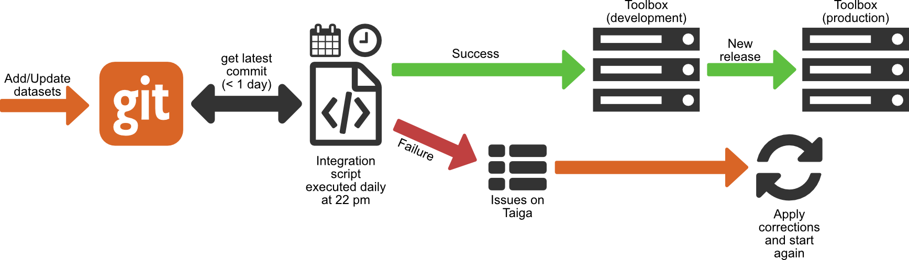
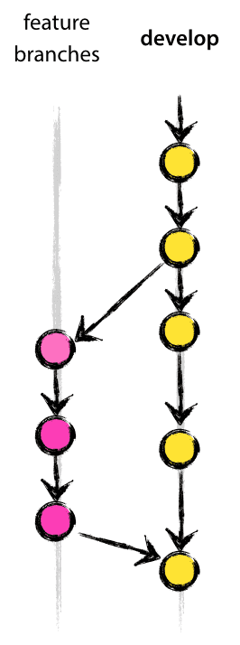
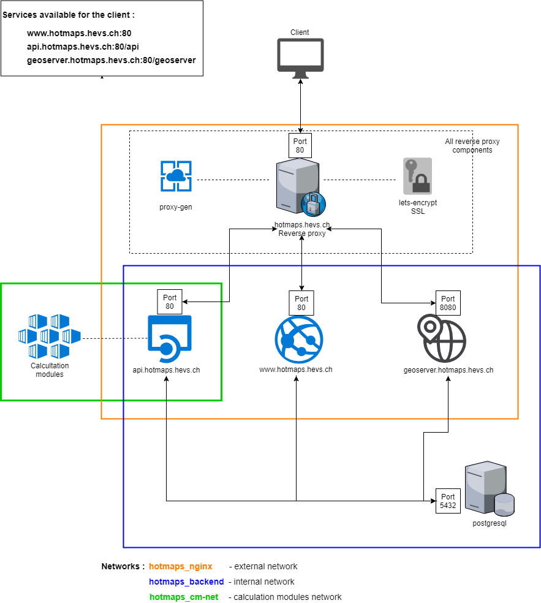

<h2> Kazalo vsebine </h2><ul><li> <a href="#Introduction">Uvod</a> </li><li> <a href="#Dataset-integration">Integracija nabora podatkov</a> </li><li> <a href="#add-your-datasets-on-gitlab">Dodajte svoje podatkovne skupine v GitLab</a> </li><li> <a href="#List-of-main-repositories">Seznam glavnih skladišč</a> </li><li> <a href="#How-to-contribute-code">Kako prispevati kodo</a> </li><li> <a href="#Description-of-IT-infrastructure">Opis IT infrastrukture</a> <ul><li> <a href="#Run-with-Docker">Teči z Dockerjem</a> </li><li> <a href="#Server-infrastructure">Strežniška infrastruktura</a> <ul><li> <a href="#Infrastructure">Infrastruktura</a> </li><li> <a href="#Performance">Izvedba</a> </li></ul></li></ul></li><li> <a href="#How-to-define-indicators">Kako definirati kazalnike</a> </li><li> <a href="#References">Reference</a> </li><li> <a href="#How-to-cite">Kako navajati</a> </li><li> <a href="#Authors-and-reviewers">Avtorji in recenzenti</a> </li><li> <a href="#Acknowledgement">Zahvala</a> </li></ul><h2> Uvod </h2>
 Ta stran vsebuje vse informacije, potrebne razvijalcem, da prispevajo k platformi Hotmaps ali da razumejo, kako deluje. 

<ins> <code><strong><a href="#table-of-contents">To Top</a></strong></code> </ins> 
<h2> Integracija nabora podatkov </h2>
 Vključevanje novih javnih podatkovnih nizov se obravnava na naslednji način: 
<ol><li> <a href="#Add-your-datasets-on-GitLab">nabor</a> podatkov je treba potisniti v git repozitorij ( <a href="#Add-your-datasets-on-GitLab">dodajte svoje podatkovne nabore v GitLab</a> ) </li><li> vsak večer skript integrira nove / posodobljene nabore podatkov na platformo DEV </li><li> če je vse delovalo dobro, je nabor podatkov zdaj na voljo na platformi DEV in razvijalci ga lahko vključijo v svojo kodo </li><li> Ko je kodiranje končano, se nove funkcije dodajo na proizvodno platformo z novo izdajo </li></ol>

 Če nabor podatkov med integracijo ne bo uspel, se ustvari težava na Tajgi (platforma za upravljanje projektov). Zadeva kaže na povzročeno napako in razvijalci bi jo morali odpraviti in svoje delo znova potisniti v Git, da bi ga skript lahko poskusil ponovno vključiti naslednji večer. 

 Izvorna koda integracijske skripte je na voljo na tej povezavi: <a href="https://github.com/HotMaps/CI_DatasetIntegration">Integracija podatkov</a> 

<ins> <code><strong><a href="#table-of-contents">To Top</a></strong></code> </ins> 
<h2> Dodajte svoje podatkovne skupine v GitLab </h2>
 Če želite na seznam javnih zbirk podatkov dodati nabore podatkov, jih morate potisniti v novo Gitovo skladišče v GitLabu. Tukaj je organizacija GitLab, kamor je treba potisniti nabore podatkov: nabori <a href="https://gitlab.com/hotmaps">podatkov v GitLab</a> . 

 Enkrat na dan se repozitoriji preverijo, ali imajo novi zapisi. Proces integracije preveri, ali so podatki v skladu s specifikacijo ali ne. 

 Tu je specifikacija: <a href="uploads%5CHotmaps_Data-upload-on-Gitlab_2017-12-04_V4.pdf">Hotmaps_Data-upload-on-Gitlab_2017-12-04_V4.pdf</a> 

<ins> <code><strong><a href="#table-of-contents">To Top</a></strong></code> </ins> 
<h2> Seznam glavnih skladišč </h2>
 Koda aplikacije se nahaja na GitHubu v okviru <a href="https://github.com/HotMaps">organizacije Hotmaps</a> . Ta organizacija ima več skladišč 
<ul><li> <a href="https://github.com/HotMaps/Hotmaps-toolbox-service">Hotmaps-toolbox-odjemalec</a> vsebuje <a href="https://github.com/HotMaps/Hotmaps-toolbox-service">sprednjo</a> stran naše aplikacije. To je kotni projekt (JavaScript) </li><li> <a href="https://github.com/HotMaps/Hotmaps-toolbox-service">Hotmaps-toolbox-service</a> vsebuje API za našo aplikacijo. Temelji na Flask (Python) </li><li> <a href="https://github.com/HotMaps/hotmaps_wiki">Hotmaps-wiki</a> je Wiki, ki ga trenutno berete </li><li> <a href="https://github.com/HotMaps/base_calculation_module">modul</a> osnovni <a href="https://github.com/HotMaps/base_calculation_module">izračun</a> je osnovna predloga, ki jo lahko uporabite za ustvarjanje lastnih računskih modulov za Hotmape </li><li> seznam modulov za izračun </li></ul>
<ins> <code><strong><a href="#table-of-contents">To Top</a></strong></code> </ins> 
<h2> Kako prispevati kodo </h2>
 Če želite dodati nekaj kode v Hotmaps, imate dve možnosti: če želite posodobiti vmesnik ali zaledje, morate spremeniti odjemalca ali storitveno shrambo orodja. Če želite dodati svoj lastni modul za izračun, lahko ustvarite svoje skladišče tako, da sledite <a href="https://github.com/HotMaps/base_calculation_module">branju skladišča base_calculation_module</a> 

 Če želite opraviti nekaj dela v skladišču Git, ne delajte neposredno z glavno vejo. Izdelajte novo vejo iz veje za razvoj, opravite svoje delo na tej veji in ko je vaša funkcija preizkušena, lahko svoje delo združite z vejo za razvoj, kot je prikazano na naslednjem grafu. 

 Če želite nekaj potisniti v repozitorij Hotmaps-a, morate biti član ekipe Hotmaps, če niste, še vedno lahko izvedete vilico našega orodja, da razvijete svoje orodje. 

 Več informacij o delu lahko najdete v teh dokumentih: 
<ul><li> <a href="uploads/Hotmaps_python_best_practices_tutorial_2017-08-07_v01.pdf">Hotmaps_python_best_practices_tutorial_2017-08-07_v01.pdf</a> </li><li> <a href="uploads%5CHotmaps_Testing_in_python_tutorial_pytest_2017-08-07_v01.pdf">Hotmaps_Testing_in_python_tutorial_pytest_2017-08-07_v01.pdf</a> </li><li> <a href="uploads%5CGitFlow_Guidelines_CREM_2017-02-01.pdf">GitFlow_Guidelines_CREM_2017-02-01.pdf</a> </li></ul>
<ins> <code><strong><a href="#table-of-contents">To Top</a></strong></code> </ins> 
<h2> Opis IT infrastrukture </h2>

 Vse storitve in komponente se uporabljajo prek lastnega Dockerjevega zabojnika. Vsi ti vsebniki so opredeljeni v eni datoteki, ki sestavlja docker. Slika zgoraj predstavlja IT-arhitekturo Hotmapov. 

 Nekatere partnerske organizacije so komunikacijo omejile samo na vrata 80. Da bi se izognili težavam, ki jih povzroča ta omejitev, je bilo ustvarjeno povratno proxy. Ta povratni proxy ponuja eno samo vstopno točko in nato razdeli zahtevo, ki jo stranka pošlje zadevni storitvi. Povratni proxy je sestavljen iz treh komponent: 
<ol><li> Povratni proxy strežnik: služi kot edinstvena vstopna točka in distribuira zahteve do pravih storitev. </li><li> Proxy gen: je storitev, ki samodejno preslika vse storitve v obratnem proxyju. Tako ni treba ročno dodati nove storitve v konfiguracijo proxyja </li><li> lets-encrypt: gre za storitev, ki omogoča uporabo protokola SSL. Potrebno je za aktiviranje protokola https. Potrdila SSL podpišejo e-poštni naslov, konfiguriran v tej storitvi. </li></ol>
 Obstajajo tri mreže: 
<ul><li> hotmaps_nginx omogoča povratni proxy, da komunicira z api, frontendom in geoserverjem. V glavnem omogoča, da zahtevo razdeli pravilni službi med tremi. </li><li> hotmaps_backend omogoča komunikacijo med vsemi komponentami zaledja: api, frontend, geoserver in zbirko podatkov PostgreSQL. </li><li> hotmaps_cm-net omogoča komunikacijo med posameznimi računskimi moduli in api. </li></ul>
 Vsak modul za izračun ima svoj Docker posodo. 
<h3> Teči z Dockerjem </h3>
 Hotmaps uporablja <a href="https://www.docker.com/">DOCKER</a> programsko opremo in <a href="https://docs.docker.com/compose/">DOCKER-Novo sporočilo</a> funkcije za upravljanje zabojnikov. Datoteka docker-compose.yml vsebuje celotno konfiguracijo Dockerjeve arhitekture (konfiguracija vsebnikov, omrežij, povezav, ...). To omogoča zagon kontejnerjev z enim preprostim ukazom: 
<pre> <code class="language-shell">docker-compose up</code> </pre>
 <em>Več o docker-compose je na <a href="https://docs.docker.com/compose/reference/">spletnem</a> seznamu Docker: <a href="https://docs.docker.com/compose/reference/">Sestavi sklic ukazne vrstice</a> in <a href="https://docs.docker.com/compose/compose-file/">Sestavi referenco datoteke</a> .</em> 

 Obstaja samo en vsebnik, ki se izvaja ločeno od drugih: to je baza podatkov, ker mora ves čas ostati v stanju. Zato ni v konfiguracijski datoteki docker-compose. 
<h3> Strežniška infrastruktura </h3><h4> Infrastruktura </h4>
 Trenutno strežnik gostuje v HES-SO v Švici. Na voljo sta dva stroja: eden za razvoj (razvoj in preizkušanje) in eden za proizvodnjo (dejanski <a href="https://www.hotmaps.eu">paket</a> orodij, na voljo na <a href="https://www.hotmaps.eu">www.hotmaps.eu</a> ). 

 Oba stroja imata enako specifikacijo: 
<ul><li> CPU: Intel Xeon E5-2680 v4 (8) pri 2,4 GHz) </li><li> RAM: 16 GB </li><li> HDD: 500 GB </li><li> OS: Ubutnu 16.04 LTS </li></ul><h4> Izvedba </h4>
 Na razvojnem strežniku pogosto izvajamo preizkuse učinkovitosti, da zagotovimo določeno količino sočasnih uporabnikov. 

 Spodnji primer so rezultati prve beta različice v primerjavi s prihodnjimi testi. Nova izdaja vključuje nekaj izboljšav delovanja. 

 <em>Ta primer prikazuje preizkuse uspešnosti sočasnih uporabnikov, ki uporabljajo isto funkcijo: "krivulja trajanja za izbiro hektarja". Krepka črta prikazuje mejo, v kateri strežnik začne odkrivati napake. Izbira hektara je dober primer, saj prikazuje poizvedbe, ki zahtevajo največ sredstev.</em> 

 <strong>Beta izdaja marca 2019</strong> 

 | Nb simuliranih uporabnikov | Povprečni čas | Mediana | Najdaljši čas | Min. Čas | Odstotek napak | | --------------------- | ------------ | ------ | -------- | -------- | -------------------- | | 1 | 2936 | 2936 | 2936 | 2936 | 0 | | 20 | 9329 | 9503 | 11778 | 6901 | 0 | | 50 | 22922 | 22713 | 33401 | 8661 | 0 | | <strong>100</strong> | 33302 | 32875 | 58257 | 4929 | <strong>16</strong> | | 200 | na | na | na | na | na | | 300 | na | na | na | na | na | 

 <strong>Prihodnja izdaja na DEV-u (marec 2019)</strong> 

 | Nb simuliranih uporabnikov | Povprečni čas | Mediana | Najdaljši čas | Min. Čas | Odstotek napak | | --------------------- | ------------ | ------ | -------- | -------- | -------------------- | | 1 | 1802 | 1802 | 1802 | 1802 | 0 | | 20 | 5289 | 2677 | 6873 | 2149 | 0 | | 50 | 10775 | 11274 | 17081 | 2577 | 0 | | 100 | 19807 | 20280 | 35142 | 3156 | 0 | | 200 | 37302 | 37575 | 69930 | 3381 | 0 | | <strong>300</strong> | 49091 | 57536 | 83578 | 2447 | <strong>26</strong> | 

<ins> <code><strong><a href="#table-of-contents">To Top</a></strong></code> </ins> 
<h2> Kako definirati kazalnike </h2>
 <a href="indicator_readme">Kazalnik Definiton</a> 

<ins> <code><strong><a href="#table-of-contents">To Top</a></strong></code> </ins> 
<h2> Reference </h2>
<ins> <code><strong><a href="#table-of-contents">To Top</a></strong></code> </ins> 
<h2> Kako navajati </h2>
<ins> <code><strong><a href="#table-of-contents">To Top</a></strong></code> </ins> 
<h2> Avtorji in recenzenti </h2>
 Avtorji: 
<ul><li> Daniel Hunacek </li><li> Lucien Zuber </li><li> Matthieu Dayer </li></ul>
 Recenzenti: 

<ins> <code><strong><a href="#table-of-contents">To Top</a></strong></code> </ins> 
<h2> Zahvala </h2>
 Želeli bi izraziti našo globoko zahvalo projektu Obzorja 2020 <a href="https://www.hotmaps-project.eu">Hotmaps</a> (sporazum o dodelitvi sredstev 723677), ki je zagotovil sredstva za izvedbo te preiskave. 

<ins> <code><strong><a href="#table-of-contents">To Top</a></strong></code> </ins> 
<h2></h2>

This page was automatically translated. View in another language:

[English](en-Developers) (original) [Bulgarian](bg-Developers)\* [Croatian](hr-Developers)\* [Czech](cs-Developers)\* [Danish](da-Developers)\* [Dutch](nl-Developers)\* [Estonian](et-Developers)\* [Finnish](fi-Developers)\* [French](fr-Developers)\* [German](de-Developers)\* [Greek](el-Developers)\* [Hungarian](hu-Developers)\* [Irish](ga-Developers)\* [Italian](it-Developers)\* [Latvian](lv-Developers)\* [Lithuanian](lt-Developers)\* [Maltese](mt-Developers)\* [Polish](pl-Developers)\* [Portuguese (Portugal, Brazil)](pt-Developers)\* [Romanian](ro-Developers)\* [Slovak](sk-Developers)\*  [Spanish](es-Developers)\* [Swedish](sv-Developers)\*
\*: machine translated
