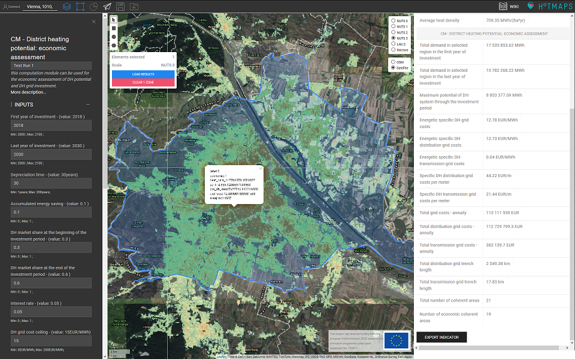

<h1><a class="anchor" id="cm-district-heating-potential-economic-assessment" href="#cm-district-heating-potential-economic-assessment"><i class="fa fa-link"></i></a>CM ekonomska ocena potenciala daljinskega ogrevanja</h1><h2><a class="anchor" id="table-of-contents" href="#table-of-contents"><i class="fa fa-link"></i></a> Kazalo</h2><ul><li> <a href="#in-a-glance">Na prvi pogled</a></li><li> <a href="#introduction">Uvod</a></li><li> <a href="#inputs-and-outputs">Vhodi in izhodi</a></li><li> <a href="#method">Metoda</a><ul><li> <a href="#method_solver-options">Možnosti reševanja</a></li></ul></li><li> <a href="#github-repository-of-this-calculation-module">Repozitorij GitHub tega modula za izračun</a></li><li> <a href="#sample-run">Vzorec teka</a><ul><li> <a href="#sample-run_test-run-default-input-values-for-the-case-study-of-vienna">Test Run: privzete vhodne vrednosti za študijo primera na Dunaju</a></li></ul></li><li> <a href="#references">Reference</a></li><li> <a href="#how-to-cite">Kako citirati</a></li><li> <a href="#authors-and-reviewers">Avtorji in recenzenti</a></li><li> <a href="#license">Licenca</a></li><li> <a href="#acknowledgement">Zahvala</a></li></ul><h2><a class="anchor" id="in-a-glance" href="#in-a-glance"><i class="fa fa-link"></i></a> Na prvi pogled</h2>
 S tem modulom za izračun lahko na podlagi poenostavljene ocene stroškov distribucije in prenosa toplote določite potencialna območja daljinskega ogrevanja. Vhodni podatki modula so zemljevidi povpraševanja po toploti in bruto gostote tal, stroški širitve omrežja, razvoj potrebe po toploti in stopnje priključitve, čas amortizacije, obrestna mera in prag za sprejete stroške distribucije toplote. Poleg tega izračuna stroške daljnovodov med določenimi območji daljinskega ogrevanja.

 <a href="#table-of-contents"><strong><code>To Top</code></strong></a>
<h2><a class="anchor" id="introduction" href="#introduction"><i class="fa fa-link"></i></a> Uvod</h2>
 Ta modul za izračun uporablja zemljevid gostote toplote (HDM) in zemljevid bruto gostote tal za predlaganje metode, ki temelji na GIS, za določanje potencialnih območij DH s posebnim poudarkom na omrežnih stroških daljinskega ogrevanja. V orodjarni ima uporabnik možnost uporabiti privzeti nabor podatkov, ki ga ponuja orodjarna, in sicer <a href="https://gitlab.com/hotmaps/heat/heat_tot_curr_density">karto gostote povpraševanja po toploti</a> in <a href="https://gitlab.com/hotmaps/heat/heat_tot_curr_density">zemljevid</a> <a href="https://gitlab.com/hotmaps/gfa_tot_curr_density">bruto bruto talne površine</a> , ali pa uporabiti lastne sloje enakih vrst, ki se naložijo na osebni račun Hotmaps. Območja DH se določijo z izvajanjem analiz občutljivosti na HDM ob upoštevanju vnaprej določene zgornje meje povprečnih stroškov distribucije. Pristop dodatno omogoča oceno dolžine in premera daljnovodov in s tem povezanih stroškov. Izhodi so sloji GIS, ki ponazarjajo področja, ki so ekonomsko upravičena za gradnjo DH, pa tudi stroškovno minimalne daljnovode, ki povezujejo te regije med seboj. Modul za izračun se lahko uporablja za proučevanje vpliva parametrov, kot so zgornja meja omrežnih stroškov in tržni delež, na potencial ter na širitev in razširitev sistemov za ogrevanje.

 <a href="#table-of-contents"><strong><code>To Top</code></strong></a>
<h2><a class="anchor" id="inputs-and-outputs" href="#inputs-and-outputs"><i class="fa fa-link"></i></a> Vhodi in izhodi</h2>
 Vhodni sloji in parametri ter izhodni sloji in parametri za CM so naslednji.

 <strong>Vhodni sloji in parametri so:</strong>
<ul><li> Parametri:<ul><li> Prvo leto naložbe</li><li> Zadnje leto naložbe: določa, v koliko letih naj dosežete ciljni tržni delež DH.</li><li> Čas amortizacije v <em><strong>letih</strong></em> : višji čas amortizacije zmanjša skupne stroške, saj bo vaš sistem trajal dlje in bo služil več</li><li> Akumulirani prihranek energije: pričakovano razmerje med energijo, ki se prihrani v <strong>zadnjem letu naložbe</strong> zaradi npr. Prenove stavb v primerjavi s potrebo po toploti v <strong>prvem letu naložbe</strong> . večji akumulirani prihranki energije pomenijo manjše gostote povpraševanja po toploti in verjetno bo to povzročilo večje specifične stroške distribucijskega omrežja.</li><li> Tržni delež DH na začetku investicijskega obdobja: prikazuje trenutno stanje na izbranem območju.</li><li> Tržni delež DH na koncu naložbenega obdobja: ciljni tržni delež, ki ga želite doseči.</li><li> Obrestna mera</li><li> Zgornja meja stroškov omrežja DH v <em><strong>EUR / MWh</strong></em> : Na potencialnih območjih toplotne energije stroški distribucijskega omrežja ne smejo presegati te opredeljene zgornje meje stroškov distribucijskega omrežja.</li><li> <strong>Konstanta</strong> stroškov gradnje v <em><strong>EUR / m,</strong></em> kot tudi <strong>koeficient</strong> stroškov gradnje v <em><strong>EUR / m 2</strong></em></li><li> Ure polne obremenitve: uporablja se za izračun največje obremenitve, ki je pomembna za dimenzijo cevi. Tu se to uporablja izključno za transportno mrežo.</li><li> MIPGap: možnost rešitve za optimizacijo, s katero lahko določite, kako natančen mora biti vaš odgovor. Upoštevajte, da manjše vrzeli vodijo do večje natančnosti in stroškov CPU-ja.</li></ul></li><li> Plasti:<ul><li> Zemljevid toplotne gostote in zemljevid bruto gostote tal: privzeti zemljevidi so na voljo v orodjarni; lastno naloženi zemljevidi se lahko uporabljajo tudi v CM<ul><li> v rastrski obliki (* .tif)</li><li> z ločljivostjo 1 hektar</li><li> gostote povpraševanja v <em><strong>MWh / ha</strong></em> in bruto gostote tal v <em><strong>m 2 / ha</strong></em></li></ul></li></ul></li></ul>
 <strong>Izhodni sloji in parametri so:</strong>
<ul><li> Parametri:<ul><li> Skupno povpraševanje v izbrani regiji v prvem letu naložb v <em><strong>MWh</strong></em></li><li> Skupno povpraševanje v izbrani regiji v zadnjem letu naložb v <em><strong>MWh</strong></em></li><li> Največji potencial sistema DH skozi naložbeno obdobje v <em><strong>MWh</strong></em></li><li> Specifični energetski stroški omrežja DH v <em><strong>EUR / MWh</strong></em></li><li> Specifični energijski stroški distribucijskega omrežja za toplotno energijo v <em><strong>EUR / MWh</strong></em></li><li> Specifični energijski stroški prenosnega omrežja DH v <em><strong>EUR / MWh</strong></em></li><li> Specifični stroški distribucijskega omrežja DH na meter v <em><strong>EUR / m</strong></em></li><li> Posebni stroški prenosnega omrežja DH na meter v <em><strong>EUR / m</strong></em></li><li> Skupni stroški omrežja - renta v <em><strong>EUR / leto</strong></em></li><li> Skupni stroški distribucijskega omrežja - anuiteta v <em><strong>EUR / leto</strong></em></li><li> Skupni stroški prenosnega omrežja - renta v <em><strong>EUR / leto</strong></em></li><li> Skupna dolžina jarka distribucijske mreže v <em><strong>km</strong></em></li><li> Skupna dolžina jarka prenosnega omrežja v <em><strong>km</strong></em></li><li> Skupno število koherentnih območij</li><li> Število ekonomsko skladnih območij</li></ul></li><li> Plasti:<ul><li> Gostota povpraševanja po toploti v zadnjem letu investicijskega obdobja (ob upoštevanju prihrankov energije) v rastrski obliki</li><li> Območja DH (tako ekonomska kot negospodarska) v obliki zapisa datotek</li><li> Daljnovodi in njihove zmogljivosti v obliki zapisa datotek</li></ul></li></ul>
 <a href="#table-of-contents"><strong><code>To Top</code></strong></a>
<h2><a class="anchor" id="method" href="#method"><i class="fa fa-link"></i></a> Metoda</h2>
 Tu je podana kratka razlaga metodologije. Za bolj popolno razlago metodologije in formulacij, glejte dostop odprtem <a href="https://www.sciencedirect.com/science/article/pii/S1876610218304740">dokumentu</a> , objavljenem za ta izračun modula [ <a href="#references">1</a> ].

 Cilj modula za izračun je najti regije, v katerih je mogoče zgraditi sisteme za ogrevanje, ne da bi presegli uporabniško določeno zgornjo mejo specifičnih stroškov v <em><em>EUR / MWh</em></em> . To se naredi pod naslednjimi predpostavkami:
<ul><li> Ekonomsko območje s toploto z največjo potrebo po toploti velja za edini razpoložljivi vir toplote. Toploto proizvaja zase in za vsa druga ekonomsko skladna področja.</li><li> med dvema področjema DH lahko toplota teče v eno smer,</li><li> šteje se, da ostaja letno povpraševanje po toplotni energiji po zadnjem letu naložbenega obdobja nespremenjeno</li><li> opredeljeni tržni deleži in relativni prihranki energije so enaki v vseh celicah analiziranega območja.</li><li> Model ustvari samo en povezan sistem DH. Ni mogoče imeti dveh ali več neodvisnih omrežij.</li><li> Vhodni parameter &quot;zgornja meja omrežja&quot; se pomnoži s ~ 95%, da dobimo zgornjo mejo stroškov distribucijskega omrežja. Ta vrednost se uporablja za določanje potencialnih območij DH.</li></ul>
 Določitev ekonomskih območij DH poteka v treh korakih. Za več podrobnosti glejte priložene preizkusne vožnje.

 <strong>KORAK 1: Izračun stroškov distribucijskega omrežja na podlagi potrebe po toploti in razmerja parcele z uporabo izbranih kart gostote toplote in bruto gostote tal</strong>

 <strong>KORAK 2: Določitev potencialnih območij DH</strong>

 <strong>KORAK 3: Določitev ekonomskih območij DH in zmogljivosti daljnovodov ter konfiguracija, potrebna za medsebojno povezavo teh območij.</strong>
<h3><a class="anchor" id="solver-options" href="#solver-options"><i class="fa fa-link"></i></a> Možnosti rešitve</h3>
 Ta modul za izračun uporablja rešitev Gurobi za reševanje optimizacijskega problema. Da bi zagotovili stabilno funkcionalnost računskega modula, smo predstavili več možnosti za reševanje optimizacijskega problema. Te možnosti so naslednje:
<ul><li> Razmik med spodnjo in zgornjo mejo cilja je nastavljen na 0,01 (MIPGap = 1e-2).<ul><li> Manjša vrzel običajno daje natančnejši odgovor. Vendar je to lahko s stališča CPU zelo drago.</li></ul></li><li> Relativna razlika med osnovno in dvojno ciljno vrednostjo je bila nastavljena na 0,0001 (BarConvTol = 1e-4).</li><li> Fokus rešitve je nastavljen na 1, da bi našli izvedljive rešitve. Tu poudarek ni niti na optimalnosti niti na ciljih (MIPFocus = 1).</li><li> Omejili smo količino uporabljenega RAM-a na 500 MB, da ne bi prišli do kritičnih situacij v primeru sočasnih zagonov različnih uporabnikov (NodefileStart = 0,5).</li></ul>
 <a href="#table-of-contents"><strong><code>To Top</code></strong></a>
<h2><a class="anchor" id="github-repository-of-this-calculation-module" href="#github-repository-of-this-calculation-module"><i class="fa fa-link"></i></a> Repozitorij GitHub tega modula za izračun</h2>
 <a href="https://github.com/HotMaps/dh_economic_assessment/tree/develop">Tukaj</a> najdete najboljši razvoj tega modula za izračun.

 <a href="#table-of-contents"><strong><code>To Top</code></strong></a>
<h2><a class="anchor" id="sample-run" href="#sample-run"><i class="fa fa-link"></i></a> Vzorec teka</h2>
 Tu je uporabljen modul za izračun študije primera na Dunaju v Avstriji. Najprej s pomočjo vrstice »Pojdi na mesto« pojdite na Dunaj in izberite mesto. Kliknite gumb &quot;LAYERS&quot;, da odprete vrstico &quot;Layers&quot;, nato kliknite jeziček &quot;MODUL IZRAČUNA&quot;. Na seznamu modulov za izračun izberite &quot;CM - DISTRICNI OGREVALNI POTENCIAL: EKONOMSKA OCENA&quot;.
<h3><a class="anchor" id="test-run--default-input-values-for-the-case-study-of-vienna" href="#test-run--default-input-values-for-the-case-study-of-vienna"><i class="fa fa-link"></i></a> Test Run: privzete vhodne vrednosti za študijo primera na Dunaju</h3>
 Privzete vrednosti v orodjarni so v bistvu primerne za Dunaj, torej morda ne ustrezajo drugim regijam in jih je treba prilagoditi glede na vašo študijo primera. Izračun se opravi za obdobje od leta 2018 do leta 2030 (leto 2018 je leto 0, leto 2030 pa leto 12 in obdobje naložbe bo 12 let). Pričakovani akumulirani količnik prihranka energije kaže na zmanjšanje potrebe po toploti v primerjavi z začetkom investicijskega obdobja (leto 2018). Tržni delež DH se nanaša na tržni delež znotraj območij DH. Njegova vrednost na začetku investicijskega obdobja (leto 2018) prikazuje dejanski tržni delež (običajno znan). Pričakovani tržni delež ob koncu naložbenega obdobja je pričakovan. Ta vrednost izhaja iz cestnih zemljevidov, scenarijev, pravilnikov itd. Za privzeti primer upoštevamo obrestno mero 5 odstotkov. Zgornja meja stroškov DH omrežja se pomnoži s ~ 95%, da se doseže zgornja meja stroškov za distribucijsko omrežje. Z uporabo te vrednosti dobimo potencialna območja DH. Na potencialnih območjih povprečni stroški distribucijskega omrežja ne smejo presegati zgornje meje stroškov distribucijskega omrežja. Vrednost ur polne obremenitve se uporablja za oceno največje obremenitve in iskanje ustrezne dimenzije za prenosno omrežje.

 Konstanta stroškov gradnje in koeficient stroškov gradnje izhaja iz reference [ <a href="#references">2, 3</a> ]. Pridobljene regije so zelo občutljive na te vrednosti. Kot splošni komentar zato predlagamo, da najprej izračunate s temi vrednostmi in samo, če menite, da te vrednosti vodijo do pretiranega ali podcenjevanja vaših rezultatov, nato jih spremenite.

 Za izračun se privzeto uporabljata karta gostote toplote in karta bruto gostote tal, ki sta na voljo v orodjarni. Za zagon izračuna lahko uporabite svoje naložene sloje. V tem vzorčnem zagonu uporabljamo privzete sloje.

 Zdaj pritisnite gumb &quot;RUN CM&quot; in počakajte, da se izračun konča.

 <strong>POMEMBNO</strong> : Upoštevajte, da lahko ta modul za izračun traja nekaj minut, da najde končno rešitev. Če izračun traja zelo dolgo (več kot 10 minut), izberite manjše območje za izračun. Tudi uporaba poljubnih vrednosti lahko privede do dolgega časa izračuna. Zato se prepričajte, da so navedene vrednosti primerne za izbrano regijo.

 Naslednja slika prikazuje pridobljene rezultate za dane vhodne parametre na Dunaju. Najpomembnejši kazalniki so prikazani v oknu REZULTATI. Poleg tega lahko nekatere kazalnike dobite s pritiskom na vsako posamezno potencialno območje na zemljevidu.

 Izhodne plasti se bodo pojavile v vrstici LAYERS pod odsekom modula za izračun.

 <a href="#table-of-contents"><strong><code>To Top</code></strong></a>
<h2><a class="anchor" id="references" href="#references"><i class="fa fa-link"></i></a> Reference</h2>
 [1] Fallahnejad M., Hartner M., Kranzl L., Fritz S. Vpliv naložbenih stroškov distribucije in prenosa sistemov daljinskega ogrevanja na potencial daljinskega ogrevanja. Energy Procedia 2018; 149: 141–50. doi: 10.1016 / j.egypro.2018.08.178.

 [2] Persson U., Werner S. Distribucija toplote in prihodnja konkurenčnost daljinskega ogrevanja. Appl Energy 2011; 88: 568–76. https://doi.org/10.1016/j.apenergy.2010.09.020.

 [3] Persson U, Wiechers E, Möller B, Werner S. Heat Roadmap Europe: Stroški distribucije toplote. Energija 2019; 176: 604–22. https://doi.org/10.1016/j.energy.2019.03.189.

 <a href="#table-of-contents"><strong><code>To Top</code></strong></a>
<h2><a class="anchor" id="how-to-cite" href="#how-to-cite"><i class="fa fa-link"></i></a> Kako citirati</h2>
 Mostafa Fallahnejad, v Hotmaps-Wiki, CM-Ocenjevanje potencialne-ekonomske ocene (september 2020)

 <a href="#table-of-contents"><strong><code>To Top</code></strong></a>
<h2><a class="anchor" id="authors-and-reviewers" href="#authors-and-reviewers"><i class="fa fa-link"></i></a> Avtorji in recenzenti</h2>
 To stran je napisal Mostafa Fallahnejad ( <strong><a href="https://eeg.tuwien.ac.at/">EEG - TU Wien</a></strong> ).

 ☑ To stran je pregledal Marcul Hummel ( <strong><a href="https://e-think.ac.at">e-think</a></strong> ).

 <a href="#table-of-contents"><strong><code>To Top</code></strong></a>
<h2><a class="anchor" id="license" href="#license"><i class="fa fa-link"></i></a> Licenca</h2>
 Avtorske pravice © 2016-2020: Mostafa Fallahnejad

 Creative Commons Attribution 4.0 International License

 To delo je licencirano pod licenco Creative Commons CC BY 4.0 International.

 Identifikator licence SPDX: CC-BY-4.0

 Besedilo licence: https://spdx.org/licenses/CC-BY-4.0.html

 <a href="#table-of-contents"><strong><code>To Top</code></strong></a>
<h2><a class="anchor" id="acknowledgement" href="#acknowledgement"><i class="fa fa-link"></i></a> Zahvala</h2>
 Najgloblje zahvaljujemo projektu Horizon 2020 <a href="https://www.hotmaps-project.eu">Hotmaps</a> (sporazum o dodelitvi sredstev št. 723677), ki je zagotovil sredstva za izvedbo te preiskave.

 <a href="#table-of-contents"><strong><code>To Top</code></strong></a>

<!--- THIS IS A SUPER UNIQUE IDENTIFIER -->

This page was automatically translated. View in another language:

[English](../en/CM-District-heating-potential-economic-assessment) (original) [Bulgarian](../bg/CM-District-heating-potential-economic-assessment)\* [Czech](../cs/CM-District-heating-potential-economic-assessment)\* [Danish](../da/CM-District-heating-potential-economic-assessment)\* [German](../de/CM-District-heating-potential-economic-assessment)\* [Greek](../el/CM-District-heating-potential-economic-assessment)\* [Spanish](../es/CM-District-heating-potential-economic-assessment)\* [Estonian](../et/CM-District-heating-potential-economic-assessment)\* [Finnish](../fi/CM-District-heating-potential-economic-assessment)\* [French](../fr/CM-District-heating-potential-economic-assessment)\* [Irish](../ga/CM-District-heating-potential-economic-assessment)\* [Croatian](../hr/CM-District-heating-potential-economic-assessment)\* [Hungarian](../hu/CM-District-heating-potential-economic-assessment)\* [Italian](../it/CM-District-heating-potential-economic-assessment)\* [Lithuanian](../lt/CM-District-heating-potential-economic-assessment)\* [Latvian](../lv/CM-District-heating-potential-economic-assessment)\* [Maltese](../mt/CM-District-heating-potential-economic-assessment)\* [Dutch](../nl/CM-District-heating-potential-economic-assessment)\* [Polish](../pl/CM-District-heating-potential-economic-assessment)\* [Portuguese (Portugal, Brazil)](../pt/CM-District-heating-potential-economic-assessment)\* [Romanian](../ro/CM-District-heating-potential-economic-assessment)\* [Slovak](../sk/CM-District-heating-potential-economic-assessment)\*  [Swedish](../sv/CM-District-heating-potential-economic-assessment)\* 

\* machine translated
