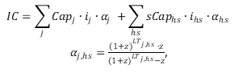

<h1><a class="anchor" id="cm-district-heating-supply-dispatch" href="#cm-district-heating-supply-dispatch"><i class="fa fa-link"></i></a>Odprema oskrbe z daljinskim ogrevanjem CM</h1><h2><a class="anchor" id="table-of-contents" href="#table-of-contents"><i class="fa fa-link"></i></a> Kazalo</h2><ul><li> <a href="#in-a-glance">Na prvi pogled</a></li><li> <a href="#introduction">Uvod</a></li><li> <a href="#inputs-and-outputs">Vhodi in izhodi</a></li><li> <a href="#method">Metoda</a></li><li> <a href="#github-repository-of-this-calculation-module">Repozitorij GitHub tega modula za izračun</a></li><li> <a href="#sample-run">Vzorec teka</a></li><li> <a href="#how-to-cite">Kako citirati</a></li><li> <a href="#authors-and-reviewers">Avtorji in recenzenti</a></li><li> <a href="#license">Licenca</a></li><li> <a href="#acknowledgement">Zahvala</a></li></ul><h2><a class="anchor" id="in-a-glance" href="#in-a-glance"><i class="fa fa-link"></i></a> Na prvi pogled</h2>
 Ta modul lahko zaženete v dveh načinih: 1) odpošiljanje, 2) investiranje. V načinu odpreme izračuna stroškovno minimalno delovanje portfelja tehnologij za oskrbo s toploto v določenem sistemu daljinskega ogrevanja za vsako uro v letu. Vhodni podatki modula so urni profili za potrebe po toploti v omrežju, za potencialno oskrbo z toploto iz različnih virov in za cene nosilcev energije. Poleg tega so za vsako tehnologijo potrebni parametri stroškov in učinkovitosti. Modul prikazuje stroške oskrbe s toploto, delež uporabljenih nosilcev energije in predvidene emisije CO2. V načinu vlaganja modul optimizira zmogljivosti vgrajenih tehnologij za oskrbo s toploto, da pokrije potrebe po toploti.

 <a href="#table-of-contents"><strong><code>To Top</code></strong></a>
<h2><a class="anchor" id="introduction" href="#introduction"><i class="fa fa-link"></i></a> Uvod</h2>
 Ta modul lahko zaženete v dveh načinih: 1) odpošiljanje, 2) investiranje. V načinu odpreme izračuna stroškovno minimalno delovanje portfelja tehnologij za oskrbo s toploto v določenem sistemu daljinskega ogrevanja za vsako uro v letu. Vhodni podatki modula so urni profili za potrebe po toploti v omrežju, za potencialno oskrbo z toploto iz različnih virov in za cene nosilcev energije. Poleg tega so za vsako tehnologijo potrebni parametri stroškov in učinkovitosti. Modul prikazuje stroške oskrbe s toploto, delež uporabljenih nosilcev energije in predvidene emisije CO2. V načinu vlaganja modul optimizira zmogljivosti vgrajenih tehnologij za oskrbo s toploto, da pokrije potrebe po toploti.

 Modul odpreme oskrbe z daljinskim ogrevanjem je odpremni model, ki poskuša najti stroškovno optimalno rešitev za pokrivanje potrebe po toploti v vsaki uri v letu.

 Tu opisano metodo je treba razumeti kot prvi koncept in lahko odstopa od dejanske izvedbe (s tega vidika je treba videti kompleksnost modela, vložke in izhode itd.). Na tej wiki strani je razložena različica modula za izračun, ki je integriran v orodjarno. <strong>Samostojna različica</strong> modula za izračun je veliko bolj obsežna in jo lahko prenesete <strong><a href="https://github.com/tuw-eeg/hotmapsDispatch">TUKAJ</a></strong> . Ta različica pa zahteva osnovno znanje programiranja na python. <strong>Dokumentacijo</strong> samostojne različice najdete <strong><a href="https://hotmapsdispatch.readthedocs.io/en/latest/">TUKAJ</a></strong> .

 <a href="#table-of-contents"><strong><code>To Top</code></strong></a>
<h2><a class="anchor" id="inputs-and-outputs" href="#inputs-and-outputs"><i class="fa fa-link"></i></a> Vhodi in izhodi</h2><h3><a class="anchor" id="main-inputs" href="#main-inputs"><i class="fa fa-link"></i></a> Glavni vložki</h3>
 Modul zahteva dolgo paleto vhodnih parametrov. Glavni vhodni parametri pa so:
<ol><li> Poraba omrežja po toploti (izbrana regija)</li><li> Nameščene zmogljivosti generatorjev / hranilnikov toplote</li><li> Tehnični (izkoristki) in finančni parametri (opex, cappex, življenjska doba) generatorjev / skladišč toplote</li><li> Profili (časovne vrste potrebe po toploti, sončno sevanje, temperatura, cene električne energije itd.)</li></ol><h3><a class="anchor" id="main-outputs" href="#main-outputs"><i class="fa fa-link"></i></a> Glavni izhodi</h3>
 Glavni kazalniki učinka računskega modula so:
<ul><li> Stroški proizvodnje toplote</li><li> Naložbe, obratovanje in stroški goriva</li><li> Mešanica proizvodnje toplote na generator toplote</li><li> Emisije CO2</li><li> Ure polne obremenitve,</li></ul>
 <strong>POMEMBNO</strong> V emisijah Hotmaps emisije biomase ne veljajo za nič, ker je Hotmaps orodje, ki podpira tekoči energetski prehod. Upoštevanje biomase kot ogljično nevtralnega vira energije pomeni, da kurjenje biomase zmanjšuje trenutne skupne emisije v primerjavi s sežiganjem fosilnih goriv, kar ni res. Shranjevanje ogljikovega dioksida v drevesih traja desetletja, medtem ko se sprošča v ozračje naenkrat. Zato je neto ogljična bilanca biomase dolgoročno enaka nič, kratkoročno pa ne, ukrepi za ublažitev podnebnih sprememb pa morajo kratkoročno prinesti rezultate za zmanjšanje emisij ogljika.

 <a href="#table-of-contents"><strong><code>To Top</code></strong></a>
<h2><a class="anchor" id="method" href="#method"><i class="fa fa-link"></i></a> Metoda</h2>
 Modul je izveden kot linearni program in se lahko na eni strani uporablja kot čisti model odpreme, na drugi strani pa za načrtovanje naložb za pokrivanje profila obremenitve. Ciljna funkcija poskuša najti najmanjšo razliko med stroški oskrbe s toploto in prihodki od proizvodnje električne energije.
<h3><a class="anchor" id="equation-fragments-of-the-linear-program-" href="#equation-fragments-of-the-linear-program-"><i class="fa fa-link"></i></a> Fragmenti enačbe linearnega programa:</h3>

<h4> <a class="anchor" id="the-total-costs-<code>ctotal<-sub><-code>-yield-from-the-sum-of-" href="#the-total-costs-<code>ctotal<-sub><-code>-yield-from-the-sum-of-"><i class="fa fa-link"></i></a> Skupni stroški <code>c total</code> donos iz vsote:</h4><h5> <a class="anchor" id="investment-costs-<code>ic<-code>-installed-capacities-multiplied-by-the-annuities-of-the-specific-investment-costs" href="#investment-costs-<code>ic<-code>-installed-capacities-multiplied-by-the-annuities-of-the-specific-investment-costs"><i class="fa fa-link"></i></a> investicijski stroški <code>IC</code> (nameščene zmogljivosti pomnožene z anuitetami posebnih investicijskih stroškov)</h5>

<h5> <a class="anchor" id="captial-costs-<code>cc<-code>--" href="#captial-costs-<code>cc<-code>--"><i class="fa fa-link"></i></a> kapitalski stroški <code>CC</code> :</h5>

<h5> <a class="anchor" id="the-variable-costs-<code>opex<-code>--" href="#the-variable-costs-<code>opex<-code>--"><i class="fa fa-link"></i></a> spremenljivi stroški <code>OPEX</code> :</h5>

<h5><a class="anchor" id="ramp-costs-of-chp-and-waste-incineration-plants-rough-estimation--" href="#ramp-costs-of-chp-and-waste-incineration-plants-rough-estimation--"><i class="fa fa-link"></i></a> rampni stroški SPTE in sežigalnic odpadkov (groba ocena):</h5>

<h5><a class="anchor" id="assumed-costs-for-the-peak-electrical-load-in-the-winter-time-rough-estimation-" href="#assumed-costs-for-the-peak-electrical-load-in-the-winter-time-rough-estimation-"><i class="fa fa-link"></i></a> predvideni stroški največje električne obremenitve v zimskem času (groba ocena):</h5>

<h4> <a class="anchor" id="the-total-revenues-<code>revtotal<-sub><-code>-yield-from--" href="#the-total-revenues-<code>revtotal<-sub><-code>-yield-from--"><i class="fa fa-link"></i></a> Skupni prihodki <code>rev total</code> donos od ::</h4><h5><a class="anchor" id="the-sale-of-electricity-for-example-from-chp-plants-and-waste-incineration-plants.-" href="#the-sale-of-electricity-for-example-from-chp-plants-and-waste-incineration-plants.-"><i class="fa fa-link"></i></a> prodaja električne energije (na primer iz SPTE in sežigalnic):</h5>

 <a href="#table-of-contents"><strong><code>To Top</code></strong></a>
<h4><a class="anchor" id="legend" href="#legend"><i class="fa fa-link"></i></a> Legenda</h4>

 <a href="#table-of-contents"><strong><code>To Top</code></strong></a>
<h2><a class="anchor" id="github-repository-of-this-calculation-module" href="#github-repository-of-this-calculation-module"><i class="fa fa-link"></i></a> Repozitorij GitHub tega modula za izračun</h2>
 <a href="https://github.com/HotMaps/dispatch_module/tree/develop">Tukaj</a> najdete najboljši razvoj tega modula za izračun.

 <a href="#table-of-contents"><strong><code>To Top</code></strong></a>
<h2><a class="anchor" id="sample-run" href="#sample-run"><i class="fa fa-link"></i></a> Vzorec teka</h2>
 Ko izberete regijo in ne spremenite privzetih parametrov, se bo model zagnal v naložbenem načinu. To pomeni, da so nameščene zmogljivosti optimizirane tudi za optimalno pokritje stroškov glede potrebe po toploti.

 Spodaj si lahko ogledate vse vhodne parametre, ki jih je mogoče spremeniti
<h4><a class="anchor" id="output-indicators" href="#output-indicators"><i class="fa fa-link"></i></a> Izhodni kazalniki</h4><h4><a class="anchor" id="output-charts" href="#output-charts"><i class="fa fa-link"></i></a> Izhodne lestvice</h4>
 <a href="#table-of-contents"><strong><code>To Top</code></strong></a>
<h2><a class="anchor" id="how-to-cite" href="#how-to-cite"><i class="fa fa-link"></i></a> Kako citirati</h2>
 Jeton Hasani, v Hotmaps Wiki, CM Distribucija oskrbe z daljinskim ogrevanjem (september 2020)

 <a href="#table-of-contents"><strong><code>To Top</code></strong></a>
<h2><a class="anchor" id="authors-and-reviewers" href="#authors-and-reviewers"><i class="fa fa-link"></i></a> Avtorji in recenzenti</h2>
 To stran je napisal Jeton Hasani ( <strong><a href="https://eeg.tuwien.ac.at/">EEG - TU Wien</a></strong> ).

 ☑ To stran je pregledal Mostafa Fallahnejad ( <strong><a href="https://eeg.tuwien.ac.at/">EEG - TU Wien</a></strong> ).

 <a href="#table-of-contents"><strong><code>To Top</code></strong></a>
<h2><a class="anchor" id="license" href="#license"><i class="fa fa-link"></i></a> Licenca</h2>
 Avtorske pravice © 2016-2020: Jeton Hasani

 Creative Commons Attribution 4.0 International License

 To delo je licencirano pod licenco Creative Commons CC BY 4.0 International.

 Identifikator licence SPDX: CC-BY-4.0

 Besedilo licence: https://spdx.org/licenses/CC-BY-4.0.html

 <a href="#table-of-contents"><strong><code>To Top</code></strong></a>
<h2><a class="anchor" id="acknowledgement" href="#acknowledgement"><i class="fa fa-link"></i></a> Zahvala</h2>
 Najgloblje zahvaljujemo projektu Horizon 2020 <a href="https://www.hotmaps-project.eu">Hotmaps</a> (sporazum o dodelitvi sredstev št. 723677), ki je zagotovil sredstva za izvedbo te preiskave.

 <a href="#table-of-contents"><strong><code>To Top</code></strong></a>

<!--- THIS IS A SUPER UNIQUE IDENTIFIER -->

This page was automatically translated. View in another language:

[English](../en/CM-District-heating-supply-dispatch) (original) [Bulgarian](../bg/CM-District-heating-supply-dispatch)\* [Czech](../cs/CM-District-heating-supply-dispatch)\* [Danish](../da/CM-District-heating-supply-dispatch)\* [German](../de/CM-District-heating-supply-dispatch)\* [Greek](../el/CM-District-heating-supply-dispatch)\* [Spanish](../es/CM-District-heating-supply-dispatch)\* [Estonian](../et/CM-District-heating-supply-dispatch)\* [Finnish](../fi/CM-District-heating-supply-dispatch)\* [French](../fr/CM-District-heating-supply-dispatch)\* [Irish](../ga/CM-District-heating-supply-dispatch)\* [Croatian](../hr/CM-District-heating-supply-dispatch)\* [Hungarian](../hu/CM-District-heating-supply-dispatch)\* [Italian](../it/CM-District-heating-supply-dispatch)\* [Lithuanian](../lt/CM-District-heating-supply-dispatch)\* [Latvian](../lv/CM-District-heating-supply-dispatch)\* [Maltese](../mt/CM-District-heating-supply-dispatch)\* [Dutch](../nl/CM-District-heating-supply-dispatch)\* [Polish](../pl/CM-District-heating-supply-dispatch)\* [Portuguese (Portugal, Brazil)](../pt/CM-District-heating-supply-dispatch)\* [Romanian](../ro/CM-District-heating-supply-dispatch)\* [Slovak](../sk/CM-District-heating-supply-dispatch)\*  [Swedish](../sv/CM-District-heating-supply-dispatch)\* 

\* machine translated
