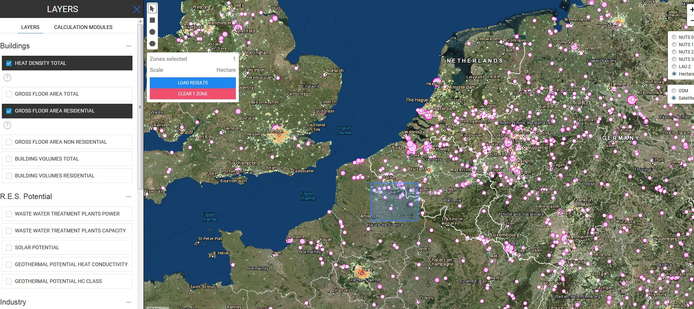

<h1><a class="anchor" id="welcome!" href="#welcome!"><i class="fa fa-link"></i></a>Dobrodošli!</h1><h2><a class="anchor" id="hotmaps-toolbox" href="#hotmaps-toolbox"><i class="fa fa-link"></i></a> Orodje za vroče karte</h2>
 Ogrevanje in hlajenje v stanovanjskem in industrijskem sektorju predstavljata polovico porabe energije v EU. Več kot 80% ogrevanja in hlajenja se še vedno proizvaja iz fosilnih goriv [ <a href="#references">1</a> ]. Medtem so tudi toplotne izgube občutno velike. Ta sektor je treba preoblikovati!

 Hotmaps ponuja odprtokodno spletno programsko opremo, ki na pregleden način podpira procese načrtovanja v energetskem sektorju na lokalni in nacionalni ravni. To je spletno mesto, ki vam omogoča, da v 5 minutah zagotovite prvo oceno povpraševanja po ogrevanju in hlajenju v kateri koli evropski regiji, pa tudi potenciala lokalne obnovljive energije, da se to povpraši. Nato lahko z uporabo podrobnejših podatkov in uporabo modulov za izračun Hotmaps izdelamo veliko bolj celovite strategije ogrevanja in hlajenja. Zahvaljujoč tej programski opremi boste lahko sprejemali praktične odločitve na območju, ki vas zanima (vas, mesto, mesto, regija itd.). Uporabnost Hotmaps je bila dokazana in dokazana na sedmih pilotnih področjih.

 Orodje Hotmaps so razvile vodilne raziskovalne ustanove po Evropi skupaj z mestnimi upravami. Obiščite spletno mesto s klikom <a href="https://www.hotmaps.eu/map">TUKAJ</a> in odkrijte podnebno nevtralno energetsko prihodnost svojega mesta.
<h2><a class="anchor" id="hotmaps-wiki" href="#hotmaps-wiki"><i class="fa fa-link"></i></a> Hotmaps Wiki</h2>
 Hotmaps Wiki gosti dokumentacijo, smernice in priročnik orodjarne Hotmaps. Sestavljen je iz naslednjih glavnih delov:
<ol><li> <strong>Nabori podatkov,</strong></li><li> <strong>Splošne funkcionalnosti orodjarne,</strong></li><li> <strong>Moduli za izračun,</strong></li><li> <strong>Kako uporabiti orodjarno Hotmaps?</strong></li><li> <strong>Razvijalci</strong> .</li></ol>
 Ti odseki so dostopni na vseh straneh Wiki v stranski vrstici.

 Oddelek <strong>Nabori podatkov</strong> vsebuje informacije o skladiščih nabora podatkov Hotmaps in metodologijah za zbiranje teh naborov podatkov.

 Oddelek <strong>Splošne funkcionalnosti in struktura orodja</strong> vodi uporabnika skozi vmesnik orodjarne. Poglavje zajema vse splošne vidike orodjarne, ki so povezani z uporabniško izkušnjo, npr. Krmarjenje po različnih delih orodjarne, izbira sloja, pridobivanje kazalnikov, nalaganje in izvoz funkcij itd.

 Razdelek <strong>Moduli za izračun</strong> ponuja poglobljeno razlago konceptov in metodologij za moduli za izračun. Poleg razlage metodologije uporabljeni primeri in preizkusi za vsak računski modul pomagajo uporabniku razumeti vhodne parametre in izhodne rezultate. Nekateri računski moduli so integrirani v orodjarno, drugi pa so samostojni.

 Poglavje &quot; <strong>Kako uporabiti orodjarno Hotmaps?</strong> &quot; Je eno najpomembnejših odsekov tega wikija. Uporabnikom Hotmaps pomaga uporabnikom pri načrtovanju ogrevanja in hlajenja z orodjem Hotmaps in vključuje smernice za uporabo Hotmaps na lokalni in nacionalni ravni ter gradiva za usposabljanje. Ta odsek prikazuje, kako lahko z različnimi računskimi moduli analiziramo različne vidike ogrevalnega in hladilnega sistema ter različna raziskovalna vprašanja. Poleg tega prikazuje, kako lahko računske module uporabimo tudi kot verigo orodij za izpeljavo scenarijev ogrevanja in hlajenja določenih območij. Ta veriga orodij je shematsko prikazana spodaj:

 Za dodatne podpore pri načrtovanju ogrevanja in hlajenja si oglejte priročnike Hotmaps in stran gradiva za usposabljanje:
<ul><li> <a href="https://www.hotmaps-project.eu/wp-content/uploads/2019/04/Summary-Hotmaps-Handbook.pdf">Povzetek priročnikov Hotmaps za strateško načrtovanje toplote</a></li><li> <a href="https://vbn.aau.dk/da/publications/definition-amp-experiences-of-strategic-heat-planning">Priročnik 1 - Opredelitev in izkušnje strateškega načrtovanja toplote</a></li><li> <a href="https://vbn.aau.dk/da/publications/guidance-for-the-comprehensive-assessment-of-efficient-heating-an">Priročnik 2 - Smernice za celovito oceno učinkovitega ogrevanja in hlajenja</a></li><li> <a href="https://vbn.aau.dk/da/publications/appendix-report-to-the-hotmaps-handbook-for-strategic-heat-planni">Poročilo v prilogi k Priročniku za strateško načrtovanje toplote: Opisi primerov</a></li><li> <a href="https://wiki.hotmaps.hevs.ch/Training-Material">Vadbeni material</a></li></ul>
 Oddelek za <strong>razvijalce</strong> vsebuje vse informacije, ki jih morajo razvijalci prispevati v orodjarno Hotmaps ali razumeti, kako to deluje. Pojasnjuje IT infrastrukturo orodja Hotmaps, integracijo nabora podatkov, prispevek k razvoju modula za izračun itd.

 <strong>Wiki Hotmaps je živ dokument</strong> , tj. Raste, ko orodjarna Hotmaps raste. Razvijalci Hotmaps še naprej posodabljajo strani Hotmaps Wiki z uvajanjem novih posodobitev, izboljšav, funkcionalnosti in modulov za izračun. Za <a href="Guidelines-for-writing-a-Hotmaps-Wiki-page">pisanje Wiki strani Hotmaps</a> uporabite te <a href="Guidelines-for-writing-a-Hotmaps-Wiki-page">smernice</a> .

 Upamo, da boste uživali v raziskovanju orodij in vam bodo pomagali pri načrtovanju ogrevanja in hlajenja!

 <strong>ZABAVITE SE Z RAZISKOVANJEM ORODJA ZA HOTMAPS!</strong>
<h2><a class="anchor" id="references" href="#references"><i class="fa fa-link"></i></a> Reference</h2>
 [1] Projekt EU H2020: Kartiranje in analize sedanje in prihodnje (2020 - 2030) uporabe ogrevalnega / hladilnega goriva (fosilni / obnovljivi viri). Poročilo WP1. 2016. dostopno prek https://ec.europa.eu/energy/sites/ener/files/documents/Report%20WP1.pdf

<ins> <code><strong><a href="#hotmaps-toolbox">To Top</a></strong></code></ins>
<h2><a class="anchor" id="how-to-cite" href="#how-to-cite"><i class="fa fa-link"></i></a> Kako citirati</h2>
 Ekipa Hotmaps, na Hotmaps-Wiki, pozdravna stran (september 2020)

<ins> <code><strong><a href="#hotmaps-toolbox">To Top</a></strong></code></ins>
<h2><a class="anchor" id="authors-and-reviewers" href="#authors-and-reviewers"><i class="fa fa-link"></i></a> Avtorji in recenzenti</h2>
 To stran je napisala ekipa Hotmaps in sicer:

 <strong><a href="https://eeg.tuwien.ac.at/">EEG - TU Wien</a></strong> : Lukas Kranzl, Mostafa Fallahnejad, Jeton Hasani

 <strong><a href="https://www.crem.ch/">CREM</a></strong> : Thierry Bernhard, Lesly Houndole, Albain Dufils

 <strong><a href="https://e-think.ac.at">e-razmislek</a></strong> : Marcus Hummel, Andreas Müller, Giulia Conforto, David Schmidinger

 <strong><a href="http://www.eurac.edu">EURAC</a></strong> : Pietro Zambelli, Giulia Garegnani, Simon Pezzutto

 <strong><a href="https://isi.fraunhofer.de/">Fraunhofer ISI</a></strong> : Ali Aydemir, David Schilling, Lisa Neusel, Tobias Fleiter

 <strong><a href="https://www.hevs.ch">HES-SO</a></strong> : Daniel Hunacek, Lucien Zuber, Matthieu Dayer

 <strong><a href="https://planenergi.dk/">Planenergie</a></strong> : Anders M. Odgaard

 ☑ To stran je pregledala Giulia Conforto.

 <a href="#table-of-contents"><strong><code>To Top</code></strong></a>
<h2><a class="anchor" id="license" href="#license"><i class="fa fa-link"></i></a> Licenca</h2>
 Avtorske pravice © 2016-2020: Lukas Kranzl, Mostafa Fallahnejad, Jeton Hasani, Thierry Bernhard, Lesly Houndole in Albain Dufils, Marcus Hummel, Giulia Conforto, David Schmidinger, Pietro Zambelli, Giulia Garegnani, Ali Aydemir, David Schilling, Lisa Neuseiter, Tobias , Daniel Hunacek, Lucien Zuber, Matthieu Dayer.

 Creative Commons Attribution 4.0 International License

 To delo je licencirano pod licenco Creative Commons CC BY 4.0 International.

 Identifikator licence SPDX: CC-BY-4.0

 Besedilo licence: https://spdx.org/licenses/CC-BY-4.0.html

<ins> <code><strong><a href="#hotmaps-toolbox">To Top</a></strong></code></ins>
<h2><a class="anchor" id="acknowledgement" href="#acknowledgement"><i class="fa fa-link"></i></a> Zahvala</h2>
 Najgloblje zahvaljujemo projektu Horizon 2020 <a href="https://www.hotmaps-project.eu">Hotmaps</a> (sporazum o dodelitvi sredstev št. 723677), ki je zagotovil sredstva za izvedbo te preiskave.

<ins> <code><strong><a href="#hotmaps-toolbox">To Top</a></strong></code></ins>

<!--- THIS IS A SUPER UNIQUE IDENTIFIER -->

This page was automatically translated. View in another language:

[English](../en/Home) (original) [Bulgarian](../bg/Home)\* [Czech](../cs/Home)\* [Danish](../da/Home)\* [German](../de/Home)\* [Greek](../el/Home)\* [Spanish](../es/Home)\* [Estonian](../et/Home)\* [Finnish](../fi/Home)\* [French](../fr/Home)\* [Irish](../ga/Home)\* [Croatian](../hr/Home)\* [Hungarian](../hu/Home)\* [Italian](../it/Home)\* [Lithuanian](../lt/Home)\* [Latvian](../lv/Home)\* [Maltese](../mt/Home)\* [Dutch](../nl/Home)\* [Polish](../pl/Home)\* [Portuguese (Portugal, Brazil)](../pt/Home)\* [Romanian](../ro/Home)\* [Slovak](../sk/Home)\*  [Swedish](../sv/Home)\* 

\* machine translated
