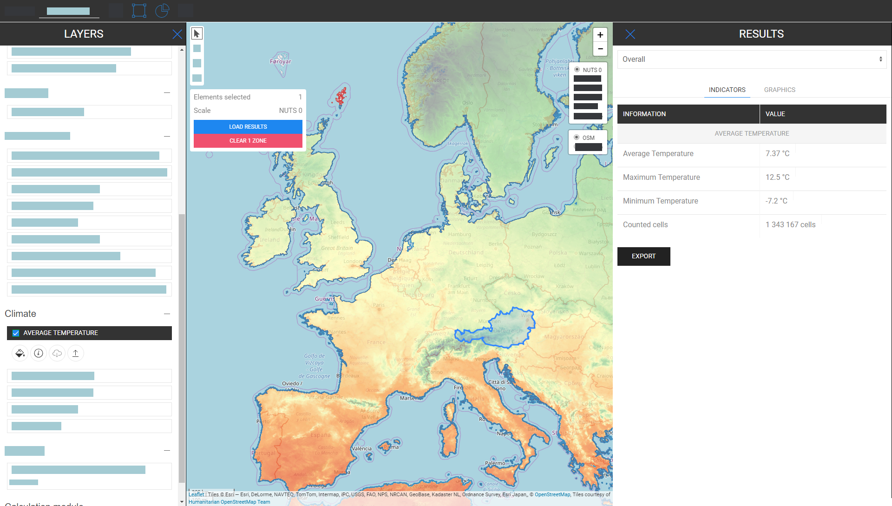

<h1><a class="anchor" id="introduction-to-user-interface" href="#introduction-to-user-interface"><i class="fa fa-link"></i></a>Uvod v uporabniški vmesnik</h1><h2><a class="anchor" id="table-of-contents" href="#table-of-contents"><i class="fa fa-link"></i></a> Kazalo</h2><ul><li>
 <a href="#introduction-page">Uvodna stran</a>
</li><li>
 <a href="#upper-toolbar">Zgornja orodna vrstica</a>
<ul><li> <a href="#upper-toolbar_connect">Povežite se</a><ul><li> <a href="#upper-toolbar_connect_login">Vpiši se</a></li><li> <a href="#upper-toolbar_connect_register">Registrirajte se</a></li><li> <a href="#upper-toolbar_connect_recover">Okrevanje</a></li></ul></li><li> <a href="#upper-toolbar_go-to-place">Pojdi na kraj</a></li><li> <a href="#upper-toolbar_layers">Plasti</a></li><li> <a href="#upper-toolbar_selection-tools">Izbirna orodja</a></li><li> <a href="#upper-toolbar_show-result">Pokaži rezultat</a></li><li> <a href="#upper-toolbar_feedback">Povratne informacije</a></li><li> <a href="#upper-toolbar_save-session">Shrani sejo</a></li><li> <a href="#upper-toolbar_save-session-folder">Shrani mapo seje</a></li></ul></li><li>
 <a href="#tiles">Ploščice</a>
</li><li>
 <a href="#how-to-cite">Kako citirati</a>
</li><li>
 <a href="#authors-and-reviewers">Avtorji in recenzenti</a>
</li><li>
 <a href="#license">Licenca</a>
</li><li>
 <a href="#acknowledgement">Zahvala</a>
</li></ul><h2><a class="anchor" id="introduction-page" href="#introduction-page"><i class="fa fa-link"></i></a> Uvodna stran</h2>
 Ko se orodjarna odpre, se prikaže stran z zavrnitvijo. Poleg sporočila o zavrnitvi odgovornosti so na voljo dodatne informacije o podprtih brskalnikih, ciljih projekta Hotmaps, povezava do spletnega mesta projekta Hotmaps in repozitoriji podatkov.

 <em>Slika 1 Kratek uvod v orodjarno Hotmaps</em>

 GUI Hotmaps je vmesnik, ki temelji na GIS. Ko zapre stran z zavrnitvijo, uporabnik vidi zemljevid Evrope. Privzeto je prikazan zemljevid gostote povpraševanja po toploti držav EU-28 in meje NUTS 2. Poleg teh dveh zemljevidov je v GUI mogoče videti tudi nekaj orodij in gumbov. Ta orodja so prikazana na naslednji sliki.

 <em>Slika 2 Začetna stran</em>

 Tu lahko na prvi pogled opazite 3 dele uporabniškega vmesnika:
<ol><li> <a href="#upper-toolbar">orodna vrstica zgoraj levo</a> ,</li><li> zemljevid sam,</li><li> <a href="#tiles">nekaj orodij za spreminjanje sloga zemljevida</a> .</li><li> dve povezavi zgoraj desno: na ta <a href="https://wiki.hotmaps.eu/">Wiki Hotmaps</a> in na <a href="https://www.hotmaps-project.eu/">spletno mesto projekta Hotmaps</a> .</li></ol>
 V naslednjih poglavjih so podrobno razložene prve 3 točke.

 <a href="#table-of-contents"><strong><code>To Top</code></strong></a>
<h2><a class="anchor" id="upper-toolbar" href="#upper-toolbar"><i class="fa fa-link"></i></a> Zgornja orodna vrstica</h2>

 S to orodno vrstico lahko:
<ol><li> <a href="#upper-toolbar_connect"><em>Connect:</em></a> registrirajte se in se prijavite v spletno aplikacijo, da shranite svoje delo,</li><li> <a href="#upper-toolbar_go-to-place"><em>Pojdi na kraj:</em></a> povečajte določeno regijo z vpisom imena,</li><li> <a href="#upper-toolbar_layers"><em>Sloji:</em></a> prikaže stransko vrstico sloja,</li><li> <a href="#upper-toolbar_selection-tools"><em>Izbirna orodja</em> :</a> omogoči ali onemogoči izbirna orodja,</li><li> <a href="#upper-toolbar_show-result"><em>Pokaži rezultat:</em></a> prikaže stransko vrstico z rezultati za izbrane regije,</li><li> <a href="#upper-toolbar_feedback"><em>Povratne informacije:</em></a> pošljite nam povratne informacije glede orodja,</li><li> <a href="#upper-toolbar_save-session"><em>Save Session:</em></a> izbrane sloje lahko shranite in povečate ter jih pozneje prikličete,</li><li> <a href="#upper-toolbar_save-session-folder"><em>Mapa shranjevanja seje:</em></a> kjer si lahko ogledate seznam vseh shranjenih sej.</li></ol>
 <a href="#table-of-contents"><strong><code>To Top</code></strong></a>
<h3><a class="anchor" id="connect" href="#connect"><i class="fa fa-link"></i></a> Povežite se</h3>
 Tukaj lahko:
<ul><li> Ustvari račun</li><li> Prijavite se v svoj račun, da shranite napredek</li><li> Ali pa ponastavite geslo, če ste ga pozabili</li></ul>
 <a href="#table-of-contents"><strong><code>To Top</code></strong></a>
<h4><a class="anchor" id="login" href="#login"><i class="fa fa-link"></i></a> Vpiši se</h4>
 Po <a href="#register">registraciji</a> in aktivaciji računa se boste morali lahko prijaviti s svojim e-poštnim <a href="#fig4">naslovom</a> in geslom (glejte sliko <a href="#fig4">4</a> spodaj).

 <em>Slika 4 .: Obrazec za prijavo</em>

 <a href="#table-of-contents"><strong><code>To Top</code></strong></a>
<h4><a class="anchor" id="register" href="#register"><i class="fa fa-link"></i></a> Registrirajte se</h4>
 Tu lahko ustvarite račun za spletno mesto <em>hitrih map</em> . Po oddaji <a href="#fig5">obrazca</a> boste prejeli e-poštno sporočilo za aktivacijo računa. S svojim računom boste lahko shranili napredek.

 <em>Slika 5 .: Obrazec za registracijo</em>

 <a href="#table-of-contents"><strong><code>To Top</code></strong></a>
<h4><a class="anchor" id="recover" href="#recover"><i class="fa fa-link"></i></a> Okrevanje</h4>
 Če kdaj pozabite geslo, ga lahko obnovite v tem meniju (glejte sliko <a href="#fig6">6</a> spodaj). Prosimo, upoštevajte, da nato nastavite novo geslo.

 <em>Slika 6 .: Obrazec za obnovitev</em>

 <a href="#table-of-contents"><strong><code>To Top</code></strong></a>
<h3><a class="anchor" id="go-to-place" href="#go-to-place"><i class="fa fa-link"></i></a> Pojdi na kraj</h3>
 Do določenega območja lahko povečate tako, da vnesete njegovo ime (glejte spodnjo animacijo)

 <a href="#table-of-contents"><strong><code>To Top</code></strong></a>
<h3><a class="anchor" id="layers" href="#layers"><i class="fa fa-link"></i></a> Plasti</h3>
 S pritiskom na ta gumb se na levi strani prikaže stranska vrstica z različnimi vrstami slojev.

 Najti in vizualizirati je mogoče naslednje sloje:

 <a href="#table-of-contents"><strong><code>To Top</code></strong></a>
<h3><a class="anchor" id="selection-tools" href="#selection-tools"><i class="fa fa-link"></i></a> Izbirna orodja</h3>
 S pritiskom na ta gumb se na levi strani zaslona prikažejo izbirna orodja

 Spodnja slika prikazuje videz orodij:

<ol><li> Orodje za izbiro regij</li><li> Ustvarite kvadratno regijo po meri</li><li> Ustvarite območje kroga po meri</li><li> Ustvarite poligon po meri</li><li> Naložite objekt GeoJSON, če želite uporabiti izbiro območja po meri</li></ol><ol type="A"><li> prikazuje, koliko regij ste izbrali</li><li> prikazuje celotno površino najmanjšega pravokotnika, ki lahko pokriva izbrano območje</li><li> prikazuje lestvico, ki ste jo izbrali v desni orodni vrstici</li></ol><ol type="a"><li> gumb za nalaganje rezultatov izbrane regije in izbranih slojev</li><li> za brisanje izbrane regije</li></ol>
 <a href="#table-of-contents"><strong><code>To Top</code></strong></a>
<h3><a class="anchor" id="show-result" href="#show-result"><i class="fa fa-link"></i></a> Pokaži rezultat</h3>
 Rezultati, ki ste jih izbrali za svojo konfiguracijo, so prikazani v stranski vrstici na desni strani zaslona

 <a href="#table-of-contents"><strong><code>To Top</code></strong></a>
<h3><a class="anchor" id="feedback" href="#feedback"><i class="fa fa-link"></i></a> Povratne informacije</h3>
 Imate kakšen predlog, kako izboljšati orodje? Ste opazili kakšne napake? Prosim, sporoči nam! Če nam pošljete povratne informacije, nam lahko pomagate izboljšati orodje!

 Izpolnite spodnji <a href="#Fig7">obrazec</a> :

 <a href="#table-of-contents"><strong><code>To Top</code></strong></a>

 izbirate lahko med naslednjimi vrstami:

 in določite prednost:

 <a href="#table-of-contents"><strong><code>To Top</code></strong></a>
<h3><a class="anchor" id="save-session" href="#save-session"><i class="fa fa-link"></i></a> Shrani sejo</h3>
 s pritiskom na ta gumb lahko naredite posnetek svojega dela (izbrana območja in plasti, stopnje povečave itd.). Določite lahko tudi ime in opis posnetka.
<h3><a class="anchor" id="save-session-folder" href="#save-session-folder"><i class="fa fa-link"></i></a> Shrani mapo seje</h3>
 Tu si lahko ogledate vse vaše posnetke z njihovimi imeni in opisi. Ko izberete eno, se naložijo izbrani sloji, območja, stopnja povečave in druga konfiguracija.
<h2><a class="anchor" id="tiles" href="#tiles"><i class="fa fa-link"></i></a> Ploščice</h2>
 Izberete lahko teritorialno lestvico, ki jo želite analizirati (regije NUTS ali raven hektarjev), in nastavite ploščico zemljevida

 Možne so naslednje konfiguracije

<ol><li> Povečajte in pomanjšajte zemljevid</li><li> Pokažite meje NUTS, da izberete določene regije NUTS, ali uporabite hektar, da prilagodite svojo <a href="#upper-toolbar_selection-tools">izbiro</a></li><li> Uporabite ploščico OpenStreetMap ali ploščico Satelite</li></ol>
 <a href="#table-of-contents"><strong><code>To Top</code></strong></a>
<h2><a class="anchor" id="how-to-cite" href="#how-to-cite"><i class="fa fa-link"></i></a> Kako citirati</h2>
 Jeton Hasani, v Hotmaps-Wiki, Uvod v uporabniški vmesnik (april 2019)

 <a href="#table-of-contents"><strong><code>To Top</code></strong></a>
<h2><a class="anchor" id="authors-and-reviewers" href="#authors-and-reviewers"><i class="fa fa-link"></i></a> Avtorji in recenzenti</h2>
 To stran je napisal Jeton Hasani <strong><a href="https://eeg.tuwien.ac.at/">EEG - TU Wien</a></strong> .

 Page To stran je pregledal Mostafa Fallahnejad <strong><a href="https://eeg.tuwien.ac.at/">EEG - TU Wien</a></strong> .

 <a href="#table-of-contents"><strong><code>To Top</code></strong></a>
<h2><a class="anchor" id="license" href="#license"><i class="fa fa-link"></i></a> Licenca</h2>
 Avtorske pravice © 2016-2020: Jeton Hasani

 Creative Commons Attribution 4.0 International License

 To delo je licencirano pod licenco Creative Commons CC BY 4.0 International.

 Identifikator licence SPDX: CC-BY-4.0

 Besedilo licence: https://spdx.org/licenses/CC-BY-4.0.html

 <a href="#table-of-contents"><strong><code>To Top</code></strong></a>
<h2><a class="anchor" id="acknowledgement" href="#acknowledgement"><i class="fa fa-link"></i></a> Zahvala</h2>
 Radi bi izraziti našo najglobljo zahvalo Horizon 2020 <a href="https://www.hotmaps-project.eu">Hotmaps projekta</a> (Sporazum o dodelitvi sredstev številka 723677), ki je zagotovil sredstva za izvedbo te preiskave.

 <a href="#table-of-contents"><strong><code>To Top</code></strong></a>

<!--- THIS IS A SUPER UNIQUE IDENTIFIER -->

This page was automatically translated. View in another language:

[English](../en/Introduction-to-user-interface) (original) [Bulgarian](../bg/Introduction-to-user-interface)\* [Czech](../cs/Introduction-to-user-interface)\* [Danish](../da/Introduction-to-user-interface)\* [German](../de/Introduction-to-user-interface)\* [Greek](../el/Introduction-to-user-interface)\* [Spanish](../es/Introduction-to-user-interface)\* [Estonian](../et/Introduction-to-user-interface)\* [Finnish](../fi/Introduction-to-user-interface)\* [French](../fr/Introduction-to-user-interface)\* [Irish](../ga/Introduction-to-user-interface)\* [Croatian](../hr/Introduction-to-user-interface)\* [Hungarian](../hu/Introduction-to-user-interface)\* [Italian](../it/Introduction-to-user-interface)\* [Lithuanian](../lt/Introduction-to-user-interface)\* [Latvian](../lv/Introduction-to-user-interface)\* [Maltese](../mt/Introduction-to-user-interface)\* [Dutch](../nl/Introduction-to-user-interface)\* [Polish](../pl/Introduction-to-user-interface)\* [Portuguese (Portugal, Brazil)](../pt/Introduction-to-user-interface)\* [Romanian](../ro/Introduction-to-user-interface)\* [Slovak](../sk/Introduction-to-user-interface)\*  [Swedish](../sv/Introduction-to-user-interface)\* 

\* machine translated
